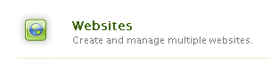

# Contenuto sandbox iniziale {#initial-sandbox-content}

In questa sezione verranno create le pagine seguenti che utilizzano tutte il [modello di pagina](initial-app.md#createthepagetemplate):

* Sito sandbox SCF, che reindirizza alla versione inglese della pagina principale.

   * SCF Sandbox: la pagina principale per la versione inglese del sito.

   * SCF Play: elemento secondario della pagina principale in cui eseguire la riproduzione.

Questo tutorial non viene approfondito in [copie per lingua](../../help/sites-administering/tc-prep.md). È invece progettato in modo che la pagina principale possa implementare il rilevamento della lingua preferita per l’utente tramite l’intestazione HTML e reindirizzare alla pagina principale appropriata per la lingua. La convenzione prevede l’utilizzo del codice del paese di due lettere per il nome del nodo della pagina, ad esempio &quot;en&quot; per l’inglese e &quot;fr&quot; per il francese.

## Crea prime pagine {#create-first-pages}

Ora che è presente un [modello di pagina](initial-app.md#createthepagetemplate), è possibile stabilire la pagina principale del sito Web nella directory /content.

1. L’interfaccia utente standard fornisce attualmente i blueprint per la creazione di siti. Poiché questo tutorial sta creando un sito semplice, è utile l’interfaccia utente classica.

   Per passare all’interfaccia classica, seleziona la navigazione globale e passa il puntatore del mouse sul lato destro dell’icona Progetti. Seleziona l&#39;icona *Passa all&#39;interfaccia classica* che viene visualizzata:

   

   La possibilità di passare all&#39;interfaccia classica deve essere [abilitata da un amministratore](../../help/sites-administering/enable-classic-ui.md).

1. Dalla [pagina iniziale dell&#39;interfaccia utente classica](http://localhost:4502/welcome.html), selezionare **[!UICONTROL Siti Web]**.

   

   In alternativa, è possibile accedere direttamente all&#39;interfaccia utente classica per i siti Web navigando su [/siteadmin.](http://localhost:4502/siteadmin)

1. Nel riquadro dell&#39;elenco delle cartelle selezionare **[!UICONTROL Siti Web]**, quindi nella barra degli strumenti selezionare **[!UICONTROL Nuovo]** > **[!UICONTROL Nuova pagina]**.

   Nella finestra di dialogo **[!UICONTROL Crea pagina]**, immetti quanto segue:

   * Titolo: `SCF Sandbox Site`
   * Nome: `an-scf-sandbox`
   * Seleziona **[!UICONTROL un modello di riproduzione sandbox SCF]**
   * Fai clic su **[!UICONTROL Crea]**.

   

1. Nel riquadro dell&#39;elenco delle cartelle selezionare la pagina creata, `/Websites/SCF Sandbox Site`, quindi fare clic su **[!UICONTROL Nuova]** > **[!UICONTROL Nuova pagina]**:

   * Titolo: `SCF Sandbox`
   * Nome: `en`
   * Seleziona **[!UICONTROL un modello di riproduzione sandbox SCF]**
   * Fai clic su **[!UICONTROL Crea]**.

1. Nel riquadro dell&#39;elenco delle cartelle selezionare la pagina creata, `/Websites/SCF Sandbox Site/SCF Sandbox`, quindi fare clic su **[!UICONTROL Nuova]** > **[!UICONTROL Nuova pagina]**

   * Titolo: `SCF Play`
   * Nome: `play`
   * Seleziona **[!UICONTROL un modello di riproduzione sandbox SCF]**
   * Fai clic su **[!UICONTROL Crea]**.

1. Questo è il modo in cui il sito web viene ora visualizzato nella console Siti web. Le pagine figlie dell&#39;elemento selezionato nel riquadro dell&#39;elenco delle cartelle vengono visualizzate nel riquadro di destra, dove possono essere gestite.

   

   Questa è la visualizzazione dell’archivio di ciò che è stato creato utilizzando lo strumento Sito web e il modello:

   

## Aggiungere il percorso di progettazione {#add-the-design-path}

Quando ` [/etc/designs/an-scf-sandbox](setup-website.md#setupthedesigntreeetcdesigns)` è stato creato utilizzando la sezione delle progettazioni della console Strumenti, la proprietà &quot;

* `cq:template="/libs/wcm/core/templates/designpage"`

È stato definito, che consente di fare riferimento facoltativo alle risorse di progettazione in uno script utilizzando `currentDesign.getPath()`. Ad esempio

* `% String favIcon = currentDesign.getPath() + "/favicon.ico"; %`

   * Nome: `cq:designPath`
   * Tipo: `String`
   * Valore: `/etc/designs/an-scf-sandbox`

* Fai clic sul `[+] Add` verde

L’archivio dovrebbe essere visualizzato come segue:

* Fai clic su **[!UICONTROL Salva tutto]**

In caso di problemi durante il salvataggio della configurazione, effettua di nuovo l’accesso e configura di nuovo.

>[!NOTE]
>
>L&#39;utilizzo di `cq:designPath` è facoltativo e non è correlato all&#39;[utilizzo di clientlibs](develop-app.md#includeclientlibsintemplate), che sono necessari perché i componenti SCF utilizzano [clientlibs](client-customize.md#clientlibs-for-scf) per gestire JS e CSS.
