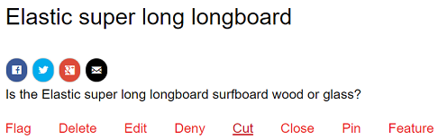
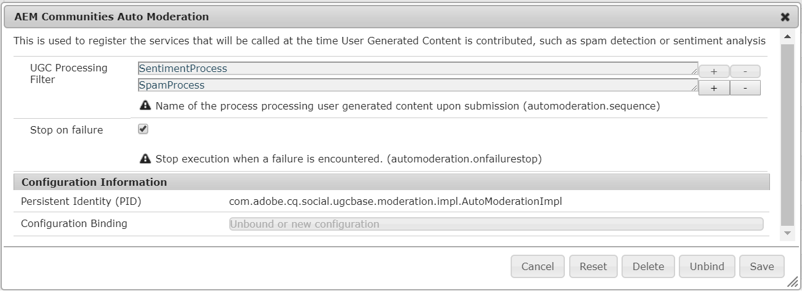

# Moderazione del contenuto della community {#moderating-community-content}

## Panoramica {#overview}

Il contenuto della community, noto anche come contenuto generato dall’utente (UGC, user generated content), viene creato quando un membro (registrato nel visitatore del sito) pubblica contenuto da un sito della community pubblicato tramite l’interazione con uno dei seguenti componenti della community:

* [Blog](/help/communities/blog-feature.md): i membri pubblicano un articolo o un commento del blog.
* [Calendario](/help/communities/calendar.md): i membri pubblicano un evento o un commento del calendario.
* [Commenti](/help/communities/comments.md): i membri pubblicano un commento o una risposta a un commento.

* [Forum](/help/communities/forum.md): i membri pubblicano un nuovo argomento o rispondono a un argomento.
* [Ideazione](/help/communities/ideation-feature.md): i membri pubblicano un&#39;idea o un commento.
* [QnA](/help/communities/working-with-qna.md): i membri creano una domanda o rispondono a una domanda.
* [Recensioni](/help/communities/reviews.md): i membri pubblicano un commento durante la valutazione di un elemento.

La moderazione di UGC è utile per riconoscere contributi positivi e limitare quelli negativi (come spam e linguaggio offensivo). UGC può essere moderato da diversi ambienti:

* [Archivio di contenuti community](working-with-srp.md)

* [Console di moderazione di massa](moderation.md)

   La console Moderazione è accessibile sia dagli amministratori che dai moderatori [della](/help/communities/users.md) community nell’ambiente pubblico, sia dagli amministratori nell’ambiente di authoring. Questo è possibile quando il contenuto della community viene memorizzato in uno store comune.

* [Moderazione contestuale](in-context.md)

   La moderazione nell’ambiente di pubblicazione può essere eseguita da amministratori e moderatori della community direttamente sulla pagina in cui è stato pubblicato il contenuto.

## Azioni di moderazione {#moderation-actions}

Le azioni che possono essere eseguite sul contenuto pubblicato (UGC) variano a seconda dell&#39;identità dell&#39;utente e dell&#39;ambiente. La tabella seguente utilizza la seguente terminologia per descrivere i vari ruoli in base all&#39;identità dell&#39;utente:

* `Admin`

   Utente membro del gruppo [community-amministratori](users.md) .

* `Moderator`

   Un membro di un gruppo di moderatori  community (con autorizzazioni moderatore).

* `Creator`

   Utente che ha pubblicato il contenuto.

* `Member`

   Un utente con accesso senza autorizzazioni speciali.

* `Visitor`

   Un utente anonimo.

<table>
 <tbody>
  <tr>
   <td> </td>
   <td><strong>Amministratore</strong></td>
   <td><strong>Moderatore</strong></td>
   <td><strong>Creatore</strong></td>
   <td><strong>Membro</strong></td>
   <td><strong>Visitatore</strong></td>
   <td><strong>Attivazione evento </strong></td>
   <td><strong>Premoderato</strong></td>
  </tr>
  <tr>
   <td><strong>Modifica/  Elimina</strong></td>
   <td>X</td>
   <td>X</td>
   <td>X</td>
   <td> </td>
   <td> </td>
   <td> </td>
   <td> </td>
  </tr>
  <tr>
   <td><strong>Taglia</strong></td>
   <td>X</td>
   <td>X</td>
   <td> </td>
   <td> </td>
   <td> </td>
   <td> </td>
   <td> </td>
  </tr>
  <tr>
   <td><strong>Rifiuta</strong></td>
   <td>X</td>
   <td>X</td>
   <td> </td>
   <td> </td>
   <td> </td>
   <td>X</td>
   <td> </td>
  </tr>
  <tr>
   <td><strong>Chiudi/  Riapri</strong></td>
   <td>X</td>
   <td>X</td>
   <td> </td>
   <td> </td>
   <td> </td>
   <td>X</td>
   <td>X  </td>
  </tr>
  <tr>
   <td><strong>Flag/  Unflag</strong></td>
   <td>X</td>
   <td>X</td>
   <td> </td>
   <td>X</td>
   <td> </td>
   <td>X</td>
   <td> </td>
  </tr>
  <tr>
   <td><strong>Consenti</strong></td>
   <td>X</td>
   <td>X</td>
   <td> </td>
   <td> </td>
   <td> </td>
   <td>X</td>
   <td>X</td>
  </tr>
 </tbody>
</table>

### Modifica/Elimina {#edit-delete}

Dopo che un post è stato creato, può essere modificato o eliminato dal creatore, da un amministratore o da un moderatore della community.

Quando viene eliminato, l&#39;UGC viene rimosso dall&#39;archivio e potrebbe non essere recuperato.

### Taglia {#cut}

Un amministratore o un moderatore della community può spostare uno o più argomenti del forum o domande di QnA da una posizione all’altra. Ciò include da un sito community a un altro sito community, a condizione che lo stesso membro disponga di privilegi di moderazione su entrambi i siti.

Selezionando l’azione Taglia, il contenuto viene copiato negli Appunti. Più post possono essere copiati e spostati come gruppo nella nuova posizione.

Nell&#39;altra posizione, quando il contenuto è presente negli Appunti, accanto a Nuovo post è visibile un pulsante Incolla con un numero che identifica il numero di post da incollare. Il pulsante Incolla include un&#39;opzione per cancellare gli Appunti invece di incollare.

### Rifiuta {#deny}

Un moderatore potrebbe impedire che UGC resti visibile sul sito pubblicato. Per gli amministratori e i moderatori della community, il post è ancora disponibile ed è annotato come spam.

### Chiudi/Riapri {#close-reopen}

L’azione Chiudi viene eseguita sull’intero thread della conversazione (un argomento del forum o il commento iniziale) e include tutti i post o le risposte successivi.

Se chiuso, non solo non sono possibili ulteriori risposte, non sono consentite nemmeno azioni di moderazione.

Per eseguire qualsiasi operazione, è necessario riaprire l&#39;argomento o il commento.

L’azione Chiudi/Riapri può essere eseguita da amministratori o moderatori della community.

### Flag/Unflag {#flag-unflag}

Contrassegno è un mezzo per qualsiasi membro che ha effettuato l’accesso, ad eccezione del creatore del contenuto, per indicare che si è verificato un problema con il contenuto di un post. Una volta contrassegnata, viene visualizzata un&#39;icona di annullamento del contrassegno che consente allo stesso membro di annullare l&#39;flag del contenuto.

La moderazione contestuale può essere configurata per consentire ai membri di selezionare un motivo durante la segnalazione di un post. L&#39;elenco dei motivi di flag selezionabili è configurabile, specificando se è possibile immettere o meno un motivo personalizzato. Il motivo del flag viene salvato con l&#39;UGC, ma il motivo non attiva alcuna azione particolare. Solo il numero di flag attiva una notifica. Il contenuto contrassegnato viene annotato come tale, in modo che i moderatori possano agire su di esso.

Il sistema tiene traccia di tutti i flag, che sono stati contrassegnati, e del motivo del flag e invia un evento quando la soglia è stata raggiunta. Se l&#39;UGC è consentito da un moderatore della comunità, queste bandiere sono archiviate. Dopo l&#39;autorizzazione e l&#39;archiviazione, in caso di flaggings successivi, essi sarebbero archiviati come se non ci fossero stati flaggings precedenti.

### Consenti {#allow}

L&#39;azione Consenti è un&#39;opzione per UGC che è stata contrassegnata, Rifiutata o non è stata approvata in un sistema pre-moderato. L&#39;azione Consenti cancella eventuali stati di contrassegno o di rifiuto/spam presenti e archivia tutti i dati contrassegnati.

## Concetti di moderazione comuni {#common-moderation-concepts}

### Premoderazione {#premoderation}

Quando UGC è premoderato, il post non apparirà sul sito pubblicato fino all&#39;approvazione da parte di un&#39;azione di moderazione. Durante la creazione di un sito community, selezionando la casella [Contenuto è premoderato](sites-console.md#moderation) la moderazione verrà abilitata per l&#39;intero sito. Una volta inseriti i componenti in una pagina, i componenti che supportano la moderazione possono essere configurati per la moderazione utilizzando un’impostazione nella relativa finestra di dialogo di modifica:

* [Commenti](comments.md) e [revisioni](reviews.md)in Moderazione **** utente > **[!UICONTROL Pre-moderazione]**.

* [Forum](/help/communities/forum.md), [ideazione](/help/communities/ideation-feature.md), [QnA](/help/communities/working-with-qna.md)e [calendario](/help/communities/calendar.md)in **[!UICONTROL Impostazioni]** > **** Moderato.

### Spam Detection {#spam-detection}

Il rilevamento dello spam è una funzionalità di moderazione automatica, che esclude parti indesiderate del contenuto generato dall&#39;utente inviato contrassegnandole come spam. Una volta attivato, viene identificato se il contenuto generato dall&#39;utente è spam o meno basato su una raccolta preconfigurata di parole spam. Le parole spam predefinite sono fornite in

`/libs/settings/community/sites/moderation/spamdetector-conf/profiles/spam_words.txt`.

Tuttavia, per personalizzare o estendere le parole spam predefinite, create un set di parole nella directory /apps seguendo la struttura delle parole spam predefinite tramite la [sovrapposizione](/help/communities/overlay-comments.md).

Un post generato dall&#39;utente (tra tutti i tipi di contenuto, ad esempio blog, forum e commenti) contenente parole spam è contrassegnato con il testo &quot;Questo post è stato classificato come spam&quot; sopra il post.

Il moderatore può visualizzare un post di questo tipo e contrassegnare lo stesso per consentire o negare la visualizzazione sul sito. Le azioni di moderazione su questi post possono essere eseguite sia nel contesto che tramite l&#39;interfaccia utente di moderazione in blocco.

Per attivare il motore di rilevamento dello spam, effettuate le seguenti operazioni:

1. Aprite la console Web accedendo a `/system/console/configMgr`.

1. Individuare la configurazione di Moderazione **automatica** AEM Communities e modificarla.
1. Aggiungere la voce **[!UICONTROL SpamProcess]** .

>[!NOTE]
>
>Il rilevamento dello spam è implementato solo per le impostazioni internazionali in lingua inglese.

### Sentimento {#sentiment}

Il sentimento è calcolato in base al numero di parole chiave positive e negative ([parole chiave](#configuringwatchwords)) presenti in un post (UGC).

L&#39;analisi dei sentimenti utilizza una serie di regole preconfigurate e calcola il sentimento dell&#39;UGC. Le regole predefinite si trovano in: `/libs/cq/workflow/components/workflow/social/sentiments/rules.`

Il valore generato dalle regole è compreso tra 1 (tutte le parole negative, nessuna parola positiva) e 10 (tutte positive, nessuna parola negativa). Un valore di sentimento pari a 5 è un sentimento neutro ed è il valore predefinito.

Le regole definite nel componente /libs sono:

* Articolo 1: imposta il valore su 1 se non ci sono parole positive e almeno una parola negativa.
* Articolo 2: imposta il valore su 10 se non sono presenti parole negative e almeno una parola positiva.
* Articolo 3: imposta il valore su 3 se sono presenti più parole negative che parole positive.
* Articolo 4: imposta il valore su 8 se sono presenti più parole positive che parole negative.

Per sovrascrivere o aggiungere regole, create un set di regole nella directory /apps seguendo la struttura delle regole predefinite. Modificate la configurazione dei sentimenti per identificare la posizione delle regole.

Una volta analizzato, il sentimento è memorizzato con l&#39;UGC.

Dalla console [di moderazione in](/help/communities/moderation.md)massa, è possibile filtrare e visualizzare UGC in base al fatto che il sentimento sia negativo, neutro o positivo.

#### Watchwords {#watchwords}

AEM comunità fornisce un analizzatore *di* parole d&#39;ordine come passo nel processo di valutazione del [sentimento](#sentiment). Il contributo al valore sentimentale fornito dalle parole d&#39;ordine è dovuto al confronto tra le parole d&#39;ordine negative e positive utilizzate nei contenuti pubblicati, nonché alle parole proibite.

#### Configurare sentimento e parole di controllo {#configure-sentiment-and-watchwords}

L&#39;elenco delle parole d&#39;ordine positive e negative può essere personalizzato come possono essere le regole del sentimento.

L&#39;elenco predefinito di parole da guardare può essere immesso come proprietà di un nodo nel repository, simile al valore predefinito o ignorando il valore predefinito configurando il servizio OSGi `sentimentprocess.name` con l&#39;elenco di parole.

È inoltre possibile modificare **sentimentprocess.name** per fare riferimento alla posizione di un set personalizzato di regole di sentimenti.

Per configurare sentimento e parole di controllo:

* Accedete all’istanza di creazione come amministratore.
* Apri console Web.
* Individua `sentimentprocess.name`.
* Selezionate la configurazione da aprire in modalità di modifica.

* **Parole di controllo positive**

   Elenco separato da virgole di parole che contribuiscono a un sentimento positivo che ignora le impostazioni predefinite. Il valore predefinito è un elenco vuoto.

* **Parole di controllo negative**

   Elenco separato da virgole di parole che contribuiscono a un sentimento negativo che ignora le impostazioni predefinite. Il valore predefinito è un elenco vuoto.

* **Percorso esplicito del nodo delle parole di controllo**

   La posizione dell&#39;archivio di un nodo contenente proprietà `positive` e proprietà predefinite che `negative` specificano le parole di controllo predefinite. Default is `/libs/settings/community/watchwords/default`.

* **Regole sentimento**

   Posizione dell&#39;archivio delle regole per il calcolo del sentimento basato su parole d&#39;ordine positive e negative. Il valore predefinito è `/libs/cq/workflow/components/workflow/social/sentiments/rules` (ma non è più presente alcun flusso di lavoro).

Esempio di una voce personalizzata per le parole d&#39;ordine predefinite, se `Explicit Path to Watchwords Node` è impostata su `/libs/settings/community/watchwords/default`.

### Autorizzazioni moderatore {#moderator-permissions}

Le seguenti autorizzazioni, se assegnate alla stessa risorsa, sono denominate collettivamente `moderator permissions`:

* `Read`
* `Modify`
* `Create`
* `Delete`
* `Replicate`

