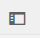

# Console di moderazione {#moderation-console}

In AEM Communities, è possibile eseguire la [moderazione di massa del contenuto della community](/help/communities/moderate-ugc.md) sia dagli ambienti Author che Publish da parte di amministratori e moderatori della community (membri della community attendibili assegnati come moderatori).

Gli amministratori e i moderatori della community possono anche eseguire [la moderazione nel contesto](/help/communities/in-context.md) nell&#39;ambiente Publish.

Una caratteristica di tutti i [siti community](/help/communities/sites-console.md) è una voce di menu `Administration` disponibile per gli utenti che accedono con privilegi amministrativi. Il collegamento `Administration` fornisce l&#39;accesso alla console di moderazione.

Dalla console di moderazione, gli amministratori e i moderatori della community hanno accesso a tutti i contenuti generati dagli utenti (UGC) per i quali dispongono dell’autorizzazione alla moderazione. Se si consente di moderare più siti, è possibile visualizzare i post in tutti i siti o filtrare per comunità selezionate siti.

Per informazioni più dettagliate, visita [Gestione di utenti e gruppi di utenti](/help/communities/users.md).

La console Moderazione supporta:

* Esecuzione in blocco di attività di moderazione.
* Ricerca UGC.
* Visualizzazione dei dettagli UGC.
* Visualizzazione dei dettagli dell’autore UGC.

Le attività di moderazione possono essere eseguite solo dopo aver effettuato l&#39;accesso come amministratore o come membro con ` [moderator permissions](/help/communities/in-context.md#identifyingtrustedmembers)`.

## Accesso all&#39;ambiente Publish {#publish-environment-access}

L&#39;accesso alla console di moderazione da un sito community pubblicato avviene tramite un collegamento Amministrazione che viene visualizzato quando un moderatore della community ha effettuato l&#39;accesso.

Selezionando il collegamento Amministrazione, viene visualizzata la console Moderazione:

## Accesso all’ambiente di authoring {#author-environment-access}

Nell’ambiente di authoring, per raggiungere la console di moderazione

* Dalla navigazione globale, seleziona **[!UICONTROL Community]** > **[!UICONTROL Moderazione]**.

Solo quando si accede come amministratore o come membro con [autorizzazioni moderatore](/help/communities/in-context.md#identifyingtrustedmembers), è possibile eseguire attività di moderazione. L&#39;unico contenuto della community visualizzato è quello che il membro connesso può moderare.

>[!NOTE]
>
>UGC dall’ambiente Publish è visibile nell’ambiente Author solo se l’SRP scelto implementa un archivio comune. Ad esempio, per impostazione predefinita l’archiviazione è JSRP, che non è un archivio comune per Author e Publish. Vedi [Archiviazione dei contenuti della community](/help/communities/working-with-srp.md).

## Interfaccia utente console di moderazione {#moderation-console-ui}

Lasciando da parte la barra di navigazione a sinistra (che viene visualizzata su Author ma non su Publish), l&#39;interfaccia utente di moderazione presenta le seguenti aree principali:

* **[Barra di navigazione superiore](#top-navigation-bar)**
* **[Barra degli strumenti](#toolbar)**
* **[Area contenuto](#content-area)**

### Barra di navigazione superiore {#top-navigation-bar}

La barra di navigazione superiore è costante per tutte le console. Per ulteriori informazioni, vedere [Operazioni di base](/help/sites-authoring/basic-handling.md).

### Barra degli strumenti {#toolbar}

La barra degli strumenti, situata sotto la barra di navigazione superiore, fornisce il seguente interruttore a sinistra:

* [Barra dei filtri](/help/communities/moderation.md#filterrail)
apre una barra che consente di scegliere le proprietà su cui filtrare il contenuto.

La barra degli strumenti, situata sotto la barra di navigazione superiore, fornisce il seguente interruttore a sinistra:

[Barra dei filtri](/help/communities/moderation.md#filterrail)
apre una barra su selezione Ricerca, che consente di scegliere le proprietà su cui filtrare il contenuto.

### Area contenuto {#content-area}

L’area del contenuto contiene informazioni per UGC pubblicati:

* UGC pubblicato
* Nome membro
* Avatar membro
* Posizione del posto
* Quando è stato pubblicato
* Numero di risposte al post
* [Sentimento](/help/communities/moderate-ugc.md#sentiment) associato al post
* Se approvata, viene visualizzato un segno di spunta
* Se è presente un allegato, viene visualizzata una graffetta

>[!NOTE]
> 
>L&#39;area contenuto presenta uno scorrimento *infinito*, che consente di continuare lo scorrimento fino a raggiungere la fine del contenuto. La barra degli strumenti rimane in una posizione fissa visibile sopra l’area del contenuto anche durante lo scorrimento.

### Barra di filtro {#ootbfilters}

L’icona del pannello laterale apre la barra del filtro. La barra dei filtri, visualizzata a sinistra dell’area del contenuto, fornisce diversi filtri, ciascuno dei quali ha un effetto immediato sull’UGC di riferimento visualizzato nell’area del contenuto.

I filtri all&#39;interno di ogni categoria sono **OR** insieme e i filtri in diverse categorie sono **AND** insieme.

Ad esempio, se controlli sia la **Domanda** che la **Risposta**, vedrai contenuto che è una **Domanda** *o* una **Risposta**.

Tuttavia, se selezioni **Domanda** e **In sospeso**, vedrai solo il contenuto che è una **Domanda** ed è **In sospeso**.

>[!NOTE]
>
>I moderatori della community possono applicare un segnalibro ai filtri predefiniti nell’interfaccia utente della console di moderazione. Poiché questi filtri vengono aggiunti alla fine dell’URL (come parametri della stringa di query), i moderatori possono tornare ai filtri con segnalibro in un secondo momento e condividere questi collegamenti.

Quando la barra dei filtri è aperta, l’icona Ricerca attiva e disattiva la visualizzazione del pannello laterale. Tuttavia, per chiudere la barra dei filtri e visualizzare solo il contenuto generato dall’utente, fai clic sull’icona Ricerca e seleziona l’opzione Solo contenuto.

#### Percorso contenuto {#content-path}

Il Percorso contenuto limita il riferimento UGC visualizzato ai post presenti nell’archivio dei contenuti specificato.

#### Ricerca di testo {#text-search}

La ricerca di testo limita l’UGC di riferimento visualizzato ai post che contengono il testo immesso.

#### Sito {#site}

Il sito limita il contenuto UGC di riferimento visualizzato ai post per i siti community selezionati. Se non è selezionato alcun sito, vengono visualizzati tutti i riferimenti a UGC.

>[!NOTE]
>
>Quando un amministratore accede alla console di moderazione in blocco, vengono visualizzati tutti i riferimenti a UGC, inclusi i siti non creati con la [procedura guidata per la creazione di siti](/help/communities/sites-console.md), ad esempio gli esempi di Geometrixx.
>
>Quando un membro attendibile della community accede alla console di moderazione in blocco su Publish, vengono visualizzati solo i riferimenti a contenuti generati dagli utenti (UGC) per i siti della community che il membro è autorizzato a moderare. Inoltre, può essere filtrato con il filtro Sito.

#### Tipo di contenuto {#content-type}

Il tipo di contenuto limita il contenuto UGC di riferimento visualizzato ai post del tipo di risorsa selezionato. È possibile selezionare uno o più dei seguenti tipi. Se non è selezionata alcuna opzione, vengono visualizzati tutti i tipi.

* **Commento**
* **Argomento forum**
* **Risposta forum**
* **Domanda D/R**
* **Risposta QnA**
* **Articolo blog**
* **Commento blog**
* **Evento calendario**
* **Commento calendario**
* **Cartella raccolta file**
* **Documento raccolta file**
* **Idea**
* **Commento ideazione**

#### Tipi di contenuto aggiuntivi {#additional-content-types}

Per aggiungere altre risorse da filtrare:

* Accedi all’istanza di authoring come amministratore.
* Apri [Console Web](https://localhost:4502/system/console/configMgr).
* Individuare `AEM Communities Moderation Dashboard Filters`.
* Seleziona la configurazione per aprirla in modalità di modifica.
* Immettere il ResourceType di un componente su cui filtrare:

   * Ad esempio, per filtrare in base ai componenti di voto inclusi, immettere:

     `Voting=social/tally/components/hbs/voting`

  

* Seleziona Salva.
* Aggiorna la console Community - Moderazione.

Il risultato è un nuovo filtro selezionabile per `Voting` nel gruppo di filtri `Content Type`.

Quando questo filtro è selezionato, il contenuto del dashboard mostra contenuti generati dagli utenti (UGC, User-Generated Content) che corrispondono a qualsiasi tipo di ResourceTypes immesso.

#### Stato {#status}

Lo stato limita il UGC di riferimento visualizzato ai post dello stato selezionato, che possono essere uno o più dei seguenti: In sospeso, Approvato, Negato o Chiuso, Bozza o Pianificato per articoli di blog e Risposte o Non risposte per domande di controllo qualità. Se non è selezionato nessuno, vengono visualizzati tutti.

>[!NOTE]
>
>Se viene selezionato solo lo stato Senza risposta, il moderatore visualizza tutto il contenuto (per tutti i tipi di contenuto) tranne le domande a cui è stato risposto. È così perché la proprietà responsabile della domanda non esiste se ci sono domande senza risposta e altri contenuti come l&#39;argomento del forum, l&#39;articolo del blog o i commenti.

#### Segnalazione {#flagging}

I flag limitano il contenuto UGC di riferimento visualizzato ai post contrassegnati o nascosti.

Una volta contrassegnato, un contenuto rimane contrassegnato fino a quando non lo scontri selezionando nuovamente il pulsante **Contrassegna**. Non esistono livelli di segnalazione, ad esempio importante o di follow-up.

#### Membri {#members}

I membri limitano l&#39;UGC di riferimento visualizzato all&#39;UGC pubblicato in base al nome membro immesso.

#### Pubblicato nell&#39;ultimo/a {#posted-in-the-last}

Pubblicato in L&#39;ultimo limita il UGC di riferimento visualizzato ai post effettuati nell&#39;ultima ora, giorno, settimana, mese o anno.

#### Sentimento {#sentiment}

[Sentimento](/help/communities/moderate-ugc.md#sentiment) limita il contenuto UGC di riferimento visualizzato ai post con un valore di valutazione positivo, negativo o neutro.

## Filtri personalizzati {#custom-filters}

Oltre ai filtri predefiniti nella barra dei filtri [Filtro](/help/communities/moderation.md#ootbfilters), è possibile aggiungere all&#39;interfaccia utente di moderazione altri filtri personalizzati sui metadati. Gli sviluppatori possono utilizzare il codice di esempio in GitHub per estendere i filtri dell&#39;interfaccia utente di moderazione esistenti.

Il [progetto di esempio](https://github.com/Adobe-Marketing-Cloud/aem-communities-extensions/tree/main/aem-communities-moderation-filter) su GitHub implementa il filtro Tag, per filtrare l&#39;elenco UGC in base all&#39;applicazione o meno di tag specifici al contenuto generato dall&#39;utente. Puoi seguire il codice di esempio e creare filtri analoghi per altri campi di metadati UGC simili.

Per installare l’esempio per il filtro Tag:

1. Aprire Gestione pacchetti nell&#39;istanza Autore AEM (`https://[aem-author]:4502/crx/packmgr/index.jsp`) e nell&#39;istanza Publish AEM (`https://[aem-publish]:4503/crx/packmgr/index.jsp`).
1. Creare il pacchetto `com.adobe.social.sample.moderation.filter.ui.apps-1.0-SNAPSHOT.zip` dal codice GitHub, quindi installarlo e attivarlo.
1. Aprire la console dei bundle nell&#39;istanza Autore AEM ( `https://[aem-author]:4502/system/console/bundles`) e nell&#39;istanza Publish AEM ( `https://[aem-publish]:4503/system/console/bundles`).
1. Creare il pacchetto (`[com](https://sample-moderation-filter.com/).adobe.social.sample.moderation.filter.core-1.0-SNAPSHOT.jar`) da GitHub e installarlo e abilitarlo.
1. Vai al nodo **/apps/social/moderation/facets** sull&#39;istanza di AEM Author (`https://[aem-author]:4502/crx/de/index.jsp#/apps/social/moderation/facets`) e AEM Publish (`https://[aem-publish]:4502/crx/de/index.jsp#/apps/social/moderation/facets`).
1. Aggiungere un utente tecnico **community-utility-reader** con autorizzazioni `jcr:read`.

Per esporre i filtri personalizzati sui siti community esistenti:

1. Modifica `Clientlibs` della pagina di moderazione esistente `/content/we-retail/us/en/community/moderation/shell3/jcr:content/head/clientlibs.`

   * Aggiungi nuova categoria `cq.social.hbs.moderation.v2.`

1. Vai a `/content/we-retail/us/en/community/moderation/shell3/jcr:content/rails/searchWell/items/filters.`

   * Imposta sul nuovo componente `sling:resourceType = social/moderation/v2/filters.`

1. Passa a `/content/we-retail/us/en/community/moderation/shell3/jcr:content/views/content/items/modcontainer`.

   * Impostato sul nuovo componente `sling:resourceType = social/moderation/v2/modcontainer`.

## Azioni di moderazione {#moderation-actions}

[Le azioni di moderazione](/help/communities/moderate-ugc.md#moderation-actions) possono essere eseguite su una o più selezioni effettuate nell&#39;area del contenuto o durante la visualizzazione dei dettagli del contenuto.

Per moderare in blocco i post, nell&#39;area del contenuto fai clic sull&#39;icona Seleziona () su un post, che appare quando ci si passa sopra con il mouse (desktop) o quando si preme e si tiene un dito sul post (mobile). In questo modo, si entra nella modalità di selezione multipla e ora è possibile selezionare i post successivi da moderare in blocco semplicemente facendo clic su di essi. Utilizza i pulsanti visualizzati nella barra degli strumenti per eseguire azioni di moderazione sui post selezionati. Tutte le azioni richiedono conferma.

Per moderare un singolo post nell’area dei contenuti, posiziona il cursore su di esso con il mouse (desktop) oppure tieni premuto un dito sul post (mobile) in modo che vengano visualizzati i pulsanti sul post. Quando si opera su un singolo dettaglio di contenuto, solo un’azione di eliminazione richiede una conferma.

### Moderazione di più post {#moderating-multiple-posts}

Immettere la modalità di selezione collettiva facendo clic sull&#39;icona `Select` in un post:

Per uscire dalla modalità di selezione collettiva, seleziona l’icona Annulla (x) sulla barra degli strumenti:

Le azioni di moderazione che possono essere eseguite su più post sono:

* Rifiuta
* Elimina
* Chiudi/riapri i post

Le icone che consentono queste azioni vengono visualizzate sulla barra degli strumenti solo quando sono selezionati più post.

### Moderazione di un singolo post {#moderating-a-single-post}

Nella modalità di selezione singola, è possibile:

* Visualizzare i dettagli utente selezionando il nome dell&#39;utente.
* Visualizza il post nel contesto selezionando il collegamento al post.
* [Risposta](#reply)
* [Consenti](#allow)
* [Rifiuta](#deny)
* [Elimina](#delete)
* [Chiudi](#close)
* Visualizza [Cronologia moderazione](#moderation-history)
* [Visualizza dettagli](#viewdetails)

Nella visualizzazione a schede, sopra le icone delle azioni di moderazione, è presente il testo del post e qui sotto sono riportati i dati che indicano:

* In caso di risposte, precedute dal numero di risposte
* Se è stato segnalato
* Se è stato approvato
* Quando è stato pubblicato l’UGC

#### Risposta {#reply}

Quando si lavora con un singolo post, viene visualizzata un’icona Rispondi se il tipo UGC supporta le risposte ed è configurato per consentire le risposte.

#### Consenti {#allow}

Quando si lavora con un singolo post, l’icona Consenti viene visualizzata se il post è stato contrassegnato o negato. Se contrassegnato, selezionando Consenti tutti i contrassegni vengono cancellati.

#### Rifiuta {#deny}

L&#39;azione di moderazione **Rifiuta** è disponibile solo per il contenuto moderato e non viene visualizzato nel contenuto non moderato, tranne che nella modalità di selezione multipla.

Il contenuto non moderato viene sempre approvato.

Il contenuto moderato entra inizialmente nello stato In sospeso e può essere modificato in un secondo momento per l&#39;approvazione o la negazione.

Il contenuto che lascia lo stato in sospeso non può mai tornare a uno stato in sospeso. Il contenuto contrassegnato come approvato o negato può essere modificato in un altro stato in qualsiasi momento.

#### Elimina {#delete}

In modalità di selezione singola o in modalità collettiva, è possibile selezionare gli elementi ed eliminarli. L’azione Elimina genera una finestra di dialogo di conferma. Una volta eliminati, gli elementi scompaiono immediatamente dall’area del contenuto. **Una volta eliminato, l&#39;UGC viene rimosso definitivamente dall&#39;archivio e non può essere recuperato in seguito**.

#### Chiudi {#close}

Quando si lavora con un singolo post, viene visualizzata un’icona Chiudi se il tipo di UGC supporta la possibilità di impedire ulteriori post per tale risorsa.

#### Cronologia moderazione {#moderation-history}

Quando si lavora con un singolo post, viene visualizzata un&#39;icona Cronologia moderazione al passaggio del mouse su di esso. Selezionando l’icona viene visualizzato un riquadro contenente una cronologia delle azioni eseguite in relazione al post UGC.

Per tornare alla visualizzazione dell&#39;area del contenuto di più post UGC, seleziona la X nell&#39;angolo in alto a destra del riquadro dei dettagli della visualizzazione.

Ad esempio:

#### Visualizza dettagli {#view-detail}

Quando si lavora con un singolo post, è possibile visualizzare più dettagli aprendo l’UGC in modalità dettaglio.

A questo scopo, passa il cursore del mouse sul post per visualizzare l&#39;icona `View Detail` e selezionala per visualizzare un pannello contenente ulteriori dettagli sul post.

Per tornare alla visualizzazione dell&#39;area del contenuto di più post UGC, seleziona la X nell&#39;angolo in alto a destra del riquadro dei dettagli della visualizzazione.

Ad esempio:

