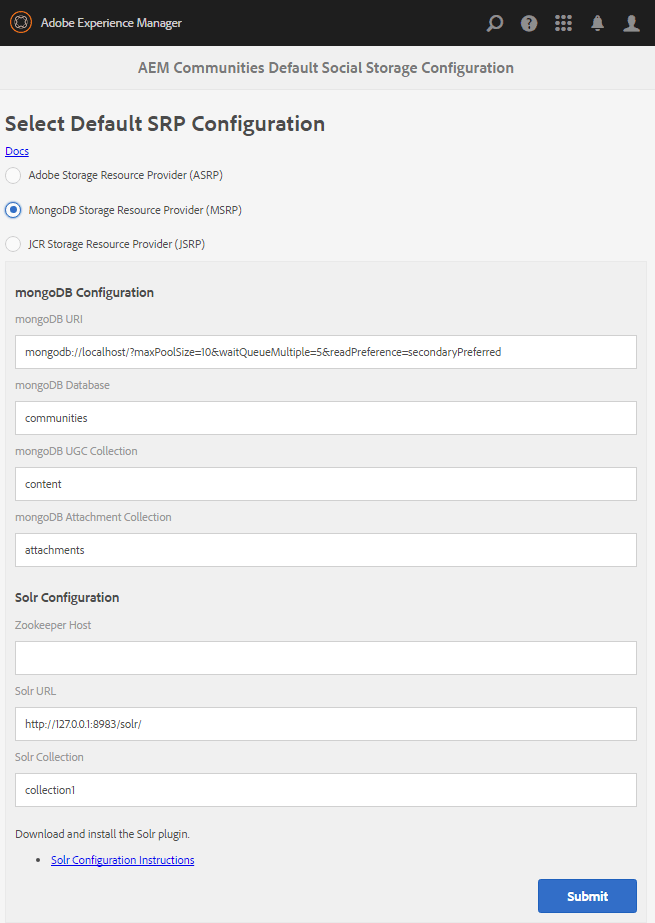

# MSRP - Provider risorsa di archiviazione MongoDB {#msrp-mongodb-storage-resource-provider}

## Informazioni su MSRP {#about-msrp}

Quando AEM Communities è configurato per utilizzare MSRP come archivio comune, i contenuti generati dagli utenti (UGC, User Generated Content) sono accessibili da tutte le istanze di authoring e pubblicazione senza la necessità di sincronizzazione o replica.

Vedi anche [Caratteristiche delle opzioni SRP](working-with-srp.md#characteristics-of-srp-options) e [Topologie consigliate](topologies.md).

## Requisiti {#requirements}

* [MongoDB](https://www.mongodb.org/):

   * Versione 2.6 o successiva
   * Non è necessario configurare i monghi o la condivisione
   * Si consiglia vivamente di utilizzare un [set di repliche](#mongoreplicaset)
   * Può essere eseguito sullo stesso host dell&#39;AEM o in remoto

* [Apache Solr](https://lucene.apache.org/solr/):

   * Solr versione 7.0
   * Solr richiede Java 1.7 o versione successiva
   * Non è necessario alcun servizio
   * Scelta delle modalità di esecuzione:
      * Modalità autonoma
      * [Modalità SolrCloud](solr.md#solrcloud-mode) (consigliato per ambienti di produzione)
   * Scelta di ricerca multilingue (MLS):
      * [Installazione di MLS standard](solr.md#installing-standard-mls)
      * [Installazione di Advanced MLS](solr.md#installing-advanced-mls)

## Configurazione MongoDB {#mongodb-configuration}

### Seleziona MSRP {#select-msrp}

Il [Console di configurazione archiviazione](srp-config.md) consente di selezionare la configurazione di archiviazione predefinita, che identifica l&#39;implementazione di SRP da utilizzare.

Per accedere alla console Configurazione archiviazione, dall’autore:

* Dalla navigazione globale, seleziona **[!UICONTROL Strumenti]** > **[!UICONTROL Community]** > **[!UICONTROL Configurazione archiviazione]**.



* Seleziona **[!UICONTROL Provider risorsa di archiviazione MongoDB (MSRP)]**
* **[!UICONTROL Configurazione mongoDB]**

   * **[!UICONTROL URI di mongoDB]**

      *predefinito*: mongodb://localhost/?maxPoolSize=10&amp;waitQueueMultiple=5&amp;readPreference=secondaryPreferred

   * **[!UICONTROL Database di mongoDB]**

      *predefinito*: community

   * **[!UICONTROL Raccolta UGC di mongoDB]**

      *predefinito*: contenuto

   * **[!UICONTROL Raccolta allegati mongoDB]**

      *predefinito*: allegati

* **[!UICONTROL SolrConfiguration]**

   * **[](https://cwiki.apache.org/confluence/display/solr/Using+ZooKeeper+to+Manage+Configuration+Files)Zookeeper Host**

      Quando viene eseguito in [Modalità SolrCloud](solr.md#solrcloud-mode) con uno ZooKeeper esterno, impostare questo valore su `HOST:PORT` per ZooKeeper, ad esempio *my.server.com:2181*

      Per un ZooKeeper Ensemble, inserisci valori separati da virgola `HOST:PORT` valori, come *host1:2181,host2:2181*

      Lasciare vuoto se si esegue Solr in modalità standalone utilizzando lo ZooKeeper interno.
      *Predefinito*: *&lt;blank>*

      * **[!UICONTROL URL Solr]**
URL utilizzato per comunicare con Solr in modalità autonoma.
Lascia vuoto se l’esecuzione avviene in modalità SolrCloud.

         *Predefinito*: https://127.0.0.1:8983/solr/

      * **[!UICONTROL Raccolta Solr]**
Il nome della raccolta Solr.

         *Predefinito*: collection1

* Seleziona **[!UICONTROL Invia]**

>[!NOTE]
>
>Il database mongoDB, il cui nome predefinito è `communities`, non deve essere impostato sul nome di un database utilizzato per [archivi dei nodi o archivi dei dati (binari)](../../help/sites-deploying/data-store-config.md). Vedi anche [Elementi di conservazione in AEM 6.5](../../help/sites-deploying/storage-elements-in-aem-6.md).

### Set di replica MongoDB {#mongodb-replica-set}

Per l&#39;ambiente di produzione, si consiglia vivamente di configurare un set di repliche, un cluster di server MongoDB che implementa la replica primaria-secondaria e il failover automatizzato.

Per ulteriori informazioni sui set di repliche, visitare il sito Web [Replica](https://docs.mongodb.org/manual/replication/) documentazione.

Per lavorare con i set di repliche e imparare a definire le connessioni tra le applicazioni e le istanze di MongoDB, visita il sito Web [Formato URI stringa di connessione](https://docs.mongodb.org/manual/reference/connection-string/) documentazione.

#### Url di esempio per la connessione a un set di replica  {#example-url-for-connecting-to-a-replica-set}

```shell
# Example url for:
# servers "mongoserver1", "mongoserver2", "mongoserver3"
# replica set 'rs0'
# port numbers only necessary if not default port 27017
mongodb://mongoserver1:<mongoport1>,mongoserver2:<mongoport2>,mongoserver3:<mongoport3>/?replicaSet=rs0&maxPoolSize=100&waitQueueMultiple=50&readPreference=secondaryPreferred
```

## Configurazione Solr {#solr-configuration}

Un’installazione Solr può essere condivisa tra l’archivio nodi (Oak) e l’archivio comune (MSRP) utilizzando raccolte diverse.

Se entrambe le raccolte Oak e MSRP vengono utilizzate in modo intensivo, è possibile installare un secondo Solr per motivi di prestazioni.

Per gli ambienti di produzione, [Modalità SolrCloud](solr.md#solrcloud-mode) offre prestazioni migliori rispetto alla modalità standalone (un&#39;unica configurazione Solr locale).

Per informazioni dettagliate sulla configurazione, consulta [Configurazione Solr per SRP](solr.md).

### Aggiornamento {#upgrading}

Se si esegue l&#39;aggiornamento da una versione precedente configurata con MSRP, sarà necessario:

1. Eseguire la [effettuare l’aggiornamento ad AEM Communities](upgrade.md)
1. Installare nuovi file di configurazione Solr
   * Per [MLS standard](solr.md#installing-standard-mls)
   * Per [MLS avanzato](solr.md#installing-advanced-mls)
1. Reindicizzare MSRP Vedere la sezione [Strumento Reindicizzazione MSRP](#msrp-reindex-tool)

## Pubblicazione della configurazione {#publishing-the-configuration}

Il protocollo MSRP deve essere identificato come archivio comune in tutte le istanze di authoring e pubblicazione.

Per rendere disponibile la configurazione identica nell’ambiente di pubblicazione, accedi all’istanza di authoring e segui i passaggi seguenti:

* Passa dal menu principale a **[!UICONTROL Strumenti]** > **[!UICONTROL Operazioni]** > **[!UICONTROL Replica]**.
* Seleziona **[!UICONTROL Attiva albero]**
* **[!UICONTROL Percorso iniziale]**:
   * Sfoglia per `/etc/socialconfig/srpc/`
* Seleziona **[!UICONTROL Attiva]**

## Gestione dei dati utente {#managing-user-data}

Per informazioni su *utenti*, *profili utente* e *gruppi di utenti*, spesso immesso nell’ambiente di pubblicazione, visita

* [Sincronizzazione utente](sync.md)
* [Gestione di utenti e gruppi di utenti](users.md)

## Strumento Reindicizzazione MSRP {#msrp-reindex-tool}

Esiste un endpoint HTTP per la reindicizzazione di Solr per MSRP durante l&#39;installazione di nuovi file di configurazione o il ripristino di un indice Solr danneggiato.

Con questo strumento, MongoDB è la sorgente di *verità* per MSRP; i backup devono essere eseguiti solo da MongoDB.

L&#39;intero albero UGC può essere reindicizzato, o solo un sottoalbero specifico, come specificato dal parametro *path *data.

Questo strumento può essere eseguito dalla riga di comando utilizzando cURL o qualsiasi altro strumento HTTP.

Durante la reindicizzazione, esiste un compromesso tra la memoria e le prestazioni controllate dal parametro di dati *batchSize *, che specifica quanti record UGC vengono reindicizzati per batch.

Un valore di default ragionevole è 5000:

* Se la memoria è un problema, specificare un numero inferiore
* Se la velocità è un problema, specifica un numero maggiore per aumentarla

### Esecuzione dello strumento Reindicizzazione MSRP tramite il comando cURL {#running-msrp-reindex-tool-using-curl-command}

Il seguente comando cURL mostra ciò che è necessario affinché una richiesta HTTP reindicizzi i contenuti generati dagli utenti archiviati in MSRP.

Il formato di base è:

cURL -u *accesso* d *dati* *reindex-url*

*accesso* = administrator-id:password Ad esempio: admin:admin

*dati* = &quot;batchSize=*dimensione*&amp;path=*path&quot;*

*dimensione* = quante voci UGC reindicizzare per operazione
`/content/usergenerated/asi/mongo/`

*percorso* = la posizione radice della struttura ad albero dell&#39;UGC da reindicizzare

* Per reindicizzare tutti i contenuti generati dagli utenti, specifica il valore `asipath`proprietà di
   `/etc/socialconfig/srpc/defaultconfiguration`
* Per limitare l’indice ad alcuni UGC, specifica una sottostruttura di `asipath`

*reindex-url* = endpoint per la reindicizzazione dell&#39;SRP
`http://localhost:4503/services/social/datastore/mongo/reindex`

>[!NOTE]
>
>Se sei [reindicizzazione DSRP Solr](dsrp.md), l’URL è **/services/social/datastore/rdb/reindex**

### Esempio di reindicizzazione MSRP {#msrp-reindex-example}

```shell
curl -s -u admin:admin -d 'batchSize=10000&path=/content/usergenerated/asi/mongo/' http://localhost:4503/services/social/datastore/mongo/reindex
```

## Come Demo MSRP {#how-to-demo-msrp}

Per impostare MSRP per un ambiente di dimostrazione o sviluppo, vedere [Come impostare MongoDB per la demo](demo-mongo.md).

## Risoluzione dei problemi {#troubleshooting}

### UGC non visibile in MongoDB {#ugc-not-visible-in-mongodb}

Verificare che MSRP sia stato configurato come provider predefinito controllando la configurazione dell&#39;opzione di archiviazione. Per impostazione predefinita, il provider di risorse di archiviazione è JSRP.

Su tutte le istanze AEM di authoring e pubblicazione, rivedi il [Console di configurazione archiviazione](srp-config.md) oppure controlla l’archivio AEM:

* In JCR, se [/etc/socialconfig](http://localhost:4502/crx/de/index.jsp#/etc/socialconfig/)

   * Non contiene un [srpc](http://localhost:4502/crx/de/index.jsp#/etc/socialconfig/srpc) significa che il provider di archiviazione è JSRP.
   * Se il nodo srpc esiste e contiene un nodo [defaultconfiguration](http://localhost:4502/crx/de/index.jsp#/etc/socialconfig/srpc/defaultconfiguration), le proprietà della configurazione predefinita devono definire MSRP come provider predefinito.

### UGC scompare dopo l’aggiornamento {#ugc-disappears-after-upgrade}

In caso di aggiornamento da un sito AEM Communities 6.0 esistente, eventuali contenuti generati dagli utenti preesistenti devono essere convertiti in modo da essere conformi alla struttura richiesta per [SRP](srp.md) dopo l’aggiornamento ad AEM Communities 6.3.

Su GitHub è disponibile uno strumento open source a tale scopo:

* [Strumento di migrazione UGC per AEM Communities](https://github.com/Adobe-Marketing-Cloud/communities-ugc-migration)

Lo strumento di migrazione può essere personalizzato per esportare contenuti generati dagli utenti (UGC, User-Generated Content) di versioni precedenti delle social community AEM per l’importazione in AEM Communities 6.1 o versione successiva.

### Errore - campo non definito provider_id {#error-undefined-field-provider-id}

Se nei registri viene visualizzato il seguente errore, questo indica che il file di schema Solr non è configurato correttamente.

#### JsonMappingException: campo non definito provider_id {#jsonmappingexception-undefined-field-provider-id}

```xml
Caused by: com.fasterxml.jackson.databind.JsonMappingException: undefined field provider_id
at com.fasterxml.jackson.databind.ser.DefaultSerializerProvider.serializeValue(DefaultSerializerProvider.java:129)
at com.fasterxml.jackson.databind.ObjectMapper.writeValue(ObjectMapper.java:1819)
at com.adobe.cq.social.scf.core.BaseSocialComponent.toJSONString(BaseSocialComponent.java:196)
... 124 common frames omitted
```

Per risolvere l’errore, segui le istruzioni per [Installazione di MLS standard](solr.md#installing-standard-mls), assicurano:

* I file di configurazione XML sono stati copiati nel percorso Solr corretto.
* Solr è stato riavviato dopo che i nuovi file di configurazione hanno sostituito quelli esistenti.

### Connessione sicura a MongoDB non riuscita {#secure-connection-to-mongodb-fails}

Se un tentativo di stabilire una connessione protetta al server MongoDB non riesce a causa di una definizione di classe mancante, è necessario aggiornare il bundle del driver MongoDB. `mongo-java-driver`, disponibile dall’archivio maven pubblico.

1. Scaricare il driver da [https://search.maven.org/#artifactdetails%7Corg.mongodb%7Cmongo-java-driver%7C2.13.2%7Cjar](https://search.maven.org/#artifactdetails%7Corg.mongodb%7Cmongo-java-driver%7C2.13.2%7Cjar) (versione 2.13.2 o successiva).
1. Copia il bundle nella cartella &quot;crx-quickstart/install&quot; per un’istanza AEM.
1. Riavvia l’istanza AEM.

## Riferimenti {#resources}

* [AEM con MongoDB](../../help/sites-deploying/aem-with-mongodb.md)
* [Documentazione di MongoDB](https://docs.mongodb.org/)
