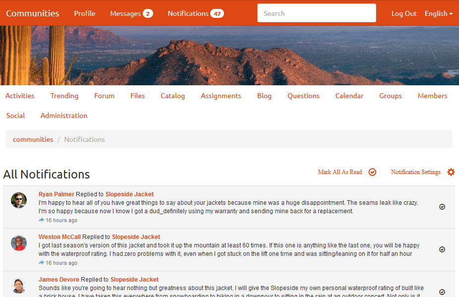

# Notifiche di Communities {#communities-notifications}

## Panoramica {#overview}

AEM Communities fornisce una sezione sulle notifiche che mostra gli eventi di interesse per i membri della community firmati.

Le notifiche sono simili a [attività](/help/communities/essentials-activities.md) e [abbonamenti](/help/communities/subscriptions.md) che possono risultare da:

* Il contenuto di pubblicazione del membro.
* Il membro che sceglie di seguire un altro membro.
* Il membro che sceglie di seguire specifici argomenti, articoli e altri thread di contenuto.
* Il membro tagging (@menzione) un altro membro della community in un contenuto generato dall’utente.

Ciò che distingue le notifiche dalle attività e dagli abbonamenti è:

* Un collegamento alla sezione notifiche è sempre presente nell&#39;intestazione di un sito community:

   * Le attività richiedono [funzione flusso di attività](/help/communities/functions.md#activity-stream-function) da includere nella struttura del sito della comunità.
   * Gli abbonamenti richiedono [configurazione dell’e-mail](/help/communities/email.md).

* L’implementazione delle notifiche avviene tramite canali scalabili e collegabili:

   * Le attività sono disponibili solo sul web.
   * Gli abbonamenti sono disponibili solo tramite e-mail.

A livello di Comunità [FP1](/help/communities/deploy-communities.md#latestfeaturepack), i canali di notifica disponibili sono:

* Il canale web a cui si accede tramite il `Notifications` link.
* Il canale e-mail, disponibile quando l’e-mail è configurata correttamente.

I canali futuri sono mobile e desktop.

### Requisiti {#requirements}

**Configura e-mail**

Affinché il canale e-mail funzioni, le notifiche devono essere configurate e-mail.

Per istruzioni sulla configurazione dell’e-mail, consulta [Configurazione e-mail](/help/communities/analytics.md).

**Abilita segui**

I componenti devono essere configurati per abilitare quanto segue. Funzioni che consentono quanto segue: [blog](/help/communities/blog-feature.md), [forum](/help/communities/forum.md), [QnA](/help/communities/working-with-qna.md), [calendario](/help/communities/calendar.md), [filelibrio](/help/communities/file-library.md)e [commenti](/help/communities/comments.md).

**Nota**:

* Componenti utilizzati nella community [modelli di sito](/help/communities/sites.md) e [modelli di gruppo](/help/communities/tools-groups.md) potrebbe essere già configurato per seguire.

* I profili dei membri sono già configurati per consentire ad altri membri di seguire questa procedura.

## Notifiche da {#notifications-from-following}


La **[!UICONTROL Segui]** Questo pulsante consente di seguire le voci come attività, abbonamenti e/o notifiche. Ogni volta che **[!UICONTROL Segui]** è selezionato, è possibile attivare o disattivare una selezione. La `Email Subscriptions` la selezione è presente solo se configurata.

Se è selezionato un metodo di seguito, il testo del pulsante diventa **[!UICONTROL Seguente]**. Per comodità, è possibile selezionare `Unfollow All` per disattivare tutti i metodi.

La **[!UICONTROL Segui]** apparirà il pulsante:

* Quando si visualizza il profilo di un altro membro.
* In una pagina principale, ad esempio forum, QnA e blog:

   * Segue tutta l’attività per quella funzione generale.

* Per un post specifico, ad esempio un argomento del forum, una domanda QnA o un articolo di blog:

   * Segue tutte le attività per quella voce specifica.

## Gestione delle impostazioni di notifica {#managing-notification-settings}

Selezionando il collegamento Impostazioni notifiche dalla pagina Notifiche, è possibile per ogni membro gestire la modalità di ricezione delle notifiche.

Il canale web è sempre abilitato.


Il canale e-mail, che si basa sul [configurazione dell’e-mail](/help/communities/email.md), fornisce le stesse impostazioni del canale web.

Il canale e-mail è disattivato per impostazione predefinita.


Può essere attivato da un membro, ma dipende comunque dalla configurazione dell’e-mail.


## Visualizzazione delle notifiche {#viewing-notifications}

### Notifiche web {#web-notifications}

A [creazione guidata sito community](/help/communities/sites-console.md) ora include un collegamento alla `Notifications` nella barra dell&#39;intestazione del sito sopra il banner. A differenza dei messaggi, le notifiche vengono create per ogni sito della community, mentre i messaggi devono essere attivati durante il processo di creazione del sito.

Quando visiti il sito pubblicato, seleziona la `Notifications` visualizza tutte le notifiche per il membro.



### Notifiche e-mail {#email-notifications}

Quando il canale e-mail è abilitato, il membro riceve un messaggio e-mail contenente un collegamento al contenuto sul web.


## Personalizzare le notifiche e-mail {#customize-email-notifications}

Le organizzazioni possono personalizzare le notifiche e-mail tramite [sovrapposizione](/help/communities/client-customize.md#overlays) i modelli di **/libs/settings/community/templates/email/html**.

Ad esempio, per modificare le notifiche e-mail delle menzioni (per un componente Community), aggiungi un **if** condizione del verbo **menzione** nei modelli dei componenti per i quali hai abilitato la **@menzioni** supporto.

Per modificare il modello di notifiche e-mail per @mention nei commenti del blog, posiziona il modello preconfigurato in: **/libs/settings/community/templates/email/html/social.journal.components.hbs.comment/it**

```java
{{#equals this.verb "mention"}}\
    A new mention <a href="{{objectUrl}}">comment</a> {{#if this.target.properties.[jcr:title]}}to the article "{{{target.displayName}}}" {{/if}}was added by {{{user.name}}} on {{dateUtil this.published format="EEE, d MMM yyyy HH:mm:ss z"}}.\n \
{{/equals}}\
```
