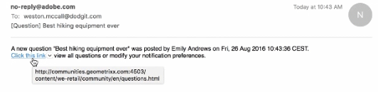

# Notifiche community {#communities-notifications}

## Panoramica {#overview}

AEM Communities fornisce una sezione di notifiche che mostra gli eventi di interesse per il membro della community di accesso.

Le notifiche sono simili a [attività](/help/communities/essentials-activities.md) e [abbonamenti](/help/communities/subscriptions.md) in quanto possono derivare da:

* Il membro che pubblica il contenuto.
* Il membro che sceglie di seguire un altro membro.
* Il membro che sceglie di seguire argomenti, articoli e altri thread di contenuto specifici.
* Il tag membro (@mention) di un altro membro della community in un contenuto generato dall&#39;utente.

Ciò che distingue le notifiche dalle attività e dagli abbonamenti è:

* Un collegamento alla sezione delle notifiche è sempre presente nell’intestazione di un sito community:

   * Le attività richiedono [funzione flusso di attività](/help/communities/functions.md#activity-stream-function) da includere nella struttura del sito community.
   * Gli abbonamenti richiedono [configurazione dell’e-mail](/help/communities/email.md).

* L’implementazione delle notifiche avviene tramite canali scalabili e collegabili:

   * Le attività sono disponibili solo sul web.
   * Gli abbonamenti sono disponibili solo tramite e-mail.

A partire da Communities [FP1](/help/communities/deploy-communities.md#latestfeaturepack), i canali di notifica disponibili sono:

* Il canale web, accessibile tramite `Notifications` collegamento.
* Il canale e-mail, disponibile quando l’e-mail è configurata correttamente.

I canali futuri sono mobili e desktop.

### Requisiti {#requirements}

**Configura e-mail**

Affinché il canale e-mail funzioni, l’e-mail deve essere configurata.

Per istruzioni sulla configurazione dell’e-mail, consulta [Configurazione dell’e-mail](/help/communities/analytics.md).

**Abilita Segui**

I componenti devono essere configurati in modo da abilitare quanto segue. Le funzioni che consentono di: [blog](/help/communities/blog-feature.md), [forum](/help/communities/forum.md), [D/R](/help/communities/working-with-qna.md), [calendario](/help/communities/calendar.md), [libreria file](/help/communities/file-library.md), e [commenti](/help/communities/comments.md).

**Nota**:

* Componenti utilizzati nella community [modelli di sito](/help/communities/sites.md) e [modelli di gruppo](/help/communities/tools-groups.md) potrebbe essere già configurato per seguire.

* I profili membro sono già configurati per consentire ad altri membri di seguire il processo.

## Notifiche da quanto segue {#notifications-from-following}


Il **[!UICONTROL Segui]** fornisce un mezzo per seguire le voci come attività, abbonamenti e/o notifiche. Ogni volta che **[!UICONTROL Segui]** è selezionato, è possibile attivare o disattivare una selezione. Il `Email Subscriptions` La selezione è presente solo se configurata.

Se è selezionato un metodo qualsiasi di seguito, il testo del pulsante diventa **[!UICONTROL Segue]**. Per comodità, è possibile selezionare `Unfollow All` per disattivare tutti i metodi.

Il **[!UICONTROL Segui]** verrà visualizzato il pulsante:

* Quando si visualizza il profilo di un altro membro.
* In una pagina delle funzioni principali, ad esempio forum, domande e blog:

   * Segue tutte le attività per quella funzione generale.

* Per una voce specifica, ad esempio un argomento forum, una domanda di controllo qualità o un articolo di blog:

   * Segue tutte le attività per quella voce specifica.

## Gestione delle impostazioni di notifica {#managing-notification-settings}

Selezionando il collegamento Impostazioni notifica dalla pagina Notifiche, ogni membro può gestire il modo in cui vengono ricevute le notifiche.

Il canale web è sempre abilitato.


Il canale e-mail, che si basa su [configurazione dell’e-mail](/help/communities/email.md), fornisce le stesse impostazioni del canale web.

Per impostazione predefinita, il canale e-mail è disattivato.


Può essere attivata da un membro, ma dipende comunque dalla configurazione dell’e-mail.


## Visualizzazione delle notifiche {#viewing-notifications}

### Notifiche Web {#web-notifications}

A [creazione guidata sito community](/help/communities/sites-console.md) ora include un collegamento al `Notifications` nella barra dell&#39;intestazione del sito sopra il banner. A differenza dei messaggi, le notifiche vengono create per ogni sito community, mentre i messaggi devono essere abilitati durante il processo di creazione del sito.

Quando accedi al sito pubblicato, seleziona `Notifications` Il collegamento visualizzerà tutte le notifiche per il membro.


### Notifiche e-mail {#email-notifications}

Quando il canale e-mail è abilitato, il membro riceve un messaggio e-mail contenente un collegamento al contenuto sul web.



## Personalizzare le notifiche e-mail {#customize-email-notifications}

Le organizzazioni possono personalizzare le notifiche e-mail tramite [sovrapposizione](/help/communities/client-customize.md#overlays) i modelli in **/libs/settings/community/templates/email/html**.

Ad esempio, per modificare le menzioni e-mail di notifica (per un componente community) aggiungi un **se** condizione per verbo **menzione** nei modelli dei componenti per i quali hai abilitato la funzione **@mentions** supporto.

Per modificare il modello di notifiche e-mail da @mention nei commenti di blog, inserisci il modello predefinito in: **/libs/settings/community/templates/email/html/social.journal.components.hbs.comment/it**

```java
{{#equals this.verb "mention"}}\
    A new mention <a href="{{objectUrl}}">comment</a> {{#if this.target.properties.[jcr:title]}}to the article "{{{target.displayName}}}" {{/if}}was added by {{{user.name}}} on {{dateUtil this.published format="EEE, d MMM yyyy HH:mm:ss z"}}.\n \
{{/equals}}\
```
