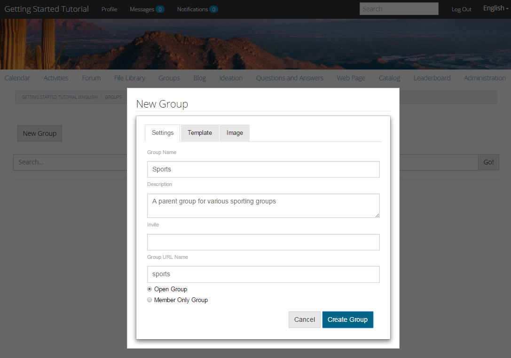
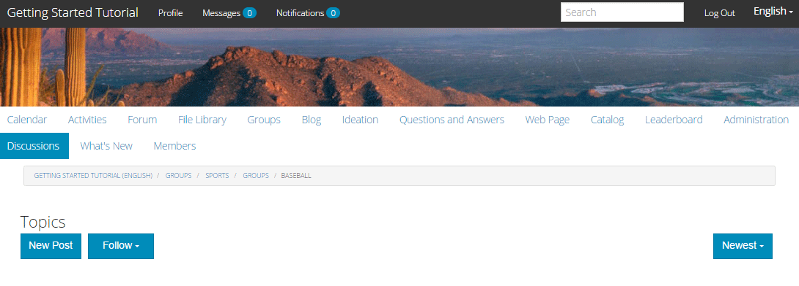

# Esperienza con il sito pubblicato {#experience-the-published-site}

## Passa a nuovo sito in Pubblica {#browse-to-new-site-on-publish}

Ora che il sito community appena creato è stato pubblicato, cerca l’URL visualizzato durante la creazione del sito, ma sul server di pubblicazione, ad esempio:

* URL autore = https://localhost:4502/content/sites/engage/en.html
* URL di pubblicazione = https://localhost:4503/content/sites/engage/en.html

Per minimizzare la confusione su quale membro ha effettuato l&#39;accesso all&#39;autore e alla pubblicazione, si consiglia di utilizzare browser diversi per ogni istanza.

Al primo arrivo sul sito pubblicato, il visitatore del sito in genere non era già connesso e sarebbe anonimo.

`https://localhost:4503/content/sites/engage/en.html {#http-localhost-content-sites-engage-en-html}`

## Visitatore anonimo del sito {#anonymous-site-visitor}

Un visitatore anonimo del sito vede quanto segue nell’interfaccia utente:

* Titolo del sito (Esercitazione introduttiva)
* Nessun collegamento profilo
* Nessun collegamento ai messaggi
* Nessun collegamento di notifica
* Campo di ricerca
* Collegamento di accesso
* Il brand banner
* Collegamenti al menu per i componenti inclusi nel modello del sito di riferimento.

Se selezioni vari collegamenti, li troverai in modalità di sola lettura.

### Impedisci l&#39;accesso anonimo su JCR {#prevent-anonymous-access-on-jcr}

Una limitazione nota espone il contenuto del sito della community ai visitatori anonimi attraverso contenuti jcr e json , anche se **consenti accesso anonimo** è disabilitato per il contenuto del sito. Tuttavia, questo comportamento può essere controllato utilizzando le Restrizioni Sling come soluzione alternativa.

Per proteggere il contenuto del tuo sito community dall’accesso di utenti anonimi tramite contenuti jcr e json , segui questi passaggi:

1. Nell’istanza di AEM Author, vai su https:// hostname:port/editor.html/content/site/sitename.html.

   >[!NOTE]
   >
   >Non andare al sito localizzato.

1. Vai a **Proprietà pagina**.

   

1. Vai a **Avanzate** scheda .

1. Abilita **Autenticazione richiesta**.

   

1. Aggiungi il percorso della pagina di accesso. Ad esempio: **/content/......./GetStarted**.
1. Pubblica la pagina.

## Membro della comunità di fiducia {#trusted-community-member}

Questa esperienza presuppone [Aaron McDonald](/help/communities/tutorials.md#demo-users) è stato assegnato i ruoli di [responsabile della comunità e moderatore](/help/communities/create-site.md#roles). In caso contrario, torna all’ambiente di authoring in [modificare le impostazioni del sito](/help/communities/sites-console.md#modifying-site-properties) e seleziona Aaron McDonald come responsabile della comunità e moderatore.

Nell’angolo in alto a destra, seleziona `Log in`, e accedi con nome utente (aaron.mcdonald@mailinator.com) e password (password). Osserva la possibilità di accedere con le credenziali di Twitter o Facebook.

Una volta effettuato l&#39;accesso come membro della community registrato, noterai le seguenti voci di menu per fare clic ed esplorare il tuo sito community:

* **Profilo** consente di visualizzare e modificare il profilo.
* [Messaggi](/help/communities/configure-messaging.md) opzione ti indirizza alla sezione direct messaging (Messaggistica diretta) in cui puoi:

   1. Visualizza i messaggi diretti ricevuti (Posta in arrivo), inviati (Invio di elementi) ed eliminati (Cestino).
   1. Componi nuovi messaggi diretti da inviare a singoli utenti e gruppi.

* [Notifiche](/help/communities/notifications.md) consente di passare alla sezione notifiche , in cui è possibile visualizzare gli eventi di interesse e modificare le impostazioni di notifica.
* [Amministrazione](/help/communities/published-site.md#moderationlink) Se disponi di privilegi di moderazione, ti indirizza alla pagina di moderazione di AEM Communities.

Nota che la pagina Calendario è la home page perché il modello di sito di riferimento scelto includeva prima la funzione Calendario, seguita dalla funzione Flusso di attività, dalla funzione Forum e così via. Questa struttura è visibile dal [Modello del sito](/help/communities/sites.md#edit-site-template) console o quando si modificano le proprietà del sito nell’ambiente di authoring:

>[!NOTE]
>
>Per ulteriori informazioni sui componenti e sulle funzioni di Communities, visita:
>
>* [Componenti di Communities](/help/communities/author-communities.md) (per gli autori)
>* [Componenti, funzioni e funzioni di base](/help/communities/essentials.md) (per sviluppatori)

### Collegamento al forum {#forum-link}

Per visualizzare la funzione forum di base, seleziona il collegamento Forum .

I membri possono pubblicare un nuovo argomento o seguire un argomento.

I visitatori del sito possono visualizzare i post e ordinarli in vari modi.

### Collegamento gruppi {#groups-link}

Poiché Aaron è un amministratore di gruppo, la selezione del collegamento Gruppi consentirà ad Aaron di creare un nuovo gruppo di community selezionando un modello di gruppo, un’immagine, se il gruppo è aperto o segreto e invitando i membri.

Questo è un esempio di creazione di un gruppo nell’ambiente di pubblicazione.

I gruppi possono anche essere creati nell’ambiente di authoring e gestiti all’interno del sito della community nell’ambiente di authoring ([Console Gruppi community](/help/communities/groups.md)). L&#39;esperienza di [creazione di gruppi sull&#39;autore](/help/communities/nested-groups.md) è il successivo in questa esercitazione.

Crea un gruppo di riferimento:

1. Seleziona **Nuovo gruppo**
1. **Scheda Impostazioni**

   * Nome gruppo : `Sports`
   * Descrizione : `A parent group for various sporting groups`.
   * Nome URL del gruppo : `sports`
   * Seleziona `Open Group` (consentire a qualsiasi membro della comunità di partecipare partecipando)

1. **Scheda Modello**

   * Seleziona `Reference Group` (contiene una funzione di gruppi nella sua struttura per consentire i gruppi nidificati)

1. Seleziona **Crea gruppo**

   

Dopo la creazione del nuovo gruppo, **seleziona il nuovo gruppo Sport** per creare due gruppi (nidificati) al suo interno. Poiché una struttura del sito non può iniziare con la funzione gruppi, dopo l&#39;apertura del gruppo Sport, è necessario selezionare il collegamento Gruppi:

Il secondo insieme di collegamenti, a partire da `Blog`, appartengono al gruppo attualmente selezionato, il `Sports` gruppo. Selezionando Sport&#39; `Groups` link, è possibile nidificare due gruppi all&#39;interno del gruppo Sport.

Ad esempio, aggiungi due `new groups`.

* Un nome `Baseball`

   * Lascia impostato come `Open Group` (iscrizione obbligatoria).
   * Nella scheda Modelli selezionare `Conversational Group`.

* Un nome `Gymnastics`

   * Cambia l&#39;impostazione in `Member Only Group` (iscrizione limitata).
   * Nella scheda Modelli selezionare `Conversational Group`.

**Avviso**:

* Potrebbe essere necessario aggiornare la pagina prima di visualizzare entrambi i gruppi.
* Questo modello *not* includi la funzione gruppi, quindi non sarà possibile effettuare ulteriori nidificazioni dei gruppi.
* Su autore, il [Console Gruppi](/help/communities/groups.md) fornisce una terza scelta - un `Public Group` (iscrizione facoltativa).

Una volta creati entrambi i gruppi, selezionare il gruppo di baseball, un gruppo aperto e notare i relativi collegamenti:

`Discussions` `What's New` `Members`

I collegamenti del gruppo vengono visualizzati sotto i collegamenti del sito principale e i risultati sono i seguenti:

All’autore - con privilegi amministrativi, accedi al [Console Gruppi community](/help/communities/members.md) e aggiungi Weston McCall al `Community Engage Gymnastics <uid> Members` gruppo.

Continuando a pubblicare, disconnettiti come Aaron McDonald e visualizza i gruppi nel Gruppo Sport come visitatore anonimo del sito:

* Dalla home page
* Seleziona `Groups` collegamento
* Seleziona `Sports` collegamento
* Seleziona gli Sport&#39; `Groups` collegamento

Sarà visibile solo il gruppo di baseball.

Accedi come Weston McCall (weston.mccall@dodgit.com / password) e naviga nella stessa posizione. Notate che Weston è in grado di `Join` aprire `Baseball` gruppo e `enter or Leave` privato `Gymnastics` gruppo.

### Collegamento a una pagina web {#web-page-link}

Visualizzare la pagina Web di base inclusa nel sito selezionando il collegamento alla pagina Web. Gli strumenti standard di authoring AEM possono essere utilizzati per aggiungere contenuti a questa pagina nell’ambiente di authoring.

Ad esempio, vai a **autore** istanza, apri `engage` nella cartella [Console Sites di Communities](/help/communities/sites-console.md), seleziona **Apri sito** per accedere alla modalità di modifica dell’autore. Quindi seleziona la modalità di anteprima per selezionare il `Web Page` , quindi seleziona la modalità di modifica per aggiungere i componenti Titolo e Testo . Infine, ripubblica solo la pagina o l’intero sito.

### Collegamento moderazione {#moderationlink}

Quando il membro della community dispone di privilegi di moderazione, il collegamento Moderazione sarà visibile e la sua selezione visualizzerà il contenuto della community pubblicato e lo consentirà [moderato](/help/communities/moderate-ugc.md) in modo simile al [console di moderazione](/help/communities/moderation.md) nell’ambiente di authoring.

Utilizza il pulsante Indietro del browser per tornare al sito pubblicato. La maggior parte delle console non è accessibile dalla navigazione globale nell’ambiente di pubblicazione.

## Registrazione automatica {#self-registration}

Dopo la disconnessione, è possibile creare una nuova registrazione utente.

* Seleziona `Log In`
* Seleziona `Sign up for a new account`

Per impostazione predefinita, l’indirizzo e-mail è l’ID di accesso. Se questa opzione è deselezionata, il visitatore può immettere il proprio ID di accesso (nome utente). Il nome utente deve essere univoco nell’ambiente di pubblicazione.

Dopo aver specificato il nome dell&#39;utente, l&#39;e-mail e la password, seleziona `Sign Up` creerà l&#39;utente e gli consentirà di firmare.

Una volta effettuato l’accesso, la prima pagina presentata è la `Profile` , che possono personalizzare.

Se il membro dimentica il suo ID di accesso, è possibile recuperare utilizzando il suo indirizzo e-mail.

