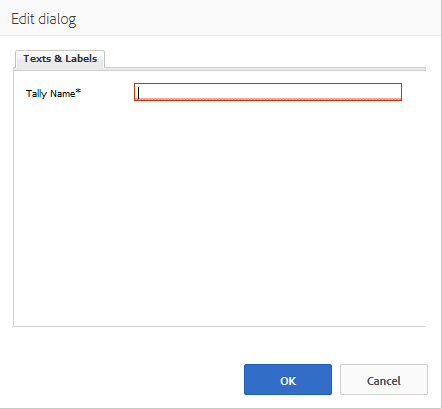

# Utilizzo delle valutazioni {#using-ratings}

Il `Rating` componente viene utilizzato autonomamente o in combinazione con altre funzioni di Communities. Questo componente permette ai membri della community che hanno effettuato l’accesso di esprimere le proprie opinioni in base al punteggio contenuto.

## Adding a Rating to a Page {#adding-a-rating-to-a-page}

Per aggiungere un `Rating` componente a una pagina in modalità di creazione, individuate il componente `Communities / Rating` e trascinatelo nella posizione desiderata sulla pagina, ad esempio una posizione relativa alla funzione per la quale i membri possono assegnare una valutazione.

Per le informazioni necessarie, consulta [Community Components Basics](basics.md).

Quando vengono incluse le librerie [lato client](rating-basics.md#essentials-for-client-side) richieste, viene visualizzato così il `Rating` componente.

## Configurazione della valutazione {#configuring-rating}

Selezionate il `Rating` componente inserito a cui accedere e selezionate l’ `Configure` icona che apre la finestra di dialogo di modifica.

Nella scheda **[!UICONTROL Testo ed etichette]** è possibile specificare l’identificatore interno per la valutazione.

**[!UICONTROL Tally Name]**(*Obbligatorio*) Un nome semplice per il `Rating` quale l&#39;istanza viene identificata in modo univoco. Deve essere un nome di nodo valido per il repository.

## Esperienza dei visitatori del sito {#site-visitor-experience}

### Membri {#members}

È consentita una sola valutazione per membro. Il membro può cambiare la propria valutazione in qualsiasi momento.

### Anonimo {#anonymous}

L&#39;invio anonimo di una valutazione non è supportato. I visitatori del sito devono registrarsi (diventare membri) ed effettuare l’accesso per partecipare.

## Informazioni aggiuntive {#additional-information}

Ulteriori informazioni sono disponibili nella pagina [Valutazione di base](rating-basics.md) per gli sviluppatori.
