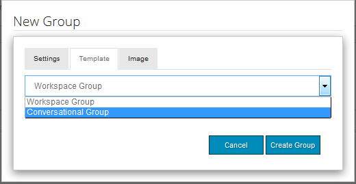

# Console Rapporti{#reports-console}

## Panoramica {#overview}

Per AEM Communities, esistono diversi rapporti a cui è possibile accedere in diversi modi dall&#39;ambiente di authoring.

In generale, le varie relazioni sono:

* [Rapporto](#assignments-report) Assegnazioni - per una comunità di [abilitazione](/help/communities/overview.md#enablement-community), fornisce una panoramica dei progressi compiuti dagli studenti nelle loro mansioni, inclusa una valutazione associata nell&#39;implementazione dello standard SCORM
* [Rapporto](#views-report) visualizzazioni - fornisce un grafico dei contenuti per membri della community e visitatori del sito per qualsiasi sito della community
* [Rapporto](#posts-report) Post - fornisce un grafico dei vari tipi di post dei membri della community in qualsiasi sito della community

Quando [Adobe Analytics è abilitato](/help/communities/sites-console.md#analytics), i rapporti includeranno il numero di visualizzazioni, riproduzioni, commenti e valutazioni per ciascuna risorsa di abilitazione nel tempo

I rapporti tabulari possono essere esportati in formato .csv per l’elaborazione successiva.

## Console di reporting {#reporting-consoles}

### Report per siti community {#reports-for-community-sites}

* dalla navigazione globale : **Navigazione**, **Community, Rapporti**

* scegli

   * **Rapporto assegnazioni**

      * genera un rapporto per il sito, l&#39;utente o il gruppo community selezionato e l&#39;assegnazione

      * **Rapporto sui post**

         * genera un rapporto per il sito community selezionato, il tipo di contenuto e il periodo di tempo
      * **Rapporto visualizzazioni**

         * genera un rapporto per il sito community selezionato, il tipo di contenuto e il periodo di tempo

### Rapporti per risorse di abilitazione e percorsi di apprendimento {#reports-for-enablement-resources-and-learning-paths}

* dalla navigazione globale: **Navigazione**, **Community, Risorse**

* selezionare un sito community di abilitazione esistente

   * selezionare **Report **icona per generare rapporti che coprono tutte le risorse di abilitazione
   * selezionare un percorso di apprendimento per l&#39;abilitazione
   * selezionare **Report **icona per generare report per

      * le risorse di abilitazione incluse
      * studenti assegnati al percorso di apprendimento

* questi rapporti forniscono:

   * dati di tabella, scaricabili come CSV

      * identificare lo studente
      * status
      * assegnazione o accesso tramite catalogo
      * numero di osservazioni formulate
      * classificazione a stella

Per ulteriori dettagli, consultate la sezione  Rapporti della console Risorse.

## Rapporto assegnazioni {#assignments-report}

La console Assegnazioni consente di filtrare i rapporti in base all&#39;abilitazione del sito community, degli utenti o dei gruppi e dell&#39;assegnazione.

Il rapporto fornisce informazioni sui loro progressi nonché eventuali commenti o valutazioni forniti.

Seleziona i criteri per il rapporto:

* **Sito**

   selezionare un sito di abilitazione community

* **Utente o gruppo**
   * selezionate Utente per generare un rapporto per uno studente
   * selezionate Gruppo per generare un rapporto per un gruppo di utenti in formazione
   Il servizio tunnel accederà ai membri e ai gruppi di membri dall&#39;ambiente di pubblicazione

* **Assegnazione**

   Scegli tra le risorse di abilitazione assegnate agli studenti selezionati

Selezionate **Genera** per creare il rapporto:

## Rapporto visualizzazioni {#views-report}

La console Visualizzazioni consente di generare rapporti sulle visualizzazioni di pagina in base alle funzioni per community per un determinato periodo di tempo.

Seleziona i criteri per il rapporto:

* **Sito**

   selezionare un sito community

* **Tipo di contenuto**

   può scegliere Tutto il contenuto o selezionare una delle funzioni presenti sul sito

* periodo

   seleziona uno dei

   * Ultimi 7 giorni
   * Ultimi 30 giorni
   * Ultimi 90 giorni
   * Ultimo anno

Selezionate **Genera** per creare il rapporto:

## Rapporto sui post {#posts-report}

La console Post consente di generare rapporti sul numero di post alle funzioni della community per un determinato periodo di tempo.

Seleziona i criteri per il rapporto:

* **Sito**

   selezionare un sito community

* **Tipo di contenuto**

   può scegliere Tutto il contenuto o selezionare una delle funzioni presenti sul sito

* periodo

   seleziona uno dei

   * Ultimi 7 giorni
   * Ultimi 30 giorni
   * Ultimi 90 giorni
   * Ultimo anno

Selezionate **Genera** per creare il rapporto:

## Risoluzione dei problemi {#troubleshooting}

### Nessun sito community elencato {#no-community-sites-listed}

Se non sono elencati siti community, accertati che Adobe Analytics sia stato abilitato per un sito. Se scegli rapporti sulle assegnazioni, assicurati che la funzione delle assegnazioni sia nella struttura del sito della community.

### I rapporti non vengono visualizzati nell&#39;istanza di AEM Author {#reports-do-not-show-in-aem-author-instance}

Se i rapporti non vengono visualizzati nell&#39;istanza di AEM Author, controllate se sono disponibili personalizzazioni, ad esempio la mappatura URL sull&#39;istanza di Publish. Se la mappatura URL viene effettuata solo sull&#39;istanza AEM Publish del sito community, accertati che lo stesso sia stato configurato nell&#39;istanza AEM Author in **Site Trend Report Social Component Factory **Configuration.

