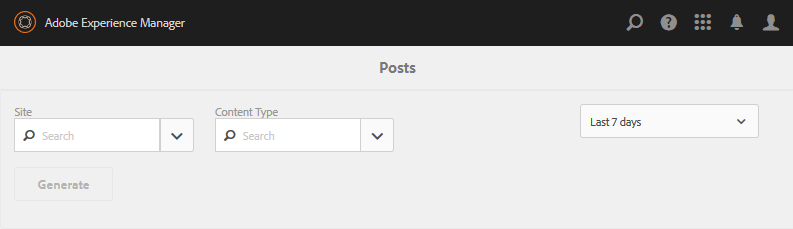
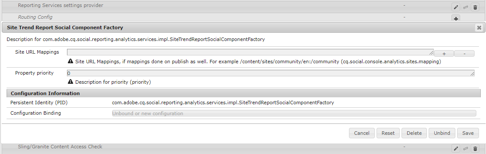

# Console Rapporti {#reports-console}

## Panoramica {#overview}

Per AEM Communities, esistono vari rapporti a cui è possibile accedere in diversi modi dall’ambiente di authoring.

In generale, le varie relazioni sono le seguenti:

* [Rapporto visualizzazioni](#views-report)

  Fornisce un grafico delle visualizzazioni del contenuto da parte dei membri della community e dei visitatori del sito per qualsiasi sito della community.

* [Rapporto Post](#posts-report)

  Fornisce un grafico di vari tipi di post dei membri della community su qualsiasi sito della community.

I report tabulari possono essere esportati in formato .csv per l’elaborazione successiva.

## Console di reporting {#reporting-consoles}

### Rapporti per i siti community {#reports-for-community-sites}

* Dalla navigazione globale: **[!UICONTROL Navigazione]** > **[!UICONTROL Community]** >  **[!UICONTROL Rapporti]**

* Scegli tra:

   * **[!UICONTROL Rapporto assegnazioni]**

      * Genera un report per il sito community, l&#39;utente o il gruppo e l&#39;assegnazione selezionati.

   * **[!UICONTROL Rapporto Post]**

      * Genera un report per il sito community, il tipo di contenuto e il periodo di tempo selezionati.

   * **[!UICONTROL Rapporto visualizzazioni]**

      * genera un report per il sito community, il tipo di contenuto e il periodo di tempo selezionati.

## Rapporto visualizzazioni {#views-report}

La console Visualizzazioni consente di generare rapporti sulle visualizzazioni di pagina in base alle funzioni della community per un determinato periodo di tempo.

Selezionare i criteri per il rapporto:

* **[!UICONTROL Sito]**

  Selezionare un sito community.

* **[!UICONTROL Tipo di contenuto]**

  Puoi scegliere Tutti i contenuti o selezionare una delle funzioni presenti sul sito.

* **[!UICONTROL Intervallo temporale]**

  Seleziona una delle seguenti opzioni:

   * Ultimi 7 giorni
   * Ultimi 30 giorni
   * Ultimi 90 giorni
   * Ultimo anno

Seleziona **[!UICONTROL Genera]** per creare il rapporto.

## Rapporto sui post {#posts-report}

La console Post consente di generare rapporti sul numero di post nelle funzioni della community per un determinato periodo di tempo.

Selezionare i criteri per il rapporto:

* **[!UICONTROL Sito]**

  Selezionare un sito community.

* **[!UICONTROL Tipo di contenuto]**

  Puoi scegliere Tutti i contenuti o selezionare una delle funzioni presenti sul sito.

* **[!UICONTROL Intervallo temporale]**

  Seleziona una delle seguenti opzioni:

   * Ultimi 7 giorni
   * Ultimi 30 giorni
   * Ultimi 90 giorni
   * Ultimo anno

Seleziona **[!UICONTROL Genera]** per creare il rapporto.

## Risoluzione dei problemi {#troubleshooting}

### Nessun sito community elencato {#no-community-sites-listed}

Se non sono elencati siti della community, accertati che Adobe Analytics sia stato abilitato per un sito. Se si sceglie di creare rapporti sulle assegnazioni, assicurarsi che la funzione delle assegnazioni sia inclusa nella struttura del sito community.

### I rapporti non vengono visualizzati nell’istanza di creazione AEM {#reports-do-not-show-in-aem-author-instance}

Se i rapporti non vengono visualizzati nell’istanza Autore AEM, controlla le personalizzazioni, ad esempio la mappatura URL nell’istanza Pubblica. Se la mappatura URL viene eseguita solo sull’istanza di pubblicazione AEM del sito Communities, accertati che lo stesso sia stato configurato nell’istanza di authoring AEM in **Fabbrica componenti social per report tendenze sito** configurazione.

