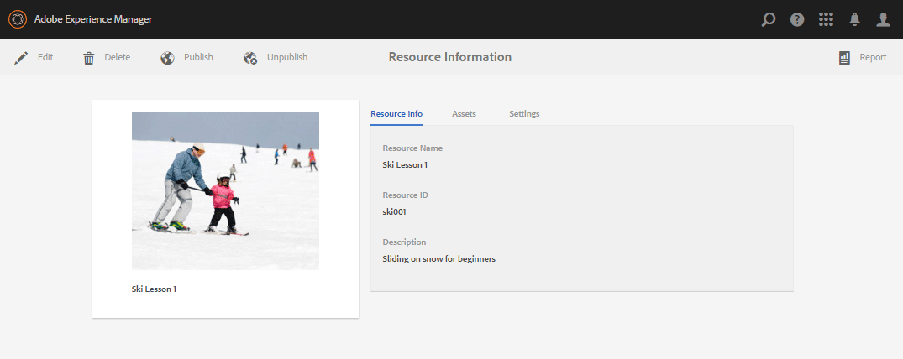

# Creare e assegnare risorse di abilitazione {#create-and-assign-enablement-resources}

## Aggiungi una risorsa di abilitazione {#add-an-enablement-resource}

Per aggiungere una risorsa di abilitazione al nuovo sito della community:

* Effettua l’accesso come amministratore di sistema nell’istanza di authoring:
   * Ad esempio: [http://localhost:4502/](Http://localhost:4503/)
* Dalla navigazione globale, seleziona **[!UICONTROL Community]** > **[!UICONTROL Risorse]**

   

   
* Seleziona il sito community a cui vengono aggiunte le risorse di abilitazione:
   * Seleziona **[!UICONTROL Tutorial sull’abilitazione]**.
* Dal menu , seleziona **[!UICONTROL Crea]**.
* Seleziona **[!UICONTROL Risorsa]**.

### Informazioni di base {#basic-info}

Compila le informazioni di base per la risorsa:

* **[!UICONTROL Nome sito]**

   Imposta il nome del sito community selezionato: Tutorial sull’abilitazione

* **[!UICONTROL Nome &amp;risorsa;]**

   Lezioni di sci 1

* **[!UICONTROL Tag]**

   Esercitazione: Sport / Sci

* **[!UICONTROL Mostra nel catalogo]**

   Impostalo su **On**.

* **[!UICONTROL Descrizione]**

   Scivolare sulla neve per principianti.

* **[!UICONTROL Aggiungi]**

   Aggiungi un&#39;immagine per rappresentare la risorsa al membro nella relativa vista Assegnazioni.

   

* Seleziona **[!UICONTROL Avanti]**

### Aggiungi contenuto {#add-content}

Viene visualizzato come se fosse possibile selezionare più risorse, ma solo una è consentita.

Seleziona la `'+' icon`, nell&#39;angolo in alto a destra, per iniziare il processo di scelta della risorsa identificando l&#39;origine.

Carica una risorsa. Se una risorsa video, carica un’immagine personalizzata da visualizzare prima dell’avvio della riproduzione del video o consente di generare una miniatura dal video (potrebbero essere necessari alcuni minuti, non è necessario attendere).

* Seleziona **[!UICONTROL Avanti]**.

### Impostazioni {#settings}

* **[!UICONTROL Impostazioni social]**

   Lascia le impostazioni predefinite per esaminare i commenti e la valutazione delle risorse di abilitazione da parte degli studenti.

* **[!UICONTROL Data di scadenza]**

   *(Facoltativo)* È possibile selezionare una data entro la quale l&#39;assegnazione deve essere completata.

* **[!UICONTROL Autore risorse]**

   *(Facoltativo)* Lascia vuoto.

* **[!UICONTROL Contatto &amp;risorsa;]**

   *(Obbligatorio)* Utilizzare il menu a discesa per selezionare un membro `Quinn Harper`.

* **[!UICONTROL Esperto risorse]**

   *(Facoltativo)* Lascia vuoto.

   **Nota**: Se gli utenti o i gruppi non sono visibili, verifica che siano stati aggiunti al `Community Enable Members` gruppo e *Salvato* nell’istanza di pubblicazione.

   

* Seleziona **[!UICONTROL Avanti]**

### Assegnazioni {#assignments}

* **[!UICONTROL Aggiungi assegnatari]**

   Lascia non impostato perché questa risorsa di abilitazione verrà aggiunta a un percorso di apprendimento. Se uno studente viene assegnato alla singola risorsa di abilitazione e a un percorso di apprendimento contenente la risorsa di abilitazione, lo studente verrà assegnato due volte alla risorsa di abilitazione.

   

* Seleziona **[!UICONTROL Crea]**

   

La creazione della risorsa viene ripristinata nella console Risorse selezionando la risorsa appena creata. Da questa console è possibile pubblicare, aggiungere studenti e modificare altre impostazioni.

Per caricare una nuova versione della risorsa di abilitazione, è consigliabile creare una nuova risorsa, quindi annullare l’iscrizione dei membri dalla versione precedente e iscriverli nella nuova versione.

### Pubblicare la risorsa {#publish-the-resource}

Prima che gli iscritti possano vedere il Rescourse assegnato, è necessario pubblicarlo:

* Seleziona il mondo `Publish` icona

L’attivazione viene confermata con un messaggio di successo:

## Aggiungi una seconda risorsa di abilitazione {#add-a-second-enablement-resource}

Ripeti i passaggi precedenti per creare e pubblicare una seconda risorsa di abilitazione correlata dalla quale verrà creato un percorso di apprendimento.

**Pubblica** la seconda risorsa.

Torna all’elenco delle risorse di Enablement Tutorial.

*Suggerimento: Se entrambe le risorse non sono visibili, aggiorna la pagina.*

## Aggiungere un percorso di apprendimento {#add-a-learning-path}

Un percorso di apprendimento è un raggruppamento logico di risorse di abilitazione che formano un corso.

* Dalla console Risorse, seleziona `+ Create`
* Seleziona **[!UICONTROL Percorso di apprendimento]**

Aggiungi il **[!UICONTROL Informazioni di base]**:

* **[!UICONTROL Nome percorso di apprendimento]**

   Lezioni di sci

* **[!UICONTROL Tag]**

   Esercitazione: Sciare

* **[!UICONTROL Mostra nel catalogo]**

   Lascia deselezionato

* **[!UICONTROL Caricare un’immagine]**

   Per rappresentare il percorso di apprendimento nella console Risorse .

   

* Seleziona **[!UICONTROL Avanti]**.

Ignora il pannello successivo in quanto non sono presenti percorsi di apprendimento preliminari da aggiungere.

* Seleziona **[!UICONTROL Avanti]**

Nel pannello Aggiungi risorse :

* Seleziona `+ Add Resources` per selezionare le 2 risorse sciistiche da aggiungere al percorso di apprendimento.

   Nota: Solo **pubblicato** Le risorse saranno selezionabili.

>[!NOTE]
>
>È possibile selezionare solo le risorse disponibili allo stesso livello del percorso di apprendimento. Ad esempio, per un percorso di apprendimento creato in un gruppo sono disponibili solo le risorse a livello di gruppo; per un percorso di apprendimento creato in un sito community, le risorse in tale sito sono disponibili per l’aggiunta al percorso di apprendimento.

* Seleziona **[!UICONTROL Invia]**.

   

   

* Seleziona **[!UICONTROL Avanti]**

   

* **[!UICONTROL Aggiungi assegnatari]**

   Utilizza il menu a discesa per selezionare il `Community Ski Class` gruppo, che deve includere i membri `Riley Taylor` e `Sidney Croft.`

* **[!UICONTROL Percorso di apprendimento Contatti&amp;ast;]**

   *(Obbligatorio)* Utilizzare il menu a discesa per selezionare un membro `Quinn Harper`.

* Seleziona **[!UICONTROL Crea]**.

   

La creazione corretta del percorso di apprendimento torna alla console Risorse con il percorso di apprendimento appena creato selezionato. Da questa console è possibile pubblicare, aggiungere studenti e modificare altre impostazioni.

**Pubblica** il percorso di apprendimento.
