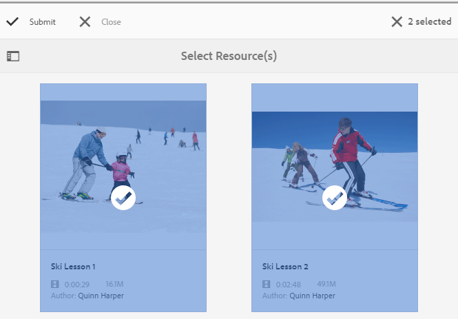

# Creazione e assegnazione di risorse di abilitazione {#create-and-assign-enablement-resources}

## Aggiunta di una risorsa di abilitazione {#add-an-enablement-resource}

Per aggiungere una risorsa di abilitazione al nuovo sito community:

* Effettuate il login come amministratore di sistema nell’istanza di creazione:
   * Ad esempio, [http://localhost:4502/](Http://localhost:4503/)
* Dalla navigazione globale, selezionate **[!UICONTROL Community]** > **[!UICONTROL Risorse]**

   

   
* Selezionate il sito della community in cui vengono aggiunte le risorse di abilitazione:
   * Selezionate **[!UICONTROL Esercitazione]** di abilitazione.
* Dal menu, selezionate **[!UICONTROL Crea]**.
* Selezionare **[!UICONTROL Risorsa]**.

### Informazioni di base {#basic-info}

Compila le informazioni di base per la risorsa:

* **[!UICONTROL Nome sito]**

   Impostate il nome del sito community selezionato: Esercitazione di abilitazione

* **[!UICONTROL Nome risorsa&amp;ast;]**

   Lezione di sci 1

* **[!UICONTROL Tag]**

   Esercitazione: Sport / Sci

* **[!UICONTROL Mostra nel catalogo]**

   Impostatelo su **On**.

* **[!UICONTROL Descrizione]**

   Scivolare sulla neve per principianti.

* **[!UICONTROL Aggiungi]**

   Aggiungere un&#39;immagine per rappresentare la risorsa al membro nella visualizzazione Assegnazioni.

   

* Seleziona **[!UICONTROL Avanti]**

### Aggiungi contenuto {#add-content}

Anche se è possibile selezionare più risorse, ne è consentita solo una.

Selezionare `'+' icon`, nell&#39;angolo superiore destro, per iniziare il processo di scelta della risorsa identificando l&#39;origine.

Carica una risorsa. Se una risorsa video, caricate un’immagine personalizzata da visualizzare prima dell’inizio della riproduzione del video oppure consentite la generazione di una miniatura dal video (potrebbe richiedere alcuni minuti - non è necessario attendere).

* Seleziona **[!UICONTROL Avanti]**.

### Impostazioni {#settings}

* **[!UICONTROL Impostazioni social]**

   Lasciate le impostazioni predefinite per provare a utilizzare commenti e valutazioni delle risorse di abilitazione da parte degli studenti.

* **[!UICONTROL Data di scadenza]**

   *(Facoltativo)* È possibile selezionare una data entro la quale completare l&#39;assegnazione.

* **[!UICONTROL Autore risorse]**

   *(Facoltativo)* Lasciate vuoto.

* **[!UICONTROL Contatto &amp;risorsa;ast;]**

   *(Obbligatorio)* Utilizzate il menu a discesa per selezionare un membro `Quinn Harper`.

* **[!UICONTROL Esperto risorse]**

   *(Facoltativo)* Lasciate vuoto.

   **Nota**: Se gli utenti o i gruppi non sono visibili, accertatevi che siano stati aggiunti al `Community Enable Members` gruppo e *salvati* nell’istanza di pubblicazione.

   

* Seleziona **[!UICONTROL Avanti]**

### Assegnazioni {#assignments}

* **[!UICONTROL Aggiungi assegnatari]**

   Non impostate perché questa risorsa di abilitazione verrà aggiunta a un percorso di apprendimento. Se uno studente viene assegnato sia alla singola risorsa di abilitazione che a un percorso di apprendimento contenente la risorsa di abilitazione, lo studente verrà assegnato due volte alla risorsa di abilitazione.

   

* Seleziona **[!UICONTROL Crea]**

   

La creazione della risorsa è riuscita e torna alla console Risorse con la risorsa appena creata selezionata. Da questa console è possibile pubblicare, aggiungere utenti in formazione e modificare altre impostazioni.

Per caricare una nuova versione della risorsa di abilitazione, si consiglia di creare una nuova risorsa, quindi di annullare l’iscrizione dei membri dalla versione precedente e di iscriverli nella nuova versione.

### Pubblicare la risorsa {#publish-the-resource}

Prima che gli iscritti siano in grado di visualizzare il corso di aggiornamento assegnato, è necessario pubblicarlo:

* Seleziona l’ `Publish` icona del mondo

L&#39;attivazione viene confermata con un messaggio di riuscita:

## Aggiunta di una seconda risorsa di abilitazione {#add-a-second-enablement-resource}

Ripetete i passaggi descritti qui sopra per creare e pubblicare una seconda risorsa di abilitazione correlata dalla quale verrà creato un percorso di apprendimento.

**Pubblicate** la seconda risorsa.

Tornate all&#39;elenco delle risorse di Enablement Tutorial.

*Suggerimento: Se entrambe le risorse non sono visibili, aggiorna la pagina.*

## Aggiungere un percorso di apprendimento {#add-a-learning-path}

Un percorso di apprendimento è un gruppo logico di risorse di abilitazione che formano un corso.

* Dalla console Risorse, selezionate `+ Create`
* Seleziona percorso **[!UICONTROL di apprendimento]**

Aggiungete le informazioni **[!UICONTROL di base]**:

* **[!UICONTROL Nome percorso di apprendimento]**

   Lezioni di sci

* **[!UICONTROL Tag]**

   Esercitazione: Sci

* **[!UICONTROL Mostra nel catalogo]**

   Non selezionato

* **[!UICONTROL Caricare un’immagine]**

   Per rappresentare il percorso di apprendimento nella console Risorse.

   

* Seleziona **[!UICONTROL Avanti]**.

Saltate il pannello successivo in quanto non sono disponibili percorsi di apprendimento preliminari da aggiungere.

* Seleziona **[!UICONTROL Avanti]**

Nel pannello Aggiungi risorse:

* Selezionate `+ Add Resources` per selezionare le 2 risorse sciistiche da aggiungere al percorso di apprendimento.

   Nota: Sarà possibile selezionare solo le risorse **pubblicate** .

>[!NOTE]
>
>Potete selezionare solo le risorse disponibili allo stesso livello del percorso di apprendimento. Ad esempio, per un percorso di apprendimento creato in un gruppo sono disponibili solo le risorse a livello di gruppo; per un percorso di apprendimento creato in un sito community, le risorse in tale sito sono disponibili per l&#39;aggiunta al percorso di apprendimento.

* Seleziona **[!UICONTROL Invia]**.

   

   

* Seleziona **[!UICONTROL Avanti]**

   

* **[!UICONTROL Aggiungi assegnatari]**

   Utilizzate il menu a discesa per selezionare il `Community Ski Class` gruppo, che deve includere i membri `Riley Taylor` e `Sidney Croft.`

* **[!UICONTROL Percorso di apprendimento Contatto&amp;ast;]**

   *(Obbligatorio)* Utilizzate il menu a discesa per selezionare un membro `Quinn Harper`.

* Seleziona **[!UICONTROL Crea]**.

   

La creazione corretta del percorso di apprendimento torna alla console Risorse con il nuovo percorso di apprendimento selezionato. Da questa console è possibile pubblicare, aggiungere utenti in formazione e modificare altre impostazioni.

**Pubblicate** il percorso di apprendimento.

