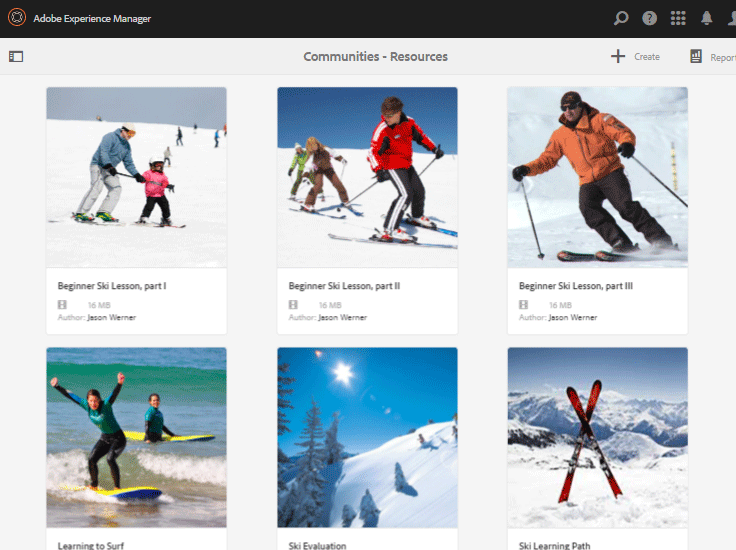
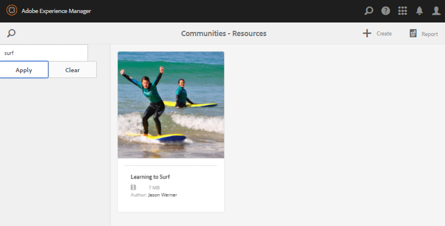
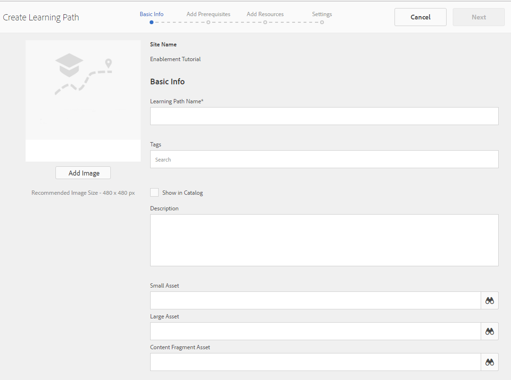

# Console Risorse di abilitazione {#enablement-resources-console}

Per AEM Communities, nella console Risorse è possibile [abilitare i responsabili](users.md) creare, gestire e assegnare risorse ai membri di un sito della community di abilitazione.

## Requisiti {#requirements}

Prima di aggiungere risorse di abilitazione per un sito community, le istanze AEM devono essere configurate correttamente, tra cui:

* SCORM
* FFmpeg

Per informazioni dettagliate, consulta [Configurazione di abilitazione](enablement.md).

>[!CAUTION]
>
>Se SCORM è installato dopo la creazione di un sito community, è necessario ricreare tutte le risorse di abilitazione presenti prima dell’installazione di SCORM.

>[!NOTE]
>
>Con il rilascio di [AEM 6.3](deploy-communities.md#latestfeaturepack) e dei pacchetti di funzioni per le community equivalenti [AEM 6.2 FP3](deploy-communities.md#latestfeaturepack) e [AEM 6.1 FP7](https://docs.adobe.com/content/docs/en/aem/6-1/deploy/communities.html#Latest Feature Pack), la funzione di abilitazione non richiede più un [database MySQL](mysql.md).

## Terminologia {#terminology}

### Risorsa {#resource}

Le risorse sono essenziali per una [community di abilitazione](overview.md#enablement-community). Sono i materiali assegnati ai membri che consentono loro di migliorare le loro competenze.

Caratteristiche di una risorsa:

* Può essere di tipo:
   * Immagine (JPG, PNG, GIF, BMP)
   * Video (MP4)
   * Flash (SWF)
   * Documento (PDF)
   * Quiz (SCORM)
* È possibile fare riferimento a uno o più percorsi di apprendimento.

### Percorso di apprendimento {#learning-path}

Un percorso di apprendimento è un insieme logico di risorse di abilitazione raggruppate insieme per facilitare l’assegnazione ai membri.

### Gruppo di membri {#members-group}

Quando si crea un sito community, il nome assegnato al sito per l&#39;URL viene utilizzato nella creazione dei gruppi di utenti [specifici del sito](users.md) configurati con varie autorizzazioni per vari ruoli. Tutti questi gruppi creati automaticamente hanno il prefisso `Community <site-name>`.

Un gruppo di utenti di questo tipo è `Community <site-name> Members` , che identifica gli utenti registrati nell’ambiente di pubblicazione come membri della community. Per un esempio, consulta l’esercitazione [Guida introduttiva ad AEM Communities per l’abilitazione](getting-started-enablement.md) .

Per le [community di coinvolgimento](overview.md#egagementcommunity), è ragionevole consentire ai visitatori del sito di registrarsi o utilizzare l&#39;accesso social, al punto in cui vengono aggiunti automaticamente al gruppo di membri.

Per [comunità di abilitazione](overview.md#enablement-community), si consiglia di rendere il sito privato, che quindi richiede un amministratore per aggiungere utenti al gruppo di membri.

## Accesso alle risorse di abilitazione di un sito community {#accessing-a-community-site-s-enablement-resources}

### Passa a Risorse di Communities {#navigate-to-communities-resources}

Nell’ambiente di creazione, per accedere alla console Risorse

* Dalla navigazione globale: **[!UICONTROL Navigazione]** > **[!UICONTROL Comunità]** > **[!UICONTROL Risorse]**

   

### Selezionare un sito community {#select-a-community-site}

Nella console Risorse di Communities vengono visualizzati tutti i siti della community.

Le risorse di abilitazione vengono create per un sito community specifico dopo aver selezionato il sito dalla console Risorse .

Una volta selezionato un sito community specifico, tutte le risorse di abilitazione e i percorsi di apprendimento esistenti sono accessibili per la gestione e la modifica e possono essere create nuove risorse di abilitazione e percorsi di apprendimento.

#### Ricerca {#search-features}

Seleziona l’icona di attivazione/disattivazione del pannello laterale per cercare una risorsa di abilitazione o un percorso di apprendimento. Quando questa opzione è selezionata, un pannello di ricerca si apre sul lato sinistro della console e fornisce una casella di testo in cui è possibile inserire i termini di ricerca.

#### Modalità di selezione {#selection-mode}

Per selezionare più risorse di abilitazione, passa il mouse sulla scheda e seleziona l’icona a forma di segno di spunta. Una volta selezionata, selezionando un&#39;altra scheda la aggiungerà al gruppo di selezione. Quando si seleziona una seconda volta, la scheda viene deselezionata.

## Creare una risorsa {#create-a-resource}

Per aggiungere una nuova risorsa di abilitazione al sito community

* Seleziona l’icona `Create` .
* Dal sottomenu visualizzato, selezionare **[!UICONTROL Risorsa]**.

Viene avviato un processo dettagliato di:

* Descrizione della risorsa (nome, immagine a schede e testo).
* Selezione del contenuto della risorsa.
* Selezione di un’immagine di copertina per la risorsa.
* Identificazione dei contatti delle risorse.
* Assegnazione di risorse ai membri.

Quando la risorsa fa parte di un corso, un percorso di apprendimento, i membri devono essere assegnati solo al percorso di apprendimento. È possibile aggiungere assegnazioni dopo la creazione della risorsa di abilitazione.

### 1 Informazioni di base {#basic-info}

* **[!UICONTROL Aggiungi]**

   (*Facoltativo*) Immagine da visualizzare sulla scheda della risorsa di abilitazione nella pagina delle assegnazioni del membro e nella console Risorse. L&#39;immagine viene selezionata dal file system locale del server. Se non viene fornita un’immagine, verrà generata una miniatura per la risorsa caricata.

   ***Nota***: Le dimensioni consigliate dell&#39;immagine non sono semplicemente 480 x 480 pixel. A causa del design reattivo delle schede a varie dimensioni del browser, le dimensioni del display variano da 220 X 165 pixel a 400 x 165 pixel.

* **[!UICONTROL Nome sito]**

   (*readonly*) Il sito della community in cui viene aggiunta la risorsa.

* **[!UICONTROL Nome riferimento]**

   (*Obbligatorio*) Il nome visualizzato della risorsa. Dal nome visualizzato viene creato un nome di nodo valido.

* **[!UICONTROL Tag]**

   (*Facoltativo*) È possibile scegliere uno o più tag che associano la risorsa di abilitazione a uno o più cataloghi. Consulta [Assegnazione tag alle risorse di abilitazione](tag-resources.md).

* **[!UICONTROL Mostra nel catalogo]**

   Se questa opzione è deselezionata, la risorsa di abilitazione non verrà visualizzata in alcun catalogo. Se questa opzione è selezionata, la risorsa di abilitazione verrà visualizzata in tutti i cataloghi a meno che [non sia pre-filtrata](catalog-developer-essentials.md#pre-filters) o i filtri membri non siano stati inseriti nell&#39;interfaccia utente. Il valore predefinito è deselezionato.

* **[!UICONTROL Descrizione]**

   (*Facoltativo*) La descrizione da visualizzare per la risorsa di abilitazione.

* **[!UICONTROL Risorsa piccola]**

   (*Facoltativo*) Selezionato da AEM Assets. Immagine miniatura per rappresentare la risorsa nell’ambiente di pubblicazione, ad esempio in un catalogo.

* **[!UICONTROL Risorsa grande]**

   (*Facoltativo*) Selezionato da AEM Assets. Immagine di grandi dimensioni per rappresentare la risorsa nell’ambiente di pubblicazione, ad esempio nella pagina principale di una risorsa.

* **[!UICONTROL Risorsa frammento di contenuto]**

   (*Facoltativo*) Selezionato da AEM Assets. Un frammento di contenuto a cui è possibile fare riferimento nell’ambiente di pubblicazione, ma che non è utilizzato per impostazione predefinita.

* Seleziona **[!UICONTROL Avanti]**

### 2 Aggiungi contenuto {#add-content}

Viene visualizzato come se fosse possibile selezionare più risorse di abilitazione, ma solo una è consentita.

Seleziona `'+' icon` nell’angolo in alto a destra per iniziare il processo di scelta della risorsa identificando la sorgente.

* **[!UICONTROL Carica dai file locali]**

   Il caricamento dal file system locale utilizzerà il browser dei file nativi per selezionare e caricare un file. I tipi di file supportati sono SCORM.zip (HTML5 o SWF), video MP4, SWF, PDF e tipi di immagine (JPG, PNG, GIF, BMP). Il nome del file diventa il nome della risorsa, che viene aggiunto alla libreria delle risorse.

* **[!UICONTROL Sfoglia libreria risorse]**

   Seleziona dalla libreria delle risorse. La selezione è limitata a quelle visibili all&#39;interno del sito della community.

* **[!UICONTROL Aggiungi un URL esterno]**

   Inserisci un collegamento per apprendere il contenuto.

   Nella finestra di dialogo visualizzata, immetti:

   * **[!UICONTROL Titolo]**

      Nome della risorsa per la risorsa di abilitazione.

   * **[!UICONTROL URL]**

      URL di una risorsa.

* **[!UICONTROL Aggiungi un URL di Adobe Connect]**

   Immetti un collegamento a una sessione Adobe Connect.

   Nella finestra di dialogo visualizzata, immetti:

   * **[!UICONTROL Titolo]**

      Nome della risorsa per la risorsa di abilitazione.

   * **[!UICONTROL URL]**

      URL di una sessione Adobe Connect.

* **[!UICONTROL Definisci una risorsa esterna]**

   Inserire il luogo in cui deve essere presentato il materiale. I valori per lo stato di successo e il punteggio vengono immessi manualmente (vedi [Rapporti](reports.md)). Un&#39;immagine di copertina caricata può essere utilizzata per fornire informazioni aggiuntive.

   Nella finestra di dialogo visualizzata, immetti:

   * **[!UICONTROL Titolo]**

      Nome della risorsa per la risorsa di abilitazione.

   * **[!UICONTROL Posizione]**

      Posizione di un sito fisico, ad esempio una classe.

#### Esempio di risorsa video aggiunta {#example-of-an-added-video-resource}

* **[!UICONTROL Immagine copertina riferimento]**

   L’immagine di copertina è un’immagine da visualizzare quando la risorsa di abilitazione viene visualizzata per la prima volta. Ad esempio, l’immagine di copertina viene visualizzata quando una risorsa video non è ancora in riproduzione. Se un’immagine personalizzata non viene caricata, viene visualizzata un’immagine predefinita. Per le risorse video, può essere possibile [generare una miniatura](enablement.md#ffmpeg), ma solo quando viene caricato e non quando il video viene referenziato come URL. Per le risorse sulla posizione, l’immagine può essere utilizzata per fornire informazioni aggiuntive.

   Le dimensioni consigliate per l&#39;immagine di copertina sono 640 x 360 px.

* Seleziona **[!UICONTROL Avanti]**.

### 3 Impostazioni {#settings}

>[!NOTE]
>
>Gli studenti non devono essere iscritti direttamente nelle risorse di abilitazione a cui si fa riferimento da un percorso di apprendimento. Gli studenti devono essere iscritti solo nel percorso di apprendimento.
>
>Se un membro è iscritto sia a una risorsa che a un percorso di apprendimento che fa riferimento a tale risorsa, le assegnazioni mostreranno sia la singola risorsa che la risorsa all’interno del percorso di apprendimento.

* **[!UICONTROL Impostazioni social]**

   Queste impostazioni consentono di controllare se gli studenti sono in grado di fornire o meno informazioni relative alla risorsa di abilitazione. Le [impostazioni di moderazione](sites-console.md#moderation) sono quelle del sito della community principale.

   * **[!UICONTROL Consenti commenti]**

      Se questa opzione è selezionata, i membri possono inserire commenti sulla risorsa. Il valore predefinito è selezionato.

   * **[!UICONTROL Consenti valutazioni]**

      Se questa opzione è selezionata, i membri possono assegnare un voto alla risorsa. Il valore predefinito è selezionato.

   * **[!UICONTROL Consenti accesso anonimo]**

      Se questa opzione è selezionata, i visitatori anonimi del sito possono visualizzare la risorsa in un catalogo quando il sito della community consente anche l’accesso anonimo. Il valore predefinito è deselezionato.

* **[!UICONTROL Data di scadenza]**

   *(Facoltativo)* È possibile selezionare una data entro la quale l&#39;assegnazione deve essere completata.

* **[!UICONTROL Autore risorse]**

   *(Facoltativo)* L’autore della risorsa di abilitazione. Utilizza il menu a discesa per selezionare gli utenti membri del gruppo di membri [a1/>.](#members-group)

* **[!UICONTROL Contatto &amp;risorsa;]**

   *(Obbligatorio)* Una persona che il membro può contattare per quanto riguarda la risorsa di abilitazione. Utilizza il menu a discesa per selezionare gli utenti membri del gruppo di membri [a1/>.](#members-group)

* **[!UICONTROL Esperto risorse]**

   *(Facoltativo)* Una persona a cui il membro può rivolgersi per avere esperienza con la risorsa di abilitazione. Utilizza il menu a discesa per selezionare gli utenti membri del gruppo di membri [a1/>.](#members-group)

### 4 Assegnazioni {#assignments}

* **[!UICONTROL Aggiungi assegnatari]**

   Utilizza il menu a discesa per selezionare tra [membri](#members-group) - Utenti e gruppi di utenti (in grassetto) - che devono essere iscritti come studenti. Quando i membri accedono al sito della community, le risorse di abilitazione (e i percorsi di apprendimento) in cui sono iscritti verranno visualizzati nella pagina [Assegnazioni](functions.md#assignments-function).

* Seleziona **[!UICONTROL Crea]**.

   

La creazione della risorsa di abilitazione torna alla console Risorse con la risorsa appena creata selezionata. Da questa console è possibile [gestire la risorsa](#managing-a-resource).

## Creare un percorso di apprendimento {#create-a-learning-path}

Per aggiungere un nuovo percorso di apprendimento al sito della community

* Seleziona l’icona `Create`
* Dal sottomenu visualizzato, selezionare **[!UICONTROL Percorso di apprendimento]**.

Viene avviato un processo dettagliato di:

* Identificazione del percorso di apprendimento.
* Fornire un&#39;immagine a schede per rappresentare il percorso di apprendimento per gli studenti.
* Riferimento alle risorse di abilitazione da includere nel percorso di apprendimento.
* Facoltativamente, ordinare le risorse.
* È possibile identificare i percorsi di apprendimento prerequisiti.
* Identificazione di un contatto del percorso di apprendimento.
* Membri iscritti.

Per le risorse di abilitazione incluse in un percorso di apprendimento, le assegnazioni devono essere effettuate solo per il percorso di apprendimento e non per le singole risorse.

### Informazioni di base {#basic-info-1}

* **[!UICONTROL Aggiungi]**

   (*Facoltativo*) Immagine da visualizzare sulla scheda per il percorso di apprendimento nella pagina delle assegnazioni del membro e nella console Risorse. L&#39;immagine viene selezionata dal file system locale del server. Se non viene fornita un’immagine, verrà generata una miniatura per la risorsa caricata.

   ***Nota***: Le dimensioni consigliate dell&#39;immagine non sono più semplici 480 x 480 pixel. A causa del design reattivo delle schede a varie dimensioni del browser, le dimensioni del display variano da 220 X 165 pixel a 400 x 165 pixel.

* **[!UICONTROL Nome sito]**

   (*Solo lettura*) Il sito della community in cui viene aggiunta la risorsa.

* **[!UICONTROL Nome percorso di apprendimento]**

   (*Obbligatorio*) Il nome visualizzato per il percorso di apprendimento. Dal nome visualizzato viene creato un nome di nodo valido.

* **[!UICONTROL Tag]**

   (*Facoltativo*) È possibile scegliere uno o più tag che associano il percorso di apprendimento a uno o più cataloghi. Consulta [Assegnazione tag alle risorse di abilitazione](tag-resources.md).

* **[!UICONTROL Mostra nel catalogo]**

   Se questa opzione è deselezionata, il percorso di apprendimento non verrà visualizzato in alcun catalogo. Se questa opzione è selezionata, il percorso di apprendimento verrà visualizzato in tutti i cataloghi a meno che [non sia pre-filtrato](catalog-developer-essentials.md#pre-filters) o i filtri membri non siano stati inseriti nell&#39;interfaccia utente. La visualizzazione del percorso di apprendimento in un catalogo consente indirettamente l&#39;accesso in lettura a tutte le risorse contenute. Il valore predefinito è deselezionato.

* **[!UICONTROL Descrizione]**

   (*Facoltativo*) La descrizione da visualizzare per la risorsa di abilitazione.

* **[!UICONTROL Risorsa piccola]**

   (*Facoltativo*) Selezionato da AEM Assets. Immagine miniatura per rappresentare la risorsa nell’ambiente di pubblicazione, ad esempio in un catalogo.

* **[!UICONTROL Risorsa grande]**

   (*Facoltativo*) Selezionato da AEM Assets. Immagine di grandi dimensioni per rappresentare la risorsa nell’ambiente di pubblicazione, ad esempio nella pagina principale di una risorsa.

* **[!UICONTROL Risorsa frammento di contenuto]**

   (*Facoltativo*) Selezionato da AEM Assets. Un frammento di contenuto a cui è possibile fare riferimento nell’ambiente di pubblicazione, ma che non è utilizzato per impostazione predefinita.

* Seleziona **[!UICONTROL Avanti]**.

### Aggiungi prerequisiti {#add-prerequisites}

* **[!UICONTROL Percorsi di formazione da completare come prerequisiti]**

   (*Facoltativo*) Quando sono selezionati altri percorsi di apprendimento pubblicati, questi devono essere completati prima che uno studente possa selezionare questo percorso di apprendimento.

* Seleziona **[!UICONTROL Avanti]**.

### Aggiungi riferimenti {#add-resources}

* **[!UICONTROL Rispetta l&#39;ordine del percorso di apprendimento]**

   (*Facoltativo*) Se è impostato su Attivato, l&#39;ordine in cui vengono aggiunte le risorse di abilitazione è l&#39;ordine in cui gli studenti devono procedere attraverso il percorso di apprendimento. Il valore predefinito è Disattivato.

* **[!UICONTROL Riferimenti]**

   Una o più risorse scelte tra le risorse di abilitazione *pubblicate* create per il sito community corrente.

>[!NOTE]
>
>È possibile selezionare solo le risorse disponibili allo stesso livello del percorso di apprendimento. Ad esempio, per un percorso di apprendimento creato in un gruppo sono disponibili solo le risorse a livello di gruppo; per un percorso di apprendimento creato in un sito community, le risorse in tale sito sono disponibili per l’aggiunta al percorso di apprendimento.

* Seleziona **[!UICONTROL Avanti]**.

### Impostazioni {#settings-1}

* **[!UICONTROL Aggiungi adesioni]**

   Utilizzare il menu a discesa per selezionare tra i membri e i gruppi di membri (in grassetto) che sono membri del gruppo di membri [del sito community](#members-group). Non è necessario aggiungere assegnazioni quando si crea per la prima volta il percorso di apprendimento. Le proprietà del percorso di apprendimento possono essere modificate per aggiungere gli studenti in un secondo momento.

* **[!UICONTROL Percorso di apprendimento Contatti&amp;ast;]**

   *(Obbligatorio)* Una persona che il membro può contattare per quanto riguarda il percorso di apprendimento. Utilizza il menu a discesa per selezionare gli utenti membri del gruppo di membri [del sito community](#members-group).

* Seleziona **[!UICONTROL Crea]**

>[!NOTE]
>
>Le risorse di abilitazione a cui si fa riferimento dal percorso di apprendimento non devono elencare gli eventuali assegnati (studenti).
>
>Se un membro è iscritto sia a una risorsa di abilitazione che a un percorso di apprendimento che fa riferimento a tale risorsa, le assegnazioni mostreranno sia la singola risorsa che la risorsa all’interno del percorso di apprendimento.

## Gestione di una risorsa {#managing-a-resource}

Per gestire una singola risorsa di abilitazione:

* Dalla console **[!UICONTROL Risorse]** , seleziona il sito della community che contiene la risorsa.
* Seleziona la risorsa .

Per la risorsa di abilitazione selezionata, è possibile:

* Visualizza proprietà (predefinito)
* Modifica delle proprietà
* Elimina
* Pubblicazione
* Annulla pubblicazione

Per caricare una nuova versione della risorsa di abilitazione, è consigliabile creare una nuova risorsa, quindi annullare l’iscrizione dei membri dalla versione precedente e iscriverli nella nuova versione.

### Modifica riferimento {#edit-resource}

Selezionando l’icona a forma di matita, i passaggi descritti per la creazione di una risorsa di abilitazione sono disponibili in modo da poter modificare tutte le informazioni fornite.

Se l&#39;unica modifica consiste nel modificare le assegnazioni nel passaggio Impostazioni, il salvataggio delle modifiche comporta la pubblicazione delle modifiche. Se vengono apportate altre modifiche, la risorsa deve essere pubblicata esplicitamente dopo il salvataggio.

### Elimina riferimento {#delete-resource}

Selezionando l’icona del cestino, la risorsa di abilitazione sarà `Deleted` dopo la conferma.

### Pubblicazione {#publish}

Prima che gli studenti possano vedere le risorse di abilitazione assegnate, è necessario pubblicarle:

* Seleziona l’icona del mondo su `Publish`.
* Nella finestra di dialogo visualizzata, seleziona nuovamente **[!UICONTROL Pubblica]**.
* Selezionare **[!UICONTROL Chiudi]**.

Anche se la finestra di dialogo indica che l’azione è in coda, spesso viene pubblicata immediatamente.

### Annulla pubblicazione {#unpublish}

Per rendere temporaneamente le risorse di abilitazione inaccessibili ai membri nell’ambiente di pubblicazione senza eliminarle, utilizza l’icona del mondo per `Unpublish` la risorsa.

### Rapporto {#report}

L’icona Rapporto permette di accedere ai rapporti generati quando gli studenti interagiscono con le risorse di abilitazione assegnate nell’ambiente di pubblicazione. Il rapporto varia a seconda del tipo di risorsa.

Per tutti i percorsi di apprendimento, è possibile visualizzare un rapporto basato sulle risorse o sugli studenti ( `User Report`).

Questo rapporto è specifico per la risorsa di abilitazione corrente o il percorso di apprendimento. La profondità del reporting fornito dipende dal fatto che [Adobe Analytics](analytics.md) sia autorizzato o meno per il sito della community. I rapporti [Timeline](#timeline), [Coinvolgimento visualizzatore](#viewer-engagement) e [Coinvolgimento da dispositivo](#engagement-by-device) vengono importati da Adobe Analytics in base all&#39; [intervallo di polling](analytics.md#report-importer).

Per tutte le risorse di abilitazione, indipendentemente dal fatto che Adobe Analytics sia abilitato o meno, sono presenti rapporti su [Stato assegnatario](#assignee-status) e [Valutazioni](#ratings) e una tabella [Riepilogo rapporti](#report-summary).

#### Timeline  {#timeline}

Il rapporto Timeline di Analytics mostra quando si verificano eventi nel tempo per questa risorsa di abilitazione:

* **Viste**

   Una visualizzazione si verifica quando uno studente visita la pagina dei dettagli della risorsa.

* **Riproduzioni**

   Una riproduzione si verifica quando alLearning interagisce con la risorsa, ad esempio durante la riproduzione di un video o l’apertura di un PDF.

* **Valutazioni**

   Una valutazione si verifica quando uno studente assegna una valutazione a stella a una risorsa.

* **Commenti**

   Un commento è presente quando alLearning aggiunge un commento.

L&#39;asse verticale è il numero di eventi.

L&#39;asse orizzontale è l&#39;ora del calendario.

[Adobe Analytics richiesto](sites-console.md#analytics).

#### Coinvolgimento visualizzatore {#viewer-engagement}

Il rapporto Coinvolgimento visualizzatore di Analytics mostra, per le risorse video, il numero di studenti che hanno visualizzato la risorsa e, se non è stata riprodotta fino alla fine, a che punto gli studenti hanno smesso di riprodurla.

L’asse verticale è il numero di studenti che hanno visualizzato questa risorsa.

L’asse orizzontale rappresenta la durata della risorsa.

[È richiesto l&#39;ID organizzazione Marketing Cloud](sites-console.md#enablement).

#### Coinvolgimento per dispositivo {#engagement-by-device}

Il rapporto Coinvolgimento di Analytics per dispositivo, per le risorse video, descrive la percentuale di visualizzazioni riprodotte da desktop e da dispositivi mobili.

[È richiesto l&#39;ID organizzazione Marketing Cloud](sites-console.md#enablement).

#### Stato assegnatario {#assignee-status}

Il rapporto Stato assegnatario, basato sul numero di studenti, descrive quanti ne hanno

* **Non avviato**
* **In corso**
* **Completato**

#### Valutazioni {#ratings}

Il rapporto Valutazioni si basa sul numero di studenti che hanno valutato la risorsa di abilitazione, indicando il numero di ogni classificazione a stella seguito da un riepilogo del numero totale di valutazioni e della valutazione media.

#### Riepilogo del rapporto {#report-summary}

Per una risorsa di abilitazione, il Riepilogo rapporto è un elenco di tabella.

* Ogni studente che ha interagito con la risorsa
   * Il loro status
   * Se è stata assegnata loro la risorsa
      * Invece di trovare la risorsa in un catalogo
      * Numero di commenti pubblicati
      * l&#39;eventuale rating

Per un rapporto sulle risorse del percorso di apprendimento, il riepilogo dei rapporti è un elenco di tabelle

* Ogni risorsa inclusa nel percorso di apprendimento
   * Stato pubblicazione
   * Numero di visualizzazioni
   * Numero di giochi
   * Valutazione media
   * Formato
   * Dimensione
   * Nome del sito community

Per un rapporto utente sul percorso di apprendimento, il riepilogo del rapporto è un elenco di tabella.

* Ogni studente assegnato al percorso di apprendimento:
   * Numero di risorse completate.
   * Il loro status.

È possibile regolare la visualizzazione della tabella selezionando le colonne utilizzando il selettore `Show / hide columns`.

#### Scarica rapporto come CSV {#download-report-as-csv}

La tabella Riepilogo rapporti può essere scaricata in formato CSV utilizzando un pulsante nella parte superiore della console.

* Per una risorsa di abilitazione: Pulsante `Download Resource Report as CSV` .
* Per un percorso di apprendimento: Pulsante `Download Learning Path Report as CSV` .

Il riepilogo completo dei report viene scaricato indipendentemente dalle colonne selezionate per la visualizzazione.
