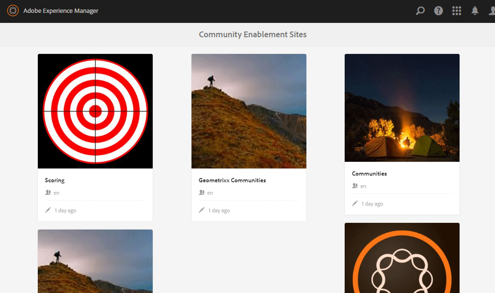
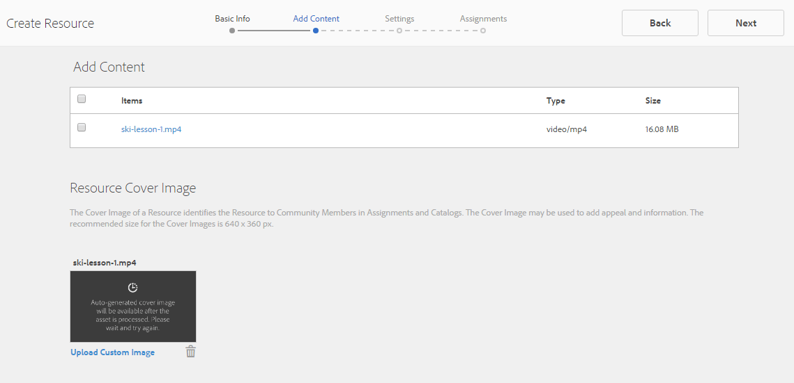
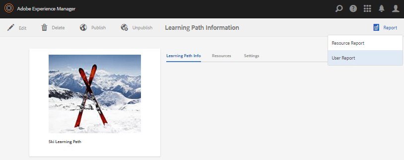

# Console Risorse di abilitazione {#enablement-resources-console}

Per  AEM Communities, nella console Risorse [Manager abilitazione](users.md) è possibile creare, gestire e assegnare risorse ai membri di un sito della community di abilitazione.

## Requisiti {#requirements}

Prima di aggiungere le risorse di abilitazione per un sito community, le istanze AEM devono essere configurate correttamente, inclusi:

* SCORM
* FFmpeg

Per informazioni dettagliate, consultate [Configuring Enablement](enablement.md).

>[!CAUTION]
>
>Se SCORM è installato dopo la creazione del sito community, è necessario ricreare tutte le risorse di abilitazione presenti prima dell&#39;installazione di SCORM.

>[!NOTE]
>
>Con il rilascio di [AEM 6.3](deploy-communities.md#latestfeaturepack) e dei pacchetti di funzionalità community equivalenti [AEM 6.2 FP3](deploy-communities.md#latestfeaturepack) e [AEM 6.1 FP7](https://docs.adobe.com/content/docs/en/aem/6-1/deploy/communities.html#Latest Feature Pack), la funzione di abilitazione non richiede più un [database MySQL](mysql.md).

## Terminologia {#terminology}

### Risorsa {#resource}

Le risorse sono essenziali per una [community di abilitazione](overview.md#enablement-community). Sono i materiali assegnati ai membri che consentono loro di migliorare le loro capacità.

Caratteristiche di una risorsa:

* Può essere di tipo:
   * Immagine (JPG, PNG, GIF, BMP)
   * Video (MP4)
   * Flash (SWF)
   * Documento (PDF)
   * Quiz (SCORM)
* Può essere utilizzato come riferimento da uno o più percorsi di apprendimento.

### Percorso di apprendimento {#learning-path}

Un percorso di apprendimento è un insieme logico di risorse di abilitazione raggruppate per semplificare l&#39;assegnazione ai membri.

### Gruppo di membri {#members-group}

Quando viene creato un sito community, il nome assegnato al sito per l&#39;URL viene utilizzato nella creazione dei [gruppi utente specifici del sito](users.md) configurati con varie autorizzazioni per vari ruoli. Tutti questi gruppi creati automaticamente hanno il prefisso `Community <site-name>`.

Un gruppo di utenti di questo tipo è `Community <site-name> Members`, che identifica gli utenti registrati nell’ambiente di pubblicazione come membri della community. Per un esempio, vedere l&#39;esercitazione [Getting Started with  AEM Communities for Enablement](getting-started-enablement.md).

Per le [comunità di coinvolgimento](overview.md#egagementcommunity), è ragionevole consentire ai visitatori del sito di registrarsi o utilizzare il login mediante social network, al momento in cui vengono automaticamente aggiunti al gruppo di membri.

Per le [community di abilitazione](overview.md#enablement-community), si consiglia di rendere privato il sito, il che richiede l&#39;aggiunta di utenti al gruppo di membri da parte di un amministratore.

## Accesso alle risorse di abilitazione di un sito community {#accessing-a-community-site-s-enablement-resources}

### Passa a Risorse community {#navigate-to-communities-resources}

Nell’ambiente di authoring, per accedere alla console Risorse

* Dalla navigazione globale: **[!UICONTROL Navigazione]** > **[!UICONTROL Community]** > **[!UICONTROL Risorse]**

   

### Selezionare un sito community {#select-a-community-site}

Nella console Risorse di Communities vengono visualizzati tutti i siti della community.

Le risorse di abilitazione vengono create per un sito community specifico dopo aver selezionato il sito dalla console Risorse.

Una volta selezionato un sito community specifico, tutte le risorse di abilitazione e i percorsi di apprendimento esistenti sono accessibili per la gestione e la modifica e possono essere create nuove risorse di abilitazione e percorsi di apprendimento.

#### Ricerca {#search-features}

Selezionate l’icona di attivazione/disattivazione del pannello laterale per cercare una risorsa di abilitazione o un percorso di apprendimento. Quando è selezionato, un pannello di ricerca si apre sul lato sinistro della console e fornisce una casella di testo in cui immettere i termini di ricerca.

#### Modalità di selezione {#selection-mode}

Per selezionare più risorse di abilitazione, selezionatele prima passando il mouse sulla scheda e selezionando l&#39;icona del segno di spunta. Una volta selezionata, la selezione di qualsiasi altra scheda la aggiungerà al gruppo di selezione. Selezionando una seconda volta, la scheda viene deselezionata.

## Creare una risorsa {#create-a-resource}

Per aggiungere una nuova risorsa di abilitazione al sito community

* Selezionate l&#39;icona `Create`.
* Dal sottomenu visualizzato, selezionare **[!UICONTROL Risorsa]**.

Viene avviato un processo passo-passo di:

* Descrizione della risorsa (nome, immagine scheda e testo).
* Selezione del contenuto della risorsa.
* Selezione di un’immagine di copertina per la risorsa.
* Identificazione dei contatti delle risorse.
* Assegnazione di risorse ai membri.

Quando la risorsa fa parte di un corso, un percorso di apprendimento, i membri devono essere assegnati solo al percorso di apprendimento. Le assegnazioni possono essere aggiunte dopo la creazione della risorsa di abilitazione.

### 1 Informazioni di base {#basic-info}

* **[!UICONTROL Aggiungi]**

   (*Facoltativo*) Un&#39;immagine da visualizzare sulla scheda per la risorsa di abilitazione nella pagina delle assegnazioni del membro e nella console Risorse. L&#39;immagine viene selezionata dal file system locale del server. Se non viene fornita un’immagine, verrà generata una miniatura per la risorsa caricata.

   ***Nota***: Le dimensioni immagine consigliate non sono semplicemente 480 x 480 pixel. A causa del design reattivo delle schede a varie dimensioni del browser, la dimensione del display varia da 220x165 pixel a 400x165 pixel.

* **[!UICONTROL Nome sito]**

   (*readonly*) Il sito della community in cui viene aggiunta la risorsa.

* **[!UICONTROL Nome riferimento]**

   (*Obbligatorio*) Il nome visualizzato per la risorsa. Un nome di nodo valido viene creato dal nome visualizzato.

* **[!UICONTROL Tag]**

   (*Facoltativo*) È possibile scegliere uno o più tag che associano la risorsa di abilitazione a uno o più cataloghi. Vedere [Risorse per l&#39;abilitazione dei tag](tag-resources.md).

* **[!UICONTROL Mostra nel catalogo]**

   Se questa opzione è deselezionata, la risorsa di abilitazione non viene visualizzata in alcun catalogo. Se questa opzione è attivata, la risorsa di abilitazione verrà visualizzata in tutti i cataloghi, a meno che non siano presenti i filtri [pre-filtrati](catalog-developer-essentials.md#pre-filters) o i filtri membro dall&#39;interfaccia utente. Il valore predefinito è deselezionato.

* **[!UICONTROL Descrizione]**

   (*Facoltativo*) La descrizione da visualizzare per la risorsa di abilitazione.

* **[!UICONTROL Risorsa piccola]**

   (*Facoltativo*) Selezionato da  AEM Assets. Un’immagine in miniatura che rappresenta la risorsa nell’ambiente di pubblicazione, ad esempio in un catalogo.

* **[!UICONTROL Risorsa grande]**

   (*Facoltativo*) Selezionato da  AEM Assets. Immagine grande che rappresenta la risorsa nell’ambiente di pubblicazione, ad esempio sulla pagina principale di una risorsa.

* **[!UICONTROL Risorsa frammento di contenuto]**

   (*Facoltativo*) Selezionato da  AEM Assets. Un frammento di contenuto a cui può essere fatto riferimento nell’ambiente di pubblicazione, ma che per impostazione predefinita non è in uso.

* Seleziona **[!UICONTROL Avanti]**

### 2 Aggiungi contenuto {#add-content}

Anche se è possibile selezionare più risorse di abilitazione, è consentita solo una.

Selezionate `'+' icon`, nell&#39;angolo in alto a destra, per iniziare il processo di scelta della risorsa identificando l&#39;origine.

* **[!UICONTROL Carica dai file locali]**

   Il caricamento dal file system locale utilizzerà il browser nativo per selezionare e caricare un file. I tipi di file supportati sono SCORM.zip (HTML5 o SWF), video MP4, SWF, PDF e tipi di immagini (JPG, PNG, GIF, BMP). Il nome del file diventa il nome della risorsa, che viene aggiunta alla libreria delle risorse.

* **[!UICONTROL Sfoglia libreria risorse]**

   Selezionate da Libreria risorse. La selezione è limitata a quelle visibili all&#39;interno del sito della community.

* **[!UICONTROL Aggiungi un URL esterno]**

   Inserite un collegamento per l’apprendimento del contenuto.

   Nella finestra di dialogo visualizzata, immettete:

   * **[!UICONTROL Titolo]**

      Il nome della risorsa per la risorsa di abilitazione.

   * **[!UICONTROL URL]**

      URL di una risorsa.

* **[!UICONTROL Aggiungi un URL di Adobe Connect]**

   Inserite un collegamento a una sessione Adobe Connect .

   Nella finestra di dialogo visualizzata, immettete:

   * **[!UICONTROL Titolo]**

      Il nome della risorsa per la risorsa di abilitazione.

   * **[!UICONTROL URL]**

      URL di una sessione Adobe Connect .

* **[!UICONTROL Definisci una risorsa esterna]**

   Inserire il luogo in cui il materiale deve essere presentato. I valori per lo stato di successo e la valutazione vengono inseriti manualmente (vedere [Reports](reports.md)). Un’immagine di copertina caricata può essere utilizzata per fornire ulteriori informazioni.

   Nella finestra di dialogo visualizzata, immettete:

   * **[!UICONTROL Titolo]**

      Il nome della risorsa per la risorsa di abilitazione.

   * **[!UICONTROL Posizione]**

      Posizione di un sito fisico, ad esempio un&#39;aula.

#### Esempio di risorsa video aggiunta {#example-of-an-added-video-resource}

* **[!UICONTROL Immagine copertina riferimento]**

   L&#39;immagine di copertina è un&#39;immagine da visualizzare quando la risorsa di abilitazione viene visualizzata per la prima volta. Ad esempio, l’immagine di copertina viene visualizzata quando una risorsa video non è ancora in fase di riproduzione. Se non viene caricata un&#39;immagine personalizzata, viene visualizzata un&#39;immagine predefinita. Per le risorse video, potrebbe essere possibile generare una miniatura [ma solo quando viene caricato e non quando al video viene fatto riferimento come URL. ](enablement.md#ffmpeg) Per le risorse sulla posizione, l&#39;immagine può essere utilizzata per fornire ulteriori informazioni.

   Le dimensioni consigliate per l&#39;immagine di copertina sono 640 x 360 px.

* Seleziona **[!UICONTROL Avanti]**.

### 3 Impostazioni {#settings}

>[!NOTE]
>
>Gli studenti non devono essere iscritti direttamente nelle risorse di abilitazione a cui verrà fatto riferimento da un percorso di apprendimento. Gli studenti devono essere iscritti solo al percorso di apprendimento.
>
>Se un membro è iscritto sia a una risorsa che a un percorso di apprendimento che fa riferimento a tale risorsa, le assegnazioni mostreranno sia la singola risorsa che la risorsa all&#39;interno del percorso di apprendimento.

* **[!UICONTROL Impostazioni social]**

   Queste impostazioni controllano se gli utenti in formazione sono in grado di fornire o meno i dati relativi alla risorsa di abilitazione. Le [impostazioni di moderazione](sites-console.md#moderation) sono quelle del sito della community principale.

   * **[!UICONTROL Consenti commenti]**

      Se questa opzione è selezionata, i membri possono inserire commenti sulla risorsa. Il valore predefinito è selezionato.

   * **[!UICONTROL Consenti valutazioni]**

      Se questa opzione è selezionata, ai membri è consentito assegnare un punteggio alla risorsa. Il valore predefinito è selezionato.

   * **[!UICONTROL Consenti accesso anonimo]**

      Se questa opzione è attivata, i visitatori anonimi del sito possono visualizzare la risorsa in un catalogo quando anche il sito della community consente l&#39;accesso anonimo. Il valore predefinito è deselezionato.

* **[!UICONTROL Data di scadenza]**

   *(Facoltativo)* È possibile selezionare una data entro la quale completare l&#39;assegnazione.

* **[!UICONTROL Autore risorse]**

   *(Facoltativo)* L’autore della risorsa di abilitazione. Utilizzate il menu a discesa per selezionare tra gli utenti membri del gruppo [membri](#members-group).

* **[!UICONTROL Contatto &amp;risorse;]**

   *(Obbligatorio)* Una persona che il membro può contattare per quanto riguarda la risorsa di abilitazione. Utilizzate il menu a discesa per selezionare tra gli utenti membri del gruppo [membri](#members-group).

* **[!UICONTROL Esperto risorse]**

   *(Facoltativo)* Una persona a cui il membro può rivolgersi per la propria competenza in merito alla risorsa di abilitazione. Utilizzate il menu a discesa per selezionare gli utenti membri del gruppo [membri](#members-group).

### 4 Assegnazioni {#assignments}

* **[!UICONTROL Aggiungi assegnatari]**

   Utilizzate il menu a discesa per selezionare tra [membri](#members-group) - Utenti e gruppi di utenti (elencati in grassetto) - che devono essere iscritti come Utenti in formazione. Quando i membri accedono al sito della community, le risorse di abilitazione (e i percorsi di apprendimento) in cui sono iscritti vengono visualizzate nella pagina [Assegnazioni](functions.md#assignments-function).

* Seleziona **[!UICONTROL Crea]**.

   

La creazione della risorsa di abilitazione è riuscita e viene nuovamente visualizzata la console Risorse, con la risorsa appena creata selezionata. Da questa console è possibile [gestire la risorsa](#managing-a-resource).

## Creare un percorso di apprendimento {#create-a-learning-path}

Per aggiungere un nuovo percorso di apprendimento al sito della community

* Selezionate l&#39;icona `Create`
* Dal sottomenu visualizzato, selezionare **[!UICONTROL Percorso di apprendimento]**.

Viene avviato un processo passo-passo di:

* Identificazione del percorso di apprendimento.
* Fornire un&#39;immagine scheda che rappresenti il percorso di apprendimento per gli studenti.
* Riferimento alle risorse di abilitazione da includere nel percorso di apprendimento.
* Facoltativamente, ordinare le risorse.
* È possibile identificare percorsi di apprendimento preliminari.
* Identificazione di un contatto percorso di apprendimento.
* Membri iscritti.

Per le risorse di abilitazione incluse in un percorso di apprendimento, le assegnazioni devono essere effettuate solo per il percorso di apprendimento e non per le singole risorse.

### Informazioni di base {#basic-info-1}

* **[!UICONTROL Aggiungi]**

   (*Facoltativo*) Un&#39;immagine da visualizzare sulla scheda per il percorso di apprendimento nella pagina delle assegnazioni del membro e nella console Risorse. L&#39;immagine viene selezionata dal file system locale del server. Se non viene fornita un’immagine, verrà generata una miniatura per la risorsa caricata.

   ***Nota***: Le dimensioni immagine consigliate non sono più semplicemente 480 x 480 pixel. A causa del design reattivo delle schede a varie dimensioni del browser, la dimensione del display varia da 220x165 pixel a 400x165 pixel.

* **[!UICONTROL Nome sito]**

   (*Readonly*) Il sito della community in cui viene aggiunta la risorsa.

* **[!UICONTROL Nome percorso di apprendimento]**

   (*Obbligatorio*) Il nome visualizzato per il percorso di apprendimento. Un nome di nodo valido viene creato dal nome visualizzato.

* **[!UICONTROL Tag]**

   (*Facoltativo*) È possibile scegliere uno o più tag che associano il percorso di apprendimento a uno o più cataloghi. Vedere [Risorse per l&#39;abilitazione dei tag](tag-resources.md).

* **[!UICONTROL Mostra nel catalogo]**

   Se questa opzione è deselezionata, il percorso di apprendimento non verrà visualizzato in alcun catalogo. Se questa opzione è attivata, il percorso di apprendimento verrà visualizzato in tutti i cataloghi, a meno che non siano stati previamente filtrati [o i filtri membro dall&#39;interfaccia utente. ](catalog-developer-essentials.md#pre-filters) La visualizzazione del percorso di apprendimento in un catalogo consente indirettamente l&#39;accesso in lettura a tutte le risorse in esso contenute. Il valore predefinito è deselezionato.

* **[!UICONTROL Descrizione]**

   (*Facoltativo*) La descrizione da visualizzare per la risorsa di abilitazione.

* **[!UICONTROL Risorsa piccola]**

   (*Facoltativo*) Selezionato da  AEM Assets. Un’immagine in miniatura che rappresenta la risorsa nell’ambiente di pubblicazione, ad esempio in un catalogo.

* **[!UICONTROL Risorsa grande]**

   (*Facoltativo*) Selezionato da  AEM Assets. Immagine grande che rappresenta la risorsa nell’ambiente di pubblicazione, ad esempio sulla pagina principale di una risorsa.

* **[!UICONTROL Risorsa frammento di contenuto]**

   (*Facoltativo*) Selezionato da  AEM Assets. Un frammento di contenuto a cui può essere fatto riferimento nell’ambiente di pubblicazione, ma che per impostazione predefinita non è in uso.

* Seleziona **[!UICONTROL Avanti]**.

### Aggiungi prerequisiti {#add-prerequisites}

* **[!UICONTROL Percorsi di formazione da completare come prerequisiti]**

   (*Facoltativo*) Quando sono selezionati altri percorsi di apprendimento pubblicati, questi devono essere completati prima che uno studente possa selezionare questo percorso di apprendimento.

* Seleziona **[!UICONTROL Avanti]**.

### Aggiungi riferimenti {#add-resources}

* **[!UICONTROL Rispetta l&#39;ordine del percorso di apprendimento]**

   (*Facoltativo*) Se è impostato su Attivato, l&#39;ordine in cui vengono aggiunte le risorse di abilitazione è l&#39;ordine in cui gli utenti in formazione devono continuare il percorso di apprendimento. Il valore predefinito è Disattivato.

* **[!UICONTROL Riferimenti]**

   Una o più risorse scelte tra le risorse di abilitazione *pubblicate* create per il sito community corrente.

>[!NOTE]
>
>Potete selezionare solo le risorse disponibili allo stesso livello del percorso di apprendimento. Ad esempio, per un percorso di apprendimento creato in un gruppo sono disponibili solo le risorse a livello di gruppo; per un percorso di apprendimento creato in un sito community, le risorse in tale sito sono disponibili per l&#39;aggiunta al percorso di apprendimento.

* Seleziona **[!UICONTROL Avanti]**.

### Impostazioni {#settings-1}

* **[!UICONTROL Aggiungi adesioni]**

   Utilizzate il menu a discesa per selezionare tra i membri e i gruppi di membri (visualizzati in grassetto) membri del gruppo [membri del sito della community](#members-group). Non è necessario aggiungere assegnazioni al momento della prima creazione del percorso di apprendimento. Le proprietà del percorso di apprendimento possono essere modificate per aggiungere utenti in formazione in un secondo momento.

* **[!UICONTROL &amp;Apprendimento percorso contatto;]**

   *(Obbligatorio)* Una persona che il membro può contattare per quanto riguarda il percorso di apprendimento. Utilizzate il menu a discesa per selezionare gli utenti membri del gruppo di membri [del sito community](#members-group).

* Seleziona **[!UICONTROL Crea]**

>[!NOTE]
>
>Le risorse di abilitazione a cui si fa riferimento dal percorso di apprendimento non devono elencare gli eventuali associati (studenti).
>
>Se un membro è iscritto sia a una risorsa di abilitazione che a un percorso di apprendimento che fa riferimento a tale risorsa, le assegnazioni mostreranno sia la singola risorsa che la risorsa all&#39;interno del percorso di apprendimento.

## Gestione di una risorsa {#managing-a-resource}

Per gestire una singola risorsa di abilitazione:

* Dalla console **[!UICONTROL Risorse]**, selezionate il sito della community che contiene la risorsa.
* Selezionate la risorsa.

Per la risorsa di abilitazione selezionata, è possibile:

* Visualizza proprietà (predefinito)
* Modifica delle proprietà
* Elimina
* Pubblicazione
* Annulla pubblicazione

Per caricare una nuova versione della risorsa di abilitazione, si consiglia di creare una nuova risorsa, quindi di annullare l’iscrizione dei membri dalla versione precedente e di iscriverli nella nuova versione.

### Modifica riferimento {#edit-resource}

Selezionando l&#39;icona a forma di matita, vengono resi disponibili i passaggi per la creazione di una risorsa di abilitazione, in modo da modificare le informazioni fornite.

Se l’unica modifica consiste nel modificare le assegnazioni nel passaggio Impostazioni, il salvataggio delle modifiche comporta la pubblicazione delle modifiche. Se vengono apportate altre modifiche, la risorsa deve essere pubblicata in modo esplicito dopo il salvataggio.

### Elimina riferimento {#delete-resource}

Selezionando l&#39;icona del cestino, la risorsa di abilitazione sarà `Deleted` dopo la conferma.

### Pubblicazione {#publish}

Prima che gli utenti in formazione siano in grado di visualizzare le risorse di abilitazione assegnate, è necessario pubblicarle:

* Selezionate l&#39;icona del mondo su `Publish`.
* Nella finestra di dialogo visualizzata, selezionate di nuovo **[!UICONTROL Pubblica]**.
* Selezionare **[!UICONTROL Chiudi]**.

Anche se la finestra di dialogo dichiara che l’azione è in coda, spesso viene pubblicata immediatamente.

### Annulla pubblicazione {#unpublish}

Per rendere temporaneamente le risorse di abilitazione inaccessibili ai membri nell’ambiente di pubblicazione senza eliminarle, utilizzate l’icona del mondo per `Unpublish` la risorsa.

### Rapporto {#report}

L’icona Rapporto consente di accedere ai rapporti generati quando gli studenti interagiscono con le risorse di abilitazione assegnate nell’ambiente di pubblicazione. Il rapporto varia a seconda del tipo di risorsa.

Per tutti i percorsi di apprendimento, è possibile visualizzare un rapporto basato sulle risorse o sugli studenti ( `User Report`).

Questo rapporto è specifico per la risorsa di abilitazione corrente o il percorso di apprendimento. La profondità del reporting fornito dipende dal fatto che [ Adobe Analytics](analytics.md) sia concesso in licenza e attivato per il sito community. I report [Timeline](#timeline), [Coinvolgimento visualizzatore](#viewer-engagement) e [Coinvolgimento da dispositivo](#engagement-by-device) vengono importati da  Adobe Analytics in base all&#39;intervallo di polling .

Per tutte le risorse di abilitazione, indipendentemente dal fatto che sia attivato o meno  Adobe Analytics, sono presenti rapporti su [Assegnatario Status](#assignee-status) e [Ratings](#ratings), nonché su una tabella [Report Summary](#report-summary).

#### Timeline  {#timeline}

Il rapporto Cronologia analisi mostra quando si verificano eventi nel tempo per questa risorsa di abilitazione:

* **Viste**

   Una vista è quando uno studente visita la pagina dei dettagli della risorsa.

* **Riproduzioni**

   Una riproduzione si verifica quando allLearning interagisce con la risorsa, ad esempio riproducendo un video o aprendo un PDF.

* **Valutazioni**

   Una valutazione è quando uno studente assegna una valutazione a stella a una risorsa.

* **Commenti**

   Un commento è presente quando alLearning aggiunge un commento.

L&#39;asse verticale è il numero di eventi.

L&#39;asse orizzontale è l&#39;ora del calendario.

[ Adobe Analytics richiesto](sites-console.md#analytics).

#### Coinvolgimento visualizzatore {#viewer-engagement}

Il rapporto Coinvolgimento visualizzatore di Analytics mostra, per le risorse video, il numero di studenti che hanno visualizzato la risorsa e, se non riprodotto fino alla fine, a che punto gli utenti hanno interrotto la riproduzione.

L’asse verticale è il numero di studenti che hanno visualizzato questa risorsa.

L&#39;asse orizzontale rappresenta la durata della risorsa.

[È richiesto l&#39;ID organizzazione Marketing Cloud](sites-console.md#enablement).

#### Coinvolgimento per dispositivo {#engagement-by-device}

Il rapporto sull&#39;uso di Analytics per dispositivo, per le risorse video, descrive la percentuale di visualizzazioni riprodotte dal desktop e dai dispositivi mobili.

[È richiesto l&#39;ID organizzazione Marketing Cloud](sites-console.md#enablement).

#### Stato assegnatario {#assignee-status}

Il rapporto Stato assegnatario, basato sul numero di studenti, descrive quanti ne hanno

* **Non avviato**
* **In corso**
* **Completato**

#### Valutazioni {#ratings}

Il rapporto Valutazioni si basa sul numero di studenti che hanno valutato la risorsa di abilitazione, mostrando il numero di ciascuna valutazione a stella seguita da un riepilogo del numero totale di valutazioni e della valutazione media.

#### Riepilogo report {#report-summary}

Per una risorsa di abilitazione, il Riepilogo report è un elenco di tabelle.

* Ogni studente che ha interagito con la risorsa
   * Il loro status
   * Se gli è stata assegnata la risorsa
      * Invece di trovare la risorsa in un catalogo
      * Numero di commenti inviati
      * l&#39;eventuale rating attribuito

Per un rapporto sulle risorse del percorso di apprendimento, il Riepilogo rapporti è un elenco di tabelle

* Ogni risorsa inclusa nel percorso di apprendimento
   * Stato pubblicazione
   * Numero di visualizzazioni
   * Numero di riproduzioni
   * Valutazione media
   * Formato
   * Dimensione
   * Nome del sito community

Per un percorso di apprendimento Rapporto utente, il Riepilogo rapporti è un elenco di tabelle.

* Ogni studente assegnato al percorso di apprendimento:
   * Numero di risorse completate.
   * Il loro status.

È possibile regolare la visualizzazione della tabella selezionando le colonne utilizzando il selettore `Show / hide columns`.

#### Scarica rapporto come CSV{#download-report-as-csv}

La tabella Riepilogo rapporti può essere scaricata in formato CSV utilizzando un pulsante nella parte superiore della console.

* Per una risorsa di abilitazione: Pulsante `Download Resource Report as CSV`.
* Per un percorso di apprendimento: Pulsante `Download Learning Path Report as CSV`.

Il riepilogo completo dei report viene scaricato indipendentemente dalle colonne selezionate per la visualizzazione.
