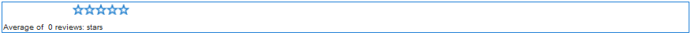

# Utilizzo del riepilogo di recensioni e recensioni (visualizzazione) {#using-reviews-and-reviews-summary-display}

Il `Reviews` componente è composto da componenti [Commenti](comments.md) e [Valutazione](rating.md) pronti per l’uso.

Il `Reviews Summary (Display)` componente fornisce un riepilogo di un’istanza attiva o chiusa di un `Reviews` componente da visualizzare altrove sul sito.

>[!NOTE]
>
>L&#39;invio anonimo di una revisione non è supportato. I visitatori del sito devono registrarsi (diventare membri) ed effettuare l’accesso per partecipare. Il visitatore che ha effettuato l’accesso può aggiornare la propria revisione in qualsiasi momento.

## Adding a Review to a Page {#adding-a-review-to-a-page}

Per aggiungere un `Reviews` componente a una pagina in modalità di creazione, usate il browser Componenti per individuarlo `Communities / Reviews` e trascinarlo nella posizione desiderata sulla pagina, ad esempio una posizione relativa alla funzione che gli utenti potranno vedere.

Per le informazioni necessarie, consulta [Community Components Basics](basics.md).

Quando vengono incluse le librerie [lato client](reviews-basics.md#essentials-for-client-side) richieste, viene visualizzato così il `Reviews` componente.

## Configurazione delle revisioni {#configuring-reviews}

Selezionate il `Reviews` componente inserito a cui accedere e selezionate l’ `Configure` icona che apre la finestra di dialogo di modifica.

Nella scheda Valutazioni **** consentite, specificate l&#39;elenco completo delle valutazioni da visualizzare ai membri. Il primo rating dovrebbe essere un rating generale, in quanto è il rating che fornisce il rating medio per il `Review Summary (Display)` componente. Alle due valutazioni successive nella configurazione predefinita dovrebbe essere assegnato un titolo diverso, diverso da &quot;Subrating 1&quot; o &quot;Subrating 2&quot;.

* **[!UICONTROL Classificazioni consentite]**

   Un elenco di valutazioni da cui un membro può scegliere.

   Utilizzare i pulsanti freccia su, freccia giù ed eliminazione per modificare le selezioni visibili.

   Fate clic su **[!UICONTROL Aggiungi elemento]** per aggiungere un’altra scelta di valutazione.

Nella scheda Valutazioni **** richieste, immettere nuovamente gli elementi dall&#39;elenco Valutazioni **** consentite che devono essere valutati. Se un elemento è specificato solo nella scheda Valutazioni consentite, può essere lasciato senza contrassegno quando viene inviato dal membro.

Nel sito Web, le valutazioni richieste sono contrassegnate da un asterisco. Se un elemento è obbligatorio e lasciato senza contrassegno, viene visualizzato un messaggio al membro e l&#39;invio viene negato finché non vengono contrassegnate tutte le valutazioni richieste.

* **[!UICONTROL Classificazioni richieste]**

   Un sottoinsieme di valutazioni consentite, che indica quali sono richieste.

   Utilizzare i pulsanti freccia su, freccia giù ed eliminazione per modificare le selezioni visibili.

   Fate clic su **[!UICONTROL Aggiungi elemento]** per aggiungere un’altra scelta di risposta.

>[!NOTE]
>
>Se un elemento viene immesso nella scheda Valutazioni **** richieste non specificata nella scheda Valutazioni **** consentite, non viene incluso negli elementi da valutare.

Nella scheda **[!UICONTROL Recensioni]** , specificare le modalità di gestione delle revisioni.

* **[!UICONTROL Consenti risposte]**

   Se questa opzione è selezionata, consentire le risposte alle revisioni. Il valore predefinito è deselezionato.

* **[!UICONTROL Chiuso]**

   Se questa opzione è attivata, la revisione è chiusa a nuove revisioni e risposte. Il valore predefinito è deselezionato.

* **[!UICONTROL Consenti caricamenti file]**

   Se questa opzione è selezionata, consentire il caricamento degli allegati per la revisione. Il valore predefinito è deselezionato.

* **Dimensione file massima **

   Pertinente solo se **[!UICONTROL Consenti caricamenti]** file è selezionato. Questo campo limita la dimensione (in byte) di un file caricato. Il valore predefinito è 10 MB.

* **[!UICONTROL Lunghezza massima messaggio]**

   Numero massimo di caratteri che possono essere immessi nella casella di testo. Il valore predefinito è 4096 caratteri.

* **[!UICONTROL Tipi di file consentiti]**

   Pertinente solo se **[!UICONTROL Consenti caricamenti]** file è selezionato. Un elenco separato da virgole di estensioni di file con il separatore &quot;punto&quot;. Ad esempio: .jpg, .jpeg, .png, .doc, .docx, .pdf. Se vengono specificati dei tipi di file, quelli non specificati non saranno consentiti. Il valore predefinito non è specificato, pertanto tutti i tipi di file sono consentiti.

* **[!UICONTROL Editor Rich Text]**

   Se questa opzione è selezionata, è possibile inserire dei post con delle marcature. Il valore predefinito è deselezionato.

* **[!UICONTROL Consenti votazione]**

   Se questa opzione è selezionata, includete la funzione di votazione per un argomento. Il valore predefinito è deselezionato.

Nella scheda Moderazione **** utente, specificate le modalità di gestione delle revisioni pubblicate. Per ulteriori informazioni, consultate [Moderazione del contenuto](moderate-ugc.md)generato dall&#39;utente.

* **[!UICONTROL Premoderazione]**

   Se questa opzione è attivata, le revisioni devono essere approvate prima che vengano visualizzate su un sito di pubblicazione. Il valore predefinito è deselezionato.

* **[!UICONTROL Elimina recensioni]**

   Se questa opzione è attivata, al membro che ha pubblicato la revisione viene fornita la possibilità di eliminarla. Il valore predefinito è deselezionato.

* **[!UICONTROL Rifiuta recensioni]**

   Se questa opzione è selezionata, consentire ai moderatori di rifiutare le revisioni. Il valore predefinito è deselezionato.

* **[!UICONTROL Chiudi/Riapri recensioni]**

   Se questa opzione è selezionata, consentire ai moderatori di chiudere e riaprire le revisioni. Il valore predefinito è deselezionato.

* **[!UICONTROL Segnala recensioni]**

   Se questa opzione è selezionata, consentire ai membri di contrassegnare le revisioni come non appropriate. Il valore predefinito è deselezionato.

* **[!UICONTROL Elenco di motivi per segnalazione]**

   Se questa opzione è selezionata, consentire ai membri di scegliere, da un elenco a discesa, il motivo per cui contrassegnano una revisione come non appropriato. Il valore predefinito è deselezionato.

* **[!UICONTROL Motivo per segnalazione personalizzato]**

   Se questa opzione è selezionata, consentire ai membri di inserire il proprio motivo per cui la revisione viene contrassegnata come non appropriata. Il valore predefinito è deselezionato.

* **[!UICONTROL Soglia moderazione]**

   Inserire il numero di volte in cui i membri devono contrassegnare una revisione prima che i moderatori ne vengano informati. Il valore predefinito è una tantum (1).

* **[!UICONTROL Limite segnalazione]**

   Specificate quante volte deve essere segnalata una revisione prima che questa venga nascosta dalla visualizzazione pubblica. Questo numero deve essere maggiore o uguale alla soglia di **[!UICONTROL moderazione]**. Il valore predefinito è 5.

### Aggiunta di un riepilogo della revisione (visualizzazione) a una pagina {#adding-a-review-summary-display-to-a-page}

Per aggiungere un `Reviews Summary (Display)` componente a una pagina in modalità di creazione, individuare il componente

* `Communities / Reviews Summary (Display)`

trascinarlo nella posizione desiderata su una pagina in cui deve essere visualizzato il riepilogo di una revisione attiva o chiusa.

Per le informazioni necessarie, consulta [Community Components Basics](basics.md).

Quando vengono incluse le librerie [lato client](reviews-basics.md#essentials-for-client-side) richieste, viene visualizzato così il `Reviews Summary (Display)`componente.

>[!NOTE]
>
>La &quot;media&quot; riflette i voti per il primo elemento elencato nelle schede Valutazioni consentite della revisione che viene riepilogata.

### Configurazione del riepilogo delle revisioni (visualizzazione) {#configuring-reviews-summary-display}

Selezionate il `Reviews Summary (Display)` componente inserito a cui accedere e selezionate l’ `Configure` icona che apre la finestra di dialogo di modifica.

Nella scheda Riepilogo **** revisione

* `Review Path`

   immettete o individuate l’istanza inserita del `reviews`componente per riepilogare, ad esempio, se aggiunta alla pagina Web del sito di [Geometrixx,](getting-started.md) il percorso sarà:

   `/content/sites/engage/en/page/jcr:content/content/primary/reviews`

* `Include histogram`

   Se questa opzione è selezionata, includete la visualizzazione di un grafico a barre che indica il numero di valutazioni a stella presenti nelle revisioni riepilogate. Il valore predefinito è deselezionato.

### Passaggio a un tipo di revisione personalizzato {#changing-to-a-custom-review-type}

Il componente Recensioni utilizza il sistema di commenti.

Modificando il Tipo risorsa commento, il sistema di commenti non genererà più un&#39;istanza di commento utilizzando l&#39;impostazione predefinita, ma piuttosto un&#39;istanza che è stata personalizzata (estesa) dagli sviluppatori.

Una volta noti i tipi di risorse personalizzati, immettete la modalità  Progettazione e fate doppio clic sul `Comments` componente inserito per aprire una finestra di dialogo con una scheda aggiuntiva.

Nella scheda Tipi **[!UICONTROL di]** risorse, specificare il resourceType personalizzato per le nuove istanze dei `Comments or Voting` componenti:

* **[!UICONTROL Tipo risorsa commento]**

   Passa a resourceType di un `comment`componente esteso (commento singolo) in /apps. Esempio, `/apps/social/commons/components/hbs/comments/comment`.

   Questa risorsa identificherà resourceType dell&#39;UGC creato quando un visitatore inserisce un commento.

* **[!UICONTROL Tipo di risorsa per votazione]**

   Passa a resourceType di un `voting`componente esteso in /apps. Esempio, `/apps/social/components/hbs/voting`.

   Questa risorsa identificherà il tipo di risorsa dell&#39;UGC creato quando un visitatore pubblica un voto.

* **[!UICONTROL Tipo risorsa sistema commenti]**

   Passa a resourceType di un `comments`componente esteso (sistema di commenti) in /apps. Lasciate vuoto, a meno che il modello di pagina includa  dinamicamente il sistema di commenti nello script sottostante, anziché essere aggiunto alla pagina come risorsa (nodo commenti). Ulteriori informazioni leggendo l&#39;helper {{include}}.

## Esperienza dei visitatori del sito {#site-visitor-experience}

### Moderatori e amministratori {#moderators-and-administrators}

Quando l’utente che ha effettuato l’accesso dispone di privilegi di moderatore o amministratore, può eseguire le attività di moderazione consentite dalla configurazione del componente, indipendentemente da chi ha creato la revisione.

### Membri {#members}

Quando il visitatore del sito ha effettuato l’accesso, a seconda della configurazione, può:

* Pubblicare una nuova revisione
* Modifica la propria revisione
* Elimina la propria revisione
* Contrassegnare i commenti di revisione di altri utenti

È consentita una sola valutazione per membro. Il membro può cambiare la propria valutazione in qualsiasi momento.

### Anonimo {#anonymous}

I visitatori del sito che non hanno effettuato l&#39;accesso possono solo leggere le revisioni pubblicate, tradurle se supportate, ma non aggiungere una valutazione o una revisione, né contrassegnare i commenti di revisione di altri utenti.

## Informazioni aggiuntive {#additional-information}

Ulteriori informazioni sono disponibili nella pagina [Rivedi essenziali](reviews-basics.md) per gli sviluppatori.

Per la moderazione dei commenti pubblicati, vedere [Moderazione del contenuto](moderate-ugc.md)generato dall&#39;utente.

Per la traduzione dei commenti postati, vedere [Traduzione del contenuto](translate-ugc.md)generato dall&#39;utente.
