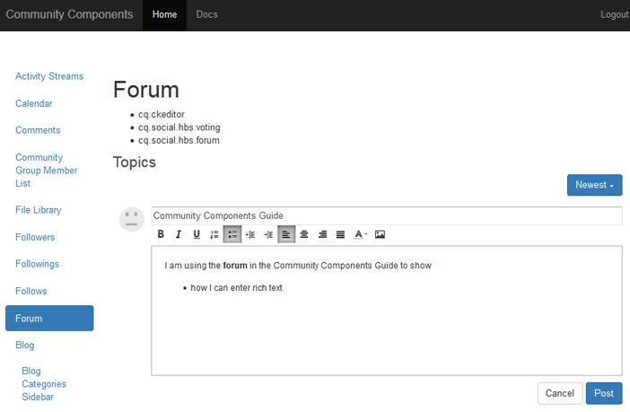

# Nozioni di base sull’editor Rich Text {#rich-text-editor-essentials}

## Panoramica {#overview}

Un editor Rich Text (RTE) consente di immettere testo con markup.

Per i componenti Communities, pur essendo simile all&#39;editor Rich Text [nell&#39;ambiente di authoring](../../help/sites-authoring/rich-text-editor.md), influisce sul testo immesso nell&#39;ambiente di pubblicazione.



## Abilitazione dell’editor Rich Text {#enabling-rich-text-editor}

Per consentire l’editor Rich Text, è possibile abilitare i componenti delle community che consentono contenuti generati dagli utenti (UGC, User Generated Content). Se il componente è stato aggiunto a una pagina o incluso in una [funzione](functions.md), l&#39;editor Rich Text potrebbe essere abilitato o meno per impostazione predefinita.

Se l&#39;opzione non è abilitata, è sufficiente immettere [modalità modifica autore](sites-console.md#authoring-site-content), selezionare il componente per la modifica e selezionare la casella di controllo `Rich Text Editor`.

L’editor Rich Text è disponibile per i seguenti componenti Community:

* [Blog](blog-feature.md)
* [Calendario](calendar.md)
* [Commenti](comments.md)
* [Libreria file](file-library.md)
* [Forum](forum.md)
* [Messaggi](configure-messaging.md)
* [D/R](working-with-qna.md)
* [Recensioni](reviews.md)

## Personalizzazione {#customization}

È possibile personalizzare l&#39;editor Rich Text poiché l&#39;implementazione è basata su [CKEditor](https://ckeditor.com/).

La configurazione corrente per i componenti Communities si trova in `cq.social.  scf   clientlib`, nell&#39;archivio in

`/libs/clientlibs/social/commons/scf/ckrte.js`

La modifica della libreria client cq.social.scf non è consigliata in quanto gli aggiornamenti futuri potrebbero ignorare eventuali modifiche.

### Esempio di personalizzazione: collegamenti in linea {#example-customization-inline-links}

Per motivi di sicurezza, le opzioni del collegamento ipertestuale non sono incluse nel set di icone RTF presentate ai membri per impostazione predefinita. La possibilità di danno è ampia quando gli hrefs sono consentiti in UGC.

Per aggiungere le opzioni del collegamento ipertestuale alla barra degli strumenti:

* Aggiungi una barra degli strumenti denominata &quot;`links`&quot;
   * `{ name: 'links', items: [ 'Link','Unlink','Anchor' ] }`
* Seleziona **[!UICONTROL Salva tutto]**

#### /libs/clientlibs/social/commons/scf/ckrte.js {#libs-clientlibs-social-commons-scf-ckrte-js}

```
CKRte.prototype.config = {
    toolbar: [
        { name: "basicstyles",
           items: ["Bold", "Italic", "Underline", "NumberedList", "BulletedList", "Outdent", "Indent", "JustifyLeft", "JustifyCenter", "JustifyRight", "JustifyBlock", "TextColor"]
        },
        { name: 'links',
           items: [ 'Link','Unlink','Anchor' ]
        }
    ],
    autoParagraph: false,
    autoUpdateElement: false,
    removePlugins: "elementspath",
    resize_enabled: false
};
```
