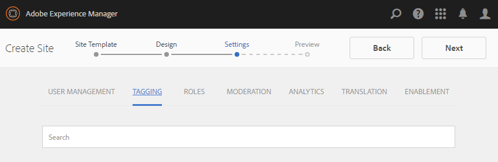

# Console Siti community {#communities-sites-console}

La console Siti di Communities consente di accedere a:

* Creazione di siti
* Modifica del sito
* Gestione del sito
* [Creazione e modifica di gruppi nidificati](/help/communities/groups.md) (sottocomunità)

Consulta [Guida introduttiva ad AEM Communities](/help/communities/getting-started.md) scopri quanto rapidamente un sito community può essere creato nell’ambiente di authoring e come creare gruppi community dagli ambienti di authoring e pubblicazione.

>[!NOTE]
>
>I principali menu Communities per la creazione di [siti community](/help/communities/sites-console.md), [modelli per sito community](/help/communities/sites.md), [modelli per gruppi community](/help/communities/tools-groups.md) e [funzioni community](/help/communities/functions.md) devono essere utilizzati solo nell’ambiente di authoring.

## Prerequisiti {#prerequisites}

Prima di creare un sito community, *obbligatorio* a:

* Assicurati che una o più istanze di pubblicazione siano in esecuzione.
* Abilita [servizio tunnel](/help/communities/deploy-communities.md#tunnel-service-on-author) per gestire membri e gruppi di membri.
* Identificare [editore principale](/help/communities/deploy-communities.md#primary-publisher).
* [Configurare la replica](/help/communities/deploy-communities.md#replication-agents-on-author) quando la porta dell&#39;editore principale non è quella predefinita (4503).

Per garantire che il sito sia preparato per il supporto di molte funzioni, è consigliabile effettuare le seguenti operazioni:

* Installare [feature pack più recente](/help/communities/deploy-communities.md#latestfeaturepack).
* Abilita [Adobe Analytics](/help/communities/analytics.md) per AEM Communities.
* Configura [email](/help/communities/email.md)
* Identificare [Amministratori community](/help/communities/users.md#creating-community-members).
* [Abilita gestore OAuth](/help/communities/social-login.md#adobe-granite-oauth-authentication-handler) per accesso social network.

## Accesso alla console dei siti di Communities {#accessing-communities-sites-console}

Nell’ambiente di authoring, per raggiungere la console Siti community:

* Dalla navigazione globale: **[!UICONTROL Community]** > **[!UICONTROL Sites]**

Nella console Siti community vengono visualizzati tutti i siti della community esistenti. Da questa console è possibile creare, modificare, gestire ed eliminare siti community.

Per creare un nuovo sito community, selezionare **Crea** icona.

Per accedere a un sito community esistente, per creare, modificare, pubblicare, esportare o aggiungere un gruppo nidificato, selezionare l&#39;icona della cartella del sito.

## Creazione di siti {#site-creation}

La console di creazione del sito fornisce un approccio dettagliato per assemblare le funzioni del sito in base a una [modello per sito community](/help/communities/sites.md) e.

Ogni sito creato include una funzione di accesso, in quanto i visitatori del sito devono effettuare l&#39;accesso prima di poter pubblicare contenuti, inviare messaggi o partecipare a un gruppo. Altre funzioni incluse sono profili utente, messaggi, notifiche, menu del sito, ricerca, temi e branding.

Il processo viene avviato selezionando `Create` nella parte superiore della console di Communities Sites.

Il processo di creazione consiste in una serie di passaggi presentati come pannelli contenenti un set di funzioni da configurare (presentate come pannelli secondari). È possibile passare alla **Successivo** passaggio o **Indietro** al passaggio precedente prima di eseguire il commit del sito nel passaggio finale.

### Passaggio 1: modello del sito {#step-site-template}

Nel pannello Modello di sito vengono specificati il titolo, la descrizione, la directory principale del sito, la lingua di base, il nome e il modello del sito:

* **Titolo del sito community**

   Titolo da visualizzare per il sito.

   Il titolo viene visualizzato nel sito pubblicato e nell’interfaccia utente di amministrazione del sito.

* **Descrizione del sito community**

   Descrizione del sito.

   La descrizione non viene visualizzata nel sito pubblicato.

* **Directory principale sito community**

   Percorso della directory principale del sito.

   La directory principale predefinita è `/content/sites`, ma la directory principale può essere spostata in qualsiasi posizione all’interno del sito web.

* **Lingua base del sito community**

   (Lascia intatto per una singola lingua: inglese) Utilizza il menu a discesa per sceglierne uno *o più* lingue di base dalle lingue disponibili: tedesco, italiano, francese, giapponese, spagnolo, portoghese (Brasile), cinese (tradizionale) e cinese (semplificato). Verrà creato un sito community per ogni lingua aggiunta e sarà incluso nella stessa cartella del sito seguendo la best practice descritta in [Traduzione di contenuti per siti multilingue](/help/sites-administering/translation.md). La pagina principale di ciascun sito conterrà una pagina figlia denominata in base al codice della lingua di una delle lingue selezionate, ad esempio &#39;en&#39; per l&#39;inglese o &#39;fr&#39; per il francese.

* **Nome sito community**:

   Nome della pagina principale del sito visualizzato nell&#39;URL.

   * Ricontrolla il nome poiché non è più facile modificarlo dopo la creazione del sito.
   * URL di base ( `https://server:port/site root/site name)` verrà visualizzato sotto il `Community Site Name`.

   * Per un URL valido, aggiungi un codice della lingua di base + &quot;.html&quot;

      *Ad esempio*, `https://localhost:4502/content/sites/mysight/en.html`

* **Modello per sito community** menu

   Utilizza il menu a discesa per scegliere un [modello per sito community](/help/communities/tools.md).

* Seleziona **Avanti**.

### Passaggio 2: Progettazione {#step-design}

Il pannello Progettazione contiene 2 pannelli secondari per la selezione del tema e del banner di branding:

#### TEMA DEL SITO COMMUNITY {#community-site-theme}

Il framework utilizza `Twitter Bootstrap` per offrire al sito un design flessibile e reattivo. È possibile selezionare uno dei molti temi di Bootstrap precaricati per assegnare uno stile al modello di sito community selezionato oppure caricare un tema di Bootstrap.

Quando è selezionata, il tema viene sovrapposto con un segno di spunta blu opaco.

Dopo la pubblicazione del sito della community, è possibile [modificare le proprietà](#modifying-site-properties) e seleziona un tema diverso.

#### MARCHIO PER SITO COMMUNITY {#community-site-branding}

Il branding del sito community è un’immagine visualizzata come intestazione nella parte superiore di ogni pagina.

L’immagine deve essere ridimensionata in modo da avere la larghezza prevista per la pagina nel browser e un’altezza di 120 pixel.

Quando crei o selezioni un’immagine, tieni presente quanto segue:

* L’altezza dell’immagine viene ritagliata a 120 pixel misurati dal bordo superiore dell’immagine.
* L&#39;immagine viene fissata al bordo sinistro della finestra del browser.
* Non esiste alcun ridimensionamento dell’immagine, tale che quando la larghezza dell’immagine è...

   * Inferiore alla larghezza del browser, l’immagine viene ripetuta orizzontalmente.
   * Maggiore della larghezza del browser, l’immagine verrà ritagliata.

* Seleziona **Avanti**.

### Passaggio 3: Impostazioni {#step-settings}

Il pannello Impostazioni contiene diversi pannelli secondari che presentano le funzioni da configurare prima di passare all’ultimo passaggio per creare il sito.

* [GESTIONE UTENTE](#user-management)
* [ASSEGNAZIONE TAG](#tagging)
* [RUOLI](#roles)
* [MODERAZIONE](#moderation)
* [ANALISI](#analytics)
* [TRADUZIONE](#translation)

>[!NOTE]
>
>**Abilita servizio tunnel**
>
>Molti dei pannelli secondari Impostazioni consentono l’assegnazione di un membro fidato per moderare UGC, gestire gruppi o essere contatti per le risorse di abilitazione nell’ambiente di pubblicazione.
>
>La convenzione è per il lato pubblicazione [utenti e gruppi di utenti](/help/communities/users.md) (membri e gruppi di membri) da non duplicare nell’ambiente di authoring.
>
>Pertanto, quando si crea il sito community nell&#39;ambiente di authoring e si assegnano membri attendibili a vari ruoli, è necessario recuperare i dati dei membri dall&#39;ambiente di pubblicazione.
>
>A tale scopo, abilita ` [AEM Communities Publish Tunnel Service](/help/communities/deploy-communities.md#tunnel-service-on-author)` per l’ambiente di authoring.

#### GESTIONE UTENTE {#user-management}

* **Consenti registrazione utente**

   Se questa opzione è selezionata, i visitatori del sito possono diventare membri della community tramite la registrazione autonoma.
Se questa opzione è deselezionata, il sito community è *limitato* i visitatori del sito e devono essere assegnati al gruppo membri del sito community, inoltrare una richiesta o ricevere un invito tramite e-mail. Se questa opzione è deselezionata, l’accesso anonimo non deve essere consentito.
Deseleziona per *privato* sito della community. Il valore predefinito è selezionato.

* **Consenti accesso anonimo**

   Se questa opzione è selezionata, il sito community è *open *e qualsiasi visitatore può accedere al sito.
Se non è selezionata, solo i membri con accesso possono accedere al sito.
Deseleziona la voce relativa a un sito *privato *della community. Il valore predefinito è selezionato.

* **Consenti messaggi**

   Se questa opzione è selezionata, i membri possono inviare messaggi l&#39;uno all&#39;altro e al gruppo all&#39;interno del sito community.
Se questa opzione è deselezionata, la messaggistica non viene impostata per la community.
L&#39;impostazione predefinita è deselezionata.

* **Consenti accesso social network: Facebook**

   Se questa opzione è selezionata, consentire ai visitatori del sito di accedere con le credenziali del proprio account Facebook. Il valore selezionato [Configurazione cloud facebook](/help/communities/social-login.md#create-a-facebook-connect-cloud-service) deve essere configurato in modo da aggiungere utenti al gruppo membri del sito community dopo la creazione del sito community.
Se non è selezionata, non viene visualizzato alcun accesso a Facebook.
Lascia deselezionata l’opzione *privato* sito della community. L&#39;impostazione predefinita è deselezionata.

* **Consenti accesso social network: Twitter**

   Se questa opzione è selezionata, consentire ai visitatori del sito di accedere con le credenziali del proprio account Twitter. Il valore selezionato [Configurazione cloud twitter](/help/communities/social-login.md#create-a-twitter-connect-cloud-service) deve essere configurato in modo da aggiungere utenti al gruppo membri del sito community dopo la creazione del sito community.
Se non è selezionata, non viene visualizzato alcun accesso a Twitter.
Lascia deselezionata l’opzione *privato* sito della community. L&#39;impostazione predefinita è deselezionata.

>[!NOTE]
>
>**Consentire gli accessi social network**
>
>Anche se configurazioni Facebook e Twitter di esempio possono esistere ed essere selezionabili, per un [ambiente di produzione](/help/sites-administering/production-ready.md), è necessario creare applicazioni Facebook e Twitter personalizzate. Consulta [Accesso social network con Facebook e Twitter](/help/communities/social-login.md).

#### ASSEGNAZIONE TAG {#tagging}

I tag che possono essere applicati al contenuto della community sono controllati selezionando Tag Namespace precedentemente definiti tramite il [Console per assegnazione tag](/help/sites-administering/tags.md#tagging-console).

Inoltre, la selezione degli spazi dei nomi dei tag per il sito community limita la selezione presentata durante la definizione di cataloghi e risorse.

* casella di ricerca di testo : inizia a digitare per identificare i tag che possono essere utilizzati sul sito.

#### RUOLI {#roles}

Il [ruoli dei membri della community](/help/communities/users.md) sono assegnati con queste impostazioni.

Trovare i membri della community è facile con la ricerca del tipo-ahead.

* **Manager community**

   Inizia a digitare per selezionare uno o più membri o gruppi di membri della community che possono gestire membri e gruppi di membri della community.

* **Moderatori community**

   Inizia a digitare per selezionare uno o più membri della community o gruppi di membri da considerare attendibili come moderatori del contenuto generato dall&#39;utente.

* **Membri community con privilegi**

   Inizia a digitare per selezionare uno o più membri o gruppi di membri della community a cui assegnare la possibilità di creare nuovo contenuto quando `Allow Privileged Member` è stato selezionato per [funzione community](/help/communities/functions.md).

* **Amministratori community**

   Inizia a digitare per selezionare uno o più amministratori del sito che possono gestire la struttura del sito indipendentemente da altri amministratori del sito e dall&#39;amministratore della community predefinito. Possono creare un gruppo a qualsiasi livello della gerarchia e diventare gli amministratori predefiniti dei gruppi nidificati (ma in seguito possono essere rimossi dal ruolo di amministratore dei gruppi nidificati).

#### MODERAZIONE {#moderation}

L&#39;impostazione globale per la moderazione dei contenuti generati dagli utenti (UGC, User Generated Content) è controllata da queste impostazioni. I singoli componenti hanno impostazioni aggiuntive per controllare la moderazione.

* **Il contenuto è premoderato**

   Se questa opzione è selezionata, il contenuto della community pubblicata non verrà visualizzato finché non viene approvato da un moderatore. L&#39;impostazione predefinita è deselezionata. Per ulteriori informazioni, consulta [Moderazione dei contenuti della community](/help/communities/moderate-ugc.md#premoderation).

* **Soglia di segnalazione prima che il contenuto venga nascosto**

   Se è maggiore di 0, indica quante volte un argomento o un post deve essere segnalato prima di essere nascosto. Se è impostato su -1, l&#39;argomento o il post contrassegnato non viene mai nascosto dalla visualizzazione pubblica. Il valore predefinito è 5.

#### ANALISI {#analytics}

* **Abilita Analytics**

   Disponibile solo se Adobe Analytics è stato [configurato](/help/communities/analytics.md) per le funzioni di Communities.
L&#39;impostazione predefinita è deselezionata. Se questa opzione è selezionata, viene visualizzato un menu di selezione aggiuntivo:

* **Riferimento framework configurazione Cloud**

   Dal menu a discesa, seleziona il framework del servizio cloud Analytics configurato per questo sito community.
   `Communities` è l’esempio di framework da [Configurazione di Analytics per le funzioni di Communities](/help/communities/analytics.md#aem-analytics-framework-configuration) documentazione.

#### TRADUZIONE {#translation}

* **Consenti traduzione automatica**

   Se questa opzione è selezionata (l&#39;impostazione predefinita è deselezionata), la traduzione automatica è abilitata per UGC all&#39;interno del sito. Questo non influisce su altri contenuti, come il contenuto della pagina, anche se il sito è configurato come sito multilingue. Consulta [Traduzione dei contenuti generati dagli utenti](/help/communities/translate-ugc.md) per informazioni sulla configurazione di un servizio di traduzione concesso in licenza per AEM Communities. Consulta [Traduzione di contenuti per siti multilingue](/help/sites-administering/translation.md) per una panoramica completa.

* **Attiva traduzione automatica per le lingue selezionate**

   Le lingue abilitate per la traduzione automatica vengono impostate per default sull&#39;impostazione di sistema specificata da [configurazione dell’integrazione della traduzione](/help/communities/translate-ugc.md#translation-integration-configuration). Queste impostazioni predefinite possono essere ignorate per questo sito eliminando le impostazioni predefinite e/o selezionando altre lingue dal menu a discesa.

* **Scegli il provider di traduzione**

   Per impostazione predefinita, il provider di servizi è un servizio di prova che utilizza `microsoft` solo per dimostrazione. Se nessun fornitore di servizi di traduzione dispone di una licenza, **Consenti traduzione automatica** deve essere deselezionata.

* **Scegli store condiviso globale**

   Per un sito web con più copie per lingua, un archivio condiviso globale fornisce un singolo thread di conversazione, visibile da ogni copia per lingua. Ciò si ottiene selezionando una delle lingue incluse come copia per lingua. Il valore predefinito è *Nessun archivio condiviso globale*.

* **Scegli la configurazione del provider di traduzione**

   Scegli un [framework di integrazione della traduzione](/help/sites-administering/tc-tic.md) creato per il provider di traduzione autorizzato.

* **Seleziona le opzioni di traduzione per il sito community**

   * **Traduci tutta la pagina**

      Se questa opzione è selezionata, tutti i contenuti UGC di una pagina vengono tradotti nella lingua di base della pagina.

      Il valore predefinito è *non selezionato*.

   * **Traduci solo la selezione**

      Se selezionata, accanto a ciascun post viene visualizzata un&#39;opzione di traduzione che consente la traduzione dei singoli post nella lingua di base della pagina.
Il valore predefinito è *selezionato*.

* **Seleziona le opzioni di persistenza**

   * **Traduci contributi su richiesta dell’utente e in seguito mantieni le traduzioni**
Se selezionato, il contenuto non viene tradotto fino a quando non viene effettuata una richiesta. Una volta tradotta, la traduzione viene memorizzata nell’archivio.

      Il valore predefinito è *non selezionato*.

   * **Non mantenere le traduzioni**

      Se questa opzione è selezionata, le traduzioni non vengono memorizzate nell’archivio.

      Se non è selezionata, le traduzioni vengono rese permanenti.

      Il valore predefinito è *non selezionato*.

* **Rendering avanzato**

   Seleziona una delle seguenti opzioni:

   * `Always show contributions in the original language` (impostazione predefinita)
   * `Always show contributions in user preferred language`
   * `Show contributions in user preferred language for only logged-in users`

### Passaggio 4: creare il sito community {#step-create-communities-site}

Se sono necessarie delle regolazioni, utilizzare **Indietro** per farle.

Una volta **Crea** è selezionato e avviato, il processo di creazione del sito non può essere interrotto.

Una volta creato il sito:

* La modifica dell’URL (nome nodo) non è supportata.
* Le modifiche future al modello di sito community non avranno effetto sul sito community creato.
* La disattivazione del modello di sito community non avrà effetto sul sito community creato.
* È possibile modificare il [STRUTTURA](#modify-structure) di un sito community modificandone le proprietà.

Al termine del processo, la cartella per il nuovo sito viene visualizzata nella console Siti di Communities, da cui gli autori possono aggiungere contenuto alla pagina oppure gli amministratori possono modificare le proprietà del sito.

Per modificare un sito community, selezionare la cartella dei progetti per aprirlo:

Quando si passa il puntatore del mouse su un sito o si tocca una scheda del sito, vengono visualizzate le icone che consentono di [modifica del sito in modalità di authoring](#authoring-site-content), [apertura delle proprietà del sito per la modifica](#modifying-site-properties), [pubblicazione del sito](#publishing-the-site), [esportazione del sito](#exporting-the-site), e [eliminazione del sito](#deleting-the-site).

## Authoring dei contenuti del sito {#authoring-site-content}

Il contenuto di un sito può essere creato con gli stessi strumenti di qualsiasi altro sito web dell’AEM. Per aprire il sito per l’authoring, seleziona la `Open Site` che viene visualizzata quando si passa il mouse sul sito. Il sito verrà aperto in una nuova scheda in modo che la console Siti di Communities rimanga accessibile.

>[!NOTE]
>
>Se non conosci l’AEM, consulta la documentazione su [operazioni di base](/help/sites-authoring/basic-handling.md) e un [guida rapida all’authoring delle pagine](/help/sites-authoring/qg-page-authoring.md).

## Modifica delle proprietà del sito {#modifying-site-properties}

Le proprietà di un sito esistente, specificate durante il processo di creazione del sito, possono essere modificate selezionando `Edit Site`che viene visualizzata quando si passa il mouse sul sito.

`Details of the following properties match the descriptions provided in the` [Creazione di siti](#site-creation) sezione.

### Modifica di base {#modify-basic}

Il pannello BASIC consente di modificare:

* Titolo del sito community
* Descrizione del sito community

Impossibile modificare il nome del sito community.

La scelta di un modello diverso per il sito community non avrà alcun effetto su un sito community esistente, poiché non rimane alcuna connessione tra modelli e siti.

Al contrario, [STRUTTURA](#modify-structure) del sito community può essere modificata.

### Modifica struttura {#modify-structure}

Il pannello STRUTTURA consente di modificare la struttura creata inizialmente dal modello di sito community selezionato. Dal pannello, è possibile:

* Trascinamento della selezione [funzioni community](/help/communities/functions.md) nella struttura del sito.
* In un’istanza di una funzione community nella struttura del sito:

   * **`gear icon`**

      Modifica le impostazioni, tra cui il titolo visualizzato e il nome URL*, nonché [gruppi di membri con privilegi](/help/communities/users.md#privilegedmembersgroups).

   * **`trashcan icon`**

      Rimuovere (eliminare) le funzioni dalla struttura del sito.

   * **`grid icon`**

      Modifica l&#39;ordine delle funzioni visualizzato nella barra di navigazione di livello superiore del sito.

>[!NOTE]
>
>È possibile modificare l&#39;ordine di tutte le funzioni nella struttura del sito ad eccezione della funzione nella parte superiore. Pertanto, la home page del sito community non può essere modificata.

>[!CAUTION]
>
>* Anche se il titolo visualizzato può essere modificato senza effetti collaterali, si sconsiglia di modificare il nome URL di una funzione community appartenente a un sito community.
>
>Ad esempio, la ridenominazione dell’URL non sposterà l’UGC esistente, causando la perdita dell’UGC.

>[!CAUTION]
>
>La funzione dei gruppi deve *non* essere *primo e unico* nella struttura del sito.
>
>Qualsiasi altra funzione, ad esempio [funzione page](/help/communities/functions.md#page-function), deve essere incluso ed elencato per primo.

#### Esempio: aggiunta di una funzione di catalogo a una struttura del sito community {#example-adding-a-catalog-function-to-a-community-site-structure}

### Modifica progettazione {#modify-design}

Il pannello PROGETTAZIONE consente di applicare un nuovo tema:

* [Tema per sito community](#community-site-theme)
* [Marchio per sito community](#community-site-branding)

   * Scorri fino alla parte inferiore del pannello per modificare l’immagine del brand.

### Modifica impostazioni {#modify-settings}

Il pannello SETTINGS (IMPOSTAZIONI) consente di accedere alla maggior parte delle impostazioni nei pannelli secondari di per il passaggio 3 della creazione di siti community:

* [User Management](#user-management)
* [Tag](#tagging)
* [Moderazione](#moderation)
* [Ruoli dei membri](#roles)
* [Analytics](#analytics)
* [Traduzione](#translation)

### Modifica miniatura {#modify-thumbnail}

Il pannello THUMBNAIL consente di caricare un’immagine che rappresenta il sito nella console Siti di Communities.

## Pubblicazione del sito {#publishing-the-site}

Dopo la creazione o la modifica di un sito community, è possibile pubblicarlo (attivarlo) selezionando `Publish Site` che viene visualizzata al passaggio del mouse sul sito.

Verrà visualizzata un’indicazione dopo la pubblicazione del sito.

### Pubblicazione con gruppi nidificati {#publishing-with-nested-groups}

Dopo aver pubblicato un sito community, è necessario pubblicare singolarmente ogni sottocommunity (gruppo nidificato) creata utilizzando [Console Gruppi](/help/communities/groups.md).

## Esportazione del sito {#exporting-the-site}

Seleziona l’icona di esportazione, al passaggio del mouse sul sito, per creare un pacchetto del sito community archiviato in [gestione pacchetti](/help/sites-administering/package-manager.md) e scaricato.

UGC non è incluso nel pacchetto del sito.

## Eliminazione del sito {#deleting-the-site}

Per eliminare il sito community, selezionare l&#39;icona Elimina sito visualizzata quando si passa il puntatore del mouse sul sito nella console del sito Communities. Questa azione rimuove tutti gli elementi associati al sito, ad esempio UGC, gruppi di utenti, risorse e record di database.

## Gruppi utenti community creati {#created-community-user-groups}

Dopo la pubblicazione del nuovo sito della community, vengono creati nuovi gruppi membri (i gruppi di utenti vengono creati nell&#39;ambiente di pubblicazione) che dispongono delle autorizzazioni appropriate impostate per vari ruoli amministratore e membro.

Il nome creato per i gruppi di membri include *site-name* dato il sito in [Passaggio 1](#step13asitetemplate) (il nome visualizzato nell&#39;URL) e un ID univoco per evitare conflitti con i siti e i gruppi della community che hanno lo stesso nome-sito per diverse directory principali del sito.

Ad esempio, se il nome fosse &quot;coinvolgere&quot; per un sito intitolato &quot;Esercitazione introduttiva&quot;, il gruppo di utenti per i moderatori sarebbe:

* title: Moderatori del coinvolgimento della community
* nome: community-*engi-uid*-moderatori

Tutti i membri ai quali sono stati assegnati ruoli di moderatori o amministratori di gruppi durante la creazione del sito verranno assegnati al gruppo appropriato e al gruppo di membri. Questi gruppi e le assegnazioni dei membri vengono creati al momento della pubblicazione del nuovo sito.

Per ulteriori informazioni, consulta [Gestione di utenti e gruppi di utenti](/help/communities/users.md).

>[!NOTE]
>
>Se [Consenti accesso social network: Facebook](#user-management) è attivato, una volta che il gruppo di utenti
>
>* `community-<site-name>-<uid>-members`
>
>viene creato, il valore applicato [Servizio cloud facebook](/help/communities/social-login.md#createafacebookcloudservice) deve essere configurato per aggiungere utenti a questo gruppo.

## Errore di configurazione per l’autenticazione {#configure-for-authentication-error}

Per impostazione predefinita, un sito community viene reindirizzato a una pagina di accesso di esempio quando l&#39;utente immette credenziali errate e non riesce ad accedere. Questo accesso di esempio non sarà presente in un [server di produzione](/help/sites-administering/production-ready.md).

Per reindirizzare correttamente, una volta configurato il sito e inviato per la pubblicazione, completa questi passaggi per evitare che l&#39;autenticazione reindirizzi al sito community:

* Su ogni istanza di pubblicazione AEM.
* Accedi con privilegi di amministratore.
* Accedere a [Console web](/help/sites-deploying/configuring-osgi.md).

   * Ad esempio: [https://localhost:4503/system/console/configMgr](https://localhost:4503/system/console/configMgr).

* Individua `Adobe Granite Login Selector Authentication Handler`.
* Seleziona la `pencil` per aprire la configurazione per la modifica.
* Immetti un **Mappature pagina di accesso** come segue:

   `/content/sites/<site-name>/path/to/login/page:/content/sites/<site-name>`

   Ad esempio:
   `/content/sites/engage/en/signin:/content/sites/engage/en`

* Seleziona **Salva**.

### Test reindirizzamento autenticazione {#test-authentication-redirection}

Nella stessa istanza di pubblicazione AEM configurata con una mappatura della pagina di accesso per il sito community:

* Passare alla home page del sito community.

   * Ad esempio: [https://localhost:4503/content/sites/engage/en.html](https://localhost:4503/content/sites/engage/en.html)

* Selezionare Disconnetti.
* Seleziona Accedi.
* Immettere credenziali non corrette, ad esempio nome utente &quot;x&quot; e password &quot;x&quot;.
* La pagina di accesso deve essere visualizzata con un errore di &quot;accesso non valido&quot;.

## Accesso ai siti community dalla console Sites principale {#accessing-community-sites-from-main-sites-console}

Dalla console di navigazione globale Sites, i siti community si trovano in `Community Sites` cartella.

Anche se è possibile accedere a un sito community in questo modo, per le attività amministrative è necessario accedere al sito community dalla console Siti community.

