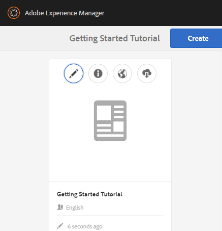

# Console Siti community {#communities-sites-console}

La console Siti di Communities consente di accedere a:

* Creazione di siti
* Modifica del sito
* Gestione del sito
* [Creazione e modifica di gruppi nidificati](/help/communities/groups.md) (sottocomunità)

Consulta [Guida introduttiva di AEM Communities](/help/communities/getting-started.md) per informazioni sulla velocità di creazione di un sito community nell&#39;ambiente di authoring e sulla creazione di gruppi community dagli ambienti di authoring e pubblicazione.

>[!NOTE]
>
>I menu principali di Communities per la creazione di [siti community](/help/communities/sites-console.md), [modelli di siti community](/help/communities/sites.md), [modelli di gruppi community](/help/communities/tools-groups.md) e [funzioni community](/help/communities/functions.md) sono da utilizzare solo nell&#39;ambiente di authoring.

## Prerequisiti {#prerequisites}

Prima di creare un sito community, è *obbligatorio* per:

* Assicurati che una o più istanze di Publish siano in esecuzione.
* Abilita il servizio [tunnel](/help/communities/deploy-communities.md#tunnel-service-on-author) per gestire membri e gruppi di membri.
* Identificare l&#39;[editore primario](/help/communities/deploy-communities.md#primary-publisher).
* [Configura la replica](/help/communities/deploy-communities.md#replication-agents-on-author) quando la porta di pubblicazione primaria non è quella predefinita (4503).

Per garantire che il sito sia preparato per il supporto di molte funzioni, è consigliabile effettuare le seguenti operazioni:

* Installa il [pacchetto di funzionalità più recente](/help/communities/deploy-communities.md#latestfeaturepack).
* Abilita [Adobe Analytics](/help/communities/analytics.md) per AEM Communities.
* Configura [e-mail](/help/communities/email.md)
* Identificare [Amministratori community](/help/communities/users.md#creating-community-members).
* [Abilita gestore OAuth](/help/communities/social-login.md#adobe-granite-oauth-authentication-handler) per l&#39;accesso social network.

## Accesso alla console dei siti di Communities {#accessing-communities-sites-console}

Nell’ambiente di authoring, per raggiungere la console Siti community:

* Dalla navigazione globale: **[!UICONTROL Communities]** > **[!UICONTROL Sites]**

Nella console Siti community vengono visualizzati tutti i siti della community esistenti. Da questa console è possibile creare, modificare, gestire ed eliminare siti community.

Per creare un sito community, selezionare l&#39;icona **Crea**.

Per accedere a un sito community esistente per la creazione, la modifica, la pubblicazione, l&#39;esportazione o l&#39;aggiunta di un gruppo nidificato, selezionare l&#39;icona della cartella del sito.

## Creazione di siti {#site-creation}

La console di creazione siti fornisce un approccio dettagliato per assemblare le funzionalità del sito in base a un [modello di sito community](/help/communities/sites.md) selezionato e alle impostazioni.

Ogni sito creato include una funzione di accesso, in quanto i visitatori del sito devono effettuare l&#39;accesso prima di poter pubblicare contenuti, inviare messaggi o partecipare a un gruppo. Altre funzioni incluse sono i profili utente, i messaggi, le notifiche, il menu del sito, la ricerca, il tema e il branding.

Il processo viene avviato selezionando il pulsante `Create` nella parte superiore della console di Communities Sites.

Il processo di creazione consiste in una serie di passaggi presentati come pannelli contenenti un insieme di feature da configurare (presentate come pannelli secondari). È possibile passare al passaggio **Successivo** o **Indietro** al passaggio precedente prima di eseguire il commit del sito nel passaggio finale.

### Passaggio 1: modello del sito {#step-site-template}

Nel pannello Modello di sito vengono specificati il titolo, la descrizione, la directory principale del sito, la lingua di base, il nome e il modello di sito:

* **Titolo sito community**

  Titolo da visualizzare per il sito.

  Il titolo viene visualizzato nel sito pubblicato e nell’interfaccia utente di amministrazione del sito.

* **Descrizione sito community**

  Descrizione del sito.

  La descrizione non viene visualizzata nel sito pubblicato.

* **Directory principale sito community**

  Percorso della directory principale del sito.

  La directory principale predefinita è `/content/sites`, ma la directory principale può essere spostata in qualsiasi posizione all&#39;interno del sito Web.

* **Lingua base del sito community**

  (Lascia intatto per una sola lingua: inglese) Utilizza il menu a discesa per scegliere una *o più* lingue di base tra le lingue disponibili: tedesco, italiano, francese, giapponese, spagnolo, portoghese (Brasile), cinese (tradizionale) e cinese (semplificato). Viene creato un sito community per ogni lingua aggiunta ed esiste nella stessa cartella siti seguendo la best practice descritta in [Traduzione di contenuto per siti multilingue](/help/sites-administering/translation.md). La pagina principale di ciascun sito contiene una pagina figlia denominata con il codice della lingua di una delle lingue selezionate, ad esempio &#39;en&#39; per l&#39;inglese o &#39;fr&#39; per il francese.

* **Nome sito community**:

  Nome della pagina principale del sito visualizzato nell&#39;URL.

   * Ricontrolla il nome poiché non è più facile modificarlo dopo la creazione del sito.
   * L&#39;URL di base ( `https://server:port/site root/site name)` è visualizzato sotto `Community Site Name`.

   * Per un URL valido, aggiungi un codice della lingua di base + &quot;.html&quot;

     *Esempio*, `https://localhost:4502/content/sites/mysight/en.html`

* Menu **Modello per sito community**

  Utilizzare il menu a discesa per scegliere un [modello di sito community](/help/communities/tools.md) disponibile.

* Seleziona **Avanti**.

### Passaggio 2: Progettazione {#step-design}

Il pannello Progettazione contiene due pannelli secondari per la selezione del tema e del banner di branding:

#### TEMA DEL SITO COMMUNITY {#community-site-theme}

Il framework utilizza `Twitter Bootstrap` per portare una progettazione reattiva e flessibile al sito. È possibile selezionare uno dei molti temi di Bootstrap precaricati per assegnare uno stile al modello di sito community selezionato oppure caricare un tema di Bootstrap.

Quando questa opzione è selezionata, il tema viene sovrapposto con un segno di spunta blu opaco.

Dopo la pubblicazione del sito community, è possibile [modificare le proprietà](#modifying-site-properties) e selezionare un tema diverso.

#### MARCHIO PER SITO COMMUNITY {#community-site-branding}

Il branding del sito community è un’immagine visualizzata come intestazione nella parte superiore di ogni pagina.

L’immagine deve essere ridimensionata in modo da avere la larghezza prevista per la pagina nel browser e un’altezza di 120 pixel.

Quando crei o selezioni un’immagine, tieni presente quanto segue:

* L&#39;altezza dell&#39;immagine viene ritagliata a 120 pixel misurati dal bordo superiore dell&#39;immagine.
* L&#39;immagine viene fissata al bordo sinistro della finestra del browser.
* Non esiste alcun ridimensionamento dell’immagine, tale che quando la larghezza dell’immagine è...

   * Inferiore alla larghezza del browser, l’immagine si ripete orizzontalmente.
   * Maggiore della larghezza del browser, l’immagine sembra essere ritagliata.

* Seleziona **Avanti**.

### Passaggio 3: Impostazioni {#step-settings}

Il pannello Impostazioni contiene diversi pannelli secondari che presentano le funzioni da configurare prima di passare all’ultimo passaggio per creare il sito.

* [GESTIONE UTENTE](#user-management)
* [ASSEGNAZIONE TAG](#tagging)
* [RUOLI](#roles)
* [MODERAZIONE](#moderation)
* [ANALISI](#analytics)
* [TRADUZIONE](#translation)

>[!NOTE]
>
>**Abilita servizio tunnel**
>
>Molti dei pannelli secondari Impostazioni consentono l’assegnazione di un membro fidato per moderare UGC, gestire gruppi o essere contatti per le risorse di abilitazione nell’ambiente di pubblicazione.
>
>La convenzione prevede che [utenti e gruppi di utenti](/help/communities/users.md) (membri e gruppi di membri) lato pubblicazione non vengano duplicati nell&#39;ambiente di authoring.
>
>Pertanto, quando si crea il sito community nell&#39;ambiente di authoring e si assegnano membri attendibili a vari ruoli, è necessario recuperare i dati dei membri dall&#39;ambiente di pubblicazione.
>
>Questa operazione viene eseguita abilitando ` [AEM Communities Publish Tunnel Service](/help/communities/deploy-communities.md#tunnel-service-on-author)` per l&#39;ambiente di authoring.

#### GESTIONE UTENTE {#user-management}

* **Consenti registrazione utente**

  Se questa opzione è selezionata, i visitatori del sito possono diventare membri della community tramite la registrazione autonoma.
Se questa opzione è deselezionata, il sito community è *limitato* e i visitatori del sito devono essere assegnati al gruppo di membri della community, inoltrare una richiesta o ricevere un invito tramite e-mail. Se questa opzione è deselezionata, l’accesso anonimo non deve essere consentito.
Deselezionare la casella di controllo per un sito community *private*. Il valore predefinito è selezionato.

* **Consenti accesso anonimo**

  Se questa opzione è selezionata, il sito della community è *aperto* e qualsiasi visitatore del sito può accedervi.
Se non è selezionata, solo i membri con accesso possono accedere al sito.
Deselezionare la casella di controllo per un sito community *private*. Il valore predefinito è selezionato.

* **Consenti messaggi**

  Se questa opzione è selezionata, i membri possono inviare messaggi l&#39;uno all&#39;altro e al gruppo all&#39;interno del sito community.
Se questa opzione è deselezionata, la messaggistica non viene impostata per la community.
L&#39;impostazione predefinita è deselezionata.

* **Consenti accessi social network: Facebook**

  Se questa opzione è selezionata, consentire ai visitatori del sito di accedere con le credenziali del proprio account Facebook. La [configurazione cloud Facebook](/help/communities/social-login.md#create-a-facebook-connect-cloud-service) selezionata deve essere configurata per aggiungere utenti al gruppo membri del sito community dopo la creazione del sito community.
Se non è selezionata, non viene visualizzato alcun accesso a Facebook.
Lascia deselezionata l&#39;opzione per un sito community *private*. L&#39;impostazione predefinita è deselezionata.

* **Consenti accessi social network: Twitter**

  Se questa opzione è selezionata, consentire ai visitatori del sito di accedere con le credenziali dell&#39;account di Twitter. La configurazione cloud [Twitter](/help/communities/social-login.md#create-a-twitter-connect-cloud-service) selezionata deve essere configurata per aggiungere utenti al gruppo membri del sito community dopo la creazione del sito community.
Se questa opzione è deselezionata, non viene visualizzato alcun accesso di Twitter.
Lascia deselezionata l&#39;opzione per un sito community *private*. L&#39;impostazione predefinita è deselezionata.

>[!NOTE]
>
>**Consenti accesso social network**
>
>Anche se alcune configurazioni Facebook e di Twitter di esempio possono esistere ed essere selezionabili per un [ambiente di produzione](/help/sites-administering/production-ready.md), è necessario creare applicazioni Facebook e di Twitter personalizzate. Consulta [Accesso social network con Facebook e Twitter](/help/communities/social-login.md).

#### ASSEGNAZIONE TAG {#tagging}

I tag, che possono essere applicati al contenuto della community, sono controllati selezionando Spazi dei nomi dei tag definiti in precedenza tramite la [Console tag](/help/sites-administering/tags.md#tagging-console).

Inoltre, la selezione degli spazi dei nomi dei tag per il sito community limita la selezione presentata durante la definizione di cataloghi e risorse.

* casella di ricerca di testo : inizia a digitare per identificare i tag che possono essere utilizzati sul sito.

#### RUOLI {#roles}

I [ruoli dei membri della community](/help/communities/users.md) sono assegnati con queste impostazioni.

Trovare i membri della community è facile con la ricerca del tipo-ahead.

* **Manager community**

  Inizia a digitare per selezionare uno o più membri o gruppi di membri della community che possono gestire membri e gruppi di membri della community.

* **Moderatori community**

  Inizia a digitare per selezionare uno o più membri della community o gruppi di membri da considerare attendibili come moderatori del contenuto generato dall&#39;utente.

* **Membri community con privilegi**

  Inizia a digitare per selezionare uno o più membri o gruppi di membri della community per poter creare contenuto quando `Allow Privileged Member` è stato selezionato per una [funzione community](/help/communities/functions.md).

* **Amministratori community**

  Inizia a digitare per selezionare uno o più amministratori del sito che possono gestire la struttura del sito indipendentemente da altri amministratori del sito e dall&#39;amministratore della community predefinito. Possono creare gruppi a qualsiasi livello della gerarchia e diventare gli amministratori predefiniti dei gruppi nidificati (ma in seguito possono essere rimossi dal ruolo di amministratore dei gruppi nidificati).

#### MODERAZIONE {#moderation}

L&#39;impostazione globale per la moderazione dei contenuti generati dagli utenti (UGC, User-Generated Content) è controllata da queste impostazioni. I singoli componenti hanno impostazioni aggiuntive per controllare la moderazione.

* **Il contenuto è premoderato**

  Se questa opzione è selezionata, il contenuto della community pubblicata non viene visualizzato finché non viene approvato da un moderatore. L&#39;impostazione predefinita è deselezionata. Per ulteriori informazioni, vedere [Moderazione contenuto community](/help/communities/moderate-ugc.md#premoderation).

* **Soglia di segnalazione prima che il contenuto sia nascosto**

  Se è maggiore di 0, indica quante volte un argomento o un post deve essere segnalato prima di essere nascosto. Se è impostato su -1, l&#39;argomento o il post contrassegnato non viene mai nascosto dalla visualizzazione pubblica. Il valore predefinito è 5.

#### ANALISI {#analytics}

* **Abilita analisi**

  Disponibile solo se Adobe Analytics è stato [configurato](/help/communities/analytics.md) per le funzionalità di Communities.
L&#39;impostazione predefinita è deselezionata. Se questa opzione è selezionata, viene visualizzato un menu di selezione aggiuntivo:

* **Riferimento framework configurazione cloud**

  Dal menu a discesa, seleziona il framework di servizi Analytics Cloud configurato per questo sito community.
  `Communities` è l&#39;esempio del framework dalla documentazione [Configurazione di Analytics per le funzionalità delle community](/help/communities/analytics.md#aem-analytics-framework-configuration).

#### TRADUZIONE {#translation}

* **Consenti traduzione automatica**

  Se questa opzione è selezionata (l&#39;impostazione predefinita è deselezionata), la traduzione automatica è abilitata per UGC all&#39;interno del sito. Questo non influisce su altri contenuti, come il contenuto della pagina, anche se il sito è configurato come sito multilingue. Per informazioni sulla configurazione di un servizio di traduzione concesso in licenza per AEM Communities, consulta [Traduzione di contenuti generati dall&#39;utente](/help/communities/translate-ugc.md). Per una panoramica completa, consulta [Traduzione di contenuti per siti multilingue](/help/sites-administering/translation.md).

* **Abilita traduzione automatica per le lingue selezionate**

  Le lingue abilitate per la traduzione automatica sono predefinite nell&#39;impostazione di sistema specificata dalla [configurazione integrazione traduzione](/help/communities/translate-ugc.md#translation-integration-configuration). Queste impostazioni predefinite possono essere ignorate per questo sito eliminando le impostazioni predefinite e/o selezionando altre lingue dal menu a discesa.

* **Scegli un provider di traduzione**

  Per impostazione predefinita, il provider di servizi è un servizio di prova che utilizza `microsoft` solo per dimostrazione. Se nessun provider di servizi di traduzione dispone della licenza, è necessario deselezionare **Consenti traduzione automatica**.

* **Scegli un archivio condiviso globale**

  Per un sito web con più copie per lingua, un archivio condiviso globale fornisce un singolo thread di conversazione, visibile da ogni copia per lingua. Ciò si ottiene selezionando una delle lingue incluse come copia per lingua. Il valore predefinito è *Nessun archivio condiviso globale*.

* **Scegli configurazione provider di traduzione**

  Scegli un [framework di integrazione della traduzione](/help/sites-administering/tc-tic.md) creato per il provider di traduzione concesso in licenza.

* **Selezionare le opzioni di traduzione per il sito community**

   * **Traduci intera pagina**

     Se questa opzione è selezionata, tutti i contenuti UGC di una pagina vengono tradotti nella lingua di base della pagina.

     Il valore predefinito è *non selezionato*.

   * **Traduci solo selezione**

     Se selezionata, accanto a ciascun post viene visualizzata un&#39;opzione di traduzione che consente la traduzione dei singoli post nella lingua di base della pagina.
Il valore predefinito è *selected*.

* **Seleziona opzioni di persistenza**

   * **Traduci contributi su richiesta dell&#39;utente e in seguito mantieni le traduzioni**
Se selezionato, il contenuto non viene tradotto fino a quando non viene effettuata una richiesta. Una volta tradotta, la traduzione viene memorizzata nell’archivio.

     Il valore predefinito è *non selezionato*.

   * **Non mantenere le traduzioni**

     Se questa opzione è selezionata, le traduzioni non vengono memorizzate nell’archivio.

     Se non è selezionata, le traduzioni vengono rese permanenti.

     Il valore predefinito è *non selezionato*.

* **Rendering avanzato**

  Seleziona una delle seguenti opzioni:

   * `Always show contributions in the original language` (impostazione predefinita)
   * `Always show contributions in user preferred language`
   * `Show contributions in user preferred language for only logged-in users`

### Passaggio 4: creare il sito community {#step-create-communities-site}

Se sono necessarie modifiche, usare il pulsante **Indietro** per apportare le modifiche.

Dopo aver selezionato e avviato **Crea**, il processo di creazione del sito non può essere interrotto.

Una volta creato il sito:

* La modifica dell’URL (nome nodo) non è supportata.
* Le modifiche future al modello di sito community non influiscono sul sito community creato.
* La disattivazione del modello di sito community non influisce sul sito community creato.
* È possibile modificare la [STRUTTURA](#modify-structure) di un sito community modificandone le proprietà.

Al termine del processo, la cartella per il nuovo sito viene visualizzata nella console Siti di Communities, da cui gli autori possono aggiungere contenuto alla pagina oppure gli amministratori possono modificare le proprietà del sito.

Per modificare un sito community, selezionare la relativa cartella di progetto per aprirlo:

Quando si passa il puntatore del mouse su un sito o si tocca una scheda del sito, vengono visualizzate le icone che consentono di effettuare le seguenti operazioni:

* [modifica del sito in modalità di authoring](#authoring-site-content)
* [apertura delle proprietà del sito per la modifica](#modifying-site-properties)
* [pubblicazione del sito](#publishing-the-site)
* [esportazione del sito](#exporting-the-site)
* [eliminazione del sito](#deleting-the-site)

## Authoring dei contenuti del sito {#authoring-site-content}

Il contenuto di un sito può essere creato con gli stessi strumenti di qualsiasi altro sito web dell’AEM. Per aprire il sito per l&#39;authoring, selezionare l&#39;icona `Open Site` visualizzata quando si passa il puntatore del mouse sul sito. Il sito viene aperto in una nuova scheda in modo che la console Siti community rimanga accessibile.

>[!NOTE]
>
>Se non conosci l&#39;AEM, consulta la documentazione sulle [operazioni di base](/help/sites-authoring/basic-handling.md) e una [guida rapida all&#39;authoring delle pagine](/help/sites-authoring/qg-page-authoring.md).

## Modifica delle proprietà del sito {#modifying-site-properties}

Le proprietà di un sito esistente, specificate durante il processo di creazione del sito, possono essere modificate selezionando l&#39;icona `Edit Site` visualizzata quando si passa il puntatore del mouse sul sito.

`Details of the following properties match the descriptions provided in the` [Sezione Creazione sito](#site-creation).

### Modifica di base {#modify-basic}

Il pannello BASIC consente di modificare:

* Titolo del sito community
* Descrizione del sito community

Impossibile modificare il nome del sito community.

La scelta di un modello diverso per il sito community non avrà alcun effetto su un sito community esistente, poiché non rimane alcuna connessione tra modelli e siti.

È invece possibile modificare la [STRUTTURA](#modify-structure) del sito community.

### Modifica struttura {#modify-structure}

Il pannello STRUTTURA consente di modificare la struttura creata inizialmente dal modello di sito community selezionato. Dal pannello, è possibile:

* Trascinare altre [funzioni community](/help/communities/functions.md) nella struttura del sito.
* In un’istanza di una funzione community nella struttura del sito:

   * **`gear icon`**

     Modificare le impostazioni, inclusi il titolo visualizzato e il nome URL, e [gruppi di membri con privilegi](/help/communities/users.md#privilegedmembersgroups).

   * **`trashcan icon`**

     Rimuovere (eliminare) le funzioni dalla struttura del sito.

   * **`grid icon`**

     Consente di modificare l&#39;ordine delle funzioni visualizzato nella barra di spostamento di primo livello del sito.

>[!NOTE]
>
>È possibile modificare l&#39;ordine di tutte le funzioni nella struttura del sito ad eccezione della funzione nella parte superiore. Pertanto, la home page di un sito community non può essere modificata.

>[!CAUTION]
>
>* Anche se il titolo visualizzato può essere modificato senza effetti collaterali, si sconsiglia di modificare il nome URL di una funzione community appartenente a un sito community.
>
>Ad esempio, la ridenominazione dell’URL non sposta l’UGC esistente, causando la &quot;perdita&quot; dell’UGC.

>[!CAUTION]
>
>La funzione dei gruppi deve *non* essere la *prima o l&#39;unica* funzione nella struttura del sito.
>
>Qualsiasi altra funzione, ad esempio la funzione [page](/help/communities/functions.md#page-function), deve essere inclusa ed elencata per prima.

#### Esempio: aggiunta di una funzione di catalogo a una struttura del sito community {#example-adding-a-catalog-function-to-a-community-site-structure}

### Modifica progettazione {#modify-design}

Il pannello PROGETTAZIONE consente di applicare un nuovo tema:

* [Tema per sito community](#community-site-theme)
* [Marchio per sito community](#community-site-branding)

   * Scorri fino alla parte inferiore del pannello per modificare l’immagine del brand.

### Modifica impostazioni {#modify-settings}

Il pannello SETTINGS (IMPOSTAZIONI) consente di accedere alla maggior parte delle impostazioni nei sottopannelli di per il passaggio 3 della creazione di siti community:

* [User Management](#user-management)
* [Tag](#tagging)
* [Moderazione](#moderation)
* [Ruoli dei membri](#roles)
* [Analisi](#analytics)
* [Traduzione](#translation)

### Modifica miniatura {#modify-thumbnail}

Il pannello THUMBNAIL consente di caricare un’immagine che rappresenta il sito nella console Siti di Communities.

## Pubblicazione del sito {#publishing-the-site}

Dopo la creazione o la modifica di un sito community, è possibile pubblicare (attivare) il sito selezionando l&#39;icona `Publish Site` visualizzata al passaggio del mouse sul sito.

Esiste un’indicazione dopo la pubblicazione del sito.

### Pubblicazione con gruppi nidificati {#publishing-with-nested-groups}

Dopo aver pubblicato un sito di community, è necessario pubblicare singolarmente ogni sottocommunity (gruppo nidificato) creata utilizzando la console [Gruppi](/help/communities/groups.md).

## Esportazione del sito {#exporting-the-site}

Selezionare l&#39;icona di esportazione, passando il mouse sul sito, per creare un pacchetto del sito community archiviato in [Gestione pacchetti](/help/sites-administering/package-manager.md) e scaricato.

UGC non incluso nel pacchetto del sito.

## Eliminazione del sito {#deleting-the-site}

Per eliminare il sito community, selezionare l&#39;icona Elimina sito visualizzata quando si passa il puntatore del mouse sul sito nella console del sito Communities. Questa azione rimuove tutti gli elementi associati al sito, ad esempio UGC, gruppi di utenti, risorse e record di database.

## Gruppi utenti community creati {#created-community-user-groups}

Dopo la pubblicazione del nuovo sito della community, vengono creati nuovi gruppi membri (i gruppi di utenti vengono creati nell&#39;ambiente di pubblicazione) che dispongono delle autorizzazioni appropriate impostate per vari ruoli amministratore e membro.

Il nome creato per i gruppi di membri include *nome-sito* specificato in [Passaggio 1](#step13asitetemplate) (il nome visualizzato nell&#39;URL). Include anche un ID univoco per evitare conflitti con i siti e i gruppi della community che hanno lo stesso nome-sito per directory principali diverse.

Ad esempio, se il nome fosse &quot;coinvolgere&quot; per un sito intitolato &quot;Esercitazione introduttiva&quot;, il gruppo di utenti per i moderatori sarebbe:

* title: Moderatori del coinvolgimento della community
* nome: community-*engi-uid*-moderators

Tutti i membri a cui sono stati assegnati ruoli di moderatori o amministratori di gruppi durante la creazione del sito vengono assegnati al gruppo appropriato e al gruppo di membri. Questi gruppi e le assegnazioni dei membri vengono creati al momento della pubblicazione del nuovo sito.

Per ulteriori dettagli, vedere [Gestione di utenti e gruppi di utenti](/help/communities/users.md).

>[!NOTE]
>
>Se [Consenti accesso social network: Facebook](#user-management) è abilitato, dopo il gruppo di utenti `community-<site-name>-<uid>-members`
>è stato creato, il [servizio cloud Facebook](/help/communities/social-login.md#createafacebookcloudservice) applicato deve essere configurato per aggiungere utenti a questo gruppo.

## Errore di configurazione per l’autenticazione {#configure-for-authentication-error}

Per impostazione predefinita, un sito community viene reindirizzato a una pagina di accesso di esempio quando l&#39;utente immette credenziali errate e non riesce ad accedere. Questo account di accesso di esempio non è presente in un [server di produzione](/help/sites-administering/production-ready.md).

Per reindirizzare correttamente, una volta configurato il sito e inviato per la pubblicazione, completa questi passaggi per evitare che l&#39;autenticazione reindirizzi al sito community:

* Su ogni istanza di pubblicazione AEM.
* Accedi con privilegi di amministratore.
* Accedi alla [console Web](/help/sites-deploying/configuring-osgi.md).

   * Ad esempio, [https://localhost:4503/system/console/configMgr](https://localhost:4503/system/console/configMgr).

* Individuare `Adobe Granite Login Selector Authentication Handler`.
* Seleziona l&#39;icona `pencil` per aprire la configurazione per la modifica.
* Immetti **Mapping pagine di accesso** come segue:

  `/content/sites/<site-name>/path/to/login/page:/content/sites/<site-name>`

  Ad esempio:
  `/content/sites/engage/en/signin:/content/sites/engage/en`

* Seleziona **Salva**.

### Test reindirizzamento autenticazione {#test-authentication-redirection}

Nella stessa istanza di pubblicazione AEM configurata con una mappatura della pagina di accesso per il sito community:

* Passare alla home page del sito community.

   * Ad esempio, [https://localhost:4503/content/sites/engage/en.html](https://localhost:4503/content/sites/engage/en.html)

* Selezionare Disconnetti.
* Seleziona Accedi.
* Immettere credenziali non corrette, ad esempio il nome utente &quot;x&quot; e la password &quot;x&quot;.
* La pagina di accesso deve essere visualizzata con un errore di &quot;accesso non valido&quot;.

## Accesso ai siti community dalla console Sites principale {#accessing-community-sites-from-main-sites-console}

Dalla console di navigazione globale Sites, i siti community si trovano nella cartella `Community Sites`.

Anche se è possibile accedere a un sito community in questo modo, per le attività amministrative è necessario accedere al sito community dalla console Siti community.

