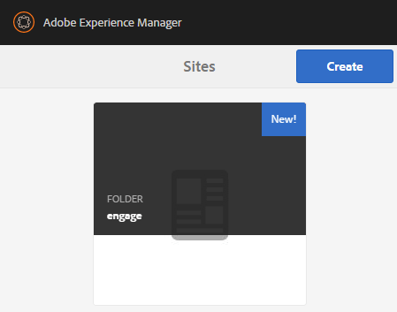
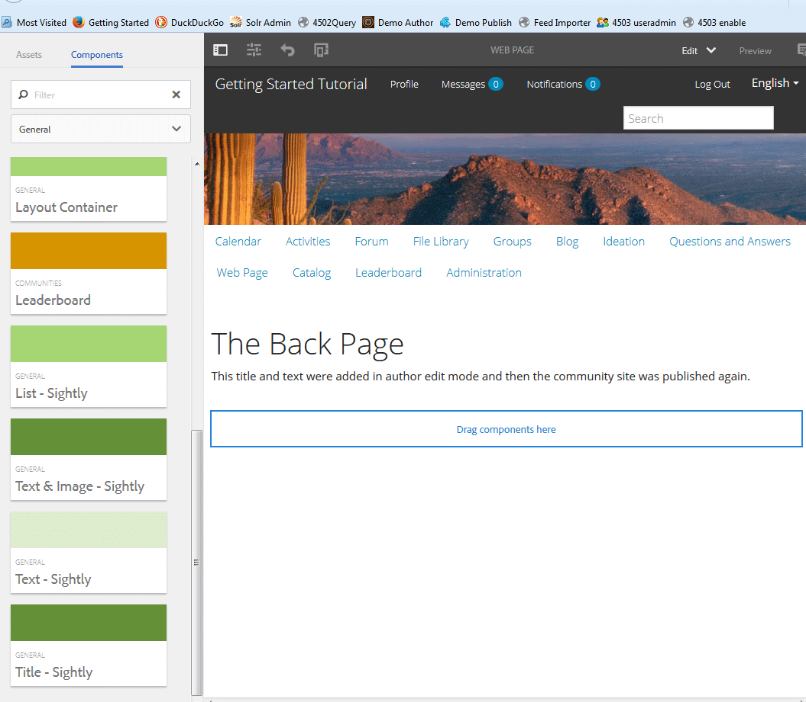

# Console Sites di Communities {#communities-sites-console}

La console Sites di Communities consente di accedere a:

* Creazione di siti
* Modifica del sito
* Gestione del sito
* [Creazione e modifica di gruppi nidificati](/help/communities/groups.md) (sub-comunità)

Vedi [Guida introduttiva ad AEM Communities](/help/communities/getting-started.md) per verificare la rapidità con cui è possibile creare un sito community nell’ambiente di authoring, nonché come creare gruppi di community dagli ambienti di authoring e pubblicazione.

>[!NOTE]
>
>I menu principali di Communities per la creazione di [siti della community](/help/communities/sites-console.md), [modelli di sito community](/help/communities/sites.md), [modelli di gruppo community](/help/communities/tools-groups.md) e [funzioni della community](/help/communities/functions.md) sono utilizzabili solo nell’ambiente di authoring.

## Prerequisiti {#prerequisites}

Prima di creare un sito community, è *obbligatorio* a:

* Assicurati che una o più istanze di pubblicazione siano in esecuzione.
* Abilita la [servizio tunnel](/help/communities/deploy-communities.md#tunnel-service-on-author) gestire membri e gruppi di membri.
* Identifica la [editore principale](/help/communities/deploy-communities.md#primary-publisher).
* [Configurare la replica](/help/communities/deploy-communities.md#replication-agents-on-author) quando la porta dell&#39;editore principale non è l&#39;impostazione predefinita (4503).

Per garantire che il sito sia pronto a supportare molte funzioni, è consigliabile adottare le seguenti misure:

* Installa il [pacchetto di funzionalità più recente](/help/communities/deploy-communities.md#latestfeaturepack).
* Abilita [Adobe Analytics](/help/communities/analytics.md) per AEM Communities.
* Configura [email](/help/communities/email.md)
* Identifica [Amministratori community](/help/communities/users.md#creating-community-members).
* [Abilita gestore OAuth](/help/communities/social-login.md#adobe-granite-oauth-authentication-handler) per accesso social.

## Accesso alla console Sites di Communities {#accessing-communities-sites-console}

Nell’ambiente di authoring, per accedere alla console Sites di Communities:

* Dalla navigazione globale: **[!UICONTROL Community]** > **[!UICONTROL Sites]**

Nella console Sites di Communities vengono visualizzati tutti i siti della community esistenti. Da questa console è possibile creare, modificare, gestire ed eliminare siti community.

Per creare un nuovo sito community, seleziona la **Crea** icona.

Per accedere a un sito community esistente, allo scopo di creare, modificare, pubblicare, esportare o aggiungere un gruppo nidificato, seleziona l’icona della cartella del sito.

Ad esempio, l’immagine seguente mostra la console Sites principale di Communities, che visualizza le cartelle per due siti della community : [abilita](/help/communities/getting-started-enablement.md) e [coinvolgere](/help/communities/getting-started.md):

## Creazione di siti {#site-creation}

La console di creazione del sito offre un approccio dettagliato per assemblare le funzioni del sito in base a una selezione [modello di sito community](/help/communities/sites.md) e le impostazioni.

Ogni sito creato include una funzione di accesso, in quanto ai visitatori del sito viene richiesto di effettuare l’accesso prima di poter pubblicare contenuto, inviare messaggi o partecipare a un gruppo. Altre funzioni incluse sono profili utente, messaggistica, notifiche, menu del sito, ricerca, temi e branding.

Il processo viene avviato selezionando la `Create` si trova nella parte superiore della console Sites di Communities.

Il processo di creazione è costituito da una serie di passaggi presentati come pannelli contenenti una serie di funzioni da configurare (presentate come pannelli secondari). È possibile passare al **Successivo** passo o **Indietro** al passaggio precedente prima di impegnare il sito nel passaggio finale.

### Passaggio 1 : Modello del sito {#step-site-template}

Nel pannello Modello del sito sono specificati Titolo, Descrizione, Directory principale del sito, Lingua di base, Nome e Modello del sito:

* **Titolo del sito community**

   Titolo da visualizzare per il sito.

   Il titolo viene visualizzato nel sito pubblicato e nell’interfaccia utente amministratore del sito.

* **Descrizione del sito community**

   Descrizione del sito.

   La descrizione non viene visualizzata sul sito pubblicato.

* **Radice sito community**

   Percorso principale del sito.

   La radice predefinita è `/content/sites`, ma la radice può essere spostata in qualsiasi posizione all’interno del sito web.

* **Lingua base del sito community**

   (Lasciare intatto per una sola lingua: Inglese) Utilizza il menu a discesa per sceglierne uno *o più* lingue di base delle lingue disponibili: tedesco, italiano, francese, giapponese, spagnolo, portoghese (Brasile), cinese (tradizionale) e cinese (semplificato). Verrà creato un sito community per ogni lingua aggiunta, che si troverà all’interno della stessa cartella del sito seguendo le best practice descritte in [Traduzione di contenuti per siti multilingue](/help/sites-administering/translation.md). La pagina principale di ciascun sito conterrà una pagina figlia denominata dal codice della lingua di una delle lingue selezionate, ad esempio &quot;en&quot; per l’inglese o &quot;fr&quot; per il francese.

* **Nome sito community**:

   Nome della pagina principale del sito che viene visualizzata nell&#39;URL.

   * Ricontrolla il nome in quanto non viene facilmente modificato dopo la creazione del sito.
   * L&#39;URL di base ( `https://server:port/site root/site name)` verranno visualizzati sotto la `Community Site Name`.

   * Per un URL valido, aggiungi un codice della lingua di base + &quot;.html&quot;

      *Esempio*, `https://localhost:4502/content/sites/mysight/en.html`

* **Modello del sito community** menu

   Utilizza il menu a discesa per scegliere una [modello di sito community](/help/communities/tools.md).

* Seleziona **Avanti**.

### Passaggio 2 : Progettazione {#step-design}

Il pannello Progettazione contiene 2 pannelli secondari per la selezione del tema e del banner di branding:

#### TEMA DEL SITO COMUNITARIO {#community-site-theme}

Il framework utilizza `Twitter Bootstrap` per fornire al sito un design dinamico e flessibile. È possibile selezionare uno dei molti temi di Bootstrap precaricati per personalizzare lo stile del modello di sito community selezionato oppure caricare un tema di Bootstrap.

Quando è selezionato, il tema viene sovrapposto con un segno di spunta blu opaco.

Dopo la pubblicazione del sito, è possibile [modificare le proprietà](#modifying-site-properties) e selezionare un tema diverso.

#### MARCATURA DEL SITO COMMUNITY {#community-site-branding}

Il branding del sito community è un’immagine visualizzata come intestazione nella parte superiore di ogni pagina.

Le dimensioni dell’immagine devono essere pari alla visualizzazione prevista della pagina nel browser e a 120 pixel in altezza.

Quando crei o selezioni un’immagine, tieni presente quanto segue:

* L’altezza dell’immagine viene ritagliata a 120 pixel misurati dal bordo superiore dell’immagine.
* L&#39;immagine viene fissata al bordo sinistro della finestra del browser.
* L&#39;immagine non viene ridimensionata, in modo tale che quando la larghezza dell&#39;immagine è...

   * Inferiore alla larghezza del browser, l&#39;immagine si ripeterà in orizzontale.
   * Maggiore della larghezza del browser, l&#39;immagine apparirà ritagliata.

* Seleziona **Avanti**.

### Passaggio 3 : Impostazioni {#step-settings}

Il pannello Impostazioni contiene diversi pannelli secondari che presentano funzioni da configurare prima di passare all’ultimo passaggio per creare il sito.

* [GESTIONE UTENTE](#user-management)
* [TAG](#tagging)
* [RUOLI](#roles)
* [MODERAZIONE](#moderation)
* [ANALYTICS](#analytics)
* [TRADUZIONE](#translation)
* [ABILITARE](#enablement)

>[!NOTE]
>
>**Attiva servizio tunnel**
>
>Diversi pannelli secondari Impostazioni consentono l’assegnazione di un membro fidato per moderare UGC, gestire gruppi o essere contatti per le risorse di abilitazione nell’ambiente di pubblicazione.
>
>La convenzione è pubblicata [utenti e gruppi di utenti](/help/communities/users.md) (membri e gruppi di membri) da non duplicare nell’ambiente di authoring.
>
>Pertanto, quando crei il sito community nell’ambiente di authoring e assegni membri affidabili a vari ruoli, è necessario recuperare i dati dei membri dall’ambiente di pubblicazione.
>
>Questa operazione viene eseguita abilitando il ` [AEM Communities Publish Tunnel Service](/help/communities/deploy-communities.md#tunnel-service-on-author)` per l’ambiente di authoring.

#### GESTIONE UTENTE {#user-management}

>[!NOTE]
>
>Si consiglia di: [attivazione di siti comunitari](/help/communities/overview.md#enablement-community) essere privato (per ulteriori informazioni, contattare il rappresentante commerciale di riferimento).
>
>Un sito community è privato quando ai visitatori anonimi viene negato l’accesso, non può registrarsi autonomamente e non può utilizzare l’accesso social.

* **Consenti registrazione utente**

   Se questa opzione è selezionata, i visitatori del sito possono diventare membri della community mediante registrazione automatica.
Se questa opzione è deselezionata, il sito della community è *limitato* e i visitatori del sito devono essere assegnati al gruppo di membri del sito community, devono effettuare una richiesta o essere inviati tramite e-mail un invito. Se questa opzione è deselezionata, l’accesso anonimo non deve essere consentito.
Deseleziona un *privato* sito della community. Il valore predefinito è selezionato.

* **Consenti accesso anonimo**

   Se questa opzione è selezionata, il sito della community è *open *e qualsiasi visitatore del sito può accedere al sito.
Se questa opzione è deselezionata, solo i membri che hanno effettuato l’accesso possono accedere al sito.
Deseleziona un sito *privato *community. Il valore predefinito è selezionato.

* **Consenti messaggi**

   Se questa opzione è selezionata, i membri possono inviare messaggi tra loro e al gruppo all&#39;interno del sito della community.
Se questa opzione è deselezionata, la messaggistica non è impostata per la community.
Il valore predefinito è deselezionato.

* **Consenti accesso social network: Facebook**

   Se questa opzione è selezionata, consenti ai visitatori del sito di accedere con le credenziali del loro account Facebook. Il [Configurazione cloud facebook](/help/communities/social-login.md#create-a-facebook-connect-cloud-service) deve essere configurato per aggiungere utenti al gruppo di membri del sito community una volta creato il sito community.
Se questa opzione è deselezionata, non viene presentato alcun accesso a Facebook.
Lascia deselezionata una *privato* sito della community. Il valore predefinito è deselezionato.

* **Consenti accesso social network: Twitter**

   Se questa opzione è selezionata, consenti ai visitatori del sito di accedere con le credenziali del loro account Twitter. Il [Configurazione cloud twitter](/help/communities/social-login.md#create-a-twitter-connect-cloud-service) deve essere configurato per aggiungere utenti al gruppo di membri del sito community una volta creato il sito community.
Se questa opzione è deselezionata, non viene presentato alcun accesso a Twitter.
Lascia deselezionata una *privato* sito della community. Il valore predefinito è deselezionato.

>[!NOTE]
>
>**Consentire gli accessi social**
>
>Anche se le configurazioni Facebook e Twitter di esempio possono esistere e essere selezionabili, per [ambiente di produzione](/help/sites-administering/production-ready.md), è necessario creare applicazioni Facebook e Twitter personalizzate. Vedi [Accesso social con Facebook e Twitter](/help/communities/social-login.md).

#### TAG {#tagging}

I tag che possono essere applicati al contenuto della community vengono controllati selezionando i namespace definiti in precedenza tramite [Console assegnazione tag](/help/sites-administering/tags.md#tagging-console).

Inoltre, la selezione dei namespace dei tag per il sito community limita la selezione presentata durante la definizione di cataloghi e risorse. Vedi [Risorse di abilitazione assegnazione tag](/help/communities/tag-resources.md) per informazioni importanti.

* casella di ricerca testo : Inizia a digitare per identificare i tag consentiti nel sito.

#### RUOLI {#roles}

La [ruoli dei membri della comunità](/help/communities/users.md) sono assegnate con queste impostazioni.

La ricerca di membri della community è semplice tramite la ricerca tipo-avanti.

* **Manager community**

   Inizia a digitare per selezionare uno o più membri della community o gruppi di membri che possono gestire membri della community e gruppi di membri.

* **Moderatori community**

   Inizia a digitare per selezionare uno o più membri della community o gruppi di membri di cui si deve fare affidamento come moderatori di contenuti generati dall’utente.

* **Membri community con privilegi**

   Inizia a digitare per selezionare uno o più membri della community o gruppi di membri ai quali assegnare la possibilità di creare nuovi contenuti quando `Allow Privileged Member` è stato selezionato per un [funzione comunitaria](/help/communities/functions.md).

* **Amministratori community**

   Inizia a digitare per selezionare uno o più amministratori del sito che possono gestire la struttura del sito indipendentemente da altri amministratori del sito e da un amministratore community predefinito. Possono creare un gruppo a qualsiasi livello della gerarchia e diventare l’amministratore predefinito dei gruppi nidificati (ma possono essere successivamente rimossi dal ruolo di amministratore dei gruppi nidificati).

#### MODERAZIONE {#moderation}

L’impostazione globale per la moderazione del contenuto generato dall’utente (UGC) è controllata da queste impostazioni. I singoli componenti dispongono di impostazioni aggiuntive per controllare la moderazione.

* **Il contenuto è premoderato**

   Se questa opzione è selezionata, il contenuto della community pubblicato non verrà visualizzato fino all&#39;approvazione da parte di un moderatore. Il valore predefinito è deselezionato. Per ulteriori informazioni, consulta [Moderazione dei contenuti della community](/help/communities/moderate-ugc.md#premoderation).

* **Soglia di segnalazione prima che il contenuto venga nascosto**

   Se è maggiore di 0, il numero di volte in cui un argomento o un post deve essere contrassegnato prima che venga nascosto dalla visualizzazione pubblica. Se è impostato su -1, l&#39;argomento o il post contrassegnati non viene mai nascosto dalla visualizzazione pubblica. Il valore predefinito è 5.

#### ANALYTICS {#analytics}

* **Abilita Analytics**

   Disponibile solo quando Adobe Analytics è stato [configurato](/help/communities/analytics.md) per le funzioni di Communities.
Il valore predefinito è deselezionato. Quando questa opzione è selezionata, viene visualizzato un menu di selezione aggiuntivo:

* **Riferimento framework configurazione Cloud**

   Dal menu a discesa, seleziona il framework del servizio cloud di Analytics configurato per questo sito community.
   `Communities` è l&#39;esempio del framework da [Funzionalità di configurazione di Analytics for Communities](/help/communities/analytics.md#aem-analytics-framework-configuration) documentazione.

#### TRADUZIONE {#translation}

* **Consenti traduzione automatica**

   Quando questa opzione è selezionata (l’impostazione predefinita è deselezionata), la traduzione automatica è abilitata per l’utilizzo in modalità UGC all’interno del sito. Questo non influisce su altri contenuti, come il contenuto della pagina, anche se il sito è configurato come sito multilingue. Vedi [Traduzione di contenuti generati dagli utenti](/help/communities/translate-ugc.md) per informazioni sulla configurazione di un servizio di traduzione concesso in licenza per AEM Communities. Vedi [Traduzione di contenuti per siti multilingue](/help/sites-administering/translation.md) per una panoramica completa.

* **Attiva traduzione automatica per le lingue selezionate**

   Le lingue abilitate per la traduzione automatica sono predefinite per l&#39;impostazione di sistema specificata dalla [configurazione dell’integrazione di traduzione](/help/communities/translate-ugc.md#translation-integration-configuration). Queste impostazioni predefinite possono essere sostituite per questo sito eliminando le impostazioni predefinite e/o selezionando altre lingue dal menu a discesa.

* **Scegli il provider di traduzione**

   Per impostazione predefinita, il provider di servizi è un servizio di prova che utilizza `microsoft` solo a scopo dimostrativo. Se nessun fornitore di servizi di traduzione è autorizzato, **Consenti traduzione automatica** deve essere deselezionato.

* **Scegli store condiviso globale**

   Per un sito web con più copie in lingua, un archivio condiviso globale fornisce un singolo thread di conversazione, visibile da ogni copia in lingua. Questo si ottiene selezionando una delle lingue incluse come copia per lingua. Il valore predefinito è *Nessun archivio condiviso globale*.

* **Scegli la configurazione del provider di traduzione**

   Scegli un [framework di integrazione della traduzione](/help/sites-administering/tc-tic.md) creato per il provider di traduzione con licenza.

* **Seleziona le opzioni di traduzione per il sito community**

   * **Traduci tutta la pagina**

      Se selezionato, tutti gli UGC di una pagina vengono tradotti nella lingua di base della pagina.

      Il valore predefinito è *non selezionato*.

   * **Traduci solo la selezione**

      Se selezionata, accanto a ciascun post viene visualizzata un’opzione di traduzione che consente di tradurre i singoli post nella lingua di base della pagina.
Il valore predefinito è *selezionato*.

* **Seleziona le opzioni di persistenza**

   * **Traduci i contributi su richiesta dell’utente e persisti in seguito**
Se selezionato, il contenuto non viene tradotto fino a quando non viene effettuata una richiesta. Una volta tradotta, la traduzione viene memorizzata nell&#39;archivio.

      Il valore predefinito è *non selezionato*.

   * **Non mantenere le traduzioni**

      Se selezionata, le traduzioni non vengono memorizzate nell&#39;archivio.

      Se non è selezionata, le traduzioni vengono mantenute.

      Il valore predefinito è *non selezionato*.

* **Rendering avanzato**

   Seleziona una delle seguenti opzioni:

   * `Always show contributions in the original language` (impostazione predefinita)
   * `Always show contributions in user preferred language`
   * `Show contributions in user preferred language for only logged-in users`

#### ABILITARE {#enablement}

La `ENABLEMENT`le impostazioni sono applicabili quando il modello di sito community scelto include [funzione di assegnazione](/help/communities/functions.md#assignments-function), disponibile quando le funzioni di abilitazione sono concesse in licenza e [configurato](/help/communities/enablement.md). Il modello di sito di riferimento che include la funzione assegnazioni è `Reference Structured Learning Site Template.`

* **Manager di abilitazione**
(Obbligatorio) Solo membri del gruppo `Community Enablementmanagers` sono disponibili per la gestione di questa community di abilitazione. I responsabili dell&#39;abilitazione sono responsabili dell&#39;assegnazione dei membri alle risorse. Vedi anche [Gestione di utenti e gruppi di utenti](/help/communities/users.md).

* **ID organizzazione Marketing Cloud**

   (facoltativo) L&#39;ID di un [Video Heartbeat Analytics](/help/communities/analytics.md#video-heartbeat-analytics) licenza.

* Seleziona **Avanti**.

### Passaggio 4 : Crea sito community {#step-create-communities-site}

Se sono necessarie delle regolazioni, utilizza **Indietro** per farli.

Una volta **Crea** viene selezionato e avviato, il processo di creazione del sito non può essere interrotto.

Una volta creato il sito:

* La modifica dell’url (nome del nodo) non è supportata.
* Le future modifiche al modello di sito community non influiranno sul sito community creato.
* La disattivazione del modello di sito community non influisce sul sito community creato.
* È possibile modificare il [STRUTTURA](#modify-structure) di un sito community modificando le relative proprietà.

Al termine del processo, la cartella per il nuovo sito viene visualizzata nella console Sites di Communities, da cui gli autori possono aggiungere contenuti di pagina o gli amministratori possono modificare le proprietà del sito.

Per modificare un sito community, seleziona la relativa cartella di progetto per aprirlo:

Quando si passa il mouse su un sito o si tocca una scheda del sito, vengono visualizzate icone che consentono [modifica del sito in modalità di authoring](#authoring-site-content), [apertura delle proprietà del sito per la modifica](#modifying-site-properties), [pubblicazione del sito](#publishing-the-site), [esportazione del sito](#exporting-the-site)e [eliminazione del sito](#deleting-the-site).

## Creazione di contenuti del sito {#authoring-site-content}

Il contenuto di un sito può essere creato con gli stessi strumenti di qualsiasi altro sito web AEM. Per aprire il sito per l’authoring, seleziona la `Open Site` icona visualizzata quando si passa il mouse sul sito. Il sito verrà aperto in una nuova scheda in modo che la console Sites di Communities rimanga accessibile.

>[!NOTE]
>
>Se non hai familiarità con AEM, consulta la documentazione su [trattamento di base](/help/sites-authoring/basic-handling.md) e [guida rapida all’authoring delle pagine](/help/sites-authoring/qg-page-authoring.md).

## Modifica delle proprietà del sito {#modifying-site-properties}

Le proprietà di un sito esistente, specificate durante il processo di creazione del sito, possono essere modificate selezionando la `Edit Site`icona visualizzata quando si passa il mouse sul sito.

`Details of the following properties match the descriptions provided in the` [Creazione di siti](#site-creation) sezione .

### Modifica base {#modify-basic}

Il pannello BASIC consente di modificare:

* Titolo del sito community
* Descrizione del sito community

Impossibile modificare il nome del sito community.

La scelta di un diverso modello di sito community non avrebbe alcun impatto su un sito community esistente, in quanto non rimane alcuna connessione tra modelli e siti.

Invece, [STRUTTURA](#modify-structure) del sito comunitario può essere modificato.

### Modifica struttura {#modify-structure}

Il pannello STRUTTURA consente di modificare la struttura inizialmente creata dal modello di sito community selezionato. Dal pannello è possibile:

* Trascina e rilascia altri [funzioni della community](/help/communities/functions.md) nella struttura del sito.
* In un&#39;istanza di una funzione comunitaria nella struttura del sito:

   * **`gear icon`**

      Modifica le impostazioni, inclusi il titolo della visualizzazione e il nome dell’URL*, nonché [gruppi di membri privilegiati](/help/communities/users.md#privilegedmembersgroups).

   * **`trashcan icon`**

      Rimuovere (eliminare) le funzioni dalla struttura del sito.

   * **`grid icon`**

      Modifica l’ordine delle funzioni come visualizzate nella barra di navigazione di livello superiore del sito.

>[!NOTE]
>
>È possibile modificare l&#39;ordine di tutte le funzioni nella struttura del sito, ad eccezione della funzione nella parte superiore. Pertanto, la home page del sito community non può essere modificata.

>[!CAUTION]
>
>* Anche se il titolo visualizzato può essere modificato senza effetti collaterali, si sconsiglia di modificare il nome URL di una funzione community appartenente a un sito community.
>
>Ad esempio, la ridenominazione dell’URL non comporterà lo spostamento dell’UGC esistente, con l’effetto di perdere l’UGC.

>[!CAUTION]
>
>La funzione gruppi deve *not* essere *primo né unico* nella struttura del sito.
>
>Qualsiasi altra funzione, ad esempio [funzione pagina](/help/communities/functions.md#page-function), deve essere incluso ed elencato per primo.

#### Esempio : Aggiunta di una funzione di catalogo a una struttura del sito della community {#example-adding-a-catalog-function-to-a-community-site-structure}

### Modifica progettazione {#modify-design}

Il pannello PROGETTAZIONE consente di applicare un nuovo tema:

* [Tema per sito community](#community-site-theme)
* [Marchio per sito community](#community-site-branding)

   * Scorri fino alla parte inferiore del pannello per modificare l’immagine del marchio.

### Modifica impostazioni {#modify-settings}

Il pannello IMPOSTAZIONI consente di accedere alla maggior parte delle impostazioni sotto i pannelli secondari di per il passaggio 3 della creazione di siti community:

* [Gestione utente](#user-management)
* [Tag](#tagging)
* [Moderazione](#moderation)
* [Ruoli dei membri](#roles)
* [Analytics](#analytics)
* [Traduzione](#translation)

### Modifica miniatura {#modify-thumbnail}

Il pannello THUMBNAIL consente di caricare un’immagine per rappresentare il sito nella console Sites di Communities.

### Modifica abilitazione {#modify-enablement}

Il pannello ENABLEMENT consente di accedere alle impostazioni fornite durante la creazione del sito community.

Consulta la sezione [ABILITARE](#enablement) descrizione.

## Pubblicazione del sito {#publishing-the-site}

Una volta creato o modificato un sito community, è possibile pubblicarlo (attivarlo) selezionando la `Publish Site` , visualizzata al passaggio del mouse sul sito.

Dopo la corretta pubblicazione del sito verrà visualizzata un’indicazione.

### Pubblicazione con gruppi nidificati {#publishing-with-nested-groups}

Dopo aver pubblicato un sito della community, è necessario pubblicare singolarmente ogni sottocomunità (gruppo nidificato) creata utilizzando [Console Gruppi](/help/communities/groups.md).

## Esportazione del sito {#exporting-the-site}

Seleziona l&#39;icona di esportazione, al passaggio del mouse sul sito, per creare un pacchetto del sito community che sia memorizzato in [gestore di pacchetti](/help/sites-administering/package-manager.md) e scaricato.

UGC non è incluso nel pacchetto del sito.

## Eliminazione del sito {#deleting-the-site}

Per eliminare il sito community, seleziona l’icona Elimina sito visualizzata quando si passa il mouse sul sito nella console Sito di Communities. Questa azione rimuove tutti gli elementi associati al sito, come UGC, gruppi di utenti, risorse e record di database.

## Gruppi di utenti della community creata {#created-community-user-groups}

Una volta pubblicato il nuovo sito della community, i nuovi gruppi di membri (i gruppi di utenti vengono creati nell&#39;ambiente di pubblicazione) che dispongono delle autorizzazioni appropriate impostate per vari ruoli amministrativi e membri.

Il nome creato per i gruppi di membri include *nome del sito* data la sede in [Passaggio 1](#step13asitetemplate) (il nome visualizzato nell&#39;URL) e un ID univoco per evitare conflitti con siti e gruppi della community con lo stesso nome del sito per diverse radici del sito della community.

Ad esempio, se il nome fosse &quot;coinvolgente&quot; per un sito intitolato &quot;Esercitazione introduttiva&quot;, il gruppo di utenti per i moderatori sarebbe:

* titolo: Moderatori di coinvolgimento della community
* nome: comunità&#x200B;*interazione-uid*-moderatori

Tutti i membri assegnati ruoli come moderatori o amministratori di gruppo durante la creazione del sito, verranno assegnati al gruppo appropriato e al gruppo di membri. Questi gruppi e assegnazioni di membri vengono creati al momento della pubblicazione del nuovo sito.

Per maggiori dettagli, vedi [Gestione di utenti e gruppi di utenti](/help/communities/users.md).

>[!NOTE]
>
>Se [Consenti accesso social: Facebook](#user-management) viene attivato una volta che il gruppo di utenti
>
>* `community-<site-name>-<uid>-members`
>
>viene creato, viene applicato il [Servizio cloud facebook](/help/communities/social-login.md#createafacebookcloudservice) deve essere configurato per aggiungere utenti a questo gruppo.

## Configurazione per errore di autenticazione {#configure-for-authentication-error}

Per impostazione predefinita, un sito della community effettua il reindirizzamento a una pagina di accesso di esempio quando l’utente immette le credenziali errate e non riesce ad accedere. Questo accesso di esempio non sarà presente in un [server di produzione](/help/sites-administering/production-ready.md).

Per reindirizzare correttamente, dopo che un sito è stato configurato e inviato per la pubblicazione, completa questi passaggi per ottenere l’errore di autenticazione durante il reindirizzamento al sito della community:

* Su ogni istanza di pubblicazione AEM.
* Accedi con privilegi di amministratore.
* Accedere al [Console web](/help/sites-deploying/configuring-osgi.md).

   * Ad esempio: [https://localhost:4503/system/console/configMgr](https://localhost:4503/system/console/configMgr).

* Individua `Adobe Granite Login Selector Authentication Handler`.
* Seleziona la `pencil` per aprire la configurazione per la modifica.
* Inserisci un **Mappature pagina di accesso** come segue:

   `/content/sites/<site-name>/path/to/login/page:/content/sites/<site-name>`

   Esempio:
   `/content/sites/engage/en/signin:/content/sites/engage/en`

* Seleziona **Salva**.

### Reindirizzamento dell&#39;autenticazione del test {#test-authentication-redirection}

Nella stessa istanza di pubblicazione AEM configurata con una mappatura pagina di accesso per il sito della community:

* Passa alla home page del sito community.

   * Ad esempio: [https://localhost:4503/content/sites/engage/en.html](https://localhost:4503/content/sites/engage/en.html)

* Selezionare Esci.
* Selezionare Accesso.
* Immetti credenziali ovviamente errate, come il nome utente &quot;x&quot; e la password &quot;x&quot;.
* La pagina di accesso deve essere visualizzata con un errore &quot;login non valido&quot;.

## Accesso ai siti della community dalla console Siti principali {#accessing-community-sites-from-main-sites-console}

Dalla console di navigazione globale Sites , i siti della community si trovano nella sezione `Community Sites` cartella.

Sebbene sia possibile accedere in questo modo a un sito della community, per attività amministrative, il sito della community è accessibile dalla console Sites di Communities.

