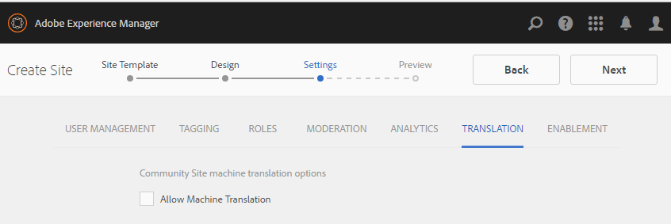

# Console Siti community {#communities-sites-console}

La console Siti community consente di accedere a:

* Creazione del sito
* Modifica del sito
* Gestione del sito
* [Creazione e modifica di gruppi](/help/communities/groups.md) nidificati (sottocomunità)

Consultate [Guida introduttiva  AEM Communities](/help/communities/getting-started.md) per verificare la rapidità con cui è possibile creare un sito community nell’ambiente di authoring, nonché come creare gruppi di community dagli ambienti di creazione e pubblicazione.

>[!NOTE]
>
>I principali menu Community per la creazione di siti community, modelli [di siti](/help/communities/sites.md)community, modelli [di gruppi](/help/communities/tools-groups.md) community e funzioni  community sono utilizzabili solo nell&#39;ambiente di authoring.

## Prerequisiti {#prerequisites}

Prima di creare un sito community, è *necessario* :

* Verificate che siano in esecuzione una o più istanze di pubblicazione.
* Abilitare il servizio  tunnel per gestire membri e gruppi di membri.
* Identificare l&#39;editore [principale](/help/communities/deploy-communities.md#primary-publisher).
* [Configurare la replica](/help/communities/deploy-communities.md#replication-agents-on-author) quando la porta dell&#39;editore principale non è l&#39;impostazione predefinita (4503).

Per garantire che il sito sia pronto a supportare molte funzioni, è consigliabile adottare le seguenti misure:

* Installate il pacchetto [di funzioni](/help/communities/deploy-communities.md#latestfeaturepack)più recente.
* Abilita [Adobe Analytics](/help/communities/analytics.md) per  AEM Communities.
* Configura [e-mail](/help/communities/email.md)
* Identificare gli amministratori [della](/help/communities/users.md#creating-community-members)community.
* [Abilita il gestore](/help/communities/social-login.md#adobe-granite-oauth-authentication-handler) OAuth per l&#39;accesso tramite social network.

## Accesso alla console Siti di Communities {#accessing-communities-sites-console}

Nell’ambiente di authoring, per accedere alla console Siti community:

* Dalla navigazione globale: **[!UICONTROL Community]** > **[!UICONTROL Siti]**

Nella console Siti community sono visualizzati tutti i siti community esistenti. Da questa console è possibile creare, modificare, gestire ed eliminare siti della community.

Per creare un nuovo sito community, selezionate l&#39;icona **Crea** .

Per accedere a un sito community esistente, allo scopo di creare, modificare, pubblicare, esportare o aggiungere un gruppo nidificato, selezionate l&#39;icona della cartella del sito.

Ad esempio, l&#39;immagine seguente mostra la console Siti community principale, che mostra le cartelle per due siti della community: [abilitare](/help/communities/getting-started-enablement.md) e [coinvolgere](/help/communities/getting-started.md):

## Creazione del sito {#site-creation}

La console per la creazione di siti offre un approccio passo passo per assemblare le funzioni del sito in base a un modello [e alle impostazioni di sito](/help/communities/sites.md) community selezionate.

Ogni sito creato include una funzione di login in quanto i visitatori del sito devono effettuare l’accesso prima di poter pubblicare contenuto, inviare messaggi o partecipare a un gruppo. Altre funzioni incluse sono profili utente, messaggi, notifiche, menu del sito, ricerca, temi e personalizzazione.

Il processo viene avviato selezionando il `Create` pulsante situato nella parte superiore della console Siti community.

Il processo di creazione è costituito da una serie di passaggi presentati come pannelli contenenti una serie di funzioni da configurare (presentate come sottopannelli). È possibile passare al passaggio **Successivo** o **Indietro** al passaggio precedente prima di eseguire il commit del sito nel passaggio finale.

### Passaggio 1: Modello del sito {#step-site-template}

Nel pannello Modello del sito sono specificati il Titolo, la Descrizione, la Radice del sito, la Lingua di base, il Nome e il Modello del sito:

* **Titolo del sito community**

   Titolo visualizzato per il sito.

   Il titolo viene visualizzato sia nel sito pubblicato che nell’interfaccia utente di amministrazione del sito.

* **Descrizione del sito community**

   Una descrizione del sito.

   La descrizione non viene visualizzata sul sito pubblicato.

* **Radice sito community**

   Percorso principale del sito.

   L&#39;elemento principale predefinito è `/content/sites`, ma l&#39;elemento principale può essere spostato in qualsiasi posizione all&#39;interno del sito Web.

* **Lingua base del sito community**

   (Non toccare per una sola lingua: Inglese) Utilizzate il menu a discesa per scegliere una *o più* lingue di base dalle lingue disponibili: tedesco, italiano, francese, giapponese, spagnolo, portoghese (Brasile), cinese (tradizionale) e cinese (semplificato). Verrà creato un sito community per ogni lingua aggiunta, all&#39;interno della stessa cartella del sito seguendo la procedura descritta in [Traduzione di contenuti per siti](/help/sites-administering/translation.md)multilingue. La pagina principale di ciascun sito conterrà una pagina figlia denominata dal codice della lingua di una delle lingue selezionate, ad esempio &#39;en&#39; per l&#39;inglese o &#39;fr&#39; per il francese.

* **Nome sito community**:

   Nome della pagina principale del sito che viene visualizzata nell’URL.

   * Controllate il nome perché non può essere facilmente modificato dopo la creazione del sito.
   * L&#39;URL di base ( `https://server:port/site root/site name)` verrà visualizzato sotto il `Community Site Name`.

   * Per un URL valido, aggiungete un codice della lingua di base + &quot;.html&quot;

      *Esempio*, `https://localhost:4502/content/sites/mysight/en.html`

* **Menu Modello** sito community

   Utilizzate il menu a discesa per scegliere un modello [di sito](/help/communities/tools.md)community disponibile.

* Seleziona **Avanti**.

### Passaggio 2: Progettazione {#step-design}

Il pannello Progettazione contiene 2 pannelli secondari per selezionare il tema e il banner di branding:

#### COMMUNITY SITE THEME {#community-site-theme}

Il framework utilizza l’Bootstrap  Twitter per fornire al sito un design reattivo e flessibile. È possibile selezionare uno dei numerosi temi di Bootstrap precaricati per definire lo stile del modello di sito community selezionato oppure caricare un tema di Bootstrap.

Quando è selezionato, il tema verrà sovrapposto con un segno di spunta blu opaco.

Dopo la pubblicazione del sito community, è possibile [modificare le proprietà](#modifying-site-properties) e selezionare un tema diverso.

#### COMMUNITY SITE BRANDING {#community-site-branding}

Il marchio Community del sito è un&#39;immagine visualizzata come intestazione nella parte superiore di ogni pagina.

Le dimensioni dell’immagine devono corrispondere alla larghezza prevista per la visualizzazione della pagina nel browser e a 120 pixel in altezza.

Quando create o selezionate un’immagine, tenete presente:

* L’altezza dell’immagine viene ritagliata a 120 pixel dal bordo superiore dell’immagine.
* L&#39;immagine viene bloccata sul bordo sinistro della finestra del browser.
* L&#39;immagine non viene ridimensionata, pertanto quando la larghezza dell&#39;immagine è impostata su ...

   * Con una larghezza inferiore a quella del browser, l&#39;immagine viene ripetuta in orizzontale.
   * Maggiore della larghezza del browser, l&#39;immagine apparentemente verrà ritagliata.

* Seleziona **Avanti**.

### Passaggio 3: Impostazioni {#step-settings}

Il pannello Impostazioni contiene diversi pannelli secondari che presentano le funzioni da configurare prima di passare all’ultimo passaggio per la creazione del sito.

* [GESTIONE UTENTE](#user-management)
* [TAG](#tagging)
* [RUOLI](#roles)
* [MODERAZIONE](#moderation)
* [ANALYTICS](#analytics)
* [TRADUZIONE](#translation)
* [ABILITAZIONE](#enablement)

>[!NOTE]
>
>**Abilita servizio tunnel**
>
>Diversi pannelli secondari di Impostazioni consentono l’assegnazione di un membro affidabile per moderare l’UGC, gestire i gruppi o essere contatti per le risorse di abilitazione nell’ambiente di pubblicazione.
>
>La convenzione prevede che [gli utenti e i gruppi](/help/communities/users.md) di utenti lato pubblicazione (membri e gruppi di membri) non vengano duplicati nell’ambiente di authoring.
>
>Pertanto, quando create il sito community nell&#39;ambiente di creazione e assegnate membri attendibili a vari ruoli, è necessario recuperare i dati dei membri dall&#39;ambiente di pubblicazione.
>
>A questo scopo, è possibile attivare l’ambiente ` [AEM Communities Publish Tunnel Service](/help/communities/deploy-communities.md#tunnel-service-on-author)` di authoring.

#### USER MANAGEMENT {#user-management}

>[!NOTE]
>
>Si consiglia di [abilitare i siti](/help/communities/overview.md#enablement-community) della community privati (per ulteriori informazioni, contattare il rappresentante commerciale di riferimento).
>
>Un sito community è privato quando ai visitatori anonimi viene negato l&#39;accesso, non può registrarsi autonomamente e non può utilizzare il login mediante social network.

* **Consenti registrazione utente**

   Se questa opzione è attivata, i visitatori del sito possono diventare membri della community mediante autoregistrazione.
Se questa opzione è deselezionata, il sito della community è *limitato* e i visitatori del sito devono essere assegnati al gruppo di membri della community, effettuare una richiesta o ricevere un invito tramite e-mail. Se questa opzione è deselezionata, non è consentito l&#39;accesso anonimo.
Deselezionate il sito di una community *privata* . Il valore predefinito è selezionato.

* **Consenti accesso anonimo**

   Se selezionato, il sito della community è *open *e qualsiasi visitatore del sito può accedere al sito.
Se questa opzione è deselezionata, solo i membri che hanno effettuato l’accesso possono accedere al sito.
Deselezionare un *sito community privato. Il valore predefinito è selezionato.

* **Consenti messaggi**

   Se selezionato, i membri possono inviare messaggi tra loro e al gruppo all&#39;interno del sito della community.
Se questa opzione è deselezionata, la messaggistica non viene configurata per la community.
Il valore predefinito è deselezionato.

* **Consenti accesso social network: Facebook**

   Se questa opzione è selezionata, consentite ai visitatori del sito di accedere con le credenziali del loro account Facebook. La configurazione [cloud](/help/communities/social-login.md#create-a-facebook-connect-cloud-service) Facebook selezionata deve essere configurata per aggiungere utenti al gruppo di membri del sito community una volta creato il sito community.
Se questa opzione è deselezionata, non viene presentato alcun login di Facebook.
Lasciate deselezionato un sito community *privato* . Il valore predefinito è deselezionato.

* **Consenti accesso social network: Twitter**

   Se questa opzione è selezionata, consentite ai visitatori del sito di accedere con le credenziali del loro account Twitter. La configurazione [cloud](/help/communities/social-login.md#create-a-twitter-connect-cloud-service) Twitter selezionata dovrebbe essere configurata per aggiungere utenti al gruppo di membri del sito community una volta creato il sito community.
Se questa opzione è deselezionata, non viene presentato alcun login a Twitter.
Lasciate deselezionato un sito community *privato* . Il valore predefinito è deselezionato.

>[!NOTE]
>
>**Consentire accessi tramite social network**
>
>Anche se le configurazioni Facebook e Twitter di esempio possono esistere e essere selezionabili, per un ambiente [di](/help/sites-administering/production-ready.md)produzione è necessario creare applicazioni Facebook e Twitter personalizzate. Consultate Accesso [social network con Facebook e Twitter](/help/communities/social-login.md).

#### TAGGING {#tagging}

I tag che possono essere applicati al contenuto della community sono controllati selezionando Spazi dei nomi dei tag definiti in precedenza tramite la console Tagging.

Inoltre, se si selezionano gli spazi dei nomi dei tag per il sito community, la selezione viene limitata quando si definiscono cataloghi e risorse. Per informazioni importanti, consulta [Assegnazione di tag alle risorse](/help/communities/tag-resources.md) di abilitazione.

* casella di ricerca testo : Iniziate a digitare per identificare i tag consentiti nel sito.

#### ROLES {#roles}

I [ruoli dei membri](/help/communities/users.md) della community sono assegnati a queste impostazioni.

La ricerca di membri della community è semplice grazie alla funzione di ricerca del tipo.

* **Manager community**

   Inizia a digitare per selezionare uno o più membri della community o gruppi di membri che possono gestire membri e gruppi di membri della community.

* **Moderatori community**

   Iniziate a digitare per selezionare uno o più membri della community o gruppi di membri da considerare affidabili come moderatori di contenuto generato dall&#39;utente.

* **Membri community con privilegi**

   Inizia a digitare per selezionare uno o più membri della community o gruppi di membri ai quali assegnare la possibilità di creare nuovi contenuti quando `Allow Privileged Member` è stato selezionato per una funzione community.

* **Amministratori community**

   Iniziate a digitare per selezionare uno o più amministratori del sito che possono gestire la struttura del sito indipendentemente da altri amministratori del sito e amministratori di community predefiniti. Possono creare un gruppo a qualsiasi livello della gerarchia e diventare l’amministratore predefinito dei gruppi nidificati (ma in seguito possono essere rimossi dal ruolo di amministratore dei gruppi nidificati).

#### MODERATION {#moderation}

L&#39;impostazione globale per la moderazione del contenuto generato dall&#39;utente (UGC) è controllata da queste impostazioni. I singoli componenti dispongono di impostazioni aggiuntive per controllare la moderazione.

* **Il contenuto è premoderato**

   Se questa opzione è attivata, il contenuto della community pubblicato non verrà visualizzato fino all&#39;approvazione di un moderatore. Il valore predefinito è deselezionato. Per ulteriori informazioni, consultate [Moderazione del contenuto](/help/communities/moderate-ugc.md#premoderation)della community.

* **Soglia di segnalazione prima che il contenuto venga nascosto**

   Se è maggiore di 0, il numero di volte in cui un topic o un post deve essere contrassegnato prima che venga nascosto dalla visualizzazione pubblica. Se impostato su -1, l&#39;argomento o il post contrassegnati non viene mai nascosto dalla visualizzazione pubblica. Il valore predefinito è 5.

#### ANALYTICS {#analytics}

* **Abilita Analytics**

   Disponibile solo se  Adobe Analytics è stato [configurato](/help/communities/analytics.md) per le funzioni Community.
Il valore predefinito è deselezionato. Quando questa opzione è selezionata, viene visualizzato un menu di selezione aggiuntivo:

* **Riferimento framework configurazione Cloud**

   Dal menu a discesa, seleziona il framework del servizio cloud di Analytics configurato per questo sito community.
   `Communities` è l&#39;esempio del framework fornito dalla documentazione di [Analytics Configuration for Communities Features](/help/communities/analytics.md#aem-analytics-framework-configuration) .

#### TRANSLATION {#translation}

* **Consenti traduzione automatica**

   Se questa opzione è selezionata (il valore predefinito è deselezionato), la traduzione automatica è abilitata per l&#39;UGC all&#39;interno del sito. Ciò non influisce su altri contenuti, come il contenuto della pagina, anche se il sito è configurato come sito multilingue. Consultate [Traduzione di contenuto](/help/communities/translate-ugc.md) generato dall&#39;utente per informazioni sulla configurazione di un servizio di traduzione con licenza per  AEM Communities. Consultate [Traduzione di contenuti per siti](/help/sites-administering/translation.md) multilingue per una panoramica completa.

* **Attiva traduzione automatica per le lingue selezionate**

   Le lingue abilitate per la traduzione automatica sono predefinite nell&#39;impostazione di sistema specificata dalla configurazione [di integrazione della](/help/communities/translate-ugc.md#translation-integration-configuration)traduzione. Queste impostazioni predefinite potrebbero essere sostituite per il sito eliminando le impostazioni predefinite e/o selezionando altre lingue dal menu a discesa.

* **Scegli il provider di traduzione**

   Per impostazione predefinita, il provider di servizi è un servizio di prova che utilizza solo `microsoft` per la dimostrazione. Se nessun provider di servizi di traduzione è concesso in licenza, **Consenti traduzione** automatica deve essere deselezionato.

* **Scegli store condiviso globale**

   Per un sito Web con più copie in lingua, uno store condiviso globale fornisce un singolo thread di conversazione, visibile da ogni copia in lingua. Questo si ottiene selezionando una delle lingue incluse come copia della lingua. Il valore predefinito è *Nessuno store* condiviso globale.

* **Scegli la configurazione del provider di traduzione**

   Scegliete un framework [di integrazione di](/help/sites-administering/tc-tic.md) traduzione creato per il provider di traduzione con licenza.

* **Seleziona le opzioni di traduzione per il sito community**

   * **Traduci tutta la pagina**

      Se selezionato, tutti gli UGC presenti in una pagina vengono tradotti nella lingua di base della pagina.

      Il valore predefinito *non è selezionato*.

   * **Traduci solo la selezione**

      Se questa opzione è selezionata, accanto a ciascun post viene visualizzata un&#39;opzione di traduzione che consente di tradurre i singoli post nella lingua di base della pagina.
Il valore predefinito è *selezionato*.

* **Seleziona le opzioni di persistenza**

   * **Traduci i contributi su richiesta dell’utente e persiste successivamente**. Se selezionato, il contenuto non viene tradotto fino a quando non viene effettuata una richiesta. Una volta tradotta, la traduzione viene memorizzata nella directory archivio.

      Il valore predefinito *non è selezionato*.

   * **Non mantenere le traduzioni**

      Se selezionata, le traduzioni non vengono memorizzate nella directory archivio.

      Se non è selezionata, le traduzioni sono persistenti.

      Il valore predefinito *non è selezionato*.

* **Rendering avanzato**

   Selezionate una delle seguenti opzioni:

   * `Always show contributions in the original language` (impostazione predefinita)
   * `Always show contributions in user preferred language`
   * `Show contributions in user preferred language for only logged-in users`

#### ENABLEMENT {#enablement}

Le `ENABLEMENT`impostazioni sono applicabili quando il modello di sito community scelto include la funzione [di](/help/communities/functions.md#assignments-function)assegnazione, disponibile quando le funzioni di abilitazione sono [configurate](/help/communities/enablement.md)e abilitate. Il modello di sito di riferimento che include la funzione assegnazioni è `Reference Structured Learning Site Template.`

* **Manager** abilitazione (obbligatorio) Solo i membri del `Community Enablementmanagers` gruppo possono essere selezionati per gestire questa community di abilitazione. I manager dell’abilitazione sono responsabili dell’assegnazione dei membri alle risorse. Consultate anche [Gestione di utenti e gruppi](/help/communities/users.md)di utenti.

* **ID organizzazione Marketing Cloud**

   (facoltativo) ID per una licenza [Video Heartbeat Analytics](/help/communities/analytics.md#video-heartbeat-analytics) .

* Seleziona **Avanti**.

### Passaggio 4: Crea sito community {#step-create-communities-site}

Se sono necessarie delle regolazioni, fate clic sul pulsante **Indietro** .

Dopo aver selezionato e avviato **Crea** , il processo di creazione del sito non può essere interrotto.

Una volta creato il sito:

* La modifica dell&#39;URL (nome nodo) non è supportata.
* Le future modifiche al modello di sito community non influiranno sul sito community creato.
* La disattivazione del modello di sito community non influisce sul sito community creato.
* È possibile modificare la [STRUTTURA](#modify-structure) di un sito comunitario modificandone le proprietà.

Al termine del processo, la cartella del nuovo sito viene visualizzata nella console Siti community, da cui gli autori possono aggiungere contenuti di pagina o gli amministratori possono modificare le proprietà del sito.

Per modificare un sito community, selezionatene la cartella per aprirlo:

Quando passate il puntatore del mouse su un sito con un mouse o toccate una scheda del sito, vengono visualizzate icone che consentono di [modificare il sito in modalità](#authoring-site-content)di creazione, [aprire le proprietà del sito per modificarle](#modifying-site-properties), [pubblicare il sito](#publishing-the-site), [esportare il sito](#exporting-the-site)ed [eliminare il sito](#deleting-the-site).

## Creazione di contenuti del sito {#authoring-site-content}

Il contenuto di un sito può essere creato con gli stessi strumenti di qualsiasi altro sito Web AEM. Per aprire il sito per l’authoring, selezionate l’ `Open Site` icona che compare quando passate il puntatore del mouse sul sito. Il sito verrà aperto in una nuova scheda in modo che la console Siti di Communities rimanga accessibile.

>[!NOTE]
>
>Se non avete familiarità con AEM, consultate la documentazione sulla gestione  di base e una guida [rapida alle pagine](/help/sites-authoring/qg-page-authoring.md)di authoring.

## Modifica delle proprietà del sito {#modifying-site-properties}

Le proprietà di un sito esistente, specificate durante il processo di creazione del sito, possono essere modificate selezionando l&#39; `Edit Site`icona visualizzata quando si passa il puntatore del mouse sul sito.

`Details of the following properties match the descriptions provided in the` [Sezione Creazione](#site-creation) sito.

### Modifica base {#modify-basic}

Il pannello BASIC consente di modificare:

* Titolo del sito community
* Descrizione del sito community

Impossibile modificare il nome del sito community.

La scelta di un diverso modello di sito community non avrebbe alcun effetto su un sito community esistente, in quanto non resta alcuna connessione tra i modelli e i siti.

è invece possibile modificare la [struttura](#modify-structure) del sito comunitario.

### Modifica struttura {#modify-structure}

Il pannello STRUTTURA consente la modifica della struttura creata inizialmente dal modello di sito community selezionato. Dal pannello è possibile:

* Trascinare ulteriori funzioni [della](/help/communities/functions.md) community nella struttura del sito.
* In un&#39;istanza di una funzione community nella struttura del sito:

   * **`gear icon`**

      Modificate le impostazioni, inclusi il titolo di visualizzazione e il nome dell&#39;URL*, nonché i gruppi [di membri](/help/communities/users.md#privilegedmembersgroups)privilegiati.

   * **`trashcan icon`**

      Rimuovere (eliminare) le funzioni dalla struttura del sito.

   * **`grid icon`**

      Modificate l&#39;ordine delle funzioni come visualizzate nella barra di navigazione di livello superiore del sito.

>[!NOTE]
>
>È possibile modificare l&#39;ordine di tutte le funzioni nella struttura del sito, ad eccezione della funzione nella parte superiore. Pertanto, la home page del sito community non può essere modificata.

>[!CAUTION]
>
>* Anche se il titolo visualizzato può essere modificato senza effetti collaterali, si consiglia di non modificare il nome URL di una funzione community appartenente a un sito community.
>
>
Ad esempio, la ridenominazione dell’URL non comporterà lo spostamento dell’UGC esistente, con l’effetto di perdere l’UGC.

>[!CAUTION]
>
>La funzione group *non* deve essere la *prima né l&#39;unica* funzione nella struttura del sito.
>
>Qualsiasi altra funzione, come la funzione page, deve essere inclusa ed elencata per prima.

#### Esempio: Aggiunta di una funzione catalogo a una struttura del sito community {#example-adding-a-catalog-function-to-a-community-site-structure}

### Modifica struttura {#modify-design}

Il pannello PROGETTAZIONE consente di applicare un nuovo tema:

* [Tema per sito community](#community-site-theme)
* [Marchio per sito community](#community-site-branding)

   * Scorrete fino in fondo al pannello per cambiare l’immagine del marchio.

### Modifica impostazioni {#modify-settings}

Il pannello IMPOSTAZIONI consente di accedere alla maggior parte delle impostazioni dei sottopannelli di per il Passaggio 3 della creazione di siti community:

* [User Management](#user-management)
* [Tag](#tagging)
* [Moderazione](#moderation)
* [Ruoli dei membri](#roles)
* [Analisi](#analytics)
* [Traduzione](#translation)

### Modifica miniatura {#modify-thumbnail}

Il pannello THUMBNAIL consente di caricare un’immagine per rappresentare il sito nella console Siti di Communities.

### Modifica abilitazione {#modify-enablement}

Il pannello ABILITAZIONE consente di accedere alle impostazioni fornite durante la creazione del sito community.

Consultate la descrizione [ABILITAZIONE](#enablement) .

## Pubblicazione del sito {#publishing-the-site}

Dopo aver creato o modificato un sito community, è possibile pubblicarlo (attivarlo) selezionando l&#39; `Publish Site` icona, visualizzata al passaggio del mouse sul sito.

Una volta che il sito è stato pubblicato correttamente, verrà visualizzata un&#39;indicazione.

### Pubblicazione con i gruppi nidificati {#publishing-with-nested-groups}

Dopo la pubblicazione di un sito community, è necessario pubblicare singolarmente ogni sottocomunità (gruppo nidificato) creata utilizzando la console Gruppi.

## Esportazione del sito {#exporting-the-site}

Selezionate l&#39;icona di esportazione, al passaggio del mouse sul sito, per creare un pacchetto del sito della community che sia memorizzato in [package manager](/help/sites-administering/package-manager.md) e scaricato.

UGC non è incluso nel pacchetto del sito.

## Eliminazione del sito {#deleting-the-site}

Per eliminare il sito community, selezionate l&#39;icona Elimina sito visualizzata quando si passa il mouse sul sito nella console del sito di Communities. Questa azione rimuove tutti gli elementi associati al sito, come UGC, gruppi di utenti, risorse e record del database.

## Gruppi utenti community creati {#created-community-user-groups}

Dopo la pubblicazione del nuovo sito della community, i nuovi gruppi di membri (i gruppi di utenti vengono creati nell&#39;ambiente di pubblicazione) che dispongono delle autorizzazioni appropriate impostate per i vari ruoli amministrativi e membri.

Il nome creato per i gruppi di membri include il nome- *sito* assegnato al sito nel [Passaggio 1](#step13asitetemplate) (il nome che appare nell&#39;URL), nonché un ID univoco per evitare conflitti con i siti e i gruppi della community che hanno lo stesso nome-sito per le diverse radici del sito della community.

Ad esempio, se il nome fosse &quot;coinvolgimento&quot; per un sito denominato &quot;Esercitazione iniziale&quot;, il gruppo di utenti per i moderatori sarebbe:

* title: Moderatori di coinvolgimento community
* name: community-*use-uid*-moderatori

Tutti i membri assegnati ruoli di moderatori o amministratori di gruppi durante la creazione del sito, verranno assegnati al gruppo appropriato e anche al gruppo di membri. Questi gruppi e assegnazioni di membri vengono creati al momento della pubblicazione quando il nuovo sito viene pubblicato.

Per informazioni dettagliate, consultate [Gestione di utenti e gruppi](/help/communities/users.md)di utenti.

>[!NOTE]
>
>Se [Consenti accesso tramite social network: Facebook](#user-management) è abilitato, una volta che il gruppo di utenti
>
>* `community-<site-name>-<uid>-members`
>
>
viene creato, il servizio [cloud](/help/communities/social-login.md#createafacebookcloudservice) Facebook applicato deve essere configurato per aggiungere utenti a questo gruppo.

## Configura per errore di autenticazione {#configure-for-authentication-error}

Per impostazione predefinita, un sito community si reindirizzerà a una pagina di accesso di esempio quando l&#39;utente immette le credenziali errate e non riesce a effettuare l&#39;accesso. L&#39;accesso di esempio non sarà presente in un server [di](/help/sites-administering/production-ready.md)produzione.

Per eseguire correttamente il reindirizzamento, una volta che un sito è stato configurato e inviato per la pubblicazione, completare i seguenti passaggi per evitare che l&#39;autenticazione venga reindirizzata al sito della community:

* Su ogni istanza di pubblicazione AEM.
* Effettuate l&#39;accesso con privilegi di amministratore.
* Accedere alla console Web.

   * Ad esempio, [https://localhost:4503/system/console/configMgr](https://localhost:4503/system/console/configMgr).

* Individua `Adobe Granite Login Selector Authentication Handler`.
* Selezionate l’ `pencil` icona per aprire la configurazione per la modifica.
* Immettete una mappatura pagina di **login** come segue:

   `/content/sites/<site-name>/path/to/login/page:/content/sites/<site-name>`

   Esempio:
   `/content/sites/engage/en/signin:/content/sites/engage/en`

* Seleziona **Salva**.

### Reindirizzamento autenticazione test {#test-authentication-redirection}

Nella stessa istanza di pubblicazione AEM configurata con una mappatura pagina di login per il sito della community:

* Passate alla home page del sito community.

   * Ad esempio, [https://localhost:4503/content/sites/engage/en.html](https://localhost:4503/content/sites/engage/en.html)

* Selezionate Disconnetti.
* Selezionate Accedi.
* Immettete ovviamente credenziali errate, ad esempio nome utente &quot;x&quot; e password &quot;x&quot;.
* La pagina di accesso deve essere visualizzata con un errore di tipo &quot;login non valido&quot;.

## Accesso ai siti della community dalla console Siti principali {#accessing-community-sites-from-main-sites-console}

Dalla console di navigazione globale Siti, i siti della community si trovano nella `Community Sites` cartella.

Anche se è possibile accedere a un sito della comunità in questo modo, per compiti amministrativi, il sito della community è accessibile dalla console Siti della community.

