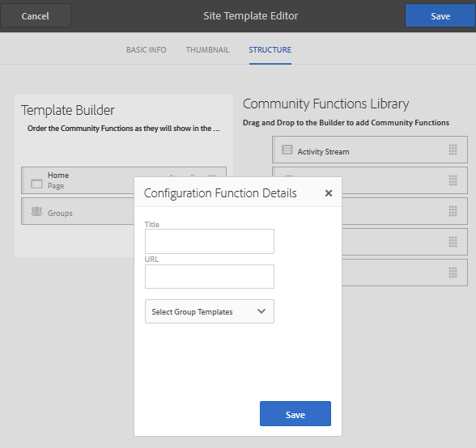

# Modelli per siti {#site-templates}

La console Modelli per sito è molto simile alla console [Modelli per gruppi](tools-groups.md), incentrata sulle funzioni di interesse per i gruppi community.

>[!NOTE]
>
>Le console per la creazione di [siti community](sites-console.md), [modelli di siti community](sites.md), [modelli di gruppi community](tools-groups.md) e [funzioni community](functions.md) sono utilizzabili solo nell&#39;ambiente di authoring.

## Console Modelli sito {#site-templates-console}

Nell’ambiente di authoring, per accedere alla console Siti community:

* Dalla navigazione globale: **[!UICONTROL Strumenti > Community > Modelli del sito]**

Questa console visualizza i modelli da cui è possibile creare un [sito community](sites-console.md) e consente di creare nuovi modelli di sito.

## Crea modello sito {#create-site-template}

Per iniziare a creare un nuovo modello di sito, selezionare `Create`.

Viene visualizzato il pannello Editor sito che contiene 3 sottopannelli:

### Informazioni di base {#basic-info}

Nel pannello Informazioni di base, un nome, una descrizione e se il modello è abilitato o disabilitato sono configurati:

* **[!UICONTROL Nome modello per sito community]**

   ID del nome del modello.

* **[!UICONTROL Descrizione modello per sito community]**

   Descrizione del modello.

* **[!UICONTROL Disattivato/Abilitato]**

   Un interruttore di attivazione/disattivazione che controlla se il modello è referenziabile.

### Miniatura  {#thumbnail}

(Facoltativo) Selezionate l’icona Carica immagine per visualizzare una miniatura con il nome e la descrizione per gli autori dei siti della community.

### Struttura {#structure}

Per aggiungere funzioni per la community, trascinate dal lato destro a sinistra nell&#39;ordine in cui dovrebbero essere visualizzati i collegamenti del menu del sito. Gli stili verranno applicati al modello durante la creazione del sito.

Ad esempio, se desiderate una pagina principale, trascinate la funzione Pagina dalla libreria e rilasciatela sotto il generatore di modelli. Viene visualizzata la finestra di dialogo di configurazione della pagina. Per informazioni sulle finestre di dialogo di configurazione, vedere la [console delle funzioni](functions.md).

Trascinate e rilasciate tutte le altre funzioni della community desiderate per un sito community basato su questo modello.

La funzione page fornisce una pagina vuota. La funzione Groups (Gruppi) consente di creare un sito di gruppo (sub-community) all&#39;interno del sito community.

>[!CAUTION]
>
>La funzione dei gruppi deve *not* essere la *prima e la funzione unica* nella struttura del sito.
>
>Qualsiasi altra funzione, come la funzione [page](functions.md#page-function), deve essere inclusa ed elencata per prima.

### Modelli di gruppo per la funzione dei gruppi {#group-templates-for-groups-function}

Quando si inserisce una funzione di gruppo nel modello di sito, la configurazione richiede la specifica delle scelte di modelli di gruppo consentite quando viene creato un nuovo gruppo nell&#39;ambiente di pubblicazione.

>[!CAUTION]
>
>La funzione Groups deve *not* essere la *prima e la sola funzione* nella struttura del sito.

Selezionando due o più modelli di gruppo community, l&#39;amministratore del gruppo può scegliere se creare effettivamente un nuovo gruppo nella community.

## Modifica modello sito{#edit-site-template}

Quando si visualizzano i modelli di sito nella [console principale dei modelli di sito](#site-templates-console), è possibile selezionare un modello di sito esistente da modificare.

Questo processo fornisce gli stessi pannelli di [creazione di un modello di sito](#create-site-template).
