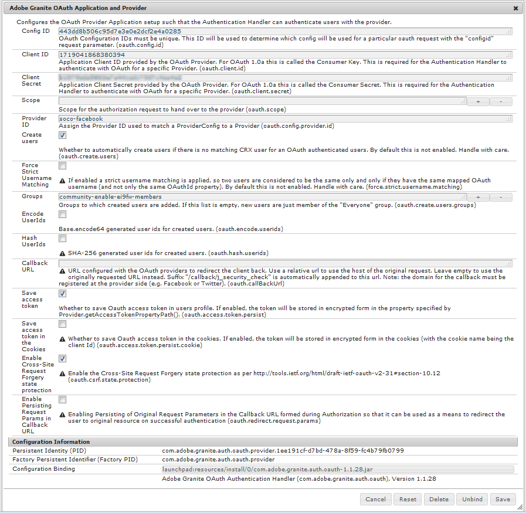

# Login tramite social network con Facebook e Twitter {#social-login-with-facebook-and-twitter}

Il login mediante profilo sociale è la capacità di presentare a un visitatore del sito l’opzione per accedere con il proprio account Facebook o Twitter. Pertanto, includendo i dati Facebook o Twitter consentiti nel loro profilo membro AEM.

## Panoramica di accesso tramite social network {#social-login-overview}

Per includere il login mediante social network, è *necessario* creare applicazioni Facebook e Twitter personalizzate.

L&#39;esempio di commercio al dettaglio fornisce esempi di app Facebook e Twitter e servizi cloud, ma non sono disponibili in un sito Web di produzione .

I passaggi necessari sono:

1. [Abilita ](#adobe-granite-oauth-authentication-handler) autenticazione OAuth su tutte le istanze AEM pubblicazione.

   Senza OAuth abilitato, i tentativi di accesso non riescono.

1. **** Creare un&#39;app social e un servizio cloud.

   * Per supportare l’accesso con Facebook:

      * Create un&#39;app [Facebook](#create-a-facebook-app).
      * Create e pubblicate un [servizio cloud di Facebook Connect](#create-a-facebook-connect-cloud-service).
   * Per supportare l&#39;accesso con Twitter:

      * Create un&#39;app [Twitter](#create-a-twitter-app).
      * Create e pubblicate un [servizio cloud di Twitter Connect](#create-a-twitter-connect-cloud-service).

1. [**Abilita** accesso ](#enable-social-login) sociale per un sito community.

Esistono due concetti fondamentali:

1. **Scope** (permissions) specifica i dati che l&#39;app può richiedere.

   * Le istanze di Facebook e Twitter [ Adobe Granite OAuth Application and Provider](#adobe-granite-oauth-application-and-provider), per impostazione predefinita, includono le autorizzazioni di base dell&#39;app all&#39;interno del loro ambito.

1. **Fields** (params) specifica i dati effettivi richiesti utilizzando i parametri URL.

   * Questi campi sono specificati in [ AEM Communities Facebook OAuth Provider](#aem-communities-facebook-oauth-provider) e [ AEM Communities Twitter OAuth Provider](#aem-communities-twitter-oauth-provider).
   * I campi predefiniti sono sufficienti per la maggior parte dei casi di utilizzo ma possono essere modificati.

## Login Facebook {#facebook-login}

### Versione API Facebook {#facebook-api-version}

L&#39;accesso ai social network e l&#39;esempio di Facebook per la vendita al dettaglio sono stati sviluppati quando l&#39;API Facebook Graph era versione 1.0.
A partire da AEM 6.4 GA e AEM 6.3 SP1 il login per social network è stato aggiornato per funzionare con la nuova versione di Facebook Graph API 2.5.

>[!NOTE]
>
>Per le versioni AEM precedenti, se si riscontra un&#39;eccezione nei registri **Impossibile estrarre un token da questo**, eseguire l&#39;aggiornamento all&#39;ultimo CFP per la versione AEM.

Per le informazioni sulla versione dell&#39;API di Facebook Graph, consultate la [finestra di dialogo delle API di Facebook](https://developers.facebook.com/docs/apps/changelog).

### Creare un&#39;app Facebook {#create-a-facebook-app}

Per abilitare l&#39;accesso ai social network di Facebook è necessaria un&#39;applicazione Facebook configurata correttamente.

Per creare un&#39;applicazione Facebook, seguire le istruzioni di Facebook all&#39;indirizzo [https://developers.facebook.com/apps/](https://developers.facebook.com/apps/). Le modifiche apportate alle relative istruzioni non sono riportate nelle seguenti informazioni.

In generale, a partire dall&#39;API Facebook v2.7:

* *Aggiungere una nuova app Facebook*
   * Per *Piattaforma*, scegliete Sito Web:
      * Per *URL sito*, immettere `  https://<server>:<port>.`
      * Per *Nome visualizzato*, immettete un titolo da usare come Titolo del servizio di connessione di Facebook.
      * Per *Categoria*, si consiglia di scegliere *App per le pagine*, ma può essere qualsiasi cosa.
      * *Aggiungi prodotto: Login Facebook*
      * Per *URI di reindirizzamento OAuth validi*, immettere `  https://<server>:<port>.`

>[!NOTE]
>
>Per lo sviluppo, http://localhost:4503 funzionerà.

Una volta creata l&#39;applicazione, individua le impostazioni **[!UICONTROL ID app]** e **[!UICONTROL Segreto app]**. Queste informazioni sono necessarie per configurare il [servizio cloud di Facebook](#createafacebookcloudservice).

### Creare un Cloud Service di Facebook Connect {#create-a-facebook-connect-cloud-service}

L&#39;istanza [ Adobe Granite OAuth Application and Provider](#adobe-granite-oauth-application-and-provider), creata creando un&#39;istanza di configurazione del servizio cloud, identifica l&#39;applicazione Facebook e i gruppi membri ai quali vengono aggiunti i nuovi utenti.

1. Nell’istanza di creazione AEM, effettuate l’accesso con privilegi di amministratore.
1. Dalla navigazione globale, selezionate **[!UICONTROL Strumenti]** > **[!UICONTROL Cloud Services]** > **[!UICONTROL Configurazione accesso Facebook Social]**.
1. Selezionare la configurazione **[!UICONTROL percorso contestuale]**.

   **[!UICONTROL Il]** percorso di contesto deve corrispondere al percorso di configurazione cloud selezionato durante la creazione o la modifica di un sito community.

1. Controlla se il percorso contestuale è abilitato per creare servizi cloud al di sotto di esso.
1. Accedete a **[!UICONTROL Strumenti]** > **[!UICONTROL Generale]** > **[!UICONTROL Browser di configurazione]**. Seleziona il contesto e modifica le proprietà. Abilita configurazioni cloud se non ancora abilitata.

   

   * Per ulteriori informazioni, consulta la documentazione del [browser di configurazione](/help/sites-administering/configurations.md).

1. **Creare/** modificare la configurazione del servizio cloud Facebook.

   

   * **[!UICONTROL Titolo]**  (*obbligatorio*) Immettete un titolo di visualizzazione che identifichi l’app Facebook. Si consiglia di utilizzare lo stesso nome immesso come *Display Name* per l&#39;app Facebook.
   * **[!UICONTROL ID]**  app/ChiaveAPI (*richiesta*) Immettere l&#39; ***ID*** app per l&#39;app Facebook. Questo identifica l&#39;istanza [ Adobe Granite OAuth Application and Provider](https://helpx.adobe.com/experience-manager/6-3/communities/using/social-login.html#AdobeGraniteOAuthApplicationandProvider) creata dalla finestra di dialogo.
   * **[!UICONTROL Segreto]**  app (*obbligatorio*) Immetti il  ***Segreto app per l&#39;*** app Facebook.
   * **[!UICONTROL Crea]** utentiSe questa opzione è attivata, l’accesso con un account Facebook creerà una voce utente AEM e la aggiungerà come membro al gruppo o ai gruppi di utenti selezionati.  Il valore predefinito è selezionato (fortemente consigliato).
   * **[!UICONTROL Mascherare gli ID]** utente: Lascia deselezionato.
   * **[!UICONTROL E-mail]** ambito: l’ID e-mail dell’utente deve essere recuperato da Facebook.
   * **[!UICONTROL Aggiungi a]** gruppi di utenti Selezionate Aggiungi gruppo di utenti per scegliere uno o più  [gruppi di ](https://helpx.adobe.com/experience-manager/6-3/communities/using/users.html) membri per il sito della community a cui verranno aggiunti gli utenti.

   >[!NOTE]
   >
   >I gruppi possono essere aggiunti o rimossi in qualsiasi momento. Ma le appartenenze degli utenti esistenti non ne saranno influenzate. L&#39;iscrizione automatica si applica solo ai nuovi utenti che vengono creati dopo l&#39;aggiornamento di questo campo. Per i siti in cui gli utenti anonimi sono disabilitati, scegliere di aggiungere utenti al gruppo di membri della community corrispondente destinato a tale sito community chiuso.

   * Selezionare **[!UICONTROL SAVE]**.
   * **[!UICONTROL Pubblicazione]**.

Il risultato è un&#39;istanza [ Adobe Granite OAuth Application and Provider](https://helpx.adobe.com/experience-manager/6-3/communities/using/social-login.html#adobe-granite-oauth-application-and-provider) che non richiede ulteriori modifiche a meno che non venga aggiunto ulteriore ambito (autorizzazioni). L’ambito predefinito è quello standard per l’accesso a Facebook. Se si desidera un ulteriore ambito, è necessario modificare direttamente la configurazione OSGI. In caso di modifiche effettuate direttamente tramite il sistema o la console, evitate di modificare le configurazioni del servizio cloud dall’interfaccia touch per evitare la sovrascrittura.

###  AEM Communities Facebook OAuth Provider {#aem-communities-facebook-oauth-provider}

Il provider AEM Communities  estende l&#39;istanza [ Granite OAuth Application and Provider](#adobe-granite-oauth-application-and-provider) del Adobe.

Questo provider richiederà la modifica per:

* Consenti aggiornamenti utente
* Aggiungi altri campi [all&#39;interno dell&#39;ambito](#adobe-granite-oauth-application-and-provider)

   * Per impostazione predefinita, non tutti i campi consentiti per impostazione predefinita sono inclusi.

Se la modifica è necessaria, in ogni istanza di pubblicazione AEM:

1. Effettuate l&#39;accesso con privilegi di amministratore.
1. Andate alla [console Web](../../help/sites-deploying/configuring-osgi.md). Ad esempio, http://localhost:4503/system/console/configMgr.
1. Individuate  fornitore OAuth di AEM Communities Facebook.
1. Selezionate l’icona matita da aprire per la modifica.

   

   * **[!UICONTROL ID provider OAuth]**

      (*Obbligatorio*) Il valore predefinito è *soco-facebook*. Non modificare.

   * **[!UICONTROL Configurazione Cloud Service]**

      Il valore predefinito è `/etc/  cloudservices /  facebookconnect`. Non modificare.

   * **[!UICONTROL Configurazione servizio provider OAuth]**

      Il valore predefinito è `/apps/social/facebookprovider/config/`. Non modificare.

   * **[!UICONTROL Abilita tag]**

      Non modificare.

   * **[!UICONTROL Percorso utente]**

      Posizione nella directory archivio in cui sono memorizzati i dati utente. Per un sito community, per garantire ai membri le autorizzazioni necessarie per visualizzare il profilo dell&#39;altro, il percorso deve essere il percorso predefinito */home/users/community*.

   * **[!UICONTROL Abilita campi]**

      Se questa opzione è selezionata, i campi elencati vengono specificati nella richiesta a Facebook per l’autenticazione dell’utente e le informazioni. Il valore predefinito è deselezionato.

   * **[!UICONTROL espandibili]**

      Quando i campi sono attivati, quando si chiama l&#39;API di Facebook Graph vengono inclusi i campi seguenti. I campi devono essere consentiti all&#39;interno dell&#39;ambito definito nella configurazione del servizio cloud. Altri campi potrebbero richiedere l’approvazione di Facebook. Fate riferimento alla sezione Autorizzazioni di accesso a Facebook della documentazione di Facebook. I campi predefiniti aggiunti come parametri sono:

      * id
      * name
      * first_name
      * last_name
      * Collegamento
      * locale
      * picture
      * timezone
      * update_time
      * verificato
      * e-mail

   Se viene aggiunto o modificato un campo, aggiornate la configurazione del gestore di sincronizzazione predefinito corrispondente per correggere il mapping.

   * **[!UICONTROL Aggiorna utente]**

      Se questa opzione è attivata, aggiorna i dati utente presenti nella directory archivio su ogni login in modo che riflettano le modifiche del profilo o i dati aggiuntivi richiesti. Il valore predefinito è deselezionato.

#### Passaggi successivi {#next-steps}

I passaggi successivi sono gli stessi sia per Facebook che per Twitter:

* [Pubblicare le configurazioni del servizio cloud](#publishcloudservices)
* [Abilita per un sito community](#enable-social-login)

## Login Twitter {#twitter-login}

### Creare un&#39;app Twitter {#create-a-twitter-app}

Per abilitare l&#39;accesso ai social network per Twitter è necessaria un&#39;applicazione Twitter configurata.

Seguite le istruzioni più recenti per creare una nuova applicazione Twitter all&#39;indirizzo [https://apps.twitter.com](https://apps.twitter.com/).

In generale:

1. Inserite un *Nome* che identificherà l&#39;applicazione Twitter per gli utenti del sito Web.
1. Inserire una *descrizione*.
1. Per *sito Web* - immettere `https://<server>`.
1. Per *URL di callback* - immettere `https://server`.

   >[!NOTE]
   >
   >Non è necessario specificare la porta.
   >
   >Per lo sviluppo, https://127.0.0.1/ funzionerà.

1. Una volta creata l&#39;applicazione, individuare il **[!UICONTROL Consumer (API) Key]** e **[!UICONTROL Consumer (API) Secret]**. Queste informazioni saranno necessarie per configurare il [servizio cloud Twitter](#createatwittercloudservice).

#### Autorizzazioni  {#permissions}

Nella sezione delle autorizzazioni della gestione dell&#39;applicazione Twitter:

* **[!UICONTROL Accesso]**: Selezionare  `Read only`.

   * Altre opzioni non sono supportate

* **[!UICONTROL Autorizzazioni]** aggiuntive: Facoltativamente, scegliete  `Request email addresses from users`.

   * Se non è selezionato, il profilo utente in AEM non includerà il proprio indirizzo e-mail.
   * Le istruzioni di Twitter indicano ulteriori passi da compiere.

L&#39;unica richiesta REST eseguita per l&#39;accesso tramite social network è *[Account/verifica credenziali](https://dev.twitter.com/rest/reference/get/account/verify_credentials)*.

### Creare un Cloud Service di Twitter Connect {#create-a-twitter-connect-cloud-service}

L&#39;istanza [ Adobe Granite OAuth Application and Provider](#adobe-granite-oauth-application-and-provider), creata creando un&#39;istanza di configurazione del servizio cloud, identifica l&#39;applicazione Twitter e i gruppi membri ai quali vengono aggiunti i nuovi utenti.

1. Nell’istanza di creazione, effettuate l’accesso con privilegi di amministratore.
1. Dalla navigazione globale, selezionate **[!UICONTROL Strumenti]** > **[!UICONTROL Cloud Services]** > **[!UICONTROL Configurazione di accesso a Twitter Social]**.
1. Scegliere la configurazione **[!UICONTROL percorso contestuale]**.

   Il percorso di contesto deve corrispondere al percorso di configurazione cloud selezionato durante la creazione o la modifica di un sito community.

1. Controlla se il percorso contestuale è abilitato per creare servizi cloud al di sotto di esso.
1. Accedete a **[!UICONTROL Strumenti]** > **[!UICONTROL Generale]** > **[!UICONTROL Browser di configurazione]**. Seleziona il contesto e modifica le proprietà. Abilita configurazioni cloud se non ancora abilitata.

   

   * Per ulteriori informazioni, consulta la documentazione del [browser di configurazione](/help/sites-administering/configurations.md).

1. Creare/modificare la configurazione del servizio cloud di Twitter.

   

   * **[!UICONTROL Titolo]**

      (*Obbligatorio*) Immettere un titolo di visualizzazione che identifichi l&#39;app Twitter. Si consiglia di utilizzare lo stesso nome immesso come *Display Name* per l&#39;app Twitter.

   * **[!UICONTROL Chiave consumer]**

      (*Obbligatorio*) Immettere la chiave **Consumer (API)** per l&#39;app Twitter. Questo identifica l&#39;istanza [ Adobe Granite OAuth Application and Provider](https://helpx.adobe.com/experience-manager/6-3/communities/using/social-login.html#AdobeGraniteOAuthApplicationandProvider) creata dalla finestra di dialogo.

   * **[!UICONTROL Segreto consumer]**

      (*Obbligatorio*) Immettere il ***Segreto consumer(API)*** per l&#39;app Twitter.

   * **[!UICONTROL Crea utenti]**

      Se questa opzione è attivata, l&#39;accesso con un account Twitter creerà una voce utente AEM e la aggiungerà come membro al gruppo o ai gruppi di utenti selezionati. Il valore predefinito è selezionato (fortemente consigliato).

   * **[!UICONTROL Maschera ID utenti]**

      Lascia deselezionato.

   * **[!UICONTROL Aggiungi a gruppo di utenti]**

      Selezionate Aggiungi gruppo di utenti per scegliere uno o più [gruppi di membri](https://helpx.adobe.com/experience-manager/6-3/communities/using/users.html) per il sito della community a cui verranno aggiunti gli utenti.
   >[!NOTE]
   >
   >I gruppi possono essere aggiunti o rimossi in qualsiasi momento. Ma le appartenenze degli utenti esistenti non ne saranno influenzate. L&#39;iscrizione automatica si applica solo ai nuovi utenti che vengono creati dopo l&#39;aggiornamento di questo campo. Per i siti in cui gli utenti anonimi sono disabilitati, aggiungete utenti al gruppo di membri della comunità corrispondente destinato a tale sito della comunità chiuso.

1. Selezionare **[!UICONTROL SAVE]** e **[!UICONTROL Publish]**.

Il risultato è un&#39;istanza [ Adobe Granite OAuth Application and Provider](https://helpx.adobe.com/experience-manager/6-3/communities/using/social-login.html#adobe-granite-oauth-application-and-provider) che non richiede ulteriori modifiche. L’ambito predefinito è quello standard per le autorizzazioni di accesso a Twitter.

###  provider OAuth di AEM Communities Twitter {#aem-communities-twitter-oauth-provider}

La configurazione AEM Communities  estende l&#39;istanza [ Granite OAuth Application and Provider](#adobe-granite-oauth-application-and-provider) del Adobe. Per consentire gli aggiornamenti degli utenti, questo provider richiederà la modifica.

Se la modifica è necessaria, in ogni istanza di pubblicazione AEM:

1. Effettuate l&#39;accesso con privilegi di amministratore.
1. Andate alla [console Web](../../help/sites-deploying/configuring-osgi.md).

   Ad esempio, http://localhost:4503/system/console/configMgr.

1. Individuate  fornitore OAuth di AEM Communities Twitter.
1. Selezionate l’icona matita da aprire per la modifica.

   

   * **[!UICONTROL ID provider OAuth]**

   (*Obbligatorio*) Il valore predefinito è *soco-twitter*. Non modificare.

   * **[!UICONTROL Configurazione Cloud Service]**

      Il valore predefinito è *conf.* Non modificare.

   * **[!UICONTROL Configurazione servizio provider OAuth]**

      Il valore predefinito è `/apps/social/twitterprovider/config/`. Non modificare.

   * **[!UICONTROL Percorso utente]**

      Posizione nella directory archivio in cui sono memorizzati i dati utente. Per un sito community, per garantire ai membri le autorizzazioni necessarie per visualizzare il profilo dell&#39;altro, il percorso deve essere il percorso predefinito `/home/users/community`.

   * **[!UICONTROL Abilita]** parametri non modificare
   * **[!UICONTROL I]** parametri URL non vengono modificati
   * **[!UICONTROL Aggiorna utente]**

      Se questa opzione è attivata, aggiorna i dati utente presenti nella directory archivio su ogni login in modo che riflettano le modifiche del profilo o i dati aggiuntivi richiesti. Il valore predefinito è deselezionato.

#### Passaggi successivi {#next-steps-1}

I passaggi successivi sono gli stessi sia per Facebook che per Twitter:

* [Pubblicare le configurazioni del servizio cloud](#publishcloudservices)
* [Abilita per un sito community](#enable-social-login)

## Abilita accesso tramite social network {#enable-social-login}

###  della console di AEM Communities Sites {#aem-communities-sites-console}

Una volta configurato, il servizio cloud può essere abilitato per l&#39;impostazione Accesso social network pertinente per un sito community tramite il sottopannello [Gestione utente](https://helpx.adobe.com/experience-manager/6-3/communities/using/sites-console.html#USERMANAGEMENT) Impostazioni durante la creazione del sito community [a3/> o [gestione](https://helpx.adobe.com/experience-manager/6-3/communities/using/sites-console.html#ModifyingSiteProperties).](https://helpx.adobe.com/experience-manager/6-3/communities/using/sites-console.html#SiteCreation)

1. Scegliete il contesto di configurazione del sito in cui avete salvato le configurazioni di accesso mediante social network.

1. Nella scheda Generale, impostate le configurazioni cloud.

   

1. Nella scheda Settings (Impostazioni), abilita **[!UICONTROL Social Logins]** e Salva.

   

## Test login social network {#test-social-login}

* Assicurarsi che [ Adobe Granite OAuth Authentication Handler](#adobe-granite-oauth-authentication-handler) sia stato abilitato su tutte le istanze di pubblicazione.
* Verifica che i servizi cloud siano stati pubblicati.
* Assicurati che il sito della community sia stato pubblicato.
* Avviate il sito pubblicato in un browser.
Ad esempio, http://localhost:4503/content/sites/engage/en.html
* Selezionare **[!UICONTROL Accesso in]**.
* Selezionare **[!UICONTROL Accedi con Facebook]** o **[!UICONTROL Accedi con Twitter]**.
* Se non avete già eseguito l&#39;accesso a Facebook o Twitter, effettuate l&#39;accesso con le credenziali appropriate.
* Potrebbe essere necessario concedere l&#39;autorizzazione in base alla finestra di dialogo visualizzata dall&#39;app Facebook o Twitter.
* La barra degli strumenti nella parte superiore della pagina viene aggiornata per riflettere l’accesso effettuato correttamente.
* Selezionare **[!UICONTROL Profilo]**: nella pagina Profilo vengono visualizzati l’immagine avatar dell’utente, il nome e il cognome. Vengono inoltre visualizzate le informazioni del profilo Facebook o Twitter in base ai campi/param consentiti.

## Configurazioni OAuth AEM piattaforma {#aem-platform-oauth-configurations}

### Gestore autenticazione OAuth  Adobe Granite {#adobe-granite-oauth-authentication-handler}

`Adobe Granite OAuth Authentication Handler` non è abilitata per impostazione predefinita e ***deve essere abilitata su tutte AEM istanze di pubblicazione.***

Per attivare il gestore di autenticazione al momento della pubblicazione, è sufficiente aprire la configurazione OSGi e salvarla:

* Effettuate l&#39;accesso con privilegi di amministratore.
* Andate alla [console Web](../../help/sites-deploying/configuring-osgi.md).
Ad esempio, http://localhost:4503/system/console/configMgr
* Individuare `Adobe Granite OAuth Authentication Handler`.
* Selezionate per aprire la configurazione per la modifica.
* Seleziona **[!UICONTROL Salva]**.

>[!CAUTION]
>
>Fare attenzione a non confondere il gestore di autenticazione con un&#39;istanza Facebook o Twitter di *Adobe Granite OAuth Application and Provider*.

###  applicazione e provider OAuth Granite del Adobe {#adobe-granite-oauth-application-and-provider}

Quando viene creato un servizio cloud per Facebook o Twitter, viene creata un&#39;istanza di `Adobe Granite OAuth Authentication Handler`.

Per individuare l&#39;istanza creata per un&#39;app Facebook o Twitter:

1. Effettuate l&#39;accesso con privilegi di amministratore.
1. Andate alla [console Web](../../help/sites-deploying/configuring-osgi.md).

   Ad esempio, http://localhost:4503/system/console/configMgr.

1. Individuate &#39;applicazione e il provider OAuth Granite del Adobe.

   * Individuate l&#39;istanza in cui l&#39; **[!UICONTROL ID client]** corrisponde all&#39; **[!UICONTROL ID app]**.

      

      Ad eccezione delle seguenti proprietà, lasciare invariate le altre proprietà della configurazione:

   * **[!UICONTROL ID configurazione]**

      (*Obbligatorio*) Gli ID di configurazione OAuth devono essere univoci. Generazione automatica quando viene creato il servizio cloud.

   * **[!UICONTROL ID client]**

      (*Obbligatorio*) L&#39;ID applicazione fornito al momento della creazione del servizio cloud.

   * **[!UICONTROL Segreto client]**

      (*Obbligatorio*) Il segreto dell&#39;applicazione fornito al momento della creazione del servizio cloud.

   * **[!UICONTROL Ambito]**

      (*Facoltativo*) È possibile richiedere al provider un ambito aggiuntivo per quanto consentito. L&#39;ambito predefinito copre le autorizzazioni necessarie per fornire l&#39;autenticazione social e i dati del profilo.

   * **[!UICONTROL ID fornitore]**

      (*Obbligatorio*) L&#39;ID provider per  AEM Communities viene impostato al momento della creazione del servizio cloud. Non modificare. Per Facebook Connect, il valore è *soco-facebook*. Per Twitter Connect, il valore è *soco-twitter*.

   * **[!UICONTROL Gruppi]**

      (*Consigliato*) Uno o più gruppi di membri a cui vengono aggiunti gli utenti creati. Per  AEM Communities, si consiglia di elencare il gruppo di membri per il sito community.

   * **[!UICONTROL URL callback]**

      (*URL opzionale*) configurato con i provider OAuth per reindirizzare il client. Utilizzate un URL relativo per utilizzare l&#39;host della richiesta originale. Lasciate vuoto per usare l’URL originariamente richiesto. Il suffisso &quot;/callback/j_security_check&quot; viene aggiunto automaticamente a questo URL.
   >[!NOTE]
   >
   >Il dominio per il callback deve essere registrato con il provider (Facebook o Twitter).

Per ogni configurazione del gestore di autenticazione OAuth, nell&#39;istanza sono state create due configurazioni aggiuntive:

* Gestore di sincronizzazione predefinito Apache Jackrabbit Oak (org.apache.jackrabbit.oak.security.authentication.external.impl.DefaultSyncHandler) - Non sono necessarie modifiche, ma è possibile esaminare le mappature dei campi utente in modo che i campi Facebook siano mappati a un nodo di profilo utente CQ. Inoltre, &#39;Sync Handler Name&#39; corrisponde all&#39;ID di configurazione del provider OAuth.
* Modulo di accesso esterno Apache Jackrabbit Oak (org.apache.jackrabbit.oak.spi.security.authentication.external.impl.ExternalLoginModuleFactory) - Non sono necessarie modifiche, ma potete notare che &#39;Nome provider identità&#39; e &#39;Nome gestore sincronizzazione&#39; sono uguali e puntare rispettivamente alle corrispondenti configurazioni OAuth e del gestore di sincronizzazione.

Per ulteriori informazioni, vedere [Autenticazione con il modulo di login esterno Apache Oak](https://jackrabbit.apache.org/oak/docs/security/authentication/externalloginmodule.html).

## Prestazioni delle transizioni dell&#39;utente OAuth {#oauth-user-traversal-performance}

Per i siti della community che visualizzano centinaia di migliaia di utenti registrati con il proprio login Facebook o Twitter, le prestazioni traverse della query eseguite quando un visitatore del sito utilizza il proprio profilo sociale possono essere migliorate aggiungendo il seguente indice Oak.

Se nei registri sono visibili avvisi di attraversamento, è consigliabile aggiungere questo indice.

Per un’istanza di authoring, effettuate l’accesso con privilegi amministrativi:

1. Dalla navigazione globale: selezionare **Strumenti, [CRX/DE Lite](../../help/sites-developing/developing-with-crxde-lite.md).**
1. Create un indice denominato ntBaseLucene-oauth da una copia di ntBaseLucene:

   * Sotto il nodo `/oak:index`
   * Selezionare il nodo `ntBaseLucene`
   * Selezionare **[!UICONTROL Copia]**
   * Seleziona `/oak:index`
   * Selezionare **[!UICONTROL Incolla]**
   * Rinomina copia di ntBaseLucene in `ntBaseLucene-oauth`

1. Modificare le proprietà del nodo ntBaseLucene-oauth:

   * **[!UICONTROL indexPath]**:  `/oak:index/ntBaseLucene-oauth`
   * **[!UICONTROL name]**: `oauthid-123****`
   * **[!UICONTROL reindex]**:  `true`
   * **[!UICONTROL reindexCount]**:  `1`

1. Sotto il nodo /oak:index/ntBaseLucene-oauth/indexRules/nt:base/properties:

   * Eliminate tutti i nodi secondari, ad eccezione di cqTags.
   * Rinominare i tag cq in `oauthid-123****`
   * Modificare le proprietà del nodo `oauthid-123****`

      * **[!UICONTROL name]**:  `oauthid-123****`
   * Selezionare **[!UICONTROL Salva tutto]**.

* Per **name** `oauthid-123`, sostituire *123* con la ***App ID*** o Twitter ***Consumer (API) Key*** che è il valore di **Client ID** nel [ Configurazione applicazione e provider OAuth Granite di Adobe](social-login.md#adobe-granite-oauth-application-and-provider).

   

Per ulteriori informazioni e strumenti, fare riferimento a [Query e indicizzazione quercia](../../help/sites-deploying/queries-and-indexing.md).

## Configurazione del dispatcher {#dispatcher-configuration}

Vedere [Configurazione del dispatcher per Communities](dispatcher.md).
