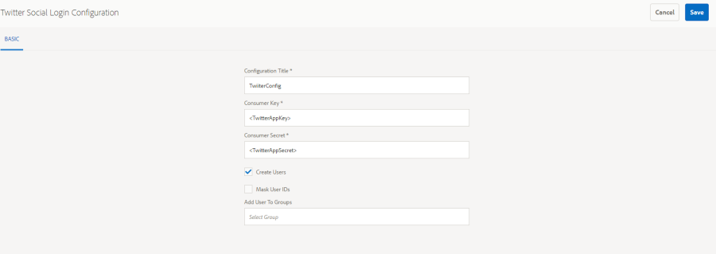

# Accesso social network con Facebook e Twitter {#social-login-with-facebook-and-twitter}

L’accesso tramite social network consente a un visitatore del sito di accedere con il proprio account Facebook o di Twitter. Pertanto, includere i dati Facebook o di Twitter consentiti nel loro profilo di membro AEM.

## Panoramica accesso social network {#social-login-overview}

Per includere l’accesso tramite social network, *obbligatorio* per creare applicazioni Facebook e di Twitter personalizzate.

Anche se l’esempio we-retail fornisce app di esempio per Facebook e Twitter e servizi cloud, non sono disponibili su [sito web di produzione](../../help/sites-administering/production-ready.md).

I passaggi necessari sono:

1. [Abilita autenticazione OAuth](#adobe-granite-oauth-authentication-handler) su tutte le istanze di pubblicazione AEM.

   Se OAuth non è abilitato, i tentativi di accesso non riescono.

1. **Crea** un’app social e un servizio cloud.

   * Per supportare l’accesso con Facebook:

      * Creare un [app facebook](#create-a-facebook-app).
      * Creare e pubblicare un [Servizio cloud facebook Connect](#create-a-facebook-connect-cloud-service).

   * Per supportare l&#39;accesso con il Twitter:

      * Creare un [app twitter](#create-a-twitter-app).
      * Creare e pubblicare un [Servizio cloud Twitter Connect](#create-a-twitter-connect-cloud-service).

1. [**Abilita** accesso social network](#enable-social-login) per un sito community.

Esistono due concetti di base:

1. **Ambito** (autorizzazioni) specifica i dati che l’app può richiedere.

   * FACEBOOK e TWITTER [Applicazione e provider OAuth Adobe Granite](#adobe-granite-oauth-application-and-provider) Le istanze, per impostazione predefinita, includono le autorizzazioni di base per l’app nel loro ambito.

1. **Campi** (parametri) specifica i dati effettivi richiesti utilizzando i parametri URL.

   * Questi campi sono specificati in [Provider OAuth di AEM Communities Facebook](#aem-communities-facebook-oauth-provider) e [Provider OAuth Twitter AEM Communities](#aem-communities-twitter-oauth-provider).
   * I campi predefiniti sono sufficienti per la maggior parte dei casi d’uso, ma possono essere modificati.

## Accesso a facebook {#facebook-login}

### Versione API facebook {#facebook-api-version}

L’accesso social e l’esempio di Facebook we-retail sono stati sviluppati quando la versione 1.0 dell’API Graph di Facebook. A partire da AEM 6.4 GA e AEM 6.3 SP1, l’accesso social è stato aggiornato per funzionare con la nuova versione dell’API 2.5 di Facebook Graph.

>[!NOTE]
>
>Per le versioni AEM precedenti, se riscontri un’eccezione nei registri **Impossibile estrarre un token da questo**, eseguire l’aggiornamento all’ultimo CFP per quella versione AEM.

Per informazioni sulla versione dell’API di Facebook Graph, consulta [Registro modifiche API facebook](https://developers.facebook.com/docs/apps/changelog).

### Creare un’app Facebook {#create-a-facebook-app}

Per abilitare l’accesso social a Facebook è necessaria un’applicazione Facebook configurata correttamente.

Per creare un&#39;applicazione Facebook, seguire le istruzioni di Facebook all&#39;indirizzo [https://developers.facebook.com/apps/](https://developers.facebook.com/apps/). Le modifiche alle loro istruzioni non vengono riportate nelle informazioni seguenti.

In generale, a partire da Facebook API v2.7:

* *Aggiungi una nuova app Facebook*
   * Per *Piattaforma*, scegli Sito Web:
      * Per *URL sito*, immetti `  https://<server>:<port>.`
      * Per *Nome visualizzato*, immetti un titolo da utilizzare come Titolo del servizio Facebook connect.
      * Per *Categoria*, scelta consigliata *App per pagine*, ma può essere qualsiasi cosa.
      * *Aggiungi prodotto: Accesso a Facebook*
      * Per *URI di reindirizzamento OAuth validi*, immetti `  https://<server>:<port>.`

>[!NOTE]
>
>Per lo sviluppo, http://localhost:4503 funzionerà.

Una volta creata l’applicazione, individua **[!UICONTROL ID app]** e **[!UICONTROL Segreto app]** impostazioni. Queste informazioni sono necessarie per configurare [Servizio cloud facebook](#createafacebookcloudservice).

### Creazione di un Cloud Service Facebook Connect {#create-a-facebook-connect-cloud-service}

Il [Applicazione e provider OAuth Adobe Granite](#adobe-granite-oauth-application-and-provider) istanza, creata con la creazione di una configurazione del servizio cloud, identifica l’applicazione Facebook e i gruppi di membri a cui vengono aggiunti i nuovi utenti.

1. Nell’istanza di authoring dell’AEM, accedi con privilegi di amministratore.
1. Dalla navigazione globale, seleziona **[!UICONTROL Strumenti]** > **[!UICONTROL Cloud Service]** > **[!UICONTROL Configurazione accesso social network tramite facebook]**.
1. Seleziona la configurazione **[!UICONTROL percorso di contesto]**.

   **[!UICONTROL Percorso contesto]** deve corrispondere al percorso di configurazione cloud selezionato durante la creazione/modifica di un sito community.

1. Verifica se il percorso di contesto è abilitato per la creazione di servizi cloud al di sotto di esso.
1. Vai a **[!UICONTROL Strumenti]** > **[!UICONTROL Generale]** > **[!UICONTROL Browser configurazioni]**. Seleziona il contesto e modifica le proprietà. Abilita le configurazioni cloud se non sono ancora abilitate.

   

   * Consulta la [Browser configurazioni](/help/sites-administering/configurations.md) per ulteriori informazioni.

1. **Crea/Modifica** Configurazione del servizio cloud facebook.

   

   * **[!UICONTROL Titolo]** (*Obbligatorio* a) Inserisci un titolo che identifichi l&#39;app Facebook. Utilizza lo stesso nome immesso come *Nome visualizzato* per l’app Facebook.
   * **[!UICONTROL ID app/chiave API]** (*Obbligatorio* a) Immettere ***ID app*** per l’app Facebook. Questo identifica il [Applicazione e provider OAuth Adobe Granite](https://helpx.adobe.com/experience-manager/6-3/communities/using/social-login.html#AdobeGraniteOAuthApplicationandProvider) istanza creata dalla finestra di dialogo.
   * **[!UICONTROL Segreto app]** (*Obbligatorio* a) Immettere ***Segreto app*** per l’app Facebook.
   * **[!UICONTROL Crea utenti]** Se questa opzione è selezionata, l’accesso con un account Facebook creerà una voce utente AEM e la aggiungerà come membro ai gruppi di utenti selezionati.  Il valore predefinito è selezionato (scelta consigliata).
   * **[!UICONTROL Maschera ID utente]**: lascia deselezionata.
   * **[!UICONTROL E-mail ambito]**: l’id e-mail dell’utente deve essere recuperato da Facebook.
   * **[!UICONTROL Aggiungi a gruppi di utenti]** seleziona Aggiungi gruppo di utenti per scegliere uno o più [gruppi di membri](https://helpx.adobe.com/experience-manager/6-3/communities/using/users.html) per il sito community a cui verranno aggiunti gli utenti.

   >[!NOTE]
   >
   >È possibile aggiungere o rimuovere gruppi in qualsiasi momento. Tuttavia, le appartenenze degli utenti esistenti non vengono influenzate. L’iscrizione automatica si applica solo ai nuovi utenti creati dopo l’aggiornamento di questo campo. Per i siti in cui gli utenti anonimi sono disabilitati, scegliere di aggiungere gli utenti al gruppo di membri della community corrispondente destinato a quel sito chiuso.

   * Seleziona **[!UICONTROL SALVA]**.
   * **[!UICONTROL Pubblica]**.

Il risultato è un [Applicazione e provider OAuth Adobe Granite](https://helpx.adobe.com/experience-manager/6-3/communities/using/social-login.html#adobe-granite-oauth-application-and-provider) che non richiede ulteriori modifiche a meno che non venga aggiunto ulteriore ambito (autorizzazioni). L&#39;ambito predefinito è quello standard per l&#39;accesso a Facebook. Se desideri un ambito aggiuntivo, devi modificare direttamente la configurazione OSGI. Se sono state apportate modifiche direttamente tramite il sistema o la console, evita di modificare le configurazioni del servizio cloud dall’interfaccia utente touch per evitare la sovrascrittura.

### Provider OAuth di AEM Communities Facebook {#aem-communities-facebook-oauth-provider}

Il provider AEM Communities estende [Applicazione e provider OAuth Adobe Granite](#adobe-granite-oauth-application-and-provider) dell&#39;istanza.

Questo provider dovrà essere modificato per:

* Consenti aggiornamenti utente
* Aggiungi campi aggiuntivi [nell&#39;ambito](#adobe-granite-oauth-application-and-provider)

   * Non tutti i campi consentiti per impostazione predefinita sono inclusi.

Se è necessario apportare modifiche, in ogni istanza di pubblicazione dell’AEM:

1. Accedi con privilegi di amministratore.
1. Accedi a [Console web](../../help/sites-deploying/configuring-osgi.md). Ad esempio, http://localhost:4503/system/console/configMgr.
1. Individua il provider OAuth di AEM Communities Facebook.
1. Seleziona l’icona a forma di matita da aprire per la modifica.

   

   * **[!UICONTROL ID provider OAuth]**

     (*Obbligatorio*) Il valore predefinito è *soco -facebook*. Non modificare.

   * **[!UICONTROL Configurazione Cloud Service]**

     Il valore predefinito è `/etc/  cloudservices /  facebookconnect`. Non modificare.

   * **[!UICONTROL Configurazione servizio provider OAuth]**

     Il valore predefinito è `/apps/social/facebookprovider/config/`. Non modificare.

   * **[!UICONTROL Abilita tag]**

     Non modificare.

   * **[!UICONTROL Percorso utente]**

     Posizione nell&#39;archivio in cui vengono memorizzati i dati utente. Per un sito di community, per garantire le autorizzazioni per i membri per visualizzare il profilo di un altro utente, il percorso deve essere quello predefinito */home/users/community*.

   * **[!UICONTROL Abilita campi]**

     Se questa opzione è selezionata, i campi elencati vengono specificati nella richiesta a Facebook per l&#39;autenticazione e le informazioni dell&#39;utente. Il valore predefinito è deselezionato.

   * **[!UICONTROL Campi]**

     Quando i campi sono abilitati, i campi seguenti vengono inclusi nella chiamata all’API di Facebook Graph. I campi devono essere consentiti nell’ambito definito nella configurazione del servizio cloud. Campi aggiuntivi possono richiedere l’approvazione di Facebook. Consulta la sezione Autorizzazioni di accesso di Facebook nella documentazione di Facebook. I campi predefiniti aggiunti come parametri sono:

      * id
      * nome
      * nome
      * cognome
      * collegamento
      * lingua
      * immagine
      * fuso orario
      * ora_aggiornamento
      * verificato
      * e-mail

   Se viene aggiunto o modificato un campo, aggiorna la configurazione del gestore di sincronizzazione predefinito corrispondente per correggere la mappatura.

   * **[!UICONTROL Aggiorna utente]**

     Se questa opzione è selezionata, aggiorna i dati utente nell’archivio a ogni accesso per riflettere le modifiche al profilo o i dati aggiuntivi richiesti. Il valore predefinito è deselezionato.

#### Passaggi successivi {#next-steps}

I passaggi successivi sono gli stessi sia per Facebook che per Twitter:

* [Pubblicare le configurazioni del servizio cloud](#publishcloudservices)
* [Attiva per un sito community](#enable-social-login)

## Accesso twitter {#twitter-login}

### Creazione di un&#39;app di Twitter {#create-a-twitter-app}

È necessaria un&#39;applicazione di Twitter configurata per abilitare l&#39;accesso social network del Twitter.

Segui le istruzioni più recenti per creare un’applicazione di Twitter all’indirizzo [https://apps.twitter.com](https://apps.twitter.com/).

In generale:

1. Immetti un *Nome* che identificherà l’applicazione di Twitter per gli utenti del sito web.
1. Immetti un *Descrizione*.
1. Per *sito web* - Invio `https://<server>`.
1. Per *URL callback* - Invio `https://server`.

   >[!NOTE]
   >
   >Non è necessario specificare la porta.
   >
   >Per lo sviluppo, https://127.0.0.1/ funzionerà.

1. Una volta creata l’applicazione, individua **[!UICONTROL Chiave consumer (API)]** e **[!UICONTROL Segreto consumer (API)]**. Queste informazioni saranno necessarie per configurare [servizio cloud Twitter](#createatwittercloudservice).

#### Autorizzazioni {#permissions}

Nella sezione Autorizzazioni di Gestione applicazioni di Twitter:

* **[!UICONTROL Accesso]**: Seleziona `Read only`.

   * Altre opzioni non sono supportate

* **[!UICONTROL Autorizzazioni aggiuntive]**: scelta facoltativa `Request email addresses from users`.

   * Se non viene selezionato, il profilo utente in AEM non includerà il proprio indirizzo e-mail.
   * Istruzioni del twitter: ulteriori passi da intraprendere.

L’unica richiesta REST effettuata per l’accesso social network è *[GET credenziali account/verifica](https://dev.twitter.com/rest/reference/get/account/verify_credentials)*.

### Creazione di un Cloud Service Twitter Connect {#create-a-twitter-connect-cloud-service}

Il [Applicazione e provider OAuth Adobe Granite](#adobe-granite-oauth-application-and-provider) L&#39;istanza, creata mediante la creazione di una configurazione del servizio cloud, identifica l&#39;applicazione di Twitter e i gruppi di membri a cui vengono aggiunti i nuovi utenti.

1. Nell’istanza di authoring, accedi con privilegi di amministratore.
1. Dalla navigazione globale, seleziona **[!UICONTROL Strumenti]** > **[!UICONTROL Cloud Service]** > **[!UICONTROL Configurazione accesso social network tramite Twitter]**.
1. Scegli la **[!UICONTROL percorso di contesto]** configurazione.

   Il percorso di contesto deve corrispondere al percorso di configurazione cloud selezionato durante la creazione o la modifica di un sito community.

1. Verifica se il percorso di contesto è abilitato per la creazione di servizi cloud al di sotto di esso.
1. Vai a **[!UICONTROL Strumenti]** > **[!UICONTROL Generale]** > **[!UICONTROL Browser configurazioni]**. Seleziona il contesto e modifica le proprietà. Abilita le configurazioni cloud se non sono ancora abilitate.

   

   * Consulta la [Browser configurazioni](/help/sites-administering/configurations.md) per ulteriori informazioni.

1. Crea/Modifica configurazione servizio cloud di Twitter.

   

   * **[!UICONTROL Titolo]**

     (*Obbligatorio*) Inserisci un titolo che identifichi l&#39;app del Twitter. Utilizza lo stesso nome immesso come *Nome visualizzato* per l’app di Twitter.

   * **[!UICONTROL Chiave consumer]**

     (*Obbligatorio* a) Immettere **Chiave consumer (API)** per l’app di Twitter. Questo identifica il [Applicazione e provider OAuth Adobe Granite](https://helpx.adobe.com/experience-manager/6-3/communities/using/social-login.html#AdobeGraniteOAuthApplicationandProvider) istanza creata dalla finestra di dialogo.

   * **[!UICONTROL Segreto consumer]**

     (*Obbligatorio* a) Immettere ***Segreto consumer (API)*** per l’app di Twitter.

   * **[!UICONTROL Crea utenti]**

     Se questa opzione è selezionata, l&#39;accesso con un account di Twitter creerà una voce utente AEM e la aggiungerà come membro ai gruppi di utenti selezionati. Il valore predefinito è selezionato (scelta consigliata).

   * **[!UICONTROL Maschera ID utente]**

     Lascia deselezionata.

   * **[!UICONTROL Aggiungi a gruppi di utenti]**

     Seleziona Aggiungi gruppo di utenti per scegliere uno o più [gruppi di membri](https://helpx.adobe.com/experience-manager/6-3/communities/using/users.html) per il sito community a cui verranno aggiunti gli utenti.

   >[!NOTE]
   >
   >È possibile aggiungere o rimuovere gruppi in qualsiasi momento. Tuttavia, le appartenenze degli utenti esistenti non vengono influenzate. L’iscrizione automatica si applica solo ai nuovi utenti creati dopo l’aggiornamento di questo campo. Per i siti in cui gli utenti anonimi sono disabilitati, aggiungere gli utenti al gruppo di membri della community corrispondente destinato a quel sito chiuso.
   >

1. Seleziona **[!UICONTROL SALVA]** e **[!UICONTROL Pubblica]**.

Il risultato è un [Applicazione e provider OAuth Adobe Granite](https://helpx.adobe.com/experience-manager/6-3/communities/using/social-login.html#adobe-granite-oauth-application-and-provider) che non richiede ulteriori modifiche. L&#39;ambito predefinito corrisponde alle autorizzazioni standard per l&#39;accesso al Twitter.

### Provider OAuth Twitter AEM Communities {#aem-communities-twitter-oauth-provider}

La configurazione di AEM Communities estende [Applicazione e provider OAuth Adobe Granite](#adobe-granite-oauth-application-and-provider) dell&#39;istanza. Questo provider richiederà modifiche per consentire gli aggiornamenti utente.

Se è necessario apportare modifiche, in ogni istanza di pubblicazione dell’AEM:

1. Accedi con privilegi di amministratore.
1. Accedi a [Console web](../../help/sites-deploying/configuring-osgi.md).

   Ad esempio, http://localhost:4503/system/console/configMgr.

1. Individua il provider OAuth del Twitter AEM Communities.
1. Seleziona l’icona a forma di matita da aprire per la modifica.

   

   * **[!UICONTROL ID provider OAuth]**

   (*Obbligatorio*) Il valore predefinito è *soco -twitter*. Non modificare.

   * **[!UICONTROL Configurazione Cloud Service]**

     Il valore predefinito è *conf.* Non modificare.

   * **[!UICONTROL Configurazione servizio provider OAuth]**

     Il valore predefinito è `/apps/social/twitterprovider/config/`. Non modificare.

   * **[!UICONTROL Percorso utente]**

     Posizione nell&#39;archivio in cui vengono memorizzati i dati utente. Per un sito di community, per garantire le autorizzazioni per i membri per visualizzare il profilo di un altro utente, il percorso deve essere quello predefinito `/home/users/community`.

   * **[!UICONTROL Abilita parametri]** - non modificare
   * **[!UICONTROL Parametri URL]** - non modificare
   * **[!UICONTROL Aggiorna utente]**

     Se questa opzione è selezionata, aggiorna i dati utente nell’archivio a ogni accesso per riflettere le modifiche al profilo o i dati aggiuntivi richiesti. Il valore predefinito è deselezionato.

#### Passaggi successivi {#next-steps-1}

I passaggi successivi sono gli stessi sia per Facebook che per Twitter:

* [Pubblicare le configurazioni del servizio cloud](#publishcloudservices)
* [Attiva per un sito community](#enable-social-login)

## Abilita accesso social network {#enable-social-login}

### Console Sites di AEM Communities {#aem-communities-sites-console}

Una volta configurato, il servizio cloud può essere abilitato per l’impostazione di accesso social network pertinente per un sito community utilizzando [Gestione utente](https://helpx.adobe.com/experience-manager/6-3/communities/using/sites-console.html#USERMANAGEMENT) Pannello secondario Impostazioni durante il sito community [creazione](https://helpx.adobe.com/experience-manager/6-3/communities/using/sites-console.html#SiteCreation) o [gestione](https://helpx.adobe.com/experience-manager/6-3/communities/using/sites-console.html#ModifyingSiteProperties).

1. Scegli il contesto di configurazione del sito in cui hai salvato le configurazioni di accesso social network.

1. Nella scheda Generale, imposta le configurazioni cloud.

   

1. Nella scheda Impostazioni, abilita **[!UICONTROL Accesso social network]** e Salva.

   

## Verifica accesso social network {#test-social-login}

* Assicurare [Gestore autenticazione OAuth Adobe Granite](#adobe-granite-oauth-authentication-handler) è stato abilitato su tutte le istanze di pubblicazione.
* Assicurati che i servizi cloud siano stati pubblicati.
* Verificare che il sito community sia stato pubblicato.
* Avvia il sito pubblicato in un browser.
Ad esempio, http://localhost:4503/content/sites/engage/en.html
* Seleziona **[!UICONTROL Accedi]**.
* Seleziona una **[!UICONTROL Accedi con Facebook]** o **[!UICONTROL Accedi con il Twitter]**.
* Se non è già stato effettuato l’accesso a Facebook o al Twitter, effettua l’accesso con le credenziali appropriate.
* A seconda della finestra di dialogo visualizzata dall’app Facebook o di Twitter, potrebbe essere necessario concedere l’autorizzazione.
* La barra degli strumenti nella parte superiore della pagina viene aggiornata per riflettere l’accesso riuscito.
* Seleziona **[!UICONTROL Profilo]**: nella pagina Profilo vengono visualizzati l’immagine avatar, il nome e il cognome dell’utente. Vengono inoltre visualizzate le informazioni del profilo Facebook o Twitter in base ai campi/parametri consentiti.

## Configurazioni OAuth della piattaforma AEM {#aem-platform-oauth-configurations}

### Gestore autenticazione OAuth Adobe Granite {#adobe-granite-oauth-authentication-handler}

Il `Adobe Granite OAuth Authentication Handler` non è abilitato per impostazione predefinita e ***deve essere abilitato su tutte le istanze di pubblicazione AEM.***

Per abilitare il gestore di autenticazione al momento della pubblicazione, è sufficiente aprire la configurazione OSGi e salvarla:

* Accedi con privilegi di amministratore.
* Accedi a [Console web](../../help/sites-deploying/configuring-osgi.md).
Ad esempio, http://localhost:4503/system/console/configMgr
* Individua `Adobe Granite OAuth Authentication Handler`.
* Seleziona per aprire la configurazione per la modifica.
* Seleziona **[!UICONTROL Salva]**.

>[!CAUTION]
>
>Fai attenzione a non confondere il gestore di autenticazione con un’istanza Facebook o di Twitter di *Applicazione e provider OAuth Adobe Granite*.

### Applicazione e provider OAuth Adobe Granite {#adobe-granite-oauth-application-and-provider}

Quando si crea un servizio cloud per Facebook o un Twitter, viene creata un’istanza di `Adobe Granite OAuth Authentication Handler` viene creato.

Per individuare l’istanza creata per un’app Facebook o di Twitter:

1. Accedi con privilegi di amministratore.
1. Accedi a [Console web](../../help/sites-deploying/configuring-osgi.md).

   Ad esempio, http://localhost:4503/system/console/configMgr.

1. Individua l’applicazione e il provider OAuth Adobe Granite.

   * Individua l’istanza in cui **[!UICONTROL ID client]** corrisponde al **[!UICONTROL ID app]**.

     

     Ad eccezione delle seguenti proprietà, lascia inalterate le altre proprietà della configurazione:

   * **[!UICONTROL ID configurazione]**

     (*Obbligatorio*) Gli ID configurazione OAuth devono essere univoci. Generato automaticamente al momento della creazione del servizio cloud.

   * **[!UICONTROL ID client]**

     (*Obbligatorio*) L&#39;ID applicazione fornito al momento della creazione del servizio cloud.

   * **[!UICONTROL Segreto client]**

     (*Obbligatorio*) Il segreto dell’applicazione fornito al momento della creazione del servizio cloud.

   * **[!UICONTROL Ambito]**

     (*Facoltativo*) Il provider può richiedere un ambito aggiuntivo per quanto consentito. L’ambito predefinito copre le autorizzazioni necessarie per fornire l’autenticazione social e i dati del profilo.

   * **[!UICONTROL ID provider]**

     (*Obbligatorio*) L’ID provider per AEM Communities viene impostato al momento della creazione del servizio cloud. Non modificare. Per Facebook Connect, il valore è *soco -facebook*. Per Connessione Twitter, il valore è *soco -twitter*.

   * **[!UICONTROL Gruppi]**

     (*Consigliato*) Uno o più gruppi di membri ai quali vengono aggiunti gli utenti creati. Per AEM Communities, si consiglia di elencare il gruppo di membri per il sito community.

   * **[!UICONTROL URL callback]**

     (*Facoltativo*) URL configurato con i provider OAuth per reindirizzare il client. Utilizza un URL relativo per utilizzare l’host della richiesta originale. Lascia vuoto per usare l&#39;URL richiesto originariamente. Il suffisso &quot;/callback/j_security_check&quot; viene automaticamente aggiunto a questo URL .

   >[!NOTE]
   >
   >Il dominio per il callback deve essere registrato con il provider (Facebook o Twitter).

Per ogni configurazione del gestore di autenticazione OAuth, sono disponibili due configurazioni aggiuntive create nell’istanza:

* Apache Jackrabbit Oak Default Sync Handler (org.apache.jackrabbit.oak.spi.security.authentication.external.impl.DefaultSyncHandler) - Non sono necessarie modifiche ma è possibile esaminare le mappature dei campi utente come i campi Facebook vengono mappati su un nodo del profilo utente CQ. Inoltre, &quot;Nome gestore di sincronizzazione&quot; corrisponde all’ID di configurazione della configurazione del provider OAuth.
* Modulo di accesso esterno Apache Jackrabbit Oak (org.apache.jackrabbit.oak.spi.security.authentication.external.impl.ExternalLoginModuleFactory) - Non sono necessarie modifiche, ma è possibile notare che &quot;Identity Provider Name&quot; e &quot;Sync Handler Name&quot; sono uguali e puntano rispettivamente alle configurazioni del gestore di sincronizzazione e OAuth corrispondenti.

Per ulteriori informazioni, consulta [Autenticazione con modulo di accesso esterno Apache Oak](https://jackrabbit.apache.org/oak/docs/security/authentication/externalloginmodule.html).

## Prestazioni di attraversamento utenti OAuth {#oauth-user-traversal-performance}

Per i siti community che registrano centinaia di migliaia di utenti utilizzando il proprio accesso Facebook o di Twitter, è possibile migliorare le prestazioni trasversali della query eseguita quando un visitatore del sito utilizza il proprio accesso social aggiungendo il seguente indice Oak.

Se nei registri vengono visualizzati avvisi di attraversamento, si consiglia di aggiungere questo indice.

In un&#39;istanza Autore, ha effettuato l&#39;accesso con privilegi amministrativi:

1. Dalla navigazione globale: seleziona **Strumenti, [CRX/DE Lite](../../help/sites-developing/developing-with-crxde-lite.md).**
1. Creare un indice denominato ntBaseLucene-oauth da una copia di ntBaseLucene:

   * Sotto il nodo `/oak:index`
   * Seleziona nodo `ntBaseLucene`
   * Seleziona **[!UICONTROL Copia]**
   * Seleziona `/oak:index`
   * Seleziona **[!UICONTROL Incolla]**
   * Rinomina copia di ntBaseLucene in `ntBaseLucene-oauth`

1. Modificare le proprietà del nodo ntBaseLucene-oauth:

   * **[!UICONTROL indexPath]**: `/oak:index/ntBaseLucene-oauth`
   * **[!UICONTROL nome]**: `oauthid-123****`
   * **[!UICONTROL reindicizzare]**: `true`
   * **[!UICONTROL reindexCount]**: `1`

1. Nel nodo /oak:index/ntBaseLucene-oauth/indexRules/nt:base/properties:

   * Elimina tutti i nodi secondari, ad eccezione di cqTags.
   * Rinomina cqTags in `oauthid-123****`
   * Modificare le proprietà del nodo `oauthid-123****`

      * **[!UICONTROL nome]**: `oauthid-123****`

   * Seleziona **[!UICONTROL Salva tutto]**.

* Per **nome** `oauthid-123`, sostituisci *123* con Facebook ***ID app*** o TWITTER ***Chiave consumer (API)*** questo è il valore del **ID client** nel [Applicazione e provider OAuth Adobe Granite](social-login.md#adobe-granite-oauth-application-and-provider) configurazione.

  

Per ulteriori informazioni e strumenti, consulta [Query e indicizzazione Oak](../../help/sites-deploying/queries-and-indexing.md).

## Configurazione Dispatcher {#dispatcher-configuration}

Consulta [Configurazione di Dispatcher per le community](dispatcher.md).
