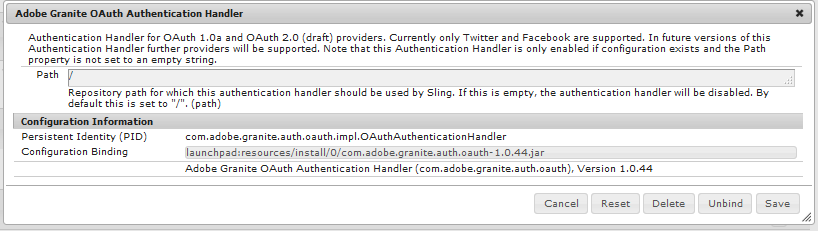

# Accesso social network con Facebook e Twitter {#social-login-with-facebook-and-twitter}

L’accesso tramite social network consente a un visitatore del sito di accedere con il proprio account Facebook o di Twitter. Pertanto, includere i dati Facebook o di Twitter consentiti nel loro profilo di membro AEM.

## Panoramica accesso social network {#social-login-overview}

Per includere l&#39;accesso tramite social network, è *necessario* creare applicazioni Facebook e di Twitter personalizzate.

L&#39;esempio We-Retail fornisce app Facebook e di Twitter di esempio e servizi cloud, ma non è disponibile in un [sito Web di produzione](../../help/sites-administering/production-ready.md).

I passaggi necessari sono:

1. [Abilita autenticazione OAuth](#adobe-granite-oauth-authentication-handler) su tutte le istanze di pubblicazione AEM.

   Se OAuth non è abilitato, i tentativi di accesso non riescono.

1. **Crea** un&#39;app social e un servizio cloud.

   * Per supportare l’accesso con Facebook:

      * Crea un&#39;app [Facebook](#create-a-facebook-app).
      * Crea e pubblica un [servizio cloud Facebook Connect](#create-a-facebook-connect-cloud-service).

   * Per supportare l&#39;accesso con il Twitter:

      * Crea un&#39;app [Twitter](#create-a-twitter-app).
      * Creazione e pubblicazione di un [servizio cloud Connect di Twitter](#create-a-twitter-connect-cloud-service).

1. [**Attiva** accesso social](#enable-social-login) per un sito community.

Esistono due concetti di base:

1. **Ambito** (autorizzazioni) specifica i dati che l&#39;app può richiedere.

   * Per impostazione predefinita, le istanze di Facebook e Twitter [Adobe Granite OAuth Application and Provider](#adobe-granite-oauth-application-and-provider) includono le autorizzazioni di base per l&#39;app nel loro ambito.

1. **Campi** (parametri) specifica i dati effettivi richiesti utilizzando i parametri URL.

   * Questi campi sono specificati in [AEM Communities Facebook OAuth Provider](#aem-communities-facebook-oauth-provider) e [AEM Communities Twitter OAuth Provider](#aem-communities-twitter-oauth-provider).
   * I campi predefiniti sono sufficienti per la maggior parte dei casi d’uso, ma possono essere modificati.

## Accesso a facebook {#facebook-login}

### Versione API facebook {#facebook-api-version}

L’accesso social e l’esempio di Facebook we-retail sono stati sviluppati quando la versione 1.0 dell’API Graph di Facebook.
A partire da AEM 6.4 GA e AEM 6.3 SP1, l’accesso social è stato aggiornato per funzionare con la nuova versione dell’API 2.5 di Facebook Graph.

>[!NOTE]
>
>Per le versioni AEM precedenti, se si verifica un&#39;eccezione nei registri **Impossibile estrarre un token da questo**, eseguire l&#39;aggiornamento al CFP più recente per quella versione AEM.

Per informazioni sulla versione dell&#39;API di Facebook Graph, vedere il [registro delle modifiche dell&#39;API di Facebook](https://developers.facebook.com/docs/apps/changelog).

### Creare un’app Facebook {#create-a-facebook-app}

Per abilitare l’accesso social a Facebook è necessaria un’applicazione Facebook configurata correttamente.

Per creare un&#39;applicazione Facebook, seguire le istruzioni di Facebook all&#39;indirizzo [https://developers.facebook.com/apps/](https://developers.facebook.com/apps/). Le modifiche alle loro istruzioni non vengono riportate nelle informazioni seguenti.

In generale, a partire da Facebook API v2.7:

* *Aggiungi una nuova app Facebook*
   * Per *Platform*, scegliere Sito Web:
      * Per *URL sito*, immettere `  https://<server>:<port>.`
      * Per *Nome visualizzato*, immettere un titolo da utilizzare come Titolo del servizio Facebook connect.
      * Per *Categoria*, si consiglia di scegliere *App per le pagine*, ma può essere qualsiasi cosa.
      * *Aggiungi prodotto: accesso Facebook*
      * Per *URI di reindirizzamento OAuth validi*, immettere `  https://<server>:<port>.`

>[!NOTE]
>
>Per lo sviluppo, http://localhost:4503 funzionerà.

Una volta creata l&#39;applicazione, individuare le impostazioni **[!UICONTROL ID app]** e **[!UICONTROL Segreto app]**. Queste informazioni sono necessarie per configurare il [servizio cloud Facebook](#createafacebookcloudservice).

### Creazione di un Cloud Service Facebook Connect {#create-a-facebook-connect-cloud-service}

L&#39;istanza del provider e dell&#39;applicazione OAuth [Adobe Granite](#adobe-granite-oauth-application-and-provider), creata mediante la creazione di una configurazione del servizio cloud, identifica l&#39;applicazione Facebook e i gruppi di membri a cui vengono aggiunti i nuovi utenti.

1. Nell’istanza di authoring dell’AEM, accedi con privilegi di amministratore.
1. Dalla navigazione globale, seleziona **[!UICONTROL Strumenti]** > **[!UICONTROL Cloud Service]** > **[!UICONTROL Configurazione accesso social network tramite Facebook]**.
1. Selezionare il percorso **[!UICONTROL di contesto]** della configurazione.

   **[!UICONTROL Il percorso di contesto]** deve corrispondere al percorso di configurazione cloud selezionato durante la creazione/modifica di un sito community.

1. Verifica se il percorso di contesto è abilitato per la creazione di servizi cloud al di sotto di esso.
1. Vai a **[!UICONTROL Strumenti]** > **[!UICONTROL Generale]** > **[!UICONTROL Browser configurazioni]**. Seleziona il contesto e modifica le proprietà. Abilita le configurazioni cloud se non sono ancora abilitate.

   

   * Per ulteriori informazioni, vedere la documentazione del [browser di configurazione](/help/sites-administering/configurations.md).

1. **Crea/Modifica** configurazione servizio cloud Facebook.

   

   * **[!UICONTROL Titolo]** (*Obbligatorio*) Immettere un titolo di visualizzazione che identifichi l&#39;app Facebook. Utilizza lo stesso nome immesso come *Nome visualizzato* per l&#39;app Facebook.
   * **[!UICONTROL ID app/Chiave API]** (*Obbligatorio*) Immetti ***ID app*** per l&#39;app Facebook. Identifica l&#39;istanza [Adobe Granite OAuth Application and Provider](https://helpx.adobe.com/experience-manager/6-3/communities/using/social-login.html#AdobeGraniteOAuthApplicationandProvider) creata dalla finestra di dialogo.
   * **[!UICONTROL Segreto app]** (*Obbligatorio*) Immetti il ***Segreto app*** per l&#39;app Facebook.
   * **[!UICONTROL Crea utenti]** Se questa opzione è selezionata, l&#39;accesso con un account Facebook creerà una voce utente AEM e le aggiungerà come membri ai gruppi di utenti selezionati.  Il valore predefinito è selezionato (scelta consigliata).
   * **[!UICONTROL Maschera ID utente]**: lascia deselezionata.
   * **[!UICONTROL E-mail ambito]**: l&#39;ID e-mail dell&#39;utente deve essere recuperato da Facebook.
   * **[!UICONTROL Aggiungi a gruppi utenti]** selezionare Aggiungi gruppo utenti per scegliere uno o più [gruppi membri](https://helpx.adobe.com/experience-manager/6-3/communities/using/users.html) per il sito community a cui verranno aggiunti gli utenti.

   >[!NOTE]
   >
   >È possibile aggiungere o rimuovere gruppi in qualsiasi momento. Tuttavia, le appartenenze degli utenti esistenti non vengono influenzate. L’iscrizione automatica si applica solo ai nuovi utenti creati dopo l’aggiornamento di questo campo. Per i siti in cui gli utenti anonimi sono disabilitati, scegliere di aggiungere gli utenti al gruppo di membri della community corrispondente destinato a quel sito chiuso.

   * Seleziona **[!UICONTROL SALVA]**.
   * **[!UICONTROL Publish]**.

Il risultato è un&#39;istanza di [Adobe Granite OAuth Application and Provider](https://helpx.adobe.com/experience-manager/6-3/communities/using/social-login.html#adobe-granite-oauth-application-and-provider) che non richiede ulteriori modifiche a meno che non si aggiunga ulteriore ambito (autorizzazioni). L&#39;ambito predefinito è quello standard per l&#39;accesso a Facebook. Se desideri un ambito aggiuntivo, devi modificare direttamente la configurazione OSGI. Se sono state apportate modifiche direttamente tramite il sistema o la console, evita di modificare le configurazioni del servizio cloud dall’interfaccia utente touch per evitare la sovrascrittura.

### Provider OAuth di AEM Communities Facebook {#aem-communities-facebook-oauth-provider}

Il provider AEM Communities estende l&#39;istanza di [Adobe Granite OAuth Application and Provider](#adobe-granite-oauth-application-and-provider).

Questo provider dovrà essere modificato per:

* Consenti aggiornamenti utente
* Aggiungi campi aggiuntivi [all&#39;interno dell&#39;ambito](#adobe-granite-oauth-application-and-provider)

   * Non tutti i campi consentiti per impostazione predefinita sono inclusi.

Se è necessario apportare modifiche, in ogni istanza di pubblicazione dell’AEM:

1. Accedi con privilegi di amministratore.
1. Passare alla [console Web](../../help/sites-deploying/configuring-osgi.md). Ad esempio, http://localhost:4503/system/console/configMgr.
1. Individua il provider OAuth di AEM Communities Facebook.
1. Seleziona l’icona a forma di matita da aprire per la modifica.

   

   * **[!UICONTROL ID provider OAuth]**

     (*Richiesto*) Il valore predefinito è *soco -facebook*. Non modificare.

   * **[!UICONTROL Configurazione Cloud Service]**

     Il valore predefinito è `/etc/  cloudservices /  facebookconnect`. Non modificare.

   * **[!UICONTROL Configurazione servizio provider OAuth]**

     Il valore predefinito è `/apps/social/facebookprovider/config/`. Non modificare.

   * **[!UICONTROL Abilita tag]**

     Non modificare.

   * **[!UICONTROL Percorso utente]**

     Posizione nell&#39;archivio in cui vengono memorizzati i dati utente. Per un sito di community, per garantire le autorizzazioni per i membri per visualizzare il profilo di un altro utente, il percorso deve essere il percorso predefinito */home/users/community*.

   * **[!UICONTROL Abilita campi]**

     Se questa opzione è selezionata, i campi elencati vengono specificati nella richiesta a Facebook per l&#39;autenticazione e le informazioni dell&#39;utente. Il valore predefinito è deselezionato.

   * **[!UICONTROL Campi]**

     Quando i campi sono abilitati, i campi seguenti vengono inclusi nella chiamata all’API di Facebook Graph. I campi devono essere consentiti nell’ambito definito nella configurazione del servizio cloud. Campi aggiuntivi possono richiedere l’approvazione di Facebook. Consulta la sezione Autorizzazioni di accesso di Facebook nella documentazione di Facebook. I campi predefiniti aggiunti come parametri sono:

      * id
      * nome
      * nome
      * cognome
      * collegamento
      * lingua
      * immagine
      * fuso orario
      * ora_aggiornamento
      * verificato
      * e-mail

   Se viene aggiunto o modificato un campo, aggiorna la configurazione del gestore di sincronizzazione predefinito corrispondente per correggere la mappatura.

   * **[!UICONTROL Aggiorna utente]**

     Se questa opzione è selezionata, aggiorna i dati utente nell’archivio a ogni accesso per riflettere le modifiche al profilo o i dati aggiuntivi richiesti. Il valore predefinito è deselezionato.

#### Passaggi successivi {#next-steps}

I passaggi successivi sono gli stessi sia per Facebook che per Twitter:

* [Configurazioni di Publish the cloud service](#publishcloudservices)
* [Attiva per un sito community](#enable-social-login)

## Accesso twitter {#twitter-login}

### Creazione di un&#39;app di Twitter {#create-a-twitter-app}

È necessaria un&#39;applicazione di Twitter configurata per abilitare l&#39;accesso social network del Twitter.

Segui le istruzioni più recenti per creare un&#39;applicazione di Twitter all&#39;indirizzo [https://apps.twitter.com](https://apps.twitter.com/).

In generale:

1. Immetti un *Nome* che identificherà l&#39;applicazione di Twitter per gli utenti del sito Web.
1. Immetti una *Descrizione*.
1. Per il *sito Web* - immettere `https://<server>`.
1. Per *URL callback* - immettere `https://server`.

   >[!NOTE]
   >
   >Non è necessario specificare la porta.
   >
   >Per lo sviluppo, https://127.0.0.1/ funzionerà.

1. Una volta creata l&#39;applicazione, individuare la **[!UICONTROL chiave consumer (API)]** e il **[!UICONTROL segreto consumer (API)]**. Queste informazioni saranno necessarie per configurare il servizio cloud [Twitter](#createatwittercloudservice).

#### Autorizzazioni {#permissions}

Nella sezione Autorizzazioni di Gestione applicazioni di Twitter:

* **[!UICONTROL Accesso]**: Selezionare `Read only`.

   * Altre opzioni non sono supportate

* **[!UICONTROL Autorizzazioni aggiuntive]**: è possibile scegliere `Request email addresses from users`.

   * Se non viene selezionato, il profilo utente in AEM non includerà il proprio indirizzo e-mail.
   * Istruzioni del twitter: ulteriori passi da intraprendere.

GET L&#39;unica richiesta REST effettuata per l&#39;accesso social network è *[credenziali account/verifica](https://dev.twitter.com/rest/reference/get/account/verify_credentials)*.

### Creazione di un Cloud Service Twitter Connect {#create-a-twitter-connect-cloud-service}

L&#39;istanza del provider e dell&#39;applicazione OAuth [Adobe Granite](#adobe-granite-oauth-application-and-provider), creata mediante la creazione di una configurazione del servizio cloud, identifica l&#39;applicazione di Twitter e i gruppi di membri a cui vengono aggiunti i nuovi utenti.

1. Nell’istanza di authoring, accedi con privilegi di amministratore.
1. Dalla navigazione globale, seleziona **[!UICONTROL Strumenti]** > **[!UICONTROL Cloud Service]** > **[!UICONTROL Configurazione accesso social network per Twitter]**.
1. Scegliere la configurazione del **[!UICONTROL percorso di contesto]**.

   Il percorso di contesto deve corrispondere al percorso di configurazione cloud selezionato durante la creazione o la modifica di un sito community.

1. Verifica se il percorso di contesto è abilitato per la creazione di servizi cloud al di sotto di esso.
1. Vai a **[!UICONTROL Strumenti]** > **[!UICONTROL Generale]** > **[!UICONTROL Browser configurazioni]**. Seleziona il contesto e modifica le proprietà. Abilita le configurazioni cloud se non sono ancora abilitate.

   

   * Per ulteriori informazioni, vedere la documentazione del [browser di configurazione](/help/sites-administering/configurations.md).

1. Crea/Modifica configurazione servizio cloud di Twitter.

   

   * **[!UICONTROL Titolo]**

     (*Obbligatorio*) Immettere un titolo di visualizzazione che identifichi l&#39;app del Twitter. Utilizza lo stesso nome immesso come *Nome visualizzato* per l&#39;app di Twitter.

   * **[!UICONTROL Chiave consumer]**

     (*Obbligatorio*) Immetti la **Chiave consumer (API)** per l&#39;app di Twitter. Identifica l&#39;istanza [Adobe Granite OAuth Application and Provider](https://helpx.adobe.com/experience-manager/6-3/communities/using/social-login.html#AdobeGraniteOAuthApplicationandProvider) creata dalla finestra di dialogo.

   * **[!UICONTROL Segreto consumer]**

     (*Obbligatorio*) Immetti il ***Segreto Consumer(API)*** per l&#39;app di Twitter.

   * **[!UICONTROL Crea utenti]**

     Se questa opzione è selezionata, l&#39;accesso con un account di Twitter creerà una voce utente AEM e la aggiungerà come membro ai gruppi di utenti selezionati. Il valore predefinito è selezionato (scelta consigliata).

   * **[!UICONTROL Maschera ID utenti]**

     Lascia deselezionata.

   * **[!UICONTROL Aggiungi a gruppi di utenti]**

     Selezionare Aggiungi gruppo utenti per scegliere uno o più [gruppi membri](https://helpx.adobe.com/experience-manager/6-3/communities/using/users.html) per il sito community a cui verranno aggiunti gli utenti.

   >[!NOTE]
   >
   >È possibile aggiungere o rimuovere gruppi in qualsiasi momento. Tuttavia, le appartenenze degli utenti esistenti non vengono influenzate. L’iscrizione automatica si applica solo ai nuovi utenti creati dopo l’aggiornamento di questo campo. Per i siti in cui gli utenti anonimi sono disabilitati, aggiungere gli utenti al gruppo di membri della community corrispondente destinato a quel sito chiuso.
   >

1. Selezionare **[!UICONTROL SALVA]** e **[!UICONTROL Publish]**.

Il risultato è un&#39;istanza [Adobe Granite OAuth Application and Provider](https://helpx.adobe.com/experience-manager/6-3/communities/using/social-login.html#adobe-granite-oauth-application-and-provider) che non richiede ulteriori modifiche. L&#39;ambito predefinito corrisponde alle autorizzazioni standard per l&#39;accesso al Twitter.

### Provider OAuth Twitter AEM Communities {#aem-communities-twitter-oauth-provider}

La configurazione di AEM Communities estende l&#39;istanza [Adobe Granite OAuth Application and Provider](#adobe-granite-oauth-application-and-provider). Questo provider richiederà modifiche per consentire gli aggiornamenti utente.

Se è necessario apportare modifiche, in ogni istanza di pubblicazione dell’AEM:

1. Accedi con privilegi di amministratore.
1. Passare alla [console Web](../../help/sites-deploying/configuring-osgi.md).

   Ad esempio, http://localhost:4503/system/console/configMgr.

1. Individua il provider OAuth del Twitter AEM Communities.
1. Seleziona l’icona a forma di matita da aprire per la modifica.

   

   * **[!UICONTROL ID provider OAuth]**

   (*Obbligatorio*) Il valore predefinito è *soco -twitter*. Non modificare.

   * **[!UICONTROL Configurazione Cloud Service]**

     Il valore predefinito è *conf.* Non modificare.

   * **[!UICONTROL Configurazione servizio provider OAuth]**

     Il valore predefinito è `/apps/social/twitterprovider/config/`. Non modificare.

   * **[!UICONTROL Percorso utente]**

     Posizione nell&#39;archivio in cui vengono memorizzati i dati utente. Per un sito di community, per garantire le autorizzazioni per i membri per visualizzare il profilo di un altro membro, il percorso deve essere il `/home/users/community` predefinito.

   * **[!UICONTROL Abilita parametri]** - non modificare
   * **[!UICONTROL Parametri URL]** - non modificare
   * **[!UICONTROL Aggiorna utente]**

     Se questa opzione è selezionata, aggiorna i dati utente nell’archivio a ogni accesso per riflettere le modifiche al profilo o i dati aggiuntivi richiesti. Il valore predefinito è deselezionato.

#### Passaggi successivi {#next-steps-1}

I passaggi successivi sono gli stessi sia per Facebook che per Twitter:

* [Configurazioni di Publish the cloud service](#publishcloudservices)
* [Attiva per un sito community](#enable-social-login)

## Abilita accesso social network {#enable-social-login}

### Console Sites di AEM Communities {#aem-communities-sites-console}

Una volta configurato, il servizio cloud può essere abilitato per l&#39;impostazione di accesso social network pertinente per un sito community utilizzando il pannello secondario Impostazioni [Gestione utente](https://helpx.adobe.com/experience-manager/6-3/communities/using/sites-console.html#USERMANAGEMENT) durante la creazione del sito community [create](https://helpx.adobe.com/experience-manager/6-3/communities/using/sites-console.html#SiteCreation) o [management](https://helpx.adobe.com/experience-manager/6-3/communities/using/sites-console.html#ModifyingSiteProperties).

1. Scegli il contesto di configurazione del sito in cui hai salvato le configurazioni di accesso social network.

1. Nella scheda Generale, imposta le configurazioni cloud.

   

1. Nella scheda Impostazioni, abilita **[!UICONTROL Accessi social]** e Salva.

   

## Verifica accesso social network {#test-social-login}

* Verificare che [il gestore di autenticazione OAuth Adobe Granite](#adobe-granite-oauth-authentication-handler) sia stato abilitato in tutte le istanze di pubblicazione.
* Assicurati che i servizi cloud siano stati pubblicati.
* Verificare che il sito community sia stato pubblicato.
* Avvia il sito pubblicato in un browser.
Ad esempio, http://localhost:4503/content/sites/engage/en.html
* Seleziona **[!UICONTROL Accesso]**.
* Seleziona **[!UICONTROL Accedi con Facebook]** o **[!UICONTROL Accedi con il Twitter]**.
* Se non è già stato effettuato l’accesso a Facebook o al Twitter, effettua l’accesso con le credenziali appropriate.
* A seconda della finestra di dialogo visualizzata dall’app Facebook o di Twitter, potrebbe essere necessario concedere l’autorizzazione.
* La barra degli strumenti nella parte superiore della pagina viene aggiornata per riflettere l’accesso riuscito.
* Seleziona **[!UICONTROL Profilo]**: nella pagina Profilo vengono visualizzati l&#39;immagine avatar, il nome e il cognome dell&#39;utente. Vengono inoltre visualizzate le informazioni del profilo Facebook o Twitter in base ai campi/parametri consentiti.

## Configurazioni OAuth della piattaforma AEM {#aem-platform-oauth-configurations}

### Gestore autenticazione OAuth Adobe Granite {#adobe-granite-oauth-authentication-handler}

`Adobe Granite OAuth Authentication Handler` non è abilitato per impostazione predefinita e ***deve essere abilitato in tutte le istanze di pubblicazione AEM.***

Per abilitare il gestore di autenticazione al momento della pubblicazione, è sufficiente aprire la configurazione OSGi e salvarla:

* Accedi con privilegi di amministratore.
* Passare alla [console Web](../../help/sites-deploying/configuring-osgi.md).
Ad esempio, http://localhost:4503/system/console/configMgr
* Individuare `Adobe Granite OAuth Authentication Handler`.
* Seleziona per aprire la configurazione per la modifica.
* Seleziona **[!UICONTROL Salva]**.

>[!CAUTION]
>
>Fare attenzione a non confondere il gestore di autenticazione con un&#39;istanza Facebook o di Twitter di *Adobe Granite OAuth Application and Provider*.

### Applicazione e provider OAuth Adobe Granite {#adobe-granite-oauth-application-and-provider}

Quando si crea un servizio cloud per Facebook o un Twitter, viene creata un&#39;istanza di `Adobe Granite OAuth Authentication Handler`.

Per individuare l’istanza creata per un’app Facebook o di Twitter:

1. Accedi con privilegi di amministratore.
1. Passare alla [console Web](../../help/sites-deploying/configuring-osgi.md).

   Ad esempio, http://localhost:4503/system/console/configMgr.

1. Individua l’applicazione e il provider OAuth Adobe Granite.

   * Individua l&#39;istanza in cui **[!UICONTROL ID client]** corrisponde all&#39;**[!UICONTROL ID app]**.

     

     Ad eccezione delle seguenti proprietà, lascia inalterate le altre proprietà della configurazione:

   * **[!UICONTROL ID configurazione]**

     (*Obbligatorio*) Gli ID configurazione OAuth devono essere univoci. Generato automaticamente al momento della creazione del servizio cloud.

   * **[!UICONTROL ID client]**

     (*Obbligatorio*) L&#39;ID applicazione fornito al momento della creazione del servizio cloud.

   * **[!UICONTROL Segreto client]**

     (*Obbligatorio*) Il segreto dell&#39;applicazione fornito al momento della creazione del servizio cloud.

   * **[!UICONTROL Ambito]**

     (*Facoltativo*) È possibile richiedere al provider un ambito aggiuntivo per ciò che è consentito. L’ambito predefinito copre le autorizzazioni necessarie per fornire l’autenticazione social e i dati del profilo.

   * **[!UICONTROL ID provider]**

     (*Obbligatorio*) L&#39;ID provider per AEM Communities viene impostato al momento della creazione del servizio cloud. Non modificare. Per Facebook Connect, il valore è *soco -facebook*. Per Connessione Twitter, il valore è *soco -twitter*.

   * **[!UICONTROL Gruppi]**

     (*Consigliato*) Uno o più gruppi di membri ai quali vengono aggiunti gli utenti creati. Per AEM Communities, si consiglia di elencare il gruppo di membri per il sito community.

   * **[!UICONTROL URL richiamata]**

     (*URL facoltativo*) configurato con i provider OAuth per reindirizzare il client. Utilizza un URL relativo per utilizzare l’host della richiesta originale. Lascia vuoto per usare l&#39;URL richiesto originariamente. Il suffisso &quot;/callback/j_security_check&quot; viene automaticamente aggiunto a questo URL .

   >[!NOTE]
   >
   >Il dominio per il callback deve essere registrato con il provider (Facebook o Twitter).

Per ogni configurazione del gestore di autenticazione OAuth, sono disponibili due configurazioni aggiuntive create nell’istanza:

* Apache Jackrabbit Oak Default Sync Handler (org.apache.jackrabbit.oak.spi.security.authentication.external.impl.DefaultSyncHandler) - Non sono necessarie modifiche in questo punto, ma puoi esaminare le mappature dei campi utente come i campi Facebook vengono mappati su un nodo del profilo utente CQ. Inoltre, &quot;Nome gestore di sincronizzazione&quot; corrisponde all’ID di configurazione della configurazione del provider OAuth.
* Modulo di accesso esterno Apache Jackrabbit Oak (org.apache.jackrabbit.oak.spi.security.authentication.external.impl.ExternalLoginModuleFactory) - Non sono necessarie modifiche, ma è possibile notare che &quot;Identity Provider Name&quot; e &quot;Sync Handler Name&quot; sono uguali e puntano rispettivamente alle configurazioni corrispondenti di OAuth e del gestore di sincronizzazione.

Per ulteriori informazioni, vedere [Autenticazione con modulo di accesso esterno Apache Oak](https://jackrabbit.apache.org/oak/docs/security/authentication/externalloginmodule.html).

## Prestazioni di attraversamento utenti OAuth {#oauth-user-traversal-performance}

Per i siti community che registrano centinaia di migliaia di utenti utilizzando il proprio accesso Facebook o di Twitter, è possibile migliorare le prestazioni trasversali della query eseguita quando un visitatore del sito utilizza il proprio accesso social aggiungendo il seguente indice Oak.

Se nei registri vengono visualizzati avvisi di attraversamento, si consiglia di aggiungere questo indice.

In un&#39;istanza Autore, ha effettuato l&#39;accesso con privilegi amministrativi:

1. Dalla navigazione globale: seleziona **Strumenti, [CRX/DE Lite](../../help/sites-developing/developing-with-crxde-lite.md).**
1. Creare un indice denominato ntBaseLucene-oauth da una copia di ntBaseLucene:

   * Sotto il nodo `/oak:index`
   * Seleziona nodo `ntBaseLucene`
   * Seleziona **[!UICONTROL Copia]**
   * Seleziona `/oak:index`
   * Seleziona **[!UICONTROL Incolla]**
   * Rinomina copia di ntBaseLucene in `ntBaseLucene-oauth`

1. Modificare le proprietà del nodo ntBaseLucene-oauth:

   * **[!UICONTROL indexPath]**: `/oak:index/ntBaseLucene-oauth`
   * **[!UICONTROL nome]**: `oauthid-123&#x200B;**&#x200B;**`
   * **[!UICONTROL reindicizza]**: `true`
   * **[!UICONTROL reindexCount]**: `1`

1. Nel nodo /oak:index/ntBaseLucene-oauth/indexRules/nt:base/properties:

   * Elimina tutti i nodi secondari, ad eccezione di cqTags.
   * Rinomina cqTags in `oauthid-123**&#x200B;**`
   * Modificare le proprietà del nodo `oauthid-123**&#x200B;**`

      * **[!UICONTROL nome]**: `oauthid-123&#x200B;**&#x200B;**`

   * Seleziona **[!UICONTROL Salva tutto]**.

* Per **name** `oauthid-123`, sostituisci *123* con l&#39;ID ***app*** di Facebook o la chiave ***Consumer (API) di Twitter*** che è il valore dell&#39;ID **Client** nella configurazione dell&#39;applicazione e del provider OAuth [Adobe Granite](social-login.md#adobe-granite-oauth-application-and-provider).

  

Per ulteriori informazioni e strumenti, vedere [Query e indicizzazione Oak](../../help/sites-deploying/queries-and-indexing.md).

## Configurazione Dispatcher {#dispatcher-configuration}

Vedere [Configurazione di Dispatcher per le comunità](dispatcher.md).
