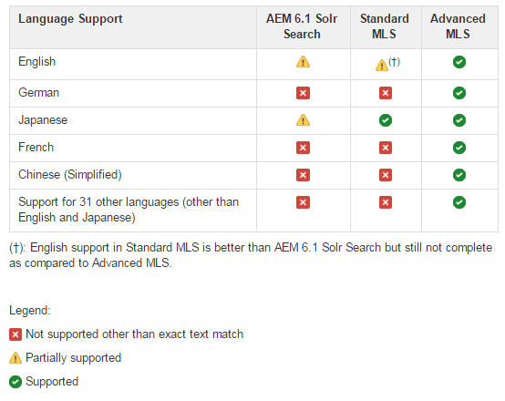

# Configurazione Solr per SRP {#solr-configuration-for-srp}

## Solr per piattaforma AEM {#solr-for-aem-platform}

Un [Apache Solr](https://lucene.apache.org/solr/) l&#39;installazione può essere condivisa tra [archivio nodi](../../help/sites-deploying/data-store-config.md) (Oak) e [negozio comune](working-with-srp.md) (SRP) utilizzando raccolte diverse.

Se le raccolte Oak e SRP vengono utilizzate intensamente, è possibile installare un secondo Solr per motivi di prestazioni.

Per ambienti di produzione, [Modalità SolrCloud](#solrcloud-mode) offre prestazioni migliori rispetto alla modalità autonoma (una singola configurazione Solr locale).

### Requisiti {#requirements}

Scarica e installa Apache Solr:

* [Versione 7.0](https://archive.apache.org/dist/lucene/solr/7.0.0/)

* Solr richiede Java 1.7 o versione successiva
* Nessun servizio necessario
* Scelta delle modalità di esecuzione:

   * Modalità autonoma
   * [Modalità SolrCloud](#solrcloud-mode) (consigliato per ambienti di produzione)

* Scelta della ricerca multilingue (MLS)

   * [Installazione di MLS standard](#installing-standard-mls)
   * [Installazione di MLS avanzate](#installing-advanced-mls)

## Modalità SolrCloud {#solrcloud-mode}

[SolrCloud](https://solr.apache.org/guide/6_6/solrcloud.html) la modalità è consigliata per gli ambienti di produzione. Quando si esegue in modalità SolrCloud, SolrCloud deve essere installato e configurato prima di installare MLS (Multilingual Search).

Si consiglia di seguire le istruzioni di installazione di SolrCloud:

* 3 nodi SolrCloud sullo stesso server.
* Un Apache ZooKeeper esterno.

Si consiglia inoltre di configurare JVM per ottimizzare l&#39;utilizzo della memoria e la raccolta degli oggetti inattivi.

### Esempio di configurazione JVM {#jvm-configuration-example}

```shell
JVM_OPTS="-server -Xmx2048m -XX:MaxPermSize=768M -XX:+UseConcMarkSweepGC -XX:+CMSClassUnloadingEnabled -Xloggc:../logs/gc.log -XX:+PrintGCDetails -XX:+PrintGCDateStamps -Djava.awt.headless=true"
```

### Comandi di installazione di SolrCloud {#solrcloud-setup-commands}

In modalità SolrCloud, prima dell&#39;installazione di MLS è necessario utilizzare e conoscere i seguenti comandi di configurazione di SolrCloud.

#### 1. Carica una configurazione su ZooKeeper {#upload-a-configuration-to-zookeeper}

Riferimento:
[https://cwiki.apache.org/confluence/display/solr/Command+Line+Utilities](https://cwiki.apache.org/confluence/display/solr/Command+Line+Utilities)

Utilizzo: sh ./scripts/cloud-scripts/zkcli.sh \
-cmd upconfig \
-zkhost *server:porta* \
-confname *myconfig-name *\
-solrhome *solr-home-path* \
-confdir *config-dir*

#### 2. Creare una raccolta {#create-a-collection}

Riferimento:
[https://cwiki.apache.org/confluence/display/solr/Solr+Start+Script+Reference#SolrStartScriptReference-Create](https://cwiki.apache.org/confluence/display/solr/Solr+Start+Script+Reference#SolrStartScriptReference-Create)

Utilizzo:
./bin/solr crea \
-c *mycollection-name*\
-d *config-dir* \
-n *myconfig-name* \
-p *porta*\
-s *numero di sezioni* \
-rf *numero di repliche*

#### 3. Collegare una raccolta a un set di configurazione {#link-a-collection-to-a-configuration-set}

Collega una raccolta a una configurazione già caricata su ZooKeeper.

Riferimento:
[https://cwiki.apache.org/confluence/display/solr/Command+Line+Utilities](https://cwiki.apache.org/confluence/display/solr/Command+Line+Utilities)

Utilizzo: sh ./scripts/cloud-scripts/zkcli.sh \
-cmd linkconfig \
-zkhost *server:porta* \
-collection *mycollection-name* \
-confname *myconfig-name*

### Confronto tra MLS standard e avanzate {#comparison-of-standard-and-advanced-mls}

Per la piattaforma Solr è stata creata la funzione di ricerca multilingue (MLS) per AEM Communities per fornire una ricerca migliore in tutte le lingue supportate, incluso l’inglese.

MLS per le comunità AEM è disponibile come MLS standard o MLS avanzate. MLS standard include solo le impostazioni di configurazione Solr ed esclude eventuali plug-in o file di risorse. La soluzione MLS avanzata è più completa e include le impostazioni di configurazione Solr, nonché i plug-in e le relative risorse

MLS standard include miglioramenti per la ricerca di contenuti per le seguenti lingue:

* Inglese: È stato migliorato lo stemmer per cercare di abbinare le derivazioni di parole.
* Giapponese: È stata migliorata la token giapponese per i caratteri a mezza larghezza.

MLS avanzate include miglioramenti per la ricerca di contenuti per le seguenti lingue:

* Inglese: Sgombro sostituito con limmatizzatore.
* Tedesco: È stato aggiunto decompositunder.
* Francese: È stata aggiunta la gestione delle elisioni.
* Cinese (semplificato): È stato aggiunto un token più intelligente.
* Varie lingue: È stato aggiunto uno stemmer, un elenco di stop word e un normalizzatore.

In tutto, le seguenti 33 lingue sono supportate in Advanced MLS.

| Arabo | Tedesco | Norvegese |
|---|---|---|
| Bulgaro | Greco | Polacco |
| Cinese (semplificato) | Creolo haitiano | Portoghese |
| Cinese (tradizionale) | Ebraico | Rumeno |
| Ceco | Ungherese | Russo |
| Danese | Indonesiano | Slovacco |
| Olandese | Italiano | Sloveno |
| Inglese | Giapponese | Spagnolo |
| Estone | Coreano | Svedese |
| Finlandese | Lettone | Thai |
| Francese | Lituano | Turco |

#### Confronto tra AEM 6.1 Solr search, MLS standard e MLS avanzate {#comparison-of-aem-solr-search-standard-mls-and-advanced-mls}

**Nota**: AEM 6.1 si riferisce al AEM 6.1 FP3 delle Comunità europee e versioni precedenti.



### Installazione di MLS standard {#installing-standard-mls}

Per la raccolta SRP (MSRP o DSRP), per supportare la ricerca multilingue standard (MLS) è necessario modificare due dei file di configurazione di Solr:

* **schema.xml**
* **solrconfig.xml**

File MLS standard (schema.xml, solrconfig.xml) per Solr 4.10.

File MLS standard (schema.xml, solrconfig.xml) per Solr 5.x.

I file MLS standard vengono memorizzati nell&#39;archivio AEM.

**Nota**: Mentre i file Solr sono memorizzati nella cartella msrp/ , sono anche per DSRP (non sono necessarie modifiche).

**Istruzioni per il download**: Sostituisci `solrX` con `solr4` o `solr5` se del caso.

1. Utilizzando CRXDE|Lite, individua:

   * `/libs/social/config/datastore/msrp/solrX/schema.xml`
   * `/libs/social/config/datastore/msrp/solrX/solrconfig.xml`

1. Scarica sul server locale in cui viene distribuito Solr.

   * Individua il `jcr:content` del nodo `jcr:data` proprietà.
   * Seleziona `view` per avviare il download.
   * Assicurati che i file siano salvati con i nomi e la codifica appropriati (UTF8).

1. Seguire le istruzioni di installazione per la modalità autonoma o SolrCloud.

#### Modalità SolrCloud - MLS standard {#solrcloud-mode-standard-mls}

1. Installa e configura Solr in modalità SolrCloud.
1. Prepara una nuova configurazione:

   1. Crea new-config-dir* come `solr-install-dir*/myconfig/`

   1. Copia il contenuto della directory di configurazione Solr esistente in *new-config-dir*

      * Per Solr4: copia `solr-install-dir/example/solr/collection1/conf/`
      * Per Solr5: copia `solr-install-dir/server/solr/configsets/data_driven_schema_configs/`
   1. Copia il download **schema.xml** e **solrconfig.xml** a *new-config-dir* per sovrascrivere i file esistenti.


1. [Carica la nuova configurazione](#upload-a-configuration-to-zookeeper) a ZooKeeper.
1. [Creare una raccolta](#create-a-collection) specifica dei parametri necessari, ad esempio il numero di condivisioni, il numero di repliche e il nome della configurazione.
1. Se il nome di configurazione era *non *fornito durante la creazione della raccolta, [collega questa nuova raccolta creata](#link-a-collection-to-a-configuration-set) con la configurazione caricata su ZooKeeper.

1. Per MSRP, esegui [Strumento di reindicizzazione MSRP](msrp.md#msrp-reindex-tool), a meno che non si tratti di una nuova installazione.

#### Modalità autonoma - MLS standard {#standalone-mode-standard-mls}

1. Installare Solr in modalità autonoma.
1. Se esegui Solr5, crea una raccolta1 (simile a Solr4):

   * `./bin/solr start`
   * `./bin/solr create_core -c collection1 -d sample_techproducts_configs`

1. Backup **schema.xml** e **solrconfig.xml** nella directory di configurazione Solr, ad esempio:

   * Per Solr4: `solr-install-dir/example/solr/collection1/conf/`
   * Creato per Solr5: `solr-install-dir/server/solr/collection1/conf/`

1. Copia il download **schema.xml** e **solrconfig.xml** in quella stessa directory.

1. Riavvia Solr.
1. Per MSRP, esegui [Strumento di reindicizzazione MSRP](#msrpreindextool), a meno che non si tratti di una nuova installazione.

### Installazione di MLS avanzate {#installing-advanced-mls}

Affinché la raccolta SRP (MSRP o DSRP) supporti MLS avanzate, sono necessari nuovi plug-in Solr oltre a uno schema personalizzato e una configurazione Solr. Tutti gli elementi richiesti vengono assemblati in un file zip scaricabile. Inoltre, è incluso uno script di installazione da utilizzare quando Solr viene distribuito in modalità autonoma.

Per ottenere il pacchetto MLS avanzato, vedi [MLS avanzate AEM](deploy-communities.md#aem-advanced-mls) nella sezione implementazione della documentazione.

Per iniziare a utilizzare l’installazione per SolrCloud o la modalità autonoma:

* Scarica archivio zip AEM-SOLR-MLS sul server che ospita Solr.
* Estrai l&#39;archivio.

#### Modalità SolrCloud - MLS avanzate {#solrcloud-mode-advanced-mls}

Istruzioni di installazione - notare alcune differenze per Solr4 e Solr5:

1. Installa e configura Solr in modalità SolrCloud.
1. Estrai il contenuto del pacchetto MLS avanzato su disco. Il contenuto deve includere:

   * **schema.xml**
   * **solrconfig.xml**
   * **stopwords/** cartella
   * **profili/** cartella
   * **extra-libs/** cartella

1. Prepara una nuova configurazione:

   1. Crea un *new-config-dir*

      * Ad esempio `solr-install-dir/myconfig/`
      * Creare sottocartelle `stopwords/` e `lang/`
   1. Copia il contenuto della directory di configurazione Solr esistente in *new-config-dir*

      * Per Solr4: Copia `solr-install-dir/example/solr/collection1/conf/`
      * Per Solr5: Copia `solr-install-dir/server/solr/configsets/data_driven_schema_configs/`
   1. Copia l&#39;estratto **schema.xml** e **solrconfig.xml** a *new-config-dir* per sovrascrivere i file esistenti.
   1. Per Solr5: Copia `solr_install_dir/server/solr/configsets/sample_techproducts_configs/conf/lang/*.txt` a `new-config-dir/lang/`
   1. Copia l&#39;estratto **stopwords/** cartella a *new-config-dir* con conseguente `new-config-dir/stopwords/*.txt`


1. [Carica la nuova configurazione](#upload-a-configuration-to-zookeeper) a ZooKeeper
1. Copia il nuovo **profili/** cartella ...

   * Per Solr4: Copia nelle risorse/cartella di ogni nodo
   * Per Solr5: Copia nella cartella server/resources/ di ogni installazione Solr. Se tutti i nodi si trovano nella stessa directory di installazione Solr, questo passaggio viene eseguito una sola volta.

1. Crea un **lib/** nella directory solr-home (contiene solr.xml) di ogni nodo in SolrCloud. Copia i file jar dalle seguenti posizioni nella nuova cartella lib/ su ogni nodo:

   * **extra-libs/** estratto dal pacchetto MLS avanzato
   * *solr-install-dir/citazione/estrazione/lib/*.jar
   * *solr-install-dir/dist/solr-cell*.jar
   * *solr-install-dir/citoflustering/lib/*.jar
   * *solr-install-dir/dist/solr-clustering*.jar
   * *solr-install-dir/citazione/langid/lib/*.jar
   * *solr-install-dir/dist/solr-langid*.jar
   * *solr-install-dir/citazione/velocity/lib/*.jar
   * *solr-install-dir/dist/solr-velocity*.jar
   * *solr-install-dir/Calcio/analysis-extras/lib/*.jar
   * *solr-install-dir/Calcio-extras/lucene-libs/*.jar

1. [Creare una raccolta](#create-a-collection) specifica dei parametri necessari, ad esempio il numero di condivisioni, il numero di repliche e il nome della configurazione.
1. Se il nome della configurazione era *not* forniti durante la creazione della raccolta, [collega questa nuova raccolta creata](#link-a-collection-to-a-configuration-set) con la configurazione caricata su ZooKeeper.

1. Per MSRP, esegui [Strumento di reindicizzazione MSRP](#msrpreindextool), a meno che non si tratti di una nuova installazione.

#### Modalità autonoma - MLS avanzate {#standalone-mode-advanced-mls}

Uno script di installazione è incluso nel pacchetto MLS avanzato.

Dopo aver estratto il contenuto del pacchetto sul server che ospita il server Solr autonomo, esegui semplicemente lo script di installazione per installare le risorse e i file di configurazione necessari.

* Installare Solr in modalità autonoma.
* Se esegui Solr5, crea una raccolta1 (simile a Solr4):

   * `./bin/solr start`
   * `./bin/solr create_core -c collection1 -d sample_techproducts_configs`

* Esegui lo script di installazione: Installa [-v 4|5] [-d solrhome] [-c percorso di raccolta]
dove:

   * -d solrhome

      Directory di installazione Solr

   * -c percorso di raccolta

      Percorso di raccolta in solr

   * --aiuto

      Opzioni della riga di comando Stampa

   * -v [4|5]

      Imposta versione per solr

* Esempio per Solr 4.10.4:

   * Install.bat -v 4 -d c:/solr-4.10.4 -c:/solr-4.10.4/example/solr/collection1

* Esempio per Solr 5.4.0:

   * Install.sh -v 5 -d /tmp/solr-5.4.0 -c /tmp/solr-5.4.0/server/solr/collection1

**Nota**:

* Lo script di installazione eseguirà il backup di schema.xml e solrconfig.xml prima di installare nuove versioni aggiungendo &quot;.orig&quot;

### Informazioni su solrconfig.xml {#about-solrconfig-xml}

La **solrconfig.xml** il file controlla l&#39;intervallo di commit automatico e la visibilità della ricerca e richiederà test e tuning.

`<autoCommit>`: Per impostazione predefinita, l&#39;intervallo AutoCommit, che è un commit difficile per lo storage stabile, è impostato su 15 secondi. Per impostazione predefinita, la visibilità della ricerca utilizza l’indice di pre-commit.

Per modificare la ricerca per utilizzare un indice aggiornato per riflettere le modifiche dovute al commit, cambia il contenuto `openSearcher` su true.

`autoSoftCommit`: Un commit &quot;soft&quot; assicura che le modifiche siano visibili (l&#39;indice viene aggiornato), ma non assicura che le modifiche siano sincronizzate con lo storage stabile (hard commit). Il risultato è un miglioramento delle prestazioni. Per impostazione predefinita, `autoSoftCommit` è disabilitato con il contenuto `maxTime` impostato su -1.
