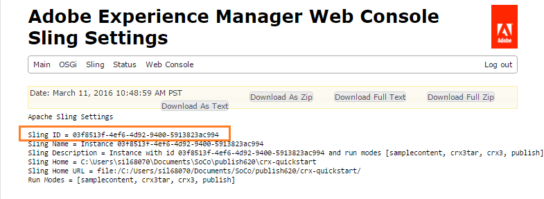

# Sincronizzazione utenti community {#communities-user-synchronization}

## Introduzione {#introduction}

Nelle community Adobe Experience Manager (AEM), dall’ambiente di pubblicazione (a seconda delle autorizzazioni configurate), *visitatori del sito* può diventare *membri*, creare *gruppi di utenti*, e modificarne le *profilo membro* .

*Dati utente* fa riferimento a *utenti*, *profili utente*, e *gruppi di utenti*.

*Membri* fare riferimento a *utenti* registrati nell’ambiente di pubblicazione, a differenza degli utenti registrati nell’ambiente di authoring.

Per ulteriori informazioni sui dati utente, visita [Gestione di utenti e gruppi di utenti](/help/communities/users.md).

## Sincronizzazione degli utenti in una farm di pubblicazione {#synchronizing-users-across-a-publish-farm}

Per progettazione, i dati utente creati nell’ambiente di pubblicazione non vengono visualizzati nell’ambiente di authoring.

La maggior parte dei dati utente creati nell’ambiente di authoring devono rimanere nell’ambiente di authoring e non vengono sincronizzati né replicati nelle istanze di pubblicazione.

Quando [topologia](/help/communities/topologies.md) è un [farm di pubblicazione](/help/sites-deploying/recommended-deploys.md#tarmk-farm), la registrazione e le modifiche effettuate su un’istanza Publish devono essere sincronizzate con altre istanze Publish. I membri devono essere in grado di accedere e visualizzare i propri dati su qualsiasi nodo Publish.

Quando la sincronizzazione utente è abilitata, i dati utente vengono sincronizzati automaticamente tra le istanze Publish nella farm.

### Istruzioni di configurazione di User Sync {#user-sync-setup-instructions}

Per istruzioni dettagliate su come abilitare la sincronizzazione in una farm di pubblicazione, consulta [Sincronizzazione utente](/help/sites-administering/sync.md).

## Sincronizzazione utente in background {#user-sync-in-the-background}


* **pacchetto vlt**

  Si tratta di un file zip di tutte le modifiche apportate in un editore, che deve essere distribuito tra gli editori. Le modifiche apportate a un editore generano eventi selezionati dal listener di eventi di modifica. In questo modo viene creato un pacchetto vlt contenente tutte le modifiche.

* **pacchetto di distribuzione**

  Contiene informazioni sulla distribuzione di Sling. Si tratta di informazioni su dove deve essere distribuito il contenuto e quando è stato distribuito per ultimo.

## Cosa Succede Quando... {#what-happens-when}

### Pubblica sito dalla console Siti di Communities {#publish-site-from-communities-sites-console}

Per gli autori, quando un sito community viene pubblicato da [Console Siti community](/help/communities/sites-console.md), l&#39;effetto è [replicare](/help/sites-deploying/configuring.md#replication-reverse-replication-and-replication-agents) Le pagine associate e Sling distribuiscono i gruppi di utenti community creati in modo dinamico, inclusa la loro appartenenza.

### L&#39;utente è stato creato o modifica il profilo al momento della pubblicazione {#user-is-created-or-edits-profile-on-publish}

Per progettazione, gli utenti e i profili creati nell’ambiente di pubblicazione (ad esempio mediante registrazione autonoma, accesso social, autenticazione LDAP) non vengono visualizzati nell’ambiente di authoring.

Quando la topologia è [farm di pubblicazione](/help/communities/topologies.md) e la sincronizzazione utente è stata configurata correttamente, il *utente* e *profilo utente* viene sincronizzato nella farm di pubblicazione utilizzando la distribuzione Sling.

### Nuovo gruppo community creato al momento della pubblicazione {#new-community-group-is-created-on-publish}

Anche se avviata da un’istanza Publish, la creazione del gruppo community, che si traduce in nuove pagine del sito e in un nuovo gruppo di utenti, si verifica in realtà nell’istanza Author.

Come parte del processo, le nuove pagine del sito vengono replicate in tutte le istanze Publish. Il gruppo utenti community creato in modo dinamico e i relativi membri sono Sling distribuiti a tutte le istanze Publish.

### Gli utenti o i gruppi di utenti vengono creati utilizzando la console Sicurezza {#users-or-user-groups-are-created-using-security-console}

Per progettazione, i dati utente creati nell’ambiente di pubblicazione non vengono visualizzati nell’ambiente di authoring e viceversa.

Quando [Amministrazione utenti e sicurezza](/help/sites-administering/security.md) La console viene utilizzata per aggiungere nuovi utenti nell’ambiente di pubblicazione. Se necessario, la sincronizzazione utenti sincronizza i nuovi utenti e la loro appartenenza al gruppo con altre istanze di pubblicazione. La sincronizzazione degli utenti sincronizza anche i gruppi di utenti creati tramite la console di sicurezza.

### L&#39;utente pubblica il contenuto al momento della pubblicazione {#user-posts-content-on-publish}

Per i contenuti generati dagli utenti (UGC, User-Generated Content), i dati immessi in un’istanza Publish sono accessibili tramite [SRP configurato](/help/communities/srp-config.md).

## Best practice {#bestpractices}

Per impostazione predefinita, la sincronizzazione utente è **disabilitato**. Per abilitare la sincronizzazione degli utenti è necessario modificare *esistente* Configurazioni OSGi. Non è possibile aggiungere nuove configurazioni abilitando la sincronizzazione degli utenti.

La sincronizzazione degli utenti si basa sull’ambiente di authoring per gestire le distribuzioni dei dati utente, anche se i dati utente non vengono creati sull’ambiente di authoring.

**Prerequisiti**

1. Se utenti e gruppi di utenti sono già stati creati in un editore, si consiglia di: [sincronizzazione manuale](/help/sites-administering/sync.md#manually-syncing-users-and-user-groups) i dati utente a tutti gli editori prima di configurare e abilitare la sincronizzazione utente.

   Dopo l&#39;abilitazione della sincronizzazione degli utenti, vengono sincronizzati solo gli utenti e i gruppi appena creati.

1. Verifica che sia stato installato il codice più recente:

   * [Aggiornamenti della piattaforma AEM](https://helpx.adobe.com/it/experience-manager/kb/aem62-available-hotfixes.html)
   * [Aggiornamenti di AEM Communities](/help/communities/deploy-communities.md#latestfeaturepack)

Per abilitare la sincronizzazione degli utenti in AEM Communities sono necessarie le seguenti configurazioni. Assicurati che queste configurazioni siano corrette per evitare errori di distribuzione del contenuto Sling.

### Agente di distribuzione Apache Sling - Factory agenti di sincronizzazione {#apache-sling-distribution-agent-sync-agents-factory}

Questa configurazione recupera il contenuto da sincronizzare tra gli editori. La configurazione si trova nell’istanza di authoring. L’autore deve tenere traccia di tutti gli editori che sono presenti e dove sincronizzare tutte le informazioni.

I valori predefiniti nella configurazione si riferiscono a una singola istanza di pubblicazione. Poiché la sincronizzazione degli utenti è utile per sincronizzare più istanze di pubblicazione, ad esempio per una farm di pubblicazione, è necessario aggiungere alla configurazione ulteriori istanze di pubblicazione.

**Come viene sincronizzato il contenuto?**

L’istanza di authoring esegue il ping dell’endpoint di esportazione degli editori. Ogni volta che un utente viene creato o aggiornato su specifici editori (n), l’autore ottiene il contenuto dai propri endpoint di esportazione e [invia il contenuto](/help/communities/sync.md#main-pars-image-1413756164) ad altri editori (n-1, ossia a parte gli editori da cui viene recuperato il contenuto).

Per configurare la configurazione degli agenti di sincronizzazione Apache Sling:

1. Accedi con privilegi di amministratore all’istanza di authoring AEM.
1. Accedere a [Console web](/help/sites-deploying/configuring-osgi.md). Ad esempio: [https://localhost:4502/system/console/configMgr](https://localhost:4502/system/console/configMgr).
1. Individua **Agente di distribuzione Apache Sling - Factory agenti di sincronizzazione**.

   * Seleziona la configurazione esistente da aprire per la modifica (icona a forma di matita).

     Nome verifica: **socialpubsync**

   * Seleziona la casella di controllo **Abilitato**.
   * Seleziona **Utilizzare più code.**
   * Specifica **Endpoint esportazione** e **Endpoint importazione** (puoi aggiungere altri endpoint di esportazione e importazione).

     Questi endpoint definiscono dove desideri ottenere il contenuto e da dove desideri inviarlo. L’autore recupera il contenuto dall’endpoint di esportazione specificato e lo invia agli editori (diversi dall’editore da cui ha recuperato il contenuto).

   

### Adobe Granite Distribution - Provider segreto di trasporto con password crittografata {#adobe-granite-distribution-encrypted-password-transport-secret-provider}

Consente all’autore di identificare l’utente autorizzato come autorizzato a sincronizzare i dati utente dall’autore alla pubblicazione.

Il [utente autorizzato creato](/help/sites-administering/sync.md#createauthuser) su tutte le istanze di pubblicazione consente agli editori di connettersi con l’autore e configurare la distribuzione Sling sull’autore. Questo utente autorizzato dispone di tutti i requisiti [ACL](/help/sites-administering/sync.md#howtoaddacl).

Ogni volta che i dati devono essere installati o recuperati dagli editori, l’autore si connette agli editori utilizzando le credenziali (nome utente e password) impostate in questa configurazione.

Per connettere l’autore agli editori che utilizzano un utente autorizzato:

1. Accedi con privilegi di amministratore all’istanza di authoring AEM.
1. Accedere a [Console web](/help/sites-deploying/configuring-osgi.md).

   Ad esempio: [https://localhost:4502/system/console/configMgr](https://localhost:4502/system/console/configMgr).
1. Individua **Adobe Granite Distribution - Provider segreto di trasporto per password crittografata.**
1. Seleziona la configurazione esistente da aprire per la modifica (icona a forma di matita).

   Verifica proprietà **socialpubsync** - **publishUser.**

1. Imposta il nome utente e la password su [utente autorizzato](/help/sites-administering/sync.md#createauthorizeduser).

   Ad esempio: **usersync - admin**


### Agente di distribuzione Apache Sling - Factory agenti coda {#apache-sling-distribution-agent-queue-agents-factory}

Questa configurazione viene utilizzata per configurare i dati da sincronizzare tra gli editori. Quando i dati vengono creati/aggiornati nei percorsi specificati in **Directory principali consentite**, il &quot;var/community/distribution/diff&quot; viene attivato e il replicatore creato recupera i dati da un editore e li installa su altri editori.

Per configurare i dati (percorsi dei nodi) da sincronizzare:

1. Accedi con privilegi di amministratore all’istanza di pubblicazione.
1. Accedere a [Console web](/help/sites-deploying/configuring-osgi.md).

   Ad esempio: [https://localhost:4503/system/console/configMgr](https://localhost:4503/system/console/configMgr).

1. Individua **Agente di distribuzione Apache Sling - Factory agenti coda**.
1. Seleziona la configurazione esistente da aprire per la modifica (icona a forma di matita).

   Nome verifica: **socialpubsync - inverso**

1. Seleziona la **Abilitato** e salvare.
1. Specificare i percorsi dei nodi da replicare in **Directory principali consentite**.
1. Ripeti per ogni **pubblicare** dell&#39;istanza.

   

### Adobe Granite Distribution - Diff Observer Factory {#adobe-granite-distribution-diff-observer-factory}

Questa configurazione sincronizza l&#39;appartenenza ai gruppi tra gli editori.
Se la modifica dell&#39;appartenenza di un gruppo in un editore non comporta l&#39;aggiornamento dell&#39;appartenenza ad altri editori, verificare che **ref :members** viene aggiunto a **nomi delle proprietà cercate**.

Per garantire la sincronizzazione dei membri:

1. Accedi con privilegi di amministratore all’istanza di pubblicazione.
1. Accedere a [Console web](/help/sites-deploying/configuring-osgi.md).

   Ad esempio: [https://localhost:4503/system/console/configMgr](https://localhost:4503/system/console/configMgr).

1. Individua **Adobe Granite Distribution - Diff Observer Factory**.
1. Seleziona la configurazione esistente da aprire per la modifica (icona a forma di matita).

   Verifica **nome agente: socialpubsync -reverse**.

1. Seleziona la casella di controllo **Abilitato**.
1. Specifica **rappresentazione:membri** come descrizione per propertyName in **nomi delle proprietà cercate**, e Salva.

   

### Trigger di distribuzione Apache Sling - Factory dei trigger pianificati {#apache-sling-distribution-trigger-scheduled-triggers-factory}

Questa configurazione consente di configurare l’intervallo di polling (dopo il quale viene eseguito il ping degli editori e le modifiche vengono estratte dall’autore) per sincronizzare le modifiche tra gli editori.

L’autore esegue il polling degli editori ogni 30 secondi (impostazione predefinita). Se sono presenti pacchetti nella cartella `/var/sling/distribution/packages/  socialpubsync -  vlt /shared`, quindi recupera tali pacchetti e li installa su altri editori.

Per modificare l&#39;intervallo di polling:

1. Accedi con privilegi di amministratore all’istanza di authoring AEM.
1. Accedere a [Console web](/help/sites-deploying/configuring-osgi.md)ad esempio: [https://localhost:4502/system/console/configMgr](https://localhost:4502/system/console/configMgr)
1. Individua **Trigger di distribuzione Apache Sling - Factory dei trigger pianificati**

   * Seleziona la configurazione esistente da aprire per la modifica (icona a forma di matita).

     Verifica **socialpubsync -scheduled-trigger**

   * Imposta l’intervallo in secondi sull’intervallo desiderato, quindi salva.

   

### Listener di sincronizzazione utenti AEM Communities {#aem-communities-user-sync-listener}

Per i problemi nella distribuzione Sling in cui si verifica una discrepanza negli abbonamenti e nei seguenti, controlla se le seguenti proprietà in **Listener di sincronizzazione utenti AEM Communities** le configurazioni sono impostate:

* NodeTypes
* IgnorableProperties
* IgnorableNodes
* Cartelle distribuite

Per sincronizzare sottoscrizioni, operazioni e notifiche

Su ogni istanza di pubblicazione AEM:

1. Accedi con privilegi di amministratore.
1. Accedere a [Console web](/help/sites-deploying/configuring-osgi.md). Ad esempio: [https://localhost:4503/system/console/configMgr](https://localhost:4503/system/console/configMgr).
1. Individua **Listener di sincronizzazione utenti AEM Communities**.
1. Seleziona la configurazione esistente da aprire per la modifica (icona a forma di matita)

   Nome verifica: **socialpubsync -scheduled-trigger**

1. Imposta quanto segue **NodeTypes**:

   `rep:User`

   `nt:unstructured`

   `nt:resource`

   `rep:ACL`

   `sling:Folder`

   `sling:OrderedFolder`

   I tipi di nodo specificati in questa proprietà vengono sincronizzati e le informazioni sulle notifiche (blog e configurazioni seguite) vengono sincronizzate tra diversi editori.

1. Aggiungi tutte le cartelle da sincronizzare in **Cartelle distribuite**. Ad esempio:

   `segments/scoring`

   `social/relationships`

   `activities`

1. Imposta il **ignorablenodes** a:

   `.tokens`

   `system`

   `rep:cache` poiché utilizziamo sessioni permanenti, non è necessario sincronizzare questo nodo con altri editori.

   

### ID Sling univoco {#unique-sling-id}

L’istanza di authoring dell’AEM utilizza l’ID Sling per identificare da dove provengono i dati e a quali editori deve (o non deve) inviare nuovamente il pacchetto a.

Assicurati che tutti gli editori in una farm di pubblicazione abbiano un ID Sling univoco. Se l’ID Sling è lo stesso per più istanze di pubblicazione in una farm di pubblicazione, la sincronizzazione degli utenti non riesce. Poiché l’autore non saprà da dove recuperare il pacchetto e dove installarlo.

Per garantire un ID Sling univoco degli editori nella farm di pubblicazione, in ogni istanza di pubblicazione:

1. Sfoglia per [https://_host:porta_/system/console/status-slingsettings](https://localhost:4503/system/console/status-slingsettings).
1. Controlla il valore di **ID Sling**.

   

   Se l’ID Sling di un’istanza Publish corrisponde all’ID Sling di qualsiasi altra istanza Publish:

1. Arresta una delle istanze Publish con un ID Sling corrispondente.
1. In `crx-quickstart/launchpad/felix` directory, cercare ed eliminare il file denominato *sling.id.file*

   Ad esempio, su un sistema Linux:

   `rm -i $(find . -type f -name sling.id.file)`

   Ad esempio, in un sistema Windows:

   Utilizzare Esplora risorse e cercare `sling.id.file`

1. Avvia l’istanza Publish. All’avvio gli viene assegnato un nuovo ID Sling.
1. Verifica che **ID Sling** è ora univoco.

Ripeti questi passaggi fino a quando tutte le istanze Publish non hanno un ID Sling univoco.

### Generatore pacchetti Vault - Fabbrica {#vault-package-builder-factory}

Per sincronizzare correttamente gli aggiornamenti, è necessario modificare il generatore di pacchetti di Vault per la sincronizzazione utente.
In entrata `/home/users`, a `*/rep:cache` viene creato il nodo. Si tratta di una cache utilizzata per rilevare che se eseguiamo una query sul nome principale di un nodo, questa cache può essere utilizzata direttamente.

La sincronizzazione degli utenti può essere interrotta se `rep :cache` i nodi vengono sincronizzati tra gli editori.

Per garantire che gli aggiornamenti vengano sincronizzati correttamente tra gli editori, su ogni istanza di pubblicazione AEM:

1. Accedere a [Console web](/help/sites-deploying/configuring-osgi.md)

   Ad esempio: [https://localhost:4503/system/console/configMgr](https://localhost:4503/system/console/configMgr).
1. Individua il **Pacchetto di distribuzione Apache Sling - Vault Package Builder Factory**

   Nome generatore: socialpubsync-vlt.

1. Seleziona l’icona Modifica.
1. Aggiungi due filtri per nodo pacchetto:
   * `/home/users|-.*/.tokens`
   * `/home/users|-.*/rep:cache`
1. Gestione delle policy
   * Per sovrascrivere i nodi rep :policy esistenti con nuovi nodi, aggiungi un terzo filtro pacchetto: `/home/users|+.*/rep:policy`
   * Per impedire la distribuzione dei criteri, impostare: `Acl Handling: IGNORE`

   

## Risolvere i problemi relativi alla distribuzione Sling in AEM Communities {#troubleshoot-sling-distribution-in-aem-communities}

Se la distribuzione Sling non riesce, prova i seguenti passaggi di debug:

1. **Controlla [configurazioni aggiunte in modo errato](/help/sites-administering/sync.md#improperconfig)**

   Assicurati che non vengano aggiunte o modificate più configurazioni; è invece necessario modificare le configurazioni predefinite esistenti.
1. **Verifica configurazioni**

   Assicurati che tutte le [Configurazioni](/help/communities/sync.md#bestpractices) sono impostati in modo appropriato nell’istanza di creazione dell’AEM, come indicato nella [Best practice](/help/communities/sync.md#main-pars-header-863110628).

1. **Verifica autorizzazioni utente autorizzate**

   Se i pacchetti non sono installati correttamente, verifica che [utente autorizzato](/help/sites-administering/sync.md#createauthuser) creato nella prima istanza Publish con gli ACL corretti.

   Per convalidarlo, al posto della [utente autorizzato creato](/help/sites-administering/sync.md#createauthuser) modificare la [Adobe Granite Distribution - Provider segreto di trasporto con password crittografata](/help/sites-administering/sync.md#adobegraniteencpasswrd) configurazione nell’istanza Autore per utilizzare le credenziali utente Amministratore. Ora prova a installare di nuovo i pacchetti. Se la sincronizzazione degli utenti funziona correttamente con le credenziali di amministratore, significa che l’utente Publish creato non disponeva di ACL appropriati.

1. **Verifica configurazione Diff Observer Factory**

   Se nella farm di pubblicazione non vengono sincronizzati solo nodi specifici, ad esempio i membri del gruppo non vengono sincronizzati, assicurati che il [Adobe Granite Distribution - Diff Observer Factory](/help/sites-administering/sync.md#diffobserver) la configurazione è abilitata e **rep: members** sono impostati in **nomi delle proprietà cercate**.

1. **Controlla la configurazione del listener di sincronizzazione utenti di AEM Communities.** Se gli utenti creati sono sincronizzati ma le sottoscrizioni e i seguenti non funzionano, assicurati che la configurazione del listener di sincronizzazione utenti di AEM Communities disponga di:

   * Tipi di nodo- Impostato su **rep:User, nt:unstructured**, **nt:resource**, **rep:ACL**, **sling:Cartella**, e **sling:OrderedFolder**.
   * Nodi ignorabili - impostati su **.token**, **sistema**, e **rep :cache**.
   * Cartelle distribuite: impostare le cartelle che si desidera distribuire.

1. **Verifica i registri generati durante la creazione dell’utente nell’istanza di pubblicazione**

   Se le configurazioni di cui sopra sono impostate in modo appropriato ma la sincronizzazione utente non funziona, controlla i registri generati al momento della creazione dell’utente.

   Verifica se l’ordine dei registri è lo stesso, come segue:

   ```shell
   15.05.2016 18:33:01.523 *INFO* [sling-oak-observation-7422] com.adobe.cq.social.sync.impl.PublisherSyncServiceImpl Handing these paths to the distribution subsystem: [/home/users/C, /home/users/C/Cw-5avWqilmqsNn5hCvK]
   15.05.2016 18:33:01.523 *INFO* [sling-oak-observation-7422] org.apache.sling.distribution.agent.impl.SimpleDistributionAgent [agent][socialpubsync-reverse] REQUEST-START DSTRQ2: ADD paths=[/home/users/C, /home/users/C/Cw-5avWqilmqsNn5hCvK], user=communities-user-admin
   15.05.2016 18:33:01.523 *INFO* [sling-oak-observation-7431] com.adobe.cq.social.sync.impl.PublisherSyncServiceImpl Handing these paths to the distribution subsystem: [/home/users/C/Cw-5avWqilmqsNn5hCvK, /home/users/C/Cw-5avWqilmqsNn5hCvK/profile, /home/users/C/Cw-5avWqilmqsNn5hCvK/rep:policy]
   15.05.2016 18:33:01.523 *INFO* [sling-oak-observation-7431] org.apache.sling.distribution.agent.impl.SimpleDistributionAgent [agent][socialpubsync-reverse] REQUEST-START DSTRQ3: ADD paths=[/home/users/C/Cw-5avWqilmqsNn5hCvK, /home/users/C/Cw-5avWqilmqsNn5hCvK/profile, /home/users/C/Cw-5avWqilmqsNn5hCvK/rep:policy], user=communities-user-admin
   15.05.2016 18:33:01.757 *INFO* [sling-oak-observation-7431] org.apache.jackrabbit.vault.packaging.impl.JcrPackageDefinitionImpl unwrapping package sling/distribution:socialpubsync-vlt_1463337181554_ebb27ad9-a861-4405-9342-d64c916654e2:0.0.1
   15.05.2016 18:33:01.820 *INFO* [sling-oak-observation-7422] org.apache.jackrabbit.vault.packaging.impl.JcrPackageDefinitionImpl unwrapping package sling/distribution:socialpubsync-vlt_1463337181554_58811273-5861-48fe-95d2-4aff367b99c3:0.0.1
   15.05.2016 18:33:02.023 *INFO* [sling-oak-observation-7430] com.adobe.cq.social.sync.impl.PublisherSyncServiceImpl Handing these paths to the distribution subsystem: [/home/users/C/Cw-5avWqilmqsNn5hCvK/profile]
   15.05.2016 18:33:02.023 *INFO* [sling-oak-observation-7430] org.apache.sling.distribution.agent.impl.SimpleDistributionAgent [agent][socialpubsync-reverse] REQUEST-START DSTRQ4: ADD paths=[/home/users/C/Cw-5avWqilmqsNn5hCvK/profile], user=communities-user-admin
   15.05.2016 18:33:02.273 *INFO* [sling-oak-observation-7430] org.apache.jackrabbit.vault.packaging.impl.JcrPackageDefinitionImpl unwrapping package sling/distribution:socialpubsync-vlt_1463337182039_f34f4fa6-10b9-42eb-8740-4da9d4d38f99:0.0.1
   ```

Per eseguire il debug:

1. Disattiva la sincronizzazione utente:
1. Nell’istanza di authoring AEM, accedi con privilegi di amministratore.

   1. Accedere a [Console web](/help/sites-deploying/configuring-osgi.md). Ad esempio: [https://localhost:4502/system/console/configMgr](https://localhost:4502/system/console/configMgr).
   1. Individua la configurazione **Agente di distribuzione Apache Sling - Factory agenti di sincronizzazione**.
   1. Deseleziona il **Abilitato** casella di controllo.

      Quando si disabilita la sincronizzazione utente nell’istanza di authoring (esportazione e importazione), gli endpoint vengono disabilitati e l’istanza di authoring è statica. Il **vlt** i pacchetti non vengono ping o recuperati dall’autore.

      Ora, se un utente viene creato nell’istanza di pubblicazione, il **vlt** il pacchetto viene creato in */var/sling/distribution/packages/ socialpubsync - vlt /data* nodo. E se questi pacchetti vengono inviati dall’autore a un altro servizio. Puoi scaricare ed estrarre questi dati per verificare quali proprietà vengono inviate ad altri servizi.

1. Passare a un editore e creare un utente nell&#39;editore. Di conseguenza, vengono creati gli eventi.
1. Controlla la [ordine dei registri](/help/communities/sync.md#troubleshoot-sling-distribution-in-aem-communities) creato al momento della creazione dell’utente.
1. Controlla se **vlt** pacchetto creato il **/var/sling/distribution/packages/socialpubsync-vlt/data**.
1. Ora abilita la sincronizzazione degli utenti nell’istanza Autore AEM.
1. In caso di pubblicazione, modifica gli endpoint di esportazione o importazione in **Agente di distribuzione Apache Sling - Factory agenti di sincronizzazione**.
Possiamo scaricare ed estrarre i dati del pacchetto per verificare tutte le proprietà inviate ad altri editori e quali dati vengono persi.
