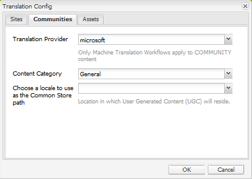

# Traduzione di contenuti generati dagli utenti {#translating-user-generated-content}

La funzione di traduzione per AEM Communities estende il concetto di [traduzione del contenuto della pagina](../../help/sites-administering/translation.md) al contenuto generato dall&#39;utente (UGC) pubblicato nei siti della community utilizzando i componenti [SCF (social component framework)](scf.md).

La traduzione di UGC consente ai visitatori e ai membri del sito di sperimentare una comunità globale rimuovendo le barriere linguistiche.

Ad esempio, supponi:

* Un membro della Francia pubblica una ricetta in francese al forum comunitario di un sito web di cucina multinazionale.
* Un altro membro del Giappone utilizza la funzione di traduzione per attivare la traduzione della ricetta dal francese al giapponese.
* Dopo aver letto la ricetta in giapponese, il membro giapponese ha poi pubblicato un commento in giapponese.
* Il membro francese utilizza la funzione di traduzione per tradurre il commento giapponese in francese.
* Comunicazione globale.

## Panoramica {#overview}

Questa sezione della documentazione illustra in modo specifico il funzionamento del servizio di traduzione con UGC, presupponendo una comprensione su come connettersi AEM a un [provider di servizi di traduzione](../../help/sites-administering/translation.md#connectingtoatranslationserviceprovider) e integrare tale servizio in un sito web configurando un [framework di integrazione della traduzione](../../help/sites-administering/tc-tic.md).

Quando un fornitore di servizi di traduzione è associato al sito, ogni copia del sito mantiene i propri thread di UGC pubblicati tramite componenti SCF, come i commenti.

Quando un framework di integrazione della traduzione è configurato in aggiunta al provider di servizi di traduzione, è possibile per ogni copia del sito di condividere un singolo thread di UGC, fornendo così la comunicazione globale tra le copie della lingua. Invece di un thread di discussione segregato per lingua, l&#39; [archivio condiviso globale configurato](#global-translation-of-ugc) consente all&#39;intero thread di essere visibile indipendentemente dalla copia della lingua che viene visualizzata. Inoltre, è possibile configurare più configurazioni di integrazione della traduzione specificando diversi archivi globali condivisi per un raggruppamento logico di partecipanti globali, ad esempio per aree geografiche.

## Servizio di traduzione predefinito {#the-default-translation-service}

AEM Communities include una [licenza di prova](../../help/sites-administering/tc-msconf.md#microsoft-translator-trial-license) per un [servizio di traduzione predefinito](../../help/sites-administering/tc-msconf.md) abilitato per diverse lingue.

Quando [crei un sito community](sites-console.md), il servizio di traduzione predefinito viene attivato quando `Allow Machine Translation` viene selezionato dal sottopannello [TRADUZIONE](sites-console.md#translation) .

>[!CAUTION]
>
>Il servizio di traduzione predefinito è solo a scopo dimostrativo.
>
>Per un sistema di produzione, è necessario un servizio di traduzione concesso in licenza. Se non si dispone di una licenza, il servizio di traduzione predefinito deve essere [disattivato](../../help/sites-administering/tc-msconf.md#microsoft-translator-trial-license-geometrixx-outdoors).

## Traduzione globale di UGC {#global-translation-of-ugc}

Quando un sito web ha più [copie per lingua](../../help/sites-administering/tc-prep.md), il servizio di traduzione predefinito non riconosce che l&#39;UGC immesso su un sito può essere correlato all&#39;UGC inserito su un altro, come quando l&#39;UGC è, essenzialmente, generato dallo stesso componente (la copia per lingua della pagina contenente il componente).

È simile a gruppi di persone che discutono di un argomento che non sanno dei commenti fatti in gruppi diversi dal proprio, rispetto a tutti in un grande gruppo che partecipa a una conversazione.

Se si desidera &quot;una conversazione di gruppo&quot;, è possibile abilitare la traduzione globale in un sito web con più copie in lingua, in modo che l&#39;intero thread sia visibile indipendentemente dalla copia in lingua che viene visualizzata.

Ad esempio, se un forum è stato creato sul sito di base, le copie della lingua create e la traduzione globale è stata abilitata, un argomento pubblicato nel forum creato in una copia della lingua apparirà in tutte le copie della lingua. Lo stesso vale per tutte le risposte, indipendentemente dalla lingua da cui è stata inserita la copia della risposta. Il risultato sarebbe che l&#39;argomento e l&#39;intero thread di risposte sarebbero visibili indipendentemente dalla lingua da cui l&#39;argomento viene visualizzato.

>[!CAUTION]
>
>Qualsiasi UGC esistente prima della traduzione globale non è più visibile.
>
>Mentre l&#39;UGC si trova ancora nell&#39; [archivio comune](working-with-srp.md), si trova nella posizione UGC specifica per la lingua, mentre il nuovo contenuto, aggiunto dopo la configurazione della traduzione globale, viene recuperato dalla posizione dell&#39;archivio condiviso globale.
>
>Non esiste uno strumento di migrazione per spostare o unire contenuti specifici per le lingue nell’archivio condiviso globale.

### Configurazione integrazione traduzione {#translation-integration-configuration}

Per creare una nuova integrazione di traduzione, che integra un connettore del servizio di traduzione con il sito web nell’istanza di authoring:

* Accesso come amministratore
* Dal menu principale 
* Seleziona **[!UICONTROL Strumenti]**
* Seleziona **[!UICONTROL Operazioni]**
* Seleziona **[!UICONTROL Cloud]**
* Seleziona **[!UICONTROL Cloud Services]**
* Scorri verso il basso fino a **[!UICONTROL Integrazione di traduzione]**

   

* Seleziona **[!UICONTROL Mostra configurazioni]**

   

* Seleziona l&#39;icona `[+]` accanto a **[!UICONTROL Configurazioni disponibili]** per creare una nuova configurazione

#### Finestra di dialogo Crea configurazione {#create-configuration-dialog}

* **[!UICONTROL Configurazione elemento padre]**

   (Obbligatorio) In genere lascia come impostazione predefinita. Il valore predefinito è `/etc/cloudservices/translation`.

* **[!UICONTROL Titolo]**

   (Obbligatorio) Inserisci un titolo di visualizzazione a scelta. Nessun valore predefinito.

* **[!UICONTROL Nome]**

   (Facoltativo) Immetti un nome per la configurazione. L’impostazione predefinita è un nome di nodo basato sul titolo.

* Seleziona **[!UICONTROL Crea]**

#### Finestra di dialogo Configurazione traduzione {#translation-config-dialog}

Per istruzioni dettagliate, visita [Creazione di una configurazione dell&#39;integrazione di traduzione](../../help/sites-administering/tc-tic.md#creating-a-translation-integration-configuration)

* **** Set di file: può essere lasciato come predefinito.

* **** Communitiestab:
   * **[!UICONTROL Provider di traduzioneSelezionare il provider di traduzione dall&#39;elenco a discesa.]**
Il valore predefinito è 
`microsoft`, il servizio di valutazione.

   * **[!UICONTROL Content]**
CategorySeleziona una categoria che descrive il contenuto da tradurre. Il valore predefinito è 
`General.`

   * **[!UICONTROL Scegli Un&#39;Impostazione Internazionale...]**
(Facoltativo) Selezionando le impostazioni internazionali per la memorizzazione degli UGC, i post di tutte le copie della lingua verranno visualizzati in una conversazione globale. Per convenzione, scegli le impostazioni internazionali della [lingua di base](sites-console.md#translation) per il sito web. Se scegli `No Common Store`, la traduzione globale verrà disabilitata. Per impostazione predefinita, la traduzione globale è disabilitata.

* **** Scheda attività: può essere lasciato come predefinito.
* Seleziona **[!UICONTROL OK]**

#### Attivazione {#activation}

Il nuovo servizio cloud di integrazione della traduzione dovrà essere attivato nell’ambiente di pubblicazione. Se associato a un sito web, se non ancora attivato, il flusso di lavoro di attivazione richiede di pubblicare la configurazione del servizio cloud quando viene pubblicata la pagina a cui è associato.

## Gestione delle impostazioni di traduzione {#managing-translation-settings}

>[!NOTE]
>
>**Lingua preferita**
>
>Al fine di rilevare se il post si trova in una lingua diversa da quella preferita, è necessario stabilire la lingua preferita del visitatore del sito.
>
>La lingua preferita è quella impostata nel profilo di un utente quando il visitatore del sito ha effettuato l’accesso e ha specificato una preferenza di lingua.
>
>Quando il visitatore del sito è anonimo o non ha specificato una preferenza di lingua nel suo profilo, la lingua preferita è la lingua di base del modello di pagina.

### Preferenze utente {#user-preference}

#### Profilo utente {#user-profile}

Tutti i siti di Communities forniscono un profilo utente che può essere modificato per identificarsi nella community e impostare le relative preferenze.

Una di queste impostazioni è decidere se visualizzare o meno i contenuti della community nella lingua preferita. Per impostazione predefinita, l’impostazione non è impostata e viene impostata automaticamente sull’impostazione di sistema. L&#39;utente può modificare l&#39;impostazione su On o Off, ignorando così l&#39;impostazione del sistema.

Quando le pagine vengono tradotte automaticamente nella lingua preferita dall’utente, l’interfaccia utente per la visualizzazione del testo originale e il miglioramento della traduzione è ancora disponibile.

### Impostazione sito community {#community-site-setting}

Quando viene creato un sito community, l’opzione di traduzione può essere abilitata e configurata. L’impostazione di traduzione è attiva per i contenuti che possono essere visualizzati da visitatori anonimi del sito, ma viene bypassata dall’impostazione di profilo dell’utente.
