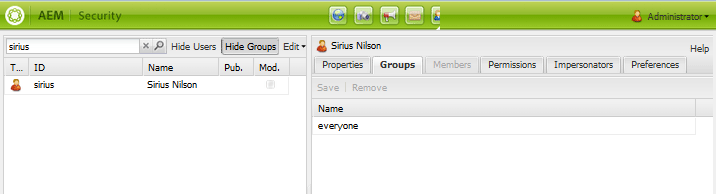
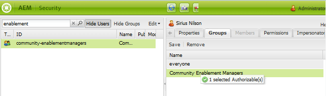

# Managing Users and User Groups {#managing-users-and-user-groups}

## Panoramica {#overview}

In  AEM Communities, nell’ambiente di pubblicazione, gli utenti possono registrarsi autonomamente e modificare i propri profili. Considerate le autorizzazioni appropriate, possono anche:

* Create sub-community all&#39;interno del sito della community (vedete Gruppi [](creating-groups.md)della community).

* [Contenuto generato dall](moderation.md) ’utente moderato (UGC).

* Abilita [contatti risorse](resources.md) .

* Sii [privilegiato](#privileged-members-group) per creare post per blog, calendari, QnA e forum.

Gli utenti registrati nell’ambiente di pubblicazione sono generalmente denominati membri della *community (membri)* per distinguerli dagli *utenti* nell’ambiente di authoring.

Le autorizzazioni vengono concesse assegnando i membri a uno dei gruppi [](#publish-group-roles) membri (utenti) creati dinamicamente quando il sito community viene [creato](sites-console.md) o [modificato](sites-console.md#modifying-site-properties) dall&#39;ambiente di authoring. Quando si lavora dall’ambiente di authoring, i membri sono visibili dall’ambiente di pubblicazione tramite il servizio [](#tunnel-service)tunnel.

Per impostazione predefinita, i membri e i gruppi di membri creati nell’ambiente di pubblicazione non devono essere visualizzati nell’ambiente di authoring. Gli utenti e i gruppi di utenti creati nell’ambiente di authoring hanno lo stesso scopo di rimanere nell’ambiente di authoring.

Quando gli utenti autori e i membri al momento della pubblicazione provengono dallo stesso elenco di utenti, ad esempio sincronizzati dalla stessa directory LDAP, non vengono considerati lo stesso utente con le stesse autorizzazioni e appartenenza al gruppo sia nell’ambiente di creazione che nell’ambiente di pubblicazione. I ruoli dei membri e degli utenti devono essere stabiliti separatamente al momento della pubblicazione e dell’autore, a seconda dei casi.

Per una farm [di](topologies.md)pubblicazione, la registrazione e le modifiche apportate a un’istanza di pubblicazione devono essere sincronizzate con altre istanze di pubblicazione per consentire loro di accedere agli stessi dati utente. Per informazioni dettagliate, consultate Sincronizzazione [](sync.md)utente, che include una sezione che descrive [cosa accade quando...](sync.md#what-happens-when).

### Limiti per contributi {#contribution-limits}

Al fine di proteggere contro lo spam, è possibile limitare la frequenza di pubblicazione dei contenuti da parte dei membri. Inoltre, è possibile limitare automaticamente i contributi dei nuovi iscritti.

Per informazioni dettagliate, consultate Limiti dei contributi [dei membri](limits.md).

### Gruppi di utenti creati dinamicamente {#dynamically-created-user-groups}

Quando create un nuovo sito community, i nuovi gruppi utenti vengono creati in modo dinamico con ID univoci (uid) e autorizzazioni appropriate per le varie funzioni amministrative necessarie per gestire il sito community nell&#39;ambiente di creazione (consultate Ruoli [gruppo](#author-group-roles)Autori) o nell&#39;ambiente di pubblicazione (consultate Ruoli [gruppo](#publish-group-roles)di pubblicazione).

I nomi dei gruppi vengono generati dal nome assegnato al sito durante la creazione [del sito](sites-console.md#step13asitetemplate)community. Gli ID univoci evitano conflitti di denominazione per siti community e gruppi community con lo stesso nome sullo stesso server.

Ad esempio, se il nome del sito era &quot;*interazione*&quot; per un sito denominato &quot;We.Retail Engage&quot;, uno dei gruppi di utenti creati sarebbe:

* Membri *di coinvolgimento* community

## Ambiente di authoring {#author-environment}

### Servizio Tunnel {#tunnel-service}

Quando si utilizza l’ambiente di authoring per [creare siti](sites-console.md), [modificare le proprietà](sites-console.md#modifying-site-properties) del sito e [gestire membri della comunità e gruppi](members.md)di membri, è necessario accedere a utenti e gruppi di utenti registrati nell’ambiente di pubblicazione.

Il servizio tunnel fornisce questo accesso tramite l&#39;agente di replica in fase di creazione.

* Per informazioni dettagliate, consultate [le istruzioni](deploy-communities.md#tunnel-service-on-author) di configurazione nella pagina di distribuzione.

Le console Membri [community e Gruppi](members.md) sono riservate esclusivamente alla gestione di utenti (membri) e gruppi di utenti (gruppi di membri) registrati solo nell’ambiente di pubblicazione.

Per gestire utenti e gruppi di utenti registrati nell’ambiente di authoring, utilizzate la console [Protezione](../../help/sites-administering/security.md)

### Ruoli gruppo autore {#author-group-roles}

| Se membro del gruppo... | Ruolo principale |
|---|---|
| amministratori | Il gruppo Administrators è composto da amministratori di sistema che dispongono di tutte le capacità di un amministratore community e di gestire il gruppo Community Administrators. |
| Amministratori community | Il gruppo Amministratori community diventa automaticamente membro di tutti i siti community e di tutti i gruppi di community creati sul sito. Un membro iniziale del gruppo Amministratori community è il gruppo Amministratori. Nell’ambiente di authoring, gli amministratori della community possono creare siti per la community, gestire i siti, gestire i membri (possono vietare i membri della community) e moderare i contenuti. |
| Community &lt;nome ** sito> Sitecontentmanager | Community Site Content Manager è in grado di eseguire operazioni AEM di authoring, creazione di contenuti e modifica delle pagine per un sito community. |
| Manager abilitazione community | Il gruppo Manager abilitazione comunità è costituito da utenti disponibili per l&#39;assegnazione per gestire il gruppo Manager abilitazione di un sito community. |
| Community &lt;*site name* > Siteenablementmanager | Il gruppo Community Site Enablement Manager (Manager abilitazione sito community) è costituito da utenti assegnati per la gestione delle [risorse](resources.md)di abilitazione di un sito community. |
| Nessuno | Un visitatore anonimo del sito non può accedere all’ambiente di authoring. |

### Amministratori di sistema {#system-administrators}

I membri del gruppo di amministratori sono amministratori di sistema in grado di eseguire la configurazione iniziale di un’installazione AEM per gli ambienti di creazione e pubblicazione.

A scopo dimostrativo e di sviluppo, il gruppo di amministratori ha un membro il cui ID utente è *admin* e la cui password è *admin*.

Per gli ambienti di produzione, il gruppo di amministratori predefiniti deve essere modificato.

Accertatevi di seguire la [lista](../../help/sites-administering/security-checklist.md)di controllo.

## Ambiente di pubblicazione {#publish-environment}

### Diventare membro {#becoming-a-member}

Nell’ambiente di pubblicazione, a seconda delle [impostazioni](sites-console.md#user-management) del sito community, un visitatore del sito può diventare membro della community:

* Quando il sito della comunità è privato (chiuso):
   * Per invito
   * Per azioni di un amministratore

* Quando il sito della comunità è pubblico (aperto):
   * Per autoregistrazione
   * Per accesso tramite social network con Facebook e Twitter

>[!NOTE]
>
>Se un visitatore del sito si registra come membro di un sito community aperto, diventa automaticamente membro di altri siti community aperti nello stesso ambiente di pubblicazione.

### Pubblica ruoli gruppo {#publish-group-roles}

| Se membro del gruppo... | Ruolo principale |
|---|---|
| Membri della community &lt;*site name*> | Un membro della community è un utente registrato. Possono accedere, modificare il loro profilo, partecipare a un gruppo di community aperto, pubblicare contenuti per la community, inviare messaggi ad altri membri e seguire le attività del sito. |
| Moderatori di community &lt;*site name*> | Un moderatore del sito community è un membro fidato della comunità che è in grado di moderare l&#39;UGC sia in massa, utilizzando la console di moderazione, sia contestualmente, sulla pagina in cui viene pubblicato il contenuto. |
| Membri della community &lt;*site name*> &lt;*group name*> | Un membro del gruppo è un membro della comunità che ha aderito a un gruppo comunitario aperto o che è stato invitato in un gruppo comunitario chiuso. Hanno le capacità di un membro per quel gruppo di community all&#39;interno del sito. |
| Amministratori di gruppi &lt;*site name*> community | L&#39;amministratore di un gruppo di siti community è un membro affidabile della community, assegnato per creare e gestire sottocomunità (gruppi) all&#39;interno di un sito community. Inclusa è la capacità di fornire moderazione contestuale. |
| *Gruppo di sicurezza dei membri privilegiati* | Un gruppo di utenti creato e mantenuto manualmente allo scopo di limitare la creazione di contenuti. Consultate Gruppo [Membri](#privileged-members-group)privilegiati. |
| Nessuno | Un visitatore anonimo del sito, che scopre il sito, può visualizzare ed effettuare ricerche nei siti della community che consentono l&#39;accesso anonimo. Per partecipare e pubblicare contenuti, l&#39;utente deve registrarsi autonomamente (se consentito) e diventare membro della community. |

### Assegnazione di membri ai ruoli dei gruppi di pubblicazione {#assigning-members-to-publish-group-roles}

Quando si [crea un sito](sites-console.md) community nell&#39;ambiente di creazione o quando si [modificano le proprietà del sito,](sites-console.md#modifying-site-properties) ai membri possono essere assegnati vari ruoli eseguiti nell&#39;ambiente di pubblicazione, ad esempio moderatori, amministratori di gruppo, contatti di risorse o membri privilegiati.

[Se si abilita il servizio](sync.md#accessingpublishusersfromauthor) tunnel, le scelte di assegnazione vengono presentate dai membri al momento della pubblicazione anziché dagli utenti all&#39;autore.

I membri selezionati saranno automaticamente assegnati al gruppo [](#publish-group-roles) appropriato e le loro appartenenze saranno incluse al momento della (ri)pubblicazione del sito.

### Gruppo membri privilegiati {#privileged-members-group}

Lo scopo di un gruppo di sicurezza di membri privilegiati è limitare la creazione di contenuto per determinate funzioni della community a un sottoinsieme privilegiato di membri di un sito community.

Il gruppo di membri privilegiati è un gruppo di membri creato e gestito tramite la console [Gruppi](members.md)community.

Dopo la creazione di un gruppo di membri privilegiati e l&#39;abilitazione [del servizio](sync.md#accessingpublishusersfromauthor)tunnel, la struttura di un sito community esistente può essere [modificata](sites-console.md#modify-structure) per modificare la configurazione delle sue funzioni community in Consenti membri privilegiati e aggiungere il gruppo creato.

Le funzioni comunitarie che consentono di specificare uno o più gruppi di membri privilegiati sono:

* [Funzione](functions.md#blog-function) Blog - Per limitare la creazione di nuovi articoli.
* [Funzione](functions.md#calendar-function) Calendario - Per limitare la creazione di nuovi eventi.
* [Funzione](functions.md#forum-function) forum - Per limitare la creazione di nuovi argomenti.
* [Funzione](functions.md#qna-function) QnA - Per limitare la creazione di nuove domande.

Quando una funzione community non è protetta (non è assegnato alcun gruppo di membri privilegiati), tutti i membri del sito community possono creare contenuti di funzioni (articoli, eventi, argomenti, domande).

>[!NOTE]
>
>L&#39;aggiunta di un utente a un gruppo di membri privilegiati per un sito community concederà loro privilegi di creazione solo se sono anche membri dello stesso sito community.

## Creazione di membri della community {#creating-community-members}

### Percorso archivio {#repository-location}

Affinché alcune funzioni funzionino correttamente, è necessario creare utenti e gruppi di utenti con i privilegi appropriati.

Quando i membri vengono creati in `/home/users/community`, ereditano gli ACL appropriati che assegnano privilegi di lettura ai profili dei membri.

Allo stesso modo, è necessario creare gruppi di utenti community personalizzati (come i gruppi di membri privilegiati) in `/home/groups/community`.

Utilizzando le console Membri [community e Gruppi](members.md) , potrete creare utenti e gruppi in questi percorsi.

Per specificare un percorso personalizzato è necessario utilizzare l&#39;interfaccia classica di protezione, accessibile all&#39;indirizzo [https://&lt;server>:&lt;porta>/useradmin](http://localhost:4503/useradmin).

Per assegnare privilegi di lettura per i percorsi membri personalizzati, in tutte le istanze pubblicate impostare ACL simili a `/home/users/community`:

```xml
<allow
  jcr:primaryType="rep:GrantACE"
  rep:principalName="everyone"
  rep:privileges="{Name}[jcr:read]" >
  <rep:restrictions
    jcr:primaryType="rep:Restrictions"
    rep:glob="*/profile*" />
</allow>
```

Per concedere i privilegi appropriati per i percorsi dei gruppi di membri personalizzati, ad esempio /home/groups/mycompany, su tutte le istanze pubblicate impostare ACL simili a `/home/groups/community`:

```xml
<allow
  jcr:primaryType="rep:GrantACE"
  rep:principalName="community-administrators"
  rep:privileges="{Name}[jcr:read]"  />
```

### Console {#consoles}

Solo nell’ambiente di authoring sono disponibili quattro console separate:

| console | Strumenti, protezione, utenti | Strumenti, Sicurezza, Gruppi | Community, Membri | Community, Gruppi |
|----------|-----------------------|------------------------|------------------------------------------------------------|------------------------------------------------------------|
| gestisce | utenti dell’autore | gruppi di utenti sull’autore | membri pubblicati | gruppi membri in fase di pubblicazione |
| richiede | autorizzazione amministratore | autorizzazione amministratore | autorizzazione amministratore, servizio tunnel, sincronizzazione utente per la pubblicazione farm | autorizzazione amministratore, servizio tunnel, sincronizzazione utente per la pubblicazione farm |

### Ruolo di Community Enablement Manager {#community-enablement-manager-role}

La possibilità per un visitatore del sito di registrarsi autonomamente non è in genere consentita per una community di [abilitazione](overview.md#enablement-community) in quanto esistono costi associati a ciascun membro. Gli utenti in formazione e le risorse di abilitazione vengono gestiti da un utente a cui è stato assegnato il [ruolo](#author-group-roles) di `enablement manager` durante la creazione [del sito sull’autore (aggiunto come membro del gruppo](sites-console.md#enablement) `Community <site-name> Siteenablementmanagers`). L&#39; `enablement manager` utente ha anche il compito di [assegnare risorse](resources.md) di apprendimento ai membri della comunità sull&#39;autore.

Solo gli utenti membri del `Community Enablement Managers` gruppo globale possono essere selezionati come utenti `enablement manager` per un sito community specifico.

Per creare un utente al quale può essere assegnato il ruolo di `Community Site Enablement Manager`, utilizzate la console di sicurezza dell’interfaccia classica per specificare il percorso:

In un’istanza di creazione:

1. Effettuato l’accesso con privilegi di amministratore, passa alla classica console di sicurezza dell’interfaccia utente.

   Ad esempio, [http://localhost:4502/useradmin](http://localhost:4502/useradmin)

2. Dal menu Modifica, selezionate **[!UICONTROL Crea utente]**.
3. Compilate la `Create User` finestra di dialogo.
   * Il percorso deve essere `/home/users/community`.
4. Seleziona **[!UICONTROL Crea]**.

   

* Nel riquadro a sinistra, cercare l’utente appena creato e selezionare per visualizzarlo nel riquadro a destra.

   

Nel riquadro a sinistra:

1. Deselezionate la casella di ricerca e selezionate **[!UICONTROL Nascondi utenti]**.
2. Individuate e trascinate `community-enablementmanagers` nella scheda **[!UICONTROL Gruppi]** del nuovo utente visualizzata nel riquadro a destra.

   

### Ruolo Amministratori community {#community-administrators-role}

Come indicato nel grafico Ruoli [gruppo di](#author-group-roles) autori, i membri del gruppo Amministratori community possono creare siti community, gestire siti, gestire membri (possono vietare membri della community) e moderare contenuti.

Seguite gli stessi passaggi per creare e assegnare un utente al ruolo di [gestione](#communitysiteenablementmanagerrole)abilitazione, ma aggiungete `ommunity-administrators` un gruppo c nella scheda Gruppi dell&#39;utente.

### Integrazione LDAP {#ldap-integration}

AEM supporta l’utilizzo di LDAP per l’autenticazione degli utenti e per la creazione di account utente. Questo è descritto in [Configurazione di LDAP con AEM 6](../../help/sites-administering/ldap-config.md).

Di seguito sono riportati alcuni dettagli di configurazione specifici per i membri della community e i gruppi di membri.

1. Configurare LDAP per ogni istanza di pubblicazione AEM.
2. [Provider di identità LDAP](../../help/sites-administering/ldap-config.md#configuring-the-ldap-identity-provider)

   * Nessuna istruzione speciale

3. [Gestore di sincronizzazione](../../help/sites-administering/ldap-config.md#configuring-the-synchronization-handler)

   * Impostate le seguenti proprietà:

      * **[!UICONTROL Iscrizione]** automatica utente: `community-<site name>-<uid>-members`
      * **[!UICONTROL Prefisso percorso utente]**: `/community`
      * **[!UICONTROL Prefisso]** percorso gruppo: `/community`

4. [Modulo di login esterno](../../help/sites-administering/ldap-config.md#the-external-login-module)

   * nessuna istruzione speciale

Ciò comporta l&#39;assegnazione automatica degli utenti al gruppo di membri del sito della community e alla posizione del repository `/home/users/community` e `/home/groups/community`, in modo che questi possano ereditare le autorizzazioni appropriate per visualizzare il profilo dell&#39;altro.

* Il `User auto membership` valore deve essere la `rep:authorizableId` proprietà, non il `givenName` (nome visualizzato) dal profilo.

## Sincronizzazione degli utenti tra AEM istanze {#synchronizing-users-among-aem-instances}

Quando utilizzate una farm [di](topologies.md)pubblicazione, accertatevi che gli utenti abbiano lo stesso percorso in ciascuna istanza di pubblicazione importando gli utenti prima in un’istanza e [abilitando la sincronizzazione](sync.md) utente su Sling, gli utenti distribuiscono gli utenti alle altre istanze di pubblicazione.

Se importate dei gruppi di utenti, per garantire che i gruppi di utenti abbiano lo stesso percorso in ciascuna istanza di pubblicazione, importate in un’istanza, quindi [create un pacchetto](../../help/sites-administering/package-manager.md#creating-a-new-package) per l’esportazione e installate il pacchetto su tutte le altre istanze di pubblicazione.

Anche se la sincronizzazione di gruppi di utenti tramite la sincronizzazione degli utenti verrà inclusa in una versione futura, al momento solo l&#39; *appartenenza* di un gruppo di utenti verrà sincronizzata al momento della sincronizzazione degli utenti.

## Informazioni sui gruppi community {#about-community-groups}

Quando si discute di gruppi, ci sono due argomenti distinti:

* **[Gruppi community](overview.md#communitygroups)**

   I gruppi comunitari sono le sub-comunità che possono essere create nell&#39;ambiente di pubblicazione per un sito della comunità che supporta la creazione di gruppi della comunità. La creazione di un gruppo community genera un numero maggiore di pagine aggiunte al sito Web e gestite in modo simile al sito della community principale. Per maggiori informazioni, visita [Community Group Essentials](essentials-groups.md) for developers and [Community Group](creating-groups.md) for authors.

* **[Gruppi di membri](../../help/sites-administering/security.md)**

   I gruppi di membri sono i gruppi a cui i membri possono appartenere e che sono gestiti tramite la console Gruppi. Gran parte della discussione su questa pagina è stata dedicata ai gruppi membri. I gruppi membri creati automaticamente per un sito comunitario, con il prefisso *`Community`*, possono essere definiti come gruppo comunitario, pertanto il contesto della discussione deve essere considerato.
