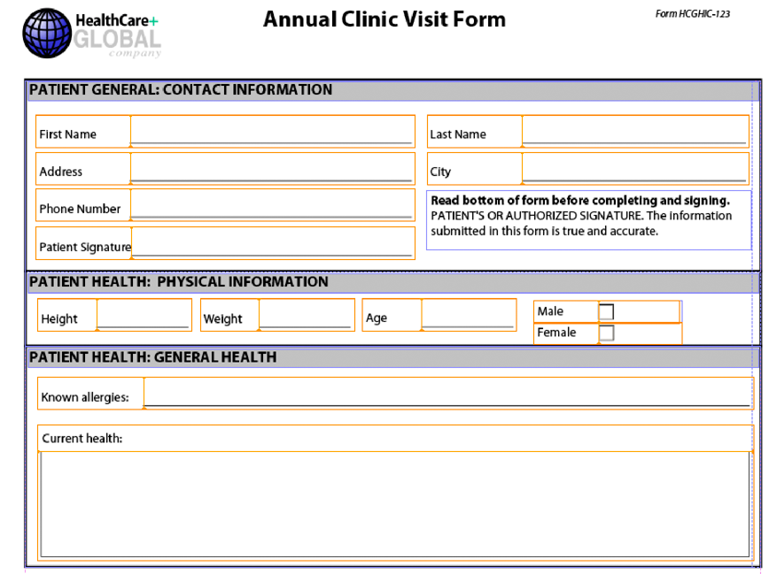

# Assemblaggio di più frammenti XDP{#assembling-multiple-xdp-fragments}

È possibile assemblare più frammenti XDP in un unico documento XDP. Ad esempio, considera i frammenti XDP in cui ogni file XDP contiene uno o più sottomoduli utilizzati per creare un modulo di integrità. Nella figura seguente viene illustrata la visualizzazione struttura (rappresenta il file tuc018_template_flowed.xdp utilizzato nel *Assemblaggio di più frammenti XDP* quick start):


L’illustrazione seguente mostra la sezione paziente (rappresenta il file tuc018_contact.xdp utilizzato nel *Assemblaggio di più frammenti XDP* quick start):


L’illustrazione seguente mostra la sezione sulla salute del paziente (rappresenta il file tuc018_patient.xdp utilizzato nel *Assemblaggio di più frammenti XDP* quick start):


Questo frammento contiene due sottomaschere denominate *subPatientPhysical* e *subPatientHealth*. Entrambi i moduli secondari sono indicati nel documento DDX passato al servizio Assembler. Utilizzando il servizio Assembler, è possibile combinare tutti questi frammenti XDP in un unico documento XDP, come illustrato nella figura seguente.



Il seguente documento DDX assembla più frammenti XDP in un documento XDP.

```xml
 <?xml version="1.0" encoding="UTF-8"?>
 <DDX xmlns="https://ns.adobe.com/DDX/1.0/">
         <XDP result="tuc018result.xdp">
            <XDP source="tuc018_template_flowed.xdp">
             <XDPContent insertionPoint="ddx_fragment" source="tuc018_contact.xdp" fragment="subPatientContact" required="false"/>
               <XDPContent insertionPoint="ddx_fragment" source="tuc018_patient.xdp" fragment="subPatientPhysical" required="false"/>
               <XDPContent insertionPoint="ddx_fragment" source="tuc018_patient.xdp" fragment="subPatientHealth" required="false"/>
            </XDP>
         </XDP>
 </DDX>
```

Il documento DDX contiene un XDP `result` che specifica il nome del risultato. In questa situazione, il valore è `tuc018result.xdp`. Questo valore è indicato nella logica dell&#39;applicazione utilizzata per recuperare il documento XDP dopo che il servizio Assembler ha restituito il risultato. Ad esempio, considera la seguente logica dell’applicazione Java utilizzata per recuperare il documento XDP assemblato (nota che il valore è in grassetto):

```java
 //Iterate through the map object to retrieve the result XDP document
 for (Iterator i = allDocs.entrySet().iterator(); i.hasNext();) {
     // Retrieve the Map object’s value
     Map.Entry e = (Map.Entry)i.next();
     //Get the key name as specified in the
     //DDX document
     String keyName = (String)e.getKey();
     if (keyName.equalsIgnoreCase("tuc018result.xdp"))
                 {
         Object o = e.getValue();
         outDoc = (Document)o;
         //Save the result PDF file
         File myOutFile = new File("C:\\AssemblerResultXDP.xdp");
         outDoc.copyToFile(myOutFile);
     }
 }
```

Il `XDP source` specifica il file XDP che rappresenta un documento XDP completo che può essere utilizzato come contenitore per l’aggiunta di frammenti XDP o come uno dei numerosi documenti accodati in ordine. In questa situazione, il documento XDP viene utilizzato solo come contenitore (la prima illustrazione mostrata in *Assemblaggio di più frammenti XDP*). In altre parole, gli altri file XDP vengono posizionati all’interno del contenitore XDP.

Per ogni modulo secondario è possibile aggiungere un `XDPContent` (elemento facoltativo). Nell’esempio precedente, nota che sono disponibili tre sottomoduli: `subPatientContact`, `subPatientPhysical`, e `subPatientHealth`. Entrambe `subPatientPhysical` sottomaschera e `subPatientHealth` i sub-moduli si trovano nello stesso file XDP, tuc018_patient.xdp. L’elemento frammento specifica il nome del modulo secondario, come definito in Designer.

>[!NOTE]
>
>Per ulteriori informazioni sul servizio Assembler, vedere [Guida di riferimento dei servizi per AEM Forms](https://www.adobe.com/go/learn_aemforms_services_63).

>[!NOTE]
>
>Per ulteriori informazioni su un documento DDX, vedere [Servizio assemblatore e riferimento DDX](https://www.adobe.com/go/learn_aemforms_ddx_63).

## Riepilogo dei passaggi {#summary-of-steps}

Per assemblare più frammenti XDP, effettuare le seguenti operazioni:

1. Includi file di progetto.
1. Creare un client PDF Assembler.
1. Fare riferimento a un documento DDX esistente.
1. Fai riferimento ai documenti XDP.
1. Impostare le opzioni di runtime.
1. Assemblare più documenti XDP.
1. Recuperate il documento XDP assemblato.

**Includi file di progetto**

Includi i file necessari nel progetto di sviluppo. Se stai creando un’applicazione client utilizzando Java, includi i file JAR necessari. Se utilizzi i servizi web, accertati di includere i file proxy.

I seguenti file JAR devono essere aggiunti al percorso della classe del progetto:

* adobe-livecycle-client.jar
* adobe-usermanager-client.jar
* adobe-assembler-client.jar
* adobe-utilities.jar (richiesto se AEM Forms è implementato su JBoss)
* jbossall-client.jar (obbligatorio se AEM Forms è distribuito su JBoss)

**Creare un client PDF Assembler**

Prima di eseguire un&#39;operazione Assembler a livello di programmazione, creare un client del servizio Assembler.

**Riferimento a un documento DDX esistente**

Per assemblare più documenti XDP, è necessario fare riferimento a un documento DDX. Questo documento DDX deve contenere `XDP result`, `XDP source`, e `XDPContent` elementi.

**Fai riferimento ai documenti XDP**

Per assemblare più documenti XDP, fare riferimento a tutti i file XDP utilizzati per assemblare il documento XDP risultante. Assicurati che il nome del modulo secondario contenuto nel documento XDP a cui fa riferimento il `source` l&#39;attributo è specificato in `fragment` attributo. Un modulo secondario è definito in Designer. Consideriamo ad esempio il seguente codice XML.

```xml
 <XDPContent insertionPoint="ddx_fragment" source="tuc018_contact.xdp" fragment="subPatientContact" required="false"/>
```

Il modulo secondario denominato *subPatientContact* deve trovarsi nel file XDP denominato *tuc018_contact.xdp*.

**Impostare le opzioni di runtime**

È possibile impostare le opzioni di runtime che controllano il comportamento del servizio Assembler durante l&#39;esecuzione di un processo. È ad esempio possibile impostare un&#39;opzione che indichi al servizio Assembler di continuare l&#39;elaborazione di un processo in caso di errore.

**Assemblare più documenti XDP**

Per assemblare più file XDP, chiama il `invokeDDX` operazione. Il servizio Assembler restituisce il documento XDP assemblato all&#39;interno di un oggetto insieme.

**Recuperare il documento XDP assemblato**

Un documento XDP assemblato viene restituito all&#39;interno di un oggetto insieme. Scorrere l&#39;oggetto insieme e salvare il documento XDP come file XDP. Puoi anche passare il documento XDP a un altro servizio AEM Forms, ad esempio Output.

**Consulta anche**

[Assemblare più frammenti XDP utilizzando l’API Java](assembling-multiple-xdp-fragments.md#assemble-multiple-xdp-fragments-using-the-java-api)

[Assemblare più frammenti XDP utilizzando l’API del servizio web](assembling-multiple-xdp-fragments.md#assemble-multiple-xdp-fragments-using-the-web-service-api)

[Inclusione dei file della libreria Java di AEM Forms](/help/forms/developing/invoking-aem-forms-using-java.md#including-aem-forms-java-library-files)

[Impostazione delle proprietà di connessione](/help/forms/developing/invoking-aem-forms-using-java.md#setting-connection-properties)

[Assemblaggio di documenti PDF a livello di programmazione](/help/forms/developing/programmatically-assembling-pdf-documents.md#programmatically-assembling-pdf-documents)

[Creazione di documenti PDF tramite frammenti](/help/forms/developing/creating-document-output-streams.md#creating-pdf-documents-using-fragments)

## Assemblare più frammenti XDP utilizzando l’API Java {#assemble-multiple-xdp-fragments-using-the-java-api}

Assembla più frammenti XDP utilizzando l’API del servizio Assembler (Java):

1. Includi file di progetto.

   Includi i file JAR client, come adobe-assembler-client.jar, nel percorso di classe del progetto Java.

1. Creare un client PDF Assembler.

   * Creare un `ServiceClientFactory` oggetto che contiene proprietà di connessione.
   * Creare un `AssemblerServiceClient` mediante il costruttore e passando il `ServiceClientFactory` oggetto.

1. Fare riferimento a un documento DDX esistente.

   * Creare un `java.io.FileInputStream` oggetto che rappresenta il documento DDX utilizzando il relativo costruttore e passando un valore stringa che specifica la posizione del file DDX.
   * Creare un `com.adobe.idp.Document` mediante il costruttore e passando il `java.io.FileInputStream` oggetto.

1. Fai riferimento ai documenti XDP.

   * Creare un `java.util.Map` oggetto utilizzato per memorizzare i documenti XDP di input utilizzando un `HashMap` costruttore.
   * Creare un `com.adobe.idp.Document` e passare il `java.io.FileInputStream` oggetto contenente il file XDP di input (ripeti questa attività per ciascun file XDP).
   * Aggiungi una voce al `java.util.Map` oggetto richiamando il relativo `put` e fornendo i seguenti argomenti:

      * Valore stringa che rappresenta il nome della chiave. Questo valore deve corrispondere al `source` valore elemento specificato nel documento DDX (ripetere questa operazione per ciascun file XDP).
      * A `com.adobe.idp.Document` oggetto che contiene il documento XDP corrispondente al `source` (ripeti questa attività per ciascun file XDP).

1. Impostare le opzioni di runtime.

   * Creare un `AssemblerOptionSpec` oggetto che memorizza le opzioni di runtime mediante il relativo costruttore.
   * Impostare le opzioni di runtime per soddisfare i requisiti aziendali richiamando un metodo che appartiene al `AssemblerOptionSpec` oggetto. Ad esempio, per indicare al servizio Assembler di continuare l&#39;elaborazione di un processo quando si verifica un errore, richiamare `AssemblerOptionSpec` dell&#39;oggetto `setFailOnError` metodo e passaggio `false`.

1. Assemblare più documenti XDP.

   Richiama `AssemblerServiceClient` dell&#39;oggetto `invokeDDX` e trasmettere i seguenti valori richiesti:

   * A `com.adobe.idp.Document` oggetto che rappresenta il documento DDX da utilizzare
   * A `java.util.Map` oggetto contenente i file XDP di input
   * A `com.adobe.livecycle.assembler.client.AssemblerOptionSpec` oggetto che specifica le opzioni di runtime, inclusi il tipo di carattere predefinito e il livello di registro del processo

   Il `invokeDDX` il metodo restituisce un `com.adobe.livecycle.assembler.client.AssemblerResult` oggetto che contiene il documento XDP assemblato.

1. Recuperate il documento XDP assemblato.

   Per ottenere il documento XDP assemblato, effettuare le seguenti operazioni:

   * Richiama `AssemblerResult` dell&#39;oggetto `getDocuments` metodo. Questo metodo restituisce un `java.util.Map` oggetto.
   * Effettua iterazione attraverso `java.util.Map` finché non viene individuato il risultato `com.adobe.idp.Document` oggetto.
   * Richiama `com.adobe.idp.Document` dell&#39;oggetto `copyToFile` metodo per estrarre il documento XDP assemblato.

**Consulta anche**

[Assemblaggio di più frammenti XDP](assembling-multiple-xdp-fragments.md#assembling-multiple-xdp-fragments)
[Quick Start (modalità SOAP): assemblaggio di più frammenti XDP tramite l’API Java](/help/forms/developing/assembler-service-java-api-quick.md#quick-start-soap-mode-assembling-multiple-xdp-fragments-using-the-java-api)
[Inclusione dei file della libreria Java di AEM Forms](/help/forms/developing/invoking-aem-forms-using-java.md#including-aem-forms-java-library-files)
[Impostazione delle proprietà di connessione](/help/forms/developing/invoking-aem-forms-using-java.md#setting-connection-properties)

## Assemblare più frammenti XDP utilizzando l’API del servizio web {#assemble-multiple-xdp-fragments-using-the-web-service-api}

Assembla più frammenti XDP utilizzando l’API del servizio Assembler (servizio web):

1. Includi file di progetto.

   Creare un progetto Microsoft .NET che utilizza MTOM. Assicurarsi di utilizzare la seguente definizione WSDL durante l&#39;impostazione di un riferimento al servizio:

   ```java
    https://localhost:8080/soap/services/AssemblerService?WSDL&lc_version=9.0.1.
   ```

   >[!NOTE]
   >
   >Sostituisci `localhost` con l’indirizzo IP del server che ospita AEM Forms.

1. Creare un client PDF Assembler.

   * Creare un `AssemblerServiceClient` utilizzando il costruttore predefinito.
   * Creare un `AssemblerServiceClient.Endpoint.Address` oggetto utilizzando `System.ServiceModel.EndpointAddress` costruttore. Passa un valore stringa che specifica il file WSDL al servizio AEM Forms, ad esempio `https://localhost:8080/soap/services/AssemblerService?blob=mtom`). Non è necessario utilizzare il `lc_version` attributo. Questo attributo viene utilizzato quando si crea un riferimento a un servizio.
   * Creare un `System.ServiceModel.BasicHttpBinding` dell&#39;oggetto ottenendo il valore del `AssemblerServiceClient.Endpoint.Binding` campo. Invia il valore restituito a `BasicHttpBinding`.
   * Imposta il `System.ServiceModel.BasicHttpBinding` dell&#39;oggetto `MessageEncoding` campo a `WSMessageEncoding.Mtom`. Questo valore assicura che venga utilizzato MTOM.
   * Abilita l’autenticazione HTTP di base eseguendo le seguenti attività:

      * Assegna il nome utente dei moduli AEM a `AssemblerServiceClient.ClientCredentials.UserName.UserName` campo.
      * Assegna il valore della password corrispondente al `AssemblerServiceClient.ClientCredentials.UserName.Password`campo.
      * Assegna la `HttpClientCredentialType.Basic` valore costante per `BasicHttpBindingSecurity.Transport.ClientCredentialType`campo.
      * Assegna la `BasicHttpSecurityMode.TransportCredentialOnly` valore costante per `BasicHttpBindingSecurity.Security.Mode`campo.

1. Fare riferimento a un documento DDX esistente.

   * Creare un `BLOB` mediante il costruttore. Il `BLOB` viene utilizzato per memorizzare il documento DDX.
   * Creare un `System.IO.FileStream` richiamando il relativo costruttore e passando un valore stringa che rappresenta la posizione del file del documento DDX e la modalità di apertura del file.
   * Creare una matrice di byte che memorizza il contenuto della `System.IO.FileStream` oggetto. È possibile determinare le dimensioni della matrice di byte ottenendo `System.IO.FileStream` dell&#39;oggetto `Length` proprietà.
   * Compilare la matrice di byte con i dati di flusso richiamando `System.IO.FileStream` dell&#39;oggetto `Read` metodo. Passare la matrice di byte, la posizione iniziale e la lunghezza del flusso per la lettura.
   * Popolare il `BLOB` oggetto assegnando il relativo `MTOM` con il contenuto della matrice di byte.

1. Fai riferimento ai documenti XDP.

   * Per ogni file XDP di input, crea un `BLOB` mediante il costruttore. Il `BLOB` viene utilizzato per memorizzare il file di input.
   * Creare un `System.IO.FileStream` dell&#39;oggetto richiamando il relativo costruttore e passando un valore stringa che rappresenta la posizione del file di input e la modalità di apertura del file.
   * Creare una matrice di byte che memorizza il contenuto della `System.IO.FileStream` oggetto. È possibile determinare le dimensioni della matrice di byte ottenendo `System.IO.FileStream` dell&#39;oggetto `Length` proprietà.
   * Compilare la matrice di byte con i dati di flusso richiamando `System.IO.FileStream` dell&#39;oggetto `Read` metodo. Passare la matrice di byte, la posizione iniziale e la lunghezza del flusso per la lettura.
   * Popolare il `BLOB` oggetto assegnando il relativo `MTOM` con il contenuto della matrice di byte.
   * Creare un `MyMapOf_xsd_string_To_xsd_anyType` oggetto. Questo oggetto insieme viene utilizzato per memorizzare i file di input necessari per creare un documento XDP assemblato.
   * Per ogni file di input, crea un `MyMapOf_xsd_string_To_xsd_anyType_Item` oggetto.
   * Assegna un valore stringa che rappresenta il nome della chiave al `MyMapOf_xsd_string_To_xsd_anyType_Item` dell&#39;oggetto `key` campo. Questo valore deve corrispondere al valore dell&#39;elemento specificato nel documento DDX. (Esegui questa operazione per ogni file XDP di input).
   * Assegna la `BLOB` oggetto che memorizza il file di input in `MyMapOf_xsd_string_To_xsd_anyType_Item` dell&#39;oggetto `value` campo. (Esegui questa operazione per ogni file XDP di input).
   * Aggiungi il `MyMapOf_xsd_string_To_xsd_anyType_Item` oggetto al `MyMapOf_xsd_string_To_xsd_anyType` oggetto. Richiama `MyMapOf_xsd_string_To_xsd_anyType` dell&#39;oggetto `Add` e trasmettere il `MyMapOf_xsd_string_To_xsd_anyType` oggetto. (Esegui questa operazione per ogni documento XDP di input.)

1. Impostare le opzioni di runtime.

   * Creare un `AssemblerOptionSpec` oggetto che memorizza le opzioni di runtime mediante il relativo costruttore.
   * Impostare le opzioni di runtime per soddisfare i requisiti aziendali assegnando un valore a un membro dati che appartiene al `AssemblerOptionSpec` oggetto. Ad esempio, per indicare al servizio Assembler di continuare l&#39;elaborazione di un processo quando si verifica un errore, assegnare `false` al `AssemblerOptionSpec` dell&#39;oggetto `failOnError` membro dati.

1. Assemblare più documenti XDP.

   Richiama `AssemblerServiceClient` dell&#39;oggetto `invokeDDX` e trasmettere i seguenti valori:

   * A `BLOB` oggetto che rappresenta il documento DDX
   * Il `MyMapOf_xsd_string_To_xsd_anyType` oggetto contenente i file richiesti
   * Un `AssemblerOptionSpec` oggetto che specifica le opzioni di runtime

   Il `invokeDDX` il metodo restituisce un `AssemblerResult` oggetto contenente i risultati del processo ed eventuali eccezioni verificatesi.

1. Recuperate il documento XDP assemblato.

   Per ottenere il documento XDP appena creato, effettuare le seguenti operazioni:

   * Accedere a `AssemblerResult` dell&#39;oggetto `documents` campo, che è un `Map` oggetto contenente i documenti PDF risultanti.
   * Effettua iterazione attraverso `Map` per ottenere ogni documento risultante. Quindi, esegui il cast del membro dell’array `value` a un `BLOB`.
   * Estrarre i dati binari che rappresentano il documento PDF accedendo al relativo `BLOB` dell&#39;oggetto `MTOM` proprietà. Restituisce una matrice di byte che è possibile scrivere in un file XDP.

**Consulta anche**

[Assemblaggio di più frammenti XDP](assembling-multiple-xdp-fragments.md#assembling-multiple-xdp-fragments)
[Richiamare AEM Forms tramite MTOM](/help/forms/developing/invoking-aem-forms-using-web.md#invoking-aem-forms-using-mtom)
