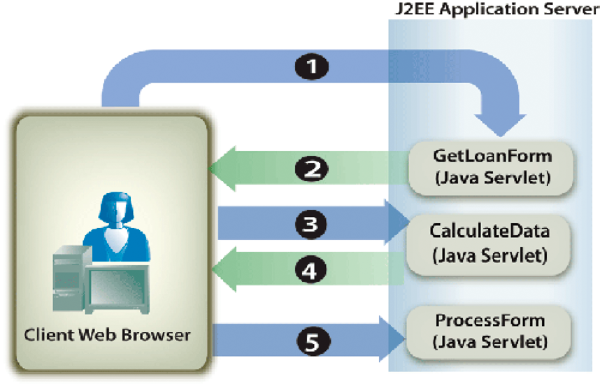
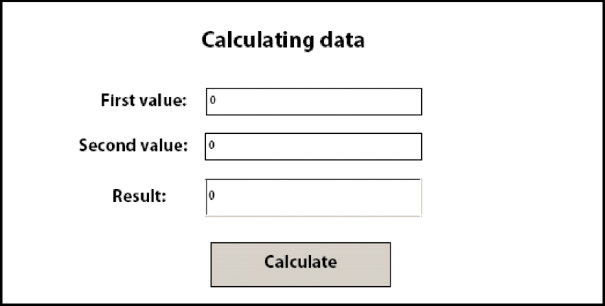

# Calcolo dei dati del modulo {#calculating-form-data}

**Esempi ed esempi in questo documento sono solo per AEM Forms in ambiente JEE.**

Il servizio Forms può calcolare i valori immessi da un utente in un modulo e visualizzare i risultati. Per calcolare i dati del modulo, è necessario eseguire due attività. Innanzitutto, è necessario creare uno script della struttura del modulo che calcoli i dati del modulo. Una struttura del modulo supporta tre tipi di script. Un tipo di script viene eseguito sul client, un altro sul server e il terzo viene eseguito sia sul server che sul client. Il tipo di script descritto in questo argomento viene eseguito sul server. I calcoli lato server sono supportati per le trasformazioni HTML, PDF e Form Guide (obsoleto).

Come parte del processo di progettazione del modulo, è possibile utilizzare calcoli e script per migliorare l’esperienza utente. I calcoli e gli script possono essere aggiunti alla maggior parte dei campi e degli oggetti modulo. È necessario creare uno script della struttura del modulo per eseguire operazioni di calcolo sui dati immessi dall’utente in un modulo interattivo.

L’utente immette i valori nel modulo e fa clic sul pulsante Calcola per visualizzare i risultati. Il processo seguente descrive un&#39;applicazione di esempio che consente a un utente di calcolare i dati:

* L’utente accede a una pagina HTML denominata StartLoan.html che agisce come pagina iniziale dell’applicazione web. Questa pagina richiama un servlet Java denominato `GetLoanForm`.
* Il servlet `GetLoanForm` esegue il rendering di un modulo di prestito. Questo modulo contiene uno script, campi interattivi, un pulsante di calcolo e un pulsante di invio.
* L’utente immette valori nei campi del modulo e fa clic sul pulsante Calcola . Il modulo viene inviato al `CalculateData` Java Servlet in cui viene eseguito lo script. Il modulo viene inviato nuovamente all’utente con i risultati di calcolo visualizzati nel modulo.
* L&#39;utente continua a immettere e calcolare i valori finché non viene visualizzato un risultato soddisfacente. Una volta completato, l’utente fa clic sul pulsante Invia per elaborare il modulo. Il modulo viene inviato a un altro servlet Java denominato `ProcessForm` responsabile del recupero dei dati inviati. (Consulta [Gestione dei Forms inviati](/help/forms/developing/rendering-forms.md#handling-submitted-forms).)


Il diagramma seguente mostra il flusso logico dell’applicazione.



La tabella seguente descrive i passaggi descritti in questo diagramma.

<table>
 <thead>
  <tr>
   <th><p>Incremento</p></th>
   <th><p>Descrizione</p></th>
  </tr>
 </thead>
 <tbody>
  <tr>
   <td><p>1</p></td>
   <td><p>Il servlet Java <code>GetLoanForm</code> viene richiamato dalla pagina iniziale HTML. </p></td>
  </tr>
  <tr>
   <td><p>2</p></td>
   <td><p>Il <code>GetLoanForm</code> Java Servlet utilizza l’API client del servizio Forms per eseguire il rendering del modulo di prestito sul browser web del client. La differenza tra il rendering di un modulo contenente uno script configurato per l’esecuzione sul server e il rendering di un modulo che non contiene uno script è che è necessario specificare il percorso di destinazione utilizzato per eseguire lo script. Se non viene specificata una posizione di destinazione, non viene eseguito uno script configurato per l'esecuzione sul server. Ad esempio, considera l’applicazione introdotta in questa sezione. Il <code>CalculateData</code> Java Servlet è la posizione di destinazione in cui viene eseguito lo script.</p></td>
  </tr>
  <tr>
   <td><p>3</p></td>
   <td><p>L’utente immette i dati in campi interattivi e fa clic sul pulsante Calcola . Il modulo viene inviato al <code>CalculateData</code> Java Servlet, dove viene eseguito lo script. </p></td>
  </tr>
  <tr>
   <td><p>4</p></td>
   <td><p>Viene eseguito il rendering del modulo nel browser Web con i risultati di calcolo visualizzati nel modulo. </p></td>
  </tr>
  <tr>
   <td><p>5</p></td>
   <td><p>L’utente fa clic sul pulsante Invia quando i valori sono soddisfacenti. Il modulo viene inviato a un altro servlet Java denominato <code>ProcessForm</code>.</p></td>
  </tr>
 </tbody>
</table>

In genere, un modulo inviato come contenuto PDF contiene script eseguiti sul client. Tuttavia, è possibile eseguire anche calcoli sul lato server. Non è possibile utilizzare un pulsante Invia per calcolare gli script. In questa situazione, i calcoli non vengono eseguiti perché il servizio Forms considera l’interazione completa.

Per illustrare l’utilizzo di uno script della struttura del modulo, in questa sezione viene esaminato un semplice modulo interattivo contenente uno script configurato per l’esecuzione sul server. Il diagramma seguente mostra una struttura del modulo contenente uno script che aggiunge valori immessi dall’utente nei primi due campi e visualizza il risultato nel terzo campo.



**A.** Campo denominato NumericField1  **B.** Campo denominato NumericField2  **C.** Campo denominato NumericField3

La sintassi dello script in questa struttura del modulo è la seguente:

```javascript
     NumericField3 = NumericField2 + NumericField1
```

In questa struttura del modulo, il pulsante Calcola è un pulsante di comando e lo script si trova nell’evento `Click` del pulsante. Quando un utente immette valori nei primi due campi (NumericField1 e NumericField2) e fa clic sul pulsante Calcola, il modulo viene inviato al servizio Forms, dove viene eseguito lo script. Il servizio Forms esegue il rendering del modulo sul dispositivo client con i risultati del calcolo visualizzato nel campo NumericField3 .

>[!NOTE]
>
>Per informazioni sulla creazione di uno script della struttura del modulo, vedere [Forms Designer](https://www.adobe.com/go/learn_aemforms_designer_63).

>[!NOTE]
>
>Per ulteriori informazioni sul servizio Forms, consulta [Riferimento servizi per AEM Forms](https://www.adobe.com/go/learn_aemforms_services_63).

## Riepilogo dei passaggi {#summary-of-steps}

Per calcolare i dati del modulo, eseguire le operazioni seguenti:

1. Includi file di progetto.
1. Creare un oggetto API client Forms.
1. Recupera un modulo contenente uno script di calcolo.
1. Riscrittura del flusso di dati del modulo nel browser Web client

**Includi file di progetto**

Includi i file necessari nel progetto di sviluppo. Se stai creando un&#39;applicazione client utilizzando Java, includi i file JAR necessari. Se utilizzi i servizi web, assicurati di includere i file proxy.

**Creare un oggetto API client Forms**

Prima di poter eseguire programmaticamente un’operazione API client del servizio Forms, è necessario creare un client di servizio Forms. Se utilizzi l’API Java, crea un oggetto `FormsServiceClient`. Se utilizzi l’API del servizio Web Forms, crea un oggetto `FormsServiceService`.

**Recupera un modulo contenente uno script di calcolo**

L’API client del servizio Forms consente di creare una logica applicativa che gestisce un modulo contenente uno script configurato per l’esecuzione sul server. Il processo è simile alla gestione di un modulo inviato. (Consulta [Gestione dei Forms inviati](/help/forms/developing/handling-submitted-forms.md).)

Verificare che lo stato di elaborazione associato al modulo inviato sia `1` `(Calculate)`, il che significa che il servizio Forms sta eseguendo un&#39;operazione di calcolo sui dati del modulo e che i risultati debbano essere riscritti all&#39;utente. In questa situazione, viene eseguito automaticamente uno script configurato per l&#39;esecuzione sul server.

**Riscrittura del flusso di dati del modulo nel browser Web client**

Dopo aver verificato che lo stato di elaborazione associato a un modulo inviato sia `1`, è necessario riscrivere i risultati nel browser Web client. Quando il modulo viene visualizzato, il valore calcolato verrà visualizzato nei campi appropriati.

**Consulta anche**

[Inclusione dei ](/help/forms/developing/invoking-aem-forms-using-java.md#including-aem-forms-java-library-files)
[file della libreria Java di AEM FormsCalcola i dati del modulo utilizzando Java ](/help/forms/developing/calculating-form-data.md#calculate-form-data-using-the-java-api)
[APICcalcola i dati del modulo utilizzando il servizio Web ](/help/forms/developing/calculating-form-data.md#calculate-form-data-using-the-web-service-api)
[APISettazione delle ](/help/forms/developing/invoking-aem-forms-using-java.md#setting-connection-properties)
[proprietà di connessioneAPI del servizio Forms ](/help/forms/developing/forms-service-api-quick-starts.md#forms-service-api-quick-starts)
[Avvio rapidoRendering di ](/help/forms/developing/rendering-interactive-pdf-forms.md)
[moduli PDF interattiviCreazione di applicazioni Web che eseguono il rendering di Forms](/help/forms/developing/creating-web-applications-renders-forms.md)

## Calcolare i dati del modulo utilizzando l’API Java {#calculate-form-data-using-the-java-api}

Calcola i dati del modulo utilizzando l’API Forms (Java):

1. Includi file di progetto

   Includi file JAR client, ad esempio adobe-forms-client.jar nel percorso di classe del progetto Java.

1. Creare un oggetto API client Forms

   * Creare un oggetto `ServiceClientFactory` contenente le proprietà di connessione.
   * Creare un oggetto `FormsServiceClient` utilizzando il relativo costruttore e passando l&#39;oggetto `ServiceClientFactory`.

1. Recupera un modulo contenente uno script di calcolo

   * Per recuperare i dati del modulo contenenti uno script di calcolo, creare un oggetto `com.adobe.idp.Document` utilizzando il relativo costruttore e richiamare il metodo `javax.servlet.http.HttpServletResponse` dell&#39;oggetto `getInputStream` dall&#39;interno del costruttore.
   * Richiama il metodo `processFormSubmission` dell&#39;oggetto `FormsServiceClient` e passa i seguenti valori:

      * L&#39;oggetto `com.adobe.idp.Document` che contiene i dati del modulo.
      * Valore stringa che specifica le variabili di ambiente, comprese tutte le intestazioni HTTP rilevanti. È necessario specificare il tipo di contenuto da gestire specificando uno o più valori per la variabile di ambiente `CONTENT_TYPE` . Ad esempio, per gestire i dati XML e PDF, specificare il seguente valore stringa per questo parametro: `CONTENT_TYPE=application/xml&CONTENT_TYPE=application/pdf`
      * Valore stringa che specifica il valore di intestazione `HTTP_USER_AGENT`; ad esempio, `Mozilla/4.0 (compatible; MSIE 6.0; Windows NT 5.1; SV1; .NET CLR 1.1.4322)`.
      * Un oggetto `RenderOptionsSpec` che memorizza le opzioni di esecuzione.

      Il metodo `processFormSubmission` restituisce un oggetto `FormsResult` contenente i risultati dell&#39;invio del modulo.

   * Verificare che lo stato di elaborazione associato a un modulo inviato sia `1` richiamando il metodo `FormsResult` dell&#39;oggetto `getAction`. Se questo metodo restituisce il valore `1`, il calcolo è stato eseguito e i dati possono essere riscritti nel browser Web client.


1. Riscrittura del flusso di dati del modulo nel browser Web client

   * Creare un oggetto `javax.servlet.ServletOutputStream` utilizzato per inviare un flusso di dati del modulo al browser Web client.
   * Creare un oggetto `com.adobe.idp.Document` richiamando il metodo `FormsResult` object ‘s `getOutputContent` .
   * Creare un oggetto `java.io.InputStream` richiamando il metodo `com.adobe.idp.Document` dell&#39;oggetto `getInputStream`.
   * Creare una matrice di byte e compilarla con il flusso di dati del modulo richiamando il metodo `InputStream` dell&#39;oggetto `read` e passando la matrice di byte come argomento.
   * Richiamare il metodo `write` dell’oggetto `javax.servlet.ServletOutputStream` per inviare il flusso di dati del modulo al browser Web client. Passa l&#39;array di byte al metodo `write` .

**Consulta anche**


[Inclusione dei ](/help/forms/developing/invoking-aem-forms-using-java.md#including-aem-forms-java-library-files)
[file della libreria Java AEM FormsImpostazione delle proprietà di connessione](/help/forms/developing/invoking-aem-forms-using-java.md#setting-connection-properties)

## Calcolare i dati del modulo utilizzando l’API del servizio Web {#calculate-form-data-using-the-web-service-api}

Calcola i dati del modulo utilizzando l’API Forms (servizio Web):

1. Includi file di progetto

   * Creare classi proxy Java che utilizzano il servizio WSDL di Forms.
   * Includi le classi proxy Java nel percorso della classe.

1. Creare un oggetto API client Forms

   Creare un oggetto `FormsService` e impostare i valori di autenticazione.

1. Recupera un modulo contenente uno script di calcolo

   * Per recuperare i dati del modulo inviati a un servlet Java, creare un oggetto `BLOB` utilizzando il relativo costruttore.
   * Creare un oggetto `java.io.InputStream` utilizzando il metodo `javax.servlet.http.HttpServletResponse` dell&#39;oggetto `getInputStream`.
   * Creare un oggetto `java.io.ByteArrayOutputStream` utilizzando il relativo costruttore e passando la lunghezza dell&#39;oggetto `java.io.InputStream`.
   * Copiare il contenuto dell&#39;oggetto `java.io.InputStream` nell&#39;oggetto `java.io.ByteArrayOutputStream`.
   * Creare una matrice di byte richiamando il metodo `toByteArray` dell&#39;oggetto `java.io.ByteArrayOutputStream`.
   * Compilare l&#39;oggetto `BLOB` richiamando il relativo metodo `setBinaryData` e passando la matrice dei byte come argomento.
   * Creare un oggetto `RenderOptionsSpec` utilizzando il relativo costruttore. Impostare il valore delle impostazioni internazionali richiamando il metodo `setLocale` dell&#39;oggetto `RenderOptionsSpec` e passando un valore di stringa che specifica il valore delle impostazioni internazionali.
   * Richiama il metodo `processFormSubmission` dell&#39;oggetto `FormsServiceClient` e passa i seguenti valori:

      * L&#39;oggetto `BLOB` che contiene i dati del modulo.
      * Un valore stringa che specifica le variabili di ambiente include tutte le intestazioni HTTP pertinenti. Ad esempio, è possibile specificare il seguente valore stringa: `HTTP_REFERER=referrer&HTTP_CONNECTION=keep-alive&CONTENT_TYPE=application/xml`
      * Valore stringa che specifica il valore di intestazione `HTTP_USER_AGENT`; ad esempio, `Mozilla/4.0 (compatible; MSIE 6.0; Windows NT 5.1; SV1; .NET CLR 1.1.4322)`.
      * Un oggetto `RenderOptionsSpec` che memorizza le opzioni di esecuzione. Per ulteriori informazioni, .
      * Un oggetto `BLOBHolder` vuoto compilato dal metodo .
      * Un oggetto `javax.xml.rpc.holders.StringHolder` vuoto compilato dal metodo .
      * Un oggetto `BLOBHolder` vuoto compilato dal metodo .
      * Un oggetto `BLOBHolder` vuoto compilato dal metodo .
      * Un oggetto `javax.xml.rpc.holders.ShortHolder` vuoto compilato dal metodo .
      * Un oggetto `MyArrayOf_xsd_anyTypeHolder` vuoto compilato dal metodo . Questo parametro viene utilizzato per memorizzare gli allegati dei file inviati insieme al modulo.
      * Un oggetto `FormsResultHolder` vuoto compilato dal metodo con il modulo inviato.

      Il metodo `processFormSubmission` compila il parametro `FormsResultHolder` con i risultati dell’invio del modulo. Il metodo `processFormSubmission` restituisce un oggetto `FormsResult` contenente i risultati dell&#39;invio del modulo.

   * Verificare che lo stato di elaborazione associato a un modulo inviato sia `1` richiamando il metodo `FormsResult` dell&#39;oggetto `getAction`. Se questo metodo restituisce il valore `1`, il calcolo è stato eseguito e i dati possono essere riscritti nel browser Web client.


1. Riscrittura del flusso di dati del modulo nel browser Web client

   * Creare un oggetto `javax.servlet.ServletOutputStream` utilizzato per inviare un flusso di dati del modulo al browser Web client.
   * Creare un oggetto `BLOB` che contiene dati del modulo richiamando il metodo `FormsResult` dell&#39;oggetto `getOutputContent`.
   * Creare una matrice di byte e compilarla richiamando il metodo `getBinaryData` dell&#39;oggetto `BLOB`. Questa attività assegna il contenuto dell&#39;oggetto `FormsResult` all&#39;array di byte.
   * Richiamare il metodo `write` dell’oggetto `javax.servlet.http.HttpServletResponse` per inviare il flusso di dati del modulo al browser Web client. Passa l&#39;array di byte al metodo `write` .

**Vedere**
[ancheRichiamo di AEM Forms con codifica Base64](/help/forms/developing/invoking-aem-forms-using-web.md#invoking-aem-forms-using-base64-encoding)
