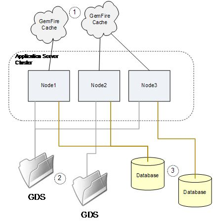

# Configurazione e risoluzione dei problemi di un cluster di server AEM Forms su JEE {#configuring-troubleshooting-aem-forms-jee-server-cluster}

## Conoscenze preliminari {#prerequisites}

Familiarità con i server applicazioni AEM Forms su JEE, JBoss, WebSphere e Webogic, Red Hat Linux, SUSE Linux, Microsoft Windows, IBM AIX o Sun Solaris, i server di database Oracle, IBM DB2 o SQL Server e gli ambienti web.

## Livello utente {#user-level}

Avanzate 

Un cluster AEM Forms su JEE è una topologia progettata per consentire ad AEM Forms su JEE di essere resiliente agli errori di un nodo cluster e di scalare la capacità del sistema oltre le capacità di un singolo nodo. Un cluster combina più nodi in un unico sistema logico che condivide i dati e consente alle transazioni di estendersi su più nodi in esecuzione. Un cluster è il modo più generale per scalare AEM Forms su JEE, in quanto può essere supportata qualsiasi combinazione di servizi che gestisca qualsiasi combinazione di carichi di lavoro. Un cluster AEM Forms su JEE non è necessariamente il più adatto per tutti i tipi di distribuzione e, in particolare, un’architettura con bilanciamento del carico del server non cluster può essere appropriata in molti casi.

Lo scopo di questo documento è quello di discutere i requisiti di configurazione specifici e le potenziali aree problematiche che potresti incontrare con un cluster AEM Forms su JEE.

## Cosa c&#39;è in un cluster? {#what-is-in-cluster}

I nodi del cluster AEM Forms su JEE comunicano tra loro e condividono informazioni per consentire al cluster nel suo complesso di avere un’unica configurazione coerente e un unico stato dell’applicazione. La condivisione delle informazioni all&#39;interno del cluster viene eseguita contemporaneamente in diversi modi e in contesti diversi. I metodi di condivisione delle informazioni di base sono illustrati nella figura seguente:


### Cluster del server applicazioni {#application-server-cluster}

Un cluster AEM Forms su JEE si basa sulle funzionalità di clustering del server applicazioni sottostante. I cluster di server applicazioni consentono di gestire la configurazione del cluster nel suo insieme e di fornire servizi cluster di basso livello come Java Naming and Directory Interface (JNDI) che consentono ai componenti software di trovarsi l&#39;un l&#39;altro all&#39;interno del cluster. La complessità dei servizi cluster e le dipendenze tecniche di base del server applicazioni dipendono dal server applicazioni. WebSphere e WebLogic dispongono di funzionalità di gestione sofisticate per i cluster, mentre JBoss ha un approccio di base.

### Cache GemFire {#gemfire-cache}

La cache GemFire è un meccanismo di cache distribuita implementato in ogni nodo del cluster. I nodi si trovano a vicenda e creano una singola cache logica coerente tra di loro. I nodi che si trovano si uniscono per mantenere una singola cache nozionale che viene mostrata come cloud nella Figura 1. A differenza di GDS e database, la cache è un&#39;entità puramente fittizia. Il contenuto effettivamente memorizzato nella cache viene memorizzato in e nel `LC_TEMP` in ciascuno dei nodi del cluster.

### Database {#database}

Il database AEM Forms su JEE, a cui si accede tramite le origini dati JDBC IDP_DS, EDC_DS e altri, è condiviso da tutti i nodi del cluster. La maggior parte dei dati persistenti relativi allo stato di AEM Forms su JEE, ad esempio le transazioni in corso, i dati utente associati alle transazioni in corso, i dati relativi alla modalità di impostazione delle impostazioni di sistema e così via, si trova in questo database.

### Archiviazione globale dei documenti {#global-document-storage}

Global Document Storage (GDS) è un’area di archiviazione basata su file system utilizzata da Document Manager (classe IDPDocument) in AEM Forms su JEE. GDS archivia file di breve durata e di lunga durata che devono essere accessibili a tutti i nodi del cluster.

### Altri elementi {#other-items}

Oltre a queste risorse condivise principali, esistono altri elementi che hanno un comportamento cluster specifico, ad esempio Quartz. Quartz è un sottosistema di pianificazione utilizzato da AEM Forms su JEE e utilizza tabelle di database per conoscere cosa è stato pianificato e quali attività pianificate sono in esecuzione. Il quarzo deve essere configurato in modo diverso per le installazioni a nodo singolo e i cluster e prende spunto da altre impostazioni di AEM Forms su JEE.

## Problemi di configurazione comuni {#common-configuration}

Una delle cose più frustranti riguardo alla manutenzione o alla risoluzione dei problemi di un cluster AEM Forms su JEE è che non esiste un’unica posizione da controllare per verificare positivamente che il cluster sia integro. Per confermare che tutto è a posto nel cluster richiede alcune indagini e analisi, e ci sono diverse modalità di errore per il funzionamento del cluster, a seconda di ciò che è sbagliato con la configurazione del cluster. La figura seguente illustra un cluster configurato in modo errato in cui diverse risorse condivise non sono condivise correttamente.



Un aspetto interessante e importante da tenere presente è che è necessario avere familiarità con il funzionamento del clustering e con il tipo di elementi da cercare e verificare in un cluster, anche se non si intende eseguire AEM Forms su JEE in un cluster. Questo perché alcune parti di AEM Forms su JEE potrebbero dare indicazioni su come operare in un cluster in modo non corretto e assumere un comportamento cluster imprevisto.

Cosa c’è di sbagliato nella configurazione di condivisione della Figura precedente? Le sezioni seguenti descrivono i problemi:

### (1) Configurazione cluster GemFire {#gemfire-cluster-configuration}

La cache di Gemfire può presentare diversi problemi. Due scenari tipici sono:

* I nodi che dovrebbero essere in grado di trovarsi a vicenda non sono in grado di farlo.

* I nodi che non devono essere raggruppati si trovano l’un l’altro e condividono una cache quando non dovrebbero.

Se si desidera creare un cluster di nodi, è essenziale che si trovino l&#39;un l&#39;altro sulla rete. Per impostazione predefinita, questo avviene tramite messaggi UDP multicast. Ogni nodo invia messaggi di broadcast che pubblicizzano la sua presenza, e qualsiasi nodo che riceve tale messaggio inizia a parlare con gli altri nodi che trova. Questo tipo di metodo di individuazione automatica è molto comune e molti tipi di software e accessori lo fanno.

Un problema comune del rilevamento automatico è che i messaggi multicast possono essere filtrati dalla rete come parte di criteri di rete o a causa di regole firewall software, oppure possono semplicemente non essere in grado di instradare attraverso la rete esistente tra i nodi. A causa della difficoltà generale di ottenere il funzionamento dell&#39;individuazione automatica UDP in reti complesse, è pratica comune per le distribuzioni di produzione utilizzare un metodo di individuazione alternativo: i localizzatori TCP. Una discussione generale sui localizzatori TCP si trova nei riferimenti.

**Come posso sapere se utilizzo i localizzatori o UDP?**

Le seguenti proprietà JVM controllano il metodo utilizzato dalla cache GemFire per trovare altri nodi.

Impostazioni multicast:

* `adobe.cache.multicast-port`: porta multicast utilizzata per comunicare con altri membri del sistema distribuito. Se è impostato su zero, il multicast è disabilitato sia per l&#39;individuazione dei membri che per la distribuzione.

* `gemfire.mcast-address` (facoltativo): sostituisce l’indirizzo IP predefinito utilizzato da Gemfire.

Impostazioni di TCP Locator:

* `adobe.cache.cluster-locators`: indirizzo IP/nome host del localizzatore TCP e della porta del localizzatore TCP per tutti i localizzatori utilizzati dai membri del sistema per comunicare con i localizzatori in esecuzione.

L&#39;elenco deve includere tutti i localizzatori attualmente in uso e deve essere configurato in modo coerente per ogni membro del sistema cluster.

Se l&#39;elenco di localizzatori TCP è vuoto, i localizzatori non vengono utilizzati e viene utilizzato il metodo multicast.

**Come posso verificare se il mio localizzatore TCP è in esecuzione?**

Innanzitutto, se i localizzatori TCP sono in uso, i localizzatori TCP devono essere elencati nella seguente proprietà JVM su tutti i nodi del cluster:

`-Dadobe.cache.cluster-locators=aix01.adobe.com[22345],aix02.adobe.com[22345]`

Non è necessario eseguire i localizzatori sui nodi del cluster AEM Forms su JEE; se necessario, possono essere eseguiti su altri sistemi separati dal cluster. Più sistemi possono eseguire localizzatori e in genere si considera consigliabile eseguire localizzatori in due posizioni, in quanto un singolo errore dei localizzatori potrebbe causare un problema con il riavvio del cluster. Su ciascuno dei sistemi che eseguono i localizzatori, è necessario essere in grado di verificare che siano in esecuzione utilizzando i seguenti comandi su tali computer:

`netstat -an | grep 22345`

La risposta prevista è la seguente:

`tcp 0 0 *.22345 *.* LISTEN`

Un altro comando di verifica è il seguente:

`ps -ef | grep gemfire`

La risposta prevista dovrebbe essere simile alla seguente:

`livecycl 331984 1 0 10:14:51 pts/0 0:03 java -cp ./gemfire.jar: -Dgemfire.license-type=production -Dlocators=localhost[22345] com.gemstone.gemfire.distributed.Locator 22345`

**Come posso vedere quali nodi GemFire pensano siano nel cluster?**

GemFire produce informazioni di registrazione che possono essere utilizzate per diagnosticare quali membri del cluster sono stati trovati e adottati dalla cache di GemFire. Può essere utilizzato per verificare che vengano trovati tutti i membri del cluster corretti e che non si verifichi alcun rilevamento di nodi cluster aggiuntivo o errato. Il file di registro per GemFire si trova nella directory temporanea configurata di AEM Forms su JEE:

`.../LC_TEMP/adobeZZ__123456/Caching/Gemfire.log`

La stringa numerica dopo `adobeZZ_` è univoco per il nodo del server, pertanto è necessario cercare il contenuto effettivo della directory temporanea. I due caratteri dopo `adobe` dipendono dal tipo di server dell’applicazione: `wl`, `jb`, o `ws`.

I registri di esempio seguenti mostrano cosa accade quando si trova un cluster a due nodi.

Sul primo nodo, AP-HP8:

```xml
[config 2011/08/05 09:28:09.143 EDT GemfireCacheAdapter <server.startup : 0> tid=0x65] This member, ap-hp8(4268):18763, is becoming group coordinator.
[info 2011/08/05 09:28:09.151 EDT GemfireCacheAdapter <server.startup : 0> tid=0x65] Entered into membership in group GF6.5.1.17 with ID ap-hp8(4268)<v0>:18763/56449.
[info 2011/08/05 09:28:09.152 EDT GemfireCacheAdapter <server.startup : 0> tid=0x65] Starting DistributionManager ap-hp8(4268)<v0>:18763/56449.
[info 2011/08/05 09:28:09.153 EDT GemfireCacheAdapter <server.startup : 0> tid=0x65] Initial (membershipManager) view =  [ap-hp8(4268)<v0>:18763/56449]
[info 2011/08/05 09:28:09.153 EDT GemfireCacheAdapter <server.startup : 0> tid=0x65] Admitting member <ap-hp8(4268)<v0>:18763/56449>. Now there are 1 non-admin member(s).
[info 2011/08/05 09:28:09.154 EDT GemfireCacheAdapter <server.startup : 0> tid=0x65] ap-hp8(4268)<v0>:18763/56449 is the elder and the only member.
[info 2011/08/05 09:28:09.163 EDT GemfireCacheAdapter <server.startup : 0> tid=0x65] Did not hear back from any other system. I am the first one.
[info 2011/08/05 09:28:09.164 EDT GemfireCacheAdapter <server.startup : 0> tid=0x65] DistributionManager ap-hp8(4268)<v0>:18763/56449 started on 239.192.81.1[33456]. There were 0 other DMs. others: []
[info 2011/08/05 09:28:20.841 EDT GemfireCacheAdapter <Pooled Message Processor 1> tid=0xc4] New administration member detected at ap-hp7(2821)<v1>:19498/59136.
```

Sull&#39;altro nodo, AP-HP7:

```xml
[info 2011/08/05 09:28:09.830 EDT GemfireCacheAdapter <server.startup : 0> tid=0x64] Attempting to join distributed system whose membership coordinator is ap-hp8(4268)<v0>:18763 using membership ID ap-hp7(2821):19498
[info 2011/08/05 09:28:10.058 EDT GemfireCacheAdapter <server.startup : 0> tid=0x64] Entered into membership in group GF6.5.1.17 with ID ap-hp7(2821)<v1>:19498/59136.
[info 2011/08/05 09:28:10.059 EDT GemfireCacheAdapter <server.startup : 0> tid=0x64] Starting DistributionManager ap-hp7(2821)<v1>:19498/59136.
[info 2011/08/05 09:28:10.060 EDT GemfireCacheAdapter <server.startup : 0> tid=0x64] Initial (membershipManager) view =  [ap-hp8(4268)<v0>:18763/56449, ap-hp7(2821)<v1>:19498/59136]
[info 2011/08/05 09:28:10.060 EDT GemfireCacheAdapter <server.startup : 0> tid=0x64] Admitting member <ap-hp8(4268)<v0>:18763/56449>. Now there are 1 non-admin member(s).
[info 2011/08/05 09:28:10.060 EDT GemfireCacheAdapter <server.startup : 0> tid=0x64] Admitting member <ap-hp7(2821)<v1>:19498/59136>. Now there are 2 non-admin member(s).
[info 2011/08/05 09:28:10.128 EDT GemfireCacheAdapter <server.startup : 0> tid=0x64] DistributionManager ap-hp7(2821)<v1>:19498/59136 started on 239.192.81.1[33456]. There were 1 other DMs. others: [ap-hp8(4268)<v0>:18763/56449]
```

**Cosa succede se GemFire trova nodi che non dovrebbero?**

Ogni cluster distinto che condivide una rete aziendale deve utilizzare un set separato di localizzatori TCP, se vengono utilizzati localizzatori TCP, o un numero di porta UDP separato se viene utilizzata la configurazione UDP multicast. Poiché l’individuazione automatica UDP è la configurazione predefinita per AEM Forms su JEE e la stessa porta predefinita, 33456, può essere utilizzata da più cluster, è possibile che i cluster che non devono tentare di comunicare lo facciano in modo imprevisto, ad esempio i cluster di produzione e di controllo qualità devono rimanere separati, ma possono connettersi tra loro tramite multicast UDP.

La situazione più comune in cui è possibile rilevare porte duplicate in una rete a cui GemFire è collegato in modo non corretto è durante l&#39;avvio di un cluster. È possibile che il processo di bootstrap non riesca senza una chiara causa. In genere, si verificano errori di questo tipo:

```xml
Caused by: com.ibm.ejs.container.UnknownLocalException: nested exception is: com.adobe.pof.schema.ObjectTypeNotFoundException: Object Type: dsc.sc_service_configuration not found.
                at com.adobe.pof.schema.POFDefaultDomain.getObjectType(POFDefaultDomain.java:93)
                at com.adobe.idp.dsc.initializer.DSCInitializerBean.serviceConfigAuditAttributeExists(DSCInitializerBean.java:225)
                at com.adobe.idp.dsc.initializer.DSCInitializerBean.installSchema(DSCInitializerBean.java:186)
                at com.adobe.idp.dsc.initializer.DSCInitializerBean.bootstrap(DSCInitializerBean.java:94)
                at com.adobe.idp.dsc.initializer.EJSLocalStatelessDSCInitializerBeanLocalEJB_7bb34e85.bootstrap(Unknown Source)
                at com.adobe.livecycle.bootstrap.bootstrappers.DSCBootstrapper.bootstrap(DSCBootstrapper.java:68)
```

In questo caso, il programma di avvio automatico utilizza GemFire per accedere alle tabelle richieste e si verifica un&#39;incoerenza tra le tabelle a cui si accede tramite JDBC e le informazioni della tabella memorizzata nella cache restituite da GemFire, provenienti da un cluster diverso con un database sottostante diverso.

Sebbene una porta duplicata risulti spesso evidente durante l&#39;avvio, è possibile che questa situazione venga visualizzata in un secondo momento, quando un cluster viene riavviato dopo l&#39;arresto quando si è verificato l&#39;avvio dell&#39;altro cluster oppure quando la configurazione di rete viene modificata per rendere visibili gli uni agli altri i cluster precedentemente isolati a scopo multicast.

Per diagnosticare queste situazioni, è meglio esaminare i registri GemFire e considerare attentamente se vengono trovati solo i nodi previsti. Per risolvere il problema, è necessario modificare il

`adobe.cache.multicast-port`

a un valore diverso su uno o entrambi i cluster.

### 2) Condivisione GDS {#gds-sharing}

La condivisione GDS è configurata all’esterno di AEM Forms su JEE stessa, a livello di sistema operativo, dove è necessario disporre che la stessa struttura di directory condivisa sia disponibile per tutti i nodi del cluster. Nei sistemi di tipo Windows, questa operazione viene in genere eseguita impostando una condivisione di file da un nodo all&#39;altro o da un file system remoto, ad esempio un dispositivo NAS, a tutti i nodi. Nei sistemi UNIX, la condivisione GDS viene in genere eseguita tramite la condivisione di file NFS, anche in questo caso da un nodo all&#39;altro o da un dispositivo NAS.

Una possibile modalità di errore per il cluster è se la condivisione file remota non è più disponibile o presenta problemi di lieve entità. Un montaggio remoto potrebbe non riuscire a causa di problemi di rete, impostazioni di protezione o configurazione non corretta. Un riavvio del sistema può causare l&#39;entrata in vigore di modifiche alla configurazione effettuate giorni o settimane prima, con possibili sorprese.

**Cosa succede se non è possibile montare una condivisione NFS?**

In UNIX, il modo in cui i mount NFS vengono mappati alla struttura di directory può consentire la disponibilità di una directory GDS apparentemente utilizzabile, anche se il mount non riesce. Ritieni che:

* Server NAS: cartella condivisa NFS /u01/iapply/livecycle_gds
* Nodo 1: un punto di montaggio per la cartella condivisa (ospitata sul server DB) che si trova qui: /u01/iapply/livecycle_gds
* Nodo 2: un punto di montaggio per la cartella condivisa (ospitata sul server DB) che si trova qui: /u01/iapply/livecycle_gds

* LCES specifica il percorso di GDS: /u01/iapply/livecycle_gds

Se il montaggio sul nodo 1 non riesce, la struttura della directory conterrà ancora il percorso /u01/iapply/livecycle_gds al punto di montaggio vuoto e il nodo apparirà eseguito correttamente. Tuttavia, poiché il contenuto GDS non viene effettivamente condiviso con l&#39;altro nodo, il cluster non funzionerà correttamente. Questo può accadere, e succede, e il risultato è che il cluster fallisce in modi misteriosi.

La best practice prevede di disporre le cose in modo che il mount point Linux non venga utilizzato come radice del GDS, ma che alcune directory al suo interno vengano utilizzate come radice del GDS:

* Se si dispone di un server NFS, potrebbe essere disponibile una directory: /some/storage/lc_cluster_dev/LC_GDS
* Nel nodo del cluster è presente un punto di montaggio: /u01/iapply/shared
* Montaggio di nfs_server: /some/storage/lc_cluster_dev/u01/iapply/shared
* Puntare il GDS a /u01/iapply/shared/LC_GDS

Ora, se per qualche motivo il montaggio non riesce, il punto di montaggio non contiene una directory LC_GDS e il cluster avrà un errore prevedibile, poiché non è in grado di trovare alcun GDS.

**Come posso verificare che tutti i nodi visualizzino lo stesso GDS e abbiano le autorizzazioni?**

È consigliabile verificare l&#39;accesso e la condivisione GDS accedendo a ogni nodo come utente interattivo tramite SSH o telnet ai nodi UNIX oppure tramite desktop remoto ai sistemi Windows. Dovresti essere in grado di passare alla directory o al file system GDS configurato su ogni nodo e creare file di test da ogni nodo visibile in tutti gli altri nodi.

Presta attenzione all’ID utente con cui opera AEM Forms su JEE. Nelle installazioni di Windows turnkey, l&#39;amministratore locale. In UNIX, può essere configurato come utente di servizio specifico nello script di avvio o nella configurazione del server applicazioni. È importante che questo ID utente sia in grado di creare e manipolare i file GDS in modo uniforme su tutti i nodi.

Nei sistemi UNIX, le configurazioni NFS spesso si basano su impostazioni predefinite per non considerare i diritti di proprietà radice o di accesso alla directory principale di file e oggetti. Se si esegue il server applicazioni come utente root, è necessario specificare le opzioni sul server NFS, il nodo che monta i file o entrambi per consentire l&#39;accesso e il controllo bilaterali dei file creati da un nodo e a cui accede da un altro.

### (3) Condivisione di banche dati {#database-sharing}

Affinché un cluster funzioni correttamente, è essenziale che tutti i membri del cluster condividano lo stesso database. Le possibilità per sbagliare sono più o meno le seguenti:

* impostare accidentalmente IDP_DS, EDC_DS, AdobeDefaultSA_DS o altre origini dati richieste in modo diverso su nodi cluster separati, in modo che i nodi puntino a database diversi.
* se si impostano accidentalmente più nodi separati per condividere un database quando non dovrebbero.

A seconda del server applicazioni in uso, può essere naturale che la connessione JDBC sia definita in un ambito cluster, in modo che definizioni diverse non siano possibili su nodi diversi. In Jboss, tuttavia, è completamente possibile impostare le impostazioni in modo che un&#39;origine dati, come IDP_DS, punti a un database sul nodo 1, ma punti a qualcos&#39;altro sul nodo 2.

Il problema inverso è in realtà più comune, ovvero una situazione in cui più AEM Forms standalone (o cluster) su nodi JEE puntano accidentalmente allo stesso schema quando non sono destinati a farlo. Questo accade più spesso quando un DBA distribuisce inconsapevolmente un singolo AEM Forms sulle informazioni di connessione del database JEE sia ai team di configurazione di DEV che di QA, senza rendersi conto che le istanze di DEV e QA richiedono database separati.

## Cluster del server applicazioni {#application-server-cluster-1}

Per avere un AEM Forms sul cluster JEE di successo, è essenziale che il server dell’applicazione sia configurato e funzioni correttamente come cluster. In WebSphere e Weblogic, si tratta di un processo semplice e ben documentato. In Jboss, la configurazione del cluster è un po&#39; più pratica, e garantire che i nodi siano configurati per agire come un cluster e in effetti trovare e comunicare tra loro può essere una sfida. JBoss si basa internamente su JGroups, che utilizza il multicast UDP per trovare e coordinarsi con i nodi peer, e alcuni dei problemi menzionati con GemFire possono verificarsi, come i nodi che non riescono a trovarsi l&#39;un l&#39;altro quando dovrebbero o che si trovano l&#39;un l&#39;altro quando non dovrebbero.

Riferimenti:

* [Servizi aziendali a elevata disponibilità tramite cluster JBoss](https://docs.jboss.org/jbossas/jboss4guide/r4/html/cluster.chapt.html)

* [Oracle di server WebLogic - Utilizzo dei cluster](https://docs.oracle.com/cd/E12840_01/wls/docs103/pdf/cluster.pdf)

### Come verificare che il clustering di JBoss sia corretto? {#check-jboss-clustering}

All&#39;avvio di JBoss, quando vengono individuati i membri del cluster, i messaggi di livello INFO sul nodo che si unisce al cluster vengono registrati nel file di registro o nella console.

Se è stato specificato un nome di cluster tramite l&#39;opzione della riga di comando -g durante l&#39;esecuzione, verranno visualizzati messaggi simili ai seguenti:

```xml
GMS: address is 10.36.34.44:55200 (cluster=QE_cluster)
GMS: address is 10.36.34.44:55200 (cluster=QE_cluster-HAPartitionCache)
and ones like:

[org.jboss.ha.framework.interfaces.HAPartition.QE_cluster] (JBoss System Threads(1)-3) Number of cluster members: 1
2011-07-14 11:34:03,072 INFO  [org.jboss.ha.framework.interfaces.HAPartition.QE_cluster] (JBoss System Threads(1)-3) Other members: 0
2011-07-14 11:34:03,138 INFO  [org.jboss.cache.RPCManagerImpl] (main) Received new cluster view: [10.36.34.44:55200|0] [10.36.34.44:55200]
2011-07-14 11:34:03,139 INFO  [org.jboss.cache.RPCManagerImpl] (main) Cache local address is 10.36.34.44:55200
```

### Modulo di pianificazione al quarzo {#quartz-scheduler}

Nella maggior parte dei casi, l’utilizzo da parte di AEM Forms su JEE del modulo di pianificazione Quartz interno in un cluster ha lo scopo di seguire automaticamente la configurazione cluster globale di AEM Forms su JEE in generale. Tuttavia, esiste un bug, #2794033, che causa il mancato funzionamento della configurazione automatica del cluster di Quartz se i localizzatori TCP vengono utilizzati per Gemfire invece del multicast autodiscovery. In questo caso, Quartz viene eseguito in modo errato in modalità non cluster. Questo creerà deadlock e danneggiamento dei dati nelle tabelle Quartz. Gli effetti collaterali sono peggiori nella versione 8.2.x rispetto alla versione 9.0, in quanto il quarzo non è usato così tanto, ma è ancora presente.

Per questo problema sono disponibili le seguenti correzioni: 8.2.1.2 QF2.143 e 9.0.0.2 QF2.44.

Esiste anche una soluzione alternativa, che consiste nell’impostare entrambe queste proprietà:

* `-Dadobe.cache.cluster.locators=xxx`

* `-Dadobe.cache.cluster-locators=xxx`

Tieni presente che un’impostazione utilizza un punto tra &quot;cluster&quot; e &quot;localizzatori&quot; e l’altra utilizza un trattino. Si tratta di un&#39;operazione facile da implementare e meno rischiosa rispetto all&#39;applicazione di una patch software, ma che comporta la creazione artificiale di un&#39;impostazione di configurazione aggiuntiva e con nomi errati.

### Come verificare che Quartz sia in esecuzione come singolo nodo o cluster? {#check-quartz}

Per determinare come si è configurato Quartz, è necessario esaminare i messaggi generati dal servizio AEM Forms on JEE Scheduler durante l’avvio. Questi messaggi vengono generati con gravità INFO e potrebbe essere necessario regolare il livello di registro e riavviare per ottenere i messaggi. All’interno della sequenza di avvio di AEM Forms su JEE, l’inizializzazione al quarzo inizia con la seguente riga:

INFO  `[com.adobe.idp.scheduler.SchedulerServiceImpl]` IDPSchedulerService onLoad È importante individuare questa prima riga nei registri perché alcuni server applicazioni utilizzano anche Quartz e le loro istanze Quartz non devono essere confuse con l’istanza utilizzata da AEM Forms sul servizio di pianificazione JEE. Indica che il servizio Scheduler si sta avviando e le righe che seguono indicano se si sta avviando correttamente in modalità cluster. In questa sequenza compaiono diversi messaggi, ed è l’ultimo messaggio &quot;iniziato&quot; che rivela come è configurato Quartz:

Qui viene fornito il nome dell’istanza Quartz: `IDPSchedulerService_$_ap-hp8.ottperflab.adobe.com1312883903975`. Il nome dell&#39;istanza Quartz dell&#39;utilità di pianificazione inizierà sempre con la stringa `IDPSchedulerService_$_`. La stringa che viene aggiunta alla fine di questo messaggio indica se Quartz è in esecuzione in modalità cluster. L’identificatore univoco lungo generato dal nome host del nodo e una lunga stringa di cifre, qui `ap-hp8.ottperflab.adobe.com1312883903975`, indica che funziona in un cluster. Se funziona come un singolo nodo, l’identificatore sarà un numero a due cifre, &quot;20&quot;:

INFO  `[org.quartz.core.QuartzScheduler]` Scheduler `IDPSchedulerService_$_20` ha iniziato.
Questo controllo deve essere eseguito separatamente su tutti i nodi del cluster, in quanto il modulo di pianificazione di ciascun nodo determina in modo indipendente se operare in modalità cluster.

### Quali tipi di problemi si verificano se Quartz è in esecuzione in modalità errata? {#quartz-running-in-wrong-mode}

Se Quartz è configurato per l’esecuzione come singolo nodo, ma è in esecuzione in un cluster e condivide tabelle di database Quartz con altri nodi, questo comporterà un funzionamento inaffidabile del servizio AEM Forms su JEE Scheduler e sarà in genere accompagnato da deadlock del database. Questa è una traccia dello stack abbastanza tipica che potresti vedere in questa situazione:

```xml
[1/20/11 10:40:57:584 EST] 00000035 ErrorLogger   E org.quartz.core.ErrorLogger schedulerError An error occured while marking executed job complete. job= 'Asynchronous.TaskFormDataSaved:12955380518320.5650479324757354'
 org.quartz.JobPersistenceException: Couldn't remove trigger: ORA-00060: deadlock detected while waiting for resource  [See nested exception: java.sql.SQLException: ORA-00060: deadlock detected while waiting for resource ]
        at org.quartz.impl.jdbcjobstore.JobStoreSupport.removeTrigger(JobStoreSupport.java:1405)
        at org.quartz.impl.jdbcjobstore.JobStoreSupport.triggeredJobComplete(JobStoreSupport.java:2888)
        at org.quartz.impl.jdbcjobstore.JobStoreSupport$38.execute(JobStoreSupport.java:2872)
        at org.quartz.impl.jdbcjobstore.JobStoreSupport$40.execute(JobStoreSupport.java:3628)
        at org.quartz.impl.jdbcjobstore.JobStoreSupport.executeInNonManagedTXLock(JobStoreSupport.java:3662)
        at org.quartz.impl.jdbcjobstore.JobStoreSupport.executeInNonManagedTXLock(JobStoreSupport.java:3624)
        at org.quartz.impl.jdbcjobstore.JobStoreSupport.triggeredJobComplete(JobStoreSupport.java:2868)
        at org.quartz.core.QuartzScheduler.notifyJobStoreJobComplete(QuartzScheduler.java:1698)
        at org.quartz.core.JobRunShell.run(JobRunShell.java:273)
        at org.quartz.simpl.SimpleThreadPool$WorkerThread.run(SimpleThreadPool.java:529)
Caused by: java.sql.SQLException: ORA-00060: deadlock detected while waiting for resource
```

### Come sincronizzare gli orologi di sistema in un cluster? {#ynchronize-system-clocks-cluster}

Affinché un cluster funzioni senza problemi, è essenziale che gli orologi di tutti i nodi del cluster siano strettamente sincronizzati. Questo non può essere fatto adeguatamente a mano e deve essere fatto da una qualche forma di servizio di sincronizzazione temporale che funziona molto regolarmente. Gli orologi su tutti i nodi devono essere a distanza di un secondo l’uno dall’altro. La best practice prevede la sincronizzazione non solo dei nodi del cluster, ma anche del load balancer, del server di database, del server NAS GDS e di qualsiasi altro componente.

La sincronizzazione dell&#39;ora di Windows tende a essere nel controller di dominio. I sistemi UNIX possono eseguire la sincronizzazione utilizzando NTP a un&#39;altra origine ora. È consigliabile che tutti i sistemi, sia AEM Forms sui nodi JEE che altri componenti di sistema, si sincronizzino, se possibile, con la stessa origine.

Non è assolutamente sufficiente, anche negli ambienti di test più temporanei, impostare manualmente gli orologi sui nodi. Impostando manualmente gli orologi non si ottiene una sincronizzazione sufficientemente precisa e gli orologi sui due nodi si spostano inevitabilmente l’uno rispetto all’altro, anche in un periodo di solo giorno. Un meccanismo di sincronizzazione del tempo attivo è essenziale per un funzionamento affidabile del cluster.

### Load Balancer {#load-balancer}

Un requisito tipico per un cluster che fornisce servizi interattivi per l&#39;utente è un load balancer HTTP che distribuirà le richieste HTTP nel cluster. Per utilizzare correttamente un load balancer con un cluster AEM Forms su JEE è necessario configurare quanto segue:

* adesività della sessione

* Regole di riscrittura URL

* verifica stato nodo

### Cosa devo fare per la funzione di verifica stato del load balancer? {#load-balancer-health-check}

Alcuni load balancer possono essere configurati per eseguire un controllo di integrità periodico sui nodi con bilanciamento del carico. Di solito si tratta dell’URL di una funzione dell’applicazione a cui il load balancer tenterà di accedere. Se il caricamento ha esito positivo, il nodo viene considerato integro e viene mantenuto nel set di bilanciamento del carico. Se l’URL non viene caricato, si presume che il nodo sia difettoso e viene eliminato dal set. Di solito, l’URL di verifica stato è semplicemente connesso alla pagina di accesso di AEM Forms all’interfaccia di amministrazione di JEE. Questo non è un controllo di integrità ideale per un membro del cluster e sarebbe meglio implementare un processo di breve durata e utilizzare l’URL REST API come funzione di controllo di integrità.

## Percorso file temporaneo e impostazioni cluster simili {#temporary-file-path-cluster-settings}

Alcune impostazioni del percorso file in AEM Forms su JEE sono stabilite a livello di cluster e hanno la stessa impostazione effettiva su ogni nodo, ma vengono interpretate in modo indipendente su ogni nodo per fare riferimento a file locali. I tasti principali da considerare sono le impostazioni del percorso del font e le impostazioni di directory temporanee. Vai alla schermata Configurazioni core dell’interfaccia utente di amministrazione (Home > Impostazioni > Sistema core > Configurazioni core)

Controllare le seguenti impostazioni:

1. Posizione della directory temporanea
1. Posizione della directory Adobe Server Fonts
1. Posizione della directory Customer Fonts
1. Posizione della directory System Fonts
1. Percorso del file di configurazione dei servizi dati

Il cluster dispone di un&#39;unica impostazione di percorso per ciascuna di queste impostazioni di configurazione. Ad esempio, la posizione della directory Temp potrebbe essere `/home/project/QA2/LC_TEMP`. In un cluster, è necessario che ogni nodo abbia effettivamente questo particolare percorso accessibile. Se un nodo ha il percorso del file temporaneo previsto e un altro nodo non lo ha, il nodo che non funziona correttamente.

Anche se questi file e percorsi possono essere condivisi tra i nodi o individuati separatamente o su file system remoti, in genere è consigliabile che si tratti di copie locali sullo storage su disco del nodo locale.

In particolare, il percorso della directory temporanea non deve essere condiviso tra i nodi. È necessario utilizzare una procedura simile a quella descritta per la verifica del GDS per verificare che la directory temporanea non sia condivisa: accedi a ciascun nodo, crea un file temporaneo nel percorso indicato dall&#39;impostazione del percorso, quindi verifica che gli altri nodi non condividano il file. Il percorso della directory temporanea deve fare riferimento all&#39;archiviazione del disco locale su ciascun nodo, se possibile, e deve essere controllato.

Per ciascuna impostazione di percorso, assicurati che il percorso esista effettivamente e sia accessibile da ciascun nodo del cluster, utilizzando l’identità di utilizzo effettiva in cui viene eseguito AEM Forms su JEE. Il contenuto della directory dei caratteri deve essere leggibile. La directory temporanea deve consentire la lettura, la scrittura e il controllo.
