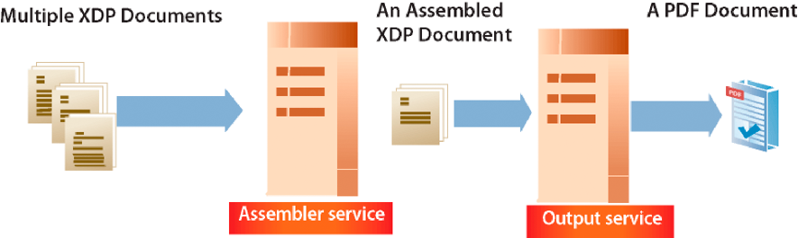

# Creazione di flussi di output dei documenti  {#creating-document-output-streams}

**Gli esempi e gli esempi contenuti in questo documento sono solo per l’ambiente AEM Forms su JEE.**

**Informazioni sul servizio di output**

Il servizio Output consente di eseguire l&#39;output di documenti come PDF (inclusi documenti PDF/A), PostScript, PCL (Printer Control Language) e nei seguenti formati di etichette:

* Zebra - ZPL
* Intermec - IPL
* Datamax - DPL
* TecToshiba - TPCL

Tramite il servizio di output è possibile unire i dati del modulo XML con la struttura di un modulo e inviare il documento a una stampante o a un file di rete.

Esistono due modi per passare una progettazione di un modulo (un file XDP) al servizio di output. È possibile passare un `com.adobe.idp.Document` istanza che contiene una struttura di modulo per il servizio di output. In alternativa, è possibile passare un valore URI che specifichi la posizione della struttura del modulo. Entrambi questi modi sono discussi in *Programmazione con i moduli AEM*.

>[!NOTE]
>
>Il servizio di output non supporta i documenti Acroform PDF che contengono script specifici per oggetti applicativi. I documenti Acroform PDF che contengono script specifici di oggetti applicativi non vengono sottoposti a rendering.

Nelle sezioni seguenti viene illustrato come passare una progettazione di modulo al servizio di output utilizzando un valore URI:

* [Creazione di documenti PDF](creating-document-output-streams.md#creating-pdf-documents)
* [Creazione di documenti PDF/A](creating-document-output-streams.md#creating-pdf-a-documents)

Nelle sezioni seguenti viene illustrato come passare una struttura di modulo all&#39;interno di un `com.adobe.idp.Document` istanza:

* [Passaggio di documenti in Content Services (obsoleto) al servizio di output](creating-document-output-streams.md#passing-documents-located-in-content-services-deprecated-to-the-output-service)
* [Creazione di documenti PDF tramite frammenti](creating-document-output-streams.md#creating-pdf-documents-using-fragments)

Per decidere quale tecnica utilizzare, è importante considerare se si sta ottenendo la progettazione del modulo da un altro servizio AEM Forms, quindi trasmetterla all’interno di un’ `com.adobe.idp.Document` dell&#39;istanza. Entrambe *Trasmissione di documenti al servizio di output* e *Creazione di documenti PDF tramite frammenti* Le sezioni mostrano come ottenere una progettazione di moduli da un altro servizio AEM Forms. La prima sezione recupera la progettazione del modulo da Content Services (obsoleto). La seconda sezione recupera la progettazione del modulo dal servizio Assembler.

Se la progettazione del modulo viene ottenuta da una posizione fissa, ad esempio il file system, è possibile utilizzare entrambe le tecniche. In altre parole, puoi specificare il valore URI in un file XDP o utilizzare un `com.adobe.idp.Document` dell&#39;istanza.

Per passare un valore URI che specifichi la posizione della struttura del modulo durante la creazione di un documento PDF, utilizzare `generatePDFOutput` metodo. Analogamente, per superare un `com.adobe.idp.Document` al servizio di output durante la creazione di un documento PDF, utilizza `generatePDFOutput2` metodo.

Quando si invia un flusso di output a una stampante di rete, è anche possibile utilizzare una delle due tecniche. Per inviare un flusso di output a una stampante passando un `com.adobe.idp.Document` che contiene una struttura di modulo, utilizzare `sendToPrinter2`metodo. Per inviare un flusso di output a una stampante passando un valore URI, utilizzare `sendToPrinter`metodo. Il *Invio di flussi di stampa alle stampanti* utilizza la sezione `sendToPrinter` metodo.

Puoi eseguire queste attività utilizzando il servizio di output:

* [Creazione di documenti PDF](creating-document-output-streams.md#creating-pdf-documents)
* [Creazione di documenti PDF/A](creating-document-output-streams.md#creating-pdf-a-documents)
* [Passaggio di documenti in Content Services (obsoleto) al servizio di output](creating-document-output-streams.md#passing-documents-located-in-content-services-deprecated-to-the-output-service)
* [Creazione di documenti PDF tramite frammenti](creating-document-output-streams.md#creating-pdf-documents-using-fragments)
* [Stampa su file](creating-document-output-streams.md#printing-to-files)
* [Invio di flussi di stampa alle stampanti](creating-document-output-streams.md#sending-print-streams-to-printers)
* [Creazione di più file di output](creating-document-output-streams.md#creating-multiple-output-files)
* [Creazione di regole di ricerca](creating-document-output-streams.md#creating-search-rules)
* [Appiattimento documenti PDF](creating-document-output-streams.md#flattening-pdf-documents)

>[!NOTE]
>
>Per ulteriori informazioni sul servizio di output, vedi [Guida di riferimento dei servizi per AEM Forms](https://www.adobe.com/go/learn_aemforms_services_63).

## Creazione di documenti PDF {#creating-pdf-documents}

È possibile utilizzare il servizio Output per creare un documento PDF basato sulla struttura di un modulo e sui dati del modulo XML forniti. Il documento PDF creato dal servizio di output non è un documento PDF interattivo. L&#39;utente non può immettere o modificare i dati del modulo.

Se desideri creare un documento PDF per l’archiviazione a lungo termine, ti consigliamo di creare un documento PDF/A. (vedere [Creazione di documenti PDF/A](creating-document-output-streams.md#creating-pdf-a-documents).)

Per creare un modulo PDF interattivo che consenta a un utente di immettere dati, utilizza il servizio Forms. (vedere [Rendering dei PDF forms interattivi](/help/forms/developing/rendering-forms.md#rendering-interactive-pdf-forms).)

>[!NOTE]
>
>Per ulteriori informazioni sul servizio di output, vedi [Guida di riferimento dei servizi per AEM Forms](https://www.adobe.com/go/learn_aemforms_services_63).

### Riepilogo dei passaggi {#summary-of-steps}

Per creare un documento PDF, effettuare le seguenti operazioni:

1. Includi file di progetto.
1. Creare un oggetto client di output.
1. Fare riferimento a un&#39;origine dati XML.
1. Impostare le opzioni di runtime di PDF.
1. Impostate le opzioni di runtime per il rendering.
1. Genera un documento PDF.
1. Recuperate i risultati dell&#39;operazione.

**Includi file di progetto**

Includi i file necessari nel progetto di sviluppo. Se stai creando un’applicazione client utilizzando Java, includi i file JAR necessari. Se utilizzi i servizi web, accertati di includere i file proxy.

I seguenti file JAR devono essere aggiunti al percorso di classe del progetto:

* adobe-livecycle-client.jar
* adobe-usermanager-client.jar
* adobe-output-client.jar
* adobe-utilities.jar (richiesto se AEM Forms è implementato su JBoss)
* jbossall-client.jar (obbligatorio se AEM Forms è distribuito su JBoss)

se AEM Forms viene distribuito su un server applicazioni J2EE supportato che non è JBoss, è necessario sostituire i file adobe-utilities.jar e jbossall-client.jar con file JAR specifici per il server applicazioni J2EE in cui viene distribuito AEM Forms.

**Creare un oggetto client di output**

Prima di poter eseguire un&#39;operazione del servizio di output a livello di programmazione, è necessario creare un oggetto client del servizio di output. Se utilizzi l’API Java, crea un’ `OutputClient` oggetto. Se utilizzi l’API del servizio web di output, crea un’ `OutputServiceService` oggetto.

**Riferimento a un&#39;origine dati XML**

Per unire i dati con la struttura del modulo, è necessario fare riferimento a un&#39;origine dati XML che contiene dati. Un elemento XML deve esistere per ogni campo modulo che si intende compilare con i dati. Il nome dell&#39;elemento XML deve corrispondere al nome del campo. Un elemento XML viene ignorato se non corrisponde a un campo modulo o se il nome dell&#39;elemento XML non corrisponde al nome del campo. Se vengono specificati tutti gli elementi XML, non è necessario che l&#39;ordine di visualizzazione degli elementi XML corrisponda a quello specificato.

Prendi in considerazione il seguente esempio di modulo di richiesta di prestito.


Per unire i dati in questa struttura di modulo, è necessario creare un&#39;origine dati XML corrispondente al modulo. Il codice XML seguente rappresenta un&#39;origine dati XML XDP che corrisponde al modulo di applicazione ipotecaria di esempio.

```xml
 <?xml version="1.0" encoding="UTF-8" ?>
 - <xfa:datasets xmlns:xfa="https://www.xfa.org/schema/xfa-data/1.0/">
 - <xfa:data>
 - <data>
     - <Layer>
         <closeDate>1/26/2007</closeDate>
         <lastName>Johnson</lastName>
         <firstName>Jerry</firstName>
         <mailingAddress>JJohnson@NoMailServer.com</mailingAddress>
         <city>New York</city>
         <zipCode>00501</zipCode>
         <state>NY</state>
         <dateBirth>26/08/1973</dateBirth>
         <middleInitials>D</middleInitials>
         <socialSecurityNumber>(555) 555-5555</socialSecurityNumber>
         <phoneNumber>5555550000</phoneNumber>
     </Layer>
     - <Mortgage>
         <mortgageAmount>295000.00</mortgageAmount>
         <monthlyMortgagePayment>1724.54</monthlyMortgagePayment>
         <purchasePrice>300000</purchasePrice>
         <downPayment>5000</downPayment>
         <term>25</term>
         <interestRate>5.00</interestRate>
     </Mortgage>
 </data>
 </xfa:data>
 </xfa:datasets>
```

**Imposta opzioni runtime di PDF**

Impostare l&#39;opzione URI file durante la creazione di un documento PDF. Questa opzione specifica il nome e la posizione del file PDF generato dal servizio di output.

>[!NOTE]
>
>Invece di impostare l&#39;opzione di runtime URI del file, è possibile recuperare in modo programmatico il documento PDF dal tipo di dati complesso restituito dal servizio di output. Tuttavia, impostando l&#39;opzione di runtime URI del file, non è necessario creare una logica dell&#39;applicazione che recuperi il documento PDF a livello di programmazione.

**Impostare le opzioni di runtime di rendering**

È possibile impostare le opzioni di rendering in fase di esecuzione durante la creazione di un documento PDF. Anche se queste opzioni non sono obbligatorie (a differenza delle opzioni di runtime di PDF necessarie), è possibile eseguire attività quali il miglioramento delle prestazioni del servizio di output. È ad esempio possibile memorizzare in cache la struttura del modulo utilizzata dal servizio di output per migliorarne le prestazioni.

Se come input si utilizza un modulo Acrobat con tag, non è possibile utilizzare l’API del servizio di output Java o del servizio web per disattivare l’impostazione dei tag. Se si tenta di impostare questa opzione a livello di programmazione su `false`, il documento PDF risultante viene ancora taggato.

>[!NOTE]
>
>Se non specificate le opzioni di rendering in fase di esecuzione, vengono utilizzati i valori predefiniti. Per informazioni sulle opzioni di rendering in fase di esecuzione, vedere `RenderOptionsSpec` riferimento di classe. (vedere [Riferimento API di AEM Forms](https://www.adobe.com/go/learn_aemforms_javadocs_63_en)).

**Generare un documento PDF**

Dopo aver fatto riferimento a un&#39;origine dati XML valida contenente dati del modulo e aver impostato le opzioni di runtime, è possibile richiamare il servizio di output, che genera un documento PDF.

Durante la generazione di un documento PDF, è possibile specificare i valori URI richiesti dal servizio di output per la creazione di un documento PDF. La progettazione di un modulo può essere archiviata in posizioni quali il file system del server o come parte di un&#39;applicazione AEM Forms. È possibile fare riferimento a una progettazione del modulo (o ad altre risorse, ad esempio un file di immagine) presente come parte di un’applicazione Forms utilizzando il valore URI della directory principale del contenuto `repository:///`. Si consideri, ad esempio, la struttura di modulo seguente denominata *Loan.xdp* si trova all’interno di un’applicazione Forms denominata *Applicazioni/FormsApplication*:


Per accedere al file Loan.xdp illustrato nell&#39;illustrazione precedente, specificare `repository:///Applications/FormsApplication/1.0/FormsFolder/` come terzo parametro trasmesso al `OutputClient` dell&#39;oggetto `generatePDFOutput` metodo. Specificare il nome del modulo (*Loan.xdp*) come secondo parametro trasmesso al `OutputClient` dell&#39;oggetto `generatePDFOutput` metodo.

Se il file XDP contiene immagini (o altre risorse, ad esempio frammenti), posiziona le risorse nella stessa cartella dell’applicazione del file XDP. AEM Forms utilizza l’URI della directory principale dei contenuti come percorso di base per risolvere i riferimenti alle immagini. Ad esempio, se il file Loan.xdp contiene un’immagine, accertati di inserirla in `Applications/FormsApplication/1.0/FormsFolder/`.

>[!NOTE]
>
>È possibile fare riferimento a un URI dell&#39;applicazione Forms quando si richiama `OutputClient` dell&#39;oggetto `generatePDFOutput` o `generatePrintedOutput` metodi.

>[!NOTE]
>
>Per visualizzare un avvio rapido completo che crea un documento PDF facendo riferimento a un XDP in un’applicazione Forms, consulta [Guida rapida (modalità EJB): creazione di un documento PDF basato su un file XDP dell’applicazione tramite l’API Java](/help/forms/developing/output-service-java-api-quick.md#quick-start-soap-mode-creating-a-pdf-document-based-on-an-application-xdp-file-using-the-java-api).

**Recuperare i risultati dell&#39;operazione**

Dopo aver eseguito un&#39;operazione, il servizio di output restituisce vari elementi di dati, ad esempio dati XML di stato, che specificano se l&#39;operazione è stata eseguita correttamente.

**Consulta anche**

[Creare un documento PDF utilizzando l’API Java](creating-document-output-streams.md#create-a-pdf-document-using-the-java-api)

[Creare un documento PDF utilizzando l’API del servizio web](creating-document-output-streams.md#create-a-pdf-document-using-the-web-service-api)

[Inclusione dei file della libreria Java di AEM Forms](/help/forms/developing/invoking-aem-forms-using-java.md#including-aem-forms-java-library-files)

[Impostazione delle proprietà di connessione](/help/forms/developing/invoking-aem-forms-using-java.md#setting-connection-properties)

[Avvio rapido API servizio di output](/help/forms/developing/output-service-java-api-quick.md#output-service-java-api-quick-start-soap)

### Creare un documento PDF utilizzando l’API Java {#create-a-pdf-document-using-the-java-api}

Crea un documento PDF utilizzando l’API di output (Java):

1. Includi file di progetto.

   Includi i file JAR client, come adobe-output-client.jar, nel percorso di classe del progetto Java.

1. Creare un oggetto client di output.

   * Creare un `ServiceClientFactory` oggetto che contiene proprietà di connessione.
   * Creare un `OutputClient` mediante il costruttore e passando il `ServiceClientFactory` oggetto.

1. Fare riferimento a un&#39;origine dati XML.

   * Creare un `java.io.FileInputStream` oggetto che rappresenta l&#39;origine dati XML utilizzata per popolare il documento PDF utilizzando il relativo costruttore e passando un valore stringa che specifica la posizione del file XML.
   * Creare un `com.adobe.idp.Document` mediante il costruttore. Passa il `java.io.FileInputStream` oggetto.

1. Impostare le opzioni di runtime di PDF.

   * Creare un `PDFOutputOptionsSpec` mediante il costruttore.
   * Impostare l&#39;opzione URI file richiamando `PDFOutputOptionsSpec` dell&#39;oggetto `setFileURI` metodo. Passa un valore stringa che specifica la posizione del file PDF generato dal servizio di output. L&#39;opzione URI file è relativa al server applicazioni J2EE che ospita AEM Forms, non al computer client.

1. Impostate le opzioni di runtime per il rendering.

   * Creare un `RenderOptionsSpec` mediante il costruttore.
   * Memorizza nella cache la progettazione del modulo per migliorare le prestazioni del servizio di output richiamando `RenderOptionsSpec` dell&#39;oggetto `setCacheEnabled` e superamento `true`.

   >[!NOTE]
   >
   >Non è possibile impostare la versione del documento PDF utilizzando `RenderOptionsSpec` dell&#39;oggetto `setPdfVersion` se il documento di input è un modulo di Acrobat (un modulo creato in Acrobat) o un documento XFA firmato o certificato. Il documento PDF di output conserva la versione originale di PDF. Allo stesso modo, non è possibile impostare l’opzione Adobe PDF con tag richiamando `RenderOptionsSpec` dell&#39;oggetto `setTaggedPDF` se il documento di input è un modulo Acrobat o un documento XFA firmato o certificato.

   >[!NOTE]
   >
   >Non è possibile impostare l&#39;opzione PDF linearizzato utilizzando `RenderOptionsSpec` dell&#39;oggetto `setLinearizedPDF` metodo se il documento di input PDF è certificato o firmato digitalmente. (vedere [Firma digitale dei documenti di PDF ](/help/forms/developing/digitally-signing-certifying-documents.md#digitally-signing-pdf-documents)*.)*

1. Genera un documento PDF.

   Creare un documento PDF richiamando `OutputClient` dell&#39;oggetto `generatePDFOutput` e fornendo i seguenti valori:

   * A `TransformationFormat` valore di enumerazione. Per generare un documento PDF, specifica `TransformationFormat.PDF`.
   * Valore stringa che specifica il nome della struttura del modulo.
   * Valore stringa che specifica la directory principale del contenuto in cui si trova la struttura del modulo.
   * A `PDFOutputOptionsSpec` oggetto contenente le opzioni di runtime di PDF.
   * A `RenderOptionsSpec` oggetto contenente le opzioni di rendering in fase di esecuzione.
   * Il `com.adobe.idp.Document` oggetto contenente l&#39;origine dati XML contenente i dati da unire con la struttura del modulo.

   Il `generatePDFOutput` il metodo restituisce un `OutputResult` oggetto che contiene i risultati dell&#39;operazione.

   >[!NOTE]
   >
   >Quando si genera un documento PDF richiamando il `generatePDFOutput` non è possibile unire i dati con un modulo PDF XFA firmato o certificato. (vedere [Firma digitale e certificazione dei documenti ](/help/forms/developing/digitally-signing-certifying-documents.md#digitally-signing-and-certifying-documents)*.)*

   >[!NOTE]
   >
   >Il `OutputResult` dell&#39;oggetto `getRecordLevelMetaDataList` restituisce il metodo `null`*.*

   >[!NOTE]
   >
   >È inoltre possibile creare un documento PDF richiamando `OutputClient` dell&#39;oggetto `generatePDFOutput2` metodo. (vedere [Passaggio di documenti in Content Services (obsoleto) al servizio di output ](creating-document-output-streams.md#passing-documents-located-in-content-services-deprecated-to-the-output-service)*.)*

1. Recuperate i risultati dell&#39;operazione.

   * Recuperare un `com.adobe.idp.Document` oggetto che rappresenta lo stato del `generatePDFOutput` operazione richiamando il `OutputResult` dell&#39;oggetto `getStatusDoc` metodo. Questo metodo restituisce dati XML di stato che specificano se l&#39;operazione è stata eseguita correttamente.
   * Creare un `java.io.File` oggetto che contiene i risultati dell&#39;operazione. Verificare che l&#39;estensione del nome file sia .xml.
   * Richiama `com.adobe.idp.Document` dell&#39;oggetto `copyToFile` metodo per copiare il contenuto del `com.adobe.idp.Document` al file (assicurati di utilizzare il `com.adobe.idp.Document` oggetto restituito da `getStatusDoc` metodo).

   Sebbene il servizio di output scriva il documento PDF nella posizione specificata dall&#39;argomento passato al `PDFOutputOptionsSpec` dell&#39;oggetto `setFileURI` , è possibile recuperare in modo programmatico il documento PDF/A richiamando il `OutputResult` dell&#39;oggetto `getGeneratedDoc` metodo.

**Consulta anche**

[Riepilogo dei passaggi](creating-document-output-streams.md#summary-of-steps)

[Guida rapida (modalità EJB): creazione di un documento PDF tramite l’API Java](/help/forms/developing/output-service-java-api-quick.md#quick-start-soap-mode-creating-a-pdf-document-using-the-java-api)

[Guida rapida (modalità SOAP): creazione di un documento PDF tramite l’API Java](/help/forms/developing/output-service-java-api-quick.md#quick-start-soap-mode-creating-a-pdf-document-using-the-java-api)

[Inclusione dei file della libreria Java di AEM Forms](/help/forms/developing/invoking-aem-forms-using-java.md#including-aem-forms-java-library-files)

[Impostazione delle proprietà di connessione](/help/forms/developing/invoking-aem-forms-using-java.md#setting-connection-properties)

### Creare un documento PDF utilizzando l’API del servizio web {#create-a-pdf-document-using-the-web-service-api}

Crea un documento PDF utilizzando l’API di output (servizio web):

1. Includi file di progetto.

   Creare un progetto Microsoft .NET che utilizza MTOM. Assicurarsi di utilizzare la seguente definizione WSDL: `http://localhost:8080/soap/services/OutputService?WSDL&lc_version=9.0.1`.

   >[!NOTE]
   >
   >Sostituisci `localhost` con l’indirizzo IP del server che ospita AEM Forms.

1. Creare un oggetto client di output.

   * Creare un `OutputServiceClient` utilizzando il costruttore predefinito.
   * Creare un `OutputServiceClient.Endpoint.Address` oggetto utilizzando `System.ServiceModel.EndpointAddress` costruttore. Passa un valore stringa che specifica il file WSDL al servizio AEM Forms (ad esempio, `http://localhost:8080/soap/services/OutputService?blob=mtom`.) Non è necessario utilizzare il `lc_version` attributo. Questo attributo viene utilizzato quando si crea un riferimento a un servizio. Tuttavia, specifica `?blob=mtom` per utilizzare MTOM.
   * Creare un `System.ServiceModel.BasicHttpBinding` dell&#39;oggetto ottenendo il valore del `OutputServiceClient.Endpoint.Binding` campo. Invia il valore restituito a `BasicHttpBinding`.
   * Imposta il `System.ServiceModel.BasicHttpBinding` dell&#39;oggetto `MessageEncoding` campo a `WSMessageEncoding.Mtom`. Questo valore assicura che venga utilizzato MTOM.
   * Abilita l’autenticazione HTTP di base eseguendo le seguenti attività:

      * Assegna al campo il nome utente dei moduli AEM `OutputServiceClient.ClientCredentials.UserName.UserName`.
      * Assegna il valore password corrispondente al campo `OutputServiceClient.ClientCredentials.UserName.Password`.
      * Assegna il valore costante `HttpClientCredentialType.Basic` al campo `BasicHttpBindingSecurity.Transport.ClientCredentialType`.
      * Assegna il valore costante `BasicHttpSecurityMode.TransportCredentialOnly` al campo `BasicHttpBindingSecurity.Security.Mode`.

1. Fare riferimento a un&#39;origine dati XML.

   * Creare un `BLOB` mediante il costruttore. Il `BLOB` L&#39;oggetto viene utilizzato per memorizzare i dati XML che verranno uniti al documento PDF.
   * Creare un `System.IO.FileStream` richiamando il relativo costruttore e passando un valore stringa che rappresenta la posizione del file XML contenente i dati del modulo.
   * Creare una matrice di byte che memorizza il contenuto della `System.IO.FileStream` oggetto. È possibile determinare le dimensioni della matrice di byte ottenendo `System.IO.FileStream` dell&#39;oggetto `Length` proprietà.
   * Compilare la matrice di byte con i dati di flusso richiamando `System.IO.FileStream` dell&#39;oggetto `Read` e passando la matrice di byte, la posizione iniziale e la lunghezza del flusso da leggere.
   * Popolare il `BLOB` oggetto assegnando il relativo `MTOM` con il contenuto della matrice di byte.

1. Imposta opzioni runtime di PDF

   * Creare un `PDFOutputOptionsSpec` mediante il costruttore.
   * Impostare l&#39;opzione URI file assegnando un valore stringa che specifichi la posizione del file PDF generato dal servizio di output `PDFOutputOptionsSpec` dell&#39;oggetto `fileURI` membro dati. L&#39;opzione URI file è relativa al server applicazioni J2EE che ospita AEM Forms, non al computer client.

1. Impostate le opzioni di runtime per il rendering.

   * Creare un `RenderOptionsSpec` mediante il costruttore.
   * Memorizza nella cache la progettazione del modulo per migliorare le prestazioni del servizio di output assegnando il valore `true` al `RenderOptionsSpec` dell&#39;oggetto `cacheEnabled` membro dati.

   >[!NOTE]
   >
   >Non è possibile impostare la versione del documento PDF utilizzando `RenderOptionsSpec` dell&#39;oggetto `setPdfVersion` se il documento di input è un modulo di Acrobat (un modulo creato in Acrobat) o un documento XFA firmato o certificato. Il documento PDF di output conserva la versione originale di PDF. Allo stesso modo, non è possibile impostare l’opzione Adobe PDF con tag richiamando `RenderOptionsSpec` dell&#39;oggetto `setTaggedPDF`* se il documento di input è un modulo Acrobat o un documento XFA firmato o certificato.*

   >[!NOTE]
   >
   >Non è possibile impostare l&#39;opzione PDF linearizzato utilizzando `RenderOptionsSpec` dell&#39;oggetto `linearizedPDF` membro se il documento di input PDF è certificato o firmato digitalmente. (vedere [Firma digitale dei documenti di PDF ](/help/forms/developing/digitally-signing-certifying-documents.md#digitally-signing-pdf-documents)*.)*

1. Genera un documento PDF.

   Creare un documento PDF richiamando `OutputServiceService` dell&#39;oggetto `generatePDFOutput`e fornendo i seguenti valori:

   * A `TransformationFormat` valore di enumerazione. Per generare un documento PDF, specifica `TransformationFormat.PDF`.
   * Valore stringa che specifica il nome della struttura del modulo.
   * Valore stringa che specifica la directory principale del contenuto in cui si trova la struttura del modulo.
   * A `PDFOutputOptionsSpec` oggetto contenente le opzioni di runtime di PDF.
   * A `RenderOptionsSpec` oggetto contenente le opzioni di rendering in fase di esecuzione.
   * Il `BLOB` oggetto contenente l&#39;origine dati XML contenente i dati da unire con la struttura del modulo.
   * A `BLOB` oggetto popolato da `generatePDFOutput` metodo. Il `generatePDFOutput` Il metodo popola questo oggetto con i metadati generati che descrivono il documento. (Questo valore di parametro è richiesto solo per la chiamata del servizio Web).
   * A `BLOB` oggetto popolato da `generatePDFOutput` metodo. Il `generatePDFOutput` Il metodo popola questo oggetto con i dati dei risultati. (Questo valore di parametro è richiesto solo per la chiamata del servizio Web).
   * Un `OutputResult` oggetto che contiene i risultati dell&#39;operazione. (Questo valore di parametro è richiesto solo per la chiamata del servizio Web).

   >[!NOTE]
   >
   >Quando si genera un documento PDF richiamando il `generatePDFOutput` non è possibile unire i dati con un modulo PDF XFA firmato o certificato. (vedere [Firma digitale e certificazione dei documenti ](/help/forms/developing/digitally-signing-certifying-documents.md#digitally-signing-and-certifying-documents)*.)*

   >[!NOTE]
   >
   >È inoltre possibile creare un documento PDF richiamando `OutputClient` dell&#39;oggetto `generatePDFOutput2` metodo. (vedere [Passaggio di documenti in Content Services (obsoleto) al servizio di output ](creating-document-output-streams.md#passing-documents-located-in-content-services-deprecated-to-the-output-service)*.)*

1. Recuperate i risultati dell&#39;operazione.

   * Creare un `System.IO.FileStream` richiamando il relativo costruttore e passando un valore stringa che rappresenta una posizione del file XML contenente i dati dei risultati. Verificare che l&#39;estensione del nome file sia .xml.
   * Creare una matrice di byte che memorizza il contenuto dei dati `BLOB` oggetto che è stato popolato con i dati dei risultati da `OutputServiceService` dell&#39;oggetto `generatePDFOutput` (ottavo parametro). Popolare la matrice di byte ottenendo il valore della `BLOB` dell&#39;oggetto `MTOM` `field`.
   * Creare un `System.IO.BinaryWriter` oggetto richiamando il relativo costruttore e passando il `System.IO.FileStream` oggetto.
   * Scrivere il contenuto della matrice di byte nel file XML richiamando `System.IO.BinaryWriter` dell&#39;oggetto `Write` e passando la matrice di byte.

   Consulta anche

[Riepilogo dei passaggi](creating-document-output-streams.md#summary-of-steps)

[Richiamare AEM Forms tramite MTOM](/help/forms/developing/invoking-aem-forms-using-web.md#invoking-aem-forms-using-mtom)

[Richiamare AEM Forms con SwaRef](/help/forms/developing/invoking-aem-forms-using-web.md#invoking-aem-forms-using-swaref)

   >[!NOTE]
   >
   >Il `OutputServiceService` dell&#39;oggetto `generateOutput` è obsoleto.

## Creazione di documenti PDF/A {#creating-pdf-a-documents}

È possibile utilizzare il servizio di output per creare un documento PDF/A. Poiché PDF/A è un formato di archiviazione per la conservazione a lungo termine del contenuto del documento, tutti i font vengono incorporati e il file non viene compresso. Di conseguenza, un documento PDF/A è generalmente più grande di un documento PDF standard. Inoltre, un documento PDF/A non contiene contenuti audio e video. Analogamente ad altre attività del servizio di output, è possibile fornire sia una struttura di modulo che dati da unire a una struttura di modulo per creare un documento PDF/A.

La specifica PDF/A-1 è costituita da due livelli di conformità, ovvero a e b. La differenza principale tra i due è relativa al supporto della struttura logica (accessibilità), che non è richiesto per il livello di conformità b. Indipendentemente dal livello di conformità, PDF/A-1 stabilisce che tutti i font sono incorporati nel documento PDF/A generato.

Sebbene PDF/A sia lo standard per l&#39;archiviazione dei documenti PDF PDF, non è obbligatorio utilizzarlo per l&#39;archiviazione se un documento PDF standard soddisfa le esigenze della società. Lo scopo dello standard PDF/A è quello di stabilire un file PDF che possa essere memorizzato per un lungo periodo di tempo e che soddisfi i requisiti di conservazione dei documenti. Ad esempio, non è possibile incorporare un URL in un PDF/A perché nel tempo l’URL potrebbe diventare non valido.

L&#39;organizzazione deve valutare le proprie esigenze, il periodo di tempo in cui si intende conservare il documento, le considerazioni sulla dimensione del file e determinare la propria strategia di archiviazione. È possibile determinare a livello di programmazione se un documento PDF è compatibile con PDF/A utilizzando il servizio DocConverter. (vedere [Determinazione a livello di programmazione della conformità di PDF/A](/help/forms/developing/pdf-a-documents.md#programmatically-determining-pdf-a-compliancy).)

Un documento di PDF/A deve utilizzare il tipo di carattere specificato nella struttura del modulo e non può essere sostituito. Di conseguenza, se un tipo di carattere che si trova all&#39;interno di un documento PDF non è disponibile nel sistema operativo host, si verifica un&#39;eccezione.

Quando un documento PDF/A viene aperto in Acrobat, viene visualizzato un messaggio che conferma che il documento è un documento PDF/A, come illustrato nella figura seguente.


>[!NOTE]
>
>Il sito web AIIM dispone di una sezione di domande frequenti su PDF/A a cui è possibile accedere all’indirizzo [https://www.loc.gov/preservation/digital/formats/fdd/fdd000125.shtml](https://www.loc.gov/preservation/digital/formats/fdd/fdd000125.shtml).

>[!NOTE]
>
>Per ulteriori informazioni sul servizio di output, vedi [Guida di riferimento dei servizi per AEM Forms](https://www.adobe.com/go/learn_aemforms_services_65).

### Riepilogo dei passaggi {#summary_of_steps-1}

Per creare un documento PDF/A, effettuare le seguenti operazioni:

1. Includi file di progetto.
1. Creare un oggetto client di output.
1. Fare riferimento a un&#39;origine dati XML.
1. Impostare le opzioni di runtime di PDF/A.
1. Impostate le opzioni di runtime per il rendering.
1. Genera un documento PDF/A.
1. Recuperate i risultati dell&#39;operazione.

**Includi file di progetto**

Includi i file necessari nel progetto di sviluppo. Se stai creando un’applicazione personalizzata utilizzando Java, includi i file JAR necessari. Se utilizzi i servizi web, accertati di includere i file proxy.

I seguenti file JAR devono essere aggiunti al percorso della classe del progetto:

* adobe-livecycle-client.jar
* adobe-usermanager-client.jar
* adobe-output-client.jar
* adobe-utilities.jar (richiesto se AEM Forms è implementato su JBoss)
* jbossall-client.jar (obbligatorio se AEM Forms è distribuito su JBoss)

se AEM Forms viene distribuito su un server applicazioni J2EE supportato che non è JBoss, è necessario sostituire i file adobe-utilities.jar e jbossall-client.jar con file JAR specifici per il server applicazioni J2EE in cui viene distribuito AEM Forms.

**Creare un oggetto client di output**

Prima di poter eseguire un&#39;operazione del servizio di output a livello di programmazione, è necessario creare un oggetto client del servizio di output. Se utilizzi l’API Java, crea un’ `OutputClient` oggetto. Se utilizzi l’API del servizio web di output, crea un’ `OutputServiceService` oggetto.

**Riferimento a un&#39;origine dati XML**

Per unire i dati con la struttura del modulo, è necessario fare riferimento a un&#39;origine dati XML che contiene dati. Un elemento XML deve esistere per ogni campo modulo che si desidera compilare con i dati. Il nome dell&#39;elemento XML deve corrispondere al nome del campo. Un elemento XML viene ignorato se non corrisponde a un campo modulo o se il nome dell&#39;elemento XML non corrisponde al nome del campo. Se vengono specificati tutti gli elementi XML, non è necessario che l&#39;ordine di visualizzazione degli elementi XML corrisponda a quello specificato.

**Impostare le opzioni di runtime di PDF/A**

È possibile impostare l&#39;opzione URI file durante la creazione di un documento PDF/A. L&#39;URI è relativo al server applicazioni J2EE che ospita AEM Forms. In altre parole, se si imposta C:\Adobe, il file viene scritto nella cartella sul server, non nel computer client. L&#39;URI specifica il nome e la posizione del file PDF/A generato dal servizio di output.

**Impostare le opzioni di runtime di rendering**

È possibile impostare le opzioni di rendering in fase di esecuzione durante la creazione di documenti PDF/A. È possibile impostare due opzioni correlate di PDF/A: `PDFAConformance` e `PDFARevisionNumber` valori. Il `PDFAConformance` value (valore) si riferisce al modo in cui un documento PDF rispetta i requisiti che specificano il modo in cui vengono conservati i documenti elettronici a lungo termine. I valori validi per questa opzione sono `A` e `B`. Per informazioni sulla conformità ai livelli a e b, vedere la specifica ISO PDF/A-1 intitolata *Gestione documenti ISO 19005-1*.

Il `PDFARevisionNumber` valore si riferisce al numero di revisione di un documento PDF/A. Per informazioni sul numero di revisione di un documento PDF/A, vedere la specifica ISO PDF/A-1 denominata *Gestione documenti ISO 19005-1*.

>[!NOTE]
>
>Non è possibile impostare l’opzione Adobe PDF con tag su `false` durante la creazione di un documento PDF/A 1A. PDF/A 1A sarà sempre un documento di PDF con tag. Inoltre, non è possibile impostare l’opzione Adobe PDF con tag su `true` durante la creazione di un documento PDF/A 1B. PDF/A 1B sarà sempre un documento di PDF senza tag.

**Generare un documento PDF/A**

Dopo aver fatto riferimento a un&#39;origine dati XML valida che contiene dati del modulo e aver impostato le opzioni di runtime, è possibile richiamare il servizio di output per generare un documento PDF/A.

**Recuperare i risultati dell&#39;operazione**

Dopo l&#39;esecuzione di un&#39;operazione, il servizio di output restituisce vari elementi di dati, ad esempio dati XML, che specificano se l&#39;operazione è stata eseguita correttamente.

**Consulta anche**

[Creare un documento PDF/A utilizzando l’API Java](creating-document-output-streams.md#create-a-pdf-a-document-using-the-java-api)

[Creare un documento PDF/A utilizzando l’API del servizio web](creating-document-output-streams.md#create-a-pdf-a-document-using-the-web-service-api)

[Inclusione dei file della libreria Java di AEM Forms](/help/forms/developing/invoking-aem-forms-using-java.md#including-aem-forms-java-library-files)

[Impostazione delle proprietà di connessione](/help/forms/developing/invoking-aem-forms-using-java.md#setting-connection-properties)

[Avvio rapido API servizio di output](/help/forms/developing/output-service-java-api-quick.md#output-service-java-api-quick-start-soap)

### Creare un documento PDF/A utilizzando l’API Java {#create-a-pdf-a-document-using-the-java-api}

Crea un documento PDF/A utilizzando l’API di output (Java):

1. Includi file di progetto.

   Includi i file JAR client, come adobe-output-client.jar, nel percorso di classe del progetto Java.

1. Creare un oggetto client di output.

   * Creare un `ServiceClientFactory` oggetto che contiene proprietà di connessione.
   * Creare un `OutputClient` mediante il costruttore e passando il `ServiceClientFactory` oggetto.

1. Fare riferimento a un&#39;origine dati XML.

   * Creare un `java.io.FileInputStream` oggetto che rappresenta l&#39;origine dati XML utilizzata per popolare il documento PDF/A utilizzando il relativo costruttore e passando un valore stringa che specifica la posizione del file XML.
   * Creare un `com.adobe.idp.Document` mediante il costruttore e passando il `java.io.FileInputStream` oggetto.

1. Impostare le opzioni di runtime di PDF/A.

   * Creare un `PDFOutputOptionsSpec` mediante il costruttore.
   * Impostare l&#39;opzione URI file richiamando `PDFOutputOptionsSpec` dell&#39;oggetto `setFileURI` metodo. Passa un valore stringa che specifica la posizione del file PDF generato dal servizio di output. L&#39;opzione URI file è relativa al server applicazioni J2EE che ospita AEM Forms, non al computer client.

1. Impostate le opzioni di runtime per il rendering.

   * Creare un `RenderOptionsSpec` mediante il costruttore.
   * Imposta il `PDFAConformance` valore richiamando il `RenderOptionsSpec` dell&#39;oggetto `setPDFAConformance` e il passaggio di un `PDFAConformance` valore enum che specifica il livello di conformità. Ad esempio, per specificare il livello di conformità A, passare `PDFAConformance.A`.
   * Imposta il `PDFARevisionNumber` valore richiamando il `RenderOptionsSpec` dell&#39;oggetto `setPDFARevisionNumber` metodo e passaggio `PDFARevisionNumber.Revision_1`.

   >[!NOTE]
   >
   >La versione PDF di un documento PDF/A è 1.4, indipendentemente dal valore specificato per `RenderOptionsSpec` dell&#39;oggetto `setPdfVersion`*metodo.*

1. Genera un documento PDF/A.

   Creare un documento di PDF/A richiamando `OutputClient` dell&#39;oggetto `generatePDFOutput` e fornendo i seguenti valori:

   * A `TransformationFormat` valore di enumerazione. Per generare un documento PDF/A, specifica `TransformationFormat.PDFA`.
   * Valore stringa che specifica il nome della struttura del modulo.
   * Valore stringa che specifica la directory principale del contenuto in cui si trova la struttura del modulo.
   * A `PDFOutputOptionsSpec` oggetto contenente le opzioni di runtime di PDF.
   * A `RenderOptionsSpec` oggetto contenente le opzioni di rendering in fase di esecuzione.
   * Il `com.adobe.idp.Document` oggetto che contiene l&#39;origine dati XML contenente i dati da unire con la struttura del modulo.

   Il `generatePDFOutput` il metodo restituisce un `OutputResult` oggetto che contiene i risultati dell&#39;operazione.

   >[!NOTE]
   >
   >Il `OutputResult` dell&#39;oggetto `getRecordLevelMetaDataList` restituisce il metodo `null`.

   >[!NOTE]
   >
   >È inoltre possibile creare un documento PDF/A richiamando il `OutputClient` dell&#39;oggetto `generatePDFOutput`2. (vedere [Passaggio di documenti in Content Services (obsoleto) al servizio di output](creating-document-output-streams.md#passing-documents-located-in-content-services-deprecated-to-the-output-service).)

1. Recuperate i risultati dell&#39;operazione.

   * Creare un `com.adobe.idp.Document` oggetto che rappresenta lo stato del `generatePDFOutput` richiamando il metodo `OutputResult` dell&#39;oggetto `getStatusDoc` metodo.
   * Creare un `java.io.File` oggetto che conterrà i risultati dell&#39;operazione. Verificare che l&#39;estensione del nome file sia .xml.
   * Richiama `com.adobe.idp.Document` dell&#39;oggetto `copyToFile` metodo per copiare il contenuto del `com.adobe.idp.Document` al file (assicurati di utilizzare il `com.adobe.idp.Document` oggetto restituito da `getStatusDoc` metodo).

   >[!NOTE]
   >
   >Sebbene il servizio di output scriva il documento PDF/A nella posizione specificata dall&#39;argomento passato al `PDFOutputOptionsSpec` dell&#39;oggetto `setFileURI` , è possibile recuperare in modo programmatico il documento PDF/A richiamando il `OutputResult` dell&#39;oggetto `getGeneratedDoc` metodo.

**Consulta anche**

[Riepilogo dei passaggi](creating-document-output-streams.md#summary-of-steps)

[Guida rapida (modalità SOAP): creazione di un documento PDF/A tramite l’API Java](/help/forms/developing/output-service-java-api-quick.md#quick-start-soap-mode-creating-a-pdf-a-document-using-the-java-api)

[Inclusione dei file della libreria Java di AEM Forms](/help/forms/developing/invoking-aem-forms-using-java.md#including-aem-forms-java-library-files)

[Impostazione delle proprietà di connessione](/help/forms/developing/invoking-aem-forms-using-java.md#setting-connection-properties).

### Creare un documento PDF/A utilizzando l’API del servizio web {#create-a-pdf-a-document-using-the-web-service-api}

Crea un documento PDF/A utilizzando l’API di output (servizio web):

1. Includi file di progetto.

   Creare un progetto Microsoft .NET che utilizza MTOM. Assicurarsi di utilizzare la seguente definizione WSDL: `http://localhost:8080/soap/services/OutputService?WSDL&lc_version=9.0.1`.

   >[!NOTE]
   >
   >Sostituisci `localhost` con l’indirizzo IP del server che ospita AEM Forms.

1. Creare un oggetto client di output.

   * Creare un `OutputServiceClient` utilizzando il costruttore predefinito.
   * Creare un `OutputServiceClient.Endpoint.Address` oggetto utilizzando `System.ServiceModel.EndpointAddress` costruttore. Passa un valore stringa che specifica il file WSDL al servizio AEM Forms (ad esempio, `http://localhost:8080/soap/services/OutputService?blob=mtom`.) Non è necessario utilizzare il `lc_version` attributo. Questo attributo viene utilizzato quando si crea un riferimento a un servizio. Tuttavia, specifica `?blob=mtom` per utilizzare MTOM.
   * Creare un `System.ServiceModel.BasicHttpBinding` dell&#39;oggetto ottenendo il valore del `OutputServiceClient.Endpoint.Binding` campo. Invia il valore restituito a `BasicHttpBinding`.
   * Imposta il `System.ServiceModel.BasicHttpBinding` dell&#39;oggetto `MessageEncoding` campo a `WSMessageEncoding.Mtom`. Questo valore assicura che venga utilizzato MTOM.
   * Abilita l’autenticazione HTTP di base eseguendo le seguenti attività:

      * Assegna al campo il nome utente dei moduli AEM `OutputServiceClient.ClientCredentials.UserName.UserName`.
      * Assegna il valore password corrispondente al campo `OutputServiceClient.ClientCredentials.UserName.Password`.
      * Assegna il valore costante `HttpClientCredentialType.Basic` al campo `BasicHttpBindingSecurity.Transport.ClientCredentialType`.
      * Assegna il valore costante `BasicHttpSecurityMode.TransportCredentialOnly` al campo `BasicHttpBindingSecurity.Security.Mode`.

1. Fare riferimento a un&#39;origine dati XML.

   * Creare un `BLOB` mediante il costruttore. Il `BLOB` L&#39;oggetto viene utilizzato per memorizzare i dati che verranno uniti al documento PDF/A.
   * Creare un `System.IO.FileStream` richiamando il costruttore e passando un valore stringa che rappresenta la posizione del file del documento PDF da crittografare e la modalità di apertura del file.
   * Creare una matrice di byte che memorizza il contenuto della `System.IO.FileStream` oggetto. È possibile determinare le dimensioni della matrice di byte ottenendo `System.IO.FileStream` dell&#39;oggetto `Length` proprietà.
   * Compilare la matrice di byte con i dati di flusso richiamando `System.IO.FileStream` dell&#39;oggetto `Read` e passando la matrice di byte, la posizione iniziale e la lunghezza del flusso da leggere.
   * Popolare il `BLOB` oggetto assegnando il relativo `MTOM` con il contenuto della matrice di byte.

1. Impostare le opzioni di runtime di PDF/A.

   * Creare un `PDFOutputOptionsSpec` mediante il costruttore.
   * Impostare l&#39;opzione URI file assegnando un valore stringa che specifichi la posizione del file PDF generato dal servizio di output `PDFOutputOptionsSpec` dell&#39;oggetto `fileURI` membro dati. L&#39;opzione URI file è relativa al server applicazioni J2EE che ospita AEM Forms, non al computer client

1. Impostate le opzioni di runtime per il rendering.

   * Creare un `RenderOptionsSpec` mediante il costruttore.
   * Imposta il `PDFAConformance` valore assegnando un `PDFAConformance` valore enum per `RenderOptionsSpec` dell&#39;oggetto `PDFAConformance` membro dati. Ad esempio, per specificare il livello di conformità A, assegnare `PDFAConformance.A` a questo membro dati.
   * Imposta il `PDFARevisionNumber` valore assegnando un `PDFARevisionNumber` valore enum per `RenderOptionsSpec` dell&#39;oggetto `PDFARevisionNumber` membro dati. Assegna `PDFARevisionNumber.Revision_1` a questo membro dati.

   >[!NOTE]
   >
   >La versione PDF di un documento PDF/A è 1.4, indipendentemente dal valore specificato.

1. Genera un documento PDF/A.

   Creare un documento PDF richiamando `OutputServiceService` dell&#39;oggetto `generatePDFOutput`e fornendo i seguenti valori:

   * Valore di enumerazione TransformationFormat. Per generare un documento PDF, specifica `TransformationFormat.PDFA`.
   * Valore stringa che specifica il nome della struttura del modulo.
   * Valore stringa che specifica la directory principale del contenuto in cui si trova la struttura del modulo.
   * A `PDFOutputOptionsSpec` oggetto contenente le opzioni di runtime di PDF.
   * A `RenderOptionsSpec` oggetto contenente le opzioni di rendering in fase di esecuzione.
   * Il `BLOB` oggetto contenente l&#39;origine dati XML contenente i dati da unire con la struttura del modulo.
   * A `BLOB` oggetto popolato da `generatePDFOutput` metodo. Il `generatePDFOutput` Il metodo popola questo oggetto con i metadati generati che descrivono il documento. (Questo valore di parametro è obbligatorio solo per le chiamate al servizio web).
   * A `BLOB` oggetto popolato da `generatePDFOutput` metodo. Il `generatePDFOutput` Il metodo popola questo oggetto con i dati dei risultati. (Questo valore di parametro è obbligatorio solo per le chiamate al servizio web).
   * Un `OutputResult` oggetto che contiene i risultati dell&#39;operazione. (Questo valore di parametro è obbligatorio solo per le chiamate al servizio web).

   >[!NOTE]
   >
   >È inoltre possibile creare un documento PDF/A richiamando il `OutputClient` dell&#39;oggetto `generatePDFOutput`2. (vedere [Passaggio di documenti in Content Services (obsoleto) al servizio di output](creating-document-output-streams.md#passing-documents-located-in-content-services-deprecated-to-the-output-service).)

1. Recuperate i risultati dell&#39;operazione.

   * Creare un `System.IO.FileStream` richiamando il relativo costruttore e passando un valore stringa che rappresenta una posizione del file XML contenente i dati dei risultati. Verificare che l&#39;estensione del nome file sia .xml.
   * Creare una matrice di byte che memorizza il contenuto dei dati `BLOB` oggetto che è stato popolato con i dati dei risultati da `OutputServiceService` dell&#39;oggetto `generatePDFOutput` (ottavo parametro). Popolare la matrice di byte ottenendo il valore della `BLOB` dell&#39;oggetto `MTOM` campo.
   * Creare un `System.IO.BinaryWriter` oggetto richiamando il relativo costruttore e passando il `System.IO.FileStream` oggetto.
   * Scrivere il contenuto della matrice di byte nel file XML richiamando `System.IO.BinaryWriter` dell&#39;oggetto `Write` e passando la matrice di byte.

**Consulta anche**

[Riepilogo dei passaggi](creating-document-output-streams.md#summary-of-steps)

[Richiamare AEM Forms tramite MTOM](/help/forms/developing/invoking-aem-forms-using-web.md#invoking-aem-forms-using-mtom)

[Richiamare AEM Forms con SwaRef](/help/forms/developing/invoking-aem-forms-using-web.md#invoking-aem-forms-using-swaref)

## Passaggio di documenti in Content Services (obsoleto) al servizio di output {#passing-documents-located-in-content-services-deprecated-to-the-output-service}

Il servizio di output esegue il rendering di un modulo di PDF non interattivo basato su una struttura di modulo in genere salvata come file XDP e creata in Designer. È possibile passare un `com.adobe.idp.Document` oggetto che contiene la struttura del modulo per il servizio di output. Il servizio di output esegue quindi il rendering della struttura del modulo nel `com.adobe.idp.Document` oggetto.

Il vantaggio di superare un `com.adobe.idp.Document` al servizio di output è che altre operazioni del servizio AEM Forms restituiscono un `com.adobe.idp.Document` dell&#39;istanza. In altre parole, puoi ottenere un `com.adobe.idp.Document` da un&#39;altra operazione di servizio ed eseguirne il rendering. Ad esempio, si supponga che un file XDP sia memorizzato in un nodo Content Services (obsoleto) denominato `/Company Home/Form Designs`, come illustrato nella figura seguente.

È possibile recuperare in modo programmatico Loan.xdp da Content Services (obsoleto) e passare il file XDP al servizio di output all’interno di un `com.adobe.idp.Document` oggetto.

>[!NOTE]
>
>Per ulteriori informazioni sul servizio Forms, consulta [Guida di riferimento dei servizi per AEM Forms](https://www.adobe.com/go/learn_aemforms_services_63).

### Riepilogo dei passaggi {#summary_of_steps-2}

Per passare un documento ottenuto da Content Services (obsoleto) al servizio di output, eseguire le operazioni seguenti:

1. Includi file di progetto.
1. Creare un oggetto Output e un oggetto API Client di Document Management.
1. Recupera la progettazione del modulo da Content Services (obsoleto).
1. Esegui il rendering del modulo di PDF non interattivo.
1. Eseguire un&#39;azione con il flusso di dati.

**Includi file di progetto**

Includi i file necessari nel progetto di sviluppo. Se stai creando un’applicazione client utilizzando Java, includi i file JAR necessari. Se si utilizzano servizi Web, includere i file proxy.

**Creare un oggetto API Client di output e Document Management**

Prima di poter eseguire un&#39;operazione API del servizio di output a livello di programmazione, creare un oggetto API del client di output. Inoltre, poiché questo flusso di lavoro recupera un file XDP da Content Services (obsoleto), crea un oggetto API di gestione dei documenti.

**Recuperare la progettazione del modulo da Content Services (obsoleto)**

Recupera il file XDP da Content Services (obsoleto) utilizzando l’API Java o del servizio web. Il file XDP viene restituito all’interno di un `com.adobe.idp.Document` istanza (o un `BLOB` se si utilizzano i servizi web). È quindi possibile trasmettere `com.adobe.idp.Document` al servizio di output.

**Rendering del modulo di PDF non interattivo**

Per riprodurre un modulo non interattivo, trasmettere `com.adobe.idp.Document` Istanza restituita da Content Services (obsoleta) al servizio di output.

>[!NOTE]
>
>Due nuovi metodi: `generatePDFOutput2`e g `eneratePrintedOutput2`accetta un `com.adobe.idp.Document` oggetto che contiene una struttura di modulo. È inoltre possibile trasmettere un `com.adobe.idp.Document`che contiene la struttura del modulo al servizio di output quando si invia un flusso di stampa a una stampante di rete.

**Eseguire un&#39;azione con il flusso di dati del modulo**

È possibile salvare il modulo non interattivo come file PDF. Il modulo può essere visualizzato in Adobe Reader o Acrobat.

**Consulta anche**

[Trasmettere i documenti al servizio di output utilizzando l’API Java](creating-document-output-streams.md#pass-documents-to-the-output-service-using-the-java-api)

[Trasmettere i documenti al servizio di output utilizzando l’API del servizio web](creating-document-output-streams.md#pass-documents-to-the-output-service-using-the-web-service-api)

[Inclusione dei file della libreria Java di AEM Forms](/help/forms/developing/invoking-aem-forms-using-java.md#including-aem-forms-java-library-files)

[Impostazione delle proprietà di connessione](/help/forms/developing/invoking-aem-forms-using-java.md#setting-connection-properties)

[Avvio rapido API servizio di output](/help/forms/developing/output-service-java-api-quick.md#output-service-java-api-quick-start-soap)

[Creazione di documenti PDF tramite frammenti](creating-document-output-streams.md#creating-pdf-documents-using-fragments)

### Trasmettere i documenti al servizio di output utilizzando l’API Java {#pass-documents-to-the-output-service-using-the-java-api}

Passa un documento recuperato da Content Services (obsoleto) utilizzando il servizio di output e l’API Content Services (obsoleto) (Java):

1. Includi file di progetto.

   Includi i file JAR client, come adobe-output-client.jar e adobe-contentservices-client.jar, nel percorso di classe del progetto Java.

1. Creare un oggetto Output e un oggetto API Client di Document Management.

   * Creare un `ServiceClientFactory` oggetto che contiene proprietà di connessione. (vedere [Impostazione delle proprietà di connessione](/help/forms/developing/invoking-aem-forms-using-java.md#setting-connection-properties).)
   * Creare un `OutputClient` mediante il costruttore e passando il `ServiceClientFactory` oggetto.
   * Creare un `DocumentManagementServiceClientImpl` mediante il costruttore e passando il `ServiceClientFactory` oggetto.

1. Recupera la progettazione del modulo da Content Services (obsoleto).

   Richiama `DocumentManagementServiceClientImpl` dell&#39;oggetto `retrieveContent` e trasmettere i seguenti valori:

   * Valore stringa che specifica l&#39;archivio in cui viene aggiunto il contenuto. L’archivio predefinito è `SpacesStore`. Questo valore è un parametro obbligatorio.
   * Valore stringa che specifica il percorso completo del contenuto da recuperare (ad esempio, `/Company Home/Form Designs/Loan.xdp`). Questo valore è un parametro obbligatorio.
   * Valore stringa che specifica la versione. Questo valore è un parametro facoltativo e puoi trasmettere una stringa vuota. In questa situazione, viene recuperata la versione più recente.

   Il `retrieveContent` il metodo restituisce un `CRCResult` oggetto che contiene il file XDP. Recuperare un `com.adobe.idp.Document` richiamando il `CRCResult` dell&#39;oggetto `getDocument` metodo.

1. Esegui il rendering del modulo di PDF non interattivo.

   Richiama `OutputClient` dell&#39;oggetto `generatePDFOutput2` e trasmettere i seguenti valori:

   * A `TransformationFormat` valore di enumerazione. Per generare un documento PDF, specifica `TransformationFormat.PDF`.
   * Valore stringa che specifica la directory principale del contenuto in cui si trovano le risorse aggiuntive, ad esempio le immagini.
   * A `com.adobe.idp.Document` oggetto che rappresenta la struttura del modulo (utilizzare l&#39;istanza restituita dal `CRCResult` dell&#39;oggetto `getDocument` metodo).
   * A `PDFOutputOptionsSpec` oggetto contenente le opzioni di runtime di PDF.
   * A `RenderOptionsSpec` oggetto contenente le opzioni di rendering in fase di esecuzione.
   * Il `com.adobe.idp.Document` oggetto contenente l&#39;origine dati XML contenente i dati da unire con la struttura del modulo.

   Il `generatePDFOutput2` il metodo restituisce un `OutputResult` oggetto che contiene i risultati dell&#39;operazione.

1. Eseguire un&#39;azione con il flusso di dati del modulo.

   * Recuperare un `com.adobe.idp.Document` oggetto che rappresenta il modulo non interattivo richiamando `OutputResult` dell&#39;oggetto `getGeneratedDoc` metodo.
   * Creare un `java.io.File` oggetto che contiene i risultati dell&#39;operazione. Assicurati che l’estensione del nome file sia .pdf.
   * Richiama `com.adobe.idp.Document` dell&#39;oggetto `copyToFile` metodo per copiare il contenuto del `com.adobe.idp.Document` al file (assicurati di utilizzare il `com.adobe.idp.Document` oggetto restituito da `getGeneratedDoc` metodo).

**Consulta anche**

[Riepilogo dei passaggi](creating-document-output-streams.md#summary-of-steps)

[Quick Start (modalità EJB): trasmissione dei documenti al servizio di output tramite l’API Java](/help/forms/developing/output-service-java-api-quick.md#quick-start-soap-mode-passing-documents-to-the-output-service-using-the-java-api)

[Quick Start (modalità SOAP): trasmissione dei documenti al servizio di output tramite l’API Java](/help/forms/developing/output-service-java-api-quick.md#quick-start-soap-mode-passing-documents-to-the-output-service-using-the-java-api)

[Inclusione dei file della libreria Java di AEM Forms](/help/forms/developing/invoking-aem-forms-using-java.md#including-aem-forms-java-library-files)

[Impostazione delle proprietà di connessione](/help/forms/developing/invoking-aem-forms-using-java.md#setting-connection-properties)

### Trasmettere i documenti al servizio di output utilizzando l’API del servizio web {#pass-documents-to-the-output-service-using-the-web-service-api}

Passa un documento recuperato da Content Services (obsoleto) utilizzando il servizio di output e l’API Content Services (obsoleto) (servizio web):

1. Includi file di progetto.

   Creare un progetto Microsoft .NET che utilizza MTOM. Poiché questa applicazione client richiama due servizi AEM Forms, creare due riferimenti al servizio. Utilizzare la seguente definizione WSDL per il riferimento al servizio associato al servizio di output: `http://localhost:8080/soap/services/OutputService?WSDL&lc_version=9.0.1`.

   Utilizzare la seguente definizione WSDL per il riferimento al servizio associato al servizio Document Management: `http://localhost:8080/soap/services/DocumentManagementService?WSDL&lc_version=9.0.1`.

   Perché il `BLOB` il tipo di dati è comune a entrambi i riferimenti di servizio, qualifica completa `BLOB` tipo di dati quando lo si utilizza. Nel servizio Web corrispondente, tutte le `BLOB` le istanze sono completamente qualificate.

   >[!NOTE]
   >
   >Sostituisci `localhost` con l’indirizzo IP del server che ospita AEM Forms.

1. Creare un oggetto Output e un oggetto API Client di Document Management.

   * Creare un `OutputServiceClient` utilizzando il costruttore predefinito.
   * Creare un `OutputServiceClient.Endpoint.Address` oggetto utilizzando `System.ServiceModel.EndpointAddress` costruttore. Passa un valore stringa che specifica il file WSDL al servizio Forms (ad esempio, `http://localhost:8080/soap/services/OutputService?blob=mtom`). Non è necessario utilizzare il `lc_version` attributo. Questo attributo viene utilizzato quando si crea un riferimento a un servizio.)
   * Creare un `System.ServiceModel.BasicHttpBinding` dell&#39;oggetto ottenendo il valore del `OutputServiceClient.Endpoint.Binding` campo. Invia il valore restituito a `BasicHttpBinding`.
   * Imposta il `System.ServiceModel.BasicHttpBinding` dell&#39;oggetto `MessageEncoding` campo a `WSMessageEncoding.Mtom`. Questo valore assicura che venga utilizzato MTOM.
   * Abilita l’autenticazione HTTP di base eseguendo le seguenti attività:

      * Assegna al campo il nome utente dei moduli AEM `OutputServiceClient.ClientCredentials.UserName.UserName`.
      * Assegna il valore password corrispondente al campo `OutputServiceClient.ClientCredentials.UserName.Password`.
      * Assegna il valore costante `HttpClientCredentialType.Basic` al campo `BasicHttpBindingSecurity.Transport.ClientCredentialType`.

   * Assegna il valore costante `BasicHttpSecurityMode.TransportCredentialOnly` al campo `BasicHttpBindingSecurity.Security.Mode`.

   >[!NOTE]
   >
   >Ripeti questi passaggi per `DocumentManagementServiceClient`client del servizio.

1. Recupera la progettazione del modulo da Content Services (obsoleto).

   Recupera il contenuto richiamando `DocumentManagementServiceClient` dell&#39;oggetto `retrieveContent` e fornendo i seguenti valori:

   * Valore stringa che specifica l&#39;archivio in cui viene aggiunto il contenuto. L’archivio predefinito è `SpacesStore`. Questo valore è un parametro obbligatorio.
   * Valore stringa che specifica il percorso completo del contenuto da recuperare (ad esempio, `/Company Home/Form Designs/Loan.xdp`). Questo valore è un parametro obbligatorio.
   * Valore stringa che specifica la versione. Questo valore è un parametro facoltativo e puoi trasmettere una stringa vuota. In questa situazione, viene recuperata la versione più recente.
   * Parametro di output stringa che memorizza il valore del collegamento Sfoglia.
   * A `BLOB` parametro di output che memorizza il contenuto. Puoi utilizzare questo parametro di output per recuperare il contenuto.
   * A `ServiceReference1.MyMapOf_xsd_string_To_xsd_anyType` parametro di output che memorizza gli attributi del contenuto.
   * A `CRCResult` parametro di output. Invece di utilizzare questo oggetto, puoi utilizzare `BLOB` parametro di output per recuperare il contenuto.

1. Esegui il rendering del modulo di PDF non interattivo.

   Richiama `OutputServiceClient` dell&#39;oggetto `generatePDFOutput2` e trasmettere i seguenti valori:

   * A `TransformationFormat` valore di enumerazione. Per generare un documento PDF, specifica `TransformationFormat.PDF`.
   * Valore stringa che specifica la directory principale del contenuto in cui si trovano le risorse aggiuntive, ad esempio le immagini.
   * A `BLOB` oggetto che rappresenta la struttura del modulo (utilizzare `BLOB` istanza restituita da Content Services (obsoleta).
   * A `PDFOutputOptionsSpec` oggetto contenente le opzioni di runtime di PDF.
   * A `RenderOptionsSpec` oggetto contenente le opzioni di rendering in fase di esecuzione.
   * Il `BLOB` oggetto contenente l&#39;origine dati XML contenente i dati da unire con la struttura del modulo.
   * Un output `BLOB` oggetto popolato da `generatePDFOutput2` metodo. Il `generatePDFOutput2` Il metodo popola questo oggetto con i metadati generati che descrivono il documento. (Questo valore di parametro è richiesto solo per la chiamata del servizio Web).
   * Un output `OutputResult` oggetto che contiene i risultati dell&#39;operazione. (Questo valore di parametro è richiesto solo per la chiamata del servizio Web).

   Il `generatePDFOutput2` il metodo restituisce un `BLOB` oggetto contenente il modulo non interattivo di PDF.

1. Eseguire un&#39;azione con il flusso di dati del modulo.

   * Creare un `System.IO.FileStream` richiamando il relativo costruttore. Passa un valore stringa che rappresenta la posizione del file del documento interattivo di PDF e la modalità di apertura del file.
   * Creare una matrice di byte che memorizza il contenuto della `BLOB` oggetto recuperato da `generatePDFOutput2` metodo. Popolare la matrice di byte ottenendo il valore della `BLOB` dell&#39;oggetto `MTOM` membro dati.
   * Creare un `System.IO.BinaryWriter` oggetto richiamando il relativo costruttore e passando il `System.IO.FileStream` oggetto.
   * Scrivere il contenuto della matrice di byte in un file PDF richiamando `System.IO.BinaryWriter` dell&#39;oggetto `Write` e passando la matrice di byte.

**Consulta anche**

[Riepilogo dei passaggi](creating-document-output-streams.md#summary-of-steps)

[Richiamare AEM Forms tramite MTOM](/help/forms/developing/invoking-aem-forms-using-web.md#invoking-aem-forms-using-mtom)

## Passaggio dei documenti nel repository al servizio di output {#passing-documents-located-in-the-repository-to-the-output-service}

Il servizio di output esegue il rendering di un modulo di PDF non interattivo basato su una struttura di modulo in genere salvata come file XDP e creata in Designer. È possibile passare un `com.adobe.idp.Document` oggetto che contiene la struttura del modulo per il servizio di output. Il servizio di output esegue quindi il rendering della struttura del modulo nel `com.adobe.idp.Document` oggetto.

Il vantaggio di superare un `com.adobe.idp.Document` al servizio di output è che altre operazioni del servizio AEM Forms restituiscono un `com.adobe.idp.Document` dell&#39;istanza. In altre parole, puoi ottenere un `com.adobe.idp.Document` da un&#39;altra operazione di servizio ed eseguirne il rendering. Ad esempio, si supponga che un file XDP sia memorizzato nell’archivio AEM Forms, come illustrato nella figura seguente.


Il *FormsFolder* cartella è un percorso definito dall’utente nell’archivio di AEM Forms (questo percorso è un esempio e non esiste per impostazione predefinita). In questo esempio, la struttura di un modulo denominata Loan.xdp si trova in questa cartella. Oltre alla progettazione del modulo, in questa posizione è possibile memorizzare anche altri materiali collaterali, ad esempio immagini. Il percorso di una risorsa nell’archivio AEM Forms è:

`Applications/Application-name/Application-version/Folder.../Filename`

Puoi recuperare in modo programmatico Loan.xdp dall’archivio di AEM Forms e passarlo al servizio di output all’interno di un `com.adobe.idp.Document` oggetto.

Puoi creare un PDF basato su un file XDP nell’archivio utilizzando uno dei due modi seguenti. Puoi passare la posizione XDP per riferimento oppure recuperare in modo programmatico l’XDP dall’archivio e passarlo al servizio di output all’interno di un file XDP.

[Guida rapida (modalità EJB): creazione di un documento PDF basato su un file XDP dell’applicazione tramite l’API Java](/help/forms/developing/output-service-java-api-quick.md#quick-start-soap-mode-creating-a-pdf-document-based-on-an-application-xdp-file-using-the-java-api) (mostra come passare la posizione del file XDP per riferimento).

[Guida rapida (modalità EJB): passaggio di un documento nel repository di AEM Forms al servizio di output tramite l’API Java](/help/forms/developing/output-service-java-api-quick.md#quick-start-soap-mode-passing-a-document-located-in-the-repository-to-the-output-service-using-the-java-api) (mostra come recuperare in modo programmatico il file XDP dal repository di AEM Forms e passarlo al servizio di output all’interno di un `com.adobe.idp.Document` istanza ). (Questa sezione illustra come eseguire questa attività)

>[!NOTE]
>
>Per ulteriori informazioni sul servizio Forms, consulta [Guida di riferimento dei servizi per AEM Forms](https://www.adobe.com/go/learn_aemforms_services_63).

### Riepilogo dei passaggi {#summary_of_steps-3}

Per passare un documento ottenuto dal repository di AEM Forms al servizio di output, eseguire le operazioni seguenti:

1. Includi file di progetto.
1. Creare un oggetto Output e un oggetto API Client di Document Management.
1. Recupera la progettazione del modulo dall’archivio AEM Forms.
1. Esegui il rendering del modulo di PDF non interattivo.
1. Eseguire un&#39;azione con il flusso di dati.

**Includi file di progetto**

Includi i file necessari nel progetto di sviluppo. Se stai creando un’applicazione client utilizzando Java, includi i file JAR necessari. Se si utilizzano servizi Web, includere i file proxy.

**Creare un oggetto API Client di output e Document Management**

Prima di poter eseguire un&#39;operazione API del servizio di output a livello di programmazione, creare un oggetto API del client di output. Inoltre, poiché questo flusso di lavoro recupera un file XDP da Content Services (obsoleto), crea un oggetto API di gestione dei documenti.

**Recuperare la progettazione del modulo dall’archivio di AEM Forms**

Recupera il file XDP dall’archivio di AEM Forms utilizzando l’API dell’archivio. (vedere [Lettura delle risorse](/help/forms/developing/aem-forms-repository.md#reading-resources).)

Il file XDP viene restituito all’interno di un `com.adobe.idp.Document` istanza (o un `BLOB` se si utilizzano i servizi web). È quindi possibile trasmettere `com.adobe.idp.Document` del servizio di output.

**Rendering del modulo di PDF non interattivo**

Per riprodurre un modulo non interattivo, trasmettere `com.adobe.idp.Document` che è stata restituita utilizzando l’API dell’archivio di AEM Forms.

>[!NOTE]
>
>Due nuovi metodi: `generatePDFOutput2`e `generatePrintedOutput2`accetta un `com.adobe.idp.Document`oggetto che contiene una struttura di modulo. È inoltre possibile trasmettere un `com.adobe.idp.Document` che contiene la struttura del modulo al servizio di output quando si invia un flusso di stampa a una stampante di rete.

**Eseguire un&#39;azione con il flusso di dati del modulo**

È possibile salvare il modulo non interattivo come file PDF. Il modulo può essere visualizzato in Adobe Reader o Acrobat.

**Consulta anche**

[Trasmettere i documenti nel repository al servizio di output utilizzando l’API Java](creating-document-output-streams.md#pass-documents-located-in-the-repository-to-the-output-service-using-the-java-api)

[Inclusione dei file della libreria Java di AEM Forms](/help/forms/developing/invoking-aem-forms-using-java.md#including-aem-forms-java-library-files)

[Impostazione delle proprietà di connessione](/help/forms/developing/invoking-aem-forms-using-java.md#setting-connection-properties)

[Avvio rapido API servizio di output](/help/forms/developing/output-service-java-api-quick.md#output-service-java-api-quick-start-soap)

ResourceRepositoryClient

### Trasmettere i documenti nel repository al servizio di output utilizzando l’API Java {#pass-documents-located-in-the-repository-to-the-output-service-using-the-java-api}

Passa un documento recuperato dal repository utilizzando il servizio di output e l’API del repository (Java):

1. Includi file di progetto.

   Includi i file JAR client, come adobe-output-client.jar e adobe-repository-client.jar, nel percorso di classe del progetto Java.

1. Creare un oggetto Output e un oggetto API Client di Document Management.

   * Creare un `ServiceClientFactory` oggetto che contiene proprietà di connessione. (vedere [Impostazione delle proprietà di connessione](/help/forms/developing/invoking-aem-forms-using-java.md#setting-connection-properties).)
   * Creare un `OutputClient` mediante il costruttore e passando il `ServiceClientFactory` oggetto.
   * Creare un `DocumentManagementServiceClientImpl` mediante il costruttore e passando il `ServiceClientFactory` oggetto.

1. Recupera la progettazione del modulo dall’archivio di AEM Forms.

   Richiama `ResourceRepositoryClient` dell&#39;oggetto `readResourceContent` e passa un valore stringa che specifica la posizione URI nel file XDP. Ad esempio, `/Applications/FormsApplication/1.0/FormsFolder/Loan.xdp`. Questo valore è obbligatorio. Questo metodo restituisce un `com.adobe.idp.Document` che rappresenta il file XDP.

1. Esegui il rendering del modulo di PDF non interattivo.

   Richiama `OutputClient` dell&#39;oggetto `generatePDFOutput2` e trasmettere i seguenti valori:

   * A `TransformationFormat` valore di enumerazione. Per generare un documento PDF, specifica `TransformationFormat.PDF`.
   * Valore stringa che specifica la directory principale del contenuto in cui si trovano le risorse aggiuntive, ad esempio le immagini. Esempio: `repository:///Applications/FormsApplication/1.0/FormsFolder/`.
   * A `com.adobe.idp.Document` oggetto che rappresenta la struttura del modulo (utilizzare l&#39;istanza restituita dal `ResourceRepositoryClient` dell&#39;oggetto `readResourceContent` metodo).
   * A `PDFOutputOptionsSpec` oggetto contenente le opzioni di runtime di PDF.
   * A `RenderOptionsSpec` oggetto contenente le opzioni di rendering in fase di esecuzione.
   * Il `com.adobe.idp.Document` oggetto contenente l&#39;origine dati XML contenente i dati da unire con la struttura del modulo.

   Il `generatePDFOutput2` il metodo restituisce un `OutputResult` oggetto che contiene i risultati dell&#39;operazione.

1. Eseguire un&#39;azione con il flusso di dati del modulo.

   * Recuperare un `com.adobe.idp.Document` oggetto che rappresenta il modulo non interattivo richiamando `OutputResult` dell&#39;oggetto `getGeneratedDoc` metodo.
   * Creare un `java.io.File` oggetto che contiene i risultati dell&#39;operazione. Assicurati che l’estensione del nome file sia .pdf.
   * Richiama `com.adobe.idp.Document` dell&#39;oggetto `copyToFile` metodo per copiare il contenuto del `com.adobe.idp.Document` al file (assicurati di utilizzare il `com.adobe.idp.Document` oggetto restituito da `getGeneratedDoc` metodo).

**Consulta anche**

[Riepilogo dei passaggi](creating-document-output-streams.md#summary-of-steps)

[Guida rapida (modalità EJB): passaggio di un documento nel repository di AEM Forms al servizio di output tramite l’API Java](/help/forms/developing/output-service-java-api-quick.md#quick-start-soap-mode-passing-a-document-located-in-the-repository-to-the-output-service-using-the-java-api)

[Inclusione dei file della libreria Java di AEM Forms](/help/forms/developing/invoking-aem-forms-using-java.md#including-aem-forms-java-library-files)

[Impostazione delle proprietà di connessione](/help/forms/developing/invoking-aem-forms-using-java.md#setting-connection-properties)

## Creazione di documenti PDF tramite frammenti {#creating-pdf-documents-using-fragments}

È possibile utilizzare i servizi Output e Assembler per creare un flusso di output, ad esempio un documento PDF, basato su frammenti. Il servizio Assembler assembla un documento XDP basato su frammenti in più file XDP. Il documento XDP assemblato viene passato al servizio di output, che crea un documento PDF. Anche se questo flusso di lavoro mostra un documento PDF in fase di generazione, il servizio di output può generare altri tipi di output, ad esempio ZPL, per questo flusso di lavoro. Un documento PDF viene utilizzato solo a scopo di discussione.

La figura seguente mostra questo flusso di lavoro.



Prima della lettura *Creazione di documenti PDF tramite frammenti*, si consiglia di acquisire familiarità con l&#39;utilizzo del servizio Assembler per assemblare più documenti XDP. (vedere [Assemblaggio di più frammenti XDP](/help/forms/developing/assembling-pdf-documents.md#assembling-multiple-xdp-fragments).)

>[!NOTE]
>
>È inoltre possibile passare una struttura di modulo assemblata dal servizio Assembler al servizio Forms anziché al servizio Output. La differenza principale tra il servizio di output e il servizio di Forms consiste nel fatto che il servizio di Forms genera documenti PDF interattivi e il servizio di output genera documenti PDF non interattivi. Inoltre, il servizio Forms non può generare flussi di output basati su stampante come ZPL.

>[!NOTE]
>
>Per ulteriori informazioni sul servizio di output, vedi [Guida di riferimento dei servizi per AEM Forms](https://www.adobe.com/go/learn_aemforms_services_63).

### Riepilogo dei passaggi {#summary_of_steps-4}

Per creare un documento PDF basato su frammenti, effettuare le seguenti operazioni:

1. Includi file di progetto.
1. Creare un oggetto client di output e assemblatore.
1. Utilizzare il servizio Assembler per generare la progettazione del modulo.
1. Utilizza il servizio di output per generare il documento PDF.
1. Salvare il documento PDF come file PDF.

**Includi file di progetto**

Includi i file necessari nel progetto di sviluppo. Se stai creando un’applicazione client utilizzando Java, includi i file JAR necessari. Se utilizzi i servizi web, accertati di includere i file proxy.

**Creare un oggetto client di output e assemblatore**

Prima di poter eseguire un&#39;operazione API del servizio di output a livello di programmazione, creare un oggetto API del client di output. Inoltre, poiché questo flusso di lavoro richiama il servizio Assembler per creare la progettazione del modulo, creare un oggetto API del client Assembler.

**Utilizzare il servizio Assembler per generare la progettazione del modulo**

Utilizzare il servizio Assembler per generare la struttura del modulo utilizzando frammenti. Il servizio Assembler restituisce un `com.adobe.idp.Document` istanza che contiene la struttura del modulo.

**Utilizza il servizio di output per generare il documento PDF**

È possibile utilizzare il servizio di output per generare un documento PDF utilizzando la struttura del modulo creata dal servizio Assembler. Passa il `com.adobe.idp.Document` istanza restituita dal servizio Assembler al servizio Output.

**Salvare il documento PDF come file PDF**

Dopo che il servizio di output genera un documento PDF, è possibile salvarlo come file PDF.

**Consulta anche**

[Creare un documento PDF basato su frammenti utilizzando l’API Java](creating-document-output-streams.md#create-a-pdf-document-based-on-fragments-using-the-java-api)

[Creare un documento PDF basato su frammenti utilizzando l’API del servizio web](creating-document-output-streams.md#create-a-pdf-document-based-on-fragments-using-the-web-service-api)

[Inclusione dei file della libreria Java di AEM Forms](/help/forms/developing/invoking-aem-forms-using-java.md#including-aem-forms-java-library-files)

[Impostazione delle proprietà di connessione](/help/forms/developing/invoking-aem-forms-using-java.md#setting-connection-properties)

[Avvio rapido API servizio di output](/help/forms/developing/output-service-java-api-quick.md#output-service-java-api-quick-start-soap)

[Assemblaggio di più frammenti XDP](/help/forms/developing/assembling-pdf-documents.md#assembling-multiple-xdp-fragments)

[Creazione di documenti PDF](creating-document-output-streams.md#creating-pdf-documents)

### Creare un documento PDF basato su frammenti utilizzando l’API Java {#create-a-pdf-document-based-on-fragments-using-the-java-api}

Crea un documento PDF basato su frammenti utilizzando l’API del servizio di output e l’API del servizio Assembler (Java):

1. Includi file di progetto.

   Includi i file JAR client, come adobe-output-client.jar, nel percorso di classe del progetto Java.

1. Creare un oggetto client di output e assemblatore.

   * Creare un `ServiceClientFactory` oggetto che contiene proprietà di connessione.
   * Creare un `OutputClient` mediante il costruttore e passando il `ServiceClientFactory` oggetto.
   * Creare un `AssemblerServiceClient` mediante il costruttore e passando il `ServiceClientFactory` oggetto.

1. Utilizzare il servizio Assembler per generare la progettazione del modulo.

   Richiama `AssemblerServiceClient` dell&#39;oggetto `invokeDDX` e trasmettere i seguenti valori richiesti:

   * A `com.adobe.idp.Document` oggetto che rappresenta il documento DDX da utilizzare.
   * A `java.util.Map` oggetto che contiene i file XDP di input.
   * A `com.adobe.livecycle.assembler.client.AssemblerOptionSpec` oggetto che specifica le opzioni di runtime, inclusi il tipo di carattere predefinito e il livello di registro del processo.

   Il `invokeDDX` il metodo restituisce un `com.adobe.livecycle.assembler.client.AssemblerResult` oggetto che contiene il documento XDP assemblato. Per recuperare il documento XDP assemblato, effettuare le seguenti operazioni:

   * Richiama `AssemblerResult` dell&#39;oggetto `getDocuments` metodo. Questo metodo restituisce un `java.util.Map` oggetto.
   * Effettua iterazione attraverso `java.util.Map` finché non viene individuato il risultato `com.adobe.idp.Document` oggetto.
   * Richiama `com.adobe.idp.Document` dell&#39;oggetto `copyToFile` metodo per estrarre il documento XDP assemblato.

1. Utilizza il servizio di output per generare il documento PDF.

   Richiama `OutputClient` dell&#39;oggetto `generatePDFOutput2` e trasmettere i seguenti valori:

   * A `TransformationFormat` valore di enumerazione. Per generare un documento PDF, specifica `TransformationFormat.PDF`
   * Valore stringa che specifica la directory principale del contenuto in cui si trovano le risorse aggiuntive, ad esempio le immagini
   * A `com.adobe.idp.Document` oggetto che rappresenta la struttura del modulo (utilizzare l&#39;istanza restituita dal servizio Assembler)
   * A `PDFOutputOptionsSpec` oggetto contenente le opzioni di runtime di PDF
   * A `RenderOptionsSpec` oggetto contenente le opzioni di rendering in fase di esecuzione
   * Il `com.adobe.idp.Document` oggetto contenente l&#39;origine dati XML contenente i dati da unire con la struttura del modulo

   Il `generatePDFOutput2` il metodo restituisce un `OutputResult` oggetto contenente i risultati dell&#39;operazione

1. Salvare il documento PDF come file PDF.

   * Recuperare un `com.adobe.idp.Document` oggetto che rappresenta il documento PDF richiamando `OutputResult` dell&#39;oggetto `getGeneratedDoc` metodo.
   * Creare un `java.io.File` oggetto che contiene i risultati dell&#39;operazione. Assicurati che l’estensione del nome file sia .pdf.
   * Richiama `com.adobe.idp.Document` dell&#39;oggetto `copyToFile` metodo per copiare il contenuto del `com.adobe.idp.Document` al file. (Assicurarsi di utilizzare il `com.adobe.idp.Document` oggetto che `getGeneratedDoc` metodo restituito.).

**Consulta anche**

[Riepilogo dei passaggi](creating-document-output-streams.md#summary-of-steps)

[Guida rapida (modalità EJB): creazione di un documento PDF basato su frammenti tramite API Java](/help/forms/developing/output-service-java-api-quick.md#quick-start-soap-mode-creating-a-pdf-document-based-on-fragments-using-the-java-api)

[Guida rapida (modalità SOAP): creazione di un documento PDF basato su frammenti tramite API Java](/help/forms/developing/output-service-java-api-quick.md#quick-start-soap-mode-creating-a-pdf-document-based-on-fragments-using-the-java-api)

[Inclusione dei file della libreria Java di AEM Forms](/help/forms/developing/invoking-aem-forms-using-java.md#including-aem-forms-java-library-files)

[Impostazione delle proprietà di connessione](/help/forms/developing/invoking-aem-forms-using-java.md#setting-connection-properties).

### Creare un documento PDF basato su frammenti utilizzando l’API del servizio web {#create-a-pdf-document-based-on-fragments-using-the-web-service-api}

Crea un documento PDF basato su frammenti utilizzando l’API del servizio di output e l’API del servizio Assembler (servizio web):

1. Includi file di progetto.

   Creare un progetto Microsoft .NET che utilizza MTOM. Utilizzare la seguente definizione WSDL per il riferimento al servizio associato al servizio di output:

   ```java
    http://localhost:8080/soap/services/OutputService?WSDL&lc_version=9.0.1.
   ```

   Utilizzare la seguente definizione WSDL per il riferimento al servizio associato al servizio Assembler:

   ```java
    http://localhost:8080/soap/services/AssemblerService?WSDL&lc_version=9.0.1.
   ```

   Perché il `BLOB` il tipo di dati è comune a entrambi i riferimenti di servizio, qualifica completa `BLOB` tipo di dati quando lo si utilizza. Nel servizio Web corrispondente, tutte le `BLOB` le istanze sono completamente qualificate.

   >[!NOTE]
   >
   >Sostituisci `localhost` con l’indirizzo IP del server che ospita AEM Forms.

1. Creare un oggetto client di output e assemblatore.

   * Creare un `OutputServiceClient` utilizzando il costruttore predefinito.
   * Creare un `OutputServiceClient.Endpoint.Address` oggetto utilizzando `System.ServiceModel.EndpointAddress` costruttore. Passa un valore stringa che specifica il file WSDL al servizio AEM Forms (ad esempio, `http://localhost:8080/soap/services/OutputService?blob=mtom`.) Non è necessario utilizzare il `lc_version` attributo. Questo attributo viene utilizzato quando si crea un riferimento a un servizio. Tuttavia, specifica `?blob=mtom` per utilizzare MTOM.
   * Creare un `System.ServiceModel.BasicHttpBinding` dell&#39;oggetto ottenendo il valore del `OutputServiceClient.Endpoint.Binding` campo. Invia il valore restituito a `BasicHttpBinding`.
   * Imposta il `System.ServiceModel.BasicHttpBinding` dell&#39;oggetto `MessageEncoding` campo a `WSMessageEncoding.Mtom`. Questo valore assicura che venga utilizzato MTOM.
   * Abilita l’autenticazione HTTP di base eseguendo le seguenti attività:

      * Assegna il nome utente dei moduli AEM a `OutputServiceClient.ClientCredentials.UserName.UserName`campo.
      * Assegna il valore della password corrispondente al `OutputServiceClient.ClientCredentials.UserName.Password`campo.
      * Assegna il valore costante `HttpClientCredentialType.Basic` al `BasicHttpBindingSecurity.Transport.ClientCredentialType`campo.

   * Assegna la `BasicHttpSecurityMode.TransportCredentialOnly` valore costante per `BasicHttpBindingSecurity.Security.Mode`campo.

   >[!NOTE]
   >
   >Ripeti questi passaggi per `AssemblerServiceClient`oggetto.

1. Utilizzare il servizio Assembler per generare la progettazione del modulo.

   Richiama `AssemblerServiceClient` dell&#39;oggetto `invokeDDX` e trasmettere i seguenti valori:

   * A `BLOB` oggetto che rappresenta il documento DDX
   * Il `MyMapOf_xsd_string_To_xsd_anyType` oggetto contenente i file richiesti
   * Un `AssemblerOptionSpec` oggetto che specifica le opzioni di runtime

   Il `invokeDDX` il metodo restituisce un `AssemblerResult` oggetto contenente i risultati del processo ed eventuali eccezioni verificatesi. Per ottenere il documento XDP appena creato, effettuare le seguenti operazioni:

   * Accedere a `AssemblerResult` dell&#39;oggetto `documents` campo, che è un `Map` oggetto contenente i documenti PDF risultanti.
   * Effettua iterazione attraverso `Map` oggetto per recuperare la struttura del modulo assemblato. Cast del membro dell’array `value` a un `BLOB`. Passa questo `BLOB` al servizio di output.

1. Utilizza il servizio di output per generare il documento PDF.

   Richiama `OutputServiceClient` dell&#39;oggetto `generatePDFOutput2` e trasmettere i seguenti valori:

   * A `TransformationFormat` valore di enumerazione. Per generare un documento PDF, specifica `TransformationFormat.PDF`.
   * Valore stringa che specifica la directory principale del contenuto in cui si trovano le risorse aggiuntive, ad esempio le immagini.
   * A `BLOB` oggetto che rappresenta la struttura del modulo (utilizzare `BLOB` restituita dal servizio Assembler).
   * A `PDFOutputOptionsSpec` oggetto contenente le opzioni di runtime di PDF.
   * A `RenderOptionsSpec` oggetto contenente le opzioni di rendering in fase di esecuzione.
   * Il `BLOB` oggetto contenente l&#39;origine dati XML contenente i dati da unire con la struttura del modulo.
   * Un output `BLOB` oggetto che `generatePDFOutput2` viene compilato il metodo. Il `generatePDFOutput2` Il metodo popola questo oggetto con i metadati generati che descrivono il documento. (Questo valore di parametro è richiesto solo per la chiamata del servizio Web).
   * Un output `OutputResult` oggetto che contiene i risultati dell&#39;operazione. (Questo valore di parametro è richiesto solo per la chiamata del servizio Web).

   Il `generatePDFOutput2` il metodo restituisce un `BLOB` oggetto contenente il modulo non interattivo di PDF.

1. Salvare il documento PDF come file PDF.

   * Creare un `System.IO.FileStream` richiamando il relativo costruttore. Passa un valore stringa che rappresenta la posizione del file del documento interattivo di PDF e la modalità di apertura del file.
   * Creare una matrice di byte che memorizza il contenuto della `BLOB` oggetto recuperato da `generatePDFOutput2` metodo. Popolare la matrice di byte ottenendo il valore della `BLOB` dell&#39;oggetto `MTOM` membro dati.
   * Creare un `System.IO.BinaryWriter` oggetto richiamando il relativo costruttore e passando il `System.IO.FileStream` oggetto.
   * Scrivere il contenuto della matrice di byte in un file PDF richiamando `System.IO.BinaryWriter` dell&#39;oggetto `Write` e passando la matrice di byte.

**Consulta anche**

[Riepilogo dei passaggi](creating-document-output-streams.md#summary-of-steps)

[Richiamare AEM Forms tramite MTOM](/help/forms/developing/invoking-aem-forms-using-web.md#invoking-aem-forms-using-mtom)

## Stampa su file {#printing-to-files}

È possibile utilizzare il servizio Output per stampare flussi quali PostScript, Printer Control Language (PCL) o i formati di etichetta seguenti in un file:

* Zebra - ZPL
* Intermec - IPL
* Datamax - DPL
* TecToshiba - TPCL

Tramite il servizio di output è possibile unire i dati XML con una struttura di modulo e stampare il modulo in un file. La figura seguente mostra il servizio di output che crea i file laser ed label.

>[!NOTE]
>
>Per informazioni sull&#39;invio di flussi di stampa alle stampanti, vedere [Invio di flussi di stampa alle stampanti](creating-document-output-streams.md#sending-print-streams-to-printers).

>[!NOTE]
>
>Per ulteriori informazioni sul servizio di output, vedi [Guida di riferimento dei servizi per AEM Forms](https://www.adobe.com/go/learn_aemforms_services_63).

### Riepilogo dei passaggi {#summary_of_steps-5}

Per stampare su un file, effettuare le seguenti operazioni:

1. Includi file di progetto.
1. Creare un oggetto client di output.
1. Fare riferimento a un&#39;origine dati XML.
1. Impostare le opzioni di runtime di stampa necessarie per stampare su un file.
1. Stampa il flusso di stampa su un file.
1. Recuperate i risultati dell&#39;operazione.

**Includi file di progetto**

Includi i file necessari nel progetto di sviluppo. Se stai creando un’applicazione client utilizzando Java, includi i file JAR necessari. Se utilizzi i servizi web, accertati di includere i file proxy.

I seguenti file JAR devono essere aggiunti al percorso della classe del progetto:

* adobe-livecycle-client.jar
* adobe-usermanager-client.jar
* adobe-output-client.jar
* adobe-utilities.jar (richiesto se AEM Forms è implementato su JBoss)
* jbossall-client.jar (obbligatorio se AEM Forms è distribuito su JBoss)

se AEM Forms viene distribuito su un server applicazioni J2EE supportato che non è JBoss, è necessario sostituire i file adobe-utilities.jar e jbossall-client.jar con file JAR specifici per il server applicazioni J2EE in cui viene distribuito AEM Forms. (vedere [Inclusione dei file della libreria Java di AEM Forms](/help/forms/developing/invoking-aem-forms-using-java.md#including-aem-forms-java-library-files).)

**Creare un oggetto client di output**

Prima di poter eseguire un&#39;operazione del servizio di output a livello di programmazione, è necessario creare un oggetto client del servizio di output. Se utilizzi l’API Java, crea un’ `OutputClient` oggetto. Se utilizzi l’API del servizio web di output, crea un’ `OutputServiceService` oggetto.

**Riferimento a un&#39;origine dati XML**

Per stampare un documento contenente dati, è necessario fare riferimento a un&#39;origine dati XML contenente elementi XML per ogni campo modulo che si desidera compilare con i dati. Il nome dell&#39;elemento XML deve corrispondere al nome del campo. Un elemento XML viene ignorato se non corrisponde a un campo modulo o se il nome dell&#39;elemento XML non corrisponde al nome del campo. Se vengono specificati tutti gli elementi XML, non è necessario che l&#39;ordine di visualizzazione degli elementi XML corrisponda a quello specificato.

**Impostare le opzioni di runtime di stampa necessarie per stampare su un file**

Per stampare su un file, è necessario impostare l&#39;opzione di runtime URI file specificando la posizione e il nome del file in cui viene stampato il servizio di output. Ad esempio, per indicare al servizio di output di stampare un file PostScript denominato *ModuloIpoteca.ps* in C:\Adobe, specificare C:\Adobe\MortgageForm.ps.

>[!NOTE]
>
>È possibile definire opzioni di runtime facoltative. Per informazioni su tutte le opzioni impostabili, vedere `PrintedOutputOptionsSpec` riferimento di classe in [Riferimento API di AEM Forms](https://www.adobe.com/go/learn_aemforms_javadocs_63_en).

**Stampare il flusso di stampa su un file**

Dopo aver fatto riferimento a un&#39;origine dati XML valida che contiene dati del modulo e aver impostato le opzioni di esecuzione della stampa, è possibile richiamare il servizio di output, che consente di stampare un file.

**Recuperare i risultati dell&#39;operazione**

Una volta eseguita un&#39;operazione, il servizio di output restituisce vari elementi di dati, ad esempio dati XML, che specificano se l&#39;operazione è stata eseguita correttamente.

**Consulta anche**

[Stampare su file utilizzando l’API Java](creating-document-output-streams.md#print-to-files-using-the-java-api)

[Stampare su file utilizzando l’API del servizio web](creating-document-output-streams.md#print-to-files-using-the-web-service-api)

[Inclusione dei file della libreria Java di AEM Forms](/help/forms/developing/invoking-aem-forms-using-java.md#including-aem-forms-java-library-files)

[Impostazione delle proprietà di connessione](/help/forms/developing/invoking-aem-forms-using-java.md#setting-connection-properties)

[Avvio rapido API servizio di output](/help/forms/developing/output-service-java-api-quick.md#output-service-java-api-quick-start-soap)

### Stampare su file utilizzando l’API Java {#print-to-files-using-the-java-api}

Stampare su file utilizzando l’API di output (Java):

1. Includi file di progetto.

   Includi i file JAR client, come adobe-output-client.jar, nel percorso di classe del progetto Java.

1. Creare un oggetto client di output.

   * Creare un `ServiceClientFactory` oggetto che contiene proprietà di connessione.
   * Creare un `OutputClient` mediante il costruttore e passando il `ServiceClientFactory` oggetto.

1. Fare riferimento a un&#39;origine dati XML.

   * Creare un `java.io.FileInputStream` oggetto che rappresenta l&#39;origine dati XML utilizzata per compilare il documento utilizzando il relativo costruttore e passando un valore stringa che specifica la posizione del file XML.
   * Creare un `com.adobe.idp.Document` mediante il costruttore e passando il `java.io.FileInputStream` oggetto.

1. Impostare le opzioni di runtime di stampa necessarie per stampare su un file.

   * Creare un `PrintedOutputOptionsSpec` mediante il costruttore.
   * Specificare il file richiamando l&#39;oggetto PrintedOutputOptionsSpec `setFileURI` e passando un valore stringa che rappresenta il nome e la posizione del file. Se ad esempio si desidera che il servizio di output venga stampato in un file PostScript denominato MortgageForm.ps in C:\Adobe, specificare C:\\Adobe\MortgageForm.ps.
   * Specificare il numero di copie da stampare richiamando `PrintedOutputOptionsSpec` dell&#39;oggetto `setCopies` e passando un valore intero che rappresenta il numero di copie.

1. Stampa il flusso di stampa su un file.

   Stampare su un file richiamando `OutputClient` dell&#39;oggetto `generatePrintedOutput` e fornendo i seguenti valori:

   * A `PrintFormat` valore di enumerazione che specifica il formato del flusso di stampa da creare. Ad esempio, per creare un flusso di stampa PostScript, passate `PrintFormat.PostScript`.
   * Valore stringa che specifica il nome della struttura del modulo.
   * Valore stringa che specifica la posizione dei file di materiale promozionale correlati, ad esempio i file immagine.
   * Valore stringa che specifica la posizione del file XDC da utilizzare (è possibile passare `null` se è stato specificato il file XDC da utilizzare utilizzando `PrintedOutputOptionsSpec` oggetto ).
   * Il `PrintedOutputOptionsSpec` oggetto contenente le opzioni di runtime necessarie per stampare su un file.
   * Il `com.adobe.idp.Document` oggetto che contiene l&#39;origine dati XML che contiene i dati del modulo.

   Il `generatePrintedOutput` il metodo restituisce un `OutputResult` oggetto che contiene i risultati dell&#39;operazione.

   >[!NOTE]
   >
   >Il `OutputResult` dell&#39;oggetto `getRecordLevelMetaDataList` restituisce il metodo `null`.

1. Recuperate i risultati dell&#39;operazione.

   * Creare un `com.adobe.idp.Document` oggetto che rappresenta lo stato del `generatePrintedOutput` richiamando il metodo `OutputResult` dell&#39;oggetto `getStatusDoc` metodo (il metodo `OutputResult` l&#39;oggetto è stato restituito da `generatePrintedOutput` metodo).
   * Creare un `java.io.File` oggetto che conterrà i risultati dell&#39;operazione. Assicurati che l’estensione del file sia XML.
   * Richiama `com.adobe.idp.Document` dell&#39;oggetto `copyToFile` metodo per copiare il contenuto del `com.adobe.idp.Document` al file (assicurati di utilizzare il `com.adobe.idp.Document` oggetto restituito da `getStatusDoc` metodo).

**Consulta anche**

[Riepilogo dei passaggi](creating-document-output-streams.md#summary-of-steps)

[Quick Start (modalità SOAP): stampa su file tramite API Java](/help/forms/developing/output-service-java-api-quick.md#quick-start-soap-mode-printing-to-a-file-using-the-java-api)

[Inclusione dei file della libreria Java di AEM Forms](/help/forms/developing/invoking-aem-forms-using-java.md#including-aem-forms-java-library-files)

[Impostazione delle proprietà di connessione](/help/forms/developing/invoking-aem-forms-using-java.md#setting-connection-properties).

### Stampare su file utilizzando l’API del servizio web {#print-to-files-using-the-web-service-api}

Stampa su file tramite API di output (servizio Web):

1. Includi file di progetto.

   Creare un progetto Microsoft .NET che utilizza MTOM. Assicurarsi di utilizzare la seguente definizione WSDL: `http://localhost:8080/soap/services/OutputService?WSDL&lc_version=9.0.1`.

   >[!NOTE]
   >
   >Sostituisci `localhost` con l’indirizzo IP del server che ospita AEM Forms.

1. Creare un oggetto client di output.

   * Creare un `OutputServiceClient` utilizzando il costruttore predefinito.
   * Creare un `OutputServiceClient.Endpoint.Address` oggetto utilizzando `System.ServiceModel.EndpointAddress` costruttore. Passa un valore stringa che specifica il file WSDL al servizio AEM Forms (ad esempio, `http://localhost:8080/soap/services/OutputService?blob=mtom`.) Non è necessario utilizzare il `lc_version` attributo. Questo attributo viene utilizzato quando si crea un riferimento a un servizio. Tuttavia, specifica `?blob=mtom` per utilizzare MTOM.
   * Creare un `System.ServiceModel.BasicHttpBinding` dell&#39;oggetto ottenendo il valore del `OutputServiceClient.Endpoint.Binding` campo. Invia il valore restituito a `BasicHttpBinding`.
   * Imposta il `System.ServiceModel.BasicHttpBinding` dell&#39;oggetto `MessageEncoding` campo a `WSMessageEncoding.Mtom`. Questo valore assicura che venga utilizzato MTOM.
   * Abilita l’autenticazione HTTP di base eseguendo le seguenti attività:

      * Assegna al campo il nome utente dei moduli AEM `OutputServiceClient.ClientCredentials.UserName.UserName`.
      * Assegna il valore password corrispondente al campo `OutputServiceClient.ClientCredentials.UserName.Password`.
      * Assegna il valore costante `HttpClientCredentialType.Basic` al campo `BasicHttpBindingSecurity.Transport.ClientCredentialType`.
      * Assegna il valore costante `BasicHttpSecurityMode.TransportCredentialOnly` al campo `BasicHttpBindingSecurity.Security.Mode`.

1. Fare riferimento a un&#39;origine dati XML.

   * Creare un `BLOB` mediante il costruttore. Il `BLOB` L&#39;oggetto viene utilizzato per memorizzare i dati del modulo.
   * Creare un `System.IO.FileStream` richiamando il relativo costruttore e passando un valore stringa che specifica la posizione del file XML contenente i dati del modulo.
   * Creare una matrice di byte che memorizza il contenuto della `System.IO.FileStream` oggetto. È possibile determinare le dimensioni della matrice di byte ottenendo `System.IO.FileStream` dell&#39;oggetto `Length` proprietà.
   * Compilare la matrice di byte con i dati di flusso richiamando `System.IO.FileStream` dell&#39;oggetto `Read` e passando la matrice di byte, la posizione iniziale e la lunghezza del flusso da leggere.
   * Popolare il `BLOB` oggetto assegnando il relativo `binaryData` con il contenuto della matrice di byte.

1. Impostare le opzioni di runtime di stampa necessarie per stampare su un file.

   * Creare un `PrintedOutputOptionsSpec` mediante il costruttore.
   * Specifica il file assegnando un valore stringa che rappresenta la posizione e il nome del file al `PrintedOutputOptionsSpec` dell&#39;oggetto `fileURI` membro dati. Ad esempio, se si desidera che il servizio di output venga stampato in un file PostScript denominato *ModuloIpoteca.ps* in C:\Adobe, specifica C:\\Adobe\MortgageForm.ps.
   * Specificare il numero di copie da stampare assegnando un valore intero che rappresenta il numero di copie al `PrintedOutputOptionsSpec` dell&#39;oggetto `copies` membri dati.

1. Stampa il flusso di stampa su un file.

   Stampare su un file richiamando `OutputServiceService` dell&#39;oggetto `generatePrintedOutput` e fornendo i seguenti valori:

   * A `PrintFormat` valore di enumerazione che specifica il formato del flusso di stampa da creare. Ad esempio, per creare un flusso di stampa PostScript, passate `PrintFormat.PostScript`.
   * Valore stringa che specifica il nome della struttura del modulo.
   * Valore stringa che specifica la posizione dei file di materiale promozionale correlati, ad esempio i file immagine.
   * Valore stringa che specifica la posizione del file XDC da utilizzare (è possibile passare `null` se è stato specificato il file XDC da utilizzare utilizzando `PrintedOutputOptionsSpec` oggetto ).
   * Il `PrintedOutputOptionsSpec` oggetto contenente le opzioni di stampa in fase di esecuzione necessarie per stampare su un file.
   * Il `BLOB` oggetto contenente l&#39;origine dati XML che contiene i dati del modulo.
   * A `BLOB` oggetto popolato da `generatePDFOutput` metodo. Il `generatePDFOutput` Il metodo popola questo oggetto con i metadati generati che descrivono il documento. (Questo valore di parametro è obbligatorio solo per le chiamate al servizio web).
   * A `BLOB` oggetto popolato da `generatePDFOutput` metodo. Il `generatePDFOutput` Il metodo popola questo oggetto con i dati dei risultati. (Questo valore di parametro è obbligatorio solo per le chiamate al servizio web).
   * Un `OutputResult` oggetto che contiene i risultati dell&#39;operazione. (Questo valore di parametro è obbligatorio solo per le chiamate al servizio web).

1. Recuperate i risultati dell&#39;operazione.

   * Creare un `System.IO.FileStream` richiamando il relativo costruttore e passando un valore stringa che rappresenta una posizione del file XML contenente i dati dei risultati. Assicurati che l’estensione del file sia XML.
   * Creare una matrice di byte che memorizza il contenuto dei dati `BLOB` oggetto che è stato popolato con i dati dei risultati da `OutputServiceService` dell&#39;oggetto `generatePDFOutput` (ottavo parametro). Popolare la matrice di byte ottenendo il valore della `BLOB` dell&#39;oggetto `MTOM` membro dati.
   * Creare un `System.IO.BinaryWriter` oggetto richiamando il relativo costruttore e passando il `System.IO.FileStream` oggetto.
   * Scrivere il contenuto della matrice di byte nel file XML richiamando `System.IO.BinaryWriter` dell&#39;oggetto `Write` e passando la matrice di byte.

**Consulta anche**

[Riepilogo dei passaggi](creating-document-output-streams.md#summary-of-steps)

[Richiamare AEM Forms tramite MTOM](/help/forms/developing/invoking-aem-forms-using-web.md#invoking-aem-forms-using-mtom)

[Richiamare AEM Forms con SwaRef](/help/forms/developing/invoking-aem-forms-using-web.md#invoking-aem-forms-using-swaref)

## Invio di flussi di stampa alle stampanti {#sending-print-streams-to-printers}

È possibile utilizzare il servizio Output per inviare flussi di stampa quali PostScript, PCL (Printer Control Language) o i formati di etichette seguenti alle stampanti di rete:

* Zebra - ZPL
* Intermec - IPL
* Datamax - DPL
* TecToshiba - TPCL

Il servizio Output consente di unire i dati XML con la struttura di un modulo e di generare il modulo come flusso di stampa. È ad esempio possibile creare un flusso di stampa PostScript e inviarlo a una stampante di rete. Nella figura seguente viene illustrato il servizio di output che invia flussi di stampa alle stampanti di rete.

>[!NOTE]
>
>Per illustrare come inviare un flusso di stampa a una stampante di rete, in questa sezione viene inviato un flusso di stampa PostScript a una stampante di rete utilizzando il protocollo della stampante SharedPrinter.

>[!NOTE]
>
>Per ulteriori informazioni sul servizio di output, vedi [Guida di riferimento dei servizi per AEM Forms](https://www.adobe.com/go/learn_aemforms_services_63).

### Riepilogo dei passaggi {#summary_of_steps-6}

Per inviare un flusso di stampa a una stampante di rete, effettuare le seguenti operazioni:

1. Includi file di progetto.
1. Creare un oggetto client di output.
1. Fare riferimento a un&#39;origine dati XML.
1. Impostare le opzioni di runtime di stampa
1. Recuperare un documento da stampare.
1. Invia il documento a una stampante di rete.

**Includi file di progetto**

Includi i file necessari nel progetto di sviluppo. Se stai creando un’applicazione client utilizzando Java, includi i file JAR necessari. Se utilizzi i servizi web, accertati di includere i file proxy.

I seguenti file JAR devono essere aggiunti al percorso della classe del progetto:

* adobe-livecycle-client.jar
* adobe-usermanager-client.jar
* adobe-output-client.jar
* adobe-utilities.jar (richiesto se AEM Forms è implementato su JBoss)
* jbossall-client.jar (obbligatorio se AEM Forms è distribuito su JBoss)

se AEM Forms viene distribuito su un server applicazioni J2EE supportato che non è JBoss, è necessario sostituire i file adobe-utilities.jar e jbossall-client.jar con file JAR specifici per il server applicazioni J2EE in cui viene distribuito AEM Forms.

**Creare un oggetto client di output**

Prima di poter eseguire un&#39;operazione del servizio di output a livello di programmazione, creare un oggetto client del servizio di output. Se utilizzi l’API Java, crea un’ `OutputClient` oggetto. Se utilizzi l’API del servizio web di output, crea un’ `OutputServiceClient` oggetto.

**Riferimento a un&#39;origine dati XML**

Per stampare un documento contenente dati, è necessario fare riferimento a un&#39;origine dati XML contenente elementi XML per ogni campo modulo che si desidera compilare con i dati. Il nome dell&#39;elemento XML deve corrispondere al nome del campo. Un elemento XML viene ignorato se non corrisponde a un campo modulo o se il nome dell&#39;elemento XML non corrisponde al nome del campo. Se vengono specificati tutti gli elementi XML, non è necessario che l&#39;ordine di visualizzazione degli elementi XML corrisponda a quello specificato.

**Impostare le opzioni di runtime di stampa**

È possibile impostare le opzioni di runtime durante l&#39;invio di un flusso di stampa a una stampante, incluse le seguenti opzioni:

* **Copie**: specifica il numero di copie da inviare alla stampante. Il valore predefinito è 1.
* **Graffetta**: quando si utilizza una cucitrice, viene impostata un’opzione XCI. Questa opzione può essere specificata nel modello di configurazione dall&#39;elemento graffetta e viene utilizzata solo per le stampanti PS e PCL.
* **OutputJog**: quando le pagine di output devono essere spostate (spostamento fisico nell’area di output), viene impostata un’opzione XCI. Questa opzione è valida solo per le stampanti PS e PCL.
* **Raccoglitore output**: valore XCI utilizzato per consentire al driver di stampa di selezionare il raccoglitore di output appropriato.

>[!NOTE]
>
>Per informazioni su tutte le opzioni di runtime impostabili, vedere `PrintedOutputOptionsSpec` riferimento di classe.

**Recuperare un documento da stampare**

Recuperare un flusso di stampa da inviare a una stampante. Ad esempio, è possibile recuperare un file PostScript e inviarlo a una stampante.

È possibile scegliere di inviare un file PDF se la stampante in uso supporta PDF. Tuttavia, un problema con l&#39;invio di un documento PDF a una stampante è che ogni produttore di stampanti ha un&#39;implementazione diversa dell&#39;interprete PDF. In altre parole, alcuni produttori di stampe utilizzano l&#39;interpretazione Adobe PDF, ma questo dipende dalla stampante. Altre stampanti hanno il proprio interprete PDF. Di conseguenza, i risultati di stampa possono variare.

Un altro limite dell&#39;invio di un documento PDF a una stampante è rappresentato dal fatto che non è possibile accedere al duplex, alla selezione del cassetto della carta e alla graffatura, se non tramite le impostazioni della stampante.

Per recuperare un documento da stampare, utilizzare `generatePrintedOutput` metodo. La tabella seguente specifica i tipi di contenuto impostati per un determinato flusso di stampa quando si utilizza `generatePrintedOutput` metodo.

<table>
 <thead>
  <tr>
   <th><p>Formato di stampa </p></th>
   <th><p>Descrizione</p></th>
  </tr>
 </thead>
 <tbody>
  <tr>
   <td><p>DPL </p></td>
   <td><p>Crea un flusso di output xdc dpl203.xdc predefinito o personalizzato.</p></td>
  </tr>
  <tr>
   <td><p>DPL300DPI </p></td>
   <td><p>Crea un flusso di output DPL 300 DPI.</p></td>
  </tr>
  <tr>
   <td><p>DPL406DPI </p></td>
   <td><p>Crea un flusso di output DPL 400 DPI.</p></td>
  </tr>
  <tr>
   <td><p>DPL600DPI </p></td>
   <td><p>Crea un flusso di output DPL 600 DPI.</p></td>
  </tr>
  <tr>
   <td><p>GenericColorPCL </p></td>
   <td><p>Crea un flusso di output PCL colore generico (5c).</p></td>
  </tr>
  <tr>
   <td><p>GenericPSLevel3 </p></td>
   <td><p>Crea un flusso di output PostScript generico di livello 3.</p></td>
  </tr>
  <tr>
   <td><p>IPL </p></td>
   <td><p>Crea un flusso di output IPL personalizzato.</p></td>
  </tr>
  <tr>
   <td><p>IPL300DPI </p></td>
   <td><p>Crea un flusso di output IPL 300 DPI.</p></td>
  </tr>
  <tr>
   <td><p>IPL400DPI </p></td>
   <td><p>Crea un flusso di output IPL 400 DPI.</p></td>
  </tr>
  <tr>
   <td><p>PCL </p></td>
   <td><p>Crea un flusso di output PCL (5e) monocromatico generico.</p></td>
  </tr>
  <tr>
   <td><p>PostScript </p></td>
   <td><p>Crea un flusso di output PostScript generico di livello 2.</p></td>
  </tr>
  <tr>
   <td><p>TPCL </p></td>
   <td><p>Crea un flusso di output TPCL personalizzato.</p></td>
  </tr>
  <tr>
   <td><p>TPCL305DPI </p></td>
   <td><p>Crea un flusso di output TPCL 305 DPI.</p></td>
  </tr>
  <tr>
   <td><p>TPCL600DPI </p></td>
   <td><p>Crea un flusso di output TPCL 600 DPI.</p></td>
  </tr>
  <tr>
   <td><p>ZPL </p></td>
   <td><p>Crea un flusso di output ZPL 203 DPI.</p></td>
  </tr>
  <tr>
   <td><p>ZPL300DPI </p></td>
   <td><p>Crea un flusso di output ZPL 300 DPI.</p></td>
  </tr>
 </tbody>
</table>

>[!NOTE]
>
>È inoltre possibile inviare un flusso di stampa a una stampante utilizzando `generatePrintedOutput2` metodo. Tuttavia, gli avvii rapidi associati alla sezione Invio di flussi di stampa alle stampanti utilizzano `generatePrintedOutput` metodo.

**Inviare il flusso di stampa a una stampante di rete**

Dopo aver recuperato un documento da stampare, è possibile richiamare il servizio Output, che invia un flusso di stampa a una stampante di rete. Affinché il servizio di output possa individuare correttamente la stampante, è necessario specificare sia il server di stampa che il nome della stampante. È inoltre necessario specificare il protocollo di stampa.

>[!NOTE]
>
>Se PDFG è installato sul server Forms e il server viene eseguito su Windows Server 2008, non è possibile utilizzare la proprietà SharedPrinter. In questo caso, utilizzare un protocollo diverso per la stampante.

>[!NOTE]
>
>Se si utilizza una stampante di rete e il meccanismo di accesso è SharedPrinter, è necessario specificare il percorso di rete completo della stampante.Inviare un flusso di stampa a una stampante di rete utilizzando l&#39;API Java

Inviare un flusso di stampa a una stampante di rete utilizzando l&#39;API di output (Java):

1. Includi file di progetto.

   Includi i file JAR client, come adobe-output-client.jar, nel percorso di classe del progetto Java.

1. Creare un oggetto client di output

   * Creare un `ServiceClientFactory` oggetto che contiene proprietà di connessione.
   * Creare un `OutputClient` mediante il costruttore e passando il `ServiceClientFactory` oggetto.

1. Riferimento a un&#39;origine dati XML

   * Creare un `java.io.FileInputStream` oggetto che rappresenta l&#39;origine dati XML utilizzata per compilare il documento utilizzando il relativo costruttore e passando un valore stringa che specifica la posizione del file XML.
   * Creare un `com.adobe.idp.Document` mediante il costruttore e passando il `java.io.FileInputStream` oggetto.

1. Impostare le opzioni di runtime di stampa

   Creare un `PrintedOutputOptionsSpec` oggetto che rappresenta le opzioni di runtime di stampa. Ad esempio, è possibile specificare il numero di copie da stampare richiamando `PrintedOutputOptionsSpec` dell&#39;oggetto `setCopies` metodo.

   >[!NOTE]
   >
   >Impossibile impostare il valore di impaginazione utilizzando `PrintedOutputOptionsSpec` dell&#39;oggetto `setPagination` se si sta generando un flusso di stampa ZPL. Allo stesso modo, non potete impostare le seguenti opzioni per un flusso di stampa ZPL: OutputJog, PageOffset e Graffetta. Il `setPagination` metodo non valido per la generazione PostScript. È valida solo per la generazione PCL.

1. Recuperare un documento da stampare

   * Recuperare un documento da stampare richiamando `OutputClient` dell&#39;oggetto `generatePrintedOutput` e fornendo i seguenti valori:

      * A `PrintFormat` valore di enumerazione che specifica il flusso di stampa. Ad esempio, per creare un flusso di stampa PostScript, passate `PrintFormat.PostScript`.
      * Valore stringa che specifica il nome della struttura del modulo.
      * Valore stringa che specifica la posizione dei file di materiale promozionale correlati, ad esempio i file immagine.
      * Valore stringa che specifica la posizione del file XDC da utilizzare.
      * Il `PrintedOutputOptionsSpec` oggetto contenente le opzioni di runtime necessarie per stampare su un file.
      * Il `com.adobe.idp.Document` oggetto che rappresenta l&#39;origine dati XML contenente i dati del modulo da unire con la struttura del modulo.

     Questo metodo restituisce un `OutputResult` oggetto che contiene i risultati dell&#39;operazione.

   * Creare un `com.adobe.idp.Document` oggetto da inviare alla stampante richiamando `OutputResult` dell&#39;oggetto `getGeneratedDoc` metodo. Questo metodo restituisce un `com.adobe.idp.Document` oggetto.

1. Inviare il flusso di stampa a una stampante di rete

   Inviare il flusso di stampa a una stampante di rete richiamando `OutputClient` dell&#39;oggetto `sendToPrinter` e fornendo i seguenti valori:

   * A `com.adobe.idp.Document` oggetto che rappresenta il flusso di stampa da inviare alla stampante.
   * A `PrinterProtocol` valore di enumerazione che specifica il protocollo della stampante da utilizzare. Ad esempio, per specificare il protocollo SharedPrinter, passare `PrinterProtocol.SharedPrinter`.
   * Valore stringa che specifica il nome del server di stampa. Ad esempio, supponendo che il nome del server di stampa sia PrintSever1, passare `\\\PrintSever1`.
   * Valore stringa che specifica il nome della stampante. Ad esempio, supponendo che il nome della stampante sia Printer1, passare `\\\PrintSever1\Printer1`.

   >[!NOTE]
   >
   >Il `sendToPrinter` Il metodo è stato aggiunto all’API AEM Forms nella versione 8.2.1.

### Inviare un flusso di stampa a una stampante utilizzando l&#39;API del servizio Web {#send-a-print-stream-to-a-printer-using-the-web-service-api}

Inviare un flusso di stampa a una stampante di rete utilizzando l&#39;API di output (servizio Web):

1. Includi file di progetto.

   Creare un progetto Microsoft .NET che utilizza MTOM. Assicurarsi di utilizzare la seguente definizione WSDL: `http://localhost:8080/soap/services/OutputService?WSDL&lc_version=9.0.1`.

   >[!NOTE]
   >
   >Sostituisci `localhost` con l’indirizzo IP del server che ospita AEM Forms.

1. Creare un oggetto client di output.

   * Creare un `OutputServiceClient` utilizzando il costruttore predefinito.
   * Creare un `OutputServiceClient.Endpoint.Address` oggetto utilizzando `System.ServiceModel.EndpointAddress` costruttore. Passa un valore stringa che specifica il file WSDL al servizio AEM Forms (ad esempio, `http://localhost:8080/soap/services/OutputService?blob=mtom`.) Non è necessario utilizzare il `lc_version` attributo. Questo attributo viene utilizzato quando si crea un riferimento a un servizio. Tuttavia, specifica `?blob=mtom` per utilizzare MTOM.
   * Creare un `System.ServiceModel.BasicHttpBinding` dell&#39;oggetto ottenendo il valore del `OutputServiceClient.Endpoint.Binding` campo. Invia il valore restituito a `BasicHttpBinding`.
   * Imposta il `System.ServiceModel.BasicHttpBinding` dell&#39;oggetto `MessageEncoding` campo a `WSMessageEncoding.Mtom`. Questo valore assicura che venga utilizzato MTOM.
   * Abilita l’autenticazione HTTP di base eseguendo le seguenti attività:

      * Assegna al campo il nome utente dei moduli AEM `OutputServiceClient.ClientCredentials.UserName.UserName`.
      * Assegna il valore password corrispondente al campo `OutputServiceClient.ClientCredentials.UserName.Password`.
      * Assegna il valore costante `HttpClientCredentialType.Basic` al campo `BasicHttpBindingSecurity.Transport.ClientCredentialType`.
      * Assegna il valore costante `BasicHttpSecurityMode.TransportCredentialOnly` al campo `BasicHttpBindingSecurity.Security.Mode`.

1. Fare riferimento a un&#39;origine dati XML.

   * Creare un `BLOB` mediante il costruttore. Il `BLOB` L&#39;oggetto viene utilizzato per memorizzare i dati del modulo.
   * Creare un `System.IO.FileStream` richiamando il relativo costruttore. Passa un valore stringa che specifica la posizione del file XML contenente i dati del modulo.
   * Creare una matrice di byte che memorizza il contenuto della `System.IO.FileStream` oggetto. Determinare la lunghezza della matrice di byte ottenendo `System.IO.FileStream` dell&#39;oggetto `Length` proprietà.
   * Compilare la matrice di byte con i dati di flusso richiamando `System.IO.FileStream` dell&#39;oggetto `Read` e passando la matrice di byte, la posizione iniziale e la lunghezza del flusso da leggere.
   * Popolare il `BLOB` oggetto assegnando il relativo `MTOM` con il contenuto della matrice di byte.

1. Impostare le opzioni di runtime di stampa.

   Creare un `PrintedOutputOptionsSpec` mediante il costruttore. Ad esempio, è possibile specificare il numero di copie da stampare assegnando un valore intero che rappresenta il numero di copie al `PrintedOutputOptionsSpec` dell&#39;oggetto `copies` membro dati.

   >[!NOTE]
   >
   >Impossibile impostare il valore di impaginazione utilizzando `PrintedOutputOptionsSpec` dell&#39;oggetto `pagination` membro dati se si genera un flusso di stampa ZPL. Allo stesso modo, non potete impostare le seguenti opzioni per un flusso di stampa ZPL: OutputJog, PageOffset e Graffetta. Il `pagination` membro dati non valido per la generazione PostScript. È valida solo per la generazione PCL.

1. Recuperare un documento da stampare.

   * Recuperare un documento da stampare richiamando `OutputServiceService` dell&#39;oggetto `generatePrintedOutput` e fornendo i seguenti valori:

      * A `PrintFormat` valore di enumerazione che specifica il flusso di stampa. Ad esempio, per creare un flusso di stampa PostScript, passate `PrintFormat.PostScript`.
      * Valore stringa che specifica il nome della struttura del modulo.
      * Valore stringa che specifica la posizione dei file di materiale promozionale correlati, ad esempio i file immagine.
      * Valore stringa che specifica la posizione del file XDC da utilizzare.
      * Il `PrintedOutputOptionsSpec` oggetto contenente le opzioni di runtime di stampa utilizzate per inviare un flusso di stampa a una stampante di rete.
      * Il `BLOB` oggetto contenente l&#39;origine dati XML che contiene i dati del modulo.
      * A `BLOB` oggetto popolato da `generatePrintedOutput` metodo. Il `generatePrintedOutput` Il metodo popola questo oggetto con i metadati generati che descrivono il documento. (Questo valore di parametro è obbligatorio solo per le chiamate al servizio web).
      * A `BLOB` oggetto popolato da `generatePrintedOutput` metodo. Il `generatePrintedOutput` Il metodo popola questo oggetto con i dati dei risultati. (Questo valore di parametro è obbligatorio solo per le chiamate al servizio web).
      * Un `OutputResult` oggetto che contiene i risultati dell&#39;operazione. (Questo valore di parametro è obbligatorio solo per le chiamate al servizio web).

   * Creare un `BLOB` oggetto da inviare alla stampante ottenendo il valore del `OutputResult` dell&#39;oggetto `generatedDoc` metodo. Questo metodo restituisce un `BLOB` oggetto che contiene i dati PostScript restituiti dal `generatePrintedOutput` metodo.

1. Invia il flusso di stampa a una stampante di rete.

   Inviare il flusso di stampa a una stampante di rete richiamando `OutputClient` dell&#39;oggetto `sendToPrinter` e fornendo i seguenti valori:

   * A `BLOB` oggetto che rappresenta il flusso di stampa da inviare alla stampante.
   * A `PrinterProtocol` valore di enumerazione che specifica il protocollo della stampante da utilizzare. Ad esempio, per specificare il protocollo SharedPrinter, passare `PrinterProtocol.SharedPrinter`.
   * A `bool` valore che specifica se utilizzare il valore del parametro precedente. Passa il valore `true`. (Questo valore di parametro è obbligatorio solo per le chiamate al servizio web).
   * Valore stringa che specifica il nome del server di stampa. Ad esempio, supponendo che il nome del server di stampa sia PrintServer1, passare `\\\PrintSever1`.
   * Valore stringa che specifica il nome della stampante. Ad esempio, supponendo che il nome della stampante sia Printer1, passare `\\\PrintSever1\Printer1`.

   >[!NOTE]
   >
   >Il `sendToPrinter` Il metodo è stato aggiunto all’API AEM Forms nella versione 8.2.1.

## Creazione di più file di output {#creating-multiple-output-files}

Il servizio di output può creare documenti separati per ogni record all&#39;interno di un&#39;origine dati XML o un singolo file contenente tutti i record (questa funzionalità è quella predefinita). Si supponga, ad esempio, che dieci record si trovino all&#39;interno di un&#39;origine dati XML e che il servizio di output debba creare documenti PDF separati (o altri tipi di output) per ogni record utilizzando l&#39;API Servizio di output. Di conseguenza, il servizio di output genera dieci documenti PDF. Anziché creare documenti, è possibile inviare più flussi di stampa a una stampante.

Nella figura seguente viene inoltre illustrato il servizio di output che elabora un file di dati XML contenente più record. Si supponga tuttavia di indicare al servizio di output di creare un singolo documento PDF contenente tutti i record di dati. In questa situazione, il servizio di output genera un documento contenente tutti i record.

Nella figura seguente viene illustrato il servizio di output che elabora un file di dati XML contenente più record. Si supponga di aver richiesto al servizio di output di creare un documento PDF separato per ogni record di dati. In questa situazione, il servizio di output genera un documento PDF separato per ogni record di dati.


Nei dati XML seguenti viene illustrato un esempio di un file di dati contenente tre record di dati.

```xml
 <?xml version="1.0" encoding="UTF-8"?>
 <batch>
 <LoanRecord>
     <mortgageAmount>500000</mortgageAmount>
     <lastName>Blue</lastName>
     <firstName>Tony</firstName>
     <SSN>555666777</SSN>
     <PositionTitle>Product Manager</PositionTitle>
     <Address>555 No Where Dr</Address>
     <City>New York</City>
     <StateProv>New York</StateProv>
     <ZipCode>51256</ZipCode>
     <Email>TBlue@NoMailServer.com</Email>
     <PhoneNum>555-7418</PhoneNum>
     <FaxNum>555-9981</FaxNum>
     <Description>Buy a home</Description>
 </LoanRecord>
 <LoanRecord>
     <mortgageAmount>300000</mortgageAmount>
     <lastName>White</lastName>
     <firstName>Sam</firstName>
     <SSN>555666222</SSN>
     <PositionTitle>Program Manager</PositionTitle>
     <Address>557 No Where Dr</Address>
     <City>New York</City>
     <StateProv>New York</StateProv>
     <ZipCode>51256</ZipCode>
     <Email>SWhite@NoMailServer.com</Email>
     <PhoneNum>555-7445</PhoneNum>
     <FaxNum>555-9986</FaxNum>
     <Description>Buy a home</Description>
 </LoanRecord>
 <LoanRecord>
     <mortgageAmount>700000</mortgageAmount>
     <lastName>Green</lastName>
     <firstName>Steve</firstName>
     <SSN>55566688</SSN>
     <PositionTitle>Project Manager</PositionTitle>
     <Address>445 No Where Dr</Address>
     <City>New York</City>
     <StateProv>New York</StateProv>
     <ZipCode>51256</ZipCode>
     <Email>SGreeb@NoMailServer.com</Email>
     <PhoneNum>555-2211</PhoneNum>
     <FaxNum>555-2221</FaxNum>
     <Description>Buy a home</Description>
 </LoanRecord>
 </batch>
```

L&#39;elemento XML che inizia e termina ogni record di dati è `LoanRecord`. A questo elemento XML fa riferimento la logica dell&#39;applicazione che genera più file.

>[!NOTE]
>
>Per ulteriori informazioni sul servizio di output, vedi [Guida di riferimento dei servizi per AEM Forms](https://www.adobe.com/go/learn_aemforms_services_63).

### Riepilogo dei passaggi {#summary_of_steps-7}

Per creare più file PDF basati su un&#39;origine dati XML, effettuare le seguenti operazioni:

1. Includi file di progetto.
1. Creare un oggetto client di output.
1. Fare riferimento a un&#39;origine dati XML.
1. Impostare le opzioni di runtime di PDF.
1. Impostate le opzioni di runtime per il rendering.
1. Genera più file PDF.
1. Recuperate i risultati dell&#39;operazione.

**Includi file di progetto**

Includi i file necessari nel progetto di sviluppo. Se stai creando un’applicazione client utilizzando Java, includi i file JAR necessari. Se utilizzi i servizi web, accertati di includere i file proxy.

I seguenti file JAR devono essere aggiunti al percorso della classe del progetto:

* adobe-livecycle-client.jar
* adobe-usermanager-client.jar
* adobe-output-client.jar
* adobe-utilities.jar (richiesto se AEM Forms è implementato su JBoss)
* jbossall-client.jar (obbligatorio se AEM Forms è distribuito su JBoss)

se AEM Forms viene distribuito su un server applicazioni J2EE supportato che non è JBoss, è necessario sostituire i file adobe-utilities.jar e jbossall-client.jar con file JAR specifici per il server applicazioni J2EE in cui viene distribuito AEM Forms.

**Creare un oggetto client di output**

Prima di poter eseguire un&#39;operazione del servizio di output a livello di programmazione, è necessario creare un oggetto client del servizio di output. Se utilizzi l’API Java, crea un’ `OutputClient` oggetto. Se utilizzi l’API del servizio web di output, crea un’ `OutputServiceService` oggetto.

**Riferimento a un&#39;origine dati XML**

Fare riferimento a un&#39;origine dati XML che contiene più record. Per separare i record di dati è necessario utilizzare un elemento XML. Nell&#39;origine dati XML di esempio mostrata in precedenza in questa sezione, ad esempio, l&#39;elemento XML che separa i record di dati è denominato `LoanRecord`.

Un elemento XML deve esistere per ogni campo modulo che si desidera compilare con i dati. Il nome dell&#39;elemento XML deve corrispondere al nome del campo. Un elemento XML viene ignorato se non corrisponde a un campo modulo o se il nome dell&#39;elemento XML non corrisponde al nome del campo. Se vengono specificati tutti gli elementi XML, non è necessario che l&#39;ordine di visualizzazione degli elementi XML corrisponda a quello specificato.

**Imposta opzioni runtime di PDF**

Impostare le seguenti opzioni di runtime affinché il servizio di output possa creare più file in base a un&#39;origine dati XML:

* **Molti file**: specifica se il servizio di output crea uno o più documenti. È possibile specificare true o false. Per creare un documento separato per ogni record di dati nell&#39;origine dati XML, specificare true.
* **URI file**: specifica il percorso dei file generati dal servizio di output. Ad esempio, si supponga di specificare C:\\Adobe\forms\Loan.pdf. In questa situazione, il servizio di output crea un file denominato Loan.pdf e lo inserisce nella cartella C:\\Adobe\forms. In presenza di più file, i nomi dei file sono Loan0001.pdf, Loan0002.pdf, Loan0003.pdf e così via. Se si specifica un percorso di file, i file vengono posizionati sul server e non sul computer client.
* **Nome record**: specifica il nome dell&#39;elemento XML nell&#39;origine dati che separa i record di dati. Nell&#39;origine dati XML di esempio mostrata in precedenza in questa sezione, ad esempio, l&#39;elemento XML che separa i record di dati viene chiamato `LoanRecord`. Anziché impostare l&#39;opzione di runtime Nome record, è possibile impostare il livello record assegnandogli un valore numerico che indica il livello dell&#39;elemento contenente i record di dati. Tuttavia, è possibile impostare solo il Nome record o il Livello record. Non è possibile impostare entrambi i valori.)

**Impostare le opzioni di runtime di rendering**

È possibile impostare le opzioni di rendering in fase di esecuzione durante la creazione di più file. Anche se queste opzioni non sono obbligatorie (a differenza delle opzioni di runtime di output, che sono obbligatorie), è possibile eseguire attività quali il miglioramento delle prestazioni del servizio di output. È ad esempio possibile memorizzare nella cache la struttura del modulo utilizzata dal servizio di output per migliorare le prestazioni.

Quando il servizio di output elabora i record batch, legge i dati che contengono più record in modo incrementale. In altre parole, il servizio di output legge i dati nella memoria e li rilascia durante l’elaborazione del batch di record. Il servizio di output carica i dati in modo incrementale quando viene impostata una delle due opzioni di runtime. Se si imposta l&#39;opzione di runtime Nome record, il servizio di output legge i dati in modo incrementale. Analogamente, se si imposta l&#39;opzione di runtime Livello record su 2 o su un valore maggiore, il servizio di output legge i dati in modo incrementale.

È possibile controllare se il servizio di output esegue il caricamento incrementale utilizzando `PDFOutputOptionsSpec` o `PrintedOutputOptionSpec` dell&#39;oggetto `setLazyLoading` metodo. Puoi trasmettere il valore `false` a questo metodo che disattiva il caricamento incrementale.

**Genera più file PDF**

Dopo aver fatto riferimento a un&#39;origine dati XML valida che contiene più record di dati e aver impostato le opzioni di runtime, è possibile richiamare il servizio di output, che genera più file. Quando si generano più record, il `OutputResult` dell&#39;oggetto `getGeneratedDoc` restituisce il metodo `null`.

**Recuperare i risultati dell&#39;operazione**

Dopo l&#39;esecuzione di un&#39;operazione, il servizio di output restituisce dati XML che specificano se l&#39;operazione è stata eseguita correttamente. Il seguente XML viene restituito dal servizio di output. In questa situazione, il servizio di output ha generato 42 documenti.

```xml
 <?xml version="1.0" encoding="UTF-8"?>
 <printResult>
 <status>0</status>
 <requestId>4ad85f9e2</requestId>
 <context/>
 <messages>
 <message>Printed all 42 records successfully.</message>
 </messages>
 <printSpec>
 <input>
 <validated>true</validated>
 <dataFile recordIdField="" recordLevel="0" recordName="LoanRecord"/>
 <sniffRules lookAhead="300"/>
 <formDesign>Loan.xdp</formDesign>
 <contentRoot>C:\Adobe</contentRoot>
 <metadata-spec record="false"/>
 </input>
 <output>
 <format>PDF</format>
 <fileURI>C:\Adobe\forms\Loan.pdf</fileURI>
 <optionString>cacheenabled=true&padebug=false&linearpdf=false&pdfarevisionnumber=1&pdfaconformance=A&taggedpdf=false&TransactionTimeOut=180</optionString>
 <waitForResponse>true</waitForResponse>
 <outputStream>multiple</outputStream>
 </output>
 </printSpec>
 </printResult>
```

**Consulta anche**

[Inclusione dei file della libreria Java di AEM Forms](/help/forms/developing/invoking-aem-forms-using-java.md#including-aem-forms-java-library-files)

[Impostazione delle proprietà di connessione](/help/forms/developing/invoking-aem-forms-using-java.md#setting-connection-properties)

[Avvio rapido API servizio di output](/help/forms/developing/output-service-java-api-quick.md#output-service-java-api-quick-start-soap)

### Creare più file PDF utilizzando l’API Java {#create-multiple-pdf-files-using-the-java-api}

Crea più file PDF utilizzando l’API di output (Java):

1. Includi file di progetto&quot;

   Includi i file JAR client, come adobe-output-client.jar, nel percorso di classe del progetto Java.

1. Creare un oggetto client di output

   * Creare un `ServiceClientFactory` oggetto che contiene proprietà di connessione.
   * Creare un `OutputClient` mediante il costruttore e passando il `ServiceClientFactory` oggetto.

1. Riferimento a un&#39;origine dati XML

   * Creare un `java.io.FileInputStream` oggetto che rappresenta l&#39;origine dati XML che contiene più record mediante il costruttore e il passaggio di un valore stringa che specifica la posizione del file XML.
   * Creare un `com.adobe.idp.Document` mediante il costruttore e passando il `java.io.FileInputStream` oggetto.

1. Imposta opzioni runtime di PDF

   * Creare un `PDFOutputOptionsSpec` mediante il costruttore.
   * Impostare l&#39;opzione Molti file richiamando `PDFOutputOptionsSpec` dell&#39;oggetto `setGenerateManyFiles` metodo. Ad esempio, passa il valore `true` per indicare al servizio di output di creare un file PDF separato per ogni record nell&#39;origine dati XML. (Se si supera il `false`, il servizio di output genera un singolo documento PDF contenente tutti i record.
   * Impostare l&#39;opzione URI file richiamando `PDFOutputOptionsSpec` dell&#39;oggetto `setFileUri` e passando un valore stringa che specifica la posizione dei file generati dal servizio di output. L&#39;opzione URI file è relativa al server applicazioni J2EE che ospita AEM Forms, non al computer client.
   * Impostare l&#39;opzione Nome record richiamando `OutputOptionsSpec` dell&#39;oggetto `setRecordName` e passando un valore string che specifica il nome dell&#39;elemento XML nell&#39;origine dati che separa i record di dati. Si consideri ad esempio l&#39;origine dati XML illustrata in precedenza in questa sezione. Il nome dell&#39;elemento XML che separa i record di dati è LoanRecord).

1. Impostare le opzioni di runtime di rendering

   * Creare un `RenderOptionsSpec` mediante il costruttore.
   * Memorizza nella cache la progettazione del modulo per migliorare le prestazioni del servizio di output richiamando `RenderOptionsSpec` dell&#39;oggetto `setCacheEnabled` e il superamento di un `Boolean` valore di `true`.

1. Genera più file PDF

   Genera più file PDF richiamando `OutputClient` dell&#39;oggetto `generatePDFOutput` e fornendo i seguenti valori:

   * A `TransformationFormat` valore enum. Per generare un documento PDF, specifica `TransformationFormat.PDF`.
   * Valore stringa che specifica il nome della struttura del modulo.
   * Valore stringa che specifica la directory principale del contenuto in cui si trova la struttura del modulo.
   * A `PDFOutputOptionsSpec` oggetto contenente le opzioni di runtime di PDF.
   * A `RenderOptionsSpec` oggetto contenente le opzioni di rendering in fase di esecuzione.
   * Il `com.adobe.idp.Document` oggetto contenente l&#39;origine dati XML contenente i dati da unire con la struttura del modulo.

   Il `generatePDFOutput` il metodo restituisce un `OutputResult` oggetto che contiene i risultati dell&#39;operazione.

1. Recuperare i risultati dell&#39;operazione

   * Creare un `java.io.File` oggetto che rappresenta un file XML che conterrà i risultati del `generatePDFOutput` metodo. Verificare che l&#39;estensione del nome file sia .xml.
   * Richiama `com.adobe.idp.Document` dell&#39;oggetto `copyToFile` metodo per copiare il contenuto del `com.adobe.idp.Document` al file (assicurati di utilizzare il `com.adobe.idp.Document` oggetto restituito da `applyUsageRights` metodo).

**Consulta anche**

[Riepilogo dei passaggi](creating-document-output-streams.md#summary-of-steps)

[Guida rapida (modalità EJB): creazione di più file PDF tramite l’API Java](/help/forms/developing/output-service-java-api-quick.md#quick-start-soap-mode-creating-multiple-pdf-files-using-the-java-api)

[Inclusione dei file della libreria Java di AEM Forms](/help/forms/developing/invoking-aem-forms-using-java.md#including-aem-forms-java-library-files)

[Impostazione delle proprietà di connessione](/help/forms/developing/invoking-aem-forms-using-java.md#setting-connection-properties)

### Creare più file PDF utilizzando l’API del servizio web {#create-multiple-pdf-files-using-the-web-service-api}

Crea più file PDF utilizzando l’API di output (servizio web):

1. Includi file di progetto.

   Creare un progetto Microsoft .NET che utilizza MTOM. Assicurarsi di utilizzare la seguente definizione WSDL: `http://localhost:8080/soap/services/OutputService?WSDL&lc_version=9.0.1`.

   >[!NOTE]
   >
   >Sostituisci `localhost` con l’indirizzo IP del server che ospita AEM Forms.

1. Creare un oggetto client di output.

   * Creare un `OutputServiceClient` utilizzando il costruttore predefinito.
   * Creare un `OutputServiceClient.Endpoint.Address` oggetto utilizzando `System.ServiceModel.EndpointAddress` costruttore. Passa un valore stringa che specifica il file WSDL al servizio AEM Forms (ad esempio, `http://localhost:8080/soap/services/OutputService?blob=mtom`.) Non è necessario utilizzare il `lc_version` attributo. Questo attributo viene utilizzato quando si crea un riferimento a un servizio. Tuttavia, specifica `?blob=mtom` per utilizzare MTOM.
   * Creare un `System.ServiceModel.BasicHttpBinding` dell&#39;oggetto ottenendo il valore del `OutputServiceClient.Endpoint.Binding` campo. Invia il valore restituito a `BasicHttpBinding`.
   * Imposta il `System.ServiceModel.BasicHttpBinding` dell&#39;oggetto `MessageEncoding` campo a `WSMessageEncoding.Mtom`. Questo valore assicura che venga utilizzato MTOM.
   * Abilita l’autenticazione HTTP di base eseguendo le seguenti attività:

      * Assegna al campo il nome utente dei moduli AEM `OutputServiceClient.ClientCredentials.UserName.UserName`.
      * Assegna il valore password corrispondente al campo `OutputServiceClient.ClientCredentials.UserName.Password`.
      * Assegna il valore costante `HttpClientCredentialType.Basic` al campo `BasicHttpBindingSecurity.Transport.ClientCredentialType`.
      * Assegna il valore costante `BasicHttpSecurityMode.TransportCredentialOnly` al campo `BasicHttpBindingSecurity.Security.Mode`.

1. Fare riferimento a un&#39;origine dati XML.

   * Creare un `BLOB` mediante il costruttore. Il `BLOB` L&#39;oggetto viene utilizzato per memorizzare i dati del modulo che contengono più record.
   * Creare un `System.IO.FileStream` richiamando il relativo costruttore. Passa un valore stringa che rappresenta la posizione del file XML contenente più record.
   * Creare una matrice di byte che memorizza il contenuto della `System.IO.FileStream` oggetto. È possibile determinare le dimensioni della matrice di byte ottenendo `System.IO.FileStream` dell&#39;oggetto `Length` proprietà.
   * Compilare la matrice di byte con i dati di flusso richiamando `System.IO.FileStream` dell&#39;oggetto `Read` e passando la matrice di byte, la posizione iniziale e la lunghezza del flusso da leggere.
   * Popolare il `BLOB` oggetto assegnando il relativo `MTOM` con il contenuto della matrice di byte.

1. Impostare le opzioni di runtime di PDF.

   * Creare un `PDFOutputOptionsSpec` mediante il costruttore.
   * Impostare l&#39;opzione Molti file assegnando un valore booleano al `OutputOptionsSpec` dell&#39;oggetto `generateManyFiles` membro dati. Ad esempio, assegna il valore `true` a questo membro dati per indicare al servizio di output di creare un file PDF separato per ogni record nell&#39;origine dati XML. (Se si assegna `false` a questo membro dati, il servizio di output genera un singolo PDF che contiene tutti i record.
   * Impostare l&#39;opzione URI file assegnando un valore stringa che specifichi la posizione dei file generati dal servizio di output `OutputOptionsSpec` dell&#39;oggetto `fileURI` membro dati. L&#39;opzione URI file è relativa al server applicazioni J2EE che ospita AEM Forms, non al computer client.
   * Impostare l&#39;opzione del nome del record assegnando un valore stringa che specifichi il nome dell&#39;elemento XML nell&#39;origine dati che separa i record di dati da `OutputOptionsSpec` dell&#39;oggetto `recordName` membro dati.
   * Impostare l&#39;opzione Copie assegnando un valore intero che specifica il numero di copie generate dal servizio di output al `OutputOptionsSpec` dell&#39;oggetto `copies` membro dati.

1. Impostate le opzioni di runtime per il rendering.

   * Creare un `RenderOptionsSpec` mediante il costruttore.
   * Memorizza nella cache la progettazione del modulo per migliorare le prestazioni del servizio di output assegnando il valore `true` al `RenderOptionsSpec` dell&#39;oggetto `cacheEnabled` membro dati.

1. Genera più file PDF.

   Creare più file PDF richiamando `OutputServiceService` dell&#39;oggetto `generatePDFOutput`e fornendo i seguenti valori:

   * Valore enum TransformationFormat. Per generare un documento PDF, specifica `TransformationFormat.PDF`.
   * Valore stringa che specifica il nome della struttura del modulo.
   * Valore stringa che specifica la directory principale del contenuto in cui si trova la struttura del modulo.
   * A `PDFOutputOptionsSpec` oggetto contenente le opzioni di runtime di PDF.
   * A `RenderOptionsSpec` oggetto contenente le opzioni di rendering in fase di esecuzione.
   * Il `BLOB` oggetto contenente l&#39;origine dati XML contenente i dati da unire con la struttura del modulo.
   * A `BLOB` oggetto popolato da `generatePDFOutput` metodo. Il `generatePDFOutput` Il metodo popola questo oggetto con i metadati generati che descrivono il documento.
   * A `BLOB` oggetto popolato da `generatePDFOutput` metodo. Il `generatePDFOutput` Il metodo popola questo oggetto con i dati dei risultati.
   * Un `OutputResult` oggetto che contiene i risultati dell&#39;operazione.

1. Recuperare i risultati dell&#39;operazione

   * Creare un `System.IO.FileStream` richiamando il relativo costruttore e passando un valore stringa che rappresenta una posizione del file XML contenente i dati dei risultati. Verificare che l&#39;estensione del nome file sia .xml.
   * Creare una matrice di byte che memorizza il contenuto dei dati `BLOB` oggetto che è stato popolato con i dati dei risultati da `OutputServiceService` dell&#39;oggetto `generatePDFOutput` (ottavo parametro). Popolare la matrice di byte ottenendo il valore della `BLOB` dell&#39;oggetto `binaryData` membro dati.
   * Creare un `System.IO.BinaryWriter` oggetto richiamando il relativo costruttore e passando il `System.IO.FileStream` oggetto.
   * Scrivere il contenuto della matrice di byte nel file XML richiamando `System.IO.BinaryWriter` dell&#39;oggetto `Write` e passando la matrice di byte.

**Consulta anche**

[Riepilogo dei passaggi](creating-document-output-streams.md#summary-of-steps)

[Richiamare AEM Forms tramite MTOM](/help/forms/developing/invoking-aem-forms-using-web.md#invoking-aem-forms-using-mtom)

[Richiamare AEM Forms con SwaRef](/help/forms/developing/invoking-aem-forms-using-web.md#invoking-aem-forms-using-swaref)

## Creazione di regole di ricerca {#creating-search-rules}

È possibile creare regole di ricerca in modo che il servizio di output esamini i dati di input e utilizzi diverse progettazioni di moduli in base al contenuto dei dati per generare l’output. Ad esempio, se il testo *ipoteca* si trova all’interno dei dati di input, quindi il servizio di output può utilizzare una struttura di modulo denominata Mortgage.xdp. Analogamente, se il testo *automobile* è nei dati di input, quindi il servizio di output può utilizzare una struttura di modulo salvata come AutomobileLoan.xdp. Sebbene il servizio di output possa generare diversi tipi di output, questa sezione presuppone che il servizio di output generi un file PDF. Nel diagramma seguente viene illustrato il servizio di output che genera un file PDF elaborando un file di dati XML e utilizzando una delle numerose progettazioni di moduli.

Inoltre, il servizio di output è in grado di generare pacchetti di documenti, in cui vengono forniti più record nel set di dati e ogni record viene abbinato a una progettazione di moduli e viene generato un singolo documento composto da più progettazioni di moduli.


>[!NOTE]
>
>Per ulteriori informazioni sul servizio di output, vedi [Guida di riferimento dei servizi per AEM Forms](https://www.adobe.com/go/learn_aemforms_services_63).

### Riepilogo dei passaggi {#summary_of_steps-8}

Per indicare al servizio di output di utilizzare le regole di ricerca durante la generazione di un documento, effettuare le seguenti operazioni:

1. Includi file di progetto.
1. Creare un oggetto client di output.
1. Fare riferimento a un&#39;origine dati XML.
1. Definisci le regole di ricerca.
1. Impostare le opzioni di runtime di PDF.
1. Impostate le opzioni di runtime per il rendering.
1. Genera un documento PDF.
1. Recuperate i risultati dell&#39;operazione.

**Includi file di progetto**

Includi i file necessari nel progetto di sviluppo. Se stai creando un’applicazione client utilizzando Java, includi i file JAR necessari. Se utilizzi i servizi web, accertati di includere i file proxy.

I seguenti file JAR devono essere aggiunti al percorso di classe del progetto:

* adobe-livecycle-client.jar
* adobe-usermanager-client.jar
* adobe-output-client.jar
* adobe-utilities.jar (richiesto se AEM Forms è implementato su JBoss)
* jbossall-client.jar (obbligatorio se AEM Forms è distribuito su JBoss)

se AEM Forms viene distribuito su un server applicazioni J2EE supportato che non è JBoss, è necessario sostituire adobe-utilities.jar e jbossall-client.jar con file JAR specifici per il server applicazioni J2EE in cui viene distribuito AEM Forms.

**Creare un oggetto client di output**

Prima di poter eseguire un&#39;operazione del servizio di output a livello di programmazione, è necessario creare un oggetto client del servizio di output.

**Riferimento a un&#39;origine dati XML**

Un elemento XML deve esistere per ogni campo modulo che si desidera compilare con i dati. Il nome dell&#39;elemento XML deve corrispondere al nome del campo. Un elemento XML viene ignorato se non corrisponde a un campo modulo o se il nome dell&#39;elemento XML non corrisponde al nome del campo. Non è necessario che corrispondano all&#39;ordine di visualizzazione degli elementi XML, purché siano specificati tutti gli elementi XML.

**Definire le regole di ricerca**

Per definire le regole di ricerca, è necessario definire uno o più pattern di testo che i servizi di output ricercano nei dati di input. Per ogni motivo di testo definito, è necessario specificare uno schema di modulo corrispondente utilizzato se il motivo di testo è posizionato. Se si trova un pattern di testo, il servizio di output utilizza il design del modulo corrispondente per generare l’output. Un esempio di pattern di testo è *ipoteca*.

>[!NOTE]
>
>Se i motivi di testo non sono posizionati, viene utilizzato il modulo predefinito. Verificare che tutte le progettazioni di moduli utilizzate siano nella directory principale del contenuto.

**Imposta opzioni runtime di PDF**

Per consentire al servizio di output di creare correttamente un documento PDF basato su più progettazioni di moduli, impostare le seguenti opzioni di runtime di PDF:

* **URI file**: specifica il nome e la posizione del file PDF generato dal servizio di output.
* **Regole**: specifica le regole definite dall&#39;utente.
* **LookAHead**: specifica il numero di byte da utilizzare dall&#39;inizio del file di dati di input per la ricerca dei pattern di testo definiti. Il valore predefinito è 500 byte.

**Impostare le opzioni di runtime di rendering**

È possibile impostare le opzioni di rendering in fase di esecuzione durante la creazione di file PDF. Sebbene queste opzioni non siano necessarie (a differenza delle opzioni di runtime di PDF), è possibile eseguire attività quali il miglioramento delle prestazioni del servizio di output. È ad esempio possibile memorizzare nella cache la struttura del modulo utilizzata dal servizio di output per migliorare le prestazioni.

**Generare un documento PDF**

Dopo aver fatto riferimento a un&#39;origine dati XML valida e aver impostato le opzioni di runtime, è possibile richiamare il servizio di output per generare un documento PDF. Se il servizio di output individua un motivo di testo specificato nei dati di input, utilizza la struttura del modulo corrispondente. Se non viene utilizzato un motivo di testo, il servizio di output utilizza la struttura predefinita del modulo.

**Recuperare i risultati dell&#39;operazione**

Dopo l&#39;esecuzione di un&#39;operazione, il servizio di output restituisce dati XML che specificano se l&#39;operazione è stata eseguita correttamente.

**Consulta anche**

[Inclusione dei file della libreria Java di AEM Forms](/help/forms/developing/invoking-aem-forms-using-java.md#including-aem-forms-java-library-files)

[Impostazione delle proprietà di connessione](/help/forms/developing/invoking-aem-forms-using-java.md#setting-connection-properties)

[Avvio rapido API servizio di output](/help/forms/developing/output-service-java-api-quick.md#output-service-java-api-quick-start-soap)

### Creare regole di ricerca tramite API Java {#create-search-rules-using-the-java-api}

Crea regole di ricerca utilizzando l’API di output (Java):

1. Includi file di progetto.

   Includi i file JAR client, come adobe-output-client.jar, nel percorso di classe del progetto Java.

1. Creare un oggetto client di output.

   * Creare un `ServiceClientFactory` oggetto che contiene proprietà di connessione.
   * Creare un `OutputClient` mediante il costruttore e passando il `ServiceClientFactory` oggetto.

1. Fare riferimento a un&#39;origine dati XML.

   * Creare un `java.io.FileInputStream` oggetto che rappresenta l&#39;origine dati XML utilizzata per popolare il documento PDF utilizzando il relativo costruttore e passando un valore stringa che specifica la posizione del file XML.
   * Creare un `com.adobe.idp.Document` mediante il costruttore e passando il `java.io.FileInputStream` oggetto.

1. Definisci le regole di ricerca.

   * Creare un `Rule` mediante il costruttore.
   * Definire un motivo di testo richiamando il `Rule` dell&#39;oggetto `setPattern` e passando un valore stringa che specifica un pattern di testo.
   * Definire la struttura del modulo corrispondente richiamando `Rule` dell&#39;oggetto `setForm` metodo . Passa un valore stringa che specifica il nome della struttura del modulo.

   >[!NOTE]
   >
   >Per ogni motivo di testo che si desidera definire, ripetere i tre passaggi secondari precedenti.

   * Creare un `java.util.List` oggetto utilizzando un `java.util.ArrayList` costruttore.
   * Per ogni `Rule` oggetto creato, richiamare l&#39; `java.util.List` dell&#39;oggetto `add` e trasmettere il `Rule` oggetto.

1. Impostare le opzioni di runtime di PDF.

   * Creare un `PDFOutputOptionsSpec` mediante il costruttore.
   * Specificare il nome e la posizione del file PDF generato dal servizio di output richiamando `PDFOutputOptionsSpec` dell&#39;oggetto `setFileURI` metodo. Passa un valore stringa che specifica la posizione del file PDF. L&#39;opzione URI file è relativa al server applicazioni J2EE che ospita AEM Forms, non al computer client.
   * Impostare le regole definite richiamando `PDFOutputOptionsSpec` dell&#39;oggetto `setRules` metodo. Passa il `java.util.List` oggetto che contiene `Rule` oggetti.
   * Impostare il numero di byte da analizzare per i pattern di testo definiti richiamando `PDFOutputOptionsSpec` dell&#39;oggetto `setLookAhead` metodo. Passa un valore intero che rappresenta i numeri di byte.

1. Impostate le opzioni di runtime per il rendering.

   * Creare un `RenderOptionsSpec` mediante il costruttore.
   * Memorizza nella cache la progettazione del modulo per migliorare le prestazioni del servizio di output richiamando `RenderOptionsSpec` dell&#39;oggetto `setCacheEnabled` e superamento `true`.

1. Genera un documento PDF.

   Generare un documento PDF basato su più progettazioni di moduli richiamando `OutputClient` dell&#39;oggetto `generatePDFOutput` e fornendo i seguenti valori:

   * A `TransformationFormat` valore di enumerazione. Per generare un documento PDF, specifica `TransformationFormat.PDF`.
   * Valore stringa che specifica il nome della struttura predefinita del modulo. In altre parole, la struttura del modulo utilizzata se non è stato individuato un motivo di testo.
   * Valore stringa che specifica la directory principale del contenuto in cui si trovano le progettazioni del modulo.
   * A `PDFOutputOptionsSpec` oggetto contenente le opzioni di runtime di PDF.
   * A `RenderOptionsSpec` oggetto contenente le opzioni di rendering in fase di esecuzione.
   * Il `com.adobe.idp.Document` oggetto contenente i dati del modulo in cui il servizio di output esegue la ricerca dei pattern di testo definiti.

   Il `generatePDFOutput` il metodo restituisce un `OutputResult` oggetto che contiene i risultati dell&#39;operazione.

1. Recuperate i risultati dell&#39;operazione.

   * Creare un `com.adobe.idp.Document` oggetto che rappresenta lo stato del `generatePDFOutput` richiamando il metodo `OutputResult` dell&#39;oggetto `getStatusDoc` metodo.
   * Creare un `java.io.File` oggetto che conterrà i risultati dell&#39;operazione. Verificare che l&#39;estensione del file sia .xml.
   * Richiama `com.adobe.idp.Document` dell&#39;oggetto `copyToFile` metodo per copiare il contenuto del `com.adobe.idp.Document` al file (assicurati di utilizzare il `com.adobe.idp.Document` oggetto restituito da `getStatusDoc` metodo).

**Consulta anche**

[Riepilogo dei passaggi](creating-document-output-streams.md#summary-of-steps)

[Guida rapida (modalità EJB): creazione di regole di ricerca tramite l’API Java](/help/forms/developing/output-service-java-api-quick.md#quick-start-soap-mode-creating-search-rules-using-the-java-api)

[Quick Start (modalità SOAP): creazione di regole di ricerca utilizzando l’API Java](/help/forms/developing/output-service-java-api-quick.md#quick-start-soap-mode-creating-search-rules-using-the-java-api)

[Inclusione dei file della libreria Java di AEM Forms](/help/forms/developing/invoking-aem-forms-using-java.md#including-aem-forms-java-library-files)

[Impostazione delle proprietà di connessione](/help/forms/developing/invoking-aem-forms-using-java.md#setting-connection-properties)

### Creare regole di ricerca utilizzando l’API del servizio web {#create-search-rules-using-the-web-service-api}

Crea regole di ricerca utilizzando l’API di output (servizio web):

1. Includi file di progetto.

   Creare un progetto Microsoft .NET che utilizza MTOM. Assicurarsi di utilizzare la seguente definizione WSDL: `http://localhost:8080/soap/services/OutputService?WSDL&lc_version=9.0.1`.

   >[!NOTE]
   >
   >Sostituisci `localhost` con l’indirizzo IP del server che ospita AEM Forms.

1. Creare un oggetto client di output.

   * Creare un `OutputServiceClient` utilizzando il costruttore predefinito.
   * Creare un `OutputServiceClient.Endpoint.Address` oggetto utilizzando `System.ServiceModel.EndpointAddress` costruttore. Passa un valore stringa che specifica il file WSDL al servizio AEM Forms (ad esempio, `http://localhost:8080/soap/services/OutputService?blob=mtom`.) Non è necessario utilizzare il `lc_version` attributo. Questo attributo viene utilizzato quando si crea un riferimento a un servizio. Tuttavia, specifica `?blob=mtom` per utilizzare MTOM.
   * Creare un `System.ServiceModel.BasicHttpBinding` dell&#39;oggetto ottenendo il valore del `OutputServiceClient.Endpoint.Binding` campo. Invia il valore restituito a `BasicHttpBinding`.
   * Imposta il `System.ServiceModel.BasicHttpBinding` dell&#39;oggetto `MessageEncoding` campo a `WSMessageEncoding.Mtom`. Questo valore assicura che venga utilizzato MTOM.
   * Abilita l’autenticazione HTTP di base eseguendo le seguenti attività:

      * Assegna al campo il nome utente dei moduli AEM `OutputServiceClient.ClientCredentials.UserName.UserName`.
      * Assegna il valore password corrispondente al campo `OutputServiceClient.ClientCredentials.UserName.Password`.
      * Assegna il valore costante `HttpClientCredentialType.Basic` al campo `BasicHttpBindingSecurity.Transport.ClientCredentialType`.
      * Assegna il valore costante `BasicHttpSecurityMode.TransportCredentialOnly` al campo `BasicHttpBindingSecurity.Security.Mode`.

1. Fare riferimento a un&#39;origine dati XML.

   * Creare un `BLOB` mediante il costruttore. Il `BLOB` L&#39;oggetto viene utilizzato per memorizzare i dati che verranno uniti al documento PDF.
   * Creare un `System.IO.FileStream` richiamando il costruttore e passando un valore stringa che rappresenta la posizione del file del documento PDF da crittografare e la modalità di apertura del file.
   * Creare una matrice di byte che memorizza il contenuto della `System.IO.FileStream` oggetto. È possibile determinare le dimensioni della matrice di byte ottenendo `System.IO.FileStream` dell&#39;oggetto `Length` proprietà.
   * Compilare la matrice di byte con i dati di flusso richiamando `System.IO.FileStream` dell&#39;oggetto `Read` e passando la matrice di byte, la posizione iniziale e la lunghezza del flusso da leggere.
   * Popolare il `BLOB` oggetto assegnando il relativo `MTOM` con il contenuto della matrice di byte.

1. Definisci le regole di ricerca.

   * Creare un `Rule` mediante il costruttore.
   * Definire un pattern di testo assegnando un valore stringa che specifichi un pattern di testo al `Rule` dell&#39;oggetto `pattern` membro dati.
   * Definire la struttura del modulo corrispondente assegnando un valore stringa che specifichi la struttura del modulo a `Rule` dell&#39;oggetto `form` membro dati.

   >[!NOTE]
   >
   >Per ogni motivo di testo che si desidera definire, ripetere i tre passaggi secondari precedenti.

   * Creare un `MyArrayOf_xsd_anyType` oggetto che memorizza le regole.
   * Assegna a ciascuno `Rule` oggetto a un elemento del `MyArrayOf_xsd_anyType` array. Richiama `MyArrayOf_xsd_anyType` dell&#39;oggetto `Add` metodo per ciascuno `Rule` oggetto.

1. Imposta opzioni runtime di PDF

   * Creare un `PDFOutputOptionsSpec` mediante il costruttore.
   * Impostare l&#39;opzione URI file assegnando un valore stringa che specifichi la posizione del file PDF generato dal servizio di output `PDFOutputOptionsSpec` dell&#39;oggetto `fileURI` membro dati. L&#39;opzione URI file è relativa al server applicazioni J2EE che ospita AEM Forms, non al computer client.
   * Impostare l&#39;opzione Copie assegnando un valore intero che specifica il numero di copie generate dal servizio di output al `PDFOutputOptionsSpec` dell&#39;oggetto `copies` membro dati.
   * Imposta le regole definite assegnando il `MyArrayOf_xsd_anyType` oggetto che memorizza le regole in `PDFOutputOptionsSpec` dell&#39;oggetto `rules` membro dati.
   * Impostare il numero di byte da analizzare per i pattern di testo definiti assegnando un valore intero che rappresenta il numero di byte da analizzare `PDFOutputOptionsSpec` dell&#39;oggetto `lookAhead` metodo dati.

1. Impostare le opzioni di runtime di rendering

   * Creare un `RenderOptionsSpec` mediante il costruttore.
   * Memorizza nella cache la progettazione del modulo per migliorare le prestazioni del servizio di output assegnando il valore `true` al `RenderOptionsSpec` dell&#39;oggetto `cacheEnabled` membro dati.

   >[!NOTE]
   >
   >Non è possibile impostare la versione del documento PDF utilizzando `RenderOptionsSpec` dell&#39;oggetto `pdfVersion` membro se il documento di input è un modulo di Acrobat. Il documento PDF di output conserva la versione PDF del modulo Acrobat. Analogamente, non è possibile impostare l&#39;opzione PDF con tag utilizzando `RenderOptionsSpec` dell&#39;oggetto `taggedPDF` se il documento di input è un modulo di Acrobat.

   >[!NOTE]
   >
   >Non è possibile impostare l&#39;opzione PDF linearizzato utilizzando `RenderOptionsSpec` dell&#39;oggetto `linearizedPDF` membro se il documento di input PDF è certificato o firmato digitalmente. Per informazioni, consulta [Firma digitale dei documenti di PDF](/help/forms/developing/digitally-signing-certifying-documents.md#digitally-signing-pdf-documents).

1. Generare un documento PDF

   Creare un documento PDF richiamando `OutputServiceService` dell&#39;oggetto `generatePDFOutput`e fornendo i seguenti valori:

   * A `TransformationFormat` valore di enumerazione. Per generare un documento PDF, specifica `TransformationFormat.PDF`.
   * Valore stringa che specifica il nome della struttura del modulo.
   * Valore stringa che specifica la directory principale del contenuto in cui si trova la struttura del modulo.
   * A `PDFOutputOptionsSpec` oggetto contenente le opzioni di runtime di PDF.
   * A `RenderOptionsSpec` oggetto contenente le opzioni di rendering in fase di esecuzione.
   * Il `BLOB` oggetto contenente l&#39;origine dati XML contenente i dati da unire con la struttura del modulo.
   * A `BLOB` oggetto popolato da `generatePDFOutput` metodo. Il `generatePDFOutput` Il metodo popola questo oggetto con i metadati generati che descrivono il documento. (Questo valore di parametro è richiesto solo per la chiamata del servizio Web).
   * A `BLOB` oggetto popolato da `generatePDFOutput` metodo. Il `generatePDFOutput` Il metodo popola questo oggetto con i dati dei risultati. (Questo valore di parametro è richiesto solo per la chiamata del servizio Web).
   * Un `OutputResult` oggetto che contiene i risultati dell&#39;operazione. (Questo valore di parametro è richiesto solo per la chiamata del servizio Web).

   >[!NOTE]
   >
   >Quando si genera un documento PDF richiamando il `generatePDFOutput` metodo, non è possibile unire dati con un modulo PDF XFA firmato, certificato o contenente diritti di utilizzo. Per informazioni sui diritti di utilizzo, consulta [Applicazione dei diritti di utilizzo ai documenti di PDF](/help/forms/developing/assigning-usage-rights.md#applying-usage-rights-to-pdf-documents).

1. Recuperare i risultati dell&#39;operazione

   * Creare un `System.IO.FileStream` richiamando il relativo costruttore e passando un valore stringa che rappresenta una posizione del file XML contenente i dati dei risultati. Assicurati che l’estensione del file sia XML.
   * Creare una matrice di byte che memorizza il contenuto dei dati `BLOB` oggetto che è stato popolato con i dati dei risultati da `OutputServiceService` dell&#39;oggetto `generatePDFOutput` (ottavo parametro). Popolare la matrice di byte ottenendo il valore della `BLOB` dell&#39;oggetto `MTOM` membro dati.
   * Creare un `System.IO.BinaryWriter` oggetto richiamando il relativo costruttore e passando il `System.IO.FileStream` oggetto.
   * Scrivere il contenuto della matrice di byte nel file XML richiamando `System.IO.BinaryWriter` dell&#39;oggetto `Write` e passando la matrice di byte.

**Consulta anche**

[Riepilogo dei passaggi](creating-document-output-streams.md#summary-of-steps)

[Richiamare AEM Forms tramite MTOM](/help/forms/developing/invoking-aem-forms-using-web.md#invoking-aem-forms-using-mtom)

[Richiamare AEM Forms con SwaRef](/help/forms/developing/invoking-aem-forms-using-web.md#invoking-aem-forms-using-swaref)

## Appiattimento documenti PDF {#flattening-pdf-documents}

È possibile utilizzare il servizio di output per trasformare un documento di PDF interattivo in un PDF non interattivo. Un documento PDF interattivo consente agli utenti di immettere o modificare i dati presenti nei campi del documento PDF. Il processo di trasformazione di un documento interattivo di PDF in un documento non interattivo di PDF è denominato *appiattimento*. Quando un documento PDF viene appiattito, un utente non può modificare i dati nei campi del documento. Uno dei motivi per appiattire un documento PDF è garantire che i dati non possano essere modificati.

È possibile appiattire i seguenti tipi di documenti PDF:

* Documenti interattivi di XFA PDF
* Acrobat Forms

Il tentativo di appiattire un PDF che è un documento PDF non interattivo causa un&#39;eccezione.

>[!NOTE]
>
>Per ulteriori informazioni sul servizio di output, vedi [Guida di riferimento dei servizi per AEM Forms](https://www.adobe.com/go/learn_aemforms_services_63).

### Riepilogo dei passaggi {#summary_of_steps-9}

Per appiattire un documento PDF interattivo in un documento PDF non interattivo, effettuare le seguenti operazioni:

1. Includi file di progetto.
1. Creare un oggetto client di output.
1. Recupera un documento interattivo di PDF.
1. Trasforma il documento PDF.
1. Salvare il documento PDF non interattivo come file PDF.

**Includi file di progetto**

Includi i file necessari nel progetto di sviluppo. Se stai creando un’applicazione client utilizzando Java, includi i file JAR necessari. Se utilizzi i servizi web, accertati di includere i file proxy.

I seguenti file JAR devono essere aggiunti al percorso della classe del progetto:

* adobe-livecycle-client.jar
* adobe-usermanager-client.jar
* adobe-output-client.jar
* adobe-utilities.jar (richiesto se AEM Forms è implementato su JBoss)
* jbossall-client.jar (obbligatorio se AEM Forms è distribuito su JBoss)

se AEM Forms viene distribuito su un server applicazioni J2EE supportato che non è JBoss, è necessario sostituire i file adobe-utilities.jar e jbossall-client.jar con file JAR specifici per il server applicazioni J2EE in cui viene distribuito AEM Forms. Per informazioni sulla posizione di tutti i file JAR di AEM Forms, vedi [Inclusione dei file della libreria Java di AEM Forms](/help/forms/developing/invoking-aem-forms-using-java.md#including-aem-forms-java-library-files).

**Creare un oggetto client di output**

Prima di poter eseguire un&#39;operazione del servizio di output a livello di programmazione, è necessario creare un oggetto client del servizio di output. Se utilizzi l’API Java, crea un’ `OutputClient` oggetto. Se utilizzi l’API del servizio web di output, crea un’ `OutputServiceService` oggetto.

**Recuperare un documento interattivo di PDF**

Recuperare un documento PDF interattivo che si desidera trasformare in un documento PDF non interattivo. Se si tenta di trasformare un documento PDF non interattivo, viene generata un&#39;eccezione.

**Trasforma il documento PDF**

Dopo aver recuperato un documento PDF interattivo, è possibile trasformarlo in un documento PDF non interattivo. Il servizio di output restituisce un documento PDF non interattivo.

**Salvare il documento PDF non interattivo come file PDF**

È possibile salvare il documento PDF non interattivo come file PDF.

**Consulta anche**

[Appiattire un documento PDF utilizzando l’API Java](creating-document-output-streams.md#flatten-a-pdf-document-using-the-java-api)

[Appiattire un documento PDF utilizzando l’API del servizio web](creating-document-output-streams.md#flatten-a-pdf-document-using-the-web-service-api)

[Inclusione dei file della libreria Java di AEM Forms](/help/forms/developing/invoking-aem-forms-using-java.md#including-aem-forms-java-library-files)

[Impostazione delle proprietà di connessione](/help/forms/developing/invoking-aem-forms-using-java.md#setting-connection-properties)

[Avvio rapido API servizio di output](/help/forms/developing/output-service-java-api-quick.md#output-service-java-api-quick-start-soap)

### Appiattire un documento PDF utilizzando l’API Java {#flatten-a-pdf-document-using-the-java-api}

Appiattisci un documento PDF interattivo a un documento PDF non interattivo utilizzando l’API di output (Java):

1. Includi file di progetto.

   Includi i file JAR client, come adobe-output-client.jar, nel percorso di classe del progetto Java.

1. Creare un oggetto client di output.

   * Creare un `ServiceClientFactory` oggetto che contiene proprietà di connessione.
   * Creare un `OutputClient` mediante il costruttore e passando il `ServiceClientFactory` oggetto.

1. Recupera un documento interattivo di PDF.

   * Creare un `java.io.FileInputStream` oggetto che rappresenta il documento PDF interattivo da trasformare utilizzando il relativo costruttore e passando un valore stringa che specifica la posizione del file PDF interattivo.
   * Creare un `com.adobe.idp.Document` mediante il costruttore e passando il `java.io.FileInputStream` oggetto.

1. Trasforma il documento PDF.

   Trasforma il documento PDF interattivo in un documento PDF non interattivo richiamando `OutputServiceService` dell&#39;oggetto `transformPDF` e fornendo i seguenti valori:

   * Il `com.adobe.idp.Document` oggetto che contiene il documento interattivo PDF.
   * A `TransformationFormat` valore enum. Per generare un documento PDF non interattivo, specifica `TransformationFormat.PDF`.
   * A `PDFARevisionNumber` valore enum che specifica il numero di revisione. Poiché questo parametro è destinato a un documento PDF/A, è possibile specificare `null`.
   * Valore string che rappresenta il numero e l&#39;anno della modifica, separati da due punti. Poiché questo parametro è destinato a un documento PDF/A, è possibile specificare `null`.
   * A `PDFAConformance` valore enum che rappresenta il livello di conformità PDF/A. Poiché questo parametro è destinato a un documento PDF/A, è possibile specificare `null`.

   Il `transformPDF` il metodo restituisce un `com.adobe.idp.Document` oggetto contenente un documento PDF non interattivo.

1. Salvare il documento PDF non interattivo come file PDF.

   * Creare un `java.io.File` e assicurarsi che l&#39;estensione del nome file sia .pdf.
   * Richiama `Document` dell&#39;oggetto `copyToFile` metodo per copiare il contenuto del `Document` al file (assicurati di utilizzare il `Document` oggetto restituito da `transformPDF` metodo).

**Consulta anche**

[Riepilogo dei passaggi](creating-document-output-streams.md#summary-of-steps)

[Quick Start (modalità EJB): trasformazione di un documento PDF tramite API Java](/help/forms/developing/output-service-java-api-quick.md#quick-start-soap-mode-transforming-a-pdf-document-using-the-java-api)

[Quick Start (modalità SOAP): trasformazione di un documento PDF tramite API Java](/help/forms/developing/output-service-java-api-quick.md#quick-start-soap-mode-transforming-a-pdf-document-using-the-java-api)

[Inclusione dei file della libreria Java di AEM Forms](/help/forms/developing/invoking-aem-forms-using-java.md#including-aem-forms-java-library-files)

[Impostazione delle proprietà di connessione](/help/forms/developing/invoking-aem-forms-using-java.md#setting-connection-properties)

### Appiattire un documento PDF utilizzando l’API del servizio web {#flatten-a-pdf-document-using-the-web-service-api}

Appiattisci un documento PDF interattivo a un documento PDF non interattivo utilizzando l’API di output (servizio web):

1. Includi file di progetto.

   Creare un progetto Microsoft .NET che utilizza MTOM. Assicurarsi di utilizzare la seguente definizione WSDL: `http://localhost:8080/soap/services/OutputService?WSDL&lc_version=9.0.1`.

   >[!NOTE]
   >
   >Sostituisci `localhost` con l’indirizzo IP del server che ospita AEM Forms.

1. Creare un oggetto client di output.

   * Creare un `OutputServiceClient` utilizzando il costruttore predefinito.
   * Creare un `OutputServiceClient.Endpoint.Address` oggetto utilizzando `System.ServiceModel.EndpointAddress` costruttore. Passa un valore stringa che specifica il file WSDL al servizio AEM Forms (ad esempio, `http://localhost:8080/soap/services/OutputService?blob=mtom`.) Non è necessario utilizzare il `lc_version` attributo. Questo attributo viene utilizzato quando si crea un riferimento a un servizio. Tuttavia, specifica `?blob=mtom` per utilizzare MTOM.
   * Creare un `System.ServiceModel.BasicHttpBinding` dell&#39;oggetto ottenendo il valore del `OutputServiceClient.Endpoint.Binding` campo. Invia il valore restituito a `BasicHttpBinding`.
   * Imposta il `System.ServiceModel.BasicHttpBinding` dell&#39;oggetto `MessageEncoding` campo a `WSMessageEncoding.Mtom`. Questo valore assicura che venga utilizzato MTOM.
   * Abilita l’autenticazione HTTP di base eseguendo le seguenti attività:

      * Assegna al campo il nome utente dei moduli AEM `OutputServiceClient.ClientCredentials.UserName.UserName`.
      * Assegna il valore password corrispondente al campo `OutputServiceClient.ClientCredentials.UserName.Password`.
      * Assegna il valore costante `HttpClientCredentialType.Basic` al campo `BasicHttpBindingSecurity.Transport.ClientCredentialType`.
      * Assegna il valore costante `BasicHttpSecurityMode.TransportCredentialOnly` al campo `BasicHttpBindingSecurity.Security.Mode`.

1. Recupera un documento interattivo di PDF.

   * Creare un `BLOB` mediante il costruttore. Il `BLOB` L&#39;oggetto viene utilizzato per memorizzare il documento interattivo di PDF.
   * Creare un `System.IO.FileStream` richiamando il relativo costruttore e passando un valore stringa che rappresenta la posizione del file del documento interattivo di PDF.
   * Creare una matrice di byte che memorizza il contenuto della `System.IO.FileStream` oggetto. È possibile determinare le dimensioni della matrice di byte ottenendo `System.IO.FileStream` dell&#39;oggetto `Length` proprietà.
   * Compilare la matrice di byte con i dati di flusso richiamando `System.IO.FileStream` dell&#39;oggetto `Read` e passando la matrice di byte, la posizione iniziale e la lunghezza del flusso da leggere.
   * Popolare il `BLOB` oggetto assegnando il relativo `MTOM` con il contenuto della matrice di byte.

1. Trasforma il documento PDF.

   Trasforma il documento PDF interattivo in un documento PDF non interattivo richiamando `OutputClient` dell&#39;oggetto `transformPDF` e fornendo i seguenti valori:

   * A `BLOB` oggetto che contiene il documento interattivo PDF.
   * A `TransformationFormat` valore di enumerazione. Per generare un documento PDF non interattivo, specifica `TransformationFormat.PDF`.
   * A `PDFARevisionNumber` valore enum che specifica il numero di revisione.
   * Un valore booleano che specifica se `PDFARevisionNumber` viene utilizzato il valore enum. Poiché questo parametro è destinato a un documento PDF/A, è possibile specificare `false`.
   * Valore string che rappresenta il numero e l&#39;anno della modifica, separati da due punti. Poiché questo parametro è destinato a un documento PDF/A, è possibile specificare `null`.
   * A `PDFAConformance` valore enum che rappresenta il livello di conformità PDF/A.
   * Valore booleano che specifica se `PDFAConformance` viene utilizzato il valore enum. Poiché questo parametro è destinato a un documento PDF/A, è possibile specificare `false`.

   Il `transformPDF` il metodo restituisce un `BLOB` oggetto contenente un documento PDF non interattivo.

1. Salvare il documento PDF non interattivo come file PDF.

   * Creare un `System.IO.FileStream` richiamando il relativo costruttore e passando un valore stringa che rappresenta la posizione del file del documento PDF non interattivo.
   * Creare una matrice di byte che memorizza il contenuto dei dati `BLOB` oggetto restituito da `transformPDF` metodo. Popolare la matrice di byte ottenendo il valore della `BLOB` dell&#39;oggetto `MTOM` membro dati.
   * Creare un `System.IO.BinaryWriter` oggetto richiamando il relativo costruttore e passando il `System.IO.FileStream` oggetto.
   * Scrivere il contenuto della matrice di byte in un file PDF richiamando `System.IO.BinaryWriter` dell&#39;oggetto `Write` e passando la matrice di byte.

**Consulta anche**

[Riepilogo dei passaggi](creating-document-output-streams.md#summary-of-steps)

[Richiamare AEM Forms tramite MTOM](/help/forms/developing/invoking-aem-forms-using-web.md#invoking-aem-forms-using-mtom)

[Richiamare AEM Forms con SwaRef](/help/forms/developing/invoking-aem-forms-using-web.md#invoking-aem-forms-using-swaref)
