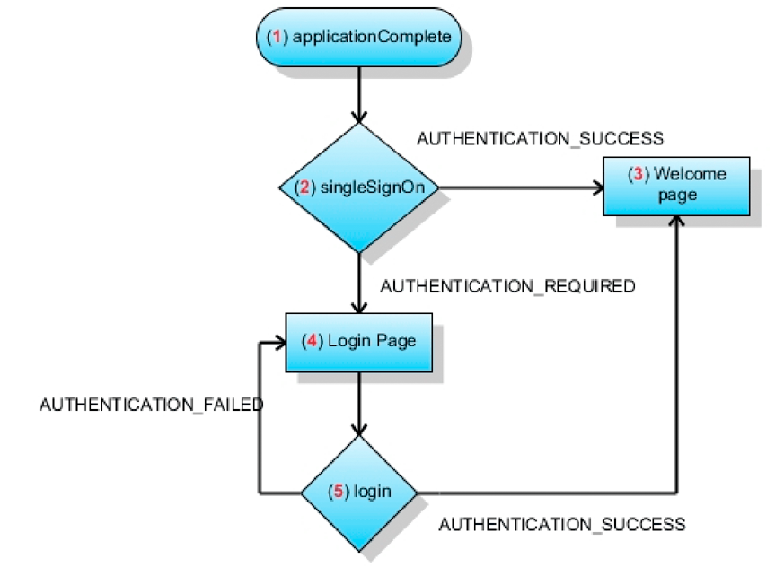

# Creazione di applicazioni di Flash Builder che eseguono l&#39;autenticazione SSO utilizzando i token HTTP {#creating-flash-builder-applicationsthat-perform-sso-authentication-using-http-tokens}

**Esempi ed esempi in questo documento sono solo per AEM Forms in ambiente JEE.**

Puoi creare un’applicazione client utilizzando un Flash Builder che esegue l’autenticazione single sign on (SSO) utilizzando i token HTTP. Supponiamo, ad esempio, di creare un&#39;applicazione basata sul Web utilizzando Flash Builder. Successivamente, si presuppone che l&#39;applicazione contenga visualizzazioni diverse, in cui ogni visualizzazione richiama un&#39;operazione AEM Forms diversa. Invece di autenticare un utente per ogni operazione Forms, puoi creare una pagina di accesso che consenta a un utente di effettuare l&#39;autenticazione una volta. Una volta autenticato, un utente è in grado di richiamare più operazioni senza dover ripetere l&#39;autenticazione. Ad esempio, se un utente ha effettuato l’accesso a Workspace (o a un’altra applicazione Forms), non dovrà effettuare nuovamente l’autenticazione.

Sebbene l’applicazione client contenga la logica di applicazione necessaria per eseguire l’autenticazione SSO, AEM Forms User Management esegue l’autenticazione utente effettiva. Per autenticare un utente utilizzando i token HTTP, l’applicazione client richiama l’operazione `authenticateWithHTTPToken` del servizio Authentication Manager. User Management è in grado di autenticare gli utenti utilizzando un token HTTP. Per le successive chiamate a servizi Web o remoti ad AEM Forms, non è necessario passare le credenziali per l&#39;autenticazione.

>[!NOTE]
>
>Prima di leggere questa sezione, si consiglia di avere familiarità con l&#39;utilizzo di Invoking AEM Forms utilizzando Remoting. (Consultare [Richiamo di AEM Forms tramite AEM Forms Remoting](/help/forms/developing/invoking-aem-forms-using-remoting.md#invoking-aem-forms-using-remoting).)

Il seguente processo AEM Forms di breve durata, denominato `MyApplication/EncryptDocument`, viene richiamato dopo che un utente è autenticato utilizzando SSO. (Per informazioni su questo processo, ad esempio sui valori di input e output, vedere [Esempio di processo a breve durata](/help/forms/developing/aem-forms-processes.md).)


>[!NOTE]
>
>Questo processo non è basato su un processo AEM Forms esistente. Per seguire gli esempi di codice che illustrano come richiamare questo processo, crea un processo denominato `MyApplication/EncryptDocument` utilizzando workbench. (Vedere [Uso di Workbench](https://www.adobe.com/go/learn_aemforms_workbench_63).)

L’applicazione client creata utilizzando il Flash Builder interagisce con il servlet di sicurezza di User Manager configurato in `/um/login` e `/um/logout`. In altre parole, l&#39;applicazione client invia una richiesta all&#39; `/um/login` URL durante l&#39;avvio per determinare lo stato dell&#39;utente. Quindi User Manager risponde con lo stato dell&#39;utente. L&#39;applicazione client e il servlet di sicurezza User Manager comunicano tramite HTTP.

**Formato richiesta**

Il servlet di sicurezza richiede le seguenti variabili di input:

* `um_no_redirect` - Questo valore deve essere  `true`. Questa variabile accompagna tutte le richieste effettuate al servlet di sicurezza User Manager. Aiuta inoltre il servlet di sicurezza a differenziare la richiesta in arrivo proveniente da un client flex o da altre applicazioni web.
* `j_username` - Questo valore è il valore dell&#39;identificatore di accesso dell&#39;utente fornito nel modulo di accesso.
* `j_password` - Questo valore è la password corrispondente dell&#39;utente fornita nel modulo di accesso.

Il valore `j_password` è necessario solo per le richieste di credenziali. Se il valore della password non è specificato, il servlet di sicurezza controlla se l&#39;account utilizzato è già autenticato. In caso affermativo, è possibile procedere; tuttavia, il servlet di sicurezza non ti autentica nuovamente.

>[!NOTE]
>
>Per una corretta gestione di i18n, assicurati che questi valori siano in formato POST.

**Formato di risposta**

Il servlet di sicurezza configurato in `/um/login` risponde utilizzando il formato `URLVariables`. In questo formato, l’output del tipo di contenuto è text/plain. L&#39;output contiene coppie di valori di nome separate da un carattere e commerciale (&amp;). La risposta contiene le seguenti variabili:

* `authenticated` - Il valore è  `true` o  `false`.
* `authstate` - Questo valore può contenere uno dei seguenti valori:

   * `CREDENTIAL_CHALLENGE` - Questo stato indica che User Manager non è in grado di determinare l&#39;identità dell&#39;utente con alcun mezzo. Per consentire l&#39;autenticazione, è necessario il nome utente e la password dell&#39;utente.
   * `SPNEGO_CHALLENGE`- Questo stato viene trattato allo stesso modo di  `CREDENTIAL_CHALLENGE`.
   * `COMPLETE` - Questo stato indica che User Manager è in grado di autenticare l&#39;utente.
   * `FAILED` - Questo stato indica che User Manager non è stato in grado di autenticare l&#39;utente. Come risposta a questo stato, il client flex può mostrare un messaggio di errore all&#39;utente.
   * `LOGGED_OUT` - Questo stato indica che l’utente si è disconnesso correttamente.

* `assertionid` - Se lo stato è  `COMPLETE` allora contiene il  `assertionId` valore dell&#39;utente. Un&#39;applicazione client può ottenere il valore `AuthResult` per l&#39;utente.

**Processo di accesso**

All&#39;avvio di un&#39;applicazione client, puoi effettuare una richiesta POST al servlet di sicurezza `/um/login`. Esempio, `https://<your_serverhost>:<your_port>/um/login?um_no_redirect=true`. Quando la richiesta raggiunge il servlet di sicurezza User Manager, esegue i seguenti passaggi:

1. Cerca un cookie denominato `lcAuthToken`. Se l’utente ha già effettuato l’accesso a un’altra applicazione Forms, questo cookie è presente. Se il cookie viene trovato, il relativo contenuto viene convalidato.
1. Se l&#39;SSO basato su intestazione è abilitato, il servlet cerca le intestazioni configurate per determinare l&#39;identità dell&#39;utente.
1. Se SPNEGO è abilitato, il servlet prova ad avviare SPNEGO e cerca di determinare l&#39;identità dell&#39;utente.

Se il servlet di sicurezza individua un token valido che corrisponde a un utente, il servlet di sicurezza consente di procedere e rispondere con `authstate=COMPLETE`. In caso contrario, il servlet di sicurezza risponde con `authstate=CREDENTIAL_CHALLENGE`. Nell&#39;elenco seguente sono illustrati questi valori:

* `Case authstate=COMPLETE`: Indica che l&#39;utente è autenticato e che il  `assertionid` valore contiene l&#39;identificatore di asserzione per l&#39;utente. A questo punto, l’applicazione client può connettersi ad AEM Forms. Il servlet configurato per tale URL può ottenere il `AuthResult` per l&#39;utente richiamando il metodo `AuthenticationManager.authenticate(HttpRequestToken)` . L’istanza `AuthResult` può creare il contesto di user manager e memorizzarlo nella sessione.
* `Case authstate=CREDENTIAL_CHALLENGE`: Indica che il servlet di sicurezza richiede le credenziali dell&#39;utente. Come risposta, l’applicazione client può visualizzare la schermata di accesso all’utente e inviare le credenziali ottenute al servlet di sicurezza (ad esempio, `https://<your_serverhost>:<your_port>/um/login?um_no_redirect=true&j_username=administrator&j_password=password)`. Se l’autenticazione ha esito positivo, il servlet di sicurezza risponde con `authstate=COMPLETE`.

Se l’autenticazione non ha ancora esito positivo, il servlet di sicurezza risponde con `authstate=FAILED`. Per rispondere a questo valore, l&#39;applicazione client può visualizzare un messaggio per ottenere nuovamente le credenziali.

>[!NOTE]
>
>Mentre `authstate=CREDENTIAL_CHALLENGE`, si consiglia al client di inviare le credenziali ottenute al servlet di sicurezza in un modulo POST.

**Processo di disconnessione**

Quando un&#39;applicazione client si disconnette, puoi inviare una richiesta al seguente URL:

`https://<your_serverhost>:<your_port>/um/logout?um_no_redirect=true`

Al ricevimento di questa richiesta, il servlet di sicurezza User Manager elimina il cookie `lcAuthToken` e risponde con `authstate=LOGGED_OUT`. Dopo che l&#39;applicazione client ha ricevuto questo valore, l&#39;applicazione può eseguire attività di pulizia.

## Creazione di un&#39;applicazione client che esegue l&#39;autenticazione AEM utenti dei moduli utilizzando SSO {#creating-a-client-application-that-authenticates-aem-forms-users-using-sso}

Per dimostrare come creare un&#39;applicazione client che esegue l&#39;autenticazione SSO, viene creata un&#39;applicazione client di esempio. L&#39;illustrazione seguente mostra i passaggi eseguiti dall&#39;applicazione client per autenticare un utente utilizzando SSO.



L&#39;illustrazione precedente descrive il flusso dell&#39;applicazione che si verifica all&#39;avvio dell&#39;applicazione client.

1. L&#39;applicazione client attiva l&#39;evento `applicationComplete` .
1. Viene effettuata la chiamata a `ISSOManager.singleSignOn` . L&#39;applicazione client invia una richiesta al servlet di sicurezza User Manager.
1. Se il servlet di sicurezza autentica l’utente, `ISSOManager` invia `SSOEvent.AUTHENTICATION_SUCCESS`. Come risposta, l&#39;applicazione client mostra la pagina principale. In questo esempio, la pagina principale richiama il processo AEM Forms di breve durata denominato MyApplication/EncryptDocument.
1. Se il servlet di sicurezza non è in grado di determinare se l&#39;utente è valido, l&#39;applicazione richiede nuovamente le credenziali utente. La classe `ISSOManager` invia l&#39;evento `SSOEvent.AUTHENTICATION_REQUIRED`. L&#39;applicazione client visualizza la pagina di accesso.
1. Le credenziali fornite nella pagina di accesso vengono inviate al metodo `ISSOManager.login` . Se l&#39;autenticazione ha esito positivo, allora porta al passaggio 3. In caso contrario, viene attivato l&#39;evento `SSOEvent.AUTHENTICATION_FAILED` . L&#39;applicazione client visualizza la pagina di accesso e un messaggio di errore appropriato.

### Creazione dell&#39;applicazione client {#creating-the-client-application}

L&#39;applicazione client è costituita dai file seguenti:

* `SSOStandalone.mxml`: Il file MXML principale che rappresenta l&#39;applicazione client. (Consulta [Creazione del file SSOStandalone.mxml](creating-flash-builder-applications-perform.md#creating-the-ssostandalone-mxml-file).)
* `um/ISSOManager.as`: Esporre le operazioni relative al Single Sign On (SSO). (Vedere [Creazione del file ISSOManager.as](creating-flash-builder-applications-perform.md#creating-the-issomanager-as-file).)
* `um/SSOEvent.as`: L&#39;  `SSOEvent` viene inviato per gli eventi correlati a SSO. (Vedere [Creazione del file SSOEvent.as](creating-flash-builder-applications-perform.md#creating-the-ssoevent-as-file).)
* `um/SSOManager.as`: Gestisce le operazioni correlate all&#39;SSO e invia eventi appropriati. (Consulta [Creazione del file SSOManager.as](creating-flash-builder-applications-perform.md#creating-the-ssomanager-as-file).)
* `um/UserManager.as`: Contiene la logica dell&#39;applicazione che richiama il servizio Authentication Manager utilizzando la relativa WSDL. (Vedere [Creazione del file UserManager.as](creating-flash-builder-applications-perform.md#creating-the-usermanager-as-file).)
* `views/login.mxml`: Rappresenta la schermata di accesso. (Vedere [Creazione del file login.mxml](creating-flash-builder-applications-perform.md#creating-the-login-mxml-file).)
* `views/logout.mxml`: Rappresenta la schermata di logout. (Vedere [Creazione del file logout.mxml](creating-flash-builder-applications-perform.md#creating-the-logout-mxml-file).)
* `views/progress.mxml`: Rappresenta una visualizzazione di avanzamento. (Vedere [Creazione del file progress.mxml](creating-flash-builder-applications-perform.md#creating-the-progress-mxml-file).)
* `views/remoting.mxml`: Rappresenta la visualizzazione che richiama il processo a breve termine AEM Forms denominato MyApplication/EncryptDocument utilizzando la rimozione. (Vedere [Creazione del file remoting.mxml](creating-flash-builder-applications-perform.md#creating-the-remoting-mxml-file).)

L&#39;illustrazione seguente fornisce una rappresentazione visiva dell&#39;applicazione client.


>[!NOTE]
>
>Tieni presente che esistono due pacchetti denominati um e visualizzazioni. Quando crei l&#39;applicazione client, assicurati di inserire i file nei relativi pacchetti appropriati. Inoltre, aggiungi il file adobe-remoting-provider.swc al percorso della classe del progetto. (Consulta [Inclusione del file di libreria AEM Forms Flex](/help/forms/developing/invoking-aem-forms-using-remoting.md#including-the-aem-forms-flex-library-file).)

### Creazione del file SSOStandalone.mxml {#creating-the-ssostandalone-mxml-file}

Il codice seguente rappresenta il file SSOStandalone.mxml.

```xml
 <?xml version="1.0" encoding="utf-8"?>
 <mx:Application
                 layout="absolute"
                 applicationComplete="initApp()"
                 height="400" width="550"
                 xmlns:v="views.*"
                 backgroundColor="#EDE8F0" viewSourceURL="srcview/index.html">
     <mx:Script>
         <![CDATA[
             import mx.utils.URLUtil;
             import um.SSOEvent;
             import mx.core.UIComponent;
             import um.SSOManager;
             import mx.rpc.events.ResultEvent;
             import mx.utils.ObjectUtil;
             import mx.controls.Alert;
 
             [Bindable]
             private var _serverURL:String;
 
             private var _ssoManager:SSOManager;
 
             private var _progress:UIComponent;
 
             private var _loginPage:UIComponent;
 
             private function initApp():void{
                 _serverURL = determineServerUrl();
                 _ssoManager = new SSOManager(_serverURL);
 
                 _ssoManager.addEventListener(SSOEvent.AUTHENTICATION_FAILED,loginHandler);
                 _ssoManager.addEventListener(SSOEvent.AUTHENTICATION_SUCCESS,loginHandler);
                 _ssoManager.addEventListener(SSOEvent.AUTHENTICATION_REQUIRED,loginHandler);
                 _ssoManager.addEventListener(SSOEvent.LOGOUT_COMPLETE,loginHandler);
                 _ssoManager.addEventListener(SSOEvent.AUTHENTICATION_FAULT,loginHandler);
 
                 trace("[Main] Add the required event handlers for authentication");
                 _ssoManager.singleSignOn();
 
                 showBusy();
             }
 
             private function determineServerUrl():String
             {
                 var s:String ;
                 var appUrl:String = Application.application.url;
                 var givenUrl:String  = ExternalInterface.call("serverUrl.toString");
                 trace("[Main] Application url ["+appUrl+"] Given url ["+givenUrl+"]");
                 if(appUrl != null && appUrl.search("^http") != -1){
                     s = appUrl;
                 }
                 if(s == null){
                     s = givenUrl;
                 }
                 if(s== null){
                     s = "https://hiro-xp:8080/";
                 }
                 s = URLUtil.getFullURL(s,"/");
                 trace("[Main] Would be using ["+s+"] as serverUrl");
                 return s;
             }
 
             private function loginHandler(event:SSOEvent):void
             {
                 trace("[Main] Handling event "+event.type);
                 switch(event.type)
                 {
                     case SSOEvent.AUTHENTICATION_FAILED:
                         viewContent.selectedChild = login;
                         login.showLoginFailed();
                         break;
                     case SSOEvent.AUTHENTICATION_SUCCESS:
                         viewContent.selectedChild = remoting;
                         break;
                     case SSOEvent.AUTHENTICATION_REQUIRED:
                         viewContent.selectedChild = login;
                         break;
                     case SSOEvent.LOGOUT_COMPLETE:
                         viewContent.selectedChild = logout;
                         break;
                     case SSOEvent.AUTHENTICATION_FAULT:
                         Alert.show("Error doing authentication. Root error ["+event.rootEvent+"]","Authentication Fault",Alert.OK);
                 }
             }
 
             public function get ssoManager():SSOManager
             {
                 return _ssoManager;
             }
 
             public function showBusy():void
             {
                 viewContent.selectedChild = progress;
             }
 
             public function get serverUrl():String
             {
                 return _serverURL;
             }
 
         ]]>
     </mx:Script>
     <mx:ViewStack x="0" y="0" id="viewContent" >
         <v:login id="login" />
         <v:remoting id="remoting"  />
         <v:progress id="progress" />
         <v:logout id="logout"/>
     </mx:ViewStack>
 </mx:Application>
 
```

### Creazione del file ISSOManager.as {#creating-the-issomanager-as-file}

Il codice seguente rappresenta il file ISSOManager.as.

```java
 package um
 {
     import flash.events.IEventDispatcher;
 
     /**
      * The <code>ISSOManager</code> expose operations related to Single Sign On (SSO) in AEM Forms
      * environment. The application should register appropriate <code>SSOEvent</code> handlers prior
      * to calling any of the following operations
      */
     public interface ISSOManager extends IEventDispatcher
     {
         /**
          * Tries to validate whether the user has an already existing session or not (SSO Scenarios). The application
          * may call this method during the initialization. In general this call would lead to one of the
          * following events getting dispatched
          * <ul>
          * <li>SSOEvent.AUTHENTICATION_SUCCESS - If a SSO session was found and valid
          * <li>SSOEvent.AUTHENTICATION_REQUIRED - No SSO session was found and as such authentication is required in
          * the form of username and password.
          * <li>SSOEvent.AUTHENTICATION_FAULT - Some error has occured while connecting to the server
          * </ul>
          */
         function singleSignOn():void;
 
         /**
          * Authenticates the user using username and password. It may lead to one of the following events
          * <ul>
          * <li>SSOEvent.AUTHENTICATION_SUCCESS - The authentication is successful and a session is established
          * <li>SSOEvent.AUTHENTICATION_FAILED - Authentication has failed
          * </ul>
          */
         function login(username:String, password:String):void;
 
         /**
          * Terminates the current session and logs out the user.
          */
         function logout():void;
 
         /**
          * Get the assertionId for the logged in user
          */
         function get assertionId():String;
     }
 }
```

### Creazione del file SSOEvent.as {#creating-the-ssoevent-as-file}

Il codice seguente rappresenta il file SSOEvent.as.

```java
 package um
 {
     import flash.events.Event;
 
     /**
      * The <code>SSOEvent</code> is dispatched for SSO related events
      */
     public class SSOEvent extends Event
     {
         /**
          * This type of event would be dispatched when the Authentication process is successful. Authentication
          * might have been done with SSO or username and password. As a response to this event the application
          * can show the welcome page to the user
          * The application may want to perform specific check for permission/role so as to verify the user is allowed.
          * So as a response to this event the application would do those checks and then only show the welcome page
          */
         public static const AUTHENTICATION_SUCCESS:String = "authenticationSuccess";
 
         /**
          * This type of event would be dispatched when authentication fails using the username, password.
          * As a response to this type of event an application can show an error message to the user.
          * This event would only happen when authentication is done using username and password and NOT in
          * SSO case.
          */
         public static const AUTHENTICATION_FAILED:String = "authenticationFailed";
 
         /**
          * This type of event would be dispatched when authentication using SSO is not achieved. And due to
          * that we require the user's username and password for authentication. As a response to this event
          * the application can show the login page to the user.
          */
         public static const AUTHENTICATION_REQUIRED:String = "authenticationRequired";
 
         /**
          * This type of event would be dispatched when logout is complete. As a response to this event the
          * application may show a logout page informing the user that he has been logged out. Or the application
          * can take the user back to login page
          */
         public static const LOGOUT_COMPLETE:String = "logoutComplete";
 
         /**
          * This type of event would be dispatched when ever there is a problem in doing Authentication. The root cause
          * can be obtained from the <code>rootEvent</code>.
          */
         public static const AUTHENTICATION_FAULT:String = "authenticationFault";
 
         private var _rootEvent:Event;
 
         public function SSOEvent(type:String, rootEvent:Event=null)
         {
             super(type,true,false);
             _rootEvent = rootEvent;
         }
 
         /**
          * The root event. If current event type is <code>AUTHENTICATION_FAULT</code> then it would be an
          * <code>IOErrorEvent</code> in other cases it would be complete event. Its basic use is to extract the root
          * cause in case of an authentication fault.
          */
         public function get rootEvent():Event
         {
             return _rootEvent;
         }
     }
 }
```

### Creazione del file SSOManager.as {#creating-the-ssomanager-as-file}

Il codice seguente rappresenta il file SSOManager.as.

```java
 package um
 {
     import flash.events.Event;
     import flash.events.EventDispatcher;
     import flash.events.IOErrorEvent;
     import flash.external.ExternalInterface;
     import flash.net.URLLoader;
     import flash.net.URLLoaderDataFormat;
     import flash.net.URLRequest;
     import flash.net.URLVariables;
 
     import mx.utils.ObjectUtil;
 
     /**
      * Manages the SSO related operations and dispatches appropriate events. It would connect to the UM Filter/Servlet
      * at <code>um/login</code> The UM response would be of form of url encoded variables. It would look for
      * <code>authstate</code> value in the response and depending on that it would proceed.
      *
      * <p>If there is an IO_Error while initial attempt to UM then it would assume it as a 401 response. And it would
      * be assumed that SPNEGO based authenticatin is not working and therefore user would be shown a login page.
      */
     public class SSOManager extends EventDispatcher implements ISSOManager
     {
         private static const SSO_URL:String = "um/login";
         private static const SSO_LOGOUT_URL:String = "um/logout";
         private static const AUTH_COOKIE_NAME:String = "lcAuthToken";
 
         private var _serverUrl:String;
         private var _assertionId:String;
 
         /**
          * Constructs an SSOManager with the given server url.
          *
          * @param serverUrl - The uri of the server to connect to. it must be without any context path e.g
          * http://localhost:8080/. The SSOManager would directly append the path of UM exposed SSO url to it
          * for its operations
          */
         public function SSOManager(serverUrl:String)
         {
             _serverUrl = serverUrl;
         }
 
         public function singleSignOn():void
         {
             sendRequest(SSO_URL,true);
         }
 
         public function login(username:String, password:String):void
         {
             sendRequest(SSO_URL,false,
                 function(request:URLRequest,vars:URLVariables):void
                 {
                     vars.j_username = username;
                     vars.j_password = password;
                 }
             );
         }
 
         public function logout():void
         {
             sendRequest(SSO_LOGOUT_URL);
         }
 
         public function get assertionId():String
         {
             return _assertionId;
         }
 
 
 
         /**
          * Connects to the UM security service.
          */
         private function sendRequest(relativeUrl:String,authenticationRequest:Boolean=false, requestProcessor:Function=null):void
         {
             var loader:URLLoader = new URLLoader();
             loader.dataFormat = URLLoaderDataFormat.VARIABLES;
             var request:URLRequest = new URLRequest(_serverUrl + relativeUrl);
             trace("[SSOmanager] Contacting ["+request.url+"]");
             var vars:URLVariables = new URLVariables();
             vars.um_no_redirect = "true";
             request.data = vars;
             if(requestProcessor != null){
                 requestProcessor(request,vars);
             }
 
             loader.addEventListener(Event.COMPLETE,authHandler);
             //if its an authentication request then only treat io error as a possible 401
             //for others treat them as faults
             if(authenticationRequest){
                 loader.addEventListener(IOErrorEvent.IO_ERROR,httpAuthenticationHandler);
             }else{
                 loader.addEventListener(IOErrorEvent.IO_ERROR,authFaultHandler);
             }
             trace("[SSOmanager] Sending request "+ ObjectUtil.toString(request));
             loader.load(request);
         }
 
         private function authHandler(event:Event):void
         {
             var loader:URLLoader = URLLoader(event.target);
             var response:URLVariables = URLVariables(loader.data);
             trace("[SSOmanager] Processing response ["+ObjectUtil.toString(response)+"]");
             handleAuthResult(response["authstate"],response);
         }
 
         /**
          * Handles the IOErrorEvent. Flash would dispatch IOEvent in response to HTTP 401.
          * There is no way to distinguish it from the genuine IOError.
          */
         private function httpAuthenticationHandler(event:IOErrorEvent):void
         {
             trace("[SSOmanager] Processing IOErrorEvent ["+ObjectUtil.toString(event)+"]");
             handleAuthResult("CREDENTIAL_CHALLENGE");
 
         }
 
         /**
          * Dispatches appropriate <code>SSOEvent</code> on the basis of the <code>authstate</code>
          * value of the response.
          * The response is url encoded in for of
          * <pre>
          * authenticated=false&authstate=SPNEGO_CHALLENGE
          * </pre>
          * Depending on <code>authstate</code> the SSOEvent is dispatched
          */
         private function handleAuthResult(authState:String,response:URLVariables = null):void
         {
             trace("[SSOmanager] processing state "+authState);
             switch(authState)
             {
                 case "FAILED"  :
                     dispatchEvent(new SSOEvent(SSOEvent.AUTHENTICATION_FAILED));
                     break;
                 case "COMPLETE" :
                     _assertionId = response ? response["assertionid"] : null;
                     dispatchEvent(new SSOEvent(SSOEvent.AUTHENTICATION_SUCCESS));
                     break;
                 case "CREDENTIAL_CHALLENGE" :
                     dispatchEvent(new SSOEvent(SSOEvent.AUTHENTICATION_REQUIRED));
                     break;
                 case "LOGGED_OUT" :
                     dispatchEvent(new SSOEvent(SSOEvent.LOGOUT_COMPLETE));
                     break;
                 default:
                     dispatchEvent(new SSOEvent(SSOEvent.AUTHENTICATION_REQUIRED));
                     break;
             }
         }
 
         private function authFaultHandler(event:Event):void
         {
             dispatchEvent(new SSOEvent(SSOEvent.AUTHENTICATION_FAULT,event));
         }
 
     }
 }
```

### Creazione del file UserManager.as {#creating-the-usermanager-as-file}

Il codice seguente rappresenta il file UserManager.as.

```java
 package um
 {
     import flash.events.Event;
     import mx.rpc.soap.WebService;
     import mx.rpc.soap.Operation;
     import mx.rpc.IResponder;
     import mx.rpc.events.FaultEvent;
     import mx.rpc.events.ResultEvent;
     import mx.rpc.soap.LoadEvent;
 
     public class UserManager
     {
         private var _ssoManager:ISSOManager;
         private var _serverUrl:String;
 
         public function UserManager(ssoManager:ISSOManager,serverUrl:String)
         {
             _serverUrl = serverUrl;
             _ssoManager = ssoManager;
         }
 
         public function retrieveAssertion(responder:IResponder):String
         {
             var assertionId:String = _ssoManager.assertionId;
             if(!assertionId)
             {
                 trace("[UserManager] AssertionId not found");
                 return null;
             }
 
             var ws:WebService = new WebService();
             var wsdl:String = _serverUrl+'soap/services/AuthenticationManagerService?wsdl&lc_version=8.2.1';
             ws.loadWSDL(wsdl);
             ws.addEventListener(LoadEvent.LOAD,
                 function(event:Event):void
                 {
                     trace("[UserManager] WSDL loaded");
                     var authenticate:Operation = ws.authenticateWithHttpToken as Operation;
                     authenticate.resultFormat = "e4x";
                     authenticate.addEventListener(ResultEvent.RESULT,
                         function(event:Event):void
                         {
                             responder.result(event);
                         }
                     );
                     authenticate.send({assertionId:assertionId});
                 }
             );
 
             ws.addEventListener(FaultEvent.FAULT,
                 function(event:Event):void
                 {
                     responder.fault(event);
                 }
             );
             return null;
         }
     }
 }
```

### Creazione del file login.mxml {#creating-the-login-mxml-file}

Il codice seguente rappresenta il file login.mxml.

```xml
 <?xml version="1.0" encoding="utf-8"?>
 <mx:Canvas  width="500" height="400">
     <mx:Script>
         <![CDATA[
             import mx.core.Application;
             public function showLoginFailed():void
             {
                 loginMessage.text = "Username or Password incorrect";
             }
 
             private function doLogin():void
             {
                 Application.application.ssoManager.login(j_username.text,j_password.text);
                 Application.application.showBusy();
             }
 
         ]]>
     </mx:Script>
 
     <mx:VBox height="113" width="244" x="128" y="144" horizontalAlign="center" verticalGap="10">
         <mx:HBox width="100%">
             <mx:HBox width="100%" verticalAlign="middle" horizontalAlign="center" height="32">
                 <mx:Label text="Username" fontWeight="bold"/>
                 <mx:TextInput id="j_username"/>
             </mx:HBox>
         </mx:HBox>
         <mx:HBox width="100%" height="33" horizontalAlign="center" horizontalGap="10" verticalAlign="middle">
             <mx:Label text="Password" fontWeight="bold"/>
             <mx:TextInput displayAsPassword="true" id="j_password"/>
         </mx:HBox>
         <mx:Button label="Login" click="doLogin()"/>
     </mx:VBox>
     <mx:Text x="128" y="122" id="loginMessage" width="230" height="14"/>
     <mx:Label x="154" y="65" text="AEM Forms SSO Demo" fontFamily="Georgia" fontSize="20" color="#0A0A0A"/>
 </mx:Canvas>
 
```

### Creazione del file logout.mxml {#creating-the-logout-mxml-file}

Il codice seguente rappresenta il file logout.mxml.

```xml
 <?xml version="1.0" encoding="utf-8"?>
 <mx:Canvas  width="500" height="400">
     <mx:Label x="97" y="188" text="You have successfully logged out from the application"/>
 
 </mx:Canvas>
 
```

### Creazione del file progress.mxml {#creating-the-progress-mxml-file}

Il codice seguente rappresenta il file progress.mxml.

```xml
 <?xml version="1.0" encoding="utf-8"?>
 <mx:Canvas >
     <mx:Label x="151" y="141" text="Wait...."/>
     <mx:SWFLoader source="LoadingCircle.swf" width="50" height="50" horizontalCenter="0" verticalCenter="0"/>
 </mx:Canvas>
```

### Creazione del file remoting.mxml {#creating-the-remoting-mxml-file}

Il codice seguente rappresenta il file remoting.mxml che richiama il processo `MyApplication/EncryptDocument`. Poiché un documento viene passato al processo, la logica applicativa responsabile del passaggio di un documento protetto ad AEM Forms si trova in questo file. (Vedere [Trasmissione di documenti protetti per richiamare i processi utilizzando Remoting](/help/forms/developing/invoking-aem-forms-using-remoting.md#passing-secure-documents-to-invoke-processes-using-remoting).)

```xml
 <?xml version="1.0" encoding="utf-8"?>
 <mx:Canvas  width="664" height="400" creationComplete="initializeChannelSet()" xmlns:views="views.*">
     <mx:Script>
 
         <![CDATA[
 
             import mx.rpc.livecycle.DocumentReference;
             import flash.net.FileReference;
             import flash.net.URLRequest;
             import flash.events.Event;
             import flash.events.DataEvent;
             import mx.messaging.ChannelSet;
             import mx.messaging.channels.AMFChannel;
             import mx.rpc.events.ResultEvent;
             import mx.collections.ArrayCollection;
             import mx.rpc.AsyncToken;
             import um.UserManager;
             import mx.rpc.events.ResultEvent;
             import mx.rpc.events.FaultEvent;
             import mx.core.Application;
             import mx.rpc.Responder;
             import mx.utils.ObjectUtil;
 
             // Classes used in file retrieval
             private var fileRef:FileReference = new FileReference();
             private var docRef:DocumentReference = new DocumentReference();
             private var parentResourcePath:String = "/";
             //private var serverPort:String = "'[server]:[port]'";
             private var serverPort:String = "'[server]:[port]'";
             private var now1:Date;
             private var userManager:UserManager;
 
             // Define a ChannelSet object.
             public var cs:ChannelSet;
 
             // Holds information returned from AEM Forms
             [Bindable]
             public var progressList:ArrayCollection = new ArrayCollection();
 
 
             // Set up channel set to invoke AEM Forms.
             // This must be done before calling any service or process, but only
             // once for the entire application.
             private function initializeChannelSet():void {
                 cs = new ChannelSet();
                 cs.addChannel(new AMFChannel("remoting-amf", "https://" + serverPort + "/remoting/messagebroker/amf"));
                 EncryptDocument.channelSet = cs;
 
             //Get the user that is authenticated
             userManager = new UserManager(Application.application.ssoManager,Application.application.serverUrl);
             userManager.retrieveAssertion(
                     new mx.rpc.Responder(
                         function(event:ResultEvent):void
                         {
                             var name:String = XML(event.currentTarget.lastResult)..*::authenticatedUser.*::userid.text();
                             username.text = "Welcome "+name;
                         },
                         function(event:FaultEvent):void
                         {
                             mx.controls.Alert.show(event.fault.faultString,'Error')
                         }
                     )
                 );
 
             }
 
             // Call this method to upload the file.
             // This creates a file picker and lets the user select a PDF file to pass to the EncryptDocument process.
             private function uploadFile():void {
                 fileRef.addEventListener(Event.SELECT, selectHandler);
                 fileRef.addEventListener(DataEvent.UPLOAD_COMPLETE_DATA,completeHandler);
                 fileRef.browse();
             }
 
             // Gets called for selected file. Does the actual upload via the file upload servlet.
             private function selectHandler(event:Event):void {
                 var authTokenService:RemoteObject = new RemoteObject("LC.FileUploadAuthenticator");
                 authTokenService.addEventListener("result", authTokenReceived);
                 authTokenService.channelSet = cs;
                 authTokenService.getFileUploadToken();
             }
 
             private function authTokenReceived(event:ResultEvent):void
             {
                 var token:String = event.result as String;
                 var request:URLRequest = DocumentReference.constructRequestForUpload("https://hiro-xp:8080", token);
 
                 try
                 {
                     fileRef.upload(request);
                 }
                 catch (error:Error)
                 {
                     trace("Unable to upload file.");
                 }
             }
 
             // Called once the file is completely uploaded.
             private function completeHandler(event:DataEvent):void {
 
                 // Set the docRefs url and referenceType parameters
                 docRef.url = event.data as String;
                 docRef.referenceType=DocumentReference.REF_TYPE_URL;
                 executeInvokeProcess();
             }
 
             //This method invokes the EncryptDocument process
             public function executeInvokeProcess():void {
                 //Create an Object to store the input value for the EncryptDocument process
                 now1 = new Date();
 
                 var params:Object = new Object();
                 params["inDoc"]=docRef;
 
                 // Invoke the EncryptDocument process
                 var token:AsyncToken;
                 token = EncryptDocument.invoke(params);
                 token.name = name;
             }
 
 
             // This method handles a successful conversion invocation
             public function handleResult(event:ResultEvent):void
             {
 
                 //Retrieve information returned from the service invocation
                 var token:AsyncToken = event.token;
                 var res:Object = event.result;
                 var dr:DocumentReference = res["outDoc"] as DocumentReference;
                 var now2:Date = new Date();
 
                 // These fields map to columns in the DataGrid
                 var progObject:Object = new Object();
                 progObject.filename = token.name;
                 progObject.timing = (now2.time - now1.time).toString();
                 progObject.state = "Success";
                 progObject.link = "<a href='" + dr.url + "'> open </a>";
                 progressList.addItem(progObject);
             }
 
 
             private function resultHandler(event:ResultEvent):void {
             // Do anything else here.
 
             }
 
             private function logout():void
             {
                 Application.application.ssoManager.logout();
                 Application.application.showBusy();
             }
 
 
         ]]>
 
     </mx:Script>
 
     <mx:RemoteObject id="EncryptDocument" destination="MyApplication/EncryptDocument" result="resultHandler(event);">
             <mx:method name="invoke" result="handleResult(event)"/>
     </mx:RemoteObject>
 
 
     <!--//This consists of what is displayed on the webpage-->
     <mx:Panel id="lcPanel" title="EncryptDocument  (Deprecated for AEM forms) AEM Forms Remoting Example"
           height="25%" width="25%" paddingTop="10" paddingLeft="10" paddingRight="10"
           paddingBottom="10">
         <mx:Label width="100%" color="blue"
                   id="username"/>
 
         <mx:DataGrid x="10" y="0" width="500" id="idProgress" editable="false"
                          dataProvider="{progressList}" height="231" selectable="false" >
         <mx:columns>
                 <mx:DataGridColumn headerText="Filename" width="200" dataField="filename" editable="false"/>
                 <mx:DataGridColumn headerText="State" width="75" dataField="state" editable="false"/>
                 <mx:DataGridColumn headerText="Timing" width="75" dataField="timing" editable="false"/>
                 <mx:DataGridColumn headerText="Click to Open" dataField="link" editable="false" >
                 <mx:itemRenderer>
 
                         <mx:Component>
                         <mx:Text x="0" y="0" width="100%" htmlText="{data.link}"/>
                         </mx:Component>
                     </mx:itemRenderer>
             </mx:DataGridColumn>
         </mx:columns>
     </mx:DataGrid>
     <mx:Button label="Select File" click="uploadFile()" />
     <mx:Button label="Logout"  click="logout()" />
     </mx:Panel>
 </mx:Canvas>
 
 
```

### Informazioni aggiuntive {#additional-information}

Le sezioni seguenti forniscono dettagli aggiuntivi che descrivono la comunicazione tra l&#39;applicazione client e il servlet di sicurezza User Manager.

### Si verifica una nuova autenticazione {#a-new-authentication-occurs}

In questa situazione, l’utente tenta di accedere per la prima volta da un’applicazione client ad AEM Forms. (non esiste una sessione precedente che coinvolge l&#39;utente.) Nell&#39;evento `applicationComplete` viene richiamato il metodo `SSOManager.singleSignOn` che invia una richiesta all&#39;User Manager.

`GET /um/login?um%5Fno%5Fredirect=true HTTP/1.1`

Il servlet di sicurezza User Manager risponde con il seguente valore:

`HTTP/1.1 200 OK`

`authenticated=false&authstate=CREDENTIAL_CHALLENGE`

Come risposta a questo valore, viene inviato un valore `SSOEvent.AUTHENTICATION_REQUIRED` . Di conseguenza, l&#39;applicazione client visualizza una schermata di accesso per l&#39;utente. Le credenziali vengono inviate nuovamente al servlet di sicurezza User Manager.

`GET /um/login?um%5Fno%5Fredirect=true&j%5Fusername=administrator&j%5Fpassword=password HTTP/1.1`

Il servlet di sicurezza User Manager risponde con il seguente valore:

```verilog
 HTTP/1.1 200 OK
 Set-Cookie: lcAuthToken=53630BC8-F6D4-F588-5D5B-4668EFB2EC7A; Path=/
 authenticated=true&authstate=COMPLETE&assertionid=53630BC8-F6D4-F588-5D5B-4668EFB2EC7A
```

Di conseguenza, viene inviato `authstate=COMPLETE the SSOEvent.AUTHENTICATION_SUCCESS`. Se necessario, l’applicazione client può eseguire ulteriori elaborazioni. Ad esempio, è possibile creare un registro che tenga traccia della data e dell’ora dell’autenticazione dell’utente.

### Utente già autenticato {#the-user-is-already-authenticated}

In questa situazione, l’utente ha già effettuato l’accesso ad AEM Forms e quindi passa all’applicazione client. L&#39;applicazione client si connette al servlet di sicurezza User Manager durante l&#39;avvio.

```verilog
 GET /um/login?um%5Fno%5Fredirect=true HTTP/1.1
 Cookie: JSESSIONID=A4E0BCC2DD4BCCD3167C45FA350BD72A; lcAuthToken=53630BC8-F6D4-F588-5D5B-4668EFB2EC7A
```

Poiché l’utente è già autenticato, il cookie User Manager è presente e viene inviato al servlet di sicurezza User Manager. Il servlet ottiene quindi il valore `assertionId` e verifica se è valido. Se è valido, viene restituito `authstate=COMPLETE`. In caso contrario, viene restituito `authstate=CREDENTIAL_CHALLENGE`. Di seguito è riportata una tipica risposta:

```verilog
 HTTP/1.1 200 OK
        authenticated=true&authstate=COMPLETE&assertionid=53630BC8-F6D4-F588-5D5B-4668EFB2EC7A
```

In questa situazione, all’utente non viene visualizzata una schermata di accesso, ma viene direttamente visualizzato in una schermata di benvenuto.
