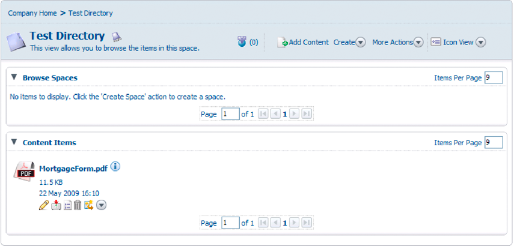

# Creazione di documenti PDF con i dati XML inviati {#creating-pdf-documents-with-submittedxml-data}

**Gli esempi e gli esempi contenuti in questo documento sono solo per AEM Forms in ambiente JEE.**

## Creazione di documenti PDF con i dati XML inviati {#creating-pdf-documents-with-submitted-xml-data}

Le applicazioni basate sul Web che consentono agli utenti di compilare moduli interattivi richiedono l&#39;invio dei dati al server. Tramite il servizio Forms è possibile recuperare i dati del modulo immessi dall&#39;utente in un modulo interattivo. Quindi puoi passare i dati del modulo a un’altra operazione del servizio AEM Forms e creare un documento PDF utilizzando i dati.

>[!NOTE]
>
>Prima di leggere questo contenuto, è consigliabile avere una solida conoscenza della gestione dei moduli inviati. Concetti quali la relazione tra la progettazione di un modulo e i dati XML inviati sono trattati in Gestione dei Forms inviati.

Prendi in considerazione il seguente flusso di lavoro che coinvolge tre servizi AEM Forms:

* Un utente invia dati XML al servizio Forms da un&#39;applicazione basata sul Web.
* Il servizio Forms viene utilizzato per elaborare il modulo inviato ed estrarre i campi del modulo. I dati del modulo possono essere elaborati. Ad esempio, i dati possono essere inviati a un database aziendale.
* I dati del modulo vengono inviati al servizio di output per creare un documento PDF non interattivo.
* Il documento PDF non interattivo viene archiviato in Content Services (obsoleto).

Il diagramma seguente fornisce una rappresentazione visiva del flusso di lavoro.

Dopo che l’utente ha inviato il modulo dal browser Web client, il documento PDF non interattivo viene memorizzato in Content Services (obsoleto). Nella figura seguente viene illustrato un documento PDF memorizzato in Content Services (obsoleto).

### Riepilogo dei passaggi {#summary-of-steps}

Per creare un documento di PDF non interattivo con i dati XML inviati e memorizzarlo nel documento di PDF in Content Services (obsoleto), effettuare le seguenti operazioni:

1. Includi file di progetto.
1. Creare oggetti Forms, Output e Document Management.
1. Recupera i dati del modulo utilizzando il servizio Forms.
1. Crea un documento PDF non interattivo utilizzando il servizio di output.
1. Memorizzare il modulo PDF in Content Services (obsoleto) utilizzando il servizio Document Management.

**Includi file di progetto**

Includi i file necessari nel progetto di sviluppo. Se stai creando un’applicazione client utilizzando Java, includi i file JAR necessari. Se utilizzi i servizi web, accertati di includere i file proxy.

**Creare oggetti Forms, Output e Document Management**

Prima di poter eseguire un&#39;operazione API del servizio Forms a livello di programmazione, creare un oggetto API del client Forms. Analogamente, poiché questo flusso di lavoro richiama i servizi Output e Document Management, creare sia un oggetto API client di output che un oggetto API client di Document Management.

**Recupera dati modulo tramite il servizio Forms**

Recupera i dati del modulo inviati al servizio Forms. È possibile elaborare i dati inviati per soddisfare i requisiti aziendali. È ad esempio possibile memorizzare i dati dei moduli in un database aziendale. Tuttavia, per creare un documento di PDF non interattivo, i dati del modulo vengono passati al servizio di output.

**Crea un documento PDF non interattivo utilizzando il servizio di output.**

Utilizzare il servizio di output per creare un documento PDF non interattivo basato sulla struttura di un modulo e sui dati del modulo XML. Nel flusso di lavoro, i dati del modulo vengono recuperati dal servizio Forms.

**Archivia il modulo PDF in Content Services (obsoleto) utilizzando il servizio Document Management**

Utilizza l’API del servizio Document Management per memorizzare un documento PDF in Content Services (obsoleto).

**Consulta anche**

[Inclusione dei file della libreria Java di AEM Forms](/help/forms/developing/invoking-aem-forms-using-java.md#including-aem-forms-java-library-files)

[Impostazione delle proprietà di connessione](/help/forms/developing/invoking-aem-forms-using-java.md#setting-connection-properties)

[Guida introduttiva all’API di servizio Forms](/help/forms/developing/forms-service-api-quick-starts.md#forms-service-api-quick-starts)

### Creare un documento PDF con i dati XML inviati utilizzando l’API Java {#create-a-pdf-document-with-submitted-xml-data-using-the-java-api}

Crea un documento PDF con i dati XML inviati utilizzando Forms, Output e Document Management API (Java):

1. Includi file di progetto

   Includi i file JAR dei client, come adobe-forms-client.jar, adobe-output-client.jar e adobe-contentservices-client.jar nel percorso di classe del progetto Java.

1. Creazione di oggetti Forms, Output e Document Management

   * Creare un oggetto `ServiceClientFactory` contenente le proprietà di connessione.
   * Creare un oggetto `FormsServiceClient` utilizzando il relativo costruttore e passando l&#39;oggetto `ServiceClientFactory`.
   * Creare un oggetto `OutputClient` utilizzando il relativo costruttore e passando l&#39;oggetto `ServiceClientFactory`.
   * Creare un oggetto `DocumentManagementServiceClientImpl` utilizzando il relativo costruttore e passando l&#39;oggetto `ServiceClientFactory`.

1. Recuperare i dati del modulo tramite il servizio Forms

   * Richiama il metodo `processFormSubmission` dell&#39;oggetto `FormsServiceClient` e passa i seguenti valori:

      * Oggetto `com.adobe.idp.Document` contenente i dati del modulo.
      * Valore stringa che specifica le variabili di ambiente, incluse tutte le intestazioni HTTP rilevanti. Specificare il tipo di contenuto da gestire specificando uno o più valori per la variabile di ambiente `CONTENT_TYPE`. Ad esempio, per gestire i dati XML, specificare il valore stringa seguente per questo parametro: `CONTENT_TYPE=text/xml`.
      * Valore stringa che specifica il valore dell&#39;intestazione `HTTP_USER_AGENT`, ad esempio `Mozilla/4.0 (compatible; MSIE 6.0; Windows NT 5.1; SV1; .NET CLR 1.1.4322)`.
      * Un oggetto `RenderOptionsSpec` che memorizza le opzioni di runtime.

     Il metodo `processFormSubmission` restituisce un oggetto `FormsResult` contenente i risultati dell&#39;invio del modulo.

   * Determinare se il servizio Forms ha terminato l&#39;elaborazione dei dati del modulo richiamando il metodo `getAction` dell&#39;oggetto `FormsResult`. Se questo metodo restituisce il valore `0`, i dati sono pronti per essere elaborati.
   * Recuperare i dati del modulo creando un oggetto `com.adobe.idp.Document` richiamando il metodo `getOutputContent` dell&#39;oggetto `FormsResult`. Questo oggetto contiene dati del modulo che possono essere inviati al servizio di output.
   * Creare un oggetto `java.io.InputStream` richiamando il costruttore `java.io.DataInputStream` e passando l&#39;oggetto `com.adobe.idp.Document`.
   * Creare un oggetto `org.w3c.dom.DocumentBuilderFactory` chiamando il metodo `newInstance` dell&#39;oggetto `org.w3c.dom.DocumentBuilderFactory` statico.
   * Creare un oggetto `org.w3c.dom.DocumentBuilder` richiamando il metodo `newDocumentBuilder` dell&#39;oggetto `org.w3c.dom.DocumentBuilderFactory`.
   * Creare un oggetto `org.w3c.dom.Document` richiamando il metodo `parse` dell&#39;oggetto `org.w3c.dom.DocumentBuilder` e passando l&#39;oggetto `java.io.InputStream`.
   * Recuperate il valore di ciascun nodo all&#39;interno del documento XML. Un modo per eseguire questa attività consiste nel creare un metodo personalizzato che accetti due parametri: l&#39;oggetto `org.w3c.dom.Document` e il nome del nodo di cui si desidera recuperare il valore. Questo metodo restituisce un valore stringa che rappresenta il valore del nodo. Nell&#39;esempio di codice che segue questo processo, il metodo personalizzato è denominato `getNodeText`. Viene visualizzato il corpo di questo metodo.

1. Crea un documento PDF non interattivo utilizzando il servizio di output.

   Creare un documento PDF richiamando il metodo `generatePDFOutput` dell&#39;oggetto `OutputClient` e passando i valori seguenti:

   * Un valore enum `TransformationFormat`. Per generare un documento PDF, specificare `TransformationFormat.PDF`.
   * Valore stringa che specifica il nome della struttura del modulo. Assicurati che la progettazione del modulo sia compatibile con i dati del modulo recuperati dal servizio Forms.
   * Valore stringa che specifica la directory principale del contenuto in cui si trova la struttura del modulo.
   * Oggetto `PDFOutputOptionsSpec` contenente le opzioni di runtime di PDF.
   * Oggetto `RenderOptionsSpec` contenente le opzioni di rendering in fase di esecuzione.
   * Oggetto `com.adobe.idp.Document` contenente l&#39;origine dati XML contenente i dati da unire con la struttura del modulo. Verificare che l&#39;oggetto sia stato restituito dal metodo `getOutputContent` dell&#39;oggetto `FormsResult`.
   * Il metodo `generatePDFOutput` restituisce un oggetto `OutputResult` contenente i risultati dell&#39;operazione.
   * Recuperare il documento PDF non interattivo richiamando il metodo `getGeneratedDoc` dell&#39;oggetto `OutputResult`. Questo metodo restituisce un&#39;istanza `com.adobe.idp.Document` che rappresenta il documento PDF non interattivo.

1. Memorizzare il modulo PDF in Content Services (obsoleto) utilizzando il servizio Document Management

   Aggiungere il contenuto richiamando il metodo `storeContent` dell&#39;oggetto `DocumentManagementServiceClientImpl` e passando i valori seguenti:

   * Valore stringa che specifica l&#39;archivio in cui viene aggiunto il contenuto. L&#39;archivio predefinito è `SpacesStore`. Questo valore è un parametro obbligatorio.
   * Valore stringa che specifica il percorso completo dello spazio in cui viene aggiunto il contenuto, ad esempio `/Company Home/Test Directory`. Questo valore è un parametro obbligatorio.
   * Nome del nodo che rappresenta il nuovo contenuto, ad esempio `MortgageForm.pdf`. Questo valore è un parametro obbligatorio.
   * Valore stringa che specifica il tipo di nodo. Per aggiungere nuovo contenuto, ad esempio un file PDF, specificare `{https://www.alfresco.org/model/content/1.0}content`. Questo valore è un parametro obbligatorio.
   * Oggetto `com.adobe.idp.Document` che rappresenta il contenuto. Questo valore è un parametro obbligatorio.
   * Valore stringa che specifica il valore di codifica, ad esempio `UTF-8`. Questo valore è un parametro obbligatorio.
   * Valore di enumerazione `UpdateVersionType` che specifica come gestire le informazioni sulla versione (ad esempio, `UpdateVersionType.INCREMENT_MAJOR_VERSION` per incrementare la versione del contenuto. ) Questo valore è un parametro obbligatorio.
   * Istanza `java.util.List` che specifica gli aspetti correlati al contenuto. Questo valore è un parametro facoltativo ed è possibile specificare `null`.
   * Oggetto `java.util.Map` che memorizza gli attributi del contenuto.

   Il metodo `storeContent` restituisce un oggetto `CRCResult` che descrive il contenuto. Utilizzando un oggetto `CRCResult`, è possibile, ad esempio, ottenere il valore dell&#39;identificatore univoco del contenuto. Per eseguire questa attività, richiamare il metodo `getNodeUuid` dell&#39;oggetto `CRCResult`.

**Consulta anche**

[Inclusione dei file della libreria Java di AEM Forms](/help/forms/developing/invoking-aem-forms-using-java.md#including-aem-forms-java-library-files)

[Impostazione delle proprietà di connessione](/help/forms/developing/invoking-aem-forms-using-java.md#setting-connection-properties)
