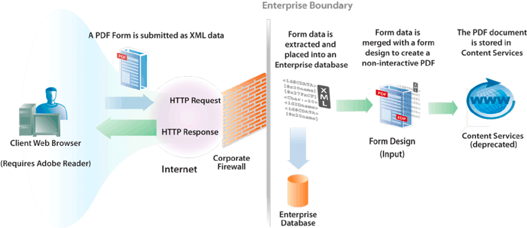

# Creazione di documenti PDF con dati XML inviati {#creating-pdf-documents-with-submittedxml-data}

## Creazione di documenti PDF con dati XML inviati {#creating-pdf-documents-with-submitted-xml-data}

Le applicazioni basate sul Web che consentono agli utenti di compilare moduli interattivi richiedono l&#39;invio dei dati al server. Il servizio Forms consente di recuperare i dati del modulo immessi dall&#39;utente in un modulo interattivo. È quindi possibile trasmettere i dati del modulo a un&#39;altra operazione  servizio AEM Forms e creare un documento PDF utilizzando i dati.

>[!NOTE]
>
>Prima di leggere questo contenuto, si consiglia di avere una buona conoscenza della gestione dei moduli inviati. Concetti come la relazione tra una struttura del modulo e i dati XML inviati sono trattati in Gestione dell&#39;Forms inviato.

Considerate il seguente flusso di lavoro che comprende tre servizi AEM Forms :

* Un utente invia dati XML al servizio Forms da un&#39;applicazione basata sul Web.
* Il servizio Forms viene utilizzato per elaborare il modulo inviato ed estrarre i campi del modulo. È possibile elaborare i dati del modulo. Ad esempio, i dati possono essere inviati a un database aziendale.
* I dati del modulo vengono inviati al servizio Output per creare un documento PDF non interattivo.
* Il documento PDF non interattivo è memorizzato in Content Services (obsoleto).

Il diagramma seguente fornisce una rappresentazione visiva del flusso di lavoro.

Dopo che l&#39;utente ha inviato il modulo dal browser Web del client, il documento PDF non interattivo viene memorizzato in Content Services (obsoleto). L&#39;illustrazione seguente mostra un documento PDF memorizzato in Content Services (obsoleto).

### Riepilogo dei passaggi {#summary-of-steps}

Per creare un documento PDF non interattivo con dati XML inviati e archiviarlo nel documento PDF in Content Services (obsoleto), eseguire le operazioni seguenti:

1. Includere i file di progetto.
1. Creare oggetti Forms, Output e Gestione documenti.
1. Recuperare i dati del modulo utilizzando il servizio Forms.
1. Creare un documento PDF non interattivo utilizzando il servizio Output.
1. È possibile archiviare il modulo PDF in Content Services (obsoleto) utilizzando il servizio Document Management.

**Includi file di progetto**

Includete i file necessari nel progetto di sviluppo. Se create un&#39;applicazione client utilizzando Java, includete i file JAR necessari. Se utilizzate i servizi Web, accertatevi di includere i file proxy.

**Creare oggetti Forms, Output e Gestione documenti**

Prima di eseguire un&#39;operazione API di servizio Forms a livello di programmazione, creare un oggetto API client Forms. Analogamente, poiché questo flusso di lavoro richiama i servizi Output e Document Management, create sia un oggetto API Client di Output che un oggetto API client di Document Management.

**Recupero dei dati del modulo con il servizio Forms**

Recuperare i dati del modulo inviati al servizio Forms. Puoi elaborare i dati inviati per soddisfare i tuoi requisiti aziendali. Ad esempio, è possibile memorizzare i dati del modulo in un database aziendale. Tuttavia, per creare un documento PDF non interattivo, i dati del modulo vengono passati al servizio Output.

**Creare un documento PDF non interattivo utilizzando il servizio Output.**

Utilizzare il servizio Output per creare un documento PDF non interattivo basato su una struttura del modulo e sui dati del modulo XML. Nel flusso di lavoro, i dati del modulo vengono recuperati dal servizio Forms.

**Archiviare il modulo PDF in Content Services (obsoleto) utilizzando il servizio Document Management**

Utilizzate l&#39;API del servizio Document Management per archiviare un documento PDF in Content Services (obsoleto).

**Consulta anche**

[Inclusione  file libreria Java AEM Forms](/help/forms/developing/invoking-aem-forms-using-java.md#including-aem-forms-java-library-files)

[Impostazione delle proprietà di connessione](/help/forms/developing/invoking-aem-forms-using-java.md#setting-connection-properties)

[Avvio rapido di Forms Service API](/help/forms/developing/forms-service-api-quick-starts.md#forms-service-api-quick-starts)

### Creare un documento PDF con dati XML inviati utilizzando l&#39;API Java {#create-a-pdf-document-with-submitted-xml-data-using-the-java-api}

Creare un documento PDF con dati XML inviati utilizzando l&#39;API Forms, Output e Document Management API (Java):

1. Includi file di progetto

   Includete file JAR client, ad esempio adobe-forms-client.jar, adobe-output-client.jar e adobe-contentservices-client.jar nel percorso di classe del progetto Java.

1. Creare oggetti Forms, Output e Gestione documenti

   * Creare un oggetto `ServiceClientFactory` che contiene le proprietà di connessione.
   * Creare un oggetto `FormsServiceClient` utilizzando il relativo costruttore e passando l&#39;oggetto `ServiceClientFactory`.
   * Creare un oggetto `OutputClient` utilizzando il relativo costruttore e passando l&#39;oggetto `ServiceClientFactory`.
   * Creare un oggetto `DocumentManagementServiceClientImpl` utilizzando il relativo costruttore e passando l&#39;oggetto `ServiceClientFactory`.

1. Recupero dei dati del modulo con il servizio Forms

   * Richiamare il metodo `FormsServiceClient` dell&#39;oggetto `processFormSubmission` e trasmettere i seguenti valori:

      * L&#39;oggetto `com.adobe.idp.Document` che contiene i dati del modulo.
      * Valore stringa che specifica le variabili di ambiente, comprese tutte le intestazioni HTTP pertinenti. Specificate il tipo di contenuto da gestire specificando uno o più valori per la variabile di ambiente `CONTENT_TYPE`. Ad esempio, per gestire i dati XML, specificare il seguente valore di stringa per questo parametro: `CONTENT_TYPE=text/xml`.
      * Un valore di stringa che specifica il valore dell&#39;intestazione `HTTP_USER_AGENT`, ad esempio `Mozilla/4.0 (compatible; MSIE 6.0; Windows NT 5.1; SV1; .NET CLR 1.1.4322)`.
      * Un oggetto `RenderOptionsSpec` che memorizza le opzioni di esecuzione.

      Il metodo `processFormSubmission` restituisce un oggetto `FormsResult` contenente i risultati dell&#39;invio del modulo.

   * Determinare se il servizio Forms ha completato l&#39;elaborazione dei dati del modulo richiamando il metodo `FormsResult` dell&#39;oggetto `getAction`. Se questo metodo restituisce il valore `0`, i dati sono pronti per essere elaborati.
   * Recuperare i dati del modulo creando un oggetto `com.adobe.idp.Document` richiamando il metodo `FormsResult` dell&#39;oggetto `getOutputContent`. (Questo oggetto contiene i dati del modulo che è possibile inviare al servizio Output).
   * Creare un oggetto `java.io.InputStream` richiamando il costruttore `java.io.DataInputStream` e passando l&#39;oggetto `com.adobe.idp.Document`.
   * Creare un oggetto `org.w3c.dom.DocumentBuilderFactory` chiamando il metodo `org.w3c.dom.DocumentBuilderFactory` statico dell&#39;oggetto `newInstance`.
   * Creare un oggetto `org.w3c.dom.DocumentBuilder` richiamando il metodo `org.w3c.dom.DocumentBuilderFactory` dell&#39;oggetto `newDocumentBuilder`.
   * Creare un oggetto `org.w3c.dom.Document` richiamando il metodo `org.w3c.dom.DocumentBuilder` dell&#39;oggetto `parse` e passando l&#39;oggetto `java.io.InputStream`.
   * Recuperare il valore di ciascun nodo all&#39;interno del documento XML. Un modo per eseguire questa attività è creare un metodo personalizzato che accetta due parametri: l&#39;oggetto `org.w3c.dom.Document` e il nome del nodo di cui si desidera recuperare il valore. Questo metodo restituisce una stringa che rappresenta il valore del nodo. Nell&#39;esempio di codice che segue questo processo, questo metodo personalizzato è denominato `getNodeText`. Viene visualizzato il corpo di questo metodo.

1. Creare un documento PDF non interattivo utilizzando il servizio Output.

   Per creare un documento PDF, richiamare il metodo `generatePDFOutput` dell&#39;oggetto `OutputClient` e passare i seguenti valori:

   * Un valore enum `TransformationFormat`. Per generare un documento PDF, specificare `TransformationFormat.PDF`.
   * Una stringa che specifica il nome della struttura del modulo. Assicurarsi che la struttura del modulo sia compatibile con i dati del modulo recuperati dal servizio Forms.
   * Una stringa che specifica il livello principale del contenuto in cui si trova la struttura del modulo.
   * Un oggetto `PDFOutputOptionsSpec` che contiene le opzioni di esecuzione PDF.
   * Un oggetto `RenderOptionsSpec` che contiene le opzioni di rendering in fase di esecuzione.
   * L&#39;oggetto `com.adobe.idp.Document` che contiene l&#39;origine dati XML contenente i dati da unire alla struttura del modulo. Assicurarsi che l&#39;oggetto sia stato restituito dal metodo `FormsResult` dell&#39;oggetto `getOutputContent`.
   * Il metodo `generatePDFOutput` restituisce un oggetto `OutputResult` che contiene i risultati dell&#39;operazione.
   * Recuperare il documento PDF non interattivo richiamando il metodo `OutputResult` dell&#39;oggetto `getGeneratedDoc`. Questo metodo restituisce un&#39;istanza `com.adobe.idp.Document` che rappresenta il documento PDF non interattivo.

1. Archiviare il modulo PDF in Content Services (obsoleto) utilizzando il servizio Document Management

   Aggiungete il contenuto richiamando il metodo `DocumentManagementServiceClientImpl` dell&#39;oggetto `storeContent` e passando i seguenti valori:

   * Valore stringa che specifica lo store in cui viene aggiunto il contenuto. Lo store predefinito è `SpacesStore`. Questo valore è un parametro obbligatorio.
   * Un valore di stringa che specifica il percorso completo dello spazio in cui viene aggiunto il contenuto (ad esempio, `/Company Home/Test Directory`). Questo valore è un parametro obbligatorio.
   * Il nome del nodo che rappresenta il nuovo contenuto (ad esempio, `MortgageForm.pdf`). Questo valore è un parametro obbligatorio.
   * Un valore di stringa che specifica il tipo di nodo. Per aggiungere nuovo contenuto, ad esempio un file PDF, specificare `{https://www.alfresco.org/model/content/1.0}content`. Questo valore è un parametro obbligatorio.
   * Un oggetto `com.adobe.idp.Document` che rappresenta il contenuto. Questo valore è un parametro obbligatorio.
   * Un valore di stringa che specifica il valore di codifica (ad esempio, `UTF-8`). Questo valore è un parametro obbligatorio.
   * Un valore di enumerazione `UpdateVersionType` che specifica come gestire le informazioni sulla versione (ad esempio, `UpdateVersionType.INCREMENT_MAJOR_VERSION` per incrementare la versione del contenuto. ) Questo valore è un parametro obbligatorio.
   * Un&#39;istanza `java.util.List` che specifica gli aspetti correlati al contenuto. Questo valore è un parametro facoltativo ed è possibile specificare `null`.
   * Un oggetto `java.util.Map` che memorizza gli attributi del contenuto.

   Il metodo `storeContent` restituisce un oggetto `CRCResult` che descrive il contenuto. Utilizzando un oggetto `CRCResult`, potete, ad esempio, ottenere il valore di identificatore univoco del contenuto. Per eseguire questa operazione, richiamare il metodo `CRCResult` dell&#39;oggetto `getNodeUuid`.

**Consulta anche**

[Inclusione  file libreria Java AEM Forms](/help/forms/developing/invoking-aem-forms-using-java.md#including-aem-forms-java-library-files)

[Impostazione delle proprietà di connessione](/help/forms/developing/invoking-aem-forms-using-java.md#setting-connection-properties)
