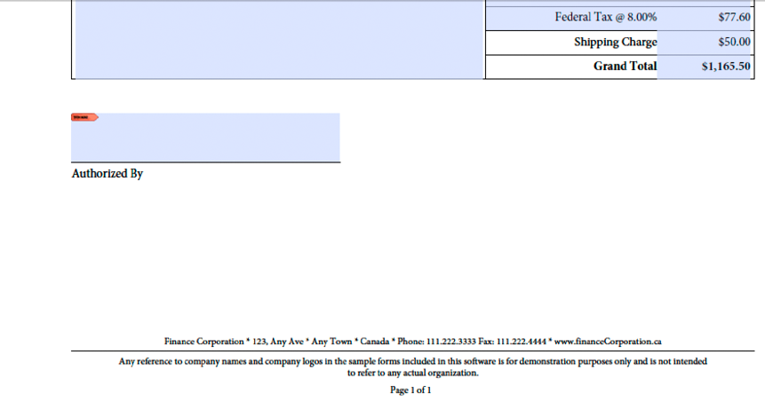

# Creazione di applicazioni Web per il rendering di Forms {#creating-web-applications-thatrenders-forms}

**Esempi ed esempi in questo documento sono solo per AEM Forms in ambiente JEE.**

## Creazione di applicazioni Web per il rendering di Forms {#creating-web-applications-that-renders-forms}

È possibile creare un’applicazione basata sul Web che utilizza i servlet Java per richiamare il servizio Forms ed eseguire il rendering dei moduli. Un vantaggio dell&#39;utilizzo di un servlet Java™ è che è possibile scrivere il valore restituito del processo in un browser Web client. In altre parole, un servlet Java può essere utilizzato come collegamento tra il servizio Forms che restituisce un modulo e un browser Web client.

>[!NOTE]
>
>Questa sezione descrive come creare un’applicazione basata sul Web che utilizza un servlet Java che richiama il servizio Forms ed esegue il rendering di moduli basati sui frammenti. (Vedere [Rendering di Forms basato su frammenti](/help/forms/developing/rendering-forms-based-fragments.md).)

Mediante un servlet Java è possibile scrivere un modulo in un browser Web client in modo che il cliente possa visualizzare e immettere i dati nel modulo. Dopo aver compilato il modulo con i dati, l’utente web fa clic su un pulsante di invio situato nel modulo per inviare le informazioni al servlet Java, dove è possibile recuperare ed elaborare i dati. Ad esempio, i dati possono essere inviati a un altro processo.

Questa sezione illustra come creare un’applicazione basata sul Web che consenta all’utente di selezionare dati modulo basati su americani o dati modulo basati su canadesi, come illustrato nella figura seguente.


Il modulo di cui si esegue il rendering è un modulo basato su frammenti. In altre parole, se l’utente seleziona i dati americani, il modulo restituito utilizza frammenti basati su dati americani. Ad esempio, il piè di pagina del modulo contiene un indirizzo americano, come illustrato nella figura seguente.


Analogamente, se l’utente seleziona dati canadesi, il modulo restituito contiene un indirizzo canadese, come illustrato nell’illustrazione seguente.



>[!NOTE]
>
>Per informazioni sulla creazione di strutture del modulo basate sui frammenti, vedere [Forms Designer](https://www.adobe.com/go/learn_aemforms_designer_63).

**File di esempio**

In questa sezione vengono utilizzati file di esempio che possono essere presenti nel percorso seguente:

&lt;>Directory *di installazione di Forms Designer >/Samples/Forms/Purchase Order/Form Fragments*

dove &lt;*directory di installazione*> è il percorso di installazione. Ai fini dell&#39;applicazione client, il file Purchase Order Dynamic.xdp è stato copiato da questo percorso di installazione e distribuito in un&#39;applicazione Forms denominata *Applicazioni/FormsApplication*. Il file Dynamic.xdp dell&#39;ordine di acquisto viene posizionato in una cartella denominata FormsFolder. Allo stesso modo, i frammenti vengono inseriti nella cartella Frammenti, come illustrato di seguito.


Per accedere alla struttura del modulo Purchase Order Dynamic.xdp, specificare `Applications/FormsApplication/1.0/FormsFolder/Purchase Order Dynamic.xdp` come nome del modulo (il primo parametro passato al metodo `renderPDFForm`) e `repository:///` come valore URI della directory principale del contenuto.

I file di dati XML utilizzati dall&#39;applicazione Web sono stati spostati dalla cartella Data a `C:\Adobe`(il file system che appartiene al server dell&#39;applicazione J2EE che ospita AEM Forms). I nomi dei file sono Purchase Order *Canada.xml* e Purchase Order *US.xml*.

>[!NOTE]
>
>Per informazioni sulla creazione di un’applicazione Forms tramite Workbench, vedere la [Guida di Workbench](https://www.adobe.com/go/learn_aemforms_workbench_63).

### Riepilogo dei passaggi {#summary-of-steps}

Per creare applicazioni basate sul Web per il rendering di moduli basati su frammenti, eseguire le operazioni seguenti:

1. Crea un nuovo progetto web.
1. Crea una logica di applicazione Java che rappresenta il servlet Java.
1. Crea la pagina web per l&#39;applicazione web.
1. Creare un pacchetto dell&#39;applicazione Web in un file WAR.
1. Distribuire il file WAR al server applicazioni J2EE.
1. Verifica l&#39;applicazione web.

>[!NOTE]
>
>Alcuni di questi passaggi dipendono dall’applicazione J2EE da cui viene distribuito AEM Forms. Ad esempio, il metodo utilizzato per distribuire un file WAR dipende dal server applicativo J2EE in uso. Questa sezione presuppone che AEM Forms sia implementato su JBoss®.

### Creazione di un progetto web {#creating-a-web-project}

Il primo passaggio per creare un&#39;applicazione web che contiene un servlet Java che può richiamare il servizio Forms è quello di creare un nuovo progetto web. L&#39;IDE Java su cui si basa questo documento è Eclipse 3.3. Utilizzando l&#39;IDE Eclipse, crea un progetto web e aggiungi i file JAR richiesti al progetto. Infine, aggiungi una pagina HTML denominata *index.html* e un servlet Java al tuo progetto.

L&#39;elenco seguente specifica i file JAR da aggiungere al progetto Web:

* adobe-forms-client.jar
* adobe-livecycle-client.jar
* adobe-usermanager-client.jar
* adobe-utilities.jar

Per la posizione di questi file JAR, consulta [Inclusione dei file della libreria Java di AEM Forms](/help/forms/developing/invoking-aem-forms-using-java.md#including-aem-forms-java-library-files).

**Per creare un progetto web:**

1. Avvia Eclipse e fai clic su **File** > **Nuovo progetto**.
1. Nella finestra di dialogo **Nuovo progetto**, selezionare **Web** > **Progetto Web dinamico**.
1. Digita `FragmentsWebApplication` come nome del progetto, quindi fai clic su **Fine**.

**Per aggiungere al progetto i file JAR richiesti:**

1. Dalla finestra Esplora progetti, fai clic con il pulsante destro del mouse sul progetto `FragmentsWebApplication` e seleziona **Proprietà**.
1. Fai clic su **Percorso build Java**, quindi fai clic sulla scheda **Librerie** .
1. Fai clic sul pulsante **Aggiungi JAR esterni** e individua i file JAR da includere.

**Per aggiungere un servlet Java al progetto:**

1. Dalla finestra Esplora progetti, fai clic con il pulsante destro del mouse sul progetto `FragmentsWebApplication` e seleziona **Nuovo** > **Altro**.
1. Espandi la cartella **Web**, seleziona **Servlet**, quindi fai clic su **Avanti**.
1. Nella finestra di dialogo Crea servlet digitare `RenderFormFragment` per il nome del servlet, quindi fare clic su **Fine**.

**Per aggiungere una pagina HTML al progetto:**

1. Dalla finestra Esplora progetti, fai clic con il pulsante destro del mouse sul progetto `FragmentsWebApplication` e seleziona **Nuovo** > **Altro**.
1. Espandi la cartella **Web**, seleziona **HTML** e fai clic su **Avanti**.
1. Nella finestra di dialogo Nuovo HTML digitare `index.html` per il nome del file, quindi fare clic su **Fine**.

>[!NOTE]
>
>Per informazioni sulla creazione della pagina HTML che richiama il servlet Java `RenderFormFragment`, consulta [Creazione della pagina Web](/help/forms/developing/rendering-forms.md#creating-the-web-page).

### Creazione della logica dell&#39;applicazione Java per il servlet {#creating-java-application-logic-for-the-servlet}

Puoi creare una logica di applicazione Java che richiama il servizio Forms dall’interno del servlet Java. Il codice seguente mostra la sintassi del `RenderFormFragment` Java Servlet:

```java
     public class RenderFormFragment extends HttpServlet implements Servlet {
         public void doGet(HttpServletRequest req, HttpServletResponse resp
         throws ServletException, IOException {
         doPost(req,resp);
 
         }
         public void doPost(HttpServletRequest req, HttpServletResponse resp
         throws ServletException, IOException {
             //Add code here to invoke the Forms service
             }
```

Normalmente, il codice client non viene inserito all’interno del metodo `doGet` o `doPost` di un servlet Java. Una migliore pratica di programmazione consiste nell&#39;inserire questo codice all&#39;interno di una classe separata, creare un&#39;istanza della classe all&#39;interno del metodo `doPost` (o del metodo `doGet`) e chiamare i metodi appropriati. Tuttavia, per la brevità del codice, gli esempi di codice contenuti in questa sezione sono ridotti al minimo e gli esempi di codice vengono inseriti nel metodo `doPost` .

Per eseguire il rendering di un modulo basato su frammenti utilizzando l’API del servizio Forms, effettua le seguenti operazioni:

1. Includi file JAR client, come adobe-forms-client.jar, nel percorso di classe del progetto Java. Per informazioni sulla posizione di questi file, consulta [Inclusione dei file della libreria Java di AEM Forms](/help/forms/developing/invoking-aem-forms-using-java.md#including-aem-forms-java-library-files).
1. Recupera il valore del pulsante di scelta inviato dal modulo HTML e specifica se utilizzare i dati americani o canadesi. Se viene inviato American, creare un `com.adobe.idp.Document` che memorizza i dati presenti nel *Purchase Order US.xml*. Allo stesso modo, se canadese, crea un `com.adobe.idp.Document` che memorizza i dati presenti nel file *Purchase Order Canada.xml*.
1. Creare un oggetto `ServiceClientFactory` contenente le proprietà di connessione. (Vedere [Impostazione delle proprietà di connessione](/help/forms/developing/invoking-aem-forms-using-java.md#setting-connection-properties).)
1. Creare un oggetto `FormsServiceClient` utilizzando il relativo costruttore e passando l&#39;oggetto `ServiceClientFactory`.
1. Creare un oggetto `URLSpec` che memorizza i valori URI utilizzando il relativo costruttore.
1. Richiama il metodo `setApplicationWebRoot` dell&#39;oggetto `URLSpec` e passa un valore stringa che rappresenta la radice Web dell&#39;applicazione.
1. Richiama il metodo `setContentRootURI` dell&#39;oggetto `URLSpec` e passa un valore stringa che specifica il valore URI della directory principale del contenuto. Verificare che la struttura del modulo e i frammenti si trovino nell’URI della directory principale del contenuto. In caso contrario, il servizio Forms genera un&#39;eccezione. Per fare riferimento all’archivio AEM Forms, specifica `repository://`.
1. Richiama il metodo `setTargetURL` dell&#39;oggetto `URLSpec` e passa un valore stringa che specifica il valore dell&#39;URL di destinazione in cui vengono inviati i dati del modulo. Se si definisce l’URL di destinazione nella struttura del modulo, è possibile passare una stringa vuota. È inoltre possibile specificare l’URL a cui viene inviato un modulo per eseguire i calcoli.
1. Richiama il metodo `renderPDFForm` dell&#39;oggetto `FormsServiceClient` e passa i seguenti valori:

   * Valore stringa che specifica il nome della struttura del modulo, inclusa l&#39;estensione del nome file.
   * Un oggetto `com.adobe.idp.Document` contenente i dati da unire al modulo (creato al passaggio 2).
   * Un oggetto `PDFFormRenderSpec` che memorizza le opzioni di esecuzione. Per ulteriori informazioni, consulta [Riferimento API di AEM Forms](https://www.adobe.com/go/learn_aemforms_javadocs_63_en).
   * Un oggetto `URLSpec` contenente valori URI richiesti dal servizio Forms per il rendering di un modulo basato su frammenti.
   * Un oggetto `java.util.HashMap` che memorizza gli allegati di file. Questo è un parametro facoltativo ed è possibile specificare `null` se non si desidera allegare file al modulo.

   Il metodo `renderPDFForm` restituisce un oggetto `FormsResult` contenente un flusso di dati del modulo che deve essere scritto nel browser Web client.

1. Creare un oggetto `com.adobe.idp.Document` richiamando il metodo `FormsResult` object ‘s `getOutputContent` .
1. Ottenere il tipo di contenuto dell&#39;oggetto `com.adobe.idp.Document` richiamandone il metodo `getContentType`.
1. Impostare il tipo di contenuto dell&#39;oggetto `javax.servlet.http.HttpServletResponse` richiamandone il metodo `setContentType` e passando il tipo di contenuto dell&#39;oggetto `com.adobe.idp.Document`.
1. Creare un oggetto `javax.servlet.ServletOutputStream` utilizzato per scrivere il flusso di dati del modulo nel browser Web client richiamando il metodo `javax.servlet.http.HttpServletResponse` dell&#39;oggetto `getOutputStream`.
1. Creare un oggetto `java.io.InputStream` richiamando il metodo `com.adobe.idp.Document` dell&#39;oggetto `getInputStream`.
1. Creare un array di byte popolarlo con il flusso di dati del modulo richiamando il metodo `read`dell&#39;oggetto `InputStream` e passando l&#39;array di byte come argomento.
1. Richiamare il metodo `write` dell’oggetto `javax.servlet.ServletOutputStream` per inviare il flusso di dati del modulo al browser Web client. Passa l&#39;array di byte al metodo `write` .

L’esempio di codice seguente rappresenta il servlet Java che richiama il servizio Forms ed esegue il rendering di un modulo basato su frammenti.

```java
 /*
     * This Java Quick Start uses the following JAR files
     * 1. adobe-forms-client.jar
     * 2. adobe-livecycle-client.jar
     * 3. adobe-usermanager-client.jar
     *
     * (Because Forms quick starts are implemented as Java servlets, it is
     * not necessary to include J2EE specific JAR files - the Java project
     * that contains this quick start is exported as a WAR file which
     * is deployed to the J2EE application server)
     *
     * These JAR files are located in the following path:
     * <install directory>/sdk/client-libs
     *
     * For complete details about the location of these JAR files,
     * see "Including AEM Forms library files" in Programming with AEM forms
     */
 import java.io.File;
 import java.io.FileInputStream;
 import java.io.IOException;
 import java.io.PrintWriter;
 
 import javax.servlet.Servlet;
 import javax.servlet.ServletException;
 import javax.servlet.ServletOutputStream;
 import javax.servlet.http.HttpServlet;
 import javax.servlet.http.HttpServletRequest;
 import javax.servlet.http.HttpServletResponse;
 import com.adobe.livecycle.formsservice.client.*;
 import java.util.*;
 import java.io.InputStream;
 import java.net.URL;
 
 import com.adobe.idp.Document;
 import com.adobe.idp.dsc.clientsdk.ServiceClientFactory;
 import com.adobe.idp.dsc.clientsdk.ServiceClientFactoryProperties;
 
 public class RenderFormFragment extends HttpServlet implements Servlet {
 
     public void doGet(HttpServletRequest req, HttpServletResponse resp)
         throws ServletException, IOException {
             doPost(req,resp);
 
     }
     public void doPost(HttpServletRequest req, HttpServletResponse resp)
     throws ServletException, IOException {
 
 
 
         try{
             //Set connection properties required to invoke AEM Forms
             Properties connectionProps = new Properties();
             connectionProps.setProperty(ServiceClientFactoryProperties.DSC_DEFAULT_SOAP_ENDPOINT, "https://'[server]:[port]'");
             connectionProps.setProperty(ServiceClientFactoryProperties.DSC_TRANSPORT_PROTOCOL,ServiceClientFactoryProperties.DSC_SOAP_PROTOCOL);
             connectionProps.setProperty(ServiceClientFactoryProperties.DSC_SERVER_TYPE, "JBoss");
             connectionProps.setProperty(ServiceClientFactoryProperties.DSC_CREDENTIAL_USERNAME, "administrator");
             connectionProps.setProperty(ServiceClientFactoryProperties.DSC_CREDENTIAL_PASSWORD, "password");
 
             //Get the value of selected radio button
             String radioValue = req.getParameter("radio");
 
             //Create an Document object to store form data
             Document oInputData = null;
 
             //The value of the radio button determines the form data to use
             //which determines which fragments used in the form
             if (radioValue.compareTo("AMERICAN") == 0)            {
                 FileInputStream myData = new FileInputStream("C:\\Adobe\Purchase Order US.xml");
                 oInputData = new Document(myData);
             }
             else if (radioValue.compareTo("CANADIAN") == 0)            {
                 FileInputStream myData = new FileInputStream("C:\\Adobe\Purchase Order Canada.xml");
                 oInputData = new Document(myData);
             }
 
             //Create a ServiceClientFactory object
             ServiceClientFactory myFactory = ServiceClientFactory.createInstance(connectionProps);
 
             //Create a FormsServiceClient object
             FormsServiceClient formsClient = new FormsServiceClient(myFactory);
 
             //Set the parameter values for the renderPDFForm method
             String formName = "Applications/FormsApplication/1.0/FormsFolder/Purchase Order Dynamic.xdp";
 
             //Cache the PDF form
             PDFFormRenderSpec pdfFormRenderSpec = new PDFFormRenderSpec();
             pdfFormRenderSpec.setCacheEnabled(new Boolean(true));
 
             //Specify URI values that are required to render a form
             //design based on fragments
             URLSpec uriValues = new URLSpec();
             uriValues.setApplicationWebRoot("https://'[server]:[port]'/RenderFormFragment");
             uriValues.setContentRootURI("repository:///");
             uriValues.setTargetURL("https://'[server]:[port]'/FormsServiceClientApp/HandleData");
 
             //Invoke the renderPDFForm method and write the
             //results to a client web browser
             FormsResult formOut = formsClient.renderPDFForm(
                         formName,               //formQuery
                         oInputData,             //inDataDoc
                         pdfFormRenderSpec,      //PDFFormRenderSpec
                         uriValues,                //urlSpec
                         null                    //attachments
                         );
 
             //Create a Document object that stores form data
             Document myData = formOut.getOutputContent();
 
             //Get the content type of the response and
             //set the HttpServletResponse object’s content type
             String contentType = myData.getContentType();
             resp.setContentType(contentType);
 
             //Create a ServletOutputStream object
             ServletOutputStream oOutput = resp.getOutputStream();
 
             //Create an InputStream object
             InputStream inputStream = myData.getInputStream();
 
             //Write the data stream to the web browser
             byte[] data = new byte[4096];
             int bytesRead = 0;
             while ((bytesRead = inputStream.read(data)) > 0)
             {
                 oOutput.write(data, 0, bytesRead);
             }
 
         }catch (Exception e) {
              System.out.println("The following exception occurred: "+e.getMessage());
       }
     }
 }
```

### Creazione della pagina Web {#creating-the-web-page}

La pagina web index.html fornisce un punto di ingresso al servlet Java e richiama il servizio Forms. Questa pagina web è un modulo HTML di base contenente due pulsanti di scelta e un pulsante di invio. Il nome dei pulsanti di scelta è radio. Quando l’utente fa clic sul pulsante di invio, i dati del modulo vengono inviati al servlet Java `RenderFormFragment`.

Il servlet Java acquisisce i dati pubblicati dalla pagina HTML utilizzando il seguente codice Java:

```java
             Document oInputData = null;
 
             //Get the value of selected radio button
             String radioValue = req.getParameter("radio");
 
             //The value of the radio button determines the form data to use
             //which determines which fragments used in the form
             if (radioValue.compareTo("AMERICAN") == 0)            {
                 FileInputStream myData = new FileInputStream("C:\\Adobe\Purchase Order US.xml");
                 oInputData = new Document(myData);
             }
             else if (radioValue.compareTo("CANADIAN") == 0)            {
                 FileInputStream myData = new FileInputStream("C:\\Adobe\Purchase Order Canada.xml");
                 oInputData = new Document(myData);
             }
```

Il seguente codice HTML si trova nel file index.html creato durante l&#39;installazione dell&#39;ambiente di sviluppo. (Consulta [Creazione di un progetto web](/help/forms/developing/rendering-forms.md#creating-a-web-project).)

```xml
 <!DOCTYPE html PUBLIC "-//W3C//DTD XHTML 1.0 Transitional//EN" "https://www.w3.org/TR/xhtml1/DTD/xhtml1-transitional.dtd">
 <html xmlns="https://www.w3.org/1999/xhtml">
 <head>
 <meta http-equiv="Content-Type" content="text/html; charset=utf-8" />
 <title>Untitled Document</title>
 </head>
 
 <body>
 <form name="myform" action="https://'[server]:[port]'/FragmentsWebApplication/RenderFormFragment" method="post">
      <table>
      <tr>
        <th>Forms Fragment Web Client</th>
      </tr>
      <tr>
        <td>
          <label>
          <input type="radio" name="radio" id="radio_Data" value="CANADIAN" />
          Canadian data<br />
          </label>
          <p>
            <label>
            <input type="radio" name="radio" id="radio_Data" value="AMERICAN" checked/>
            American data</label>
          </p>
        </td>
      </tr>
      <tr>
      <td>
        <label>
          <input type="submit" name="button_Submit" id="button_Submit" value="Submit" />
            </label>
            </td>
         </tr>
        </table>
      </form>
 </body>
 </html>
```

### Creazione di pacchetti dell&#39;applicazione Web {#packaging-the-web-application}

Per distribuire il servlet Java che richiama il servizio Forms, creare un pacchetto dell&#39;applicazione Web in un file WAR. Assicurati che nel file WAR siano inclusi anche i file JAR esterni da cui dipende la logica di business del componente, come adobe-livecycle-client.jar e adobe-forms-client.jar.

**Per creare un pacchetto di un&#39;applicazione Web in un file WAR:**

1. Dalla finestra **Esplora progetti**, fai clic con il pulsante destro del mouse sul progetto `FragmentsWebApplication` e seleziona **Esporta** > **File WAR**.
1. Nella casella di testo **Modulo Web**, digitare `FragmentsWebApplication` per il nome del progetto Java.
1. Nella casella di testo **Destinazione**, digitare `FragmentsWebApplication.war`**per il nome file** specificare il percorso del file WAR, quindi fare clic su Fine.

### Distribuzione del file WAR al server applicazioni J2EE {#deploying-the-war-file-to-the-j2ee-application-server}

È possibile distribuire il file WAR al server applicazioni J2EE in cui viene distribuito AEM Forms. Una volta distribuito il file WAR, puoi accedere alla pagina web HTML utilizzando un browser web.

**Per distribuire il file WAR al server applicativo J2EE:**

* Copia il file WAR dal percorso di esportazione in `[Forms Install]\Adobe\Adobe Experience Manager Forms\jboss\server\all\deploy`.

### Verifica dell&#39;applicazione Web {#testing-your-web-application}

Dopo aver distribuito l&#39;applicazione web, puoi testarla utilizzando un browser web. Supponendo di utilizzare lo stesso computer che ospita AEM Forms, puoi specificare il seguente URL:

* http://localhost:8080/FragmentsWebApplication/index.html

   Selezionare un pulsante di scelta e fare clic sul pulsante Invia. Un modulo basato su frammenti verrà visualizzato nel browser Web. Se si verificano dei problemi, vedere il file di registro dell&#39;application server J2EE.

