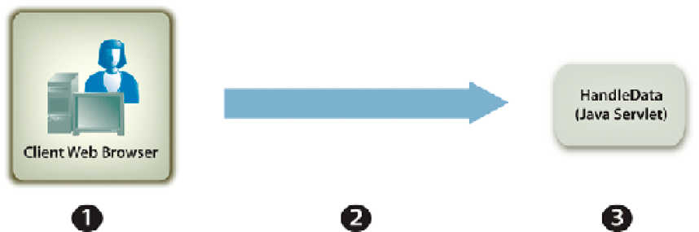

# Gestione dei Forms inviati {#handling-submitted-forms}

**Gli esempi e gli esempi contenuti in questo documento sono solo per l’ambiente AEM Forms su JEE.**

Le applicazioni basate sul Web che consentono a un utente di compilare moduli interattivi richiedono l&#39;invio dei dati al server. Tramite il servizio Forms è possibile recuperare i dati immessi dall&#39;utente in un modulo interattivo. Dopo aver recuperato i dati, è possibile elaborarli per soddisfare i requisiti aziendali. È ad esempio possibile memorizzare i dati in un database, inviarli a un&#39;altra applicazione, inviarli a un altro servizio, unire i dati in una struttura di modulo, visualizzarli in un browser Web e così via.

I dati del modulo vengono inviati al servizio Forms come dati XML o PDF, un&#39;opzione impostata in Designer. Un modulo inviato come XML consente di estrarre i singoli valori dei dati dei campi. In altre parole, è possibile estrarre il valore di ogni campo modulo immesso dall&#39;utente nel modulo. Un modulo inviato come dati PDF è costituito da dati binari e non da dati XML. È possibile salvare il modulo come file PDF o inviarlo a un altro servizio. Se si desidera estrarre dati da un modulo inviato come XML e quindi utilizzare i dati del modulo per creare un documento PDF, richiamare un&#39;altra operazione AEM Forms. (vedere [Creazione di documenti PDF con i dati XML inviati](/help/forms/developing/creating-pdf-documents-submitted-xml.md))

Il diagramma seguente mostra i dati inviati a un servlet Java denominato `HandleData` da un modulo interattivo visualizzato in un browser web.

Nella tabella seguente vengono illustrati i passaggi del diagramma.

<table>
 <thead>
  <tr>
   <th>
Passaggio
</th>
   <th>
Descrizione
</th>
  </tr>
 </thead>
 <tbody>
  <tr>
   <td>
1
</td>
   <td>
Un utente compila un modulo interattivo e fa clic sul pulsante Invia del modulo.
</td>
  </tr>
  <tr>
   <td>
2
</td>
   <td>
I dati vengono inviati al <code>HandleData</code> Java Servlet come dati XML.
</td>
  </tr>
  <tr>
   <td>
3
</td>
   <td>
Il <code>HandleData</code> Java Servlet contiene la logica dell’applicazione per recuperare i dati.
</td>
  </tr>
 </tbody>
</table>

## Gestione dei dati XML inviati {#handling-submitted-xml-data}

Quando i dati del modulo vengono inviati come XML, è possibile recuperare i dati XML che rappresentano i dati inviati. Tutti i campi modulo vengono visualizzati come nodi in uno schema XML. I valori del nodo corrispondono ai valori inseriti dall&#39;utente. Considerare un modulo prestito in cui ogni campo del modulo viene visualizzato come un nodo all&#39;interno dei dati XML. Il valore di ciascun nodo corrisponde al valore inserito da un utente. Supponiamo che un utente riempia il modulo del prestito con i dati mostrati nel seguente modulo.

Nella figura seguente vengono illustrati i dati XML corrispondenti recuperati mediante l&#39;API client del servizio Forms.

I campi nel modulo del prestito. Questi valori possono essere recuperati utilizzando le classi XML Java.

>[!NOTE]
>
>La struttura del modulo deve essere configurata correttamente in Designer affinché i dati vengano inviati come dati XML. Per configurare correttamente la struttura del modulo per l&#39;invio di dati XML, verificare che il pulsante Invia disponibile nella struttura del modulo sia impostato per l&#39;invio di dati XML. Per informazioni sull&#39;impostazione del pulsante Invia per inviare dati XML, vedere [AEM Forms Designer](https://www.adobe.com/go/learn_aemforms_designer_63).

## Gestione dei dati PDF inviati {#handling-submitted-pdf-data}

Considera un’applicazione web che richiama il servizio Forms. Dopo che il servizio Forms esegue il rendering di un modulo interattivo PDF in un browser Web client, l&#39;utente compila il modulo e lo invia nuovamente come dati PDF. Quando il servizio Forms riceve i dati PDF PDF, può inviarli a un altro servizio o salvarli come file PDF. Il diagramma seguente mostra il flusso logico dell’applicazione.

Nella tabella seguente vengono descritti i passaggi del diagramma.

<table>
 <thead>
  <tr>
   <th>
Passaggio
</th>
   <th>
Descrizione
</th>
  </tr>
 </thead>
 <tbody>
  <tr>
   <td>
1
</td>
   <td>
Una pagina web contiene un collegamento che accede a un servlet Java che richiama il servizio Forms.
</td>
  </tr>
  <tr>
   <td>
2
</td>
   <td>
Il servizio Forms esegue il rendering di un modulo PDF interattivo nel browser Web client.
</td>
  </tr>
  <tr>
   <td>
3
</td>
   <td>
L’utente compila un modulo interattivo e fa clic su un pulsante di invio. Il modulo viene inviato nuovamente al servizio Forms come dati PDF. Questa opzione è impostata in Designer.
</td>
  </tr>
  <tr>
   <td>
4
</td>
   <td>
Il servizio Forms salva i dati PDF come file PDF. 
</td>
  </tr>
 </tbody>
</table>

## Gestione dei dati URL UTF-16 inviati {#handling-submitted-url-utf-16-data}

Se i dati del modulo vengono inviati come dati URL UTF-16, il computer client richiede Adobe Reader o Acrobat 8.1 o versione successiva. Inoltre, se la progettazione del modulo contiene un pulsante di invio con dati codificati in URL (HTTP Post) e l’opzione di codifica dei dati è UTF-16, la progettazione del modulo deve essere modificata in un editor di testo come Blocco note. È possibile impostare l&#39;opzione di codifica su `UTF-16LE` o `UTF-16BE` per il pulsante Invia. La finestra di progettazione non fornisce questa funzionalità.

>[!NOTE]
>
>Per ulteriori informazioni sul servizio Forms, consulta [Guida di riferimento dei servizi per AEM Forms](https://www.adobe.com/go/learn_aemforms_services_63).

## Riepilogo dei passaggi {#summary-of-steps}

Per gestire i moduli inviati, eseguire le operazioni seguenti:

1. Includi file di progetto.
1. Crea un oggetto API client di Forms.
1. Recuperare i dati del modulo.
1. Determinare se l&#39;invio del modulo contiene file allegati.
1. Elabora i dati inviati.

**Includi file di progetto**

Includi i file necessari nel progetto di sviluppo. Se stai creando un’applicazione client utilizzando Java, includi i file JAR necessari. Se utilizzi i servizi web, accertati di includere i file proxy.

**Creare un oggetto API client di Forms**

Prima di poter eseguire a livello di programmazione un&#39;operazione API client del servizio Forms, è necessario creare un client del servizio Forms. Se utilizzi l’API Java, crea un’ `FormsServiceClient` oggetto. Se utilizzi l’API del servizio web Forms, crea un’ `FormsService` oggetto.

**Recupera dati modulo**

Per recuperare i dati del modulo inviati, è necessario richiamare `FormsServiceClient` dell&#39;oggetto `processFormSubmission` metodo. Quando si richiama questo metodo, è necessario specificare il tipo di contenuto del modulo inviato. Quando i dati vengono inviati da un browser Web client al servizio Forms, possono essere inviati come dati XML o PDF. Per recuperare i dati immessi nei campi modulo, è possibile inviare i dati come dati XML.

È inoltre possibile recuperare i campi modulo da un modulo inviato come dati PDF impostando le seguenti opzioni di runtime:

* Passa il seguente valore a `processFormSubmission` come parametro del tipo di contenuto: `CONTENT_TYPE=application/pdf`.
* Imposta il `RenderOptionsSpec` dell&#39;oggetto `PDFToXDP` valore per `true`
* Imposta il `RenderOptionsSpec` dell&#39;oggetto `ExportDataFormat` valore per `XMLData`

È possibile specificare il tipo di contenuto del modulo inviato quando si richiama `processFormSubmission` metodo. L&#39;elenco seguente specifica i valori dei tipi di contenuto applicabili:

* **text/xml**: rappresenta il tipo di contenuto da utilizzare quando un modulo di PDF invia i dati del modulo come XML.
* **application/x-www-form-urlencoded**: rappresenta il tipo di contenuto da utilizzare quando un modulo HTML invia dati come XML.
* **application/pdf**: rappresenta il tipo di contenuto da utilizzare quando un modulo di PDF invia dati come PDF.

>[!NOTE]
>
>Nella sezione Gestione degli invii di Forms sono disponibili tre avvii rapidi corrispondenti. La sezione Gestione dei PDF forms inviati come PDF con la Guida introduttiva all’API Java illustra come gestire i dati PDF inviati. Il tipo di contenuto specificato in questo avvio rapido è `application/pdf`. La sezione Gestione dei PDF forms inviati come XML mediante l&#39;avvio rapido API Java illustra come gestire i dati XML inviati da un modulo PDF. Il tipo di contenuto specificato in questo avvio rapido è `text/xml`. Analogamente, la gestione dei moduli HTML inviati come XML mediante l&#39;avvio rapido API Java illustra come gestire i dati XML inviati da un modulo HTML. Il tipo di contenuto specificato in questo avvio rapido è application/x-www-form-urlencoded.

Recuperi i dati del modulo pubblicati nel servizio Forms e ne determini lo stato di elaborazione. In altre parole, quando i dati vengono inviati al servizio Forms, non significa necessariamente che il servizio Forms abbia terminato l’elaborazione dei dati e che i dati siano pronti per essere elaborati. Ad esempio, i dati possono essere inviati al servizio Forms in modo da poter eseguire un calcolo. Una volta completato il calcolo, il modulo viene riprodotto all’utente con i risultati del calcolo visualizzati. Prima di elaborare i dati inviati, è consigliabile determinare se il servizio Forms ha completato l&#39;elaborazione dei dati.

Il servizio Forms restituisce i seguenti valori per indicare se ha completato l’elaborazione dei dati:

* **0 (Invia):** I dati inviati sono pronti per l’elaborazione.
* **1 (Calcola):** Il servizio Forms ha eseguito un’operazione di calcolo sui dati e i risultati devono essere restituiti all’utente.
* **2 (Convalida):** I dati del modulo convalidati dal servizio Forms e i risultati devono essere restituiti all’utente.
* **3 (successivo):** La pagina corrente è cambiata con risultati che devono essere scritti nell&#39;applicazione client.
* **4 (precedente**): la pagina corrente è cambiata con risultati che devono essere scritti nell&#39;applicazione client.

>[!NOTE]
>
>È necessario restituire all’utente i calcoli e le convalide. (vedere [Calcolo dati modulo](/help/forms/developing/calculating-form-data.md#calculating-form-data).

**Determinare se l&#39;invio del modulo contiene allegati**

Forms inviato al servizio Forms può contenere allegati. Ad esempio, utilizzando il riquadro degli allegati integrato di Acrobat, un utente può selezionare i file allegati da inviare insieme al modulo. L’utente può inoltre selezionare i file allegati utilizzando una barra degli strumenti di HTML sottoposta a rendering con un file di HTML.

Dopo aver determinato se un modulo contiene file allegati, è possibile elaborare i dati. È ad esempio possibile salvare l&#39;allegato nel file system locale.

>[!NOTE]
>
>Il modulo deve essere inviato come dati PDF per recuperare gli allegati. Se il modulo viene inviato come dati XML, gli allegati non vengono inviati.

**Elabora i dati inviati**

A seconda del tipo di contenuto dei dati inviati, è possibile estrarre singoli valori dei campi modulo dai dati XML inviati oppure salvare i dati PDF inviati come file PDF (o inviarli a un altro servizio). Per estrarre singoli campi modulo, convertire i dati XML inviati in un&#39;origine dati XML e quindi recuperare i valori dell&#39;origine dati XML utilizzando `org.w3c.dom` classi.

**Consulta anche**

[Inclusione dei file della libreria Java di AEM Forms](/help/forms/developing/invoking-aem-forms-using-java.md#including-aem-forms-java-library-files)

[Impostazione delle proprietà di connessione](/help/forms/developing/invoking-aem-forms-using-java.md#setting-connection-properties)

[Guida introduttiva all’API di servizio Forms](/help/forms/developing/forms-service-api-quick-starts.md#forms-service-api-quick-starts)

[Trasmissione di documenti al servizio Forms](/help/forms/developing/passing-documents-forms-service.md)

[Creazione di applicazioni Web per il rendering di Forms](/help/forms/developing/creating-web-applications-renders-forms.md)

## Gestire i moduli inviati tramite l’API Java {#handle-submitted-forms-using-the-java-api}

Gestisci un modulo inviato utilizzando l’API Forms (Java):

1. Includi file di progetto

   Includi i file JAR client, ad esempio adobe-forms-client.jar, nel percorso di classe del progetto Java.

1. Creare un oggetto API client di Forms

   * Creare un `ServiceClientFactory` oggetto che contiene proprietà di connessione.
   * Creare un `FormsServiceClient` mediante il costruttore e passando il `ServiceClientFactory` oggetto.

1. Recupera dati modulo

   * Per recuperare i dati del modulo inviati a un servlet Java, crea un `com.adobe.idp.Document` mediante il costruttore e richiamando l&#39;oggetto `javax.servlet.http.HttpServletResponse` dell&#39;oggetto `getInputStream` metodo dall&#39;interno del costruttore.
   * Creare un `RenderOptionsSpec` mediante il costruttore. Impostare il valore locale richiamando `RenderOptionsSpec` dell&#39;oggetto `setLocale` e passando un valore stringa che specifica il valore locale.

   >[!NOTE]
   >
   >È possibile indicare al servizio Forms di creare dati XDP o XML dal contenuto PDF inviato richiamando il `RenderOptionsSpec` dell&#39;oggetto `setPDF2XDP` metodo e passaggio `true` e anche chiamando `setXMLData` e superamento `true`. È quindi possibile richiamare `FormsResult` dell&#39;oggetto `getOutputXML` per recuperare i dati XML corrispondenti ai dati XDP/XML. (Il `FormsResult` l&#39;oggetto viene restituito da `processFormSubmission` che viene spiegato nel passaggio successivo.)

   * Richiama `FormsServiceClient` dell&#39;oggetto `processFormSubmission` e trasmettere i seguenti valori:

      * Il `com.adobe.idp.Document` oggetto che contiene i dati del modulo.
      * Valore stringa che specifica le variabili di ambiente, incluse tutte le intestazioni HTTP rilevanti. Specifica il tipo di contenuto da gestire. Per gestire i dati XML, specificare il valore stringa seguente per questo parametro: `CONTENT_TYPE=text/xml`. Per gestire i dati di PDF, specifica il seguente valore stringa per questo parametro: `CONTENT_TYPE=application/pdf`.
      * Un valore stringa che specifica il `HTTP_USER_AGENT` valore dell’intestazione, ad esempio. `Mozilla/4.0 (compatible; MSIE 6.0; Windows NT 5.1; SV1; .NET CLR 1.1.4322)`. Il valore di questo parametro è facoltativo.
      * A `RenderOptionsSpec` oggetto che memorizza le opzioni di runtime.

     Il `processFormSubmission` il metodo restituisce un `FormsResult` oggetto contenente i risultati dell’invio del modulo.

   * Determinare se il servizio Forms ha terminato l&#39;elaborazione dei dati del modulo richiamando `FormsResult` dell&#39;oggetto `getAction` metodo. Se questo metodo restituisce il valore `0`, i dati sono pronti per l’elaborazione.

1. Determinare se l&#39;invio del modulo contiene allegati

   * Richiama `FormsResult` dell&#39;oggetto `getAttachments` metodo. Questo metodo restituisce un `java.util.List` oggetto contenente i file inviati con il modulo.
   * Effettua iterazione attraverso `java.util.List` per determinare se sono presenti allegati. Se sono presenti file allegati, ogni elemento è un `com.adobe.idp.Document` dell&#39;istanza. È possibile salvare i file allegati richiamando `com.adobe.idp.Document` dell&#39;oggetto `copyToFile` e il passaggio di un `java.io.File` oggetto.

   >[!NOTE]
   >
   >Questo passaggio è applicabile solo se il modulo viene inviato come PDF.

1. Elabora i dati inviati

   * Se il tipo di contenuto dei dati è `application/vnd.adobe.xdp+xml` o `text/xml`, crea una logica di applicazione per recuperare i valori dei dati XML.

      * Creare un `com.adobe.idp.Document` oggetto richiamando il `FormsResult` dell&#39;oggetto `getOutputContent` metodo.
      * Creare un `java.io.InputStream` oggetto richiamando il `java.io.DataInputStream` costruttore e passaggio `com.adobe.idp.Document` oggetto.
      * Creare un `org.w3c.dom.DocumentBuilderFactory` oggetto chiamando l&#39;oggetto statico `org.w3c.dom.DocumentBuilderFactory` dell&#39;oggetto `newInstance` metodo.
      * Creare un `org.w3c.dom.DocumentBuilder` oggetto richiamando il `org.w3c.dom.DocumentBuilderFactory` dell&#39;oggetto `newDocumentBuilder` metodo.
      * Creare un `org.w3c.dom.Document` oggetto richiamando il `org.w3c.dom.DocumentBuilder` dell&#39;oggetto `parse` e passando il `java.io.InputStream` oggetto.
      * Recuperate il valore di ciascun nodo all&#39;interno del documento XML. Un modo per eseguire questa attività consiste nel creare un metodo personalizzato che accetti due parametri: `org.w3c.dom.Document` e il nome del nodo di cui si desidera recuperare il valore. Questo metodo restituisce un valore stringa che rappresenta il valore del nodo. Nell&#39;esempio di codice che segue questo processo, questo metodo personalizzato viene chiamato `getNodeText`. Viene visualizzato il corpo di questo metodo.

   * Se il tipo di contenuto dei dati è `application/pdf`, crea una logica di applicazione per salvare i dati PDF inviati come file PDF.

      * Creare un `com.adobe.idp.Document` oggetto richiamando il `FormsResult` dell&#39;oggetto `getOutputContent` metodo.
      * Creare un `java.io.File` mediante il costruttore pubblico. Assicurati di specificare PDF come estensione del nome file.
      * Popola il file PDF richiamando `com.adobe.idp.Document` dell&#39;oggetto `copyToFile` e passando il `java.io.File` oggetto.

**Consulta anche**

[Quick Start (modalità SOAP): gestione dei PDF forms inviati come XML tramite l’API Java](/help/forms/developing/forms-service-api-quick-starts.md#quick-start-soap-mode-handling-pdf-forms-submitted-as-xml-using-the-java-api)

[Quick Start (modalità SOAP): gestione dei moduli HTML inviati come XML tramite l’API Java](/help/forms/developing/forms-service-api-quick-starts.md#quick-start-soap-mode-handling-html-forms-submitted-as-xml-using-the-java-api)

[Quick Start (modalità SOAP): gestione dei PDF forms inviati come PDF tramite l’API Java](/help/forms/developing/forms-service-api-quick-starts.md#quick-start-soap-mode-handling-pdf-forms-submitted-as-pdf-using-the-java-api)

[Inclusione dei file della libreria Java di AEM Forms](/help/forms/developing/invoking-aem-forms-using-java.md#including-aem-forms-java-library-files)

[Impostazione delle proprietà di connessione](/help/forms/developing/invoking-aem-forms-using-java.md#setting-connection-properties)

## Gestire i dati PDF inviati tramite l’API del servizio web {#handle-submitted-pdf-data-using-the-web-service-api}

Gestisci un modulo inviato utilizzando l’API Forms (servizio web):

1. Includi file di progetto

   * Creare classi proxy Java che utilizzano il servizio Forms WSDL.
   * Includi le classi proxy Java nel percorso della classe.

1. Creare un oggetto API client di Forms

   Creare un `FormsService` e impostare i valori di autenticazione.

1. Recupera dati modulo

   * Per recuperare i dati del modulo inviati a un servlet Java, crea un `BLOB` mediante il costruttore.
   * Creare un `java.io.InputStream` oggetto richiamando il `javax.servlet.http.HttpServletResponse` dell&#39;oggetto `getInputStream` metodo.
   * Creare un `java.io.ByteArrayOutputStream` dell&#39;oggetto utilizzando il relativo costruttore e passando la lunghezza del `java.io.InputStream` oggetto.
   * Copia il contenuto del `java.io.InputStream` oggetto in `java.io.ByteArrayOutputStream` oggetto.
   * Creare una matrice di byte richiamando `java.io.ByteArrayOutputStream` dell&#39;oggetto `toByteArray` metodo.
   * Popolare il `BLOB` oggetto richiamando il relativo `setBinaryData` e passando la matrice di byte come argomento.
   * Creare un `RenderOptionsSpec` mediante il costruttore. Impostare il valore locale richiamando `RenderOptionsSpec` dell&#39;oggetto `setLocale` e passando un valore stringa che specifica il valore locale.
   * Richiama `FormsService` dell&#39;oggetto `processFormSubmission` e trasmettere i seguenti valori:

      * Il `BLOB` oggetto che contiene i dati del modulo.
      * Valore stringa che specifica le variabili di ambiente, incluse tutte le intestazioni HTTP rilevanti. Specifica il tipo di contenuto da gestire. Per gestire i dati XML, specificare il valore stringa seguente per questo parametro: `CONTENT_TYPE=text/xml`. Per gestire i dati di PDF, specifica il seguente valore stringa per questo parametro: `CONTENT_TYPE=application/pdf`.
      * Un valore stringa che specifica il `HTTP_USER_AGENT` valore intestazione; ad esempio, `Mozilla/4.0 (compatible; MSIE 6.0; Windows NT 5.1; SV1; .NET CLR 1.1.4322)`.
      * A `RenderOptionsSpec` oggetto che memorizza le opzioni di runtime.
      * Un campo vuoto `BLOBHolder` oggetto popolato dal metodo.
      * Un campo vuoto `javax.xml.rpc.holders.StringHolder` oggetto popolato dal metodo.
      * Un campo vuoto `BLOBHolder` oggetto popolato dal metodo.
      * Un campo vuoto `BLOBHolder` oggetto popolato dal metodo.
      * Un campo vuoto `javax.xml.rpc.holders.ShortHolder` oggetto popolato dal metodo.
      * Un campo vuoto `MyArrayOf_xsd_anyTypeHolder` oggetto popolato dal metodo. Questo parametro viene utilizzato per memorizzare gli allegati dei file inviati insieme al modulo.
      * Un campo vuoto `FormsResultHolder` oggetto popolato dal metodo con il modulo inviato.

     Il `processFormSubmission` il metodo compila `FormsResultHolder` con i risultati dell&#39;invio del modulo.

   * Determinare se il servizio Forms ha terminato l&#39;elaborazione dei dati del modulo richiamando `FormsResult` dell&#39;oggetto `getAction` metodo. Se questo metodo restituisce il valore `0`, i dati del modulo sono pronti per l’elaborazione. Puoi ottenere un `FormsResult` dell&#39;oggetto ottenendo il valore del `FormsResultHolder` dell&#39;oggetto `value` membro dati.

1. Determinare se l&#39;invio del modulo contiene allegati

   Ottieni il valore di `MyArrayOf_xsd_anyTypeHolder` dell&#39;oggetto `value` membro dati (il `MyArrayOf_xsd_anyTypeHolder` l&#39;oggetto è stato passato al `processFormSubmission` metodo). Questo membro dati restituisce un array di `Objects`. Ogni elemento all’interno del `Object` array è un `Object`che corrisponde ai file inviati insieme al modulo. È possibile ottenere ogni elemento all’interno dell’array ed eseguirne il cast in un `BLOB` oggetto.

1. Elabora i dati inviati

   * Se il tipo di contenuto dei dati è `application/vnd.adobe.xdp+xml` o `text/xml`, crea una logica di applicazione per recuperare i valori dei dati XML.

      * Creare un `BLOB` oggetto richiamando il `FormsResult` dell&#39;oggetto `getOutputContent` metodo.
      * Creare una matrice di byte richiamando `BLOB` dell&#39;oggetto `getBinaryData` metodo.
      * Creare un `java.io.InputStream` oggetto richiamando il `java.io.ByteArrayInputStream` costruttore e il passaggio della matrice di byte.
      * Creare un `org.w3c.dom.DocumentBuilderFactory` oggetto chiamando l&#39;oggetto statico `org.w3c.dom.DocumentBuilderFactory` dell&#39;oggetto `newInstance` metodo.
      * Creare un `org.w3c.dom.DocumentBuilder` oggetto richiamando il `org.w3c.dom.DocumentBuilderFactory` dell&#39;oggetto `newDocumentBuilder` metodo.
      * Creare un `org.w3c.dom.Document` oggetto richiamando il `org.w3c.dom.DocumentBuilder` dell&#39;oggetto `parse` e passando il `java.io.InputStream` oggetto.
      * Recuperate il valore di ciascun nodo all&#39;interno del documento XML. Un modo per eseguire questa attività consiste nel creare un metodo personalizzato che accetti due parametri: `org.w3c.dom.Document` e il nome del nodo di cui si desidera recuperare il valore. Questo metodo restituisce un valore stringa che rappresenta il valore del nodo. Nell&#39;esempio di codice che segue questo processo, questo metodo personalizzato viene chiamato `getNodeText`. Viene visualizzato il corpo di questo metodo.

   * Se il tipo di contenuto dei dati è `application/pdf`, crea una logica di applicazione per salvare i dati PDF inviati come file PDF.

      * Creare un `BLOB` oggetto richiamando il `FormsResult` dell&#39;oggetto `getOutputContent` metodo.
      * Creare una matrice di byte richiamando `BLOB` dell&#39;oggetto `getBinaryData` metodo.
      * Creare un `java.io.File` mediante il costruttore pubblico. Assicurati di specificare PDF come estensione del nome file.
      * Creare un `java.io.FileOutputStream` mediante il costruttore e passando il `java.io.File` oggetto.
      * Popola il file PDF richiamando `java.io.FileOutputStream` dell&#39;oggetto `write` e passando la matrice di byte.

**Consulta anche**

[Richiamare AEM Forms utilizzando la codifica Base64](/help/forms/developing/invoking-aem-forms-using-web.md#invoking-aem-forms-using-base64-encoding)
