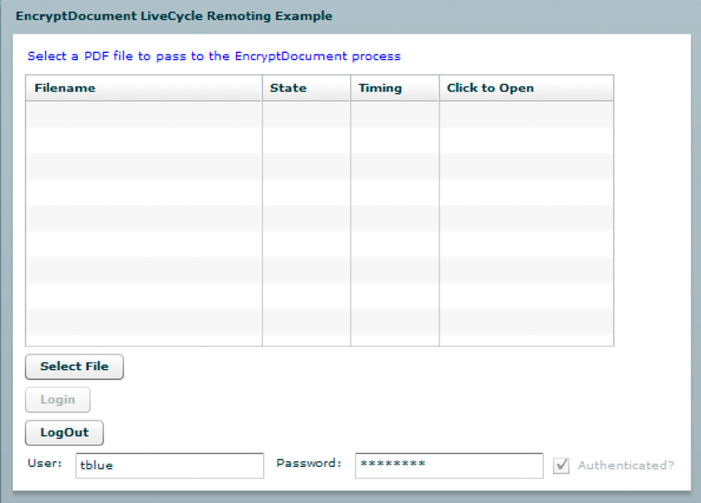
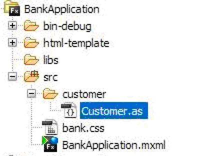

# Chiamata di AEM Forms tramite REMOTO {#invoking-aem-forms-using-remoting}

I processi creati in Workbench possono essere richiamati utilizzando la funzione Remoting. In altre parole, è possibile richiamare un processo AEM Forms da un&#39;applicazione client integrata con Flex. Questa funzione è basata su Data Services.

>[!NOTE]
>
>Quando si utilizza Remoting, è consigliabile richiamare i processi creati in Workbench anziché i servizi AEM Forms. Tuttavia, è possibile richiamare direttamente i servizi AEM Forms. (Vedere Cifratura di documenti PDF tramite Remoting situato in AEM Forms Developer Center.)

>[!NOTE]
>
>Se un servizio AEM Forms non è configurato per consentire l&#39;accesso anonimo, le richieste provenienti da un client Flex generano un problema nel browser Web. L&#39;utente deve immettere il nome utente e le credenziali della password.

È possibile invocare il processo di breve durata AEM Forms, denominato `MyApplication/EncryptDocument`, utilizzando Remoting. Per informazioni su questo processo, ad esempio i valori di input e output, vedere l’esempio [di processo](/help/forms/developing/aem-forms-processes.md)breve durata.


>[!NOTE]
>
>Per richiamare un processo AEM Forms utilizzando un&#39;applicazione Flex, assicurarsi che sia attivato un endpoint remoto. Per impostazione predefinita, un endpoint remoto è abilitato quando si distribuisce un processo.

Quando viene richiamato, questo processo esegue le azioni seguenti:

1. Ottiene il documento PDF non protetto che viene passato come valore di input. Questa azione è basata sull&#39; `SetValue` operazione. Il nome del parametro di input è `inDoc` e il relativo tipo di dati è `document`. (Il tipo di `document` dati è un tipo di dati disponibile in Workbench).
1. Cifra il documento PDF con una password. Questa azione è basata sull&#39; `PasswordEncryptPDF` operazione. Il nome del valore di output per questo processo è `outDoc` e rappresenta il documento PDF crittografato con password. Il tipo di dati di outDoc è `document`.
1. Salva il documento PDF crittografato con password come file PDF nel file system locale. Questa azione è basata sull&#39; `WriteDocument` operazione.

>[!NOTE]
>
>Il `MyApplication/EncryptDocument` processo non è basato su un processo AEM Forms esistente. Per seguire gli esempi di codice, creare un processo denominato `MyApplication/EncryptDocument` utilizzando Workbench.

>[!NOTE]
>
>Per informazioni sull&#39;utilizzo di Remoting per richiamare un processo di lunga durata, vedere [Richiamo di processi](/help/forms/developing/invoking-human-centric-long-lived.md#invoking-human-centric-long-lived-processes)a lunga durata basati sull&#39;uomo.

**Consulta anche**

[Inclusione del file libreria Flex AEM Forms](invoking-aem-forms-using-remoting.md#including-the-aem-forms-flex-library-file)

[Gestione dei documenti con (obsoleto per i moduli AEM) AEM Forms](invoking-aem-forms-using-remoting.md#handling-documents-with-remoting)

[Richiamo di un processo di breve durata passando un documento non sicuro utilizzando (obsoleto per i moduli AEM) AEM Forms Remoting](invoking-aem-forms-using-remoting.md#invoking-a-short-lived-process-by-passing-an-unsecure-document-using-remoting)

[Autenticazione di applicazioni client integrate con Flex](invoking-aem-forms-using-remoting.md#authenticating-client-applications-built-with-flex)

[Trasmissione di documenti protetti per richiamare i processi tramite Remoting](invoking-aem-forms-using-remoting.md#passing-secure-documents-to-invoke-processes-using-remoting)

[Richiamo di servizi componenti personalizzati tramite REMOTO](invoking-aem-forms-using-remoting.md#invoking-custom-component-services-using-remoting)

[Creazione di un&#39;applicazione client integrata con Flex che richiama un processo longevo incentrato sull&#39;uomo](/help/forms/developing/invoking-human-centric-long-lived.md#creating-a-client-application-built-with-flex-that-invokes-a-human-centric-long-lived-process)

[Creazione di applicazioni Flash Builder che eseguono l&#39;autenticazione SSO tramite token HTTP](/help/forms/developing/creating-flash-builder-applications-perform.md#creating-flash-builder-applications-that-perform-sso-authentication-using-http-tokens)

Per informazioni su come visualizzare i dati del processo in un controllo grafico Flex, vedere [Visualizzazione dei dati del processo AEM Forms in grafici](https://www.adobe.com/devnet/livecycle/articles/populating_flexcontrols.html)Flex.

>[!NOTE]
>
>*Accertatevi di posizionare il file crossdomain.xml nella posizione corretta. Ad esempio, se avete distribuito AEM Forms su JBoss, inserite il file nel percorso seguente: &lt;install_directory>\Adobe_Experience_Manager_forms\jboss\server\lc_turnkey\deploy\jboss-web.deployer\ROOT.war.*

## Inclusione del file libreria Flex AEM Forms {#including-the-aem-forms-flex-library-file}

Per richiamare i processi AEM Forms a livello di programmazione utilizzando Remoting, aggiungete il file adobe-remoting-provider.swc al percorso di classe del progetto Flex. Questo file SWC si trova nel seguente percorso:

* *&lt;install_directory>\Adobe_Experience_Manager_forms\sdk\misc\DataServices\Client-Libraries*

   dove &lt;*install_directory*> è la directory in cui sono installati i AEM Forms.

**Consulta anche**

[Chiamata di AEM Forms tramite (obsoleto per i moduli AEM) AEM Forms Remoting](invoking-aem-forms-using-remoting.md#invoking-aem-forms-using-remoting)

[Gestione dei documenti con (obsoleto per i moduli AEM) AEM Forms](invoking-aem-forms-using-remoting.md#handling-documents-with-remoting)

[Richiamo di un processo di breve durata passando un documento non sicuro utilizzando (obsoleto per i moduli AEM) AEM Forms Remoting](invoking-aem-forms-using-remoting.md#invoking-a-short-lived-process-by-passing-an-unsecure-document-using-remoting)

[Autenticazione di applicazioni client integrate con Flex](invoking-aem-forms-using-remoting.md#authenticating-client-applications-built-with-flex)

## Gestione dei documenti con la funzione Remoting {#handling-documents-with-remoting}

Uno dei tipi Java non primitivi più importanti utilizzati nei AEM Forms è la `com.adobe.idp.Document` classe. Un documento è comunemente richiesto per richiamare un&#39;operazione AEM Forms. Si tratta principalmente di un documento PDF, ma può contenere altri tipi di documento come SWF, HTML, XML o un file DOC. Consultate [Trasmissione di dati ai servizi AEM Forms tramite l’API](/help/forms/developing/invoking-aem-forms-using-java.md#passing-data-to-aem-forms-services-using-the-java-api)Java.

Un&#39;applicazione client integrata con Flex non può richiedere direttamente un documento. Ad esempio, non è possibile avviare Adobe Reader per richiedere un URL che produca un file PDF. Le richieste per tipi di documenti, come documenti PDF e Microsoft Word, restituiscono un risultato che è un URL. È responsabilità del cliente visualizzare il contenuto dell’URL. Il servizio Document Management consente di generare l&#39;URL e le informazioni sul tipo di contenuto. Le richieste di documenti XML restituiscono il documento XML completo nel risultato.

### Trasmissione di un documento come parametro di input {#passing-a-document-as-an-input-parameter}

Un&#39;applicazione client integrata con Flex non può trasmettere un documento direttamente a un processo AEM Forms. Al contrario, l&#39;applicazione client utilizza un&#39;istanza della classe `mx.rpc.livecycle.DocumentReference` ActionScript per passare i parametri di input a un&#39;operazione che prevede un&#39; `com.adobe.idp.Document` istanza. Un&#39;applicazione client Flex offre diverse opzioni per impostare un `DocumentReference` oggetto:

* Quando il documento si trova sul server e la posizione del file è nota, impostare la proprietà referenceType dell&#39;oggetto DocumentReference su REF_TYPE_FILE. Impostare la proprietà fileRef sulla posizione del file, come illustrato nell&#39;esempio seguente:

```java
 ... var docRef: DocumentReference = new DocumentReference(); 
 docRef.referenceType = DocumentReference.REF_TYPE_FILE; 
 docRef.fileRef = "C:/install/adobe/cs2/How to Uninstall.pdf"; ...
```

* Quando il documento si trova sul server e si conosce il relativo URL, impostare la proprietà referenceType dell&#39;oggetto DocumentReference su REF_TYPE_URL. Impostate la proprietà url sull’URL, come illustrato nell’esempio seguente:

```java
... var docRef: DocumentReference = new DocumentReference(); 
docRef.referenceType = DocumentReference.REF_TYPE_URL; 
docRef.url = "https://companyserver:8080/DocumentManager/116/7855"; ...
```

* Per creare un oggetto DocumentReference da una stringa di testo nell&#39;applicazione client, impostare la proprietà referenceType dell&#39;oggetto DocumentReference su REF_TYPE_INLINE. Impostare la proprietà text sul testo da includere nell&#39;oggetto, come illustrato nell&#39;esempio seguente:

```java
... var docRef: DocumentReference = new DocumentReference(); 
docRef.referenceType = DocumentReference.REF_TYPE_INLINE; 
docRef.text = "Text for my document";  // Optionally, you can override the server’s default character set  // if necessary:  // docRef.charsetName=CharacterSetName  ...
```

* Se il documento non è sul server, usate il servlet di caricamento Remoto per caricare un documento sugli AEM Forms. La novità dei AEM Forms è la possibilità di caricare documenti protetti. Quando caricate un documento protetto, dovete utilizzare un utente con il ruolo utente *dell&#39;applicazione* Document Upload (Caricamento documento). Senza questo ruolo, l&#39;utente non può caricare un documento protetto. È consigliabile utilizzare il single sign-on per caricare un documento protetto. (vedere [Trasmissione di documenti protetti per richiamare i processi tramite Remoting](invoking-aem-forms-using-remoting.md#passing-secure-documents-to-invoke-processes-using-remoting).)

>[!NOTE]
se i AEM Forms sono configurati per consentire il caricamento di documenti non protetti, potete utilizzare un utente che non dispone del ruolo Utente applicazione di caricamento documenti per caricare un documento. Un utente può anche disporre dell’autorizzazione Carica documento. Tuttavia, se i AEM Forms sono configurati per consentire solo documenti protetti, accertatevi che l&#39;utente disponga del ruolo Utente applicazione di caricamento del documento o dell&#39;autorizzazione Carica documento. Consultate [Configurazione dei AEM Forms per accettare documenti](invoking-aem-forms-using-remoting.md#configuring-aem-forms-to-accept-secure-and-unsecure-documents)sicuri e non.

Per l’URL di caricamento designato potete usare le funzionalità di caricamento Flash standard: `https://SERVER:PORT/remoting/lcfileupload`. È quindi possibile utilizzare l&#39; `DocumentReference` oggetto ovunque sia previsto `Document` un parametro di input di tipo` private function startUpload():void  {  fileRef.addEventListener(Event.SELECT, selectHandler);  fileRef.addEventListener("uploadCompleteData", completeHandler);  try  {   var success:Boolean = fileRef.browse();  }    catch (error:Error)  {   trace("Unable to browse for files.");  }  }      private function selectHandler(event:Event):void {  var request:URLRequest = new  URLRequest("https://SERVER:PORT/remoting/lcfileupload")  try   {   fileRef.upload(request);   }    catch (error:Error)   {   trace("Unable to upload file.");   }  }    private function completeHandler(event:DataEvent):void  {   var params:Object = new Object();   var docRef:DocumentReference = new DocumentReference();   docRef.url = event.data as String;   docRef.referenceType = DocumentReference.REF_TYPE_URL;  }`La Guida rapida remota utilizza il servlet di caricamento remoto per passare un file PDF al `MyApplication/EncryptDocument`processo. (Consultate [Richiamo di un processo di breve durata mediante il passaggio di un documento non sicuro tramite la rimozione](invoking-aem-forms-using-remoting.md#invoking-a-short-lived-process-by-passing-an-unsecure-document-using-remoting)di AEM Forms (obsoleto per i moduli AEM).)

```java
 
private
function startUpload(): void  { 
 fileRef.addEventListener(Event.SELECT, selectHandler); 
 fileRef.addEventListener("uploadCompleteData", completeHandler); 
 try  { 
  var success: Boolean = fileRef.browse(); 
 }  
 catch (error: Error)  { 
  trace("Unable to browse for files."); 
 } 
}   
private
function selectHandler(event: Event): void { 
 var request: URLRequest = new  URLRequest("https://SERVER:PORT/remoting/lcfileupload")  try  { 
  fileRef.upload(request); 
 }  
 catch (error: Error)  { 
  trace("Unable to upload file."); 
 } 
}  
private
function completeHandler(event: DataEvent): void  { 
 var params: Object = new Object(); 
 var docRef: DocumentReference = new DocumentReference(); 
 docRef.url = event.data as String; 
 docRef.referenceType = DocumentReference.REF_TYPE_URL; 
}
```

La Avvio rapido remoto utilizza il servlet di caricamento remoto per passare un file PDF al `MyApplication/EncryptDocument`processo. (Consultate [Richiamo di un processo di breve durata mediante il passaggio di un documento non sicuro tramite la rimozione](invoking-aem-forms-using-remoting.md#invoking-a-short-lived-process-by-passing-an-unsecure-document-using-remoting)di AEM Forms (obsoleto per i moduli AEM).)

### Ripristino di un documento a un&#39;applicazione client {#passing-a-document-back-to-a-client-application}

Un&#39;applicazione client riceve un oggetto di tipo `mx.rpc.livecycle.DocumentReference` per un&#39;operazione di servizio che restituisce un&#39; `com.adobe.idp.Document` istanza come parametro di output. Poiché un&#39;applicazione client si occupa di oggetti ActionScript e non di Java, non è possibile restituire un oggetto Document basato su Java a un client Flex. Il server genera invece un URL per il documento e ritorna l&#39;URL al client. La proprietà `DocumentReference` dell&#39; `referenceType` oggetto specifica se il contenuto si trova nell&#39; `DocumentReference` &#39;oggetto o se è necessario recuperarlo da un URL nella `DocumentReference.url` proprietà. La `DocumentReference.contentType` proprietà specifica il tipo di documento.

**Consulta anche**

[Chiamata di AEM Forms tramite (obsoleto per i moduli AEM) AEM Forms Remoting](invoking-aem-forms-using-remoting.md#invoking-aem-forms-using-remoting)

[Inclusione del file libreria Flex AEM Forms](invoking-aem-forms-using-remoting.md#including-the-aem-forms-flex-library-file)

[Richiamo di un processo di breve durata passando un documento non sicuro utilizzando (obsoleto per i moduli AEM) AEM Forms Remoting](invoking-aem-forms-using-remoting.md#invoking-a-short-lived-process-by-passing-an-unsecure-document-using-remoting)

[Autenticazione di applicazioni client integrate con Flex](invoking-aem-forms-using-remoting.md#authenticating-client-applications-built-with-flex)

[Trasmissione di documenti protetti per richiamare i processi tramite Remoting](invoking-aem-forms-using-remoting.md#passing-secure-documents-to-invoke-processes-using-remoting)

## Richiamo di un processo di breve durata passando un documento non sicuro tramite Remoting {#invoking-a-short-lived-process-by-passing-an-unsecure-document-using-remoting}

Per richiamare un processo AEM Forms da un&#39;applicazione integrata con Flex, eseguire le operazioni seguenti:

1. Create un&#39; `mx:RemoteObject` istanza.
1. Create un&#39; `ChannelSet` istanza.
1. Trasmettere i valori di input richiesti.
1. Gestire i valori restituiti.

>[!NOTE]
In questa sezione viene illustrato come richiamare un processo AEM Forms e caricare un documento quando i AEM Forms sono configurati per caricare documenti non protetti. Per informazioni su come richiamare i processi AEM Forms e caricare i documenti protetti, nonché su come configurare i AEM Forms per accettare documenti protetti e non protetti, vedere [Trasmissione di documenti protetti per richiamare i processi tramite Remoting](invoking-aem-forms-using-remoting.md#passing-secure-documents-to-invoke-processes-using-remoting).

**Creazione di un&#39;istanza mx:RemoteObject**

È possibile creare un&#39; `mx:RemoteObject` istanza per richiamare un processo AEM Forms creato in Workbench. Per creare un’ `mx:RemoteObject` istanza, specificate i seguenti valori:

* **id:** Il nome dell&#39; `mx:RemoteObject` istanza che rappresenta il processo da richiamare.
* **destinazione:** Nome del processo AEM Forms da richiamare. Ad esempio, per richiamare il `MyApplication/EncryptDocument` processo, specificare `MyApplication/EncryptDocument`.
* **risultato:** Nome del metodo Flex che gestisce il risultato.

All&#39;interno del `mx:RemoteObject` tag , specificate un `<mx:method>` tag che specifica il nome del metodo di chiamata del processo. In genere, il nome di un metodo di chiamata Forms è `invoke`.

Nell&#39;esempio di codice seguente viene creata un&#39; `mx:RemoteObject` istanza che richiama il `MyApplication/EncryptDocument` processo.

```java
 <mx:RemoteObject id="EncryptDocument" destination="MyApplication/EncryptDocument" result="resultHandler(event);">
          <mx:method name="invoke" result="handleExecuteInvoke(event)"/>
      </mx:RemoteObject>
```

**Creare un canale ai AEM Forms**

Un&#39;applicazione client può richiamare AEM Forms specificando un canale in MXML o ActionScript, come illustrato nell&#39;esempio di ActionScript seguente. Il canale deve essere un `AMFChannel`, `SecureAMFChannel`, `HTTPChannel`o `SecureHTTPChannel`.

```java
     ...
     private function refresh():void{
         var cs:ChannelSet= new ChannelSet();
         cs.addChannel(new AMFChannel("my-amf",
             "https://yourlcserver:8080/remoting/messagebroker/amf"));
         EncryptDocument.setCredentials("administrator", "password");
         EncryptDocument.channelSet = cs;
     }
     ...
```

Assegnate l’ `ChannelSet` istanza al campo `mx:RemoteObject` dell’ `channelSet` istanza (come illustrato nell’esempio di codice precedente). In genere, quando si richiama il `ChannelSet.addChannel` metodo si importa la classe channel in un&#39;istruzione import anziché specificare il nome completo.

**Trasmissione dei valori di input**

Un processo creato in Workbench può richiedere zero o più parametri di input e restituire un valore di output. Un&#39;applicazione client trasmette i parametri di input all&#39;interno di un `ActionScript` oggetto con campi corrispondenti a parametri appartenenti al processo AEM Forms. Il processo di breve durata, denominato `MyApplication/EncryptDocument`, richiede un parametro di input denominato `inDoc`. Il nome dell&#39;operazione esposta dal processo è `invoke` (il nome predefinito per un processo di breve durata). (consultate [Richiamo di AEM Forms mediante (obsoleto per i moduli AEM) AEM Forms](invoking-aem-forms-using-remoting.md#invoking-aem-forms-using-remoting)Remoting.)

L&#39;esempio di codice seguente passa un documento PDF al `MyApplication/EncryptDocument` processo:

```java
     ...
     var params:Object = new Object();
 
     //Document is an instance of DocumentReference
     //that store an unsecured PDF document
     params["inDoc"] = pdfDocument;
 
     // Invoke an operation synchronously:
     EncryptDocument.invoke(params);
     ...
```

In questo esempio di codice `pdfDocument` è un&#39; `DocumentReference` istanza che contiene un documento PDF non protetto. Per informazioni su un `DocumentReference`, consultate [Gestione dei documenti con (obsoleto per i moduli AEM) AEM Forms REMIX](invoking-aem-forms-using-remoting.md#handling-documents-with-remoting).

**Richiamo di una versione specifica di un servizio**

È possibile richiamare una versione specifica di un servizio Forms utilizzando un `_version` parametro nella mappa dei parametri della chiamata. Ad esempio, per richiamare la versione 1.2 del `MyApplication/EncryptDocument` servizio:

```java
 var params:Object = new Object();
 params["inDoc"] = pdfDocument;
 params["_version"] = "1.2"
 var token:AsyncToken = echoService.echoString(params);
```

Il `version` parametro deve essere una stringa contenente un singolo punto. I valori a sinistra, versione principale e destra, versione minore del periodo devono essere numeri interi. Se questo parametro non viene specificato, viene richiamata la versione head attiva.

**Gestione dei valori restituiti**

I parametri di output del processo AEM Forms vengono deserializzati in oggetti ActionScript da cui l&#39;applicazione client estrae parametri specifici per nome, come illustrato nell&#39;esempio seguente. Il valore di output del `MyApplication/EncryptDocument` processo è denominato `outDoc`.

```java
     ...
     var res:Object = event.result;
     var docRef:DocumentReference = res["outDoc"] as DocumentReference;
     ...
```

**Richiamo del processo MyApplication/EncryptDocument**

È possibile richiamare il `MyApplication/EncryptDocument` processo eseguendo i seguenti passaggi:

1. Create un&#39; `mx:RemoteObject` istanza tramite ActionScript o MXML. Consultate Creazione di un&#39;istanza mx:RemoteObject.
1. Configurate un&#39; `ChannelSet` istanza per comunicare con i AEM Forms e associatela all&#39; `mx:RemoteObject` istanza. Consultate Creare un canale ai AEM Forms.
1. Chiama il metodo ChannelSet o il `login` metodo del `setCredentials` servizio per specificare il valore dell&#39;identificatore utente e la password. Consultate [Utilizzo del single sign-on](invoking-aem-forms-using-remoting.md#using-single-sign-on).
1. Compilare un&#39; `mx.rpc.livecycle.DocumentReference` istanza con un documento PDF non protetto da passare al `MyApplication/EncryptDocument` processo. (vedere [Trasmissione di un documento come parametro](invoking-aem-forms-using-remoting.md#passing-a-document-as-an-input-parameter)di input).
1. Crittografare il documento PDF chiamando il `mx:RemoteObject` metodo dell&#39; `invoke` istanza. Passa il parametro `Object` che contiene il parametro di input (ovvero il documento PDF non protetto). Vedere Trasmissione dei valori di input.
1. Recuperare il documento PDF crittografato con password restituito dal processo. Consultate Gestione dei valori restituiti.

[Avvio rapido: Richiamo di un processo di breve durata passando un documento non sicuro utilizzando (obsoleto per i moduli AEM) AEM Forms Remoting](/help/forms/developing/invocation-api-quick-starts.md#quick-start-invoking-a-short-lived-process-by-passing-an-unsecure-document-using-deprecated-for-aem-forms-aem-forms-remoting)

## Autenticazione di applicazioni client integrate con Flex {#authenticating-client-applications-built-with-flex}

Gli user manager di moduli AEM possono autenticare una richiesta Remoting da un&#39;applicazione Flex in diversi modi, inclusi il single sign-on AEM Forms tramite il servizio di accesso centrale, l&#39;autenticazione di base e l&#39;autenticazione personalizzata. Se non è abilitato né il Single Sign-On né l&#39;accesso anonimo, una richiesta Remoting genera un&#39;autenticazione di base (impostazione predefinita) o un&#39;autenticazione personalizzata.

L&#39;autenticazione di base si basa sull&#39;autenticazione di base J2EE standard dal contenitore dell&#39;applicazione Web. Per l&#39;autenticazione di base, un errore HTTP 401 può causare un problema del browser. Ciò significa che quando si tenta di connettersi a un&#39;applicazione Forms utilizzando RemoteObject e non si è ancora effettuato l&#39;accesso dall&#39;applicazione Flex, il browser richiede un nome utente e una password.

Per l&#39;autenticazione personalizzata, il server invia un errore al client per indicare che l&#39;autenticazione è necessaria.

>[!NOTE]
Per informazioni sull&#39;esecuzione dell&#39;autenticazione mediante i token HTTP, consultate [Creazione di applicazioni Flash Builder che eseguono l&#39;autenticazione SSO utilizzando i token](/help/forms/developing/creating-flash-builder-applications-perform.md#creating-flash-builder-applications-that-perform-sso-authentication-using-http-tokens)HTTP.

### Utilizzo dell&#39;autenticazione personalizzata {#using-custom-authentication}

Per abilitare l&#39;autenticazione personalizzata nella console di amministrazione, cambi il metodo di autenticazione da Base a Personalizzato sull&#39;endpoint remoto. Se utilizzate l&#39;autenticazione personalizzata, l&#39;applicazione client chiama il `ChannelSet.login` metodo di accesso e il `ChannelSet.logout` metodo di disconnessione.

>[!NOTE]
Nella precedente versione dei AEM Forms, hai inviato le credenziali a una destinazione chiamando il `RemoteObject.setCredentials` metodo. Il `setCredentials` metodo non ha passato le credenziali al server fino al primo tentativo del componente di connettersi al server. Pertanto, se il componente ha emesso un evento di errore, non è possibile stabilire se l&#39;errore è dovuto a un errore di autenticazione o per un altro motivo. Il `ChannelSet.login` metodo si connette al server quando lo si chiama, in modo da poter gestire immediatamente un problema di autenticazione. Anche se potete continuare a utilizzare il `setCredentials` metodo, si consiglia di utilizzare il `ChannelSet.login` metodo.

Poiché più destinazioni possono utilizzare gli stessi canali e l&#39;oggetto ChannelSet corrispondente, l&#39;accesso a una destinazione consente all&#39;utente di accedere a qualsiasi altra destinazione che utilizza lo stesso canale o gli stessi canali. Se due componenti applicano credenziali diverse allo stesso oggetto ChannelSet, vengono utilizzate le ultime credenziali applicate. Se più componenti utilizzano lo stesso oggetto ChannelSet autenticato, la chiamata del `logout` metodo comporta la disconnessione di tutti i componenti dalle destinazioni.

Nell&#39;esempio seguente vengono utilizzati i metodi `ChannelSet.login` e `ChannelSet.logout` con un controllo RemoteObject. Questa applicazione esegue le azioni seguenti:

* Crea un `ChannelSet` oggetto nel `creationComplete` gestore che rappresenta i canali utilizzati dal `RemoteObject` componente
* Trasmette le credenziali al server chiamando la `ROLogin` funzione in risposta a un evento di clic pulsante
* Utilizza il componente RemoteObject per inviare una stringa al server in risposta a un evento Click Button. Il server restituisce lo stesso valore String al componente RemoteObject
* Utilizza l&#39;evento result del componente RemoteObject per visualizzare la stringa in un controllo TextArea
* Disconnette dal server chiamando la `ROLogout` funzione in risposta a un evento di clic pulsante

```java
 <?xml version=”1.0”?>
 <!-- security/SecurityConstraintCustom.mxml -->
 <mx:Application xmlns:mx=”https://www.adobe.com/2006/mxml” width=”100%”
     height=”100%” creationComplete=”creationCompleteHandler();”>
 
     <mx:Script>
         <![CDATA[
             import mx.controls.Alert;
             import mx.messaging.config.ServerConfig;
             import mx.rpc.AsyncToken;
             import mx.rpc.AsyncResponder;
             import mx.rpc.events.FaultEvent;
             import mx.rpc.events.ResultEvent;
             import mx.messaging.ChannelSet;
 
             // Define a ChannelSet object.
             public var cs:ChannelSet;
 
             // Define an AsyncToken object.
             public var token:AsyncToken;
 
             // Initialize ChannelSet object based on the
             // destination of the RemoteObject component.
             private function creationCompleteHandler():void {
                 if (cs == null)
                 cs = ServerConfig.getChannelSet(remoteObject.destination);
             }
 
             // Login and handle authentication success or failure.
             private function ROLogin():void {
                 // Make sure that the user is not already logged in.
                 if (cs.authenticated == false) {
                     token = cs.login(“sampleuser”, “samplepassword”);
                     // Add result and fault handlers.
                     token.addResponder(new AsyncResponder(LoginResultEvent,
                     LoginFaultEvent));
                 }
             }
 
             // Handle successful login.
             private function LoginResultEvent(event:ResultEvent,
                 token:Object=null):void  {
                     switch(event.result) {
                         case “success”:
                             authenticatedCB.selected = true;
                             break;
                             default:
                     }
                 }
 
                 // Handle login failure.
                 private function LoginFaultEvent(event:FaultEvent,
                     token:Object=null):void {
                         switch(event.fault.faultCode) {
                             case “Client.Authentication”:
                                 default:
                                 authenticatedCB.selected = false;
                                 Alert.show(“Login failure: “ + event.fault.faultString);
                     }
                 }
 
                 // Logout and handle success or failure.
                 private function ROLogout():void {
                     // Add result and fault handlers.
                     token = cs.logout();
                     token.addResponder(new
                         AsyncResponder(LogoutResultEvent,LogoutFaultEvent));
                 }
 
                 // Handle successful logout.
                 private function LogoutResultEvent(event:ResultEvent,
                     token:Object=null):void {
                         switch (event.result) {
                             case “success”:
                                 authenticatedCB.selected = false;
                                 break;
                                 default:
                     }
                 }
 
                 // Handle logout failure.
                 private function LogoutFaultEvent(event:FaultEvent,
                     token:Object=null):void {
                         Alert.show(“Logout failure: “ + event.fault.faultString);
                 }
                 // Handle message recevied by RemoteObject component.
                 private function resultHandler(event:ResultEvent):void {
                     ta.text += “Server responded: “+ event.result + “\n”;
                 }
 
                 // Handle fault from RemoteObject component.
                 private function faultHandler(event:FaultEvent):void {
                     ta.text += “Received fault: “ + event.fault + “\n”;
                 }
             ]]>
     </mx:Script>
     <mx:HBox>
         <mx:Label text=”Enter a text for the server to echo”/>
         <mx:TextInput id=”ti” text=”Hello World!”/>
         <mx:Button label=”Login”
             click=”ROLogin();”/>
         <mx:Button label=”Echo”
             enabled=”{authenticatedCB.selected}”
             click=”remoteObject.echo(ti.text);”/>
         <mx:Button label=”Logout”
             click=”ROLogout();”/>
         <mx:CheckBox id=”authenticatedCB”
             label=”Authenticated?”
             enabled=”false”/>
     </mx:HBox>
     <mx:TextArea id=”ta” width=”100%” height=”100%”/>
 
     <mx:RemoteObject id=”remoteObject”
         destination=”myDest”
         result=”resultHandler(event);”
         fault=”faultHandler(event);”/>
 </mx:Application>
```

I metodi `login` e `logout` restituiscono un oggetto AsyncToken. Assegnare i gestori di eventi all&#39;oggetto AsyncToken affinché l&#39;evento result gestisca una chiamata riuscita e che l&#39;evento di errore gestisca un errore.

### Utilizzo del single sign-on {#using-single-sign-on}

Gli utenti dei moduli AEM possono connettersi a più applicazioni Web AEM Forms per eseguire un&#39;attività. Quando gli utenti passano da un&#39;applicazione Web all&#39;altra, non è efficiente richiedere loro di accedere separatamente a ciascuna applicazione Web. Il meccanismo di single sign-on AEM Forms consente agli utenti di effettuare il login una volta, quindi di accedere a qualsiasi applicazione Web AEM Forms. Poiché gli sviluppatori di AEM Forms possono creare applicazioni client da utilizzare con AEM Forms, devono anche poter sfruttare il meccanismo di Single Sign-On.

Ogni applicazione Web AEM Forms viene inclusa in un pacchetto nel proprio file WAR (Web Archive), che viene quindi incluso in un file Enterprise Archive (EAR). Poiché un server applicazione non consente la condivisione di dati di sessione tra diverse applicazioni Web, i AEM Forms utilizzano cookie HTTP per memorizzare le informazioni di autenticazione. I cookie di autenticazione consentono a un utente di accedere a un&#39;applicazione Forms, quindi di connettersi ad altre applicazioni Web AEM Forms. Questa tecnica è nota come single sign-on.

Gli sviluppatori di AEM Forms scrivono applicazioni client per estendere le funzionalità delle guide dei moduli (obsoleto) e personalizzare Workspace. Ad esempio, un’applicazione Workspace può avviare un processo. L&#39;applicazione client utilizza quindi un endpoint remoto per recuperare i dati dal servizio Forms.

Quando un servizio AEM Forms viene richiamato utilizzando AEM Forms Remoting (obsoleto per i moduli AEM), l&#39;applicazione client passa il cookie di autenticazione come parte della richiesta. Poiché l&#39;utente ha già eseguito l&#39;autenticazione, non è necessario effettuare un login aggiuntivo per stabilire una connessione dall&#39;applicazione client al servizio AEM Forms.

>[!NOTE]
Se un cookie non è valido o manca, non vi è alcun reindirizzamento implicito a una pagina di login. Pertanto, potete comunque chiamare un servizio anonimo.

Potete bypassare il meccanismo di single sign-on dei AEM Forms scrivendo un&#39;applicazione client che esegue l&#39;accesso e disconnetta autonomamente. Se si bypassa il meccanismo di Single Sign-On, è possibile utilizzare l&#39;autenticazione di base o personalizzata con l&#39;applicazione.

Poiché questo meccanismo non utilizza il meccanismo di single sign-on dei AEM Forms, nessun cookie di autenticazione viene scritto al client. Le credenziali di accesso sono memorizzate nell&#39; `ChannelSet` oggetto per il canale remoto. Di conseguenza, tutte `RemoteObject` le chiamate effettuate oltre le stesse `ChannelSet` vengono effettuate nel contesto di tali credenziali.

### Impostazione del single sign-on negli AEM Forms {#setting-up-single-sign-on-in-aem-forms}

Per utilizzare il single sign-on in AEM Forms, installare il componente del flusso di lavoro dei moduli, che include il servizio di accesso centralizzato. Dopo che un utente ha eseguito l’accesso, il servizio di accesso centralizzato restituisce all’utente un cookie di autenticazione. Ogni richiesta successiva a un&#39;applicazione Web Forms contiene il cookie. Se il cookie è valido, l&#39;utente viene considerato autenticato e non deve effettuare nuovamente l&#39;accesso.

### Creazione di un&#39;applicazione client che utilizza il single sign-on {#writing-a-client-application-that-uses-single-sign-on}

Se si utilizza il meccanismo di Single Sign-On, è previsto che gli utenti accedano utilizzando il servizio di accesso centralizzato prima di avviare un&#39;applicazione client. In altre parole, un&#39;applicazione client non effettua l&#39;accesso tramite il browser o chiamando il `ChannelSet.login` metodo.

Se si utilizza il meccanismo di single sign-on dei AEM Forms, configurare l&#39;endpoint remoto in modo che utilizzi l&#39;autenticazione personalizzata, non di base. In caso contrario, quando si utilizza l&#39;autenticazione di base, un errore di autenticazione provoca una sfida del browser che non si desidera venga visualizzata dall&#39;utente. Al contrario, l&#39;applicazione rileva l&#39;errore di autenticazione e visualizza un messaggio che informa l&#39;utente dell&#39;accesso tramite il servizio di accesso centralizzato.

Un&#39;applicazione client accede agli AEM Forms attraverso un endpoint remoto utilizzando il `RemoteObject` componente, come illustrato nell&#39;esempio seguente.

```java
 <?xml version="1.0"?>
 <mx:Application
        backgroundColor="#FFFFFF">
 
       <mx:Script>
          <![CDATA[
 
            import mx.controls.Alert;
            import mx.rpc.events.FaultEvent;
 
            // Prompt user to login on a fault.
            private function faultHandler(event:FaultEvent):void
            {
             if(event.fault.faultCode=="Client.Authentication")
             {
                 Alert.show(
                     event.fault.faultString + "\n" +
                     event.fault.faultCode + "\n" +
                     "Please login to continue.");
             }
         }
          ]]>
       </mx:Script>
 
       <mx:RemoteObject id="srv"
           destination="product"
           fault="faultHandler(event);"/>
 
       <mx:DataGrid
           width="100%" height="100%"
           dataProvider="{srv.getProducts.lastResult}"/>
 
       <mx:Button label="Get Data"
           click="srv.getProducts();"/>
 
 </mx:Application>
```

**Accesso come nuovo utente mentre l&#39;applicazione Flex è ancora in esecuzione**

Un&#39;applicazione integrata con Flex include il cookie di autenticazione con ogni richiesta a un servizio AEM Forms. Per motivi di prestazioni, i AEM Forms non convalidano il cookie su ogni richiesta. Tuttavia, i AEM Forms rilevano quando un cookie di autenticazione viene sostituito con un altro cookie di autenticazione.

Ad esempio, si avvia un&#39;applicazione client e mentre l&#39;applicazione è attiva, per disconnettersi si utilizza il servizio di accesso centralizzato. Dopodiché, potete effettuare l’accesso come un altro utente. L&#39;accesso come utente diverso sostituisce il cookie di autenticazione esistente con un cookie di autenticazione per il nuovo utente.

Nella richiesta successiva dell&#39;applicazione client, i AEM Forms rilevano che il cookie è stato modificato e disconnettono l&#39;utente. Pertanto, la prima richiesta dopo la modifica di un cookie non riesce. Tutte le richieste successive vengono effettuate nel contesto del nuovo cookie e hanno esito positivo.

**Disconnessione**

Per disconnettersi dai AEM Forms e annullare la validità di una sessione, il cookie di autenticazione deve essere eliminato dal computer client. Poiché lo scopo del single sign-on è quello di consentire a un utente di effettuare l&#39;accesso una volta, non si desidera che un&#39;applicazione client elimini il cookie. Questa azione consente di disconnettere l’utente.

Pertanto, la chiamata del `RemoteObject.logout` metodo in un&#39;applicazione client genera un messaggio di errore sul client, specificando che la sessione non è disconnessa. Al contrario, l&#39;utente può utilizzare il servizio di accesso centralizzato per disconnettersi ed eliminare il cookie di autenticazione.

**Disconnessione mentre l&#39;applicazione Flex è ancora in esecuzione**

Potete avviare un&#39;applicazione client integrata con Flex e utilizzare il servizio di accesso centralizzato per disconnettersi. Come parte del processo di logout, il cookie di autenticazione viene eliminato. Se una richiesta di rimozione viene effettuata senza un cookie o con un cookie non valido, la sessione utente viene invalidata. Questa azione è in effetti un logout. La volta successiva che l&#39;applicazione client tenta di connettersi a un servizio AEM Forms, all&#39;utente viene richiesto di effettuare l&#39;accesso.

**Consulta anche**

[Chiamata di AEM Forms tramite (obsoleto per i moduli AEM) AEM Forms Remoting](invoking-aem-forms-using-remoting.md#invoking-aem-forms-using-remoting)

[Gestione dei documenti con (obsoleto per i moduli AEM) AEM Forms](invoking-aem-forms-using-remoting.md#handling-documents-with-remoting)

[Inclusione del file libreria Flex AEM Forms](invoking-aem-forms-using-remoting.md#including-the-aem-forms-flex-library-file)

[Richiamo di un processo di breve durata passando un documento non sicuro utilizzando (obsoleto per i moduli AEM) AEM Forms Remoting](invoking-aem-forms-using-remoting.md#invoking-a-short-lived-process-by-passing-an-unsecure-document-using-remoting)

[Trasmissione di documenti protetti per richiamare i processi tramite Remoting](invoking-aem-forms-using-remoting.md#passing-secure-documents-to-invoke-processes-using-remoting)

## Trasmissione di documenti protetti per richiamare i processi tramite Remoting {#passing-secure-documents-to-invoke-processes-using-remoting}

È possibile trasmettere documenti protetti ai AEM Forms quando si richiama un processo che richiede uno o più documenti. Trasmettendo un documento protetto, l&#39;utente protegge le informazioni commerciali e i documenti riservati. In questa situazione, un documento può fare riferimento a un documento PDF, a un documento XML, a un documento Word e così via. Il passaggio di un documento protetto ai AEM Forms da un&#39;applicazione client scritta in Flex è necessario quando i AEM Forms sono configurati per consentire la protezione dei documenti. Consultate [Configurazione dei AEM Forms per accettare documenti](invoking-aem-forms-using-remoting.md#configuring-aem-forms-to-accept-secure-and-unsecure-documents)sicuri e non.

Quando si passa un documento protetto, utilizzare il single sign-on e specificare un utente di moduli AEM con il ruolo utente *dell&#39;applicazione* Document Upload. Senza questo ruolo, l&#39;utente non può caricare un documento protetto. È possibile assegnare un ruolo a un utente a livello di programmazione. Consultate [Gestione di ruoli e autorizzazioni](/help/forms/developing/users.md#managing-roles-and-permissions).

>[!NOTE]
Quando create un nuovo ruolo e desiderate che i membri di tale ruolo caricino documenti protetti, accertatevi di specificare l&#39;autorizzazione Carica documento.

AEM Forms supporta un&#39;operazione denominata `getFileUploadToken` che restituisce un token passato al servlet di caricamento. Il `DocumentReference.constructRequestForUpload` metodo richiede un URL agli AEM Forms con il token restituito dal `LC.FileUploadAuthenticator.getFileUploadToken` metodo. Questo metodo restituisce un `URLRequest` oggetto utilizzato per la chiamata al servlet di caricamento. Il codice seguente illustra questa logica applicativa.

```java
     ...
         private function startUpload():void
         {
             fileRef.addEventListener(Event.SELECT, selectHandler);
             fileRef.addEventListener("uploadCompleteData", completeHandler);
             try
             {
         var success:Boolean = fileRef.browse();
             }
             catch (error:Error)
             {
                 trace("Unable to browse for files.");
             }
 
         }
 
          private function selectHandler(event:Event):void
             {
             var authTokenService:RemoteObject = new RemoteObject("LC.FileUploadAuthenticator");
             authTokenService.addEventListener("result", authTokenReceived);
             authTokenService.channelSet = cs;
             authTokenService.getFileUploadToken();
             }
 
         private function authTokenReceived(event:ResultEvent):void
             {
             var token:String = event.result as String;
             var request:URLRequest = DocumentReference.constructRequestForUpload("http://localhost:8080", token);
 
             try
             {
           fileRef.upload(request);
             }
             catch (error:Error)
             {
             trace("Unable to upload file.");
             }
             }
 
         private function completeHandler(event:DataEvent):void
         {
 
             var params:Object = new Object();
             var docRef:DocumentReference = new DocumentReference();
             docRef.url = event.data as String;
             docRef.referenceType = DocumentReference.REF_TYPE_URL;
         }
         ...
```

)

### Configurazione dei AEM Forms per accettare documenti protetti e non protetti {#configuring-aem-forms-to-accept-secure-and-unsecure-documents}

È possibile utilizzare la console di amministrazione per specificare se i documenti sono protetti quando si passa un documento da un&#39;applicazione client Flex a un processo AEM Forms. Per impostazione predefinita, i AEM Forms sono configurati per accettare documenti protetti. È possibile configurare AEM Forms per accettare documenti protetti eseguendo i passaggi seguenti:

1. Accedete alla console di amministrazione.
1. Fate clic su **Impostazioni**.
1. Fate clic su Impostazioni **di sistema di base.**
1. Fate clic su Configurazioni.
1. Accertatevi che l&#39;opzione Consenti caricamento di documenti non protetti dalle applicazioni Flex sia deselezionata.

>[!NOTE]
Per configurare AEM Forms per l&#39;accettazione di documenti non protetti, selezionate l&#39;opzione Consenti caricamento di documenti non protetti dalle applicazioni Flex. Riavviate quindi un&#39;applicazione o un servizio per verificare che l&#39;impostazione abbia effetto.

### Avvio rapido: Richiamo di un processo di breve durata passando un documento protetto tramite Remoting {#quick-start-invoking-a-short-lived-process-by-passing-a-secure-document-using-remoting}

Nell&#39;esempio di codice riportato di seguito viene richiamato `MyApplication/EncryptDocument.`Un utente che deve effettuare l&#39;accesso per fare clic sul pulsante Seleziona file utilizzato per caricare un file PDF e avviare il processo. Una volta autenticato l&#39;utente, viene attivato il pulsante Seleziona file. L&#39;illustrazione seguente mostra l&#39;applicazione client Flex dopo che un utente è stato autenticato. Tenere presente che la casella di controllo autenticata è abilitata.



se i AEM Forms sono configurati per consentire solo il caricamento di documenti protetti e l&#39;utente non dispone del ruolo utente *dell&#39;applicazione* Document Upload, viene generata un&#39;eccezione. Se l&#39;utente ha questo ruolo, il file viene caricato e il processo viene richiamato.

```java
 <?xml version="1.0" encoding="utf-8"?>
 <mx:Application  xmlns="*"
      creationComplete="initializeChannelSet();">
        <mx:Script>
        <![CDATA[
      import mx.rpc.livecycle.DocumentReference;
      import flash.net.FileReference;
      import flash.net.URLRequest;
      import flash.events.Event;
      import flash.events.DataEvent;
      import mx.messaging.ChannelSet;
      import mx.messaging.channels.AMFChannel;
      import mx.rpc.events.ResultEvent;
      import mx.collections.ArrayCollection;
      import mx.rpc.AsyncToken;
      import mx.controls.Alert;
      import mx.rpc.events.FaultEvent;
      import mx.rpc.AsyncResponder;
 
      // Classes used in file retrieval
      private var fileRef:FileReference = new FileReference();
      private var docRef:DocumentReference = new DocumentReference();
      private var parentResourcePath:String = "/";
      private var now1:Date;
      private var serverPort:String = "hiro-xp:8080";
 
      // Define a ChannelSet object.
      public var cs:ChannelSet;
 
      // Define an AsyncToken object.
      public var token:AsyncToken;
 
       // Holds information returned from AEM Forms
      [Bindable]
      public var progressList:ArrayCollection = new ArrayCollection();
 
 
      // Handles a successful login
     private function LoginResultEvent(event:ResultEvent,
         token:Object=null):void  {
             switch(event.result) {
                 case "success":
                     authenticatedCB.selected = true;
                     btnFile.enabled = true;
                     btnLogout.enabled = true;
                     btnLogin.enabled = false;
                         break;
                     default:
                 }
             }
 
 
 // Handle login failure.
 private function LoginFaultEvent(event:FaultEvent,
     token:Object=null):void {
     switch(event.fault.faultCode) {
                 case "Client.Authentication":
                         default:
                         authenticatedCB.selected = false;
                         Alert.show("Login failure: " + event.fault.faultString);
                 }
             }
 
 
      // Set up channel set to invoke AEM Forms
      private function initializeChannelSet():void {
        cs = new ChannelSet();
        cs.addChannel(new AMFChannel("remoting-amf", "https://" + serverPort + "/remoting/messagebroker/amf"));
        EncryptDocument2.channelSet = cs;
      }
 
     // Call this method to upload the file.
      // This creates a file picker and lets the user select a PDF file to pass to the EncryptDocument process.
      private function uploadFile():void {
        fileRef.addEventListener(Event.SELECT, selectHandler);
        fileRef.addEventListener(DataEvent.UPLOAD_COMPLETE_DATA,completeHandler);
        fileRef.browse();
      }
 
      // Gets called for selected file. Does the actual upload via the file upload servlet.
      private function selectHandler(event:Event):void {
              var authTokenService:RemoteObject = new RemoteObject("LC.FileUploadAuthenticator");
         authTokenService.addEventListener("result", authTokenReceived);
         authTokenService.channelSet = cs;
         authTokenService.getFileUploadToken();
      }
 
     private function authTokenReceived(event:ResultEvent):void
     {
     var token:String = event.result as String;
     var request:URLRequest = DocumentReference.constructRequestForUpload("https://hiro-xp:8080", token);
 
     try
     {
           fileRef.upload(request);
     }
     catch (error:Error)
     {
         trace("Unable to upload file.");
     }
 }
 
      // Called once the file is completely uploaded.
      private function completeHandler(event:DataEvent):void {
 
        // Set the docRef’s url and referenceType parameters
        docRef.url = event.data as String;
        docRef.referenceType=DocumentReference.REF_TYPE_URL;
        executeInvokeProcess();
      }
 
     //This method invokes the EncryptDocument process
      public function executeInvokeProcess():void {
         //Create an Object to store the input value for the EncryptDocument process
           now1 = new Date();
 
         var params:Object = new Object();
         params["inDoc"]=docRef;
 
         // Invoke the EncryptDocument process
         var token:AsyncToken;
         token = EncryptDocument2.invoke(params);
         token.name = name;
      }
 
      // AEM Forms  login method
      private function ROLogin():void {
         // Make sure that the user is not already logged in.
 
         //Get the User and Password
         var userName:String = txtUser.text;
         var pass:String = txtPassword.text;
 
        if (cs.authenticated == false) {
             token = cs.login(userName, pass);
 
         // Add result and fault handlers.
         token.addResponder(new AsyncResponder(LoginResultEvent,    LoginFaultEvent));
                 }
             }
 
      // This method handles a successful process invocation
      public function handleResult(event:ResultEvent):void
      {
            //Retrieve information returned from the service invocation
          var token:AsyncToken = event.token;
          var res:Object = event.result;
          var dr:DocumentReference = res["outDoc"] as DocumentReference;
          var now2:Date = new Date();
 
           // These fields map to columns in the DataGrid
          var progObject:Object = new Object();
          progObject.filename = token.name;
          progObject.timing = (now2.time - now1.time).toString();
          progObject.state = "Success";
          progObject.link = "<a href='" + dr.url + "'> open </a>";
          progressList.addItem(progObject);
      }
 
      // Prompt user to login on a fault.
       private function faultHandler(event:FaultEvent):void
            {
             if(event.fault.faultCode=="Client.Authentication")
             {
                 Alert.show(
                     event.fault.faultString + "\n" +
                     event.fault.faultCode + "\n" +
                     "Please login to continue.");
             }
            }
 
       // AEM Forms  logout method
     private function ROLogout():void {
         // Add result and fault handlers.
         token = cs.logout();
         token.addResponder(new AsyncResponder(LogoutResultEvent,LogoutFaultEvent));
     }
 
     // Handle successful logout.
     private function LogoutResultEvent(event:ResultEvent,
         token:Object=null):void {
         switch (event.result) {
         case "success":
                 authenticatedCB.selected = false;
                 btnFile.enabled = false;
                 btnLogout.enabled = false;
                 btnLogin.enabled = true;
                 break;
                 default:
             }
     }
 
     // Handle logout failure.
     private function LogoutFaultEvent(event:FaultEvent,
             token:Object=null):void {
             Alert.show("Logout failure: " + event.fault.faultString);
     }
 
          private function resultHandler(event:ResultEvent):void {
          // Do anything else here.
          }
        ]]>
 
      </mx:Script>
      <mx:RemoteObject id="EncryptDocument" destination="MyApplication/EncryptDocument" result="resultHandler(event);">
          <mx:method name="invoke" result="handleResult(event)"/>
      </mx:RemoteObject>
 
       <!--//This consists of what is displayed on the webpage-->
      <mx:Panel id="lcPanel" title="EncryptDocument  (Deprecated for AEM forms) AEM Forms Remoting Example"
           height="25%" width="25%" paddingTop="10" paddingLeft="10" paddingRight="10"
           paddingBottom="10">
         <mx:Label width="100%" color="blue"
                text="Select a PDF file to pass to the EncryptDocument process"/>
        <mx:DataGrid x="10" y="0" width="500" id="idProgress" editable="false"
           dataProvider="{progressList}" height="231" selectable="false" >
          <mx:columns>
            <mx:DataGridColumn headerText="Filename" width="200" dataField="filename" editable="false"/>
            <mx:DataGridColumn headerText="State" width="75" dataField="state" editable="false"/>
            <mx:DataGridColumn headerText="Timing" width="75" dataField="timing" editable="false"/>
            <mx:DataGridColumn headerText="Click to Open" dataField="link" editable="false" >
             <mx:itemRenderer>
                <mx:Component>
                   <mx:Text x="0" y="0" width="100%" htmlText="{data.link}"/>
                </mx:Component>
             </mx:itemRenderer>
            </mx:DataGridColumn>
          </mx:columns>
        </mx:DataGrid>
        <mx:Button label="Select File" click="uploadFile()"  id="btnFile" enabled="false"/>
        <mx:Button label="Login" click="ROLogin();" id="btnLogin"/>
        <mx:Button label="LogOut" click="ROLogout();" enabled="false" id="btnLogout"/>
        <mx:HBox>
         <mx:Label text="User:"/>
         <mx:TextInput id="txtUser" text=""/>
         <mx:Label text="Password:"/>
         <mx:TextInput id="txtPassword" text="" displayAsPassword="true"/>
         <mx:CheckBox id="authenticatedCB"
             label="Authenticated?"
             enabled="false"/>
     </mx:HBox>
      </mx:Panel>
 </mx:Application>
```

**Consulta anche**

[Chiamata di AEM Forms tramite (obsoleto per i moduli AEM) AEM Forms Remoting](invoking-aem-forms-using-remoting.md#invoking-aem-forms-using-remoting)

[Gestione dei documenti con (obsoleto per i moduli AEM) AEM Forms](invoking-aem-forms-using-remoting.md#handling-documents-with-remoting)

[Inclusione del file libreria Flex AEM Forms](invoking-aem-forms-using-remoting.md#including-the-aem-forms-flex-library-file)

[Richiamo di un processo di breve durata passando un documento non sicuro utilizzando (obsoleto per i moduli AEM) AEM Forms Remoting](invoking-aem-forms-using-remoting.md#invoking-a-short-lived-process-by-passing-an-unsecure-document-using-remoting)

[Autenticazione di applicazioni client integrate con Flex](invoking-aem-forms-using-remoting.md#authenticating-client-applications-built-with-flex)

## Richiamo di servizi componenti personalizzati tramite REMOTO {#invoking-custom-component-services-using-remoting}

È possibile richiamare i servizi che si trovano in un componente personalizzato utilizzando Remoting. Ad esempio, considerare il componente Banca che contiene il servizio Cliente. È possibile richiamare le operazioni che appartengono al servizio clienti utilizzando un&#39;applicazione client scritta in Flex. Prima di poter eseguire l&#39;avvio rapido associato a questa sezione, è necessario creare il componente personalizzato Banca.

Il servizio clienti espone un&#39;operazione denominata `createCustomer`. Questa discussione descrive come creare un&#39;applicazione client Flex che richiama il servizio clienti e crea un cliente. Questa operazione richiede un oggetto complesso di tipo `com.adobe.livecycle.sample.customer.Customer` che rappresenta il nuovo cliente. L&#39;illustrazione seguente mostra l&#39;applicazione client che richiama il servizio Cliente e crea un nuovo cliente. L&#39; `createCustomer` operazione restituisce un valore identificativo del cliente. Il valore dell&#39;identificatore viene visualizzato nella casella di testo Identificatore cliente.


Nella tabella seguente sono elencati i controlli che fanno parte di questa applicazione client.

<table>
 <thead>
  <tr>
   <th><p>Nome controllo</p></th>
   <th><p>Descrizione</p></th>
  </tr>
 </thead>
 <tbody>
  <tr>
   <td><p>txtFirst</p></td>
   <td><p>Specifica il nome del cliente. </p></td>
  </tr>
  <tr>
   <td><p>txtLast</p></td>
   <td><p>Specifica il cognome del cliente. </p></td>
  </tr>
  <tr>
   <td><p>txtPhone</p></td>
   <td><p>Specifica il numero di telefono del cliente.</p></td>
  </tr>
  <tr>
   <td><p>txtStreet</p></td>
   <td><p>Specifica il nome della strada del cliente.</p></td>
  </tr>
  <tr>
   <td><p>txtState</p></td>
   <td><p>Specifica lo stato del cliente. </p></td>
  </tr>
  <tr>
   <td><p>txtZIP</p></td>
   <td><p>Specifica il codice postale del cliente. </p></td>
  </tr>
  <tr>
   <td><p>txtCity</p></td>
   <td><p>Specifica la città del cliente.</p></td>
  </tr>
  <tr>
   <td><p>txtCustId</p></td>
   <td><p>Specifica il valore dell'identificatore del cliente a cui appartiene il nuovo account. Questa casella di testo è compilata dal valore restituito dall'operazione del servizio <code>createCustomer</code> clienti. </p></td>
  </tr>
 </tbody>
</table>

### Mappatura di AEM Forms di tipi di dati complessi {#mapping-aem-forms-complex-data-types}

Alcune operazioni AEM Forms richiedono tipi di dati complessi come valori di input. Questi tipi di dati complessi definiscono i valori di runtime utilizzati dall&#39;operazione. Ad esempio, l&#39;operazione del servizio clienti `createCustomer` richiede un&#39; `Customer` istanza che contiene i valori di runtime richiesti dal servizio. Senza il tipo complesso, il servizio Cliente genera un&#39;eccezione e non esegue l&#39;operazione.

Quando si richiama un servizio AEM Forms, creare oggetti ActionScript che vengono associati a tipi complessi di AEM Forms richiesti. Per ogni tipo di dati complesso richiesto da un&#39;operazione, creare un oggetto ActionScript separato.

Nella classe ActionScript, utilizzate il tag `RemoteClass` metadata per eseguire la mappatura sul tipo complesso di AEM Forms. Ad esempio, quando si richiama l&#39;operazione del servizio clienti, `createCustomer` creare una classe ActionScript mappata sul tipo di `com.adobe.livecycle.sample.customer.Customer` dati.

La seguente classe ActionScript denominata Customer illustra come eseguire la mappatura sul tipo di dati dei AEM Forms `com.adobe.livecycle.sample.customer.Customer`.

```java
 package customer
 
 {
     [RemoteClass(alias="com.adobe.livecycle.sample.customer.Customer")]
     public class Customer
     {
            public var name:String;
            public var street:String;
            public var city:String;
            public var state:String;
            public var phone:String;
            public var zip:int;
        }
 }
```

Il tipo di dati completo del tipo complesso di AEM Forms viene assegnato al tag alias.

I campi della classe ActionScript corrispondono ai campi appartenenti al tipo complesso di AEM Forms. I sei campi che si trovano nella classe Customer ActionScript corrispondono ai campi che appartengono a `com.adobe.livecycle.sample.customer.Customer`.

>[!NOTE]
Per determinare i nomi dei campi appartenenti a un tipo complesso di Forms è consigliabile visualizzare il WSDL di un servizio in un browser Web. Un WSDL specifica i tipi complessi di servizio e i membri di dati corrispondenti. Il seguente WSDL è utilizzato per il servizio clienti: `https://[yourServer]:[yourPort]/soap/services/CustomerService?wsdl.`

La classe Customer ActionScript appartiene a un pacchetto denominato customer. È consigliabile inserire tutte le classi ActionScript associate a tipi di dati AEM Forms complessi nel proprio pacchetto. Create una cartella nella cartella src del progetto Flex e inserite il file ActionScript nella cartella, come illustrato nell&#39;illustrazione seguente.



### Avvio rapido: Richiamo del servizio personalizzato del cliente tramite Remoting {#quick-start-invoking-the-customer-custom-service-using-remoting}

L&#39;esempio di codice seguente richiama il servizio clienti e crea un nuovo cliente. Quando si esegue questo esempio di codice, assicurarsi di compilare tutte le caselle di testo. Inoltre, accertati di creare il file Customer.as a cui viene mappato `com.adobe.livecycle.sample.customer.Customer`.

>[!NOTE]
Prima di eseguire questo avvio rapido, è necessario creare e distribuire il componente personalizzato Banca.

```java
 <?xml version="1.0" encoding="utf-8"?>
 <mx:Application  layout="absolute" backgroundColor="#B1ABAB">
 
 <mx:Script>
            <![CDATA[
 
      import flash.net.FileReference;
      import flash.net.URLRequest;
      import flash.events.Event;
      import flash.events.DataEvent;
      import mx.messaging.ChannelSet;
      import mx.messaging.channels.AMFChannel;
      import mx.rpc.events.ResultEvent;
      import mx.collections.ArrayCollection;
      import mx.rpc.AsyncToken;
      import mx.managers.CursorManager;
      import mx.rpc.remoting.mxml.RemoteObject;
 
 
      // Custom class that corresponds to an input to the
      // AEM Forms encryption method
      import customer.Customer;
 
      // Classes used in file retrieval
      private var fileRef:FileReference = new FileReference();
      private var parentResourcePath:String = "/";
      private var serverPort:String = "hiro-xp:8080";
      private var now1:Date;
      private var fileName:String;
 
      // Prepares parameters for encryptPDFUsingPassword method call
      public function executeCreateCustomer():void
      {
 
        var cs:ChannelSet= new ChannelSet();
     cs.addChannel(new AMFChannel("remoting-amf", "https://" + serverPort + "/remoting/messagebroker/amf"));
 
     customerService.setCredentials("administrator", "password");
     customerService.channelSet = cs;
 
     //Create a Customer object required to invoke the Customer service's
     //createCustomer operation
     var myCust:Customer = new Customer();
 
     //Get values from the user of the Flex application
     var fullName:String = txtFirst.text +" "+txtLast.text ;
     var Phone:String = txtPhone.text;
     var Street:String = txtStreet.text;
     var State:String = txtState.text;
     var Zip:int = parseInt(txtZIP.text);
     var City:String = txtCity.text;
 
     //Populate Customer fields
     myCust.name = fullName;
     myCust.phone = Phone;
     myCust.street= Street;
     myCust.state= State;
     myCust.zip = Zip;
     myCust.city = City;
 
     //Invoke the Customer service's createCustomer operation
     var params:Object = new Object();
        params["inCustomer"]=myCust;
     var token:AsyncToken;
        token = customerService.createCustomer(params);
        token.name = name;
      }
 
      private function handleResult(event:ResultEvent):void
      {
          // Retrieve the information returned from the service invocation
          var token:AsyncToken = event.token;
          var res:Object = event.result;
          var custId:String = res["CustomerId"] as String;
 
          //Assign to the custId to the text box
          txtCustId.text = custId;
      }
 
 
      private function resultHandler(event:ResultEvent):void
      {
 
      }
            ]]>
 </mx:Script>
 <mx:RemoteObject id="customerService" destination="CustomerService" result="resultHandler(event);">
 <mx:method name="createCustomer" result="handleResult(event)"/>
 </mx:RemoteObject>
 
 
 <mx:Style source="../bank.css"/>
     <mx:Grid>
                     <mx:GridRow width="100%" height="100%">
                         <mx:GridItem width="100%" height="100%">
                             <mx:Label text="New Customer" fontSize="16" fontWeight="bold"/>
                         </mx:GridItem>
                         <mx:GridItem width="100%" height="100%">
                         </mx:GridItem>
                         <mx:GridItem width="100%" height="100%">
                         </mx:GridItem>
                     </mx:GridRow>
                     <mx:GridRow width="100%" height="100%">
                         <mx:GridItem width="100%" height="100%">
                             <mx:Label text="First Name:" fontSize="12" fontWeight="bold"/>
                         </mx:GridItem>
                         <mx:GridItem width="100%" height="100%">
                             <mx:TextInput styleName="textField" id="txtFirst"/>
                         </mx:GridItem>
                         <mx:GridItem width="100%" height="100%">
                             <mx:Button label="Create Customer" id="btnCreateCustomer" click="executeCreateCustomer()"/>
                         </mx:GridItem>
                     </mx:GridRow>
                     <mx:GridRow width="100%" height="100%">
                         <mx:GridItem width="100%" height="100%">
                             <mx:Label text="Last Name" fontSize="12" fontWeight="bold"/>
                         </mx:GridItem>
                         <mx:GridItem width="100%" height="100%">
                             <mx:TextInput styleName="textField" id="txtLast"/>
                         </mx:GridItem>
                         <mx:GridItem width="100%" height="100%">
                         </mx:GridItem>
                     </mx:GridRow>
                     <mx:GridRow width="100%" height="100%">
                         <mx:GridItem width="100%" height="100%">
                             <mx:Label text="Phone" fontSize="12" fontWeight="bold"/>
                         </mx:GridItem>
                         <mx:GridItem width="100%" height="100%">
                             <mx:TextInput styleName="textField" id="txtPhone"/>
                         </mx:GridItem>
                         <mx:GridItem width="100%" height="100%">
                         </mx:GridItem>
                     </mx:GridRow>
                     <mx:GridRow width="100%" height="100%">
                         <mx:GridItem width="100%" height="100%">
                             <mx:Label text="Street" fontSize="12" fontWeight="bold"/>
                         </mx:GridItem>
                         <mx:GridItem width="100%" height="100%">
                             <mx:TextInput styleName="textField" id="txtStreet"/>
                         </mx:GridItem>
                         <mx:GridItem width="100%" height="100%">
                         </mx:GridItem>
                     </mx:GridRow>
                     <mx:GridRow width="100%" height="100%">
                         <mx:GridItem width="100%" height="100%">
                             <mx:Label text="State" fontSize="12" fontWeight="bold"/>
                         </mx:GridItem>
                         <mx:GridItem width="100%" height="100%">
                             <mx:TextInput styleName="textField" id="txtState"/>
                         </mx:GridItem>
                         <mx:GridItem width="100%" height="100%">
                         </mx:GridItem>
                     </mx:GridRow>
                     <mx:GridRow width="100%" height="100%">
                         <mx:GridItem width="100%" height="100%">
                             <mx:Label text="ZIP" fontSize="12" fontWeight="bold"/>
                         </mx:GridItem>
                         <mx:GridItem width="100%" height="100%">
                             <mx:TextInput styleName="textField" id="txtZIP"/>
                         </mx:GridItem>
                         <mx:GridItem width="100%" height="100%">
                         </mx:GridItem>
                     </mx:GridRow>
                     <mx:GridRow width="100%" height="100%">
                         <mx:GridItem width="100%" height="100%">
                             <mx:Label text="City" fontSize="12" fontWeight="bold"/>
                         </mx:GridItem>
                         <mx:GridItem width="100%" height="100%">
                             <mx:TextInput styleName="textField" id="txtCity"/>
                         </mx:GridItem>
                         <mx:GridItem width="100%" height="100%">
                         </mx:GridItem>
                     </mx:GridRow>
                             <mx:GridRow width="100%" height="100%">
                         <mx:GridItem width="100%" height="100%">
                             <mx:Label text="Customer Identifier" fontSize="12" fontWeight="bold"/>
                         </mx:GridItem>
                         <mx:GridItem width="100%" height="100%">
                             <mx:TextInput styleName="textField" id="txtCustId" editable="false"/>
                         </mx:GridItem>
                         <mx:GridItem width="100%" height="100%">
                         </mx:GridItem>
                     </mx:GridRow>
                 </mx:Grid>
 </mx:Application>
 
```

**Foglio di stile**

Questo avvio rapido contiene un foglio di stile denominato *bank.css*. Il codice seguente rappresenta il foglio di stile utilizzato.

```css
 /* CSS file */
 global
 {
          backgroundGradientAlphas: 1.0, 1.0;
          backgroundGradientColors: #525152,#525152;
          borderColor: #424444;
          verticalAlign: middle;
          color: #FFFFFF;
          font-size:12;
          font-weight:normal;
 }
 
 ApplicationControlBar
 {
          fillAlphas: 1.0, 1.0;
          fillColors: #393839, #393839;
 }
 
 .textField
 {
          backgroundColor: #393839;
          background-disabled-color: #636563;
 }
 
 
 .button
 {
          fillColors: #636563, #424242;
 }
 
 .dropdownMenu
 {
          backgroundColor: #DDDDDD;
          fillColors: #636563, #393839;
          alternatingItemColors: #888888, #999999;
 }
 
 .questionLabel
 {
 
 }
 
 ToolTip
 {
        backgroundColor: black;
        backgroundAlpha: 1.0;
        cornerRadius: 0;
        color: white;
 }
 
 DateChooser
 {
        cornerRadius: 0; /* pixels */
        headerColors: black, black;
        borderColor: black;
        themeColor: black;
        todayColor: red;
        todayStyleName: myTodayStyleName;
        headerStyleName: myHeaderStyleName;
        weekDayStyleName: myWeekDayStyleName;
        dropShadowEnabled: true;
 }
 
 .myTodayStyleName
 {
        color: white;
 }
 
 .myWeekDayStyleName
 {
        fontWeight: normal;
 }
 
 .myHeaderStyleName
 {
        color: red;
        fontSize: 16;
        fontWeight: bold;
 }
```

**Consulta anche**

[Chiamata di AEM Forms tramite (obsoleto per i moduli AEM) AEM Forms Remoting](invoking-aem-forms-using-remoting.md#invoking-aem-forms-using-remoting)

[Gestione dei documenti con (obsoleto per i moduli AEM) AEM Forms](invoking-aem-forms-using-remoting.md#handling-documents-with-remoting)

[Inclusione del file libreria Flex AEM Forms](invoking-aem-forms-using-remoting.md#including-the-aem-forms-flex-library-file)

[Richiamo di un processo di breve durata passando un documento non sicuro utilizzando (obsoleto per i moduli AEM) AEM Forms Remoting](invoking-aem-forms-using-remoting.md#invoking-a-short-lived-process-by-passing-an-unsecure-document-using-remoting)

[Autenticazione di applicazioni client integrate con Flex](invoking-aem-forms-using-remoting.md#authenticating-client-applications-built-with-flex)

[Trasmissione di documenti protetti per richiamare i processi tramite Remoting](invoking-aem-forms-using-remoting.md#passing-secure-documents-to-invoke-processes-using-remoting)
