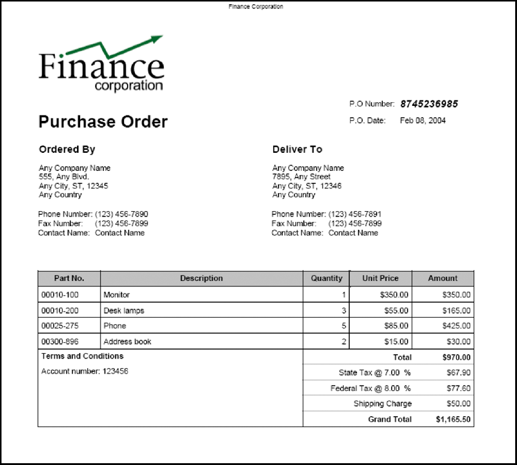

# Precompilazione di Forms con layout fluibili {#prepopulating-forms-with-flowable-layouts1}

## Precompilazione di Forms con layout fluibili {#prepopulating-forms-with-flowable-layouts2}

La precompilazione dei moduli consente di visualizzare i dati agli utenti all’interno di un modulo di cui è stato eseguito il rendering. Ad esempio, supponiamo che un utente acceda a un sito web con un nome utente e una password. Se l&#39;autenticazione ha esito positivo, l&#39;applicazione client esegue una query su un database per ottenere informazioni sull&#39;utente. I dati vengono uniti nel modulo, quindi il modulo viene sottoposto a rendering per l’utente. L’utente può quindi visualizzare dati personalizzati all’interno del modulo.

La precompilazione di un modulo presenta i seguenti vantaggi:

* Consente all&#39;utente di visualizzare dati personalizzati in un modulo.
* Riduce la quantità di digitazioni che l’utente compila per compilare un modulo.
* Garantisce l’integrità dei dati controllando dove vengono inseriti i dati.

Un modulo può essere precompilato dalle due origini dati XML seguenti:

* Un’origine dati XDP, XML conforme alla sintassi XFA (o dati XFDF per precompilare un modulo creato utilizzando Acrobat).
* Origine dati XML arbitraria contenente coppie nome/valore corrispondenti ai nomi dei campi del modulo (gli esempi in questa sezione utilizzano un&#39;origine dati XML arbitraria).

È necessario che esista un elemento XML per ogni campo modulo che si desidera precompilare. Il nome dell&#39;elemento XML deve corrispondere al nome del campo. Un elemento XML viene ignorato se non corrisponde a un campo modulo o se il nome dell&#39;elemento XML non corrisponde al nome del campo. Non è necessario che corrispondano all&#39;ordine di visualizzazione degli elementi XML, purché siano specificati tutti gli elementi XML.

Quando si precompila un modulo che contiene già dati, è necessario specificare i dati già visualizzati nell&#39;origine dati XML. Si supponga che un modulo contenente 10 campi contenga dati in quattro campi. Quindi, si supponga di voler precompilare i sei campi rimanenti. In questa situazione è necessario specificare 10 elementi XML nell&#39;origine dati XML utilizzata per precompilare il modulo. Se specifichi solo sei elementi, i quattro campi originali sono vuoti.

Ad esempio, puoi precompilare un modulo come il modulo di conferma di esempio. (Consulta &quot;Modulo di conferma&quot; in [Rendering dei PDF forms interattivi](/help/forms/developing/rendering-interactive-pdf-forms.md).)

Per precompilare il modulo di conferma di esempio, è necessario creare un&#39;origine dati XML contenente tre elementi XML corrispondenti ai tre campi del modulo. Questo modulo contiene i tre campi seguenti: `FirstName`, `LastName`, e `Amount`. Il primo passaggio consiste nel creare un&#39;origine dati XML contenente elementi XML corrispondenti ai campi della struttura del modulo. Il passaggio successivo consiste nell&#39;assegnare valori di dati agli elementi XML, come illustrato nel codice XML riportato di seguito.

```xml
     <Untitled>
         <FirstName>Jerry</FirstName>
         <LastName>Johnson</LastName>
         <Amount>250000</Amount>
     </Untitled>
```

Dopo aver precompilato il modulo di conferma con questa origine dati XML e aver eseguito il rendering del modulo, vengono visualizzati i valori dei dati assegnati agli elementi XML, come illustrato nel diagramma seguente.


### Precompilazione dei moduli con layout scorrevoli {#prepopulating_forms_with_flowable_layouts-1}

I Forms con layout scorrevoli sono utili per mostrare agli utenti una quantità indeterminata di dati. Poiché il layout del modulo viene regolato automaticamente in base alla quantità di dati uniti, non è necessario predeterminare un layout fisso o un numero di pagine per il modulo, come invece è necessario fare con un modulo con un layout fisso.

Un modulo viene generalmente compilato con i dati ottenuti durante la fase di esecuzione. È quindi possibile precompilare un modulo creando un&#39;origine dati XML in memoria e inserendo i dati direttamente nell&#39;origine dati XML in memoria.

Considera un’applicazione basata su web, ad esempio un negozio online. Al termine dell&#39;acquisto, tutti gli articoli acquistati vengono inseriti in un&#39;origine dati XML in memoria utilizzata per precompilare un modulo. Il diagramma seguente illustra questo processo, illustrato nella tabella che segue il diagramma.


Nella tabella seguente vengono descritti i passaggi del diagramma.

<table>
 <thead>
  <tr>
   <th><p>Passaggio</p></th>
   <th><p>Descrizione</p></th>
  </tr>
 </thead>
 <tbody>
  <tr>
   <td><p>1</p></td>
   <td><p>Un utente acquista articoli da un negozio online basato su Web. </p></td>
  </tr>
  <tr>
   <td><p>2</p></td>
   <td><p>Al termine dell'acquisto degli elementi e dopo aver fatto clic sul pulsante Invia, viene creata un'origine dati XML in memoria. Gli articoli acquistati e le informazioni utente vengono inseriti nell'origine dati XML in memoria. </p></td>
  </tr>
  <tr>
   <td><p>3</p></td>
   <td><p>L'origine dati XML viene utilizzata per precompilare un modulo dell'ordine di acquisto (un esempio di questo modulo è riportato in questa tabella). </p></td>
  </tr>
  <tr>
   <td><p>4</p></td>
   <td><p>Il modulo dell’ordine di acquisto viene inviato al browser web client. </p></td>
  </tr>
 </tbody>
</table>

Nel diagramma seguente viene illustrato un esempio di modulo ordine fornitore. Le informazioni contenute nella tabella possono essere modificate in base al numero di record nei dati XML.



>[!NOTE]
>
>È possibile precompilare un modulo con dati provenienti da altre origini, ad esempio un database aziendale o applicazioni esterne.

### Considerazioni sulla progettazione dei moduli {#form-design-considerations}

I Forms con layout scorrevoli si basano sulle progettazioni dei moduli create in Designer. La progettazione di un modulo specifica un set di regole di layout, presentazione e acquisizione dati, inclusi i valori di calcolo basati su input dell&#39;utente. Le regole vengono applicate quando i dati vengono immessi in un modulo. I campi aggiunti a un modulo sono sottomaschere incluse nella struttura del modulo. Ad esempio, nel modulo ordine fornitore visualizzato nel diagramma precedente, ogni linea è una sottomaschera. Per informazioni sulla creazione di una struttura di modulo contenente sottomaschere, vedere [Creazione di un modulo ordine fornitore con un layout scorrevole](https://www.adobe.com/go/learn_aemforms_qs_poformflowable_9).

### Informazioni sui sottogruppi di dati {#understanding-data-subgroups}

Un&#39;origine dati XML viene utilizzata per precompilare i moduli con layout fissi e con layout scorrevoli. Tuttavia, la differenza consiste nel fatto che un&#39;origine dati XML che precompila un modulo con un layout scorrevole contiene elementi XML ripetuti utilizzati per precompilare sottomaschere ripetute all&#39;interno del modulo. Questi elementi XML ripetuti sono denominati sottogruppi di dati.

Un&#39;origine dati XML utilizzata per precompilare il modulo dell&#39;ordine di acquisto mostrato nel diagramma precedente contiene quattro sottogruppi di dati ripetuti. Ogni sottogruppo di dati corrisponde a un articolo acquistato. Gli articoli acquistati sono un monitor, una lampada da tavolo, un telefono e una rubrica.

Per precompilare il modulo dell&#39;ordine fornitore viene utilizzata la seguente origine dati XML.

```xml
     <header>
         <!-- XML elements used to prepopulate non-repeating fields such as address
         <!and city
         <txtPONum>8745236985</txtPONum>
         <dtmDate>2004-02-08</dtmDate>
         <txtOrderedByCompanyName>Any Company Name</txtOrderedByCompanyName>
         <txtOrderedByAddress>555, Any Blvd.</txtOrderedByAddress>
         <txtOrderedByCity>Any City</txtOrderedByCity>
         <txtOrderedByStateProv>ST</txtOrderedByStateProv>
         <txtOrderedByZipCode>12345</txtOrderedByZipCode>
         <txtOrderedByCountry>Any Country</txtOrderedByCountry>
         <txtOrderedByPhone>(123) 456-7890</txtOrderedByPhone>
         <txtOrderedByFax>(123) 456-7899</txtOrderedByFax>
         <txtOrderedByContactName>Contact Name</txtOrderedByContactName>
         <txtDeliverToCompanyName>Any Company Name</txtDeliverToCompanyName>
         <txtDeliverToAddress>7895, Any Street</txtDeliverToAddress>
         <txtDeliverToCity>Any City</txtDeliverToCity>
         <txtDeliverToStateProv>ST</txtDeliverToStateProv>
         <txtDeliverToZipCode>12346</txtDeliverToZipCode>
         <txtDeliverToCountry>Any Country</txtDeliverToCountry>
         <txtDeliverToPhone>(123) 456-7891</txtDeliverToPhone>
         <txtDeliverToFax>(123) 456-7899</txtDeliverToFax>
         <txtDeliverToContactName>Contact Name</txtDeliverToContactName>
     </header>
     <detail>
         <!-- A data subgroup that contains information about the monitor>
         <txtPartNum>00010-100</txtPartNum>
         <txtDescription>Monitor</txtDescription>
         <numQty>1</numQty>
         <numUnitPrice>350.00</numUnitPrice>
     </detail>
     <detail>
         <!-- A data subgroup that contains information about the desk lamp>
         <txtPartNum>00010-200</txtPartNum>
         <txtDescription>Desk lamps</txtDescription>
         <numQty>3</numQty>
         <numUnitPrice>55.00</numUnitPrice>
     </detail>
     <detail>
         <!-- A data subgroup that contains information about the Phone>
             <txtPartNum>00025-275</txtPartNum>
             <txtDescription>Phone</txtDescription>
             <numQty>5</numQty>
             <numUnitPrice>85.00</numUnitPrice>
     </detail>
     <detail>
         <!-- A data subgroup that contains information about the address book>
         <txtPartNum>00300-896</txtPartNum>
         <txtDescription>Address book</txtDescription>
         <numQty>2</numQty>
         <numUnitPrice>15.00</numUnitPrice>
     </detail>
```

Si noti che ogni sottogruppo di dati contiene quattro elementi XML corrispondenti a queste informazioni:

* Numero parte articoli
* Descrizione elementi
* Quantità di articoli
* Prezzo unitario

Il nome dell&#39;elemento XML padre di un sottogruppo di dati deve corrispondere al nome del sottomodulo incluso nella struttura del modulo. Ad esempio, nel diagramma precedente, il nome dell’elemento XML padre del sottogruppo di dati è `detail`. Corrisponde al nome della sottomaschera presente nella struttura della maschera su cui si basa la maschera dell&#39;ordine fornitore. Se il nome dell’elemento XML padre del sottogruppo di dati e il sottomodulo non corrispondono, un modulo lato server non viene precompilato.

Ogni sottogruppo di dati deve contenere elementi XML corrispondenti ai nomi dei campi nel sottomodulo. Il `detail` la sottomaschera nella struttura del modulo contiene i campi riportati di seguito.

* txtPartNum
* txtDescription
* numQtà
* numUnitPrice

>[!NOTE]
>
>Se si tenta di precompilare un modulo con un&#39;origine dati contenente elementi XML ripetuti e si imposta `RenderAtClient` opzione per `No`, nel modulo viene unito solo il primo record di dati. Per garantire che tutti i record di dati vengano uniti nel modulo, impostare `RenderAtClient` a `Yes`. Per informazioni su `RenderAtClient` , vedere [Rendering di Forms nel client](/help/forms/developing/rendering-forms-client.md).

>[!NOTE]
>
>Per ulteriori informazioni sul servizio Forms, consulta [Guida di riferimento dei servizi per AEM Forms](https://www.adobe.com/go/learn_aemforms_services_63).

### Riepilogo dei passaggi {#summary-of-steps}

Per precompilare un modulo con un layout scorrevole, effettuare le seguenti operazioni:

1. Includi file di progetto.
1. Creare un&#39;origine dati XML in memoria.
1. Convertire l&#39;origine dati XML.
1. Eseguire il rendering di un modulo precompilato.

**Includi file di progetto**

Includi i file necessari nel progetto di sviluppo. Se stai creando un’applicazione client utilizzando Java, includi i file JAR necessari. Se utilizzi i servizi web, accertati di includere i file proxy.

**Includi file di progetto**

Includi i file necessari nel progetto di sviluppo. Se stai creando un’applicazione client utilizzando Java, includi i file JAR necessari. Se utilizzi i servizi web, accertati di includere i file proxy.

**Creare un&#39;origine dati XML in memoria**

È possibile utilizzare `org.w3c.dom` classi per creare un&#39;origine dati XML in memoria per precompilare un modulo con un layout scorrevole. È necessario inserire i dati in un&#39;origine dati XML conforme al modulo. Per informazioni sulla relazione tra un modulo con un layout scorrevole e l&#39;origine dati XML, vedere [Informazioni sui sottogruppi di dati](#understanding-data-subgroups).

**Convertire l&#39;origine dati XML**

Origine dati XML in memoria creata mediante `org.w3c.dom` le classi possono essere convertite in `com.adobe.idp.Document` oggetto prima che possa essere utilizzato per precompilare un modulo. Un&#39;origine dati XML in memoria può essere convertita utilizzando le classi di trasformazione XML Java.

>[!NOTE]
>
>Se si utilizza il file WSDL del servizio Forms per precompilare un modulo, è necessario convertire `org.w3c.dom.Document` oggetto in un `BLOB` oggetto.

**Rendering di un modulo precompilato**

Si esegue il rendering di un modulo precompilato come di un altro modulo. L&#39;unica differenza è che si utilizza `com.adobe.idp.Document` oggetto contenente l&#39;origine dati XML per precompilare il modulo.

**Consulta anche**

[Inclusione dei file della libreria Java di AEM Forms](/help/forms/developing/invoking-aem-forms-using-java.md#including-aem-forms-java-library-files)

[Impostazione delle proprietà di connessione](/help/forms/developing/invoking-aem-forms-using-java.md#setting-connection-properties)

[Guida introduttiva all’API di servizio Forms](/help/forms/developing/forms-service-api-quick-starts.md#forms-service-api-quick-starts)

[Rendering dei PDF forms interattivi](/help/forms/developing/rendering-interactive-pdf-forms.md)

[Creazione di applicazioni Web per il rendering di Forms](/help/forms/developing/creating-web-applications-renders-forms.md)

### Precompilazione dei moduli tramite API Java {#prepopulating-forms-using-the-java-api}

Per precompilare un modulo con un layout scorrevole utilizzando l’API Forms (Java), effettua le seguenti operazioni:

1. Includi file di progetto

   Includi i file JAR client, ad esempio adobe-forms-client.jar, nel percorso di classe del progetto Java. Per informazioni sulla posizione di questi file, vedere [Inclusione dei file della libreria Java di AEM Forms](/help/forms/developing/invoking-aem-forms-using-java.md#including-aem-forms-java-library-files).

1. Creare un&#39;origine dati XML in memoria

   * Creare un Java `DocumentBuilderFactory` oggetto chiamando il `DocumentBuilderFactory` classe&quot; `newInstance` metodo.
   * Creare un Java `DocumentBuilder` oggetto chiamando il `DocumentBuilderFactory` dell&#39;oggetto `newDocumentBuilder` metodo.
   * Chiama il `DocumentBuilder` dell&#39;oggetto `newDocument` metodo per creare un&#39;istanza di `org.w3c.dom.Document` oggetto.
   * Creare l&#39;elemento principale dell&#39;origine dati XML richiamando `org.w3c.dom.Document` dell&#39;oggetto `createElement` metodo. Questo crea un `Element` oggetto che rappresenta l&#39;elemento principale. Passa un valore stringa che rappresenta il nome dell’elemento al `createElement` metodo. Invia il valore restituito a `Element`. Quindi, aggiungi l’elemento principale al documento chiamando il `Document` dell&#39;oggetto `appendChild` e passare l&#39;oggetto elemento radice come argomento. Le seguenti righe di codice mostrano questa logica dell’applicazione:

     ` Element root = (Element)document.createElement("transaction");  document.appendChild(root);`

   * Creare l’elemento header dell’origine dati XML chiamando `Document` dell&#39;oggetto `createElement` metodo. Passa un valore stringa che rappresenta il nome dell’elemento al `createElement` metodo. Invia il valore restituito a `Element`. Quindi, aggiungi l’elemento header all’elemento root chiamando il `root` dell&#39;oggetto `appendChild` e passare l&#39;oggetto elemento intestazione come argomento. Gli elementi XML accodati all&#39;elemento header corrispondono alla parte statica del modulo. Le seguenti righe di codice mostrano questa logica dell’applicazione:

     ` Element header = (Element)document.createElement("header");  root.appendChild(header);`

   * Creare un elemento figlio appartenente all’elemento intestazione chiamando il `Document` dell&#39;oggetto `createElement` e passa un valore stringa che rappresenta il nome dell’elemento. Invia il valore restituito a `Element`. Quindi, imposta un valore per l’elemento figlio chiamando il relativo `appendChild` e trasmettere il `Document` dell&#39;oggetto `createTextNode` come argomento. Specifica un valore stringa che viene visualizzato come valore dell’elemento figlio. Infine, aggiungi l’elemento figlio all’elemento intestazione chiamando l’elemento dell’intestazione `appendChild` e passare l&#39;oggetto elemento figlio come argomento. Le seguenti righe di codice mostrano questa logica dell’applicazione:

     ` Element poNum= (Element)document.createElement("txtPONum");  poNum.appendChild(document.createTextNode("8745236985"));  header.appendChild(LastName);`


   * Aggiungere tutti gli elementi rimanenti all&#39;elemento header ripetendo l&#39;ultimo passaggio secondario per ogni campo visualizzato nella parte statica del modulo (nel diagramma dell&#39;origine dati XML questi campi sono illustrati nella sezione A). [Informazioni sui sottogruppi di dati](#understanding-data-subgroups).)
   * Creare l’elemento dettaglio dell’origine dati XML chiamando `Document` dell&#39;oggetto `createElement` metodo. Passa un valore stringa che rappresenta il nome dell’elemento al `createElement` metodo. Invia il valore restituito a `Element`. Quindi, aggiungi l’elemento di dettaglio all’elemento principale chiamando il `root` dell&#39;oggetto `appendChild` e passare l&#39;oggetto elemento dettaglio come argomento. Gli elementi XML accodati all&#39;elemento dettaglio corrispondono alla parte dinamica del modulo. Le seguenti righe di codice mostrano questa logica dell’applicazione:

     ` Element detail = (Element)document.createElement("detail");  root.appendChild(detail);`

   * Creare un elemento figlio che appartiene all&#39;elemento dettaglio chiamando `Document` dell&#39;oggetto `createElement` e passa un valore stringa che rappresenta il nome dell’elemento. Invia il valore restituito a `Element`. Quindi, imposta un valore per l’elemento figlio chiamando il relativo `appendChild` e trasmettere il `Document` dell&#39;oggetto `createTextNode` come argomento. Specifica un valore stringa che viene visualizzato come valore dell’elemento figlio. Infine, aggiungi l’elemento figlio all’elemento dettaglio chiamando l’elemento di dettaglio `appendChild` e passare l&#39;oggetto elemento figlio come argomento. Le seguenti righe di codice mostrano questa logica dell’applicazione:

     ` Element txtPartNum = (Element)document.createElement("txtPartNum");  txtPartNum.appendChild(document.createTextNode("00010-100"));  detail.appendChild(txtPartNum);`

   * Ripetere l&#39;ultimo passaggio secondario per tutti gli elementi XML da aggiungere all&#39;elemento dettaglio. Per creare correttamente l&#39;origine dati XML utilizzata per compilare il modulo dell&#39;ordine di acquisto, è necessario aggiungere i seguenti elementi XML all&#39;elemento dettaglio: `txtDescription`, `numQty`, e `numUnitPrice`.
   * Ripeti gli ultimi due passaggi secondari per tutti gli elementi di dati utilizzati per precompilare il modulo.

1. Convertire l&#39;origine dati XML

   * Creare un `javax.xml.transform.Transformer` oggetto richiamando il `javax.xml.transform.Transformer` statico dell&#39;oggetto `newInstance` metodo.
   * Creare un `Transformer` oggetto richiamando il `TransformerFactory` dell&#39;oggetto `newTransformer` metodo.
   * Creare un `ByteArrayOutputStream` mediante il costruttore.
   * Creare un `javax.xml.transform.dom.DOMSource` mediante il costruttore e passando il `org.w3c.dom.Document` oggetto creato nel passaggio 1.
   * Creare un `javax.xml.transform.dom.DOMSource` mediante il costruttore e passando il `ByteArrayOutputStream` oggetto.
   * Popolare Java `ByteArrayOutputStream` oggetto richiamando il `javax.xml.transform.Transformer` dell&#39;oggetto `transform` e passando il `javax.xml.transform.dom.DOMSource` e `javax.xml.transform.stream.StreamResult` oggetti.
   * Creare una matrice di byte e allocare le dimensioni della `ByteArrayOutputStream` alla matrice di byte.
   * Popolare la matrice di byte richiamando `ByteArrayOutputStream` dell&#39;oggetto `toByteArray` metodo.
   * Creare un `com.adobe.idp.Document` mediante il costruttore e passando la matrice di byte.

1. Rendering di un modulo precompilato

   Richiama `FormsServiceClient` dell&#39;oggetto `renderPDFForm` e trasmettere i seguenti valori:

   * Valore stringa che specifica il nome della struttura del modulo, inclusa l&#39;estensione del nome file.
   * A `com.adobe.idp.Document` oggetto contenente dati da unire con il modulo. Assicurati di utilizzare `com.adobe.idp.Document` oggetto creato nei passaggi uno e due.
   * A `PDFFormRenderSpec` oggetto che memorizza le opzioni di runtime.
   * A `URLSpec` oggetto contenente valori URI richiesti dal servizio Forms.
   * A `java.util.HashMap` oggetto che memorizza gli allegati. Questo è un parametro facoltativo e puoi specificare `null` se non si desidera allegare file al modulo.

   Il `renderPDFForm` il metodo restituisce un `FormsResult` oggetto contenente un flusso di dati modulo che deve essere scritto nel browser web client.

   * Creare un `javax.servlet.ServletOutputStream` oggetto utilizzato per inviare un flusso di dati modulo al browser web client.
   * Creare un `com.adobe.idp.Document` oggetto richiamando il `FormsResult` oggetto &quot;s `getOutputContent` metodo.
   * Creare un `java.io.InputStream` oggetto richiamando il `com.adobe.idp.Document` dell&#39;oggetto `getInputStream` metodo.
   * Creare una matrice di byte compilarla con il flusso di dati del modulo richiamando `InputStream` dell&#39;oggetto `read` e passando la matrice di byte come argomento.
   * Richiama `javax.servlet.ServletOutputStream` dell&#39;oggetto `write` metodo per inviare il flusso di dati del modulo al browser web client. Passare la matrice di byte al `write` metodo.

**Consulta anche**

[Quick Start (modalità SOAP): precompilazione di Forms con layout accessibili tramite l’API Java](/help/forms/developing/forms-service-api-quick-starts.md#quick-start-soap-mode-prepopulating-forms-with-flowable-layouts-using-the-java-api)

[Inclusione dei file della libreria Java di AEM Forms](/help/forms/developing/invoking-aem-forms-using-java.md#including-aem-forms-java-library-files)

[Impostazione delle proprietà di connessione](/help/forms/developing/invoking-aem-forms-using-java.md#setting-connection-properties)

### Precompilazione dei moduli tramite l’API del servizio web {#prepopulating-forms-using-the-web-service-api}

Per precompilare un modulo con un layout scorrevole utilizzando l’API di Forms (servizio web), effettua le seguenti operazioni:

1. Includi file di progetto

   * Creare classi proxy Java che utilizzano il servizio Forms WSDL. (vedere [Creazione di classi proxy Java tramite l’asse Apache](/help/forms/developing/invoking-aem-forms-using-web.md#creating-java-proxy-classes-using-apache-axis).)
   * Includi le classi proxy Java nel percorso della classe.

1. Creare un&#39;origine dati XML in memoria

   * Creare un Java `DocumentBuilderFactory` oggetto chiamando il `DocumentBuilderFactory` classe&quot; `newInstance` metodo.
   * Creare un Java `DocumentBuilder` oggetto chiamando il `DocumentBuilderFactory` dell&#39;oggetto `newDocumentBuilder` metodo.
   * Chiama il `DocumentBuilder` dell&#39;oggetto `newDocument` metodo per creare un&#39;istanza di `org.w3c.dom.Document` oggetto.
   * Creare l&#39;elemento principale dell&#39;origine dati XML richiamando `org.w3c.dom.Document` dell&#39;oggetto `createElement` metodo. Questo crea un `Element` oggetto che rappresenta l&#39;elemento principale. Passa un valore stringa che rappresenta il nome dell’elemento al `createElement` metodo. Invia il valore restituito a `Element`. Quindi, aggiungi l’elemento principale al documento chiamando il `Document` dell&#39;oggetto `appendChild` e passare l&#39;oggetto elemento radice come argomento. Le seguenti righe di codice mostrano questa logica dell’applicazione:

     ` Element root = (Element)document.createElement("transaction");  document.appendChild(root);`

   * Creare l’elemento header dell’origine dati XML chiamando `Document` dell&#39;oggetto `createElement` metodo. Passa un valore stringa che rappresenta il nome dell’elemento al `createElement` metodo. Invia il valore restituito a `Element`. Quindi, aggiungi l’elemento header all’elemento root chiamando il `root` dell&#39;oggetto `appendChild` e passare l&#39;oggetto elemento intestazione come argomento. Gli elementi XML accodati all&#39;elemento header corrispondono alla parte statica del modulo. Le seguenti righe di codice mostrano questa logica dell’applicazione:

     ` Element header = (Element)document.createElement("header");  root.appendChild(header);`

   * Creare un elemento figlio appartenente all’elemento intestazione chiamando il `Document` dell&#39;oggetto `createElement` e passa un valore stringa che rappresenta il nome dell’elemento. Invia il valore restituito a `Element`. Quindi, imposta un valore per l’elemento figlio chiamando il relativo `appendChild` e trasmettere il `Document` dell&#39;oggetto `createTextNode` come argomento. Specifica un valore stringa che viene visualizzato come valore dell’elemento figlio. Infine, aggiungi l’elemento figlio all’elemento intestazione chiamando l’elemento dell’intestazione `appendChild` e passare l&#39;oggetto elemento figlio come argomento. Le seguenti righe di codice mostrano questa logica dell’applicazione:

     ` Element poNum= (Element)document.createElement("txtPONum");  poNum.appendChild(document.createTextNode("8745236985"));  header.appendChild(LastName);`

   * Aggiungere tutti gli elementi rimanenti all&#39;elemento header ripetendo l&#39;ultimo passaggio secondario per ogni campo visualizzato nella parte statica del modulo (nel diagramma dell&#39;origine dati XML questi campi sono illustrati nella sezione A). [Informazioni sui sottogruppi di dati](#understanding-data-subgroups).)
   * Creare l’elemento dettaglio dell’origine dati XML chiamando `Document` dell&#39;oggetto `createElement` metodo. Passa un valore stringa che rappresenta il nome dell’elemento al `createElement` metodo. Invia il valore restituito a `Element`. Quindi, aggiungi l’elemento di dettaglio all’elemento principale chiamando il `root` dell&#39;oggetto `appendChild` e passare l&#39;oggetto elemento dettaglio come argomento. Gli elementi XML accodati all&#39;elemento dettaglio corrispondono alla parte dinamica del modulo. Le seguenti righe di codice mostrano questa logica dell’applicazione:

     ` Element detail = (Element)document.createElement("detail");  root.appendChild(detail);`

   * Creare un elemento figlio che appartiene all&#39;elemento dettaglio chiamando `Document` dell&#39;oggetto `createElement` e passa un valore stringa che rappresenta il nome dell’elemento. Invia il valore restituito a `Element`. Quindi, imposta un valore per l’elemento figlio chiamando il relativo `appendChild` e trasmettere il `Document` dell&#39;oggetto `createTextNode` come argomento. Specifica un valore stringa che viene visualizzato come valore dell’elemento figlio. Infine, aggiungi l’elemento figlio all’elemento dettaglio chiamando l’elemento di dettaglio `appendChild` e passare l&#39;oggetto elemento figlio come argomento. Le seguenti righe di codice mostrano questa logica dell’applicazione:

     ` Element txtPartNum = (Element)document.createElement("txtPartNum");  txtPartNum.appendChild(document.createTextNode("00010-100"));  detail.appendChild(txtPartNum);`

   * Ripetere l&#39;ultimo passaggio secondario per tutti gli elementi XML da aggiungere all&#39;elemento dettaglio. Per creare correttamente l&#39;origine dati XML utilizzata per compilare il modulo dell&#39;ordine di acquisto, è necessario aggiungere i seguenti elementi XML all&#39;elemento dettaglio: `txtDescription`, `numQty`, e `numUnitPrice`.
   * Ripeti gli ultimi due passaggi secondari per tutti gli elementi di dati utilizzati per precompilare il modulo.

1. Convertire l&#39;origine dati XML

   * Creare un `javax.xml.transform.Transformer` oggetto richiamando il `javax.xml.transform.Transformer` statico dell&#39;oggetto `newInstance` metodo.
   * Creare un `Transformer` oggetto richiamando il `TransformerFactory` dell&#39;oggetto `newTransformer` metodo.
   * Creare un `ByteArrayOutputStream` mediante il costruttore.
   * Creare un `javax.xml.transform.dom.DOMSource` mediante il costruttore e passando il `org.w3c.dom.Document` oggetto creato nel passaggio 1.
   * Creare un `javax.xml.transform.dom.DOMSource` mediante il costruttore e passando il `ByteArrayOutputStream` oggetto.
   * Popolare Java `ByteArrayOutputStream` oggetto richiamando il `javax.xml.transform.Transformer` dell&#39;oggetto `transform` e passando il `javax.xml.transform.dom.DOMSource` e `javax.xml.transform.stream.StreamResult` oggetti.
   * Creare una matrice di byte e allocare le dimensioni della `ByteArrayOutputStream` alla matrice di byte.
   * Popolare la matrice di byte richiamando `ByteArrayOutputStream` dell&#39;oggetto `toByteArray` metodo.
   * Creare un `BLOB` oggetto utilizzando il relativo costruttore e richiamando il relativo `setBinaryData` e passare la matrice di byte.

1. Rendering di un modulo precompilato

   Richiama `FormsService` dell&#39;oggetto `renderPDFForm` e trasmettere i seguenti valori:

   * Valore stringa che specifica il nome della struttura del modulo, inclusa l&#39;estensione del nome file.
   * A `BLOB` oggetto contenente dati da unire con il modulo. Assicurati di utilizzare `BLOB` oggetto creato nei passaggi uno e due.
   * A `PDFFormRenderSpecc` oggetto che memorizza le opzioni di runtime. Per ulteriori informazioni, consulta [Riferimento API di AEM Forms](https://www.adobe.com/go/learn_aemforms_javadocs_63_en).
   * A `URLSpec` oggetto contenente valori URI richiesti dal servizio Forms.
   * A `java.util.HashMap` oggetto che memorizza gli allegati. Questo è un parametro facoltativo e puoi specificare `null` se non si desidera allegare file al modulo.
   * Un campo vuoto `com.adobe.idp.services.holders.BLOBHolder` oggetto popolato dal metodo. Viene utilizzato per memorizzare il modulo PDF di cui è stato eseguito il rendering.
   * Un campo vuoto `javax.xml.rpc.holders.LongHolder` oggetto popolato dal metodo. Questo argomento consente di memorizzare il numero di pagine nel modulo.
   * Un campo vuoto `javax.xml.rpc.holders.StringHolder` oggetto popolato dal metodo. Questo argomento consente di memorizzare il valore delle impostazioni locali.
   * Un campo vuoto `com.adobe.idp.services.holders.FormsResultHolder` oggetto che conterrà i risultati dell&#39;operazione.

   Il `renderPDFForm` il metodo compila `com.adobe.idp.services.holders.FormsResultHolder` oggetto passato come ultimo valore di argomento con un flusso di dati del modulo che deve essere scritto nel browser web client.

   * Creare un `FormResult` dell&#39;oggetto ottenendo il valore del `com.adobe.idp.services.holders.FormsResultHolder` dell&#39;oggetto `value` membro dati.
   * Creare un `BLOB` oggetto che contiene i dati del modulo richiamando `FormsResult` dell&#39;oggetto `getOutputContent` metodo.
   * Ottieni il tipo di contenuto del `BLOB` oggetto richiamando il relativo `getContentType` metodo.
   * Imposta il `javax.servlet.http.HttpServletResponse` tipo di contenuto dell&#39;oggetto richiamando il relativo `setContentType` e passando il tipo di contenuto del `BLOB` oggetto.
   * Creare un `javax.servlet.ServletOutputStream` oggetto utilizzato per scrivere il flusso di dati del modulo nel browser web client richiamando `javax.servlet.http.HttpServletResponse` dell&#39;oggetto `getOutputStream` metodo.
   * Creare una matrice di byte e popolarla richiamando il `BLOB` dell&#39;oggetto `getBinaryData` metodo. Questa attività assegna il contenuto del `FormsResult` alla matrice di byte.
   * Richiama `javax.servlet.http.HttpServletResponse` dell&#39;oggetto `write` metodo per inviare il flusso di dati del modulo al browser web client. Passare la matrice di byte al `write` metodo.

   >[!NOTE]
   >
   >Il `renderPDFForm` il metodo compila `com.adobe.idp.services.holders.FormsResultHolder` oggetto passato come ultimo valore di argomento con un flusso di dati del modulo che deve essere scritto nel browser web client.

**Consulta anche**

[Richiamare AEM Forms utilizzando la codifica Base64](/help/forms/developing/invoking-aem-forms-using-web.md#invoking-aem-forms-using-base64-encoding)
