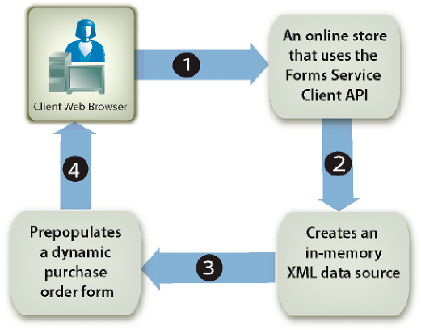

# Precompilazione dei moduli con layout scorrevoli {#prepopulating-forms-with-flowable-layouts1}

## Precompilazione dei moduli con layout scorrevoli {#prepopulating-forms-with-flowable-layouts2}

La precompilazione dei moduli consente di visualizzare i dati agli utenti all&#39;interno di un modulo di cui è stato effettuato il rendering. Ad esempio, supponiamo che un utente acceda a un sito Web con un nome utente e una password. Se l&#39;autenticazione ha esito positivo, l&#39;applicazione client esegue una query a un database per ottenere informazioni sugli utenti. I dati vengono uniti nel modulo, quindi viene eseguito il rendering del modulo per l&#39;utente. Di conseguenza, l&#39;utente può visualizzare dati personalizzati all&#39;interno del modulo.

La precompilazione di un modulo presenta i seguenti vantaggi:

* Consente all&#39;utente di visualizzare i dati personalizzati in un modulo.
* Riduce la quantità di testo digitato dall&#39;utente per compilare il modulo.
* Assicura l&#39;integrità dei dati controllando dove questi vengono inseriti.

È possibile precompilare un modulo con le due origini dati XML seguenti:

* Un&#39;origine dati XDP, XML conforme alla sintassi XFA (o dati XFDF per precompilare un modulo creato con Acrobat).
* Un&#39;origine dati XML arbitraria che contiene coppie nome/valore corrispondenti ai nomi dei campi del modulo (gli esempi in questa sezione utilizzano un&#39;origine dati XML arbitraria).

Per ogni campo del modulo che si desidera precompilare è necessario che esista un elemento XML. Il nome dell&#39;elemento XML deve corrispondere al nome del campo. Un elemento XML viene ignorato se non corrisponde a un campo modulo o se il nome dell&#39;elemento XML non corrisponde al nome del campo. Non è necessario stabilire una corrispondenza con l&#39;ordine in cui vengono visualizzati gli elementi XML, purché siano specificati tutti gli elementi XML.

Quando si precompila un modulo che contiene già dei dati, è necessario specificare i dati già visualizzati nell&#39;origine dati XML. Si supponga che un modulo contenente 10 campi contenga dati in quattro campi. Quindi, si supponga di voler precompilare i sei campi rimanenti. In questa situazione, è necessario specificare 10 elementi XML nell&#39;origine dati XML utilizzata per precompilare il modulo. Se specificate solo sei elementi, i quattro campi originali sono vuoti.

Ad esempio, è possibile precompilare un modulo, ad esempio il modulo di conferma di esempio. Consultate &quot;Modulo di conferma&quot; in [Rendering di PDF forms](/help/forms/developing/rendering-interactive-pdf-forms.md)interattivi.

Per precompilare il modulo di conferma di esempio, è necessario creare un&#39;origine dati XML contenente tre elementi XML che corrispondono ai tre campi del modulo. Questo modulo contiene i tre campi seguenti: `FirstName`, `LastName`e `Amount`. Il primo passaggio consiste nel creare un&#39;origine dati XML contenente elementi XML che corrispondono ai campi situati nella struttura del modulo. Il passaggio successivo consiste nell&#39;assegnare valori di dati agli elementi XML, come illustrato nel seguente codice XML.

```xml
     <Untitled>
         <FirstName>Jerry</FirstName>
         <LastName>Johnson</LastName>
         <Amount>250000</Amount>
     </Untitled>
```

Dopo aver precompilato il modulo di conferma con questa origine dati XML ed eseguito il rendering del modulo, vengono visualizzati i valori dei dati assegnati agli elementi XML, come illustrato nel diagramma seguente.


### Precompilazione dei moduli con layout scorrevoli {#prepopulating_forms_with_flowable_layouts-1}

I moduli con layout scorrevole sono utili per visualizzare agli utenti una quantità indeterminata di dati. Poiché il layout del modulo si adatta automaticamente alla quantità di dati che vengono uniti, non è necessario predeterminare un layout fisso o un numero di pagine per il modulo, come è necessario fare con un modulo con layout fisso.

Un modulo viene in genere compilato con i dati ottenuti durante l&#39;esecuzione. Di conseguenza, è possibile precompilare un modulo creando un&#39;origine dati XML in memoria e inserendo i dati direttamente nell&#39;origine dati XML in memoria.

Considerate un&#39;applicazione basata sul Web, ad esempio uno store online. Al termine dell&#39;acquisto di un acquirente online, tutti gli elementi acquistati vengono inseriti in un&#39;origine dati XML in memoria utilizzata per precompilare un modulo. Il diagramma seguente mostra questo processo, illustrato nella tabella che segue il diagramma.



La tabella seguente descrive i passaggi descritti in questo diagramma.

<table>
 <thead>
  <tr>
   <th><p>Incremento</p></th>
   <th><p>Descrizione</p></th>
  </tr>
 </thead>
 <tbody>
  <tr>
   <td><p>1</p></td>
   <td><p>Un utente acquista elementi da uno store online basato su Web. </p></td>
  </tr>
  <tr>
   <td><p>2</p></td>
   <td><p>Al termine dell'acquisto degli elementi e dopo aver fatto clic sul pulsante Invia, viene creata un'origine dati XML in memoria. Gli elementi acquistati e le informazioni utente vengono inseriti nell'origine dati XML in memoria. </p></td>
  </tr>
  <tr>
   <td><p>3</p></td>
   <td><p>L'origine dati XML viene utilizzata per precompilare un modulo di ordine di acquisto (un esempio di questo modulo è illustrato nella tabella seguente). </p></td>
  </tr>
  <tr>
   <td><p>4</p></td>
   <td><p>Il modulo di ordine di acquisto viene rappresentato nel browser Web del client. </p></td>
  </tr>
 </tbody>
</table>

Nel diagramma seguente è riportato un esempio di modulo di ordine di acquisto. Le informazioni contenute nella tabella possono adattarsi al numero di record presenti nei dati XML.


>[!NOTE]
>
>Un modulo può essere precompilato con dati provenienti da altre origini, ad esempio da un database aziendale o da applicazioni esterne.

### Considerazioni sulla struttura del modulo {#form-design-considerations}

I moduli con layout scorrevole si basano sulle strutture del modulo create in Designer. Una struttura del modulo specifica un insieme di regole di layout, presentazione e acquisizione dei dati, compreso il calcolo dei valori in base all&#39;input dell&#39;utente. Le regole vengono applicate quando i dati vengono immessi in un modulo. I campi aggiunti a un modulo sono sottomoduli che si trovano all&#39;interno della struttura del modulo. Ad esempio, nel modulo dell&#39;ordine di acquisto visualizzato nel diagramma precedente, ogni riga è un sottomodulo. Per informazioni sulla creazione di una struttura del modulo contenente sottomoduli, vedere [Creazione di un modulo di ordine di acquisto con layout](https://www.adobe.com/go/learn_aemforms_qs_poformflowable_9)scorrevole.

### Informazioni sui sottogruppi di dati {#understanding-data-subgroups}

Un&#39;origine dati XML viene utilizzata per precompilare i moduli con layout fissi e layout scorrevoli. Tuttavia, la differenza sta nel fatto che un&#39;origine dati XML che precompila un modulo con layout scorrevole contiene elementi XML ripetibili utilizzati per precompilare i sottomoduli che vengono ripetuti all&#39;interno del modulo. Questi elementi XML ripetuti sono denominati sottogruppi di dati.

Un&#39;origine dati XML utilizzata per precompilare il modulo di ordine di acquisto visualizzato nel diagramma precedente contiene quattro sottogruppi di dati ripetuti. Ciascun sottogruppo di dati corrisponde a un elemento acquistato. Gli articoli acquistati sono un monitor, una lampada da tavolo, un telefono e una rubrica.

La seguente origine dati XML viene utilizzata per precompilare il modulo di ordine di acquisto.

```xml
     <header>
         <!-- XML elements used to prepopulate non-repeating fields such as address
         <!and city
         <txtPONum>8745236985</txtPONum>
         <dtmDate>2004-02-08</dtmDate>
         <txtOrderedByCompanyName>Any Company Name</txtOrderedByCompanyName>
         <txtOrderedByAddress>555, Any Blvd.</txtOrderedByAddress>
         <txtOrderedByCity>Any City</txtOrderedByCity>
         <txtOrderedByStateProv>ST</txtOrderedByStateProv>
         <txtOrderedByZipCode>12345</txtOrderedByZipCode>
         <txtOrderedByCountry>Any Country</txtOrderedByCountry>
         <txtOrderedByPhone>(123) 456-7890</txtOrderedByPhone>
         <txtOrderedByFax>(123) 456-7899</txtOrderedByFax>
         <txtOrderedByContactName>Contact Name</txtOrderedByContactName>
         <txtDeliverToCompanyName>Any Company Name</txtDeliverToCompanyName>
         <txtDeliverToAddress>7895, Any Street</txtDeliverToAddress>
         <txtDeliverToCity>Any City</txtDeliverToCity>
         <txtDeliverToStateProv>ST</txtDeliverToStateProv>
         <txtDeliverToZipCode>12346</txtDeliverToZipCode>
         <txtDeliverToCountry>Any Country</txtDeliverToCountry>
         <txtDeliverToPhone>(123) 456-7891</txtDeliverToPhone>
         <txtDeliverToFax>(123) 456-7899</txtDeliverToFax>
         <txtDeliverToContactName>Contact Name</txtDeliverToContactName>
     </header>
     <detail>
         <!-- A data subgroup that contains information about the monitor>
         <txtPartNum>00010-100</txtPartNum>
         <txtDescription>Monitor</txtDescription>
         <numQty>1</numQty>
         <numUnitPrice>350.00</numUnitPrice>
     </detail>
     <detail>
         <!-- A data subgroup that contains information about the desk lamp>
         <txtPartNum>00010-200</txtPartNum>
         <txtDescription>Desk lamps</txtDescription>
         <numQty>3</numQty>
         <numUnitPrice>55.00</numUnitPrice>
     </detail>
     <detail>
         <!-- A data subgroup that contains information about the Phone>
             <txtPartNum>00025-275</txtPartNum>
             <txtDescription>Phone</txtDescription>
             <numQty>5</numQty>
             <numUnitPrice>85.00</numUnitPrice>
     </detail>
     <detail>
         <!-- A data subgroup that contains information about the address book>
         <txtPartNum>00300-896</txtPartNum>
         <txtDescription>Address book</txtDescription>
         <numQty>2</numQty>
         <numUnitPrice>15.00</numUnitPrice>
     </detail>
```

Tenere presente che ciascun sottogruppo di dati contiene quattro elementi XML che corrispondono alle seguenti informazioni:

* Numero parte articoli
* Descrizione elementi
* Quantità di articoli
* Prezzo unitario

Il nome dell&#39;elemento XML padre di un sottogruppo di dati deve corrispondere al nome del sottomodulo che si trova nella struttura del modulo. Ad esempio, nel diagramma precedente, si noti che il nome dell&#39;elemento XML principale del sottogruppo di dati è `detail`. Questo corrisponde al nome del sottomodulo che si trova nella struttura del modulo su cui si basa il modulo di ordine di acquisto. Se il nome dell&#39;elemento XML padre del sottogruppo di dati e il sottomodulo non corrispondono, il modulo lato server non viene precompilato.

Ciascun sottogruppo di dati deve contenere elementi XML che corrispondono ai nomi dei campi nel sottomodulo. Il `detail` sottomodulo che si trova nella struttura del modulo contiene i campi seguenti:

* txtPartNum
* txtDescription
* numQty
* numUnitPrice

>[!NOTE]
>
>Se si tenta di precompilare un modulo con un&#39;origine dati che contiene elementi XML ripetuti e si imposta l&#39; `RenderAtClient` opzione su `No`, nel modulo viene unito solo il primo record di dati. Per fare in modo che tutti i record di dati siano uniti nel modulo, impostare `RenderAtClient` su `Yes`. Per informazioni sull&#39; `RenderAtClient` opzione, vedere [Rendering dei moduli in Client](/help/forms/developing/rendering-forms-client.md).

>[!NOTE]
>
>Per ulteriori informazioni sul servizio Forms, vedere Riferimento [servizi per gli AEM Forms](https://www.adobe.com/go/learn_aemforms_services_63).

### Riepilogo dei passaggi {#summary-of-steps}

Per precompilare un modulo con un layout scorrevole, eseguire le operazioni seguenti:

1. Includere i file di progetto.
1. Creare un&#39;origine dati XML in memoria.
1. Convertire l&#39;origine dati XML.
1. Eseguire il rendering di un modulo precompilato.

**Includi file di progetto**

Includete i file necessari nel progetto di sviluppo. Se create un&#39;applicazione client utilizzando Java, includete i file JAR necessari. Se utilizzate i servizi Web, accertatevi di includere i file proxy.

**Includi file di progetto**

Includete i file necessari nel progetto di sviluppo. Se create un&#39;applicazione client utilizzando Java, includete i file JAR necessari. Se utilizzate i servizi Web, accertatevi di includere i file proxy.

**Creazione di un&#39;origine dati XML in memoria**

È possibile utilizzare `org.w3c.dom` le classi per creare un&#39;origine dati XML in memoria per precompilare un modulo con un layout scorrevole. È necessario inserire i dati in un&#39;origine dati XML conforme al modulo. Per informazioni sulla relazione tra un modulo con layout scorrevole e l&#39;origine dati XML, vedere [Informazioni sui sottogruppi](#understanding-data-subgroups)di dati.

**Conversione dell&#39;origine dati XML**

Un&#39;origine dati XML in memoria creata utilizzando `org.w3c.dom` le classi può essere convertita in un `com.adobe.idp.Document` oggetto prima di poter essere utilizzata per precompilare il modulo. Un&#39;origine dati XML in memoria può essere convertita utilizzando le classi di trasformazione Java XML.

>[!NOTE]
>
>Se si utilizza il WSDL del servizio Forms per precompilare un modulo, è necessario convertire un `org.w3c.dom.Document` oggetto in un `BLOB` oggetto.

**Eseguire il rendering di un modulo precompilato**

Il rendering di un modulo precompilato è simile a quello di un altro. L&#39;unica differenza consiste nell&#39;utilizzare l&#39; `com.adobe.idp.Document` oggetto che contiene l&#39;origine dati XML per precompilare il modulo.

**Consulta anche**

[Inclusione di file libreria Java AEM Forms](/help/forms/developing/invoking-aem-forms-using-java.md#including-aem-forms-java-library-files)

[Impostazione delle proprietà di connessione](/help/forms/developing/invoking-aem-forms-using-java.md#setting-connection-properties)

[Avvio rapido dell&#39;API di Forms Service](/help/forms/developing/forms-service-api-quick-starts.md#forms-service-api-quick-starts)

[Rendering di PDF forms interattivi](/help/forms/developing/rendering-interactive-pdf-forms.md)

[Creazione di applicazioni Web per il rendering di moduli](/help/forms/developing/creating-web-applications-renders-forms.md)

### Precompilazione dei moduli tramite l&#39;API Java {#prepopulating-forms-using-the-java-api}

Per precompilare un modulo con un layout scorrevole utilizzando l&#39;API di Forms (Java), effettuare le seguenti operazioni:

1. Includi file di progetto

   Includete file JAR client, ad esempio adobe-forms-client.jar, nel percorso di classe del progetto Java. Per informazioni sulla posizione di questi file, vedere [Inclusione di file](/help/forms/developing/invoking-aem-forms-using-java.md#including-aem-forms-java-library-files)libreria Java AEM Forms.

1. Creazione di un&#39;origine dati XML in memoria

   * Creare un oggetto Java `DocumentBuilderFactory` chiamando il metodo della `DocumentBuilderFactory` classe `newInstance` .
   * Creare un oggetto Java `DocumentBuilder` chiamando il `DocumentBuilderFactory` metodo dell&#39; `newDocumentBuilder` oggetto.
   * Chiamare il metodo dell&#39; `DocumentBuilder` oggetto `newDocument` per creare un&#39;istanza di un `org.w3c.dom.Document` oggetto.
   * Creare l&#39;elemento principale dell&#39;origine dati XML richiamando il metodo dell&#39; `org.w3c.dom.Document` oggetto `createElement` . Viene creato un `Element` oggetto che rappresenta l&#39;elemento principale. Passate al `createElement` metodo un valore di stringa che rappresenta il nome dell&#39;elemento. Inserite il valore restituito in `Element`. Quindi, aggiungere l&#39;elemento principale al documento chiamando il metodo dell&#39; `Document` oggetto `appendChild` e passare l&#39;oggetto dell&#39;elemento principale come argomento. Le seguenti righe di codice mostrano la logica di questa applicazione:

      ` Element root = (Element)document.createElement("transaction");  document.appendChild(root);`

   * Creare l&#39;elemento header dell&#39;origine dati XML chiamando il metodo dell&#39; `Document` oggetto `createElement` . Passate al `createElement` metodo un valore di stringa che rappresenta il nome dell&#39;elemento. Inserite il valore restituito in `Element`. Quindi, aggiungete l&#39;elemento header all&#39;elemento root chiamando il metodo dell&#39; `root` oggetto `appendChild` e passate l&#39;oggetto dell&#39;elemento header come argomento. Gli elementi XML che vengono aggiunti all&#39;elemento header corrispondono alla parte statica del modulo. Le seguenti righe di codice mostrano questa logica di applicazione:

      ` Element header = (Element)document.createElement("header");  root.appendChild(header);`

   * Create un elemento secondario che appartiene all&#39;elemento header chiamando il metodo dell&#39; `Document` oggetto `createElement` e passate una stringa che rappresenta il nome dell&#39;elemento. Inserite il valore restituito in `Element`. Quindi, impostare un valore per l&#39;elemento secondario chiamandone il `appendChild` metodo e passare il metodo dell&#39; `Document` oggetto `createTextNode` come argomento. Specificate un valore di stringa da visualizzare come valore dell&#39;elemento secondario. Infine, aggiungete l’elemento secondario all’elemento header chiamando il `appendChild` metodo dell’elemento header e passate l’oggetto element secondario come argomento. Le seguenti righe di codice mostrano questa logica di applicazione:

      ` Element poNum= (Element)document.createElement("txtPONum");  poNum.appendChild(document.createTextNode("8745236985"));  header.appendChild(LastName);`


   * Aggiungere tutti gli elementi rimanenti all&#39;elemento header ripetendo l&#39;ultimo passaggio secondario per ciascun campo visualizzato nella parte statica del modulo (nel diagramma dell&#39;origine dati XML, questi campi sono mostrati nella sezione A. (Vedere [Informazioni sui sottogruppi](#understanding-data-subgroups)di dati).
   * Creare l&#39;elemento dettaglio dell&#39;origine dati XML chiamando il metodo dell&#39; `Document` oggetto `createElement` . Passate al `createElement` metodo un valore di stringa che rappresenta il nome dell&#39;elemento. Inserite il valore restituito in `Element`. Quindi, aggiungete l&#39;elemento dettaglio all&#39;elemento principale chiamando il metodo dell&#39; `root` oggetto `appendChild` e passate l&#39;oggetto dell&#39;elemento dettaglio come argomento. Gli elementi XML che vengono aggiunti all&#39;elemento dettaglio corrispondono alla parte dinamica del modulo. Le seguenti righe di codice mostrano questa logica di applicazione:

      ` Element detail = (Element)document.createElement("detail");  root.appendChild(detail);`

   * Create un elemento secondario che appartiene all&#39;elemento dettaglio chiamando il metodo dell&#39; `Document` oggetto `createElement` e passando un valore di stringa che rappresenta il nome dell&#39;elemento. Inserite il valore restituito in `Element`. Quindi, impostare un valore per l&#39;elemento secondario chiamandone il `appendChild` metodo e passare il metodo dell&#39; `Document` oggetto `createTextNode` come argomento. Specificate un valore di stringa da visualizzare come valore dell&#39;elemento secondario. Infine, aggiungete l&#39;elemento secondario all&#39;elemento dettaglio chiamando il `appendChild` metodo dell&#39;elemento dettaglio e passate l&#39;oggetto elemento secondario come argomento. Le seguenti righe di codice mostrano questa logica di applicazione:

      ` Element txtPartNum = (Element)document.createElement("txtPartNum");  txtPartNum.appendChild(document.createTextNode("00010-100"));  detail.appendChild(txtPartNum);`

   * Ripetere l&#39;ultimo passaggio secondario affinché tutti gli elementi XML vengano aggiunti all&#39;elemento dettaglio. Per creare correttamente l&#39;origine dati XML utilizzata per compilare il modulo di ordine di acquisto, è necessario aggiungere i seguenti elementi XML all&#39;elemento dettaglio: `txtDescription`, `numQty`e `numUnitPrice`.
   * Ripetere gli ultimi due passaggi secondari per tutti gli elementi dati utilizzati per precompilare il modulo.

1. Conversione dell&#39;origine dati XML

   * Creare un `javax.xml.transform.Transformer` oggetto richiamando il `javax.xml.transform.Transformer` metodo statico dell&#39;oggetto `newInstance` .
   * Creare un `Transformer` oggetto richiamando il `TransformerFactory` metodo dell&#39; `newTransformer` oggetto.
   * Creare un `ByteArrayOutputStream` oggetto utilizzando il relativo costruttore.
   * Creare un `javax.xml.transform.dom.DOMSource` oggetto utilizzando il relativo costruttore e passando l&#39; `org.w3c.dom.Document` oggetto creato nel passaggio 1.
   * Creare un `javax.xml.transform.dom.DOMSource` oggetto utilizzando il relativo costruttore e passando l&#39; `ByteArrayOutputStream` oggetto.
   * Compilare l&#39;oggetto Java `ByteArrayOutputStream` richiamando il `javax.xml.transform.Transformer` metodo dell&#39; `transform` oggetto e passando gli `javax.xml.transform.dom.DOMSource` oggetti e `javax.xml.transform.stream.StreamResult` gli oggetti.
   * Creare un array di byte e allocare la dimensione dell&#39; `ByteArrayOutputStream` oggetto all&#39;array di byte.
   * Compilare l&#39;array di byte richiamando il metodo dell&#39; `ByteArrayOutputStream` oggetto `toByteArray` .
   * Creare un `com.adobe.idp.Document` oggetto utilizzando il relativo costruttore e passando l&#39;array di byte.

1. Eseguire il rendering di un modulo precompilato

   Richiama il metodo dell’ `FormsServiceClient` oggetto `renderPDFForm` e passa i seguenti valori:

   * Una stringa che specifica il nome della struttura del modulo, inclusa l&#39;estensione del nome file.
   * Un `com.adobe.idp.Document` oggetto che contiene i dati da unire al modulo. Assicurarsi di utilizzare l&#39; `com.adobe.idp.Document` oggetto creato nei passaggi 1 e 2.
   * Un `PDFFormRenderSpec` oggetto che memorizza le opzioni di esecuzione.
   * Un `URLSpec` oggetto che contiene valori URI richiesti dal servizio Forms.
   * Un `java.util.HashMap` oggetto che memorizza gli allegati. Si tratta di un parametro facoltativo e potete specificare `null` se non desiderate allegare file al modulo.

   Il `renderPDFForm` metodo restituisce un `FormsResult` oggetto che contiene un flusso di dati del modulo che deve essere scritto nel browser Web del client.

   * Creare un `javax.servlet.ServletOutputStream` oggetto utilizzato per inviare un flusso di dati del modulo al browser Web del client.
   * Creare un `com.adobe.idp.Document` oggetto richiamando il `FormsResult` metodo ‘s `getOutputContent` .
   * Creare un `java.io.InputStream` oggetto richiamando il `com.adobe.idp.Document` metodo dell&#39; `getInputStream` oggetto.
   * Per creare un array di byte, è necessario inserirlo nel flusso di dati del modulo richiamando il metodo dell&#39; `InputStream` `read` oggetto e passando l&#39;array di byte come argomento.
   * Richiamare il metodo dell&#39; `javax.servlet.ServletOutputStream` oggetto `write` per inviare il flusso di dati del modulo al browser Web del client. Passa l&#39;array di byte al `write` metodo.


**Consulta anche**

[Avvio rapido (modalità SOAP): Precompilazione di moduli con layout scorrevoli tramite l&#39;API Java](/help/forms/developing/forms-service-api-quick-starts.md#quick-start-soap-mode-prepopulating-forms-with-flowable-layouts-using-the-java-api)

[Inclusione di file libreria Java AEM Forms](/help/forms/developing/invoking-aem-forms-using-java.md#including-aem-forms-java-library-files)

[Impostazione delle proprietà di connessione](/help/forms/developing/invoking-aem-forms-using-java.md#setting-connection-properties)

### Precompilazione dei moduli tramite l&#39;API del servizio Web {#prepopulating-forms-using-the-web-service-api}

Per precompilare un modulo con un layout scorrevole utilizzando l&#39;API di Forms (servizio Web), effettuare le seguenti operazioni:

1. Includi file di progetto

   * Creare classi proxy Java che utilizzano il WSDL del servizio Forms. Consultate [Creazione di classi proxy Java tramite Apache Axis](/help/forms/developing/invoking-aem-forms-using-web.md#creating-java-proxy-classes-using-apache-axis).
   * Includete le classi proxy Java nel percorso della classe.

1. Creazione di un&#39;origine dati XML in memoria

   * Creare un oggetto Java `DocumentBuilderFactory` chiamando il metodo della `DocumentBuilderFactory` classe `newInstance` .
   * Creare un oggetto Java `DocumentBuilder` chiamando il `DocumentBuilderFactory` metodo dell&#39; `newDocumentBuilder` oggetto.
   * Chiamare il metodo dell&#39; `DocumentBuilder` oggetto `newDocument` per creare un&#39;istanza di un `org.w3c.dom.Document` oggetto.
   * Creare l&#39;elemento principale dell&#39;origine dati XML richiamando il metodo dell&#39; `org.w3c.dom.Document` oggetto `createElement` . Viene creato un `Element` oggetto che rappresenta l&#39;elemento principale. Passate al `createElement` metodo un valore di stringa che rappresenta il nome dell&#39;elemento. Inserite il valore restituito in `Element`. Quindi, aggiungere l&#39;elemento principale al documento chiamando il metodo dell&#39; `Document` oggetto `appendChild` e passare l&#39;oggetto dell&#39;elemento principale come argomento. Le seguenti righe di codice mostrano questa logica di applicazione:

      ` Element root = (Element)document.createElement("transaction");  document.appendChild(root);`

   * Creare l&#39;elemento header dell&#39;origine dati XML chiamando il metodo dell&#39; `Document` oggetto `createElement` . Passate al `createElement` metodo un valore di stringa che rappresenta il nome dell&#39;elemento. Inserite il valore restituito in `Element`. Quindi, aggiungete l&#39;elemento header all&#39;elemento root chiamando il metodo dell&#39; `root` oggetto `appendChild` e passate l&#39;oggetto dell&#39;elemento header come argomento. Gli elementi XML che vengono aggiunti all&#39;elemento header corrispondono alla parte statica del modulo. Le seguenti righe di codice mostrano questa logica di applicazione:

      ` Element header = (Element)document.createElement("header");  root.appendChild(header);`

   * Create un elemento secondario che appartiene all&#39;elemento header chiamando il metodo dell&#39; `Document` oggetto `createElement` e passate una stringa che rappresenta il nome dell&#39;elemento. Inserite il valore restituito in `Element`. Quindi, impostare un valore per l&#39;elemento secondario chiamandone il `appendChild` metodo e passare il metodo dell&#39; `Document` oggetto `createTextNode` come argomento. Specificate un valore di stringa da visualizzare come valore dell&#39;elemento secondario. Infine, aggiungete l’elemento secondario all’elemento header chiamando il `appendChild` metodo dell’elemento header e passate l’oggetto element secondario come argomento. Le seguenti righe di codice mostrano la logica di questa applicazione:

      ` Element poNum= (Element)document.createElement("txtPONum");  poNum.appendChild(document.createTextNode("8745236985"));  header.appendChild(LastName);`

   * Aggiungere tutti gli elementi rimanenti all&#39;elemento header ripetendo l&#39;ultimo passaggio secondario per ciascun campo visualizzato nella parte statica del modulo (nel diagramma dell&#39;origine dati XML, questi campi sono mostrati nella sezione A. (Vedere [Informazioni sui sottogruppi](#understanding-data-subgroups)di dati).
   * Creare l&#39;elemento dettaglio dell&#39;origine dati XML chiamando il metodo dell&#39; `Document` oggetto `createElement` . Passate al `createElement` metodo un valore di stringa che rappresenta il nome dell&#39;elemento. Inserite il valore restituito in `Element`. Quindi, aggiungete l&#39;elemento dettaglio all&#39;elemento principale chiamando il metodo dell&#39; `root` oggetto `appendChild` e passate l&#39;oggetto dell&#39;elemento dettaglio come argomento. Gli elementi XML che vengono aggiunti all&#39;elemento dettaglio corrispondono alla parte dinamica del modulo. Le seguenti righe di codice mostrano la logica di questa applicazione:

      ` Element detail = (Element)document.createElement("detail");  root.appendChild(detail);`

   * Create un elemento secondario che appartiene all&#39;elemento dettaglio chiamando il metodo dell&#39; `Document` oggetto `createElement` e passando un valore di stringa che rappresenta il nome dell&#39;elemento. Inserite il valore restituito in `Element`. Quindi, impostare un valore per l&#39;elemento secondario chiamandone il `appendChild` metodo e passare il metodo dell&#39; `Document` oggetto `createTextNode` come argomento. Specificate un valore di stringa da visualizzare come valore dell&#39;elemento secondario. Infine, aggiungete l&#39;elemento secondario all&#39;elemento dettaglio chiamando il `appendChild` metodo dell&#39;elemento dettaglio e passate l&#39;oggetto elemento secondario come argomento. Le seguenti righe di codice mostrano la logica di questa applicazione:

      ` Element txtPartNum = (Element)document.createElement("txtPartNum");  txtPartNum.appendChild(document.createTextNode("00010-100"));  detail.appendChild(txtPartNum);`

   * Ripetere l&#39;ultimo passaggio secondario affinché tutti gli elementi XML vengano aggiunti all&#39;elemento dettaglio. Per creare correttamente l&#39;origine dati XML utilizzata per compilare il modulo di ordine di acquisto, è necessario aggiungere i seguenti elementi XML all&#39;elemento dettaglio: `txtDescription`, `numQty`e `numUnitPrice`.
   * Ripetere gli ultimi due passaggi secondari per tutti gli elementi dati utilizzati per precompilare il modulo.

1. Conversione dell&#39;origine dati XML

   * Creare un `javax.xml.transform.Transformer` oggetto richiamando il `javax.xml.transform.Transformer` metodo statico dell&#39;oggetto `newInstance` .
   * Creare un `Transformer` oggetto richiamando il `TransformerFactory` metodo dell&#39; `newTransformer` oggetto.
   * Creare un `ByteArrayOutputStream` oggetto utilizzando il relativo costruttore.
   * Creare un `javax.xml.transform.dom.DOMSource` oggetto utilizzando il relativo costruttore e passando l&#39; `org.w3c.dom.Document` oggetto creato nel passaggio 1.
   * Creare un `javax.xml.transform.dom.DOMSource` oggetto utilizzando il relativo costruttore e passando l&#39; `ByteArrayOutputStream` oggetto.
   * Compilare l&#39;oggetto Java `ByteArrayOutputStream` richiamando il `javax.xml.transform.Transformer` metodo dell&#39; `transform` oggetto e passando gli `javax.xml.transform.dom.DOMSource` oggetti e `javax.xml.transform.stream.StreamResult` gli oggetti.
   * Creare un array di byte e allocare la dimensione dell&#39; `ByteArrayOutputStream` oggetto all&#39;array di byte.
   * Compilare l&#39;array di byte richiamando il metodo dell&#39; `ByteArrayOutputStream` oggetto `toByteArray` .
   * Creare un `BLOB` oggetto utilizzando il relativo costruttore, richiamarne il `setBinaryData` metodo e passare l&#39;array di byte.

1. Eseguire il rendering di un modulo precompilato

   Richiama il metodo dell’ `FormsService` oggetto `renderPDFForm` e passa i seguenti valori:

   * Una stringa che specifica il nome della struttura del modulo, inclusa l&#39;estensione del nome file.
   * Un `BLOB` oggetto che contiene i dati da unire al modulo. Assicurarsi di utilizzare l&#39; `BLOB` oggetto creato nei passaggi 1 e 2.
   * Un `PDFFormRenderSpecc` oggetto che memorizza le opzioni di esecuzione. Per ulteriori informazioni, consulta [AEM Forms API Reference](https://www.adobe.com/go/learn_aemforms_javadocs_63_en)(Riferimento API per gli ).
   * Un `URLSpec` oggetto che contiene valori URI richiesti dal servizio Forms.
   * Un `java.util.HashMap` oggetto che memorizza gli allegati. Si tratta di un parametro facoltativo e potete specificare `null` se non desiderate allegare file al modulo.
   * Un oggetto vuoto `com.adobe.idp.services.holders.BLOBHolder` compilato dal metodo. Viene utilizzato per memorizzare il modulo PDF di cui è stato effettuato il rendering.
   * Un oggetto vuoto `javax.xml.rpc.holders.LongHolder` compilato dal metodo. (Questo argomento memorizza il numero di pagine nel modulo).
   * Un oggetto vuoto `javax.xml.rpc.holders.StringHolder` compilato dal metodo. (Questo argomento memorizza il valore delle impostazioni internazionali).
   * Un oggetto vuoto `com.adobe.idp.services.holders.FormsResultHolder` che conterrà i risultati dell&#39;operazione.

   Il `renderPDFForm` metodo compila l&#39; `com.adobe.idp.services.holders.FormsResultHolder` oggetto passato come valore dell&#39;ultimo argomento con un flusso di dati del modulo che deve essere scritto nel browser Web del client.

   * Creare un `FormResult` oggetto ottenendo il valore del membro `com.adobe.idp.services.holders.FormsResultHolder` dati dell&#39; `value` oggetto.
   * Creare un `BLOB` oggetto che contenga dati del modulo richiamando il `FormsResult` metodo dell&#39; `getOutputContent` oggetto.
   * Ottenere il tipo di contenuto dell&#39; `BLOB` oggetto richiamandone il `getContentType` metodo.
   * Impostare il tipo di contenuto dell&#39; `javax.servlet.http.HttpServletResponse` oggetto richiamandone `setContentType` il metodo e passando il tipo di contenuto dell&#39; `BLOB` oggetto.
   * Creare un `javax.servlet.ServletOutputStream` oggetto utilizzato per scrivere il flusso di dati del modulo nel browser Web del client richiamando il `javax.servlet.http.HttpServletResponse` metodo dell&#39; `getOutputStream` oggetto.
   * Creare un array di byte e compilarlo richiamando il metodo dell&#39; `BLOB` oggetto `getBinaryData` . Questa attività assegna il contenuto dell&#39; `FormsResult` oggetto all&#39;array di byte.
   * Richiamare il metodo dell&#39; `javax.servlet.http.HttpServletResponse` oggetto `write` per inviare il flusso di dati del modulo al browser Web del client. Passa l&#39;array di byte al `write` metodo.

   >[!NOTE]
   >
   >Il `renderPDFForm` metodo compila l&#39; `com.adobe.idp.services.holders.FormsResultHolder` oggetto passato come valore dell&#39;ultimo argomento con un flusso di dati del modulo che deve essere scritto nel browser Web del client.

**Consulta anche**

[Chiamata di AEM Forms mediante codifica Base64](/help/forms/developing/invoking-aem-forms-using-web.md#invoking-aem-forms-using-base64-encoding)

