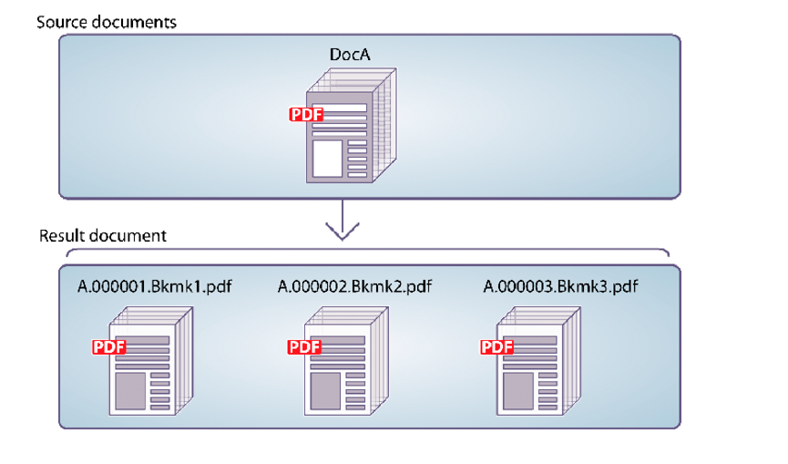

# Disassemblaggio di documenti PDF a livello di programmazione {#programmatically-disassembling-pdf-documents}

**Gli esempi e gli esempi contenuti in questo documento sono solo per AEM Forms in ambiente JEE.**

È possibile disassemblare un documento PDF trasmettendolo al servizio Assembler. In genere, questa attività è utile quando il documento PDF è stato creato originariamente da molti singoli documenti, ad esempio una raccolta di istruzioni. Nell&#39;illustrazione seguente, DocA è diviso in più documenti risultanti, dove il primo segnalibro di livello 1 in una pagina identifica l&#39;inizio di un nuovo documento risultante.



Per disassemblare un documento PDF, verificare che l&#39;elemento `PDFsFromBookmarks` si trovi nel documento DDX. L&#39;elemento `PDFsFromBookmarks` è un elemento risultante e può essere solo un elemento figlio dell&#39;elemento `DDX`. Non dispone di un attributo `result` perché può causare la generazione di più documenti.

L&#39;elemento `PDFsFromBookmarks` genera un singolo documento per ogni segnalibro di livello 1 nel documento di origine.

Ai fini della presente discussione, si supponga di utilizzare il seguente documento DDX.

```xml
 <?xml version="1.0" encoding="UTF-8"?>
 <DDX xmlns="https://ns.adobe.com/DDX/1.0/">
      <PDFsFromBookmarks prefix="stmt">
     <PDF source="AssemblerResultPDF.pdf"/>
 </PDFsFromBookmarks>
 </DDX>
```

>[!NOTE]
>
>Prima di leggere questa sezione, è consigliabile avere familiarità con l&#39;assemblaggio di documenti PDF utilizzando il servizio Assembler. (Vedere [Assemblaggio di documenti di PDF a livello di programmazione](/help/forms/developing/programmatically-assembling-pdf-documents.md).)

>[!NOTE]
>
>Quando si passa un singolo documento PDF al servizio Assembler e si recupera un singolo documento, è possibile richiamare l&#39;operazione `invokeOneDocument`. Tuttavia, per disassemblare un documento PDF, utilizzare l&#39;operazione `invokeDDX` perché, sebbene un documento di PDF di input venga passato al servizio Assembler, quest&#39;ultimo restituisce un insieme che contiene uno o più documenti.

>[!NOTE]
>
>Per ulteriori informazioni sul servizio Assembler, vedere [Riferimento ai servizi per AEM Forms](https://www.adobe.com/go/learn_aemforms_services_63).

>[!NOTE]
>
>Per ulteriori informazioni su un documento DDX, vedere [Servizio assemblatore e riferimento DDX](https://www.adobe.com/go/learn_aemforms_ddx_63).

## Riepilogo dei passaggi {#summary-of-steps}

Per disassemblare un documento PDF, eseguire le operazioni seguenti:

1. Includi file di progetto.
1. Creare un client Assembler di PDF.
1. Fare riferimento a un documento DDX esistente.
1. Fare riferimento a un documento PDF da disassemblare.
1. Impostare le opzioni di runtime.
1. Disassemblare il documento PDF.
1. Salvare i documenti PDF disassemblati.

**Includi file di progetto**

Includi i file necessari nel progetto di sviluppo. Se stai creando un’applicazione client utilizzando Java, includi i file JAR necessari. Se utilizzi i servizi web, accertati di includere i file proxy.

I seguenti file JAR devono essere aggiunti al percorso della classe del progetto:

* adobe-livecycle-client.jar
* adobe-usermanager-client.jar
* adobe-assembler-client.jar
* adobe-utilities.jar (richiesto se AEM Forms è implementato su JBoss)
* jbossall-client.jar (obbligatorio se AEM Forms è distribuito su JBoss)

se AEM Forms viene distribuito su un server applicazioni J2EE supportato che non è JBoss, è necessario sostituire adobe-utilities.jar e jbossall-client.jar con file JAR specifici per il server applicazioni J2EE in cui viene distribuito AEM Forms.

**Creare un client Assembler di PDF**

Prima di poter eseguire un&#39;operazione Assembler a livello di programmazione, è necessario creare un client del servizio Assembler.

**Riferimento a un documento DDX esistente**

Per disassemblare un documento PDF è necessario fare riferimento a un documento DDX. Questo documento DDX deve contenere l&#39;elemento `PDFsFromBookmarks`.

**Riferimento a un documento PDF da disassemblare**

Per disassemblare un documento PDF, fare riferimento a un file PDF che rappresenta il documento PDF da disassemblare. Quando viene passato al servizio Assembler, viene restituito un documento PDF separato per ogni segnalibro di livello 1 del documento.

**Impostare le opzioni di runtime**

È possibile impostare le opzioni di runtime che controllano il comportamento del servizio Assembler durante l&#39;esecuzione di un processo. È ad esempio possibile impostare un&#39;opzione che indichi al servizio Assembler di continuare l&#39;elaborazione di un processo in caso di errore.

**Disassemblare il documento PDF**

Dopo aver creato il client del servizio Assembler, aver fatto riferimento al documento DDX, aver fatto riferimento a un documento PDF da disassemblare e aver impostato le opzioni di runtime, è possibile disassemblare un documento PDF richiamando il metodo `invokeDDX`. Se il documento DDX contiene istruzioni per disassemblare il documento PDF, il servizio Assembler restituisce i documenti PDF disassemblati all&#39;interno di un oggetto insieme.

**Salvare i documenti PDF disassemblati**

Tutti i documenti PDF disassemblati vengono restituiti all&#39;interno di un insieme. Scorrere l&#39;oggetto insieme e salvare ogni documento di PDF come file PDF.

**Consulta anche**

[Inclusione dei file della libreria Java di AEM Forms](/help/forms/developing/invoking-aem-forms-using-java.md#including-aem-forms-java-library-files)

[Impostazione delle proprietà di connessione](/help/forms/developing/invoking-aem-forms-using-java.md#setting-connection-properties)

[Assemblaggio di documenti PDF a livello di programmazione](/help/forms/developing/programmatically-assembling-pdf-documents.md)

## Disassemblare un documento PDF utilizzando l’API Java {#disassemble-a-pdf-document-using-the-java-api}

Disassemblare un documento PDF utilizzando l&#39;API del servizio Assembler (Java):

1. Includi file di progetto.

   Includi i file JAR client, come adobe-assembler-client.jar, nel percorso di classe del progetto Java.

1. Creare un client Assembler di PDF.

   * Creare un oggetto `ServiceClientFactory` contenente le proprietà di connessione.
   * Creare un oggetto `AssemblerServiceClient` utilizzando il relativo costruttore e passando l&#39;oggetto `ServiceClientFactory`.

1. Fare riferimento a un documento DDX esistente.

   * Creare un oggetto `java.io.FileInputStream` che rappresenta il documento DDX utilizzando il relativo costruttore e passando un valore stringa che specifica la posizione del file DDX.
   * Creare un oggetto `com.adobe.idp.Document` utilizzando il relativo costruttore e passando l&#39;oggetto `java.io.FileInputStream`.

1. Fare riferimento a un documento PDF da disassemblare.

   * Creare un oggetto `java.util.Map` utilizzato per memorizzare i documenti PDF di input utilizzando un costruttore `HashMap`.
   * Creare un oggetto `java.io.FileInputStream` utilizzando il relativo costruttore e passando la posizione del documento PDF da disassemblare.
   * Creare un oggetto `com.adobe.idp.Document` e passare l&#39;oggetto `java.io.FileInputStream` che contiene il documento PDF da disassemblare.
   * Aggiungere una voce all&#39;oggetto `java.util.Map` richiamando il relativo metodo `put` e passando i seguenti argomenti:

      * Valore stringa che rappresenta il nome della chiave. Questo valore deve corrispondere al valore dell&#39;elemento di origine PDF specificato nel documento DDX.
      * Oggetto `com.adobe.idp.Document` contenente il documento PDF da disassemblare.

1. Impostare le opzioni di runtime.

   * Creare un oggetto `AssemblerOptionSpec` che memorizza le opzioni di runtime utilizzando il relativo costruttore.
   * Impostare le opzioni di runtime per soddisfare i requisiti aziendali richiamando un metodo che appartiene all&#39;oggetto `AssemblerOptionSpec`. Ad esempio, per indicare al servizio Assembler di continuare a elaborare un processo quando si verifica un errore, richiamare il metodo `setFailOnError` dell&#39;oggetto `AssemblerOptionSpec` e passare `false`.

1. Disassemblare il documento PDF.

   Richiama il metodo `invokeDDX` dell&#39;oggetto `AssemblerServiceClient` e passa i seguenti valori richiesti:

   * Oggetto `com.adobe.idp.Document` che rappresenta il documento DDX da utilizzare
   * Oggetto `java.util.Map` contenente il documento PDF da disassemblare
   * Oggetto `com.adobe.livecycle.assembler.client.AssemblerOptionSpec` che specifica le opzioni di runtime, inclusi il tipo di carattere predefinito e il livello del log del processo

   Il metodo `invokeDDX` restituisce un oggetto `com.adobe.livecycle.assembler.client.AssemblerResult` contenente i documenti PDF disassemblati ed eventuali eccezioni.

1. Salvare i documenti PDF disassemblati.

   Per ottenere i documenti PDF disassemblati, effettuare le seguenti operazioni:

   * Richiama il metodo `getDocuments` dell&#39;oggetto `AssemblerResult`. Restituisce un oggetto `java.util.Map`.
   * Scorrere l&#39;oggetto `java.util.Map` fino a trovare l&#39;oggetto `com.adobe.idp.Document` risultante.
   * Richiama il metodo `copyToFile` dell&#39;oggetto `com.adobe.idp.Document` per estrarre il documento PDF.

**Consulta anche**

[Disassemblaggio di documenti PDF a livello di programmazione](#programmatically-disassembling-pdf-documents)

[Guida rapida (modalità SOAP): disassemblaggio di un documento PDF tramite l’API Java](/help/forms/developing/assembler-service-java-api-quick.md#quick-start-soap-mode-disassembling-a-pdf-document-using-the-java-api)

[Inclusione dei file della libreria Java di AEM Forms](/help/forms/developing/invoking-aem-forms-using-java.md#including-aem-forms-java-library-files)

[Impostazione delle proprietà di connessione](/help/forms/developing/invoking-aem-forms-using-java.md#setting-connection-properties)

## Disassemblare un documento PDF utilizzando l’API del servizio web {#disassemble-a-pdf-document-using-the-web-service-api}

Disassemblare un documento PDF utilizzando l&#39;API del servizio Assembler (servizio Web):

1. Includi file di progetto.

   Creare un progetto Microsoft .NET che utilizza MTOM. Assicurarsi di utilizzare la seguente definizione WSDL durante l&#39;impostazione di un riferimento al servizio: `http://localhost:8080/soap/services/AssemblerService?WSDL&lc_version=9.0.1`.

   >[!NOTE]
   >
   >Sostituisci `localhost` con l&#39;indirizzo IP del server che ospita AEM Forms.

1. Creare un client Assembler di PDF.

   * Creare un oggetto `AssemblerServiceClient` utilizzando il relativo costruttore predefinito.
   * Creare un oggetto `AssemblerServiceClient.Endpoint.Address` utilizzando il costruttore `System.ServiceModel.EndpointAddress`. Passa un valore stringa che specifica il WSDL al servizio AEM Forms (ad esempio, `http://localhost:8080/soap/services/AssemblerService?blob=mtom`). Non è necessario utilizzare l&#39;attributo `lc_version`. Questo attributo viene utilizzato quando si crea un riferimento a un servizio.
   * Creare un oggetto `System.ServiceModel.BasicHttpBinding` ottenendo il valore del campo `AssemblerServiceClient.Endpoint.Binding`. Eseguire il cast del valore restituito in `BasicHttpBinding`.
   * Impostare il campo `MessageEncoding` dell&#39;oggetto `System.ServiceModel.BasicHttpBinding` su `WSMessageEncoding.Mtom`. Questo valore assicura che venga utilizzato MTOM.
   * Abilita l’autenticazione HTTP di base eseguendo le seguenti attività:

      * Assegnare il nome utente di AEM Forms al campo `AssemblerServiceClient.ClientCredentials.UserName.UserName`.
      * Assegnare il valore della password corrispondente al campo `AssemblerServiceClient.ClientCredentials.UserName.Password`.
      * Assegnare il valore costante `HttpClientCredentialType.Basic` al campo `BasicHttpBindingSecurity.Transport.ClientCredentialType`.
      * Assegnare il valore costante `BasicHttpSecurityMode.TransportCredentialOnly` al campo `BasicHttpBindingSecurity.Security.Mode`.

1. Fare riferimento a un documento DDX esistente.

   * Creare un oggetto `BLOB` utilizzando il relativo costruttore. L&#39;oggetto `BLOB` viene utilizzato per archiviare il documento DDX.
   * Creare un oggetto `System.IO.FileStream` richiamando il relativo costruttore. Passa un valore stringa che rappresenta la posizione del file del documento DDX e la modalità di apertura del file.
   * Creare una matrice di byte che memorizza il contenuto dell&#39;oggetto `System.IO.FileStream`. È possibile determinare le dimensioni della matrice di byte ottenendo la proprietà `Length` dell&#39;oggetto `System.IO.FileStream`.
   * Compilare la matrice di byte con i dati di flusso richiamando il metodo `Read` dell&#39;oggetto `System.IO.FileStream` e passando la matrice di byte, la posizione iniziale e la lunghezza del flusso da leggere.
   * Compilare l&#39;oggetto `BLOB` assegnando la relativa proprietà `MTOM` al contenuto della matrice di byte.

1. Fare riferimento a un documento PDF da disassemblare.

   * Creare un oggetto `BLOB` utilizzando il relativo costruttore. L&#39;oggetto `BLOB` viene utilizzato per memorizzare il documento PDF di input. Questo oggetto `BLOB` è passato a `invokeOneDocument` come argomento.
   * Creare un oggetto `System.IO.FileStream` richiamandone il costruttore e passando un valore stringa che rappresenta la posizione del file del documento PDF di input e la modalità di apertura del file.
   * Creare una matrice di byte che memorizza il contenuto dell&#39;oggetto `System.IO.FileStream`. È possibile determinare le dimensioni della matrice di byte ottenendo la proprietà `Length` dell&#39;oggetto `System.IO.FileStream`.
   * Compilare la matrice di byte con i dati di flusso richiamando il metodo `Read` dell&#39;oggetto `System.IO.FileStream` e passando la matrice di byte, la posizione iniziale e la lunghezza del flusso da leggere.
   * Compilare l&#39;oggetto `BLOB` assegnando al relativo campo `MTOM` il contenuto della matrice di byte.
   * Creare un oggetto `MyMapOf_xsd_string_To_xsd_anyType`. Questo oggetto insieme viene utilizzato per memorizzare il PDF da disassemblare.
   * Creare un oggetto `MyMapOf_xsd_string_To_xsd_anyType_Item`.
   * Assegnare un valore stringa che rappresenta il nome chiave al campo `key` dell&#39;oggetto `MyMapOf_xsd_string_To_xsd_anyType_Item`. Questo valore deve corrispondere al valore dell&#39;elemento di origine PDF specificato nel documento DDX.
   * Assegnare l&#39;oggetto `BLOB` che memorizza il documento PDF al campo `value` dell&#39;oggetto `MyMapOf_xsd_string_To_xsd_anyType_Item`.
   * Aggiungere l&#39;oggetto `MyMapOf_xsd_string_To_xsd_anyType_Item` all&#39;oggetto `MyMapOf_xsd_string_To_xsd_anyType`. Richiama il metodo `Add` dell&#39;oggetto `MyMapOf_xsd_string_To_xsd_anyType` e passa l&#39;oggetto `MyMapOf_xsd_string_To_xsd_anyType`.

1. Impostare le opzioni di runtime.

   * Creare un oggetto `AssemblerOptionSpec` che memorizza le opzioni di runtime utilizzando il relativo costruttore.
   * Impostare le opzioni di runtime per soddisfare i requisiti aziendali assegnando un valore a un membro dati che appartiene all&#39;oggetto `AssemblerOptionSpec`. Ad esempio, per indicare al servizio Assembler di continuare a elaborare un processo quando si verifica un errore, assegnare `false` al campo `failOnError` dell&#39;oggetto `AssemblerOptionSpec`.

1. Disassemblare il documento PDF.

   Richiama il metodo `invokeDDX` dell&#39;oggetto `AssemblerServiceClient` e passa i seguenti valori:

   * Oggetto `BLOB` che rappresenta il documento DDX che disassembla il documento PDF
   * L&#39;oggetto `MyMapOf_xsd_string_To_xsd_anyType` che contiene il documento PDF da disassemblare
   * Oggetto `AssemblerOptionSpec` che specifica le opzioni di runtime

   Il metodo `invokeDDX` restituisce un oggetto `AssemblerResult` contenente i risultati del processo ed eventuali eccezioni.

1. Salvare i documenti PDF disassemblati.

   Per ottenere i documenti PDF appena creati, effettuare le seguenti operazioni:

   * Accedere al campo `documents` dell&#39;oggetto `AssemblerResult`, che è un oggetto `Map` contenente i documenti PDF disassemblati.
   * Scorrere l&#39;oggetto `Map` per ottenere ogni documento risultante. Quindi, eseguire il cast di `value` del membro dell&#39;array in un `BLOB`.
   * Estrarre i dati binari che rappresentano il documento PDF accedendo alla proprietà `MTOM` dell&#39;oggetto `BLOB`. Restituisce una matrice di byte che è possibile scrivere in un file PDF.

**Consulta anche**

[Disassemblaggio di documenti PDF a livello di programmazione](#programmatically-disassembling-pdf-documents)

[Richiamare AEM Forms tramite MTOM](/help/forms/developing/invoking-aem-forms-using-web.md#invoking-aem-forms-using-mtom)
