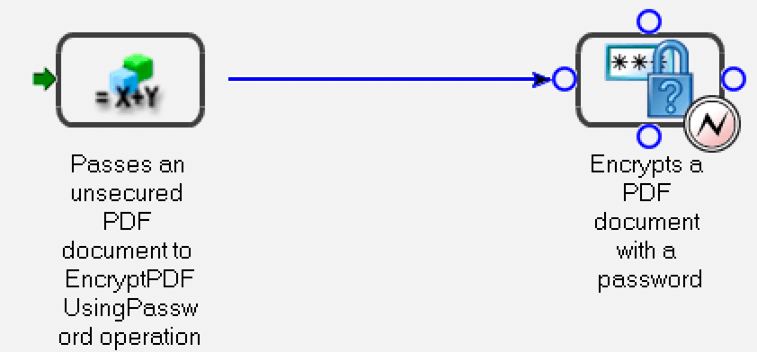

# Gestione programmatica degli endpoint {#programmatically-managing-endpoints}

**Gli esempi e gli esempi contenuti in questo documento sono solo per AEM Forms in ambiente JEE.**

**Informazioni sul servizio del Registro di sistema degli endpoint**

Il servizio Registro endpoint consente di gestire gli endpoint a livello di programmazione. Ad esempio, puoi aggiungere a un servizio i seguenti tipi di endpoint:

* EJB
* SOAP
* Cartella controllata
* E-mail
* (Obsoleto per i moduli AEM) Comunicazione remota
* Gestione attività

>[!NOTE]
>
>Gli endpoint remoti di SOAP, EJB e (obsoleti per i moduli AEM su JEE) vengono creati automaticamente per ogni servizio attivato. Gli endpoint SOAP ed EJB consentono l&#39;SOAP e l&#39;EJB per tutte le operazioni di servizio.

Un endpoint remoto consente ai client Flex di richiamare le operazioni sul servizio AEM Forms a cui viene aggiunto l’endpoint. Viene creata una destinazione Flex con lo stesso nome dell&#39;endpoint e i client Flex possono creare oggetti remoti che puntano a questa destinazione per richiamare operazioni sul servizio pertinente.

Gli endpoint E-mail, Gestione attività e Cartella controllata espongono solo un’operazione specifica del servizio. L&#39;aggiunta di questi endpoint richiede un secondo passaggio di configurazione per selezionare un metodo da richiamare, impostare i parametri di configurazione e specificare le mappature dei parametri di input e output.

È possibile organizzare gli endpoint di TaskManager in gruppi denominati *categorie*. Queste categorie vengono quindi esposte a Workspace tramite TaskManager, con gli utenti finali che visualizzano gli endpoint di TaskManager man mano che vengono categorizzati. In Workspace, gli utenti finali visualizzano queste categorie nel riquadro di navigazione. Gli endpoint all&#39;interno di ciascuna categoria vengono visualizzati come schede di elaborazione nella pagina Avvia processi di Workspace.

Puoi eseguire queste attività utilizzando il servizio Registro endpoint:

* Aggiungere endpoint EJB. (Vedi [Aggiunta di endpoint EJB](programmatically-endpoints.md#adding-ejb-endpoints).)
* Aggiungere endpoint SOAP. (Vedi [Aggiunta di endpoint SOAP](programmatically-endpoints.md#adding-soap-endpoints).)
* Aggiungere endpoint di cartella controllata (vedere [Aggiunta di endpoint di cartella controllata](programmatically-endpoints.md#adding-watched-folder-endpoints)).
* Aggiungi endpoint e-mail. (Vedi [Aggiunta di endpoint e-mail](programmatically-endpoints.md#adding-email-endpoints).)
* Aggiungere endpoint remoti. (Vedi [Aggiunta di endpoint remoti](programmatically-endpoints.md#adding-remoting-endpoints).)
* Aggiungere endpoint di TaskManager (vedere [Aggiunta di endpoint di TaskManager](programmatically-endpoints.md#adding-taskmanager-endpoints)).
* Modificare gli endpoint (vedere [Modifica degli endpoint](programmatically-endpoints.md#modifying-endpoints)).
* Rimuovere gli endpoint (Vedere [Rimozione degli endpoint](programmatically-endpoints.md#removing-endpoints).)
* Recuperare le informazioni sul connettore dell&#39;endpoint (vedere [Recupero delle informazioni sul connettore dell&#39;endpoint](programmatically-endpoints.md#retrieving-endpoint-connector-information).)

## Aggiunta di endpoint EJB {#adding-ejb-endpoints}

Puoi aggiungere in modo programmatico un endpoint EJB a un servizio utilizzando l’API Java di AEM Forms. Aggiungendo un endpoint EJB a un servizio, si consente a un&#39;applicazione client di richiamare il servizio utilizzando la modalità EJB. In altre parole, quando imposti le proprietà di connessione necessarie per richiamare AEM Forms, puoi selezionare la modalità EJB. (Vedere [Impostazione delle proprietà di connessione](/help/forms/developing/invoking-aem-forms-using-java.md#setting-connection-properties).)

>[!NOTE]
>
>Non è possibile aggiungere un endpoint EJB utilizzando i servizi Web.

>[!NOTE]
>
>In genere, un endpoint EJB viene aggiunto a un servizio per impostazione predefinita. Tuttavia, un endpoint EJB può essere aggiunto a un processo distribuito a livello di programmazione o quando un endpoint EJB viene rimosso e deve essere aggiunto di nuovo.

### Riepilogo dei passaggi {#summary-of-steps}

Per aggiungere un endpoint EJB a un servizio, eseguire le operazioni seguenti:

1. Includi file di progetto.
1. Creare un oggetto `EndpointRegistry Client`.
1. Imposta attributi endpoint EJB.
1. Creare un endpoint EJB.
1. Abilita l’endpoint.

**Includi file di progetto**

Includi i file necessari nel progetto di sviluppo. I seguenti file JAR devono essere aggiunti al percorso della classe del progetto:

* adobe-livecycle-client.jar
* adobe-usermanager-client.jar
* adobe-utilities.jar (richiesto se AEM Forms è distribuito sul server applicazioni JBoss)
* jbossall-client.jar (richiesto se AEM Forms è distribuito sul server applicazioni JBoss)

Per informazioni sul percorso di questi file JAR, vedi [Inclusi i file della libreria Java di AEM Forms](/help/forms/developing/invoking-aem-forms-using-java.md#including-aem-forms-java-library-files).

**Creare un oggetto client EndpointRegistry**

Prima di poter aggiungere un endpoint EJB a livello di programmazione, è necessario creare un oggetto `EndpointRegistryClient`.

**Imposta attributi endpoint EJB**

Per creare un endpoint EJB per un servizio, specificare i valori seguenti:

* **Identificatore connettore**: specifica il tipo di endpoint da creare. Per creare un endpoint EJB, specificare `EJB`.
* **Descrizione**: specifica la descrizione dell&#39;endpoint.
* **Nome**: specifica il nome dell&#39;endpoint.
* **Identificatore servizio**: specifica il servizio a cui appartiene l&#39;endpoint.
* **Nome operazione**: specifica il nome dell&#39;operazione richiamata tramite l&#39;endpoint. Durante la creazione di un endpoint EJB, specificare un carattere jolly ( `*`). Tuttavia, se si desidera specificare un&#39;operazione specifica anziché richiamare tutte le operazioni del servizio, specificare il nome dell&#39;operazione anziché utilizzare il carattere jolly ( `*`).

**Creare un endpoint EJB**

Dopo aver impostato gli attributi dell&#39;endpoint EJB, è possibile creare un endpoint EJB per un servizio.

**Abilita l&#39;endpoint**

Dopo aver creato un endpoint, devi abilitarlo. Dopo aver abilitato l’endpoint, puoi utilizzarlo per richiamare il servizio. Dopo aver abilitato l’endpoint, puoi visualizzarlo all’interno della console di amministrazione.

**Consulta anche**

[Aggiunta di un endpoint EJB tramite API Java](programmatically-endpoints.md#adding-an-ejb-endpoint-using-the-java-api)

[Inclusione dei file della libreria Java di AEM Forms](/help/forms/developing/invoking-aem-forms-using-java.md#including-aem-forms-java-library-files)

[Impostazione delle proprietà di connessione](/help/forms/developing/invoking-aem-forms-using-java.md#setting-connection-properties)

### Aggiunta di un endpoint EJB tramite API Java {#adding-an-ejb-endpoint-using-the-java-api}

Aggiungi un endpoint EJB utilizzando l’API Java:

1. Includi file di progetto.

   Includi i file JAR client, come adobe-livecycle-client.jar, nel percorso di classe del progetto Java. (

1. Creare un oggetto client EndpointRegistry.

   * Creare un oggetto `ServiceClientFactory` contenente le proprietà di connessione.
   * Creare un oggetto `EndpointRegistryClient` utilizzando il relativo costruttore e passando l&#39;oggetto `ServiceClientFactory`.

1. Imposta attributi endpoint EJB.

   * Creare un oggetto `CreateEndpointInfo` utilizzando il relativo costruttore.
   * Specificare il valore dell&#39;identificatore del connettore richiamando il metodo `setConnectorId` dell&#39;oggetto `CreateEndpointInfo` e passando il valore stringa `EJB`.
   * Specificare la descrizione dell&#39;endpoint richiamando il metodo `setDescription` dell&#39;oggetto `CreateEndpointInfo` e passando un valore stringa che descrive l&#39;endpoint.
   * Specificare il nome dell&#39;endpoint richiamando il metodo `setName` dell&#39;oggetto `CreateEndpointInfo` e passando un valore stringa che specifichi il nome.
   * Specificare il servizio a cui appartiene l&#39;endpoint richiamando il metodo `setServiceId` dell&#39;oggetto `CreateEndpointInfo` e passando un valore stringa che specifica il nome del servizio.
   * Specificare l&#39;operazione richiamata richiamando il metodo `setOperationName` dell&#39;oggetto `CreateEndpointInfo` e passare un valore stringa che specifichi il nome dell&#39;operazione. Per gli endpoint SOAP ed EJB, specificare un carattere jolly ( `*`), che implica tutte le operazioni.

1. Creare un endpoint EJB.

   Creare l&#39;endpoint richiamando il metodo `createEndpoint` dell&#39;oggetto `EndpointRegistryClient` e passando l&#39;oggetto `CreateEndpointInfo`. Questo metodo restituisce un oggetto `Endpoint` che rappresenta il nuovo endpoint EJB.

1. Abilita l’endpoint.

   Abilitare l&#39;endpoint richiamando il metodo enable dell&#39;oggetto `EndpointRegistryClient` e passando l&#39;oggetto `Endpoint` restituito dal metodo `createEndpoint`.

**Consulta anche**

[Riepilogo dei passaggi](programmatically-endpoints.md#summary-of-steps)

[QuickStart: aggiunta di un endpoint EJB utilizzando l’API Java](/help/forms/developing/endpoint-registry-java-api-quick.md#quickstart-adding-an-ejb-endpoint-using-the-java-api)

[Inclusione dei file della libreria Java di AEM Forms](/help/forms/developing/invoking-aem-forms-using-java.md#including-aem-forms-java-library-files)

[Impostazione delle proprietà di connessione](/help/forms/developing/invoking-aem-forms-using-java.md#setting-connection-properties)

## Aggiunta di endpoint SOAP {#adding-soap-endpoints}

Puoi aggiungere in modo programmatico un endpoint SOAP a un servizio utilizzando l’API Java di AEM Forms. Aggiungendo un endpoint SOAP, si consente a un&#39;applicazione client di richiamare il servizio utilizzando la modalità SOAP. In altre parole, quando si impostano le proprietà di connessione necessarie per richiamare AEM Forms, è possibile selezionare la modalità SOAP.

>[!NOTE]
>
>Non è possibile aggiungere un endpoint SOAP utilizzando i servizi Web.

>[!NOTE]
>
>In genere, un endpoint SOAP viene aggiunto a un servizio per impostazione predefinita. Tuttavia, un endpoint SOAP può essere aggiunto a un processo distribuito a livello di programmazione o quando un endpoint SOAP viene rimosso e deve essere aggiunto di nuovo.

### Riepilogo dei passaggi {#summary_of_steps-1}

Per aggiungere un endpoint SOAP a un servizio, eseguire le operazioni seguenti:

1. Includi file di progetto.
1. Creare un oggetto `EndpointRegistryClient`.
1. Imposta gli attributi dell’endpoint SOAP.
1. Creare un endpoint SOAP.
1. Abilita l’endpoint.

**Includi file di progetto**

Includi i file necessari nel progetto di sviluppo. Se stai creando un’applicazione client utilizzando Java, includi i file JAR necessari. Se utilizzi i servizi web, accertati di includere i file proxy.

I seguenti file JAR devono essere aggiunti al percorso della classe del progetto:

* adobe-livecycle-client.jar
* adobe-usermanager-client.jar
* adobe-utilities.jar (richiesto se AEM Forms è distribuito sul server applicazioni JBoss)
* jbossall-client.jar (richiesto se AEM Forms è distribuito sul server applicazioni JBoss)

Questi file JAR sono necessari per creare un endpoint SOAP. Tuttavia, se utilizzi l’endpoint SOAP per richiamare il servizio, devi aggiungere dei file JAR. Per informazioni sui file JAR di AEM Forms, consulta [Inclusi i file della libreria Java di AEM Forms](/help/forms/developing/invoking-aem-forms-using-java.md#including-aem-forms-java-library-files).

**Creare un oggetto client EndpointRegistry**

Per aggiungere a livello di programmazione un endpoint SOAP a un servizio, è necessario creare un oggetto `EndpointRegistryClient`.

**Imposta attributi endpoint SOAP**

Per aggiungere un endpoint SOAP a un servizio, specificare i valori seguenti:

* **Valore dell&#39;identificatore del connettore**: specifica il tipo di endpoint da creare. Per creare un endpoint SOAP, specificare `SOAP`.
* **Descrizione**: specifica la descrizione dell&#39;endpoint.
* **Nome**: specifica il nome dell&#39;endpoint.
* **Valore dell&#39;identificatore del servizio**: specifica il servizio a cui appartiene l&#39;endpoint.
* **Nome operazione**: specifica il nome dell&#39;operazione richiamata tramite l&#39;endpoint. Durante la creazione di un endpoint SOAP, specificare un carattere jolly ( `*`). Tuttavia, se si desidera specificare un&#39;operazione specifica anziché richiamare tutte le operazioni del servizio, specificare il nome dell&#39;operazione anziché utilizzare il carattere jolly ( `*`).

**Creare un endpoint SOAP**

Dopo aver impostato gli attributi dell’endpoint SOAP, puoi creare un endpoint SOAP.

**Abilita l&#39;endpoint**

Dopo aver creato un endpoint, devi abilitarlo. Quando l’endpoint è abilitato, può essere utilizzato per richiamare il servizio. Dopo aver abilitato l’endpoint, puoi visualizzarlo nella console di amministrazione.

**Consulta anche**

[Aggiungere un endpoint SOAP utilizzando l’API Java](programmatically-endpoints.md#add-a-soap-endpoint-using-the-java-api)

[Inclusione dei file della libreria Java di AEM Forms](/help/forms/developing/invoking-aem-forms-using-java.md#including-aem-forms-java-library-files)

[Impostazione delle proprietà di connessione](/help/forms/developing/invoking-aem-forms-using-java.md#setting-connection-properties)

### Aggiungere un endpoint SOAP utilizzando l’API Java {#add-a-soap-endpoint-using-the-java-api}

Aggiungi un endpoint SOAP a un servizio utilizzando l’API Java:

1. Includi file di progetto.

   Includi i file JAR client, come adobe-livecycle-client.jar, nel percorso di classe del progetto Java.

1. Creare un oggetto client EndpointRegistry.

   * Creare un oggetto `ServiceClientFactory` contenente le proprietà di connessione.
   * Creare un oggetto `EndpointRegistryClient` utilizzando il relativo costruttore e passando l&#39;oggetto `ServiceClientFactory`.

1. Imposta gli attributi dell’endpoint SOAP.

   * Creare un oggetto `CreateEndpointInfo` utilizzando il relativo costruttore.
   * Specificare il valore dell&#39;identificatore del connettore richiamando il metodo `setConnectorId` dell&#39;oggetto `CreateEndpointInfo` e passando il valore stringa `SOAP`.
   * Specificare la descrizione dell&#39;endpoint richiamando il metodo `setDescription` dell&#39;oggetto `CreateEndpointInfo` e passando un valore stringa che descrive l&#39;endpoint.
   * Specificare il nome dell&#39;endpoint richiamando il metodo `setName` dell&#39;oggetto `CreateEndpointInfo` e passando un valore stringa che specifichi il nome.
   * Specificare il servizio a cui appartiene l&#39;endpoint richiamando il metodo `setServiceId` dell&#39;oggetto `CreateEndpointInfo` e passando un valore stringa che specifica il nome del servizio.
   * Specificare l&#39;operazione richiamata richiamando il metodo `setOperationName` dell&#39;oggetto `CreateEndpointInfo` e passando un valore stringa che specifica il nome dell&#39;operazione. Per gli endpoint SOAP ed EJB, specificare un carattere jolly ( `*`), che implica tutte le operazioni.

1. Creare un endpoint SOAP.

   Creare l&#39;endpoint richiamando il metodo `createEndpoint` dell&#39;oggetto `EndpointRegistryClient` e passando l&#39;oggetto `CreateEndpointInfo`. Questo metodo restituisce un oggetto `Endpoint` che rappresenta il nuovo endpoint SOAP.

1. Abilita l’endpoint.

   Abilitare l&#39;endpoint richiamando il metodo enable dell&#39;oggetto `EndpointRegistryClient` e passare l&#39;oggetto `Endpoint` restituito dal metodo `createEndpoint`.

**Consulta anche**

[Riepilogo dei passaggi](programmatically-endpoints.md#summary-of-steps)

[QuickStart: aggiunta di un endpoint SOAP utilizzando l’API Java](/help/forms/developing/endpoint-registry-java-api-quick.md#quickstart-adding-a-soap-endpoint-using-the-java-api)

[Inclusione dei file della libreria Java di AEM Forms](/help/forms/developing/invoking-aem-forms-using-java.md#including-aem-forms-java-library-files)

[Impostazione delle proprietà di connessione](/help/forms/developing/invoking-aem-forms-using-java.md#setting-connection-properties)

## Aggiunta di endpoint per cartelle controllate {#adding-watched-folder-endpoints}

Puoi aggiungere in modo programmatico un endpoint di cartella controllata a un servizio utilizzando l’API Java di AEM Forms. Aggiungendo un endpoint di tipo Cartella controllata, si consente agli utenti di inserire un file, ad esempio un file PDF, in una cartella. Quando il file viene inserito nella cartella, il servizio configurato viene richiamato e modifica il file. Dopo aver eseguito l&#39;operazione specificata, il servizio salva il file modificato in una cartella di output specificata. Una cartella controllata è configurata per essere analizzata a un intervallo di velocità fisso o con una pianificazione cron, ad esempio ogni lunedì, mercoledì e venerdì a mezzogiorno.

Ai fini dell&#39;aggiunta a livello di programmazione di un endpoint di cartella controllata a un servizio, considerare il seguente processo di breve durata denominato *EncryptDocument*. (Vedi [Informazioni sui processi di AEM Forms](/help/forms/developing/aem-forms-processes.md#understanding-aem-forms-processes).)


Questo processo accetta un documento PDF non protetto come valore di input e quindi passa il documento PDF non protetto all&#39;operazione `EncryptPDFUsingPassword` del servizio di crittografia. Il documento PDF viene crittografato con una password e il documento PDF crittografato con password è il valore di output di questo processo. Il nome del valore di input (il documento PDF non protetto) è `InDoc` e il tipo di dati è `com.adobe.idp.Document`. Il nome del valore di output (il documento PDF crittografato con password) è `SecuredDoc` e il tipo di dati è `com.adobe.idp.Document`.

>[!NOTE]
>
>Non è possibile aggiungere un endpoint di cartella controllata utilizzando i servizi Web.

### Riepilogo dei passaggi {#summary_of_steps-2}

Per aggiungere un endpoint di cartella controllata a un servizio, eseguire le operazioni seguenti:

1. Includi file di progetto.
1. Creare un oggetto `EndpointRegistryClient`.
1. Imposta gli attributi dell’endpoint della cartella controllata.
1. Specifica i valori di configurazione.
1. Definite i valori dei parametri di input.
1. Definite un valore per il parametro di output.
1. Crea un endpoint per la cartella controllata.
1. Abilita l’endpoint.

**Includi file di progetto**

Includi i file necessari nel progetto di sviluppo. Se stai creando un’applicazione client utilizzando Java, includi i file JAR necessari. Se utilizzi i servizi web, accertati di includere i file proxy.

I seguenti file JAR devono essere aggiunti al percorso della classe del progetto:

* adobe-livecycle-client.jar
* adobe-usermanager-client.jar
* adobe-utilities.jar (richiesto se AEM Forms è distribuito sul server applicazioni JBoss)
* jbossall-client.jar (richiesto se AEM Forms è distribuito sul server applicazioni JBoss)

Per informazioni sul percorso di questi file JAR, vedi [Inclusi i file della libreria Java di AEM Forms](/help/forms/developing/invoking-aem-forms-using-java.md#including-aem-forms-java-library-files).

**Creare un oggetto client EndpointRegistry**

Per aggiungere a livello di programmazione un endpoint di cartella controllata, è necessario creare un oggetto `EndpointRegistryClient`.

**Imposta attributi endpoint cartella controllata**

Per creare un endpoint di cartella controllata per un servizio, specifica i seguenti valori:

* **Identificatore connettore**: specifica il tipo di endpoint creato. Per creare un endpoint di cartella controllata, specificare `WatchedFolder`.
* **Descrizione**: specifica la descrizione dell&#39;endpoint.
* **Nome**: specifica il nome dell&#39;endpoint.
* **Identificatore servizio**: specifica il servizio a cui appartiene l&#39;endpoint. Ad esempio, per aggiungere un endpoint di cartella controllata al processo introdotto in questa sezione (un processo diventa un servizio quando viene attivato utilizzando Workbench), specificare `EncryptDocument`.
* **Nome operazione**: specifica il nome dell&#39;operazione richiamata tramite l&#39;endpoint. In genere, durante la creazione di un endpoint di cartella controllata per un servizio che ha avuto origine da un processo creato in Workbench, il nome dell&#39;operazione è `invoke`.

**Specificare i valori di configurazione**

Specifica i valori di configurazione per un endpoint di cartella controllata quando si aggiunge a livello di programmazione un endpoint di cartella controllata a un servizio. Questi valori di configurazione vengono specificati da un amministratore se un endpoint di cartella controllata viene aggiunto utilizzando la console di amministrazione.

L&#39;elenco seguente specifica i valori di configurazione impostati quando si aggiunge a livello di programmazione un endpoint di cartella controllata a un servizio:

* **url**: specifica il percorso della cartella controllata. In un ambiente cluster, questo valore deve puntare a una cartella di rete condivisa accessibile da tutti i computer del cluster.
* **asincrono**: identifica il tipo di chiamata come asincrono o sincrono. I processi transitori e sincroni possono essere richiamati solo in modo sincrono. Il valore predefinito è true. Si consiglia l’asincronia.
* **cronExpression**: utilizzato dal quarzo per pianificare il polling della directory di input.
* **purgeDuration**: attributo obbligatorio. I file e le cartelle nella cartella dei risultati vengono eliminati quando sono più vecchi di questo valore. Questo valore è misurato in giorni. Questo attributo è utile per garantire che la cartella dei risultati non sia piena. Un valore pari a -1 giorni indica di non eliminare mai la cartella dei risultati. Il valore predefinito è -1.
* **repeatInterval**: l&#39;intervallo, in secondi, per l&#39;analisi della cartella controllata per l&#39;input. A meno che la limitazione non sia abilitata, questo valore deve essere più lungo del tempo necessario per elaborare un processo medio; in caso contrario, il sistema potrebbe sovraccaricare. Il valore predefinito è 5.
* **repeatCount**: numero di volte che una cartella controllata esegue la scansione della cartella o della directory. Il valore -1 indica una scansione indefinita. Il valore predefinito è -1.
* **throttleOn**: limita il numero di processi della cartella controllata che possono essere elaborati in un determinato momento. Il numero massimo di processi è determinato dal valore batchSize.
* **userName**: nome utente utilizzato per richiamare un servizio di destinazione dalla cartella controllata. Questo valore è obbligatorio. Il valore predefinito è SuperAdmin.
* **domainName**: dominio dell&#39;utente. Questo valore è obbligatorio. Il valore predefinito è DefaultDom.
* **batchSize**: numero di file o cartelle da raccogliere per analisi. Utilizzare questo valore per evitare un sovraccarico del sistema; la scansione di troppi file contemporaneamente può causare un arresto anomalo. Il valore predefinito è 2.
* **waitTime**: tempo, in millisecondi, di attesa prima dell&#39;analisi di una cartella o di un file dopo la creazione. Ad esempio, se il tempo di attesa è di 36.000.000 di millisecondi (un’ora) e il file è stato creato un minuto fa, il file viene acquisito dopo 59 o più minuti. Questo attributo è utile per garantire che un file o una cartella sia completamente copiato nella cartella di input. Ad esempio, se si dispone di un file di grandi dimensioni da elaborare e il download richiede dieci minuti, impostare il tempo di attesa su 10&amp;ast;60 &amp;ast;1000 millisecondi. Questa impostazione impedisce alla cartella controllata di eseguire la scansione del file se non è rimasto in attesa per dieci minuti. Il valore predefinito è 0.
* **excludeFilePattern**: modello utilizzato da una cartella controllata per determinare quali file e cartelle analizzare e raccogliere. Qualsiasi file o cartella con questo modello non verrà analizzato per l&#39;elaborazione. Questa impostazione è utile quando l&#39;input è una cartella contenente più file. Il contenuto della cartella può essere copiato in una cartella il cui nome verrà scelto dalla cartella controllata. Questo passaggio impedisce alla cartella controllata di selezionare una cartella da elaborare prima che venga completamente copiata nella cartella di input. Ad esempio, se il valore excludeFilePattern è `data*`, tutti i file e le cartelle che corrispondono a `data*` non vengono prelevati. Sono inclusi file e cartelle denominati `data1`, `data2` e così via. Inoltre, è possibile aggiungere al modello pattern dei caratteri jolly per specificare i pattern dei file. La cartella controllata modifica l&#39;espressione regolare per supportare i pattern con caratteri jolly come `*.*` e `*.pdf`. Questi pattern di caratteri jolly non sono supportati dalle espressioni regolari.
* **includeFilePattern**: il modello utilizzato dalla cartella controllata per determinare quali cartelle e file analizzare e raccogliere. Ad esempio, se il valore è `*`, verranno selezionati tutti i file e le cartelle corrispondenti a `input*`. Sono inclusi file e cartelle denominati `input1`, `input2` e così via. Il valore predefinito è `*`. Questo valore indica tutti i file e le cartelle. Inoltre, è possibile aggiungere al modello pattern dei caratteri jolly per specificare i pattern dei file. La cartella controllata modifica l&#39;espressione regolare per supportare i pattern con caratteri jolly come `*.*` e `*.pdf`. Questi pattern di caratteri jolly non sono supportati dalle espressioni regolari. Questo valore è obbligatorio.
* **resultFolderName**: cartella in cui sono archiviati i risultati salvati. Questa posizione può essere un percorso di directory assoluto o relativo. Se i risultati non vengono visualizzati in questa cartella, selezionare la cartella con errori. I file di sola lettura non vengono elaborati e verranno salvati nella cartella degli errori. Il valore predefinito è `result/%Y/%M/%D/`. Questa è la cartella dei risultati all’interno della cartella controllata.
* **preserveFolderName**: percorso in cui vengono archiviati i file dopo l&#39;analisi e il prelievo completati. Questo percorso può essere assoluto, relativo o nullo. Il valore predefinito è `preserve/%Y/%M/%D/`.
* **failureFolderName**: la cartella in cui vengono salvati i file con errori. Questo percorso è sempre relativo alla cartella controllata. I file di sola lettura non vengono elaborati e verranno salvati nella cartella degli errori. Il valore predefinito è `failure/%Y/%M/%D/`.
* **preserveOnFailure**: mantenere i file di input in caso di errore durante l&#39;esecuzione dell&#39;operazione su un servizio. Il valore predefinito è true.
* **overwriteDuplicateFilename**: se impostato su true, i file nella cartella dei risultati e la cartella di conservazione vengono sovrascritti. Se è impostato su false, vengono utilizzati per il nome i file e le cartelle con un suffisso di indice numerico. Il valore predefinito è false.

**Definire i valori dei parametri di input**

Quando crei un endpoint di cartella controllata, devi definire i valori dei parametri di input. In altre parole, devi descrivere i valori di input passati all’operazione richiamata dalla cartella controllata. Ad esempio, considera il processo introdotto in questo argomento. Ha un valore di input denominato `InDoc` e il relativo tipo di dati è `com.adobe.idp.Document`. Quando crei un endpoint di cartella controllata per questo processo (dopo l’attivazione, il processo diventa un servizio), devi definire il valore del parametro di input.

Per definire i valori dei parametri di input necessari per un endpoint di cartella controllata, specifica i seguenti valori:

**Nome parametro di input**: nome del parametro di input. Il nome di un valore di input viene specificato in Workbench per un processo. Se il valore di input appartiene a un&#39;operazione di servizio (un servizio che non è un processo creato in Workbench), il nome di input viene specificato nel file component.xml. Ad esempio, il nome del parametro di input per il processo introdotto in questa sezione è `InDoc`.

**Tipo di mapping**: utilizzato per configurare i valori di input necessari per richiamare l&#39;operazione del servizio. Esistono due tipi di mappatura:

* `Literal`: l&#39;endpoint della cartella controllata utilizza il valore immesso nel campo così come viene visualizzato. Sono supportati tutti i tipi Java di base. Ad esempio, se un’API utilizza input come String, long, int e Boolean, la stringa viene convertita nel tipo corretto e il servizio viene richiamato.
* `Variable`: il valore immesso è un modello di file utilizzato dalla cartella controllata per scegliere l&#39;input. Se ad esempio si seleziona Variabile per il tipo di mapping e il documento di input deve essere un file PDF, è possibile specificare `*.pdf`come valore di mapping.

**Valore di mapping**: specifica il valore del tipo di mapping. Se ad esempio si seleziona un tipo di mapping `Variable`, è possibile specificare `*.pdf` come modello di file.

**Tipo di dati**: specifica il tipo di dati dei valori di input. Ad esempio, il tipo di dati del valore di input del processo introdotto in questa sezione è `com.adobe.idp.Document`.

**Definisci un valore di parametro di output**

Quando crei un endpoint di cartella controllata, devi definire un valore per il parametro di output. In altre parole, devi descrivere il valore di output restituito dal servizio richiamato dall’endpoint della cartella controllata. Ad esempio, considera il processo introdotto in questo argomento. Ha un valore di output denominato `SecuredDoc` e il relativo tipo di dati è `com.adobe.idp.Document`. Quando crei un endpoint di cartella controllata per questo processo (dopo l’attivazione, il processo diventa un servizio), devi definire il valore del parametro di output.

Per definire il valore di un parametro di output necessario per un endpoint di tipo Cartella controllata, specificare i seguenti valori:

**Nome parametro di output**: nome del parametro di output. Il nome di un valore di output del processo è specificato in Workbench. Se il valore di output appartiene a un&#39;operazione di servizio (un servizio che non è un processo creato in Workbench), il nome di output viene specificato nel file component.xml. Ad esempio, il nome del parametro di output per il processo introdotto in questa sezione è `SecuredDoc`.

**Tipo di mappatura**: utilizzato per configurare l&#39;output del servizio e dell&#39;operazione. Sono disponibili le seguenti opzioni:

* Se il servizio restituisce un singolo oggetto (un singolo documento), il modello è `%F.pdf` e la destinazione di origine è sourcefilename.pdf. Ad esempio, il processo introdotto in questa sezione restituisce un singolo documento. Di conseguenza, il tipo di mappatura può essere definito come `%F.pdf` ( `%F` significa utilizzare il nome file specificato). Il modello `%E` specifica l&#39;estensione del documento di input.
* Se il servizio restituisce un elenco, il pattern è `Result\%F\` e la destinazione di origine è Result\sourcefilename\source1 (output 1) e Result\sourcefilename\source2 (output 2).
* Se il servizio restituisce una mappa, il pattern è `Result\%F\` e la destinazione di origine è Result\nomefileorigine\file1 e Result\nomefileorigine\file2. Se la mappa contiene più oggetti, il pattern è `Result\%F.pdf` e la destinazione di origine è Result\sourcefilename1.pdf (output 1), Result\sourcefilenam2.pdf (output 2) e così via.

**Tipo di dati**: specifica il tipo di dati del valore restituito. Ad esempio, il tipo di dati del valore restituito del processo introdotto in questa sezione è `com.adobe.idp.Document`.

**Crea un endpoint cartella controllata**

Dopo aver impostato gli attributi e i valori di configurazione dell’endpoint e aver definito i valori dei parametri di input e output, è necessario creare l’endpoint della cartella controllata.

**Abilita l&#39;endpoint**

Dopo aver creato un endpoint di cartella controllata, devi abilitarlo. Quando l’endpoint è abilitato, può essere utilizzato per richiamare il servizio. Dopo aver abilitato l’endpoint, puoi visualizzarlo all’interno della console di amministrazione.

**Consulta anche**

[Aggiungere un endpoint di cartella controllata utilizzando l’API Java](programmatically-endpoints.md#add-a-watched-folder-endpoint-using-the-java-api)

[Inclusione dei file della libreria Java di AEM Forms](/help/forms/developing/invoking-aem-forms-using-java.md#including-aem-forms-java-library-files)

[Impostazione delle proprietà di connessione](/help/forms/developing/invoking-aem-forms-using-java.md#setting-connection-properties)

### Aggiungere un endpoint di cartella controllata utilizzando l’API Java {#add-a-watched-folder-endpoint-using-the-java-api}

Aggiungi un endpoint Watched Folder utilizzando l’API Java di AEM Forms:

1. Includi file di progetto.

   Includi i file JAR client, come adobe-livecycle-client.jar, nel percorso di classe del progetto Java.

1. Creare un oggetto client EndpointRegistry.

   * Creare un oggetto `ServiceClientFactory` contenente le proprietà di connessione.
   * Creare un oggetto `EndpointRegistryClient` utilizzando il relativo costruttore e passando l&#39;oggetto `ServiceClientFactory`.

1. Imposta gli attributi dell’endpoint della cartella controllata.

   * Creare un oggetto `CreateEndpointInfo` utilizzando il relativo costruttore.
   * Specificare il valore dell&#39;identificatore del connettore richiamando il metodo `setConnectorId` dell&#39;oggetto `CreateEndpointInfo` e passando il valore stringa `WatchedFolder`.
   * Specificare la descrizione dell&#39;endpoint richiamando il metodo `setDescription` dell&#39;oggetto `CreateEndpointInfo` e passando un valore stringa che descrive l&#39;endpoint.
   * Specificare il nome dell&#39;endpoint richiamando il metodo `setName` dell&#39;oggetto `CreateEndpointInfo` e passando un valore stringa che specifichi il nome.
   * Specificare il servizio a cui appartiene l&#39;endpoint richiamando il metodo `setServiceId` dell&#39;oggetto `CreateEndpointInfo` e passando un valore stringa che specifica il nome del servizio.
   * Specificare l&#39;operazione richiamata richiamando il metodo `setOperationName` dell&#39;oggetto `CreateEndpointInfo` e passando un valore stringa che specifica il nome dell&#39;operazione. In genere, durante la creazione di un endpoint di cartella controllata per un servizio che ha avuto origine da un processo creato in Workbench, viene richiamato il nome dell’operazione.

1. Specifica i valori di configurazione.

   Per ogni valore di configurazione da impostare per l&#39;endpoint della cartella controllata, è necessario richiamare il metodo `setConfigParameterAsText` dell&#39;oggetto `CreateEndpointInfo`. Ad esempio, per impostare il valore di configurazione `url`, richiamare il metodo `setConfigParameterAsText` dell&#39;oggetto `CreateEndpointInfo` e passare i seguenti valori stringa:

   * Valore stringa che specifica il nome del valore di configurazione. Quando si imposta il valore di configurazione `url`, specificare `url`.
   * Valore stringa che specifica il valore della configurazione. Quando si imposta il valore di configurazione `url`, specificare il percorso della cartella controllata.

   >[!NOTE]
   >
   >Per visualizzare tutti i valori di configurazione impostati per il servizio EncryptDocument, vedere l&#39;esempio di codice Java disponibile in [QuickStart: aggiunta di un endpoint di cartella controllata tramite l&#39;API Java](/help/forms/developing/endpoint-registry-java-api-quick.md#quickstart-adding-a-watched-folder-endpoint-using-the-java-api).

1. Definite i valori dei parametri di input.

   Definire un valore di parametro di input richiamando il metodo `setInputParameterMapping` dell&#39;oggetto `CreateEndpointInfo` e passare i valori seguenti:

   * Valore stringa che specifica il nome del parametro di input. Il nome del parametro di input per il servizio EncryptDocument, ad esempio, è `InDoc`.
   * Valore stringa che specifica il tipo di dati del parametro di input. Ad esempio, il tipo di dati del parametro di input `InDoc` è `com.adobe.idp.Document`.
   * Valore stringa che specifica il tipo di mappatura. Ad esempio, è possibile specificare `variable`.
   * Valore stringa che specifica il valore del tipo di mapping. Ad esempio, è possibile specificare &amp;ast;.pdf come modello di file.

   >[!NOTE]
   >
   >Richiama il metodo `setInputParameterMapping` per ogni valore del parametro di input da definire. Poiché il processo EncryptDocument dispone di un solo parametro di input, è necessario richiamare questo metodo una volta.

1. Definite un valore per il parametro di output.

   Definire un valore di parametro di output richiamando il metodo `setOutputParameterMapping` dell&#39;oggetto `CreateEndpointInfo` e passare i valori seguenti:

   * Valore stringa che specifica il nome del parametro di output. Il nome del parametro di output per il servizio EncryptDocument, ad esempio, è `SecuredDoc`.
   * Valore stringa che specifica il tipo di dati del parametro di output. Ad esempio, il tipo di dati del parametro di output `SecuredDoc` è `com.adobe.idp.Document`.
   * Valore stringa che specifica il tipo di mappatura. Ad esempio, è possibile specificare `%F.pdf`.

1. Crea un endpoint per la cartella controllata.

   Creare l&#39;endpoint richiamando il metodo `createEndpoint` dell&#39;oggetto `EndpointRegistryClient` e passando l&#39;oggetto `CreateEndpointInfo`. Questo metodo restituisce un oggetto `Endpoint` che rappresenta l&#39;endpoint della cartella controllata.

1. Abilita l’endpoint.

   Abilitare l&#39;endpoint richiamando il metodo `enable` dell&#39;oggetto `EndpointRegistryClient` e passando l&#39;oggetto `Endpoint` restituito dal metodo `createEndpoint`.

**Consulta anche**

[Riepilogo dei passaggi](programmatically-endpoints.md#summary-of-steps)

[QuickStart: aggiunta di un endpoint per cartelle controllate utilizzando l’API Java](/help/forms/developing/endpoint-registry-java-api-quick.md#quickstart-adding-a-watched-folder-endpoint-using-the-java-api)

[Inclusione dei file della libreria Java di AEM Forms](/help/forms/developing/invoking-aem-forms-using-java.md#including-aem-forms-java-library-files)

[Impostazione delle proprietà di connessione](/help/forms/developing/invoking-aem-forms-using-java.md#setting-connection-properties)

### File costante dei valori di configurazione della cartella controllata {#watched-folder-configuration-values-constant-file}

[QuickStart: l&#39;aggiunta di un endpoint di cartella controllata utilizzando l&#39;API Java](/help/forms/developing/endpoint-registry-java-api-quick.md#quickstart-adding-a-watched-folder-endpoint-using-the-java-api) utilizza un file costante che deve far parte del progetto Java per compilare l&#39;avvio rapido. Questo file costante rappresenta i valori di configurazione che devono essere impostati quando si aggiunge un endpoint di cartella controllata. Il codice Java seguente rappresenta il file costante.

```java
 /**
     * This class contains constants that can be used when setting Watched Folder
     * configuration values
     */

 public final class WatchedFolderEndpointConfigConstants {

         public static final String PROPERTY_FILEPROVIDER_URL = "url";
         public static final String PROPERTY_PROPERTY_ASYNCHRONOUS = "asynchronous";
         public static final String PROPERTY_CRON_EXPRESSION = "cronExpression";
         public static final String PROPERTY_PURGE_DURATION = "purgeDuration";
         public static final String PROPERTY_REPEAT_INTERVAL = "repeatInterval";
         public static final String PROPERTY_REPEAT_COUNT = "repeatCount";
         public static final String PROPERTY_THROTTLE = "throttleOn";
         public static final String PROPERTY_USERNAMER = "userName";
         public static final String PROPERTY_DOMAINNAME = "domainName";
         public static final String PROPERTY_FILEPROVIDER_BATCH_SIZE = "batchSize";
         public static final String PROPERTY_FILEPROVIDER_WAIT_TIME = "waitTime";
         public static final String PROPERTY_EXCLUDE_FILE_PATTERN = "excludeFilePattern";
         public static final String PROPERTY_INCLUDE_FILE_PATTERN = "excludeFilePattern";
         public static final String PROPERTY_FILEPROVIDER_RESULT_FOLDER_NAME =  "resultFolderName";
         public static final String PROPERTY_FILEPROVIDER_PRESERVE_FOLDER_NAME = "preserveFolderName";
         public static final String PROPERTY_FILEPROVIDER_FAILURE_FOLDER_NAME = "failureFolderName";
         public static final String PROPERTY_FILEPROVIDER_PRESERVE_ON_FAILURE = "preserveOnFailure";
         public static final String PROPERTY_FILEPROVIDER_OVERWRITE_DUPLICATE_FILENAME = "overwriteDuplicateFilename";
        }
```

## Aggiunta di endpoint e-mail {#adding-email-endpoints}

Puoi aggiungere in modo programmatico un endpoint e-mail a un servizio utilizzando l’API Java di AEM Forms. Aggiungendo un endpoint e-mail, gli utenti potranno inviare un messaggio e-mail con uno o più file allegati a un account e-mail specifico. Viene quindi richiamata l&#39;operazione di configurazione del servizio e vengono modificati i file. Dopo aver eseguito l&#39;operazione specificata, il servizio invia al mittente un messaggio di posta elettronica contenente i file modificati come allegati.

Ai fini dell&#39;aggiunta programmatica di un endpoint e-mail a un servizio, considerare il seguente processo di breve durata denominato *MyApplication\EncryptDocument*. Per informazioni sui processi di breve durata, vedere [Informazioni sui processi di AEM Forms](/help/forms/developing/aem-forms-processes.md#understanding-aem-forms-processes).



Questo processo accetta un documento PDF non protetto come valore di input e quindi passa il documento PDF non protetto all&#39;operazione `EncryptPDFUsingPassword` del servizio di crittografia. Questo processo crittografa il documento PDF con una password e restituisce il documento PDF crittografato con password come valore di output. Il nome del valore di input (il documento PDF non protetto) è `InDoc` e il tipo di dati è `com.adobe.idp.Document`. Il nome del valore di output (il documento PDF crittografato con password) è `SecuredDoc` e il tipo di dati è `com.adobe.idp.Document`.

>[!NOTE]
>
>Non è possibile aggiungere un endpoint e-mail utilizzando i servizi web.

### Riepilogo dei passaggi {#summary_of_steps-3}

Per aggiungere un endpoint e-mail a un servizio, esegui le seguenti attività:

1. Includi file di progetto.
1. Creare un oggetto `EndpointRegistryClient`.
1. Imposta gli attributi dell’endpoint e-mail.
1. Specifica i valori di configurazione.
1. Definite i valori dei parametri di input.
1. Definite un valore per il parametro di output.
1. Crea l’endpoint e-mail.
1. Abilita l’endpoint.

**Includi file di progetto**

Includi i file necessari nel progetto di sviluppo. Se stai creando un’applicazione client utilizzando Java, includi i file JAR necessari. Se utilizzi i servizi web, accertati di includere i file proxy.

I seguenti file JAR devono essere aggiunti al percorso della classe del progetto:

* adobe-livecycle-client.jar
* adobe-usermanager-client.jar
* adobe-utilities.jar (richiesto se AEM Forms è distribuito sul server applicazioni JBoss)
* jbossall-client.jar (richiesto se AEM Forms è distribuito sul server applicazioni JBoss)

Per informazioni sul percorso di questi file JAR, vedi [Inclusi i file della libreria Java di AEM Forms](/help/forms/developing/invoking-aem-forms-using-java.md#including-aem-forms-java-library-files).

**Creare un oggetto client EndpointRegistry**

Prima di poter aggiungere un endpoint e-mail a livello di programmazione, è necessario creare un oggetto `EndpointRegistryClient`.

**Imposta attributi endpoint e-mail**

Per creare un endpoint e-mail per un servizio, specifica i seguenti valori:

* **Valore dell&#39;identificatore del connettore**: specifica il tipo di endpoint creato. Per creare un endpoint e-mail, specificare `Email`.
* **Descrizione**: specifica una descrizione per l&#39;endpoint.
* **Nome**: specifica il nome dell&#39;endpoint.
* **Valore dell&#39;identificatore del servizio**: specifica il servizio a cui appartiene l&#39;endpoint. Ad esempio, per aggiungere un endpoint e-mail al processo introdotto in questa sezione (un processo diventa un servizio quando viene attivato utilizzando Workbench), specificare `EncryptDocument`.
* **Nome operazione**: specifica il nome dell&#39;operazione richiamata tramite l&#39;endpoint. In genere, durante la creazione di un endpoint e-mail per un servizio proveniente da un processo creato in Workbench, il nome dell&#39;operazione è `invoke`.

**Specificare i valori di configurazione**

Specifica i valori di configurazione per un endpoint e-mail quando si aggiunge programmaticamente un endpoint e-mail a un servizio. Questi valori di configurazione vengono specificati da un amministratore se viene aggiunto un endpoint e-mail utilizzando la console di amministrazione.

>[!NOTE]
>
>L’account e-mail monitorato è un account speciale utilizzato solo per l’endpoint e-mail. Questo account non è un account e-mail di un utente normale. L’account e-mail di un utente normale non deve essere configurato come account utilizzato dal provider e-mail, in quanto quest’ultimo elimina i messaggi dalla casella in entrata una volta completati.

I seguenti valori di configurazione vengono impostati quando si aggiunge a livello di programmazione un endpoint e-mail a un servizio:

* **cronExpression**: espressione cron se l&#39;e-mail deve essere pianificata utilizzando un&#39;espressione cron.
* **repeatCount**: numero di volte che l&#39;endpoint di posta elettronica esegue la scansione della cartella o della directory. Il valore -1 indica una scansione indefinita. Il valore predefinito è -1.
* **repeatInterval**: velocità di scansione in secondi utilizzata dal ricevitore per il controllo della posta in arrivo. Il valore predefinito è 10.
* **startDelay**: tempo di attesa per l&#39;analisi dopo l&#39;avvio del modulo di pianificazione. L&#39;ora predefinita è 0.
* **batchSize**: numero di messaggi e-mail elaborati dal destinatario per analisi per ottenere prestazioni ottimali. Il valore -1 indica tutte le e-mail. Il valore predefinito è 2.
* **userName**: nome utente utilizzato per richiamare un servizio di destinazione da un indirizzo e-mail. Il valore predefinito è `SuperAdmin`.
* **nomeDominio**: valore di configurazione obbligatorio. Il valore predefinito è `DefaultDom`.
* **domainPattern**: specifica i pattern di dominio dei messaggi e-mail in arrivo accettati dal provider. Ad esempio, se si utilizza `adobe.com`, viene elaborata solo l&#39;e-mail da adobe.com, l&#39;e-mail da altri domini viene ignorata.
* **filePattern**: specifica i modelli di file allegati in ingresso accettati dal provider. Ciò include i file con estensioni di file specifiche (&amp;ast;.dat, &amp;ast;.xml), i file con nomi specifici (dati) e i file con espressioni composite nel nome e nell&#39;estensione (&amp;ast;).[dD][aA]&#39;porta&#39;). Il valore predefinito è `*`.
* **recipientSuccessfulJob**: indirizzo e-mail a cui vengono inviati i messaggi per indicare i processi riusciti. Per impostazione predefinita, un messaggio di processo riuscito viene sempre inviato al mittente. Se si digita `sender`, i risultati e-mail vengono inviati al mittente. Sono supportati fino a 100 destinatari. Specifica destinatari aggiuntivi con indirizzi e-mail, ciascuno separato da una virgola. Per disattivare questa opzione, lasciare vuoto questo valore. In alcuni casi, potrebbe essere utile attivare un processo e non inviare una notifica e-mail del risultato. Il valore predefinito è `sender`.
* **recipientFailedJob**: indirizzo e-mail a cui vengono inviati i messaggi per indicare i processi non riusciti. Per impostazione predefinita, un messaggio di processo non riuscito viene sempre inviato al mittente. Se si digita `sender`, i risultati e-mail vengono inviati al mittente. Sono supportati fino a 100 destinatari. Specifica destinatari aggiuntivi con indirizzi e-mail, ciascuno separato da una virgola. Per disattivare questa opzione, lasciare vuoto questo valore. Il valore predefinito è `sender`.
* **inboxHost**: nome host casella in entrata o indirizzo IP per il provider di posta elettronica da analizzare.
* **inboxPort**: porta utilizzata dal server di posta elettronica. Il valore predefinito per POP3 è 110 e quello per IMAP è 143. Se SSL è abilitato, il valore predefinito per POP3 è 995 e quello per IMAP è 993.
* **inboxProtocol**: il protocollo e-mail per l&#39;endpoint e-mail da utilizzare per la scansione della casella in entrata. Le opzioni sono `IMAP` o `POP3`. Il server di posta host della casella in entrata deve supportare questi protocolli.
* **inboxTimeOut**: timeout in secondi per il provider di posta elettronica nell&#39;attesa delle risposte della casella in entrata. Il valore predefinito è 60.
* **inboxUser**: nome utente necessario per accedere all&#39;account di posta elettronica. A seconda del server e della configurazione di e-mail, questa potrebbe essere solo la parte del nome utente dell’e-mail o l’indirizzo e-mail completo.
* **inboxPassword**: password per l&#39;utente della casella in entrata.
* **inboxSSLEnabled**: imposta questo valore per forzare il provider di posta elettronica a utilizzare SSL durante l&#39;invio di messaggi di notifica di risultati o errori. Verificare che l&#39;host IMAP o POP3 supporti SSL.
* **smtpHost**: nome host del server di posta a cui il provider di posta elettronica invia i risultati e i messaggi di errore.
* **smtpPort**: il valore predefinito per la porta SMTP è 25.
* **smtpUser**: l&#39;account utente per il provider di posta elettronica da utilizzare quando invia notifiche e-mail di risultati ed errori.
* **smtpPassword**: password per l&#39;account SMTP. Alcuni server di posta non richiedono una password SMTP.
* **charSet**: set di caratteri utilizzato dal provider di posta elettronica. Il valore predefinito è `UTF-8`.
* **smtpSSLEnabled**: impostare questo valore per forzare il provider di posta elettronica a utilizzare SSL durante l&#39;invio di messaggi di notifica di risultati o errori. Verificare che l&#39;host SMTP supporti SSL.
* **failedJobFolder**: specifica una directory in cui archiviare i risultati quando il server di posta SMTP non è operativo.
* **asincrono**: se impostato su sincrono, tutti i documenti di input vengono elaborati e viene restituita una singola risposta. Quando è impostato su asincrono, viene inviata una risposta per ciascun documento di input elaborato. Ad esempio, viene creato un endpoint e-mail per il processo introdotto in questo argomento e viene inviato un messaggio e-mail alla casella in entrata dell’endpoint contenente più documenti di PDF non protetti. Quando tutti i documenti PDF sono crittografati con una password e se l’endpoint è configurato come sincrono, viene inviato un unico messaggio e-mail di risposta con tutti i documenti PDF protetti allegati. Se l’endpoint è configurato come asincrono, viene inviato un messaggio e-mail di risposta separato per ogni documento di PDF protetto. Ogni messaggio e-mail contiene come allegato un singolo documento PDF. Il valore predefinito è asincrono.

**Definire i valori dei parametri di input**

Quando crei un endpoint e-mail, devi definire i valori dei parametri di input. In altre parole, devi descrivere i valori di input passati all’operazione richiamata dall’endpoint e-mail. Ad esempio, considera il processo introdotto in questo argomento. Ha un valore di input denominato `InDoc` e il relativo tipo di dati è `com.adobe.idp.Document`. Quando crei un endpoint e-mail per questo processo (dopo l’attivazione, un processo diventa un servizio), devi definire il valore del parametro di input.

Per definire i valori dei parametri di input necessari per un endpoint e-mail, specifica i seguenti valori:

**Nome parametro di input**: nome del parametro di input. Il nome di un valore di input viene specificato in Workbench per un processo. Se il valore di input appartiene a un&#39;operazione di servizio (un servizio di Forms che non è un processo creato in Workbench), il nome di input viene specificato nel file component.xml. Ad esempio, il nome del parametro di input per il processo introdotto in questa sezione è `InDoc`.

**Tipo di mapping**: utilizzato per configurare i valori di input necessari per richiamare l&#39;operazione del servizio. Di seguito sono riportati due tipi di mapping:

* `Literal`: l&#39;endpoint e-mail utilizza il valore immesso nel campo così come viene visualizzato. Sono supportati tutti i tipi Java di base. Ad esempio, se un’API utilizza input come String, long, int e Boolean, la stringa viene convertita nel tipo corretto e il servizio viene richiamato.
* `Variable`: il valore immesso è un modello di file utilizzato dall&#39;endpoint e-mail per scegliere l&#39;input. Se ad esempio si seleziona Variabile per il tipo di mapping e il documento di input deve essere un file PDF, è possibile specificare `*.pdf` come valore di mapping.

**Valore di mapping**: specifica il valore del tipo di mapping. Se ad esempio si seleziona un tipo di mapping Variabile, è possibile specificare `*.pdf` come modello di file.

**Tipo di dati**: specifica il tipo di dati dei valori di input. Ad esempio, il tipo di dati del valore di input del processo introdotto in questa sezione è com.adobe.idp.Document.

**Definisci un valore di parametro di output**

Quando crei un endpoint e-mail, devi definire un valore di parametro di output. In altre parole, devi descrivere il valore di output restituito dal servizio richiamato dall’endpoint e-mail. Ad esempio, considera il processo introdotto in questo argomento. Ha un valore di output denominato `SecuredDoc` e il relativo tipo di dati è `com.adobe.idp.Document`. Quando crei un endpoint e-mail per questo processo (dopo l’attivazione, un processo diventa un servizio), devi definire il valore del parametro di output.

Per definire il valore di un parametro di output necessario per un endpoint e-mail, specifica i seguenti valori:

**Nome parametro di output**: nome del parametro di output. Il nome di un valore di output del processo è specificato in Workbench. Se il valore di output appartiene a un&#39;operazione di servizio (un servizio che non è un processo creato in Workbench), il nome di output viene specificato nel file component.xml. Ad esempio, il nome del parametro di output per il processo introdotto in questa sezione è `SecuredDoc`.

**Tipo di mappatura**: utilizzato per configurare l&#39;output del servizio e dell&#39;operazione. Sono disponibili le seguenti opzioni:

* Se il servizio restituisce un singolo oggetto (un singolo documento), il modello è `%F.pdf` e la destinazione di origine è sourcefilename.pdf. Ad esempio, il processo introdotto in questa sezione restituisce un singolo documento. Di conseguenza, il tipo di mappatura può essere definito come `%F.pdf` ( `%F` significa utilizzare il nome file specificato). Il modello `%E` specifica l&#39;estensione del documento di input.
* Se il servizio restituisce un elenco, il pattern è `Result\%F\` e la destinazione di origine è Result\sourcefilename\source1 (output 1) e Result\sourcefilename\source2 (output 2).
* Se il servizio restituisce una mappa, il pattern è `Result\%F\` e la destinazione di origine è Result\nomefileorigine\file1 e Result\nomefileorigine\file2. Se la mappa contiene più oggetti, il pattern è `Result\%F.pdf` e la destinazione di origine è Result\sourcefilename1.pdf (output 1), Result\sourcefilenam2.pdf (output 2) e così via.

**Tipo di dati**: specifica il tipo di dati del valore restituito. Ad esempio, il tipo di dati del valore restituito del processo introdotto in questa sezione è `com.adobe.idp.Document`.

**Creare l&#39;endpoint e-mail**

Dopo aver impostato gli attributi e i valori di configurazione dell’endpoint e-mail e aver definito i valori dei parametri di input e di output, è necessario creare l’endpoint e-mail.

**Abilita l&#39;endpoint**

Dopo aver creato un endpoint e-mail, devi abilitarlo. Quando l’endpoint è abilitato, può essere utilizzato per richiamare il servizio. Dopo aver abilitato l’endpoint, puoi visualizzarlo all’interno della console di amministrazione.

**Consulta anche**

[Aggiungere un endpoint e-mail utilizzando l’API Java](programmatically-endpoints.md#add-an-email-endpoint-using-the-java-api)

[Inclusione dei file della libreria Java di AEM Forms](/help/forms/developing/invoking-aem-forms-using-java.md#including-aem-forms-java-library-files)

[Impostazione delle proprietà di connessione](/help/forms/developing/invoking-aem-forms-using-java.md#setting-connection-properties)

### Aggiungere un endpoint e-mail utilizzando l’API Java {#add-an-email-endpoint-using-the-java-api}

Aggiungi un endpoint e-mail utilizzando l’API Java:

1. Includi file di progetto.

   Includi i file JAR client, come adobe-livecycle-client.jar, nel percorso di classe del progetto Java.

1. Creare un oggetto client EndpointRegistry.

   * Creare un oggetto `ServiceClientFactory` contenente le proprietà di connessione.
   * Creare un oggetto `EndpointRegistryClient` utilizzando il relativo costruttore e passando l&#39;oggetto `ServiceClientFactory`.

1. Imposta gli attributi dell’endpoint e-mail.

   * Creare un oggetto `CreateEndpointInfo` utilizzando il relativo costruttore.
   * Specificare il valore dell&#39;identificatore del connettore richiamando il metodo `setConnectorId` dell&#39;oggetto `CreateEndpointInfo` e passando il valore stringa `Email`.
   * Specificare la descrizione dell&#39;endpoint richiamando il metodo `setDescription` dell&#39;oggetto `CreateEndpointInfo` e passando un valore stringa che descrive l&#39;endpoint.
   * Specificare il nome dell&#39;endpoint richiamando il metodo `setName` dell&#39;oggetto `CreateEndpointInfo` e passando un valore stringa che specifichi il nome.
   * Specificare il servizio a cui appartiene l&#39;endpoint richiamando il metodo `setServiceId` dell&#39;oggetto `CreateEndpointInfo` e passando un valore stringa che specifica il nome del servizio.
   * Specificare l&#39;operazione richiamata richiamando il metodo `setOperationName` dell&#39;oggetto `CreateEndpointInfo` e passando un valore stringa che specifica il nome dell&#39;operazione. In genere, durante la creazione di un endpoint e-mail per un servizio che ha avuto origine da un processo creato in Workbench, viene richiamato il nome dell’operazione.

1. Specifica i valori di configurazione.

   Per ogni valore di configurazione da impostare per l&#39;endpoint e-mail, è necessario richiamare il metodo `setConfigParameterAsText` dell&#39;oggetto `CreateEndpointInfo`. Ad esempio, per impostare il valore di configurazione `smtpHost`, richiamare il metodo `setConfigParameterAsText` dell&#39;oggetto `CreateEndpointInfo` e passare i valori seguenti:

   * Valore stringa che specifica il nome del valore di configurazione. Quando si imposta il valore di configurazione `smtpHost`, specificare `smtpHost`.
   * Valore stringa che specifica il valore della configurazione. Quando si imposta il valore di configurazione `smtpHost`, specificare un valore stringa che specifichi il nome del server SMTP.

   >[!NOTE]
   >
   >Per visualizzare tutti i valori di configurazione impostati per il servizio EncryptDocument introdotti in questa sezione, vedere l&#39;esempio di codice Java disponibile in [QuickStart: aggiunta di un endpoint e-mail tramite l&#39;API Java](/help/forms/developing/endpoint-registry-java-api-quick.md#quickstart-adding-an-email-endpoint-using-the-java-api).

1. Definite i valori dei parametri di input.

   Definire un valore di parametro di input richiamando il metodo `setInputParameterMapping` dell&#39;oggetto `CreateEndpointInfo` e passare i valori seguenti:

   * Valore stringa che specifica il nome del parametro di input. Il nome del parametro di input per il servizio EncryptDocument, ad esempio, è `InDoc`.
   * Valore stringa che specifica il tipo di dati del parametro di input. Ad esempio, il tipo di dati del parametro di input `InDoc` è `com.adobe.idp.Document`.
   * Valore stringa che specifica il tipo di mappatura. Ad esempio, è possibile specificare `variable`.
   * Valore stringa che specifica il valore del tipo di mapping. Ad esempio, è possibile specificare &amp;ast;.pdf come modello di file.

   >[!NOTE]
   >
   >Richiama il metodo `setInputParameterMapping` per ogni valore del parametro di input da definire. Poiché il processo EncryptDocument dispone di un solo parametro di input, è necessario richiamare questo metodo una volta.

1. Definite un valore per il parametro di output.

   Definire un valore di parametro di output richiamando il metodo `setOutputParameterMapping` dell&#39;oggetto `CreateEndpointInfo` e passando i valori seguenti:

   * Valore stringa che specifica il nome del parametro di output. Il nome del parametro di output per il servizio EncryptDocument, ad esempio, è `SecuredDoc`.
   * Valore stringa che specifica il tipo di dati del parametro di output. Ad esempio, il tipo di dati del parametro di output `SecuredDoc` è `com.adobe.idp.Document`.
   * Valore stringa che specifica il tipo di mappatura. Ad esempio, è possibile specificare `%F.pdf`.

1. Crea l’endpoint e-mail.

   Creare l&#39;endpoint richiamando il metodo `createEndpoint` dell&#39;oggetto `EndpointRegistryClient` e passando l&#39;oggetto `CreateEndpointInfo`. Questo metodo restituisce un oggetto `Endpoint` che rappresenta l&#39;endpoint e-mail.

1. Abilita l’endpoint.

   Abilitare l&#39;endpoint richiamando il metodo `enable` dell&#39;oggetto `EndpointRegistryClient` e passando l&#39;oggetto `Endpoint` restituito dal metodo `createEndpoint`.

**Consulta anche**

[Riepilogo dei passaggi](programmatically-endpoints.md#summary-of-steps)

[QuickStart: aggiunta di un endpoint per cartelle controllate utilizzando l’API Java](/help/forms/developing/endpoint-registry-java-api-quick.md#quickstart-adding-a-watched-folder-endpoint-using-the-java-api)

[Inclusione dei file della libreria Java di AEM Forms](/help/forms/developing/invoking-aem-forms-using-java.md#including-aem-forms-java-library-files)

[Impostazione delle proprietà di connessione](/help/forms/developing/invoking-aem-forms-using-java.md#setting-connection-properties)

### File costante valori configurazione e-mail {#email-configuration-values-constant-file}

[QuickStart: l&#39;aggiunta di un endpoint e-mail utilizzando l&#39;API Java](/help/forms/developing/endpoint-registry-java-api-quick.md#quickstart-adding-an-email-endpoint-using-the-java-api) utilizza un file costante che deve far parte del progetto Java per compilare l&#39;avvio rapido. Questo file costante rappresenta i valori di configurazione che devono essere impostati quando si aggiunge un endpoint e-mail. Il codice Java seguente rappresenta il file costante.

```java
 /**
     * This class contains constants that can be used when setting email endpoint
     * configuration values
     */
 public class EmailEndpointConfigConstants {

     public static final String PROPERTY_EMAILPROVIDER_CRON_EXPRESSION = "cronExpression";
     public static final String PROPERTY_EMAILPROVIDER_REPREAT_COUNT = "repeatCount";
     public static final String PROPERTY_EMAILPROVIDER_REPREAT_INTERVAL = "repeatInterval";
     public static final String PROPERTY_EMAILPROVIDER_START_DELAY = "startDelay";
     public static final String PROPERTY_EMAILPROVIDER_BATCH_SIZE = "batchSize";
     public static final String PROPERTY_EMAILPROVIDER_USERNAME = "userName";
     public static final String PROPERTY_EMAILPROVIDER_DOMAINNAME = "domainName";
     public static final String PROPERTY_EMAILPROVIDER_DOMAINPATTERN = "domainPattern";
     public static final String PROPERTY_EMAILPROVIDER_FILEPATTERN = "filePattern";
     public static final String PROPERTY_EMAILPROVIDER_RECIPIENT_SUCCESSFUL_JOB = "recipientSuccessfulJob";
     public static final String PROPERTY_EMAILPROVIDER_RECIPIENT_FAILED_JOB = "recipientFailedJob";
     public static final String PROPERTY_EMAILPROVIDER_INBOX_HOST = "inboxHost";
     public static final String PROPERTY_EMAILPROVIDER_INBOX_PORT = "inboxPort";
     public static final String PROPERTY_EMAILPROVIDER_PROTOCOL = "inboxProtocol";
     public static final String PROPERTY_EMAILPROVIDER_INBOX_TIMEOUT = "inboxTimeOut";
     public static final String PROPERTY_EMAILPROVIDER_INBOX_USER = "inboxUser";
     public static final String PROPERTY_EMAILPROVIDER_INBOX_PASSWORD = "inboxPassword";
     public static final String PROPERTY_EMAILPROVIDER_INBOX_SSL = "inboxSSLEnabled";
     public static final String PROPERTY_EMAILPROVIDER_SMTP_HOST = "smtpHost";
     public static final String PROPERTY_EMAILPROVIDER_SMTP_PORT = "smtpPort";
     public static final String PROPERTY_EMAILPROVIDER_SMTP_USER = "smtpUser";
     public static final String PROPERTY_EMAILPROVIDER_SMTP_PASSWORD = "smtpPassword";
     public static final String PROPERTY_EMAILPROVIDER_CHARSET = "charSet";
     public static final String PROPERTY_EMAILPROVIDER_SMTP_SSL = "smtpSSLEnabled";
     public static final String PROPERTY_EMAILPROVIDER_FAILED_FOLDER = "failedJobFolder";
     public static final String PROPERTY_EMAILPROVIDER_ASYNCHRONOUS = "asynchronous";
 }
```

## Aggiunta di endpoint remoti {#adding-remoting-endpoints}

>[!NOTE]
>
>API di LiveCycle Remoting obsolete per i moduli AEM su JEE.

Puoi aggiungere in modo programmatico un endpoint remoto a un servizio utilizzando l’API Java di AEM Forms. Aggiungendo un endpoint remoto, si consente a un&#39;applicazione Flex di richiamare il servizio utilizzando la comunicazione remota. (Vedi [Chiamata di AEM Forms tramite (obsoleto per i moduli AEM) AEM Forms Remoting](/help/forms/developing/invoking-aem-forms-using-remoting.md#invoking-aem-forms-using-remoting).)

Ai fini dell&#39;aggiunta a livello di programmazione di un endpoint remoto a un servizio, considerare il seguente processo di breve durata denominato *EncryptDocument*.


Questo processo accetta un documento PDF non protetto come valore di input e quindi passa il documento PDF non protetto all&#39;operazione `EncryptPDFUsingPassword` del servizio di crittografia. Il documento PDF viene crittografato con una password e il documento PDF crittografato con password è il valore di output di questo processo. Il nome del valore di input (il documento PDF non protetto) è `InDoc` e il tipo di dati è `com.adobe.idp.Document`. Il nome del valore di output (il documento PDF crittografato con password) è `SecuredDoc` e il tipo di dati è `com.adobe.idp.Document`.

Per illustrare come aggiungere un endpoint remoto a un servizio, questa sezione aggiunge un endpoint remoto a un servizio denominato EncryptDocument.

>[!NOTE]
>
>Non è possibile aggiungere un endpoint remoto utilizzando i servizi Web.

### Riepilogo dei passaggi {#summary_of_steps-4}

Per rimuovere un endpoint da un servizio, eseguire le operazioni seguenti:

1. Includi file di progetto.
1. Creare un oggetto `EndpointRegistryClient`.
1. Impostare gli attributi dell&#39;endpoint remoto.
1. Crea un endpoint remoto.
1. Abilita l’endpoint.

**Includi file di progetto**

Includi i file necessari nel progetto di sviluppo. Se stai creando un’applicazione client utilizzando Java, includi i file JAR necessari. Se utilizzi i servizi web, accertati di includere i file proxy.

I seguenti file JAR devono essere aggiunti al percorso della classe del progetto:

* adobe-livecycle-client.jar
* adobe-usermanager-client.jar
* adobe-utilities.jar (richiesto se AEM Forms è distribuito sul server applicazioni JBoss)
* jbossall-client.jar (richiesto se AEM Forms è distribuito sul server applicazioni JBoss)

Per informazioni sul percorso di questi file JAR, vedi [Inclusi i file della libreria Java di AEM Forms](/help/forms/developing/invoking-aem-forms-using-java.md#including-aem-forms-java-library-files).

**Creare un oggetto client EndpointRegistry**

Per aggiungere un endpoint remoto a livello di programmazione, è necessario creare un oggetto `EndpointRegistryClient`.

**Imposta attributi endpoint remoto**

Per creare un endpoint remoto per un servizio, specificare i valori seguenti:

* **Valore dell&#39;identificatore del connettore**: specifica il tipo di endpoint creato. Per creare un endpoint remoto, specificare `Remoting`.
* **Descrizione**: specifica la descrizione dell&#39;endpoint.
* **Nome**: specifica il nome dell&#39;endpoint.
* **Valore dell&#39;identificatore del servizio**: specifica il servizio a cui appartiene l&#39;endpoint. Ad esempio, per aggiungere un endpoint remoto al processo introdotto in questa sezione (un processo diventa un servizio quando viene attivato in Workbench), specificare `EncryptDocument`.
* **Nome operazione**: specifica il nome dell&#39;operazione richiamata tramite l&#39;endpoint. Durante la creazione di un endpoint remoto, specificare un carattere jolly (&amp;ast;).

**Creare un endpoint remoto**

Dopo aver impostato gli attributi dell&#39;endpoint remoto, è possibile creare un endpoint remoto per un servizio.

**Abilita l&#39;endpoint**

Dopo aver creato un endpoint, devi abilitarlo. Quando un endpoint remoto è abilitato, consente a un client Flex di richiamare il servizio.

**Consulta anche**

[Aggiungere un endpoint remoto tramite API Java](programmatically-endpoints.md#add-a-remoting-endpoint-using-the-java-api)

[Inclusione dei file della libreria Java di AEM Forms](/help/forms/developing/invoking-aem-forms-using-java.md#including-aem-forms-java-library-files)

[Impostazione delle proprietà di connessione](/help/forms/developing/invoking-aem-forms-using-java.md#setting-connection-properties)

### Aggiungere un endpoint remoto tramite API Java {#add-a-remoting-endpoint-using-the-java-api}

Aggiungi un endpoint remoto utilizzando l’API Java:

1. Includi file di progetto.

   Includi i file JAR client, come adobe-livecycle-client.jar, nel percorso di classe del progetto Java.

1. Creare un oggetto client EndpointRegistry.

   * Creare un oggetto `ServiceClientFactory` contenente le proprietà di connessione.
   * Creare un oggetto `EndpointRegistryClient` utilizzando il relativo costruttore e passando l&#39;oggetto `ServiceClientFactory`.

1. Impostare gli attributi dell&#39;endpoint remoto.

   * Creare un oggetto `CreateEndpointInfo` utilizzando il relativo costruttore.
   * Specificare il valore dell&#39;identificatore del connettore richiamando il metodo `setConnectorId` dell&#39;oggetto `CreateEndpointInfo` e passando il valore stringa `Remoting`.
   * Specificare la descrizione dell&#39;endpoint richiamando il metodo `setDescription` dell&#39;oggetto `CreateEndpointInfo` e passando un valore stringa che descrive l&#39;endpoint.
   * Specificare il nome dell&#39;endpoint richiamando il metodo `setName` dell&#39;oggetto `CreateEndpointInfo` e passando un valore stringa che specifichi il nome.
   * Specificare il servizio a cui appartiene l&#39;endpoint richiamando il metodo `setServiceId` dell&#39;oggetto `CreateEndpointInfo` e passando un valore stringa che specifica il nome del servizio.
   * Specificare l&#39;operazione richiamata dal metodo `setOperationName` dell&#39;oggetto `CreateEndpointInfo` e passare un valore stringa che specifichi il nome dell&#39;operazione. Per un endpoint remoto, specificare un carattere jolly (&amp;ast;).

1. Crea un endpoint remoto.

   Creare l&#39;endpoint richiamando il metodo `createEndpoint` dell&#39;oggetto `EndpointRegistryClient` e passando l&#39;oggetto `CreateEndpointInfo`. Questo metodo restituisce un oggetto `Endpoint` che rappresenta il nuovo endpoint di comunicazione remota.

1. Abilita l’endpoint.

   Abilitare l&#39;endpoint richiamando il metodo `enable` dell&#39;oggetto `EndpointRegistryClient` e passando l&#39;oggetto `Endpoint` restituito dal metodo `createEndpoint`.

**Consulta anche**

[Riepilogo dei passaggi](programmatically-endpoints.md#summary-of-steps)

[QuickStart: aggiunta di un endpoint remoto tramite API Java](/help/forms/developing/endpoint-registry-java-api-quick.md#quickstart-adding-a-remoting-endpoint-using-the-java-api)

[Inclusione dei file della libreria Java di AEM Forms](/help/forms/developing/invoking-aem-forms-using-java.md#including-aem-forms-java-library-files)

[Impostazione delle proprietà di connessione](/help/forms/developing/invoking-aem-forms-using-java.md#setting-connection-properties)

## Aggiunta di endpoint TaskManager {#adding-taskmanager-endpoints}

Puoi aggiungere a livello di programmazione un endpoint TaskManager a un servizio utilizzando l’API Java di AEM Forms. Aggiungendo un endpoint TaskManager a un servizio, si consente a un utente di Workspace di richiamare il servizio. In altre parole, un utente che lavora in Workspace può richiamare un processo che ha un endpoint TaskManager corrispondente.

>[!NOTE]
>
>Non è possibile aggiungere un endpoint TaskManager utilizzando i servizi Web.

### Riepilogo dei passaggi {#summary_of_steps-5}

Per aggiungere un endpoint TaskManager a un servizio, eseguire le operazioni seguenti:

1. Includi file di progetto.
1. Creare un oggetto `EndpointRegistryClient`.
1. Crea una categoria per l’endpoint.
1. Impostare gli attributi dell&#39;endpoint TaskManager.
1. Creare un endpoint TaskManager.
1. Abilita l’endpoint.

**Includi file di progetto**

Includi i file necessari nel progetto di sviluppo. Se stai creando un’applicazione client utilizzando Java, includi i file JAR necessari. Se utilizzi i servizi web, accertati di includere i file proxy.

I seguenti file JAR devono essere aggiunti al percorso della classe del progetto:

* adobe-livecycle-client.jar
* adobe-usermanager-client.jar
* adobe-utilities.jar (richiesto se AEM Forms è distribuito sul server applicazioni JBoss)
* jbossall-client.jar (richiesto se AEM Forms è distribuito sul server applicazioni JBoss)

Per informazioni sul percorso di questi file JAR, vedi [Inclusi i file della libreria Java di AEM Forms](/help/forms/developing/invoking-aem-forms-using-java.md#including-aem-forms-java-library-files).

**Creare un oggetto client EndpointRegistry**

Prima di poter aggiungere un endpoint TaskManager a livello di programmazione, è necessario creare un oggetto `EndpointRegistryClient`.

**Crea una categoria per l&#39;endpoint**

Le categorie vengono utilizzate per organizzare i servizi in Workspace. In altre parole, un utente di Workspace può richiamare un servizio che ha un endpoint TaskManager selezionando una categoria all’interno di Workspace. Quando si crea un endpoint TaskManager, è possibile fare riferimento a una categoria esistente o creare una categoria a livello di programmazione.

>[!NOTE]
>
>In questa sezione viene creata una nuova categoria come parte dell&#39;aggiunta di un endpoint TaskManager a un servizio.

**Imposta attributi endpoint TaskManager**

Per creare un endpoint TaskManager per un servizio, specificare i valori seguenti:

* **Identificatore connettore**: specifica il tipo di endpoint creato. Per creare un endpoint TaskManager, specificare `TaskManagerConnector`.
* **Descrizione**: specifica la descrizione dell&#39;endpoint.
* **Nome**: specifica il nome dell&#39;endpoint.
* **Identificatore servizio**: specifica il servizio a cui appartiene l&#39;endpoint.
* **Categoria**: specifica un valore dell&#39;identificatore di categoria associato all&#39;endpoint TaskManager.
* **Nome operazione**: in genere, quando si crea un endpoint TaskManager per un servizio che ha avuto origine da un processo creato in Workbench, il nome dell&#39;operazione è `invoke`.

**Creare un endpoint TaskManager**

Dopo aver impostato gli attributi di un endpoint TaskManager, è possibile creare un endpoint TaskManager per un servizio.

**Abilita l&#39;endpoint**

Dopo aver creato un endpoint, devi abilitarlo. Quando l’endpoint è abilitato, può essere utilizzato per richiamare il servizio dall’interno di Workspace. Dopo aver abilitato l’endpoint, puoi visualizzarlo all’interno della console di amministrazione.

**Consulta anche**

[Aggiungere un endpoint TaskManager utilizzando l’API Java](programmatically-endpoints.md#add-a-taskmanager-endpoint-using-the-java-api)

[Inclusione dei file della libreria Java di AEM Forms](/help/forms/developing/invoking-aem-forms-using-java.md#including-aem-forms-java-library-files)

[Impostazione delle proprietà di connessione](/help/forms/developing/invoking-aem-forms-using-java.md#setting-connection-properties)

### Aggiungere un endpoint TaskManager utilizzando l’API Java {#add-a-taskmanager-endpoint-using-the-java-api}

Aggiungi un endpoint TaskManager utilizzando l’API Java:

1. Includi file di progetto.

   Includi i file JAR client, come adobe-livecycle-client.jar, nel percorso di classe del progetto Java.

1. Creare un oggetto client EndpointRegistry.

   * Creare un oggetto `ServiceClientFactory` contenente le proprietà di connessione.
   * Creare un oggetto `EndpointRegistryClient` utilizzando il relativo costruttore e passando l&#39;oggetto `ServiceClientFactory`.

1. Crea una categoria per l’endpoint.

   * Creare un oggetto `CreateEndpointCategoryInfo` utilizzando il relativo costruttore e passando i seguenti valori:

      * Valore stringa che specifica il valore identificatore della categoria
      * Valore stringa che specifica la descrizione della categoria

   * Creare la categoria richiamando il metodo `createEndpointCategory` dell&#39;oggetto `EndpointRegistryClient` e passando l&#39;oggetto `CreateEndpointCategoryInfo`. Questo metodo restituisce un oggetto `EndpointCategory` che rappresenta la nuova categoria.

1. Impostare gli attributi dell&#39;endpoint TaskManager.

   * Creare un oggetto `CreateEndpointInfo` utilizzando il relativo costruttore.
   * Specificare il valore dell&#39;identificatore del connettore richiamando il metodo `setConnectorId` dell&#39;oggetto `CreateEndpointInfo` e passando il valore stringa `TaskManagerConnector`.
   * Specificare la descrizione dell&#39;endpoint richiamando il metodo `setDescription` dell&#39;oggetto `CreateEndpointInfo` e passando un valore stringa che descrive l&#39;endpoint.
   * Specificare il nome dell&#39;endpoint richiamando il metodo `setName` dell&#39;oggetto `CreateEndpointInfo` e passando un valore stringa che specifichi il nome.
   * Specificare il servizio a cui appartiene l&#39;endpoint richiamando il metodo `setServiceId` dell&#39;oggetto `CreateEndpointInfo` e passando un valore stringa che specifica il nome del servizio.
   * Specificare la categoria a cui appartiene l&#39;endpoint richiamando il metodo `setCategoryId` dell&#39;oggetto `CreateEndpointInfo` e passando un valore stringa che specifica il valore dell&#39;identificatore di categoria. È possibile richiamare il metodo `getId` dell&#39;oggetto `EndpointCategory` per ottenere il valore di identificazione di questa categoria.
   * Specificare l&#39;operazione richiamata richiamando il metodo `setOperationName` dell&#39;oggetto `CreateEndpointInfo` e passando un valore stringa che specifica il nome dell&#39;operazione. In genere, durante la creazione di un endpoint `TaskManager` per un servizio che ha avuto origine da un processo creato in Workbench, il nome dell&#39;operazione è `invoke`.

1. Creare un endpoint TaskManager.

   Creare l&#39;endpoint richiamando il metodo `createEndpoint` dell&#39;oggetto `EndpointRegistryClient` e passando l&#39;oggetto `CreateEndpointInfo`. Questo metodo restituisce un oggetto `Endpoint` che rappresenta il nuovo endpoint TaskManager.

1. Abilita l’endpoint.

   Abilitare l&#39;endpoint richiamando il metodo `enable` dell&#39;oggetto `EndpointRegistryClient` e passando l&#39;oggetto `Endpoint` restituito dal metodo `createEndpoint`.

**Consulta anche**

[Riepilogo dei passaggi](programmatically-endpoints.md#summary-of-steps)

[QuickStart: aggiunta di un endpoint TaskManager utilizzando l’API Java](/help/forms/developing/endpoint-registry-java-api-quick.md#quickstart-adding-a-taskmanager-endpoint-using-the-java-api)

[Inclusione dei file della libreria Java di AEM Forms](/help/forms/developing/invoking-aem-forms-using-java.md#including-aem-forms-java-library-files)

[Impostazione delle proprietà di connessione](/help/forms/developing/invoking-aem-forms-using-java.md#setting-connection-properties)

## Modifica degli endpoint {#modifying-endpoints}

Puoi modificare programmaticamente un endpoint esistente utilizzando l’API Java di AEM Forms. Modificando un endpoint, è possibile modificarne il comportamento. Si consideri, ad esempio, un endpoint di cartella controllata che specifica una cartella utilizzata come cartella controllata. Puoi modificare in modo programmatico i valori di configurazione che appartengono all’endpoint &quot;cartella controllata&quot;, affinché un’altra cartella funzioni come cartella controllata. Per informazioni sui valori di configurazione che appartengono a un endpoint di cartella controllata, vedere [Aggiunta di endpoint di cartella controllata](programmatically-endpoints.md#adding-watched-folder-endpoints).

Per dimostrare come modificare un endpoint, questa sezione modifica un endpoint di cartella controllata cambiando la cartella che si comporta come la cartella controllata.

>[!NOTE]
>
>Non è possibile modificare un endpoint utilizzando i servizi Web.

### Riepilogo dei passaggi {#summary_of_steps-6}

Per modificare un endpoint, effettuare le seguenti operazioni:

1. Includi file di progetto.
1. Creare un oggetto `EndpointRegistryClient`.
1. Recupera il punto finale.
1. Specificare nuovi valori di configurazione.

**Includi file di progetto**

Includi i file necessari nel progetto di sviluppo. Se stai creando un’applicazione client utilizzando Java, includi i file JAR necessari. Se utilizzi i servizi web, accertati di includere i file proxy.

I seguenti file JAR devono essere aggiunti al percorso della classe del progetto:

* adobe-livecycle-client.jar
* adobe-usermanager-client.jar
* adobe-utilities.jar (richiesto se AEM Forms è distribuito sul server applicazioni JBoss)
* jbossall-client.jar (richiesto se AEM Forms è distribuito sul server applicazioni JBoss)

Per informazioni sul percorso di questi file JAR, vedi [Inclusi i file della libreria Java di AEM Forms](/help/forms/developing/invoking-aem-forms-using-java.md#including-aem-forms-java-library-files).

**Creare un oggetto client EndpointRegistry**

Per modificare un endpoint a livello di programmazione, è necessario creare un oggetto `EndpointRegistryClient`.

**Recupera l&#39;endpoint da modificare**

Prima di poter modificare un endpoint, è necessario recuperarlo. Per recuperare un endpoint, è necessario connettersi come utente che può accedere a un endpoint. È consigliabile connettersi come amministratore. (Vedi [Impostazione delle proprietà di connessione](/help/forms/developing/invoking-aem-forms-using-java.md#setting-connection-properties)).

Per recuperare un endpoint, recuperate un elenco di endpoint. È quindi possibile eseguire un&#39;iterazione nell&#39;elenco, cercando l&#39;endpoint specifico da rimuovere. Ad esempio, è possibile individuare un endpoint determinando il servizio corrispondente all&#39;endpoint e il tipo di endpoint. Quando individuate il punto finale, potete modificarlo.

**Specificare nuovi valori di configurazione**

Quando modifichi un endpoint, specifica i nuovi valori di configurazione. Ad esempio, per modificare un endpoint di cartella controllata, reimposta tutti i valori di configurazione dell’endpoint di cartella controllata, non solo quelli che desideri modificare. Per informazioni sui valori di configurazione che appartengono a un endpoint di cartella controllata, vedere [Aggiunta di endpoint di cartella controllata](programmatically-endpoints.md#adding-watched-folder-endpoints).

>[!NOTE]
>
>Per informazioni sui valori di configurazione che appartengono a un endpoint e-mail, vedi [Aggiunta di endpoint e-mail](programmatically-endpoints.md#adding-email-endpoints).

>[!NOTE]
>
>Impossibile modificare il servizio richiamato dall&#39;endpoint. Se tenti di modificare il servizio, viene generata un’eccezione. Per modificare il servizio associato a un determinato endpoint, rimuovi l’endpoint e creane uno. (Vedi [Rimozione degli endpoint](programmatically-endpoints.md#removing-endpoints).)

**Consulta anche**

[Modifica di un endpoint tramite API Java](programmatically-endpoints.md#modifying-an-endpoint-using-the-java-api)

[Inclusione dei file della libreria Java di AEM Forms](/help/forms/developing/invoking-aem-forms-using-java.md#including-aem-forms-java-library-files)

[Impostazione delle proprietà di connessione](/help/forms/developing/invoking-aem-forms-using-java.md#setting-connection-properties)

### Modifica di un endpoint tramite API Java {#modifying-an-endpoint-using-the-java-api}

Modifica un endpoint utilizzando l’API Java:

1. Includi file di progetto.

   Includi i file JAR client, come adobe-livecycle-client.jar, nel percorso di classe del progetto Java.

1. Creare un oggetto client EndpointRegistry.

   * Creare un oggetto `ServiceClientFactory` contenente le proprietà di connessione.
   * Creare un oggetto `EndpointRegistryClient` utilizzando il relativo costruttore e passando l&#39;oggetto `ServiceClientFactory`.

1. Recuperate il punto finale da modificare.

   * Recuperare un elenco di tutti gli endpoint a cui l&#39;utente corrente (specificati nelle proprietà della connessione) può accedere richiamando il metodo `getEndpoints` dell&#39;oggetto `EndpointRegistryClient` e passando un oggetto `PagingFilter` che funge da filtro. È possibile passare un valore `(PagingFilter)null` per restituire tutti gli endpoint. Questo metodo restituisce un oggetto `java.util.List` in cui ogni elemento è un oggetto `Endpoint`. Per informazioni su un oggetto `PagingFilter`, vedere [Riferimento API AEM Forms](https://www.adobe.com/go/learn_aemforms_javadocs_63_en).
   * Scorrere l&#39;oggetto `java.util.List` per determinare se dispone di endpoint. Se esistono endpoint, ogni elemento è un&#39;istanza `EndPoint`.
   * Determinare il servizio corrispondente a un endpoint richiamando il metodo `getServiceId` dell&#39;oggetto `EndPoint`. Questo metodo restituisce un valore stringa che specifica il nome del servizio.
   * Determinare il tipo di endpoint richiamando il metodo `getConnectorId` dell&#39;oggetto `EndPoint`. Questo metodo restituisce un valore stringa che specifica il tipo di endpoint. Ad esempio, se l&#39;endpoint è un endpoint di cartella controllata, questo metodo restituisce `WatchedFolder`.

1. Specificare nuovi valori di configurazione.

   * Creare un oggetto `ModifyEndpointInfo` richiamando il relativo costruttore.
   * Per ogni valore di configurazione da impostare, richiamare il metodo `setConfigParameterAsText` dell&#39;oggetto `ModifyEndpointInfo`. Ad esempio, per impostare il valore di configurazione dell&#39;URL, richiamare il metodo `setConfigParameterAsText` dell&#39;oggetto `ModifyEndpointInfo` e passare i valori seguenti:

      * Valore stringa che specifica il nome del valore di configurazione. Ad esempio, per impostare il valore di configurazione `url`, specificare `url`.
      * Valore stringa che specifica il valore della configurazione. Per definire un valore per il valore di configurazione `url`, specificare il percorso della cartella controllata.

   * Richiama il metodo `modifyEndpoint` dell&#39;oggetto `EndpointRegistryClient` e passa l&#39;oggetto `ModifyEndpointInfo`.

**Consulta anche**

[Riepilogo dei passaggi](programmatically-endpoints.md#summary-of-steps)

[QuickStart: modifica di un endpoint tramite API Java](/help/forms/developing/endpoint-registry-java-api-quick.md#quickstart-modifying-an-endpoint-using-the-java-api)

[Inclusione dei file della libreria Java di AEM Forms](/help/forms/developing/invoking-aem-forms-using-java.md#including-aem-forms-java-library-files)

[Impostazione delle proprietà di connessione](/help/forms/developing/invoking-aem-forms-using-java.md#setting-connection-properties)

## Rimozione degli endpoint {#removing-endpoints}

Puoi rimuovere in modo programmatico un endpoint da un servizio utilizzando l’API Java di AEM Forms. Dopo aver rimosso un endpoint, non è possibile richiamare il servizio utilizzando il metodo di chiamata abilitato per l&#39;endpoint. Ad esempio, se rimuovi un endpoint SOAP da un servizio, non puoi richiamare il servizio utilizzando la modalità SOAP.

Per dimostrare come rimuovere un endpoint da un servizio, in questa sezione viene rimosso un endpoint EJB da un servizio denominato *EncryptDocument*.

>[!NOTE]
>
>Non è possibile rimuovere un endpoint utilizzando i servizi Web.

### Riepilogo dei passaggi {#summary_of_steps-7}

Per rimuovere un endpoint da un servizio, eseguire le operazioni seguenti:

1. Includi file di progetto.
1. Creare un oggetto `EndpointRegistryClient`.
1. Recupera il punto finale.
1. Rimuovi l’endpoint.

**Includi file di progetto**

Includi i file necessari nel progetto di sviluppo. Se stai creando un’applicazione client utilizzando Java, includi i file JAR necessari. Se utilizzi i servizi web, accertati di includere i file proxy.

I seguenti file JAR devono essere aggiunti al percorso della classe del progetto:

* adobe-livecycle-client.jar
* adobe-usermanager-client.jar
* adobe-utilities.jar (richiesto se AEM Forms è distribuito sul server applicazioni JBoss)
* jbossall-client.jar (richiesto se AEM Forms è distribuito sul server applicazioni JBoss)

Per informazioni sul percorso di questi file JAR, vedi [Inclusi i file della libreria Java di AEM Forms](/help/forms/developing/invoking-aem-forms-using-java.md#including-aem-forms-java-library-files).

**Creare un oggetto client EndpointRegistry**

Per rimuovere un endpoint a livello di programmazione, è necessario creare un oggetto `EndpointRegistryClient`.

**Recupera l&#39;endpoint da rimuovere**

Prima di rimuovere un endpoint, è necessario recuperarlo. Per recuperare un endpoint, è necessario connettersi come utente che può accedere a un endpoint. È consigliabile connettersi come amministratore. (Vedi [Impostazione delle proprietà di connessione](/help/forms/developing/invoking-aem-forms-using-java.md#setting-connection-properties)).

Per recuperare un endpoint, recuperate un elenco di endpoint. È quindi possibile eseguire un&#39;iterazione nell&#39;elenco, cercando l&#39;endpoint specifico da rimuovere. Ad esempio, è possibile individuare un endpoint determinando il servizio corrispondente all&#39;endpoint e il tipo di endpoint. Quando individuate l&#39;endpoint, potete rimuoverlo.

**Rimuovi endpoint**

Dopo aver creato un endpoint, devi abilitarlo. Quando l’endpoint è abilitato, può essere utilizzato per richiamare il servizio. Dopo aver abilitato l’endpoint, puoi visualizzarlo all’interno della console di amministrazione.

**Consulta anche**

[Rimozione di un endpoint tramite API Java](programmatically-endpoints.md#removing-an-endpoint-using-the-java-api)

[Inclusione dei file della libreria Java di AEM Forms](/help/forms/developing/invoking-aem-forms-using-java.md#including-aem-forms-java-library-files)

[Impostazione delle proprietà di connessione](/help/forms/developing/invoking-aem-forms-using-java.md#setting-connection-properties)

### Rimozione di un endpoint tramite API Java {#removing-an-endpoint-using-the-java-api}

Rimuovi un endpoint utilizzando l’API Java:

1. Includi file di progetto.

   Includi i file JAR client, come adobe-livecycle-client.jar, nel percorso di classe del progetto Java.

1. Creare un oggetto client EndpointRegistry.

   * Creare un oggetto `ServiceClientFactory` contenente le proprietà di connessione.
   * Creare un oggetto `EndpointRegistryClient` utilizzando il relativo costruttore e passando l&#39;oggetto `ServiceClientFactory`.

1. Recuperate l&#39;endpoint da rimuovere.

   * Recuperare un elenco di tutti gli endpoint a cui l&#39;utente corrente (specificati nelle proprietà della connessione) ha accesso richiamando il metodo `getEndpoints` dell&#39;oggetto `EndpointRegistryClient` e passando un oggetto `PagingFilter` che funge da filtro. È possibile passare `(PagingFilter)null` per restituire tutti gli endpoint. Questo metodo restituisce un oggetto `java.util.List` in cui ogni elemento è un oggetto `Endpoint`.
   * Scorrere l&#39;oggetto `java.util.List` per determinare se dispone di endpoint. Se esistono endpoint, ogni elemento è un&#39;istanza `EndPoint`.
   * Determinare il servizio corrispondente a un endpoint richiamando il metodo `getServiceId` dell&#39;oggetto `EndPoint`. Questo metodo restituisce un valore stringa che specifica il nome del servizio.
   * Determinare il tipo di endpoint richiamando il metodo `getConnectorId` dell&#39;oggetto `EndPoint`. Questo metodo restituisce un valore stringa che specifica il tipo di endpoint. Ad esempio, se l&#39;endpoint è un endpoint EJB, questo metodo restituisce `EJB`.

1. Rimuovi l’endpoint.

   Rimuovere l&#39;endpoint richiamando il metodo `remove` dell&#39;oggetto `EndpointRegistryClient` e passando l&#39;oggetto `EndPoint` che rappresenta l&#39;endpoint da rimuovere.

**Consulta anche**

[Riepilogo dei passaggi](programmatically-endpoints.md#summary-of-steps)

[QuickStart: rimozione di un endpoint tramite API Java](/help/forms/developing/endpoint-registry-java-api-quick.md#quickstart-removing-an-endpoint-using-the-java-api)

[Inclusione dei file della libreria Java di AEM Forms](/help/forms/developing/invoking-aem-forms-using-java.md#including-aem-forms-java-library-files)

[Impostazione delle proprietà di connessione](/help/forms/developing/invoking-aem-forms-using-java.md#setting-connection-properties)

## Recupero informazioni sul connettore endpoint {#retrieving-endpoint-connector-information}

Puoi recuperare in modo programmatico informazioni sui connettori di endpoint utilizzando l’API di AEM Forms. Un connettore consente a un endpoint di richiamare un servizio utilizzando vari metodi di chiamata. Ad esempio, un connettore di cartella controllata consente a un endpoint di richiamare un servizio utilizzando le cartelle controllate. Recuperando a livello di programmazione le informazioni sui connettori endpoint, è possibile recuperare i valori di configurazione associati a un connettore, ad esempio i valori di configurazione richiesti e quelli facoltativi.

Per illustrare come recuperare informazioni sui connettori di endpoint, in questa sezione vengono recuperate informazioni su un connettore di cartella controllata. (Vedi [Aggiunta di endpoint di cartella controllata](programmatically-endpoints.md#adding-watched-folder-endpoints).)

>[!NOTE]
>
>Non è possibile recuperare informazioni sugli endpoint utilizzando i servizi Web.

>[!NOTE]
>
>In questo argomento viene utilizzata l&#39;API `ConnectorRegistryClient` per recuperare informazioni sui connettori degli endpoint. (Vedi [Riferimento API di AEM Forms](https://www.adobe.com/go/learn_aemforms_javadocs_63_en).)

### Riepilogo dei passaggi {#summary_of_steps-8}

Per recuperare le informazioni sul connettore dell&#39;endpoint, effettuare le seguenti operazioni:

1. Includi file di progetto.
1. Creare un oggetto `ConnectorRegistryClient`.
1. Specifica il tipo di connettore.
1. Recupera i valori di configurazione.

**Includi file di progetto**

Includi i file necessari nel progetto di sviluppo. Se stai creando un’applicazione client utilizzando Java, includi i file JAR necessari. Se utilizzi i servizi web, accertati di includere i file proxy.

I seguenti file JAR devono essere aggiunti al percorso della classe del progetto:

* adobe-livecycle-client.jar
* adobe-usermanager-client.jar
* adobe-utilities.jar (richiesto se AEM Forms è distribuito sul server applicazioni JBoss)
* jbossall-client.jar (richiesto se AEM Forms è distribuito sul server applicazioni JBoss)

Se AEM Forms viene distribuito su un server applicazioni J2EE supportato che non è JBoss, sostituire adobe-utilities.jar e jbossall-client.jar con file JAR specifici per il server applicazioni J2EE in cui viene distribuito AEM Forms. Per informazioni sulla posizione di tutti i file JAR di AEM Forms, vedi [Inclusi i file della libreria Java di AEM Forms](/help/forms/developing/invoking-aem-forms-using-java.md#including-aem-forms-java-library-files).

**Creare un oggetto client ConnectorRegistry**

Per recuperare le informazioni sul connettore dell&#39;endpoint a livello di programmazione, creare un oggetto `ConnectorRegistryClient`.

**Specificare il tipo di connettore**

Specificare il tipo di connettore da cui recuperare le informazioni. Esistono i seguenti tipi di connettori:

* **EJB**: consente a un&#39;applicazione client di richiamare un servizio utilizzando la modalità EJB.
* **SOAP**: consente a un&#39;applicazione client di richiamare un servizio utilizzando la modalità SOAP.
* **Cartella controllata**: consente alle cartelle controllate di richiamare un servizio.
* **E-mail**: abilita i messaggi e-mail per richiamare un servizio.
* **Comunicazione remota**: consente a un&#39;applicazione client Flex di richiamare un servizio.
* **TaskManagerConnector**: consente a un utente di Workspace di richiamare un servizio da Workspace.

**Recupera i valori di configurazione**

Dopo aver specificato il tipo di connettore, è possibile recuperare informazioni sul connettore, ad esempio il valore di configurazione supportato. Ad esempio, per qualsiasi connettore, puoi determinare quali valori di configurazione sono richiesti e quali facoltativi.

**Consulta anche**

[Recuperare le informazioni sul connettore dell’endpoint utilizzando l’API Java](programmatically-endpoints.md#retrieve-endpoint-connector-information-using-the-java-api)

[Inclusione dei file della libreria Java di AEM Forms](/help/forms/developing/invoking-aem-forms-using-java.md#including-aem-forms-java-library-files)

[Impostazione delle proprietà di connessione](/help/forms/developing/invoking-aem-forms-using-java.md#setting-connection-properties)

### Recuperare le informazioni sul connettore dell’endpoint utilizzando l’API Java {#retrieve-endpoint-connector-information-using-the-java-api}

Recupera le informazioni sul connettore dell’endpoint utilizzando l’API Java:

1. Includi file di progetto.

   Includi i file JAR client, come adobe-livecycle-client.jar, nel percorso di classe del progetto Java.

1. Creare un oggetto Client ConnectorRegistry.

   * Creare un oggetto `ServiceClientFactory` contenente le proprietà di connessione.
   * Creare un oggetto `ConnectorRegistryClient` utilizzando il relativo costruttore e passando l&#39;oggetto `ServiceClientFactory`.

1. Specifica il tipo di connettore.

   Specificare il tipo di connettore richiamando il metodo `getEndpointDefinition` dell&#39;oggetto `ConnectorRegistryClient` e passando un valore stringa che specifica il tipo di connettore. Ad esempio, per specificare il tipo di connettore della cartella controllata, passa il valore stringa `WatchedFolder`. Questo metodo restituisce un oggetto `Endpoint` che corrisponde al tipo di connettore.

1. Recupera i valori di configurazione.

   * Recuperare i valori di configurazione associati all&#39;interno di questo endpoint richiamando il metodo `getConfigParameters` dell&#39;oggetto `Endpoint`. Questo metodo restituisce una matrice di `ConfigParameter` oggetti.
   * Recupera le informazioni su ciascun valore di configurazione recuperando ogni elemento all’interno dell’array. Ogni elemento è un oggetto `ConfigParameter`. È possibile, ad esempio, determinare se il valore di configurazione è obbligatorio o facoltativo richiamando il metodo `isRequired` dell&#39;oggetto `ConfigParameter`. Se il valore di configurazione è obbligatorio, questo metodo restituisce `true`.

**Consulta anche**

[Riepilogo dei passaggi](programmatically-endpoints.md#summary-of-steps)

[QuickStart: recupero delle informazioni sul connettore dell’endpoint tramite API Java](/help/forms/developing/endpoint-registry-java-api-quick.md#quickstart-retrieving-endpoint-connector-information-using-the-java-api)

[Inclusione dei file della libreria Java di AEM Forms](/help/forms/developing/invoking-aem-forms-using-java.md#including-aem-forms-java-library-files)

[Impostazione delle proprietà di connessione](/help/forms/developing/invoking-aem-forms-using-java.md#setting-connection-properties)
