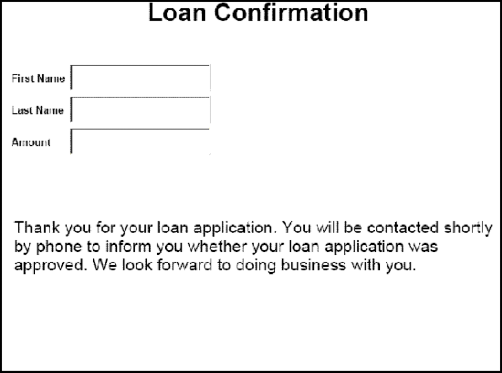

# Rendering di PDF forms interattivi {#rendering-interactive-pdf-forms}

**Esempi ed esempi in questo documento sono solo per AEM Forms in ambiente JEE.**

Il servizio Forms esegue il rendering dei PDF forms interattivi su dispositivi client, in genere browser web, per raccogliere informazioni dagli utenti. Una volta eseguito il rendering di un modulo interattivo, l’utente può immettere i dati nei campi del modulo e fare clic su un pulsante di invio situato nel modulo per inviare le informazioni al servizio Forms. Affinché sia visibile un modulo interattivo di PDF, è necessario installare Adobe Reader o Acrobat nel computer che ospita il browser Web client.

>[!NOTE]
>
>Prima di eseguire il rendering di un modulo utilizzando il servizio Forms, creare una struttura del modulo. In genere, una struttura del modulo viene creata in Designer e salvata come file XDP. Per informazioni sulla creazione di una struttura del modulo, vedere [Forms Designer](https://www.adobe.com/go/learn_aemforms_designer_63).

**Domanda di prestito di esempio**

Viene introdotta un’applicazione di prestito di esempio per dimostrare come il servizio Forms utilizza moduli interattivi per raccogliere informazioni dagli utenti. Questa applicazione consente a un utente di compilare un modulo con i dati necessari per garantire un prestito e quindi di inviare i dati al servizio Forms. Il diagramma seguente illustra il flusso logico dell&#39;applicazione di prestito.


La tabella seguente descrive i passaggi descritti in questo diagramma.

<table>
 <thead>
  <tr>
   <th><p>Incremento</p></th>
   <th><p>Descrizione</p></th>
  </tr>
 </thead>
 <tbody>
  <tr>
   <td><p>1</p></td>
   <td><p>La <code>GetLoanForm</code> Java Servlet viene richiamato da una pagina HTML. </p></td>
  </tr>
  <tr>
   <td><p>2</p></td>
   <td><p>La <code>GetLoanForm</code> Java Servlet utilizza l’API client del servizio Forms per eseguire il rendering del modulo di prestito sul browser web del cliente. (Vedi <a href="#render-an-interactive-pdf-form-using-the-java-api">Eseguire il rendering di un modulo PDF interattivo utilizzando l’API Java</a>.)</p></td>
  </tr>
  <tr>
   <td><p>3</p></td>
   <td><p>Una volta compilato il modulo di prestito e fatto clic sul pulsante di invio, i dati vengono inviati al <code>HandleData</code> Servlet Java. (Vedi <i>"Modulo di prestito"</i>.)</p></td>
  </tr>
  <tr>
   <td><p>4</p></td>
   <td><p>La <code>HandleData</code> Java Servlet utilizza l’API client del servizio Forms per elaborare l’invio del modulo e recuperare i dati del modulo. I dati vengono quindi memorizzati in un database aziendale. (Vedi <a href="/help/forms/developing/handling-submitted-forms.md#handling-submitted-forms">Gestione di Forms inviati</a>.)</p></td>
  </tr>
  <tr>
   <td><p>5</p></td>
   <td><p>Viene eseguito il rendering di un modulo di conferma nel browser web. I dati, come il nome e il cognome dell’utente, vengono uniti al modulo prima di eseguirne il rendering. (Vedi <a href="/help/forms/developing/prepopulating-forms-flowable-layouts.md">Precompilazione di Forms con layout fluidi</a>.)</p></td>
  </tr>
 </tbody>
</table>

**Modulo di prestito**

Il presente modulo di prestito interattivo è reso dalla `GetLoanForm` Servlet Java.


**Modulo di conferma**

Questo modulo è reso dalla `HandleData` Servlet Java.



La `HandleData` Java Servlet precompila questo modulo con il nome e il cognome dell’utente e la quantità. Dopo la precompilazione, il modulo viene inviato al browser Web client. (Vedi [Precompilazione di Forms con layout fluidi](/help/forms/developing/prepopulating-forms-flowable-layouts.md))

**Servlet Java**

L&#39;applicazione di prestito di esempio è un esempio di un&#39;applicazione di servizio Forms che esiste come servlet Java. Un servlet Java è un programma Java in esecuzione su un server applicativo J2EE, ad esempio WebSphere, e contiene il codice API client del servizio Forms.

Il codice seguente mostra la sintassi di un servlet Java denominato GetLoanForm:

```java
     public class GetLoanForm extends HttpServlet implements Servlet {
         public void doGet(HttpServletRequest req, HttpServletResponse resp
         throws ServletException, IOException {

         }
         public void doPost(HttpServletRequest req, HttpServletResponse resp
         throws ServletException, IOException {

             }
```

Normalmente, non inserisci il codice API client del servizio Forms all&#39;interno di un server Java `doGet` o `doPost` metodo . È consigliabile posizionare questo codice all&#39;interno di una classe separata, creare un&#39;istanza della classe all&#39;interno della `doPost` metodo (o `doGet` e chiamare i metodi appropriati. Tuttavia, per la brevità del codice, gli esempi di codice in questa sezione sono limitati al minimo e gli esempi di codice sono inseriti nella sezione `doPost` metodo .

>[!NOTE]
>
>Per ulteriori informazioni sul servizio Forms, vedi [Riferimento servizi per AEM Forms](https://www.adobe.com/go/learn_aemforms_services_63).

**Riepilogo dei passaggi**

Per eseguire il rendering di un modulo PDF interattivo, effettuare le seguenti operazioni:

1. Includi file di progetto.
1. Creare un oggetto API client Forms.
1. Specificare i valori URI.
1. Allegare file al modulo (facoltativo).
1. Eseguire il rendering di un modulo PDF interattivo.
1. Scrivere il flusso di dati del modulo sul browser Web client.

**Includi file di progetto**

Includi i file necessari nel progetto di sviluppo. Se stai creando un&#39;applicazione client utilizzando Java, includi i file JAR necessari. Se utilizzi i servizi web, assicurati di includere i file proxy.

**Creare un oggetto API client Forms**

Prima di poter eseguire un’operazione API client di Forms Service a livello di programmazione, è necessario creare un oggetto API client Forms. Se utilizzi l’API Java, crea un `FormsServiceClient` oggetto. Se utilizzi l’API del servizio Web Forms, crea un `FormsService` oggetto.

**Specificare i valori URI**

È possibile specificare i valori URI richiesti dal servizio Forms per il rendering di un modulo. È possibile fare riferimento a una struttura del modulo salvata come parte di un&#39;applicazione Forms utilizzando il valore URI della directory principale del contenuto `repository:///`. Ad esempio, considerare la seguente struttura del modulo denominata *Loan.xdp* all&#39;interno di un&#39;applicazione Forms denominata *FormsApplication*:


Per accedere alla struttura del modulo, specificare `Applications/FormsApplication/1.0/FormsFolder/Loan.xdp` come nome del modulo (il primo parametro trasmesso al `renderPDFForm` e `repository:///` come valore URI della directory principale del contenuto.

>[!NOTE]
>
>Per informazioni sulla creazione di un&#39;applicazione Forms tramite Workbench, consulta [Guida di Workbench](https://www.adobe.com/go/learn_aemforms_workbench_63).

Il percorso di una risorsa situata in un&#39;applicazione Forms è:

`Applications/Application-name/Application-version/Folder.../Filename`

I seguenti valori mostrano alcuni esempi di valori URI:

* Applications/AppraisalReport/1.0/Forms/FullForm.xdp
* Applications/AnotherApp/1.1/Assets/picture.jpg
* Applications/SomeApp/2.0/Resources/Data/XSDs/MyData.xsd

Quando si esegue il rendering di un modulo interattivo, è possibile definire valori URI, ad esempio l’URL di destinazione in cui vengono inviati i dati del modulo. L’URL di destinazione può essere definito in uno dei seguenti modi:

* Pulsante Invia durante la progettazione della struttura del modulo in Designer
* Utilizzando l’API client del servizio Forms

Se l’URL di destinazione è definito all’interno della struttura del modulo, non sostituirlo con l’API client del servizio Forms. In altre parole, l’impostazione dell’URL di destinazione tramite l’API Forms reimposta l’URL specificato nella struttura del modulo su quello specificato utilizzando l’API. Se si desidera inviare il modulo PDF all’URL di destinazione specificato nella struttura del modulo, impostare programmaticamente l’URL di destinazione su una stringa vuota.

Se si dispone di un modulo che contiene un pulsante di invio e un pulsante di calcolo (con uno script corrispondente eseguito sul server), è possibile definire a livello di programmazione l’URL al quale viene inviato il modulo per eseguire lo script. Utilizzare il pulsante di invio nella struttura del modulo per specificare l’URL a cui vengono inviati i dati del modulo. (Vedi [Calcolo dei dati del modulo](/help/forms/developing/calculating-form-data.md).)

>[!NOTE]
>
>Invece di specificare un valore URL per fare riferimento a un file XDP, puoi anche passare un `com.adobe.idp.Document` al servizio Forms. La `com.adobe.idp.Document` l’istanza contiene una struttura del modulo. (Vedi [Trasmissione di documenti al servizio Forms](/help/forms/developing/passing-documents-forms-service.md).)

**Allegare file al modulo**

È possibile allegare file a un modulo. Quando si esegue il rendering di un modulo PDF con allegati di file, gli utenti possono recuperare gli allegati di file in Acrobat utilizzando il riquadro allegato. È possibile allegare diversi tipi di file a un modulo, ad esempio un file di testo, o a un file binario come un file JPG.

>[!NOTE]
>
>L’allegato a un modulo di file è facoltativo.

**Rendering di un modulo PDF interattivo**

Per eseguire il rendering di un modulo, utilizzare una struttura del modulo creata in Designer e salvata come file XDP o PDF. È inoltre possibile eseguire il rendering di un modulo creato con Acrobat e salvato come file PDF. Per eseguire il rendering di un modulo PDF interattivo, richiamare l’ `FormsServiceClient` dell’oggetto `renderPDFForm` metodo o `renderPDFForm2` metodo .

La `renderPDFForm` utilizza `URLSpec` oggetto. La directory principale del contenuto del file XDP viene passata al servizio Forms utilizzando `URLSpec` dell’oggetto `setContentRootURI` metodo . Nome della struttura del modulo ( `formQuery`) viene passato come valore di parametro separato. I due valori vengono concatenati per ottenere il riferimento assoluto alla struttura del modulo.

La `renderPDFForm2` accetta un `com.adobe.idp.Document` istanza che contiene il documento XDP o PDF di cui eseguire il rendering.

>[!NOTE]
>
>Impossibile impostare l’opzione di esecuzione di PDF con tag se il documento di input è un documento di PDF. Se il file di input è un file XDP, è possibile impostare l’opzione PDF con tag.

## Eseguire il rendering di un modulo PDF interattivo utilizzando l’API Java {#render-an-interactive-pdf-form-using-the-java-api}

Eseguire il rendering di un modulo PDF interattivo utilizzando l’API Forms (Java):

1. Includi file di progetto

   Includi file JAR client, come adobe-forms-client.jar, nel percorso di classe del progetto Java.

1. Creare un oggetto API client Forms

   * Crea un `ServiceClientFactory` oggetto contenente le proprietà di connessione.
   * Crea un `FormsServiceClient` utilizzando il relativo costruttore e passando `ServiceClientFactory` oggetto.

1. Specificare i valori URI

   * Crea un `URLSpec` oggetto che memorizza i valori URI utilizzando il relativo costruttore.
   * Richiama il `URLSpec` dell’oggetto `setApplicationWebRoot` e passare un valore stringa che rappresenta la radice Web dell&#39;applicazione.
   * Richiama il `URLSpec` dell’oggetto `setContentRootURI` e passare un valore stringa che specifica il valore URI della directory principale del contenuto. Verificare che la struttura del modulo si trovi nell’URI della directory principale del contenuto. In caso contrario, il servizio Forms genera un&#39;eccezione. Per fare riferimento alla directory archivio, specificare `repository:///`.
   * Richiama il `URLSpec` dell’oggetto `setTargetURL` e passare un valore stringa che specifica il valore dell&#39;URL di destinazione in cui vengono inviati i dati del modulo. Se si definisce l’URL di destinazione nella struttura del modulo, è possibile passare una stringa vuota. È inoltre possibile specificare l’URL a cui viene inviato un modulo per eseguire i calcoli.

1. Allegare file al modulo

   * Crea un `java.util.HashMap` per memorizzare gli allegati di file utilizzando il relativo costruttore.
   * Richiama il `java.util.HashMap` dell’oggetto `put` metodo per ciascun file da allegare al modulo di cui è stato effettuato il rendering. Passa i seguenti valori a questo metodo:

      * Valore stringa che specifica il nome dell&#39;allegato del file, inclusa l&#39;estensione del nome file.
   * A `com.adobe.idp.Document` oggetto contenente l&#39;allegato del file.

   >[!NOTE]
   >
   >Ripetere questo passaggio per ogni file da allegare al modulo. Questo passaggio è facoltativo e può essere superato `null` se non si desidera inviare allegati di file.

1. Rendering di un modulo PDF interattivo

   Richiama il `FormsServiceClient` dell’oggetto `renderPDFForm` e passare i seguenti valori:

   * Valore stringa che specifica il nome della struttura del modulo, inclusa l&#39;estensione del nome file. Se si fa riferimento a una struttura del modulo che fa parte di un&#39;applicazione Forms, verificare di specificare il percorso completo, ad esempio `Applications/FormsApplication/1.0/FormsFolder/Loan.xdp`.
   * A `com.adobe.idp.Document` oggetto contenente i dati da unire al modulo. Se non si desidera unire i dati, passare un valore vuoto `com.adobe.idp.Document` oggetto.
   * A `PDFFormRenderSpec` oggetto che memorizza le opzioni di esecuzione. Si tratta di un parametro facoltativo ed è possibile specificare `null` se non si desidera specificare le opzioni di esecuzione.
   * A `URLSpec` oggetto che contiene i valori URI richiesti dal servizio Forms.
   * A `java.util.HashMap` oggetto che memorizza gli allegati di file. Si tratta di un parametro facoltativo ed è possibile specificare `null` se non si desidera allegare file al modulo.

   La `renderPDFForm` restituisce un `FormsResult` oggetto che contiene un flusso di dati del modulo che deve essere scritto nel browser Web client.

1. Scrivere il flusso di dati del modulo sul browser Web client

   * Crea un `com.adobe.idp.Document` richiamando l&#39;oggetto `FormsResult` oggetto ‘s `getOutputContent` metodo .
   * Ottieni il tipo di contenuto del `com.adobe.idp.Document` richiamandone l&#39;oggetto `getContentType` metodo .
   * Imposta la `javax.servlet.http.HttpServletResponse` tipo di contenuto dell’oggetto richiamandone il tipo `setContentType` e passare il tipo di contenuto `com.adobe.idp.Document` oggetto.
   * Crea un `javax.servlet.ServletOutputStream` oggetto utilizzato per scrivere il flusso di dati del modulo nel browser Web client richiamando il `javax.servlet.http.HttpServletResponse` dell’oggetto `getOutputStream` metodo .
   * Crea un `java.io.InputStream` richiamando l&#39;oggetto `com.adobe.idp.Document` dell’oggetto `getInputStream` metodo .
   * Creare un array di byte e compilarlo con il flusso di dati del modulo richiamando il `InputStream` dell’oggetto `read` e passare l&#39;array di byte come argomento.
   * Richiama il `javax.servlet.ServletOutputStream` dell’oggetto `write` per inviare il flusso di dati del modulo al browser Web client. Passa l&#39;array di byte al `write` metodo .

## Eseguire il rendering di un modulo PDF interattivo utilizzando l’API del servizio Web {#render-an-interactive-pdf-form-using-the-web-service-api}

Eseguire il rendering di un modulo PDF interattivo utilizzando l’API Forms (servizio Web):

1. Includi file di progetto

   * Creare classi proxy Java che utilizzano il servizio WSDL di Forms.
   * Includi le classi proxy Java nel percorso della classe.

1. Creare un oggetto API client Forms

   Crea un `FormsService` e impostare i valori di autenticazione.

1. Specificare i valori URI

   * Crea un `URLSpec` oggetto che memorizza i valori URI utilizzando il relativo costruttore.
   * Richiama il `URLSpec` dell’oggetto `setApplicationWebRoot` e passare un valore stringa che rappresenta la radice Web dell&#39;applicazione.
   * Richiama il `URLSpec` dell’oggetto `setContentRootURI` e passare un valore stringa che specifica il valore URI della directory principale del contenuto. Verificare che la struttura del modulo si trovi nell’URI della directory principale del contenuto. In caso contrario, il servizio Forms genera un&#39;eccezione. Per fare riferimento alla directory archivio, specificare `repository:///`.
   * Richiama il `URLSpec` dell’oggetto `setTargetURL` e passare un valore stringa che specifica il valore dell&#39;URL di destinazione in cui vengono inviati i dati del modulo. Se si definisce l’URL di destinazione nella struttura del modulo, è possibile passare una stringa vuota. È inoltre possibile specificare l’URL a cui viene inviato un modulo per eseguire i calcoli.

1. Allegare file al modulo

   * Crea un `java.util.HashMap` per memorizzare gli allegati di file utilizzando il relativo costruttore.
   * Richiama il `java.util.HashMap` dell’oggetto `put` metodo per ciascun file da allegare al modulo di cui è stato effettuato il rendering. Passa i seguenti valori a questo metodo:

      * Valore stringa che specifica il nome dell&#39;allegato del file, inclusa l&#39;estensione del nome file
   * A `BLOB` oggetto contenente l&#39;allegato del file

   >[!NOTE]
   >
   >Ripetere questo passaggio per ogni file da allegare al modulo.

1. Rendering di un modulo PDF interattivo

   Richiama il `FormsService` dell’oggetto `renderPDFForm` e passare i seguenti valori:

   * Valore stringa che specifica il nome della struttura del modulo, inclusa l&#39;estensione del nome file. Se si fa riferimento a una struttura del modulo che fa parte di un&#39;applicazione Forms, verificare di specificare il percorso completo, ad esempio `Applications/FormsApplication/1.0/FormsFolder/Loan.xdp`.
   * A `BLOB` oggetto contenente i dati da unire al modulo. Se non si desidera unire i dati, passare `null`.
   * A `PDFFormRenderSpec` oggetto che memorizza le opzioni di esecuzione. Si tratta di un parametro facoltativo ed è possibile specificare `null` se non si desidera specificare le opzioni di esecuzione.
   * A `URLSpec` oggetto che contiene i valori URI richiesti dal servizio Forms.
   * A `java.util.HashMap` oggetto che memorizza gli allegati di file. Si tratta di un parametro facoltativo ed è possibile specificare `null` se non si desidera allegare file al modulo.
   * Un vuoto `com.adobe.idp.services.holders.BLOBHolder` oggetto popolato dal metodo . Viene utilizzato per memorizzare il modulo PDF di cui è stato eseguito il rendering.
   * Un vuoto `javax.xml.rpc.holders.LongHolder` oggetto popolato dal metodo . Questo argomento memorizza il numero di pagine nel modulo.
   * Un vuoto `javax.xml.rpc.holders.StringHolder` oggetto popolato dal metodo . Questo argomento memorizza il valore delle impostazioni internazionali.
   * Un vuoto `com.adobe.idp.services.holders.FormsResultHolder` oggetto che conterrà i risultati dell&#39;operazione.

   La `renderPDFForm` popola il `com.adobe.idp.services.holders.FormsResultHolder` oggetto passato come ultimo valore argomento con un flusso di dati del modulo che deve essere scritto nel browser Web client.

1. Scrivere il flusso di dati del modulo sul browser Web client

   * Crea un `FormResult` ottenendo il valore del `com.adobe.idp.services.holders.FormsResultHolder` dell’oggetto `value` membro dati.
   * Crea un `BLOB` oggetto che contiene i dati del modulo richiamando il `FormsResult` dell’oggetto `getOutputContent` metodo .
   * Ottieni il tipo di contenuto del `BLOB` richiamandone l&#39;oggetto `getContentType` metodo .
   * Imposta la `javax.servlet.http.HttpServletResponse` tipo di contenuto dell’oggetto richiamandone il tipo `setContentType` e passare il tipo di contenuto `BLOB` oggetto.
   * Crea un `javax.servlet.ServletOutputStream` oggetto utilizzato per scrivere il flusso di dati del modulo nel browser Web client richiamando il `javax.servlet.http.HttpServletResponse` dell’oggetto `getOutputStream` metodo .
   * Creare un array di byte e compilarlo richiamando il `BLOB` dell’oggetto `getBinaryData` metodo . Questa attività assegna il contenuto del `FormsResult` all&#39;array di byte.
   * Richiama il `javax.servlet.http.HttpServletResponse` dell’oggetto `write` per inviare il flusso di dati del modulo al browser Web client. Passa l&#39;array di byte al `write` metodo .

**Scrivere il flusso di dati del modulo sul browser Web client**

Quando il servizio Forms esegue il rendering di un modulo, restituisce un flusso di dati del modulo che è necessario scrivere nel browser Web client. Una volta scritto nel browser Web client, il modulo è visibile all’utente.
