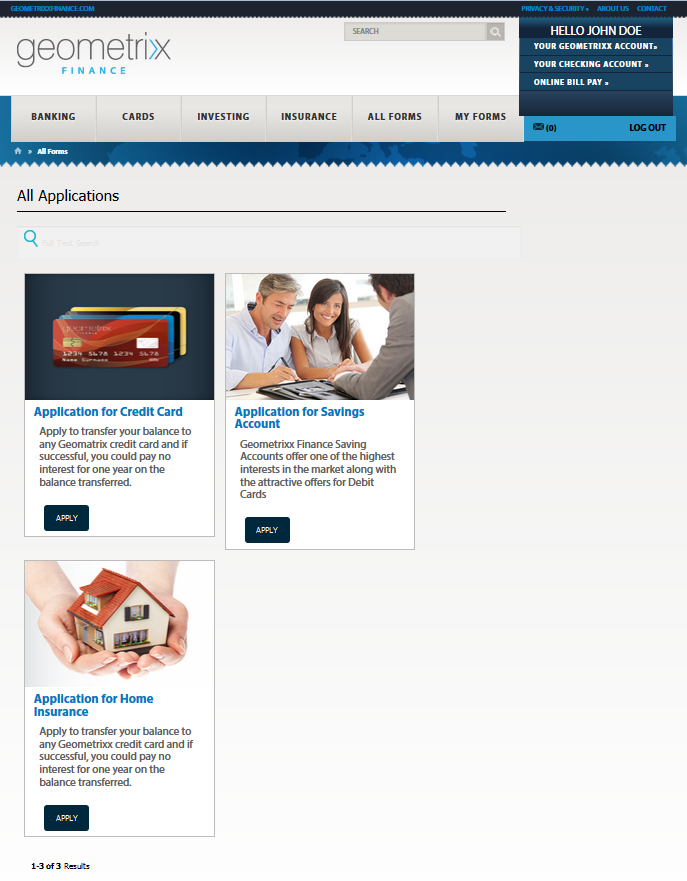
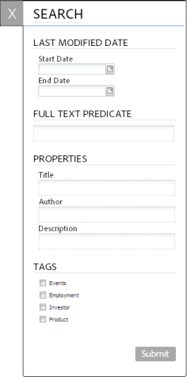

# Accesso e compilazione di moduli pubblicati{#accessing-and-filling-published-forms}

In una configurazione della distribuzione del portale incentrata sui moduli, lo sviluppo dei moduli e lo sviluppo del portale sono due attività distinte. Mentre i progettisti di moduli progettano e memorizzano i moduli in un repository, gli sviluppatori Web creano un&#39;applicazione Web per l&#39;elenco dei moduli e gestiscono gli invii. Forms viene quindi copiato sul livello web in quanto non vi è alcuna comunicazione tra l’archivio Forms e l’applicazione web.

Questo causa spesso problemi nella gestione della configurazione e ritardi nella produzione. Ad esempio, se nel repository è disponibile una versione più recente di un modulo, il progettista del modulo sostituisce il modulo sul livello Web, modifica l&#39;applicazione Web e ridistribuisce il modulo sul sito pubblico. La ridistribuzione dell’applicazione web può causare tempi di inattività del server. Poiché il tempo di inattività del server è un&#39;attività pianificata, le modifiche non possono essere inviate immediatamente al sito pubblico.

Forms Portal riduce i costi generali di gestione e i ritardi di produzione. Fornisce agli sviluppatori web i componenti necessari per creare e personalizzare un portale dei moduli su siti web creati con Adobe Experience Manager (AEM).

Per ulteriori informazioni sul portale Forms e sulle relative funzioni, consulta [Introduzione alla pubblicazione di moduli su un portale](/help/forms/using/introduction-publishing-forms.md).

## Guida introduttiva al portale dei moduli {#getting-started-with-forms-portal}

Passare alla pagina pubblicata del portale dei moduli. Per ulteriori informazioni sulla creazione di una pagina del portale dei moduli, vedere [Creazione di una pagina del portale dei moduli](../../forms/using/creating-form-portal-page.md).

Il componente Ricerca ed elenco del portale rom visualizza i moduli disponibili nell’istanza Publish del server AEM. Questo elenco include tutti i moduli o i moduli definiti nel filtro al momento della creazione della pagina del portale dei moduli. Una pagina del portale dei moduli ha un aspetto simile a quello mostrato nell&#39;immagine seguente:

Esempio di pagina del portale dei moduli

### Ricerca ed elenco {#search-and-lister}

Il componente Ricerca ed elenco consente di aggiungere le seguenti funzionalità al portale dei moduli:

* Elenca i moduli disponibili come predefiniti in visualizzazione pannello, scheda o griglia. Supporta anche modelli personalizzatiElenca i moduli da cartelle specifiche in Forms Manager.
* Specifica come viene eseguito il rendering dei moduli: HTML5, PDF o entrambi.
* Specifica come viene eseguito il rendering dei moduli PDF e XFA: HTML5, PDF o entrambi. Moduli non XFA come HTML5.
* Consente di cercare i moduli in base a criteri quali proprietà, metadati e tag.
* Invia i dati del modulo a un servlet.
* Utilizza i fogli di stile personalizzati (CSS) per personalizzare l’aspetto del portale.
* Creare collegamenti ai moduli.

È possibile cercare i moduli nella pagina Forms Portal utilizzando le opzioni seguenti:

* Ricerca full-text
* Ricerca avanzata

La ricerca full-text consente di trovare ed elencare i moduli in base alle parole chiave specificate.

Finestra di dialogo di ricerca avanzata

La funzione Ricerca avanzata consente di cercare i moduli in base alle proprietà specificate. Questo fornisce risultati più specifici rispetto alla ricerca full-text. La ricerca avanzata include ricerche basate su tag, proprietà (ad esempio Autore, Descrizione e Titolo), data di modifica e testo completo.

L’elenco mostra i moduli basati sui parametri di ricerca. Ogni modulo incluso nei risultati della ricerca viene visualizzato con un&#39;icona, che è collegata al modulo associato. È possibile fare clic sull&#39;icona per aprire e utilizzare il modulo associato.

### Compilazione di un modulo {#filling-a-form}

Un esempio di modulo adattivo

È possibile accedere ai moduli dal collegamento fornito insieme al modulo nel componente Ricerca ed elenco della pagina.

Ogni modulo contiene informazioni della Guida che consentono a un utente di compilare il modulo.

#### Bozze e invio {#drafts-and-submission}

L’utente può salvare una bozza di un modulo facendo clic sul pulsante Salva. In questo modo l’utente può lavorare su un modulo per un certo periodo di tempo prima di inviarlo.

I dati compilati nel modulo (inclusi gli allegati) vengono salvati come bozza sul server. La bozza di un modulo può essere salvata un numero qualsiasi di volte. Il modulo salvato viene visualizzato nella scheda Bozze del componente Bozza e invio della pagina.

Al termine della compilazione del modulo, l’utente invia i moduli facendo clic sul pulsante Invia nel modulo. I moduli inviati vengono visualizzati nella scheda Invii del componente Bozza e invio della pagina.

>[!NOTE]
>
>I moduli inviati vengono visualizzati nella scheda Forms inviati solo se l’azione di invio per il modulo adattivo è configurata come azione di invio di Forms Portal. Per ulteriori informazioni sulle azioni di invio, vedi [Configurazione dell’azione Invia](../../forms/using/configuring-submit-actions.md).

Componente Bozze e invii

## Avviare un nuovo modulo utilizzando i dati del modulo inviati {#start-a-new-form-using-submitted-form-data}

Alcuni moduli devono essere compilati e inviati molto spesso. Ad esempio, il modulo per la presentazione della dichiarazione dei redditi individuale viene inviato ogni anno. In questi casi, mentre alcune informazioni cambiano ogni volta che si compila il modulo, la maggior parte di esse, come i dati personali e familiari, non cambiano. Tuttavia, è necessario compilare nuovamente l&#39;intero modulo da zero.

AEM Forms può contribuire a ottimizzare l’esperienza di compilazione dei moduli e a ridurre in modo significativo il tempo necessario per compilare e inviare nuovamente un modulo. Gli utenti finali possono avviare un nuovo modulo utilizzando i dati di un modulo inviato. Questa funzionalità è incorporata nel [Componente Bozze e invii](../../forms/using/draft-submission-component.md). Quando si aggiungono bozze e il componente Invio alla pagina del portale dei moduli e la si pubblica, gli utenti finali troveranno un’opzione nelle schede Forms e Forms bozze inviate per avviare un nuovo modulo utilizzando i dati di un modulo inviato. L’immagine seguente evidenzia tale opzione.

Quando si fa clic sul pulsante per avviare un nuovo modulo, viene aperto un nuovo modulo con i dati del modulo inviato corrispondente. È ora possibile rivedere e aggiornare le informazioni, in base alle esigenze, e inviare il modulo.
