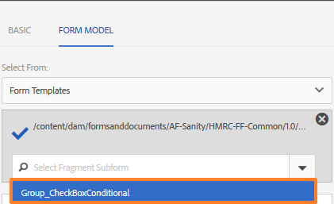

# Frammenti di moduli adattivi{#adaptive-form-fragments}

| Versione | Collegamento articolo |
| -------- | ---------------------------- |
| AEM as a Cloud Service | [Fai clic qui](https://experienceleague.adobe.com/docs/experience-manager-cloud-service/content/forms/adaptive-forms-authoring/authoring-adaptive-forms-core-components/create-an-adaptive-form-on-forms-cs/adaptive-form-fragments-core-components.html?lang=it) |
| AEM 6.5 | Questo articolo |

 Adobe consiglia di utilizzare l&#39;acquisizione dati moderna ed estensibile [Componenti core](https://experienceleague.adobe.com/docs/experience-manager-core-components/using/adaptive-forms/introduction.html?lang=it) per [la creazione di un nuovo Forms adattivo](/help/forms/using/create-an-adaptive-form-core-components.md) o [l&#39;aggiunta di Forms adattivo alle pagine AEM Sites](/help/forms/using/create-or-add-an-adaptive-form-to-aem-sites-page.md). Questi componenti rappresentano un progresso significativo nella creazione di Forms adattivi, garantendo esperienze utente straordinarie. Questo articolo descrive un approccio precedente all’authoring di Forms adattivi utilizzando i componenti di base. 

Anche se ogni modulo è progettato per uno scopo specifico, nella maggior parte dei moduli sono presenti alcuni segmenti comuni, ad esempio per fornire dettagli personali come nome e indirizzo, dettagli sulla famiglia e dettagli sul reddito. Gli sviluppatori di moduli devono creare questi segmenti comuni ogni volta che viene creato un nuovo modulo.

I moduli adattivi forniscono un meccanismo pratico per creare segmenti di modulo una sola volta, come un pannello o un gruppo di campi, e riutilizzarli nei moduli adattivi. Questi segmenti riutilizzabili e autonomi sono denominati frammenti di moduli adattivi.

>[!NOTE]
>
> È possibile personalizzare facilmente l&#39;esperienza del frammento per gli utenti mediante la finestra di dialogo Configura e la [finestra di dialogo Progettazione del componente](https://experienceleague.adobe.com/docs/experience-manager-core-components/using/adaptive-forms/adaptive-forms-components/form-fragment.html) Frammento di modulo.

## Creare un frammento {#create-a-fragment}

Potete creare un frammento di modulo adattivo da zero o salvare un pannello in un modulo adattivo esistente come frammento.

### Crea frammento da zero {#create-fragment-from-scratch}

1. Accedi all&#39;istanza di authoring di AEM Forms all&#39;indirizzo https://[*hostname*]:[*port*]/aem/forms.html.
1. Fai clic su **Crea > Frammento modulo adattivo**.
1. Specifica titolo, nome, descrizione e tag per il frammento.

   >[!NOTE]
   >
   >Assicurati di specificare un nome univoco per il frammento. Se esiste un altro frammento con lo stesso nome, la creazione del frammento non riesce.

1. Fai clic per aprire la scheda **Modello modulo** e dal menu a discesa **Seleziona da** seleziona uno dei seguenti modelli per il frammento:

   * **Nessuno**: specifica di creare il frammento da zero senza utilizzare alcun modello di modulo.

     >[!NOTE]
     >
     > In Forms adattivo basato su componenti core, è possibile utilizzare più volte un singolo frammento di modulo in un modulo. Supporta sia frammenti di modulo basati su nessuno che frammenti di modulo basati su schema.

   * **Modello modulo**: specifica di creare il frammento utilizzando un modello XDP caricato in AEM Forms. Seleziona il modello XDP appropriato come modello di modulo per il frammento.

   

   Vengono visualizzati anche i sottomoduli contrassegnati come frammenti nel modello di modulo selezionato. Puoi selezionare un sottomodulo per il frammento di modulo adattivo dall’elenco a discesa.

   

   È inoltre possibile creare un frammento di modulo adattivo utilizzando sottomoduli non contrassegnati come frammenti nel modello di modulo specificando l’espressione SOM per il sottomodulo nella casella a discesa.

   * **Schema XML**: specifica di creare il frammento utilizzando uno schema XML caricato in AEM Forms. Puoi caricare o selezionare dagli schemi XML disponibili come modello di modulo per il frammento.

   

   Puoi anche creare un frammento di modulo adattivo selezionando dalla casella a discesa un complexType presente nello schema selezionato.

   

1. Fai clic su **Crea**, quindi su **Apri** per aprire il frammento, con un modello predefinito, in modalità di modifica.

In modalità di modifica puoi trascinare e rilasciare qualsiasi componente del modulo adattivo dalla barra laterale AEM sul frammento. Per informazioni sui componenti dei moduli adattivi, consulta [Introduzione alla creazione di moduli adattivi](../../forms/using/introduction-forms-authoring.md).

Inoltre, se hai selezionato uno schema XML o un modello di modulo XDP come modello di modulo per il frammento, nel Finder contenuto viene visualizzata una nuova scheda che mostra la gerarchia del modello di modulo. Consente di trascinare gli elementi del modello di modulo sul frammento. Gli elementi del modello modulo aggiunti vengono convertiti in componenti modulo mantenendo le proprietà originali dell’XDP o XSD associato.

### Salvare il pannello come frammento {#save-panel-as-a-fragment}

1. Apri un modulo adattivo contenente il pannello da salvare come frammento di modulo adattivo.
1. Nella barra degli strumenti del pannello, fai clic su **[!UICONTROL Salva come frammento]**. Viene visualizzata la finestra di dialogo Salva come frammento (Save As Fragment).

   >[!NOTE]
   >
   >Se il pannello che state salvando come frammento contiene un pannello figlio, il frammento risultante lo include.

1. Nella finestra di dialogo Creazione frammento, specifica le seguenti informazioni:

   * **Nome**: nome del frammento. Il valore predefinito è il nome dell’elemento del pannello. È un campo obbligatorio.

     >[!NOTE]
     >
     >Assicurati di specificare un nome univoco per il frammento. Se esiste un altro frammento con lo stesso nome, la creazione del frammento non riesce.

   * **Titolo**: titolo del frammento. Il valore predefinito è il titolo del pannello.

   * **Descrizione**: descrizione del frammento.

   * **Tag**: metadati dei tag per il frammento.

   * **Percorso di destinazione**: percorso dell&#39;archivio in cui viene salvato il frammento. Se non specifichi un percorso, viene creato un nodo con lo stesso nome del frammento accanto al nodo contenente il modulo adattivo. Il frammento viene salvato in questo nodo.

   * **Modello modulo**: a seconda del modello del modulo adattivo, in questo campo viene visualizzato **Schema XML**, **Modello modulo** o **Nessuno**. È un campo non modificabile.

   * **Radice modello frammento**: viene visualizzata solo nei moduli adattivi basati su XSD. Specifica la directory principale del modello per frammenti. È possibile scegliere **/** o il tipo complesso XSD dal menu a discesa. Puoi riutilizzare il frammento in un altro modulo adattivo solo se selezioni il tipo complesso come radice del modello di frammento.
Se scegli **/** come radice del modello di frammento, la struttura XSD completa dalla radice è visibile nella scheda del modello dati del modulo adattivo. Per una directory principale del modello di frammento di tipo complesso, nella scheda del modello dati del modulo adattivo sono visibili solo i discendenti del tipo complesso selezionato. Se si crea un frammento e si sceglie un tipo complesso come **Radice modello frammento**, è possibile utilizzarlo ovunque venga utilizzato quel tipo complesso, all&#39;interno dello stesso modulo o in più moduli.

   * **Rif. XSD**: viene visualizzato solo nei moduli adattivi basati su XSD. Viene visualizzata la posizione dello schema XML.

   * **Rif. XDP**: viene visualizzato solo nei moduli adattivi basati su XDP. Viene visualizzata la posizione del modello di modulo XDP.

   

   Finestra di dialogo Salva come frammento

1. Fai clic su **OK**.

   Il pannello viene salvato nella posizione specificata o predefinita nella archivio. Nel modulo adattivo, il pannello è sostituito da un&#39;istantanea del frammento. Come mostrato di seguito, il pannello Informazioni generali e i relativi pannelli secondari, Informazioni personali e Indirizzo, vengono salvati come frammento.

   Per modificare il frammento, fai clic su **[!UICONTROL Modifica risorsa]** nella barra degli strumenti del pannello. Il frammento viene aperto in una nuova scheda o finestra in modalità di modifica.

   

## Utilizzo dei frammenti {#working-with-fragments}

### Configurare l&#39;aspetto del frammento {#configure-fragment-appearance}

Qualsiasi frammento inserito nei moduli adattivi viene visualizzato come immagine segnaposto. Nel segnaposto vengono visualizzati titoli fino a un massimo di dieci pannelli secondari nel frammento. È possibile configurare AEM Forms in modo da visualizzare il frammento completo anziché l&#39;immagine segnaposto.

Eseguire le operazioni seguenti per visualizzare frammenti completi nei moduli:

1. Vai alla pagina di configurazione AEM console web all&#39;indirizzo https:[*host:[* porta *]*]/system/console/configMgr.

1. Search e seleziona **[!UICONTROL Configurazione]** canale web modulo adattivo e comunicazione interattiva per aprirlo in modalità di modifica.
1. Disabilita la casella di controllo **[!UICONTROL Abilita segnaposto al posto della casella di controllo Frammento]** per visualizzare frammenti completi anziché l&#39;immagine segnaposto.

### Inserire un frammento in un modulo adattivo {#insert-a-fragment-in-an-adaptive-form}

I frammenti di modulo adattivi creati vengono visualizzati nella scheda Frammenti di modulo adattivi del Content Finder AEM. Per inserire un frammento di modulo adattivo in un modulo adattivo:

1. Apri il modulo adattivo, in modalità di modifica, in cui desideri inserire un frammento di modulo adattivo.
1. Fai clic su **Assets**  nella barra laterale. Nel browser Risorse, seleziona **Frammenti di moduli adattivi** dal menu a discesa.

   È inoltre possibile scegliere di visualizzare tutti i frammenti di modulo adattivi o di filtrare in base al modello di modulo, ovvero Modello di modulo, Schema XML o Base.

1. Trascina un frammento di modulo adattivo nel modulo adattivo.

   >[!NOTE]
   >
   >Il frammento di modulo adattivo non è abilitato per la creazione dall’interno del modulo adattivo. Inoltre, non è possibile utilizzare un frammento basato su XSD in un modulo adattivo basato su JSON e viceversa.

Il frammento di modulo adattivo viene inserito per riferimento nel modulo adattivo e sincronizzato con il frammento di modulo adattivo autonomo. Ciò significa che quando aggiorni il frammento di modulo adattivo, le modifiche si riflettono in tutti i moduli adattivi in cui viene utilizzato il frammento.

### Incorporare un frammento in un modulo adattivo {#embed-a-fragment-in-adaptive-form}

Puoi scegliere di incorporare un frammento di modulo adattivo in un modulo adattivo facendo clic sul pulsante **Incorpora risorsa: &lt;*fragmentName*>** nella barra degli strumenti del pannello del frammento aggiunto, come illustrato nell’immagine di esempio seguente.

>[!NOTE]
>
>Il frammento incorporato non è più collegato al frammento autonomo. Puoi modificare i componenti nel frammento incorporato direttamente dal modulo adattivo.

### Utilizzo di frammenti all’interno di frammenti {#using-fragments-within-fragments}

Puoi creare frammenti di modulo adattivi nidificati, il che significa che puoi trascinare un frammento all’interno di un altro frammento e disporre di una struttura di frammenti nidificata.

### Modifica frammenti {#change-fragments}

È possibile sostituire o modificare un frammento di modulo adattivo con un altro frammento utilizzando la proprietà **Seleziona risorsa frammento** nella finestra di dialogo Modifica componente per un pannello di frammento di modulo adattivo.

### Genera documento di record per frammento di modulo adattivo {#generate-DOR-for-fragments}

Documento di record (DOR) consente di conservare le informazioni dei moduli in formato di stampa o documento. In questo modo è possibile tenere traccia delle informazioni sui clienti in qualsiasi momento e utilizzare il documento di record per archiviare moduli e contenuti in formato PDF. [Scopri come generare un documento di record per i frammenti del modulo adattivo](/help/forms/using/generate-document-of-record-for-non-xfa-based-adaptive-forms.md).

### Utilizzo di un frammento di modulo più volte in un modulo adattivo {#using-form-fragment-mutiple-times-in-af}

È possibile utilizzare più volte un frammento di modulo basato su schema in un modulo adattivo per salvare i dati in modo univoco per ogni campo del frammento di modulo. Ad esempio, puoi utilizzare un frammento di modulo indirizzo per raccogliere i dettagli dell’indirizzo per indirizzi permanenti, di comunicazione e di presentazione in un modulo di richiesta di prestito.

>[!NOTE]
>
> * Se in un modulo adattivo utilizzi più volte frammenti di modulo non basati su, si verifica la sincronizzazione dei dati tra i campi dei frammenti. Il problema di sincronizzazione dei dati non si verifica nei frammenti di modulo basati su componenti core, in cui è possibile utilizzare più volte un frammento basato su schema o nessuno in un modulo.

## Mappatura automatica dei frammenti per l’associazione dati {#auto-mapping-of-fragments-for-data-binding}

Quando crei un frammento di modulo adattivo utilizzando un modello di modulo XFA o un tipo complesso XSD e trascini il frammento in un modulo adattivo, il frammento XFA o il tipo complesso XSD viene sostituito automaticamente dal frammento di modulo adattivo corrispondente la cui radice del modello di frammento è mappata al frammento XFA o al tipo complesso XSD.

Puoi modificare la risorsa del frammento e i relativi binding dalla finestra di dialogo Modifica componente.

>[!NOTE]
>
>Puoi anche trascinare un frammento di modulo adattivo associato dalla libreria Frammento di modulo adattivo in AEM content finder e fornire il riferimento di associazione corretto dalla finestra di dialogo Modifica componente del pannello Frammento di modulo adattivo.

## Gestire i frammenti {#manage-fragments}

Puoi eseguire diverse operazioni sui frammenti di moduli adattivi utilizzando l’interfaccia utente di AEM Forms.

1. Passa a `https://[hostname]:'port'/aem/forms.html`.

1. Fai clic su **Seleziona** nella barra degli strumenti dell&#39;interfaccia utente di AEM Forms e seleziona un frammento di modulo adattivo. La barra degli strumenti mostra le seguenti operazioni che è possibile eseguire sul frammento di modulo adattivo selezionato.

<table>
 <tbody>
  <tr>
   <td>
<strong>Operazione</strong>
 </td>
   <td>
<strong>Descrizione</strong>
 </td>
  </tr>
  <tr>
   <td>
Apri
 </td>
   <td>
Apre il frammento di modulo adattivo selezionato in modalità di modifica.    
 </td>
  </tr>
  <tr>
   <td>
Visualizza proprietà
 </td>
   <td>
Apre il pannello Proprietà. Dal pannello Proprietà puoi visualizzare e modificare le proprietà, generare un’anteprima e caricare un’immagine in miniatura per il frammento selezionato. Per ulteriori informazioni, vedere <a href="../../forms/using/manage-form-metadata.md" target="_blank">Gestione dei metadati</a>.    
 </td>
  </tr>
  <tr>
   <td>
Copiare
 </td>
   <td>
Copia il frammento selezionato. Il pulsante Incolla viene visualizzato nella barra degli strumenti.    
 </td>
  </tr>
  <tr>
   <td>
Scarica
 </td>
   <td>
Scarica il frammento selezionato.    
 </td>
  </tr>
  <tr>
   <td>
Anteprima
 </td>
   <td>
Fornisce opzioni per visualizzare in anteprima il frammento come HTML o come anteprima personalizzata unendo i dati di un file XML con il frammento. Per ulteriori informazioni, vedere <a href="/help/forms/using/previewing-forms.md" target="_blank">Anteprima di un modulo</a>.    
 </td>
  </tr>
  <tr>
   <td>
Inizia revisione/gestione revisione
 </td>
   <td>
Consente di avviare e gestire una revisione del frammento selezionato. Per ulteriori informazioni, vedere <a href="../../forms/using/create-reviews-forms.md" target="_blank">Creazione e gestione delle revisioni</a>.    
 </td>
  </tr>
  <tr>
   <td>
Crea dizionario
 </td>
   <td>
Genera un dizionario per la localizzazione del frammento selezionato. Per ulteriori informazioni, vedere <a href="/help/forms/using/lazy-loading-adaptive-forms.md" target="_blank">Localizzazione dei moduli adattivi</a>.    
 </td>
  </tr>
  <tr>
   <td>
Publish / Annulla pubblicazione
 </td>
   <td>
Pubblica/annulla la pubblicazione del frammento selezionato.    
 </td>
  </tr>
  <tr>
   <td>
Elimina
 </td>
   <td>
Elimina il frammento selezionato.    
 </td>
  </tr>
 </tbody>
</table>

## Localizzazione di un modulo adattivo contenente frammenti {#localizing-adaptive-form-containing-fragments}

Per localizzare un modulo adattivo che contiene frammenti di modulo adattivo, è necessario localizzare separatamente il frammento e il modulo. L’idea è quella di localizzare un frammento una volta e riutilizzarlo in più moduli adattivi.

>[!NOTE]
>
>Le chiavi di localizzazione nel frammento non vengono visualizzate nel file XLIFF per un modulo adattivo.

## Punti chiave da ricordare quando si lavora con i frammenti {#key-points-to-remember-when-working-with-fragments}

* Assicurati che il nome del frammento sia univoco. Il frammento non viene creato se è presente un frammento con lo stesso nome.
* In un modulo adattivo basato su XDP, se salvi un pannello come frammento che include un altro frammento XDP, il frammento risultante viene associato automaticamente al frammento XDP secondario. Se è presente un modulo adattivo basato su XSD, il frammento risultante è associato alla directory principale dello schema.
* Quando si crea un frammento di modulo adattivo, in CRXDE Lite viene creato un nodo di frammento simile al nodo guideContainer di un modulo adattivo.
* Un frammento in un modulo adattivo che utilizza un modello dati modulo diverso non è supportato. Ad esempio, un frammento basato su XDP non è supportato in un modulo adattivo basato su XSD e viceversa.
* I frammenti di modulo adattivi sono disponibili per l’utilizzo tramite la scheda Frammenti di modulo adattivi nel Finder di contenuti AEM.
* Qualsiasi espressione, script o stile in un frammento di modulo adattivo indipendente viene mantenuto quando viene inserito tramite riferimento o incorporato in un modulo adattivo.
* Non è possibile modificare un frammento di modulo adattivo, inserito per riferimento, dall’interno di un modulo adattivo. Per apportare modifiche, puoi modificare il frammento di modulo adattivo autonomo o incorporarlo nel modulo adattivo.
* Quando si pubblicare un modulo adattivo, è necessario pubblicare i frammenti di modulo adattivo autonomi inseriti per riferimento nel modulo adattivo.
* Quando si ripubblica un frammento di modulo adattivo aggiornato, le modifiche si riflettono nelle istanze pubblicate del modulo adattivo in cui viene utilizzato il frammento.
* Il modulo adattivo contenente il componente Verifica non supporta gli utenti anonimi. Inoltre, non è consigliabile utilizzare il componente Verifica in un frammento di modulo adattivo.
* (**Solo Mac**) Per garantire che la funzionalità dei frammenti di modulo funzioni perfettamente in tutti gli scenari, aggiungere la seguente voce al file /private/etc/hosts:
  `127.0.0.1 <Host machine>` **Computer host**: computer Apple Mac in cui è distribuito AEM Forms.

## Frammenti di riferimento {#reference-fragments}

Sono disponibili frammenti di modulo adattivi di riferimento che è possibile utilizzare per creare il modulo. Per ulteriori informazioni, vedere [Frammenti di riferimento](../../forms/using/reference-adaptive-form-fragments.md).
