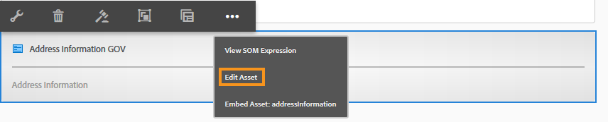

# Frammenti di moduli adattivi{#adaptive-form-fragments}

Sebbene ogni modulo sia progettato per uno scopo specifico, nella maggior parte dei moduli sono presenti alcuni segmenti comuni, ad esempio per fornire dettagli personali come nome e indirizzo, dati sulla famiglia, dettagli sul reddito e così via. Gli sviluppatori di moduli devono creare questi segmenti comuni ogni volta che viene creato un nuovo modulo.

I moduli adattivi consentono di creare segmenti di modulo come un pannello o un gruppo di campi una sola volta e di riutilizzarli nei moduli adattivi. Questi segmenti riutilizzabili e standalone sono denominati frammenti di modulo adattivi.

## Creazione di un frammento {#create-a-fragment}

È possibile creare un frammento di modulo adattivo da zero o salvare un pannello in un modulo adattivo esistente come frammento.

### Crea frammento da zero {#create-fragment-from-scratch}

1. Accedete &#39;istanza di creazione AEM Forms all&#39;indirizzo https://[*hostname*]:[*port*]/aem/forms.html.
1. Fare clic su **Crea > Frammento modulo adattivo**.
1. Specificare titolo, nome, descrizione e tag per il frammento.

   >[!NOTE]
   >
   >Assicurarsi di specificare un nome univoco per il frammento. Se esiste già un altro frammento con lo stesso nome, la creazione del frammento non riesce.

1. Fare clic per aprire la scheda **Modello modulo** e, dal menu a discesa **Seleziona da**, selezionare uno dei seguenti modelli per il frammento:

   * **Nessuno**: Specifica di creare il frammento da zero senza utilizzare alcun modello di modulo.
   * **Modello** modulo: Specifica se creare il frammento utilizzando un modello XDP caricato su  AEM Forms. Selezionare il modello XDP appropriato come modello di modulo per il frammento.

   

   Vengono visualizzati anche i sottomoduli contrassegnati come frammenti nel modello di modulo selezionato. È possibile selezionare un sottomodulo per un frammento di modulo adattivo dall&#39;elenco a discesa.

   

   È inoltre possibile creare un frammento di modulo adattivo utilizzando sottomoduli non contrassegnati come frammenti nel modello di modulo, specificando l&#39;espressione SOM per il sottomodulo nella casella a discesa.

   * **Schema** XML: Specifica la creazione del frammento utilizzando uno schema XML caricato in  AEM Forms. È possibile caricare o selezionare gli schemi XML disponibili come modello di modulo per il frammento.

   

   È inoltre possibile creare un frammento di modulo adattivo selezionando dall&#39;elenco a discesa un tipo complesso presente nello schema selezionato.

   

1. Fare clic su **Crea**, quindi su **Apri** per aprire il frammento, con un modello predefinito, in modalità di modifica.

In modalità di modifica, è possibile trascinare qualsiasi componente di modulo adattivo dalla barra laterale AEM al frammento. Per informazioni sui componenti per moduli adattivi, vedere [Introduzione alla creazione di moduli adattivi](../../forms/using/introduction-forms-authoring.md).

Inoltre, se si è selezionato uno schema XML o un modello di modulo XDP come modello di modulo per il frammento, in Content Finder viene visualizzata una nuova scheda con la gerarchia del modello di modulo. Consente di trascinare gli elementi del modello di modulo nel frammento. Gli elementi aggiunti al modello di modulo vengono convertiti in componenti modulo, mantenendo le proprietà originali dell&#39;XDP o XSD associato.

### Salva il pannello come frammento {#save-panel-as-a-fragment}

1. Aprire un modulo adattivo contenente il pannello da salvare come frammento di modulo adattivo.
1. Nella barra degli strumenti del pannello, fare clic su **[!UICONTROL Salva come frammento]**. Viene visualizzata la finestra di dialogo Salva come frammento.

   >[!NOTE]
   >
   >Se il pannello che si sta salvando come frammento contiene un pannello secondario, il frammento risultante verrà incluso.

1. Nella finestra di dialogo Creazione frammenti, specificare le informazioni seguenti:

   * **Nome**: Nome del frammento. Il valore predefinito è il nome dell’elemento del pannello. È un campo obbligatorio.
      >[!NOTE]
      >
      >Assicurarsi di specificare un nome univoco per il frammento. Se esiste già un altro frammento con lo stesso nome, la creazione del frammento non riesce.

   * **Titolo**: Titolo del frammento. Il valore predefinito corrisponde al titolo del pannello.

   * **Descrizione**: Descrizione del frammento.

   * **Tag**: Consente di aggiungere tag ai metadati del frammento.

   * **Percorso** di destinazione: Percorso dell&#39;archivio in cui verrà salvato il frammento. Se non si specifica un percorso, accanto al nodo contenente il modulo adattivo viene creato un nodo con lo stesso nome del frammento. Il frammento viene salvato in questo nodo.

   * **Modello** modulo: A seconda del modello di modulo per il modulo adattivo, questo campo visualizza lo schema **** XML, il modello **di** modulo o  **Nessuno**. Si tratta di un campo non modificabile.

   * **Radice** modello frammento: Viene visualizzato solo nei moduli adattivi basati su XSD. Specifica il livello principale del modello di frammento. Dal menu a discesa potete scegliere **/** o il tipo complesso XSD. È possibile riutilizzare il frammento in un altro modulo adattivo solo se si seleziona il tipo complesso come radice del modello di frammento.
Se si sceglie **/** come radice del modello di frammento, la struttura XSD completa dal livello principale è visibile nella scheda del modello di dati del modulo adattivo. Per un modello principale di frammento di tipo complesso, solo i discendenti del tipo complesso selezionato sono visibili nella scheda del modello di dati del modulo adattivo.

   * **XSD Ref**: Viene visualizzato solo nei moduli adattivi basati su XSD. Visualizza la posizione dello schema XML.

   * **Rif** XDP: Viene visualizzato solo nei moduli adattivi basati su XDP. Viene visualizzata la posizione del modello di modulo XDP.

   

   Salva come frammento, finestra di dialogo

1. Fai clic su **OK**.

   Il pannello viene salvato nella posizione specificata o predefinita nella directory archivio. Nel modulo adattivo, il pannello viene sostituito da un&#39;istantanea del frammento. Come mostrato di seguito, il pannello Informazioni generali e i relativi pannelli secondari, Informazioni personali e Indirizzo, vengono salvati come frammento.

   Per modificare il frammento, fare clic su **[!UICONTROL Modifica risorsa]** nella barra degli strumenti del pannello. Il frammento viene aperto in una nuova scheda o in una nuova finestra in modalità di modifica.

   

## Uso dei frammenti {#working-with-fragments}

### Configurare l&#39;aspetto del frammento {#configure-fragment-appearance}

I frammenti inseriti nei moduli adattivi vengono visualizzati come immagine segnaposto. Il segnaposto visualizza i titoli fino a un massimo di dieci pannelli secondari nel frammento. È possibile configurare  AEM Forms per visualizzare l&#39;intero frammento invece dell&#39;immagine segnaposto.

Per visualizzare frammenti completi nei moduli, effettuare le seguenti operazioni:

1. Andate AEM pagina di configurazione della console Web all&#39;indirizzo https:[*host*]:[*port*]/system/console/configMgr.

1. Cercare e fare clic su **[!UICONTROL Servizio configurazione modulo adattivo]** per aprirlo in modalità di modifica.
1. Per visualizzare i frammenti completi anziché l&#39;immagine segnaposto, disattivate la casella di controllo **[!UICONTROL Abilita segnaposto al posto del frammento]**.

### Inserire un frammento in un modulo adattivo {#insert-a-fragment-in-an-adaptive-form}

I frammenti di modulo adattivo creati vengono visualizzati nella scheda Frammenti modulo adattivi di Content Finder AEM. Per inserire un frammento di modulo adattivo in un modulo adattivo:

1. Aprire il modulo adattivo in modalità di modifica in cui si desidera inserire un frammento di modulo adattivo.
1. Fate clic su **Risorse**  nella barra laterale. Nel browser delle risorse, selezionate **Frammenti modulo adattivo** dall&#39;elenco a discesa.

   È inoltre possibile scegliere di visualizzare tutti i frammenti di modulo adattivi o i filtri in base al modello di modulo, ovvero Modello di modulo, Schema XML o Base.

1. Trascinare un frammento di modulo adattivo sul modulo adattivo.

   >[!NOTE]
   >
   >Il frammento di modulo adattivo non è abilitato per la creazione dall&#39;interno del modulo adattivo. Inoltre, non è possibile utilizzare un frammento basato su XSD in un modulo adattivo basato su JSON e viceversa.

Il frammento di modulo adattivo viene inserito mediante riferimento nel modulo adattivo e sincronizzato con il frammento di modulo adattivo indipendente. Ciò significa che, quando si aggiorna il frammento di modulo adattivo, le modifiche vengono applicate a tutti i moduli adattivi in cui è utilizzato il frammento.

### Incorporare un frammento in un modulo adattivo {#embed-a-fragment-in-adaptive-form}

È possibile scegliere di incorporare un frammento di modulo adattivo in un modulo adattivo facendo clic su **Incorpora risorsa: &lt;*fragmentName*>** sulla barra degli strumenti del pannello del frammento aggiunto, come illustrato nell&#39;immagine seguente.

>[!NOTE]
>
>Il frammento incorporato non è più collegato al frammento standalone. È possibile modificare i componenti del frammento incorporato direttamente dal modulo adattivo.

### Uso di frammenti all&#39;interno dei frammenti {#using-fragments-within-fragments}

È possibile creare frammenti di modulo adattivo nidificati, il che significa che è possibile trascinare un frammento in un altro frammento e che è possibile utilizzare una struttura di frammenti nidificata.

### Modificare i frammenti {#change-fragments}

È possibile sostituire o modificare un frammento di modulo adattivo con un altro frammento utilizzando la proprietà **Seleziona risorsa frammento** nella finestra di dialogo Modifica componente per un pannello frammento di modulo adattivo.

## Mappatura automatica dei frammenti per il binding dei dati {#auto-mapping-of-fragments-for-data-binding}

Quando si crea un frammento di modulo adattivo utilizzando un modello di modulo XFA o un tipo complesso XSD e si trascina il frammento in un modulo adattivo, il frammento XFA o il tipo complesso XSD viene automaticamente sostituito dal frammento di modulo adattivo corrispondente il cui livello principale del modello di frammento viene mappato sul frammento XFA o sul tipo complesso XSD.

È possibile modificare la risorsa del frammento e i relativi binding dalla finestra di dialogo Modifica componente.

>[!NOTE]
>
>È inoltre possibile trascinare un frammento di modulo adattivo associato dalla libreria frammenti di modulo adattivi in AEM Content Finder e fornire il riferimento di binding corretto dalla finestra di dialogo Modifica componente del pannello frammento di modulo adattivo.

## Gestire i frammenti {#manage-fragments}

È possibile eseguire diverse operazioni sui frammenti di modulo adattivo utilizzando l&#39;interfaccia utente di AEM Forms .

1. Passa a `https://[hostname]:'port'/aem/forms.html`.

1. Fare clic su **Seleziona** nella barra degli strumenti  interfaccia utente di AEM Forms e selezionare un frammento di modulo adattivo. Nella barra degli strumenti sono visualizzate le operazioni seguenti che è possibile eseguire sul frammento di modulo adattivo selezionato.

<table>
 <tbody>
  <tr>
   <td>
<strong>Operazione</strong>
 </td>
   <td>
<strong>Descrizione</strong>
 </td>
  </tr>
  <tr>
   <td>
Apri
 </td>
   <td>
Apre il frammento di modulo adattivo selezionato in modalità di modifica.    
 </td>
  </tr>
  <tr>
   <td>
Visualizza proprietà
 </td>
   <td>
Apre il pannello Proprietà. Dal pannello Proprietà è possibile visualizzare e modificare le proprietà, generare un'anteprima e caricare una miniatura per il frammento selezionato. Per ulteriori informazioni, vedere <a href="../../forms/using/manage-form-metadata.md" target="_blank">Gestione dei metadati</a>.    
 </td>
  </tr>
  <tr>
   <td>
Copia
 </td>
   <td>
Copia il frammento selezionato. Il pulsante Incolla viene visualizzato nella barra degli strumenti.    
 </td>
  </tr>
  <tr>
   <td>
Scarica
 </td>
   <td>
Scarica il frammento selezionato.    
 </td>
  </tr>
  <tr>
   <td>
Anteprima
 </td>
   <td>
Fornisce opzioni per visualizzare l'anteprima del frammento come HTML o anteprima personalizzata unendo i dati di un file XML con il frammento. Per ulteriori informazioni, vedere <a href="/help/forms/using/previewing-forms.md" target="_blank">Anteprima di un modulo</a>.    
 </td>
  </tr>
  <tr>
   <td>
Avvia revisione/Gestisci revisione
 </td>
   <td>
Consente di avviare e gestire una revisione del frammento selezionato. Per ulteriori informazioni, vedere <a href="../../forms/using/create-reviews-forms.md" target="_blank">Creazione e gestione di revisioni</a>.    
 </td>
  </tr>
  <tr>
   <td>
Crea dizionario
 </td>
   <td>
Genera un dizionario per la localizzazione del frammento selezionato. Per ulteriori informazioni, vedere <a href="/help/forms/using/lazy-loading-adaptive-forms.md" target="_blank">Localizzazione di moduli adattivi</a>.    
 </td>
  </tr>
  <tr>
   <td>
Pubblicare/Annullare la pubblicazione
 </td>
   <td>
Pubblica/annulla la pubblicazione del frammento selezionato.    
 </td>
  </tr>
  <tr>
   <td>
Elimina
 </td>
   <td>
Elimina il frammento selezionato.    
 </td>
  </tr>
 </tbody>
</table>

## Localizzazione di moduli adattivi contenenti frammenti {#localizing-adaptive-form-containing-fragments}

Per localizzare un modulo adattivo contenente frammenti di modulo adattivi, è necessario localizzare separatamente il frammento e il modulo. È consigliabile localizzare un frammento una volta e riutilizzarlo in più moduli adattivi.

>[!NOTE]
>
>Le chiavi di localizzazione nel frammento non vengono visualizzate nel file XLIFF di un modulo adattivo.

## Punti chiave da ricordare durante l&#39;utilizzo dei frammenti {#key-points-to-remember-when-working-with-fragments}

* Assicurarsi che il nome del frammento sia univoco. Se è presente un frammento con lo stesso nome, la creazione del frammento non riesce.
* In un modulo adattivo basato su XDP, se si salva un pannello come frammento che include un altro frammento XDP, il frammento risultante verrà automaticamente associato al frammento XDP secondario. Nel caso di un modulo adattivo basato su XSD, il frammento risultante sarà associato al livello principale dello schema.
* Quando si crea un frammento di modulo adattivo, in CRXDe Lite viene creato un nodo di frammento simile al nodo guideContainer per un modulo adattivo.
* Un frammento in un modulo adattivo che utilizza un modello dati modulo diverso non è supportato. Ad esempio, un frammento basato su XDP non è supportato in un modulo adattivo basato su XSD e viceversa.
* I frammenti di modulo adattivo sono disponibili per l&#39;uso mediante la scheda Frammenti modulo adattivi in AEM Content Finder.
* Qualsiasi espressione, script o stile in un frammento di modulo adattivo indipendente viene mantenuto se inserito mediante riferimento o incorporato in un modulo adattivo.
* Non è possibile modificare un frammento di modulo adattivo, inserito mediante riferimento, direttamente da un modulo adattivo. Per apportare le modifiche, è possibile modificare il frammento di modulo adattivo autonomo oppure incorporarlo nel modulo adattivo.
* Quando si pubblica un modulo adattivo, è necessario pubblicare i frammenti di modulo adattivo standalone inseriti mediante un riferimento nel modulo adattivo.
* Quando si ripubblica un frammento di modulo adattivo aggiornato, le modifiche vengono riportate nelle istanze pubblicate del modulo adattivo in cui è utilizzato il frammento.
* Il modulo adattivo contenente il componente Verifica non supporta gli utenti anonimi. Inoltre, non è consigliabile utilizzare il componente Verifica in un frammento di modulo adattivo.
* (**Solo Mac**) Per garantire che la funzionalità dei frammenti di modulo funzioni perfettamente in tutti gli scenari, aggiungere la seguente voce al file /private/etc/hosts:
   `127.0.0.1 <Host machine>` **Computer** host: Il computer Apple Mac su cui  AEM Forms è distribuito.

## Frammenti di riferimento {#reference-fragments}

Sono disponibili riferimenti a frammenti di modulo adattivo utilizzabili per creare il modulo. Per ulteriori informazioni, vedere [Frammenti di riferimento](../../forms/using/reference-adaptive-form-fragments.md).
