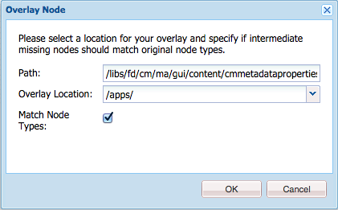

# Aggiunta di proprietà personalizzate alle risorse Gestione corrispondenza{#add-custom-properties-to-correspondence-management-assets}

## Panoramica {#overview}

Potete personalizzare l&#39;interfaccia utente di Gestione della corrispondenza e presentare agli utenti un set personalizzato di proprietà e schede. Questa personalizzazione include l&#39;aggiunta di campi/proprietà e schede personalizzati a tipi/lettere di risorse o a tutti i tipi e le lettere di risorse.

## Aggiunta di proprietà personalizzate alle risorse Gestione corrispondenza {#adding-custom-properties-to-correspondence-management-assets}

Gli scenari seguenti mostrano come aggiungere proprietà/schede alle risorse e alle lettere di Gestione corrispondenza:

* Aggiunta di una proprietà comune a tutti i tipi di risorse
* Aggiunta di una scheda comune a tutti i tipi di risorse
* Aggiunta di proprietà personalizzate a tipi di risorse specifici

Modificando le proprietà, i percorsi e i valori di questi scenari, potete aggiungere proprietà e schede personalizzate a un set di risorse diverso in base alle vostre esigenze.

### Scenario: Aggiunta di un campo comune (proprietà) a tutti i tipi di risorse {#scenario-adding-a-common-field-property-to-all-the-asset-types}

Questo scenario mostra come aggiungere una proprietà personalizzata a tutti i tipi di risorse (testo, elenco, condizione e frammenti di layout) e alle lettere. Utilizzando questo scenario, puoi aggiungere una proprietà, Posizione dei destinatari, a tutte le risorse e le lettere. La proprietà Posizione dei destinatari consente di identificare l&#39;area geografica di consegna a cui una risorsa o una lettera è pertinente.

>[!NOTE]
>
>Se avete già aggiunto una proprietà personalizzata, la proprietà inizia a comparire nella pagina di creazione della risorsa. Per nascondere tale proprietà, consultate Visualizzare/nascondere proprietà personalizzate nelle pagine Creazione e Proprietà delle risorse.


Per aggiungere una proprietà personalizzata a tutti i tipi di risorse e alle lettere, effettuate le seguenti operazioni:

1. Accedete a `https://'[server]:[port]'/[ContextPath]/crx/de` e accedete come amministratore.
1. Nella cartella delle app, create una cartella denominata css con un percorso o una struttura simile alla cartella css (che si trova nella cartella ccrui) con la procedura seguente:

   1. Fate clic con il pulsante destro del mouse sulla cartella degli elementi nel percorso seguente e selezionate Nodo **** sovrapposizione:

      `/libs/fd/cm/ma/gui/content/cmmetadataproperties/commonproperties/col1/items`

      

   1. Verificate che la finestra di dialogo Nodo sovrapposizione contenga i seguenti valori:

      **Percorso:** /libs/fd/cm/ma/gui/content/cmmetadata/commonproperties/col1/items

      **Posizione:** /apps/

      **Corrispondenza tipi di nodo:** Selezionato

      

   1. Fai clic su **OK**. La struttura delle cartelle viene creata nella cartella delle app.

   1. Fate clic su **Salva tutto**.

1. Nella cartella degli elementi appena creati, aggiungete un nodo per la proprietà personalizzata in tutta la risorsa (esempio: GeoLocation) con i seguenti passaggi:

   1. Fate clic con il pulsante destro del mouse sulla cartella degli elementi e selezionate **Crea** > **Crea nodo**.

      

   1. Verificate che la finestra di dialogo Crea nodo contenga i valori seguenti e fate clic su **OK**:

      **Nome:** GeoLocation (o il nome che si desidera assegnare a questa proprietà)

      **Tipo:** nt:non strutturato

      

   1. Fare clic sul nuovo nodo creato (qui GeoLocation). CRX visualizza le proprietà del nodo.
   1. Aggiungi le seguenti proprietà al nodo (qui GeoLocation):

      | **Nome** | **Tipo** | **Valore** |
      |---|---|---|
      | fieldLabel | Stringa | Nome a cui assegnare il campo o la proprietà. (Qui: Posizione dei destinatari) |
      | name | Stringa | `./extendedproperties/GeoLocation` (mantenere lo stesso valore del nome campo creato sotto il nodo elementi) |
      | renderingReadOnly | Booleano | vero |
      | sling:resourceType | Stringa | `granite/ui/components/coral/foundation/form/textfield` |

   1. Fate clic su **Salva tutto**.

1. Per visualizzare la personalizzazione, passate il puntatore del mouse su una risorsa (testo, elenco, condizione o frammento di layout) o una lettera, fate clic su **Visualizza proprietà** e fate clic su **Modifica**. Il nuovo campo (Posizione dei destinatari) viene visualizzato nella scheda Base nelle proprietà della risorsa/lettera.

   >[!NOTE]
   >
   >Potrebbe essere necessario cancellare la cache del browser prima che la personalizzazione venga visualizzata nell&#39;interfaccia utente.

   

   >[!NOTE]
   >
   >Le proprietà comuni per tutte le risorse aggiunte vengono visualizzate nella scheda di base delle proprietà della risorsa. Per impostazione predefinita, le proprietà comuni aggiunte per tutte le risorse vengono visualizzate nella pagina delle proprietà e nella pagina di creazione delle risorse. Per nascondere le proprietà comuni, è necessario <!--link to show / hide properties]-->.

### Scenario: Aggiunta di valori e menu a discesa personalizzati a una proprietà/campo personalizzato {#scenario-add-custom-drop-down-and-values-to-a-custom-property-field}

Questo scenario mostra come aggiungere una proprietà personalizzata a tutti i tipi di risorse e valori a discesa.

1. Fate clic con il pulsante destro del mouse sulla cartella degli elementi nel percorso seguente e selezionate Nodo **** sovrapposizione:

   `/libs/fd/cm/ma/gui/content/cmmetadataproperties/commonproperties/col1/items`

1. Sotto il nodo di sovrapposizione appena creato (/apps/fd/cm/ma/gui/content/cmmetadataproperties/commonproperties/col1/items)Create un nodo per ciascuna proprietà (campi) per la quale dovete creare un elenco a discesa (qui `geographicallocation`) del tipo nt:unstructure.
1. Aggiungi le seguenti proprietà al nodo (qui allocazione geografica) e fai clic su **Salva tutto**:

   <table>
   <tbody>
   <tr>
      <td><strong>Nome</strong></td>
      <td><strong>Tipo</strong></td>
      <td><strong>Valore</strong></td>
   </tr>
   <tr>
      <td>fieldLabel</td>
      <td>Stringa</td>
      <td>Nome a cui assegnare il campo o la proprietà. (Qui: geografia)</td>
   </tr>
   <tr>
      <td>name</td>
      <td>Stringa</td>
      <td>./extensionproperties/geographicdistribution (mantenere lo stesso valore del nome campo creato sotto il nodo items)</td>
   </tr>
   <tr>
      <td>renderingReadOnly</td>
      <td>Booleano</td>
      <td>vero</td>
   </tr>
   <tr>
      <td>sling:resourceType</td>
      <td>Stringa</td>
      <td>granite/ui/components/corallo/foundation/form/select<br /> </td>
   </tr>
   </tbody>
   </table>

1. In nodo proprietà (qui allocazione geografica), aggiungere un nuovo nodo con nome `items`. Sotto il nodo items, aggiungere un nodo ciascuno per i valori nell&#39;elenco a discesa. Come procedura ottimale, aggiungere il primo nodo come vuoto per fungere da valore predefinito dell&#39;elenco a discesa e un&#39;opzione che consente all&#39;utente di non specificare alcun valore per il campo. Per aggiungere più opzioni/valori a discesa, ripetere la procedura seguente:

   1. Fare clic con il pulsante destro del mouse sul nodo della proprietà (qui allocazione geografica) e selezionare **Crea** > **Crea nodo**.
   1. Immettere il nome del campo come `item1,` tipo di campo non strutturato e fare clic su **OK**.
   1. Aggiungete le seguenti proprietà al nodo appena creato (qui elemento1), quindi fate clic su **Salva tutto**:

      <table>
         <tbody>
         <tr>
          <td><strong>Nome</strong></td>
          <td><strong>Tipo</strong></td>
          <td><strong>Valore</strong></td>
         </tr>
         <tr>
          <td>testo</td>
          <td>Stringa</td>
          <td>Questo è il valore dell'opzione a discesa visibile all'utente. Lasciate vuoto il valore vuoto (predefinito) o immettete il valore, ad esempio <strong>Internazionale</strong> o <strong>Entro US</strong>.<br /> </td>
         </tr>
         <tr>
          <td>valore</td>
          <td>Stringa</td>
          <td>Valore memorizzato in CRXDE per il testo. Inserite una parola chiave univoca. <br /> </td>
         </tr>
         </tbody>
   </table>

   

Il menu a discesa personalizzato viene visualizzato come segue nelle proprietà delle risorse:


### Scenario: Scheda comune per tutti i tipi di risorse {#scenario-common-tab-for-all-asset-types}

Questo scenario mostra come aggiungere una scheda personalizzata, Destinatari, a tutti i tipi di risorse (testo, elenco, condizione e frammenti di layout) e alle lettere. La scheda Destinatari consente di pianificare l&#39;inserimento di tutte le proprietà personalizzate relative ai destinatari.


Con la procedura seguente potete aggiungere una scheda con un campo a tutte le risorse:

1. Accedete a `https://'[server]:[port]'/[ContextPath]/crx/de` e accedete come amministratore.
1. Nella cartella delle app, create una cartella denominata mmetadata properties con un percorso/struttura simile alla cartella cmmetadata properties (che si trova nella cartella del contenuto) tramite i seguenti passaggi:

   1. Fate clic con il pulsante destro del mouse sulla cartella delle proprietà dei metadati nel percorso seguente e selezionate **Overlay Node**:

      `/libs/fd/cm/ma/gui/content/cmmetadataproperties`

      

   1. Verificate che la finestra di dialogo Nodo sovrapposizione contenga i seguenti valori:

      **Percorso:** /libs/fd/cm/ma/gui/content/cmmetadataproperties

      **Posizione:** /apps/

      **Corrispondenza tipi di nodo:** Selezionato

   1. Fai clic su **OK**. La struttura delle cartelle viene creata nella cartella delle app.

      

      Fate clic su **Salva tutto**.

1. Nella cartella delle proprietà dei metadati, aggiungete un nodo per la creazione di una scheda personalizzata per tutte le risorse (esempio: commontab) utilizzando i seguenti passaggi:

   1. Fate clic con il pulsante destro del mouse sulla cartella delle proprietà dei metadati e selezionate **Crea** > **Crea nodo**.

      

   1. Verificate che la finestra di dialogo Crea nodo contenga i valori seguenti e fate clic su **OK**:

      **Nome:** commontab (o il nome che si desidera assegnare a questa proprietà)

      **Tipo:** nt:non strutturato

   1. Fare clic sul nuovo nodo creato (qui commontab). CRX visualizza le proprietà del nodo.
   1. Aggiungere le seguenti proprietà al nodo (qui commontab):

      <table>
         <tbody>
         <tr>
          <td><strong>Nome</strong></td>
          <td><strong>Tipo</strong></td>
          <td><strong>Valore</strong></td>
         </tr>
         <tr>
          <td>jcr:title</td>
          <td>Stringa</td>
          <td>Nome che si desidera assegnare alla colonna. (Qui: Destinatari)</td>
         </tr>
         <tr>
          <td>sling:resourceType</td>
          <td>Stringa</td>
          <td>granite/ui/components/corallo/foundation/container<br /> </td>
   </tr>
         </tbody>
       </table>

   1. Fate clic su **Salva tutto**.

1. Per il nodo tabulazione creato nell&#39;ultimo passaggio (qui commontab), create un nodo denominato item utilizzando il passaggio seguente:

   1. Fare clic con il pulsante destro del mouse sul nodo rilevante (qui scheda comune) e selezionare **Crea** > **Crea nodo**.
   1. Verificate che la finestra di dialogo Crea nodo contenga i valori seguenti e fate clic su **OK**:

      **Nome:** items

      **Tipo:** nt:non strutturato

   1. Fate clic su **Salva tutto:**

1. Nel nodo degli elementi creato nel passaggio precedente (in commontab), aggiungi un nodo per la creazione di una colonna (qui Colonna1) nella scheda personalizzata (commontab) utilizzando i passaggi seguenti (per aggiungere altre colonne, ripeti questo passaggio):

   1. Fare clic con il pulsante destro del mouse sul nodo degli elementi e selezionare **Crea** > **Crea nodo**.
   1. Verificate che la finestra di dialogo Crea nodo contenga i valori seguenti e fate clic su **OK**:

      **Nome:** Colonna1 (oppure il nome che si desidera assegnare al nodo - questo nome non viene visualizzato nell&#39;interfaccia utente).

      **Tipo:** nt:non strutturato

   1. Aggiungete la seguente proprietà al nodo (Qui Colonna1), quindi fate clic su **Salva tutto**:

      <table>
         <tbody>
         <tr>
           <td><strong>Nome</strong></td>
           <td><strong>Tipo</strong></td>
           <td><strong>Valore</strong></td>
         </tr>
         <tr>
           <td>sling:resourceType</td>
           <td>Stringa</td>
           <td>granite/ui/components/corallo/foundation/container<br /> </td>
         </tr>
         </tbody>
       </table>

1. Nel nodo creato nel passaggio precedente (qui Colonna1), aggiungi un nodo chiamato elementi utilizzando la procedura seguente:

   1. Fare clic con il pulsante destro del mouse sul nodo (qui Colonna1) e selezionare **Crea** > **Crea nodo**.
   1. Verificate che la finestra di dialogo Crea nodo contenga i valori seguenti e fate clic su **OK**:

      **Nome:** items

      **Tipo:** nt:non strutturato

   1. Fate clic su **Salva tutto**.

1. Per creare un campo nella scheda personalizzata (qui Destinatari), aggiungi un nodo (qui GeographicLocation). Questa proprietà corrisponde alla colonna creata. Utilizzare i passaggi seguenti per creare il campo (per creare altri campi/nodi, ripetere questi passaggi).:

   1. Fare clic con il pulsante destro del mouse sul nodo degli elementi e selezionare **Crea** > **Crea nodo**.
   1. Verificate che la finestra di dialogo Crea nodo contenga i valori seguenti e fate clic su **OK**:

      **Nome:** GeographicLocation (o un altro nome per la proprietà field)

      **Tipo:** nt:non strutturato

   1. Aggiungi le seguenti proprietà al nodo del campo (qui GeographicLocation) e fai clic su **Salva tutto**.

      | **Nome** | **Tipo** | **Valore** |
      |---|---|---|
      | fieldLabel | Stringa | Posizione dei destinatari (o nome che si desidera assegnare al campo). |
      | name | Stringa | ./extensionproperties/GeographicLocation |
      | renderingReadOnly | Booleano | vero |
      | sling:resourceType | Stringa | `/libs/granite/ui/components/coral/foundation/form/textfield` |

1. Per aggiungere questa scheda per Lettere, create una cartella di sovrapposizione con percorso/struttura simile alla seguente cartella di elementi, nel percorso seguente:

   `/libs/fd/cm/ma/gui/content/cmmetadataproperties/properties/letter/items/tabs/items`

   Per creare una sovrapposizione per una lettera o un’altra risorsa, usate il seguente percorso sostituendo il tipo di [risorsa] con testo, condizione, elenco, dizionario dati o frammento:

   `/libs/fd/cm/ma/gui/content/cmmetadataproperties/properties/[assettype]/items/tabs/items`

   1. Fate clic con il pulsante destro del mouse sulla cartella degli elementi nel percorso seguente e selezionate Nodo **** sovrapposizione:

      `/libs/fd/cm/ma/gui/content/cmmetadataproperties/properties/letter/items/tabs/items`

   1. Verificate che la finestra di dialogo Nodo sovrapposizione contenga i seguenti valori:

      **Percorso:** `/libs/fd/cm/ma/gui/content/cmmetadataproperties/properties/letter/items/tabs/items`

      **Posizione:** /apps/

      **Corrispondenza tipi di nodo:** Selezionato

   1. Fai clic su **OK**. La cartella viene creata. Fate clic su **Salva tutto**.

1. Nella cartella degli elementi appena creati, aggiungete un nodo per la scheda personalizzata della risorsa (in questa scheda, il nome non viene visualizzato nell’interfaccia utente) seguendo la procedura seguente:

   1. Fate clic con il pulsante destro del mouse sulla cartella degli elementi e selezionate **Crea** > **Crea nodo**.
   1. Verificate che la finestra di dialogo Crea nodo contenga i valori seguenti e fate clic su **OK**:

      **Nome:** mytab (o il nome che si desidera assegnare a questa proprietà)

      **Tipo:** nt:non strutturato

   1. Fare clic sul nuovo nodo creato (in questa scheda). CRX visualizza le proprietà del nodo.
   1. Aggiungi al nodo le due seguenti proprietà (qui scheda personalizzata):

      <table>
         <tbody>
         <tr>
           <td><strong>Nome</strong></td>
           <td><strong>Tipo</strong></td>
           <td><strong>Valore</strong></td>
         </tr>
         <tr>
           <td>path<br /> </td>
           <td>Stringa</td>
           <td>fd/cm/ma/gui/content/cmmetadataproperties/commontab<br /> </td>
         </tr>
         <tr>
           <td>sling:resourceType</td>
           <td>Stringa</td>
           <td>granite/ui/components/coral/foundation/include<br /> </td>
         </tr>
         </tbody>
       </table>

   1. Fate clic su **Salva tutto**.

1. Per visualizzare la personalizzazione, passate il puntatore del mouse sulla risorsa pertinente (qui c&#39;è una lettera), fate clic su Visualizza proprietà e fate clic su **Modifica**. La nuova scheda (Destinatari) e il nuovo campo (Posizione dei destinatari) vengono visualizzati nell&#39;interfaccia utente.

   >[!NOTE]
   >
   >Potrebbe essere necessario cancellare la cache del browser prima che la personalizzazione venga visualizzata nell&#39;interfaccia utente.

   

### Scenario: Aggiunta di proprietà personalizzate per tipi di risorse specifici {#scenario-adding-custom-properties-for-specific-asset-types}

Questo scenario mostra come aggiungere una proprietà a un particolare tipo di risorsa, ad esempio un campo a tutte le risorse di testo. Utilizzando questo processo, è possibile aggiungere proprietà a uno dei seguenti elementi:

* Testo
* Condizione
* Elenco
* Frammento layout
* Dizionario dati
* Lettera

Ad esempio, solo per le risorse di testo, potete aggiungere una proprietà, Posizione dei destinatari, per identificare l’area geografica a cui è pertinente una risorsa.  

Per aggiungere una proprietà a un tipo di risorsa, effettua i seguenti passaggi:

1. Accedete a `https://'[server]:[port]'/[ContextPath]/crx/de` e accedete come amministratore.
1. Per creare una scheda in un tipo di risorsa (ad esempio Testo), create la seguente struttura di cartelle nella cartella delle app:

   `/libs/fd/cm/ma/gui/content/cmmetadataproperties/properties/[AssetType]/items/tabs/items`

   [AssetType] = testo, condizione, elenco, lettera, dizionario dati o frammento

   Di seguito sono riportati i passaggi per creare questa struttura di cartelle:

   1. Fate clic con il pulsante destro del mouse sulla cartella degli elementi nel percorso seguente e selezionate Nodo **** sovrapposizione:

      `/libs/fd/cm/ma/gui/content/cmmetadataproperties/properties/[AssetType]/items/tabs/items`

      Ad esempio, se desiderate creare una proprietà per le risorse di testo, selezionate la cartella seguente:

      `/libs/fd/cm/ma/gui/content/cmmetadataproperties/properties/text/items/tabs/items`

      

   1. Verificate che la finestra di dialogo Nodo sovrapposizione contenga i seguenti valori:

      **Percorso:** /libs/fd/cm/ma/gui/content/cmmetadata/properties/[AssetType]/items/cards/items

      **Posizione:** /apps/

      **Corrispondenza tipi di nodo:** Selezionato

   1. Fai clic su **OK**. La struttura delle cartelle viene creata nella cartella delle app.

      Fate clic su **Salva tutto**.

1. Nella cartella degli elementi appena creati, aggiungete un nodo per la scheda personalizzata della risorsa (esempio: customtab) utilizzando i seguenti passaggi:

   1. Fate clic con il pulsante destro del mouse sulla cartella degli elementi e selezionate **Crea** > **Crea nodo**.
   1. Verificate che la finestra di dialogo Crea nodo contenga i valori seguenti e fate clic su **OK**:

      **Nome:** customtab (o il nome che si desidera assegnare a questa proprietà)

      **Tipo:** nt:non strutturato

   1. Fare clic sul nuovo nodo creato (qui scheda personalizzata). CRX visualizza le proprietà del nodo.
   1. Aggiungi al nodo le due seguenti proprietà (qui scheda personalizzata):

      | **Nome** | **Tipo** | **Valore** |
      |---|---|---|
      | sling:resourceType | Stringa | granite/ui/components/corallo/foundation/container |
      | jcr:title | Stringa | Nome del campo nell&#39;interfaccia utente (qui scheda Personale) |

   1. Fate clic su **Salva tutto**.

1. Nel nodo creato nel passaggio precedente (qui scheda personalizzata), aggiungi un nodo denominato items utilizzando la procedura seguente:

   1. Fare clic con il pulsante destro del mouse sul nodo (qui scheda personalizzata) e selezionare **Crea** > **Crea nodo**.
   1. Verificate che la finestra di dialogo Crea nodo contenga i valori seguenti e fate clic su **OK**:

      **Nome:** items

      **Tipo:** nt:non strutturato

   1. Fate clic su **Salva tutto**.

1. Nel nodo degli elementi creato nel passaggio precedente (sotto la scheda personalizzata), aggiungete un nodo per la creazione di una colonna (qui Colonna1) nella scheda personalizzata seguendo la procedura seguente (per aggiungere altre colonne, ripetete questo passaggio):

   1. Fare clic con il pulsante destro del mouse sul nodo degli elementi e selezionare **Crea** > **Crea nodo**.
   1. Verificate che la finestra di dialogo Crea nodo contenga i valori seguenti e fate clic su **OK**:

      **Nome:** Colonna1 (o il nome che si desidera assegnare al nodo)

      **Tipo:** nt:non strutturato

   1. Aggiungete la seguente proprietà al nodo (Qui Colonna1), quindi fate clic su **Salva tutto**.

      <table>
         <tbody>
         <tr>
           <td><strong>Nome</strong></td>
           <td><strong>Tipo</strong></td>
           <td><strong>Valore</strong></td>
         </tr>
         <tr>
           <td>sling:resourceType</td>
           <td>Stringa</td>
           <td>granite/ui/components/corallo/foundation/container<br /> </td>
         </tr>
         </tbody>
       </table>

1. Per ogni colonna creata (come specificato nel passaggio precedente - qui Colonna1), create un nodo denominato elemento utilizzando la procedura seguente:

   1. Fare clic con il pulsante destro del mouse sul nodo di colonna pertinente (qui Colonna1) e selezionare **Crea** > **Crea nodo**.
   1. Verificate che la finestra di dialogo Crea nodo contenga i valori seguenti e fate clic su **OK**:

      **Nome:** items

      **Tipo:** nt:non strutturato

   1. Fate clic su **Salva tutto:**

1. Per ciascuna colonna creata, creare un nodo sotto il nodo items per creare un campo nella nuova scheda nell&#39;interfaccia utente. Ripetete questo passaggio per creare altri campi nella colonna:

   1. Fare clic con il pulsante destro del mouse sul nodo rilevante (qui gli elementi sotto Colonna1) e selezionare **Crea** > **Crea nodo**.
   1. Verificate che la finestra di dialogo Crea nodo contenga i valori seguenti e fate clic su **OK**:

      **Nome:** Un nome a scelta (qui GeoLocation)

      **Tipo:** nt:non strutturato

   1. Aggiungete le seguenti proprietà al nodo e fate clic su **Salva tutto**.

      | **Nome** | **Tipo** | **Valore** |
      |---|---|---|
      | fieldLabel | Stringa | Posizione dei destinatari (o nome che si desidera assegnare al campo). |
      | name | Stringa | `./extendedproperties/GeoLocation` |
      | renderingReadOnly | Booleano | vero |
      | sling:resourceType | Stringa | granite/ui/components/corallo/foundation/form/textfield |

1. Per visualizzare la personalizzazione, passate il puntatore del mouse sulla risorsa pertinente (di seguito testo), fate clic su Visualizza proprietà e fate clic su **Modifica**. La nuova scheda e il nuovo campo (Posizione dei destinatari) vengono visualizzati nell&#39;interfaccia utente.

   >[!NOTE]
   >
   >Potrebbe essere necessario cancellare la cache del browser prima che la personalizzazione venga visualizzata nell&#39;interfaccia utente.

   

### Visualizzare le proprietà personalizzate nella pagina Creazione risorse {#display-custom-properties-on-the-asset-creation-page}

Per impostazione predefinita, le proprietà personalizzate aggiunte alle nuove schede sono visibili solo nella pagina delle proprietà e non nella pagina di creazione delle risorse, in quanto la pagina di creazione delle risorse non ha un layout a schede. Per visualizzare le proprietà personalizzate nella pagina di creazione delle risorse insieme ad altre proprietà, è necessario effettuare le seguenti operazioni:

1. Fate clic con il pulsante destro del mouse sulla cartella degli elementi nel percorso seguente e selezionate Nodo **** sovrapposizione:

   `/libs/fd/cm/ma/gui/content/createasset/createletter/jcr:content/body/items/form/items/letterWizard/items/properties/items/properties/items/letterproperties/items`

1. Verificate che la finestra di dialogo Nodo sovrapposizione contenga i seguenti valori, per lettera. Per altri tipi di risorse, il percorso è riportato nella tabella seguente:

   **Percorso:** /libs/fd/cm/ma/gui/content/create-asset/createletter/jcr:content/body/items/form/items/letterWizard/items/properties/properties/items/letterproperties/items

   **Posizione:** /apps/

   **Corrispondenza tipi di nodo:** Selezionato

   A seconda del tipo di risorsa, il percorso deve essere il seguente:

   | **Tipo di risorsa/documento** | **Percorso da aggiungere** |
   |---|---|
   | Testo | /libs/fd/cm/ma/gui/content/create-asset/createtext/jcr:content/body/items/form/items/texttwquei/items/editproperties/items/properties/items/tab/items/tab1/items |
   | Elenco | /libs/fd/cm/ma/gui/content/create-asset/createlist/jcr:content/body/items/form/items/listWizard/items/editproperties/items/properties/items/tab/items/tab1/items |
   | Condizione | /libs/fd/cm/ma/gui/content/create-asset/create-econdition/jcr:content/body/items/form/items/condizionionprocedura guidata/items/editproperties/items/properties/items/tab/items/tab1/items |
   | Frammento | /libs/fd/cm/ma/gui/content/create-asset/create-fragment/jcr:content/body/items/form/items/fragmentWizard/items/properties/items/properties/items/tab2/items/tab1/items |
   | Lettera | /libs/fd/cm/ma/gui/content/create-asset/createletter/jcr:content/body/items/form/items/letterWizard/items/properties/properties/items/letterproperties/items |

1. Fai clic su **OK**. La struttura delle cartelle viene creata nella cartella delle app.

1. Sotto il nodo degli elementi di sovrapposizione creato, create un nodo del nome col4 (o qualsiasi altro nome) e fate clic su **Salva tutto**.

   Ad esempio, di seguito è riportato il nodo di sovrapposizione creato per le lettere.

   `/apps/fd/cm/ma/gui/content/createasset/createletter/jcr:content/body/items/form/items/letterWizard/items/properties/items/properties/items/letterproperties/items`

1. Aggiungete le seguenti proprietà al nodo appena creato (qui col4) e fate clic su **Salva tutto**:

<table>
 <tbody>
  <tr>
   <td><strong>Nome</strong></td>
   <td><strong>Tipo</strong></td>
   <td><strong>Valore</strong></td>
  </tr>
  <tr>
   <td>path</td>
   <td>Stringa</td>
   <td><p>Questo percorso è il puntatore alla colonna creata in:</p>
    <ul>
     <li>Per una scheda comune per tutti i tipi di risorse: /apps/fd/cm/ma/gui/content/cmmetadata/commontab/items/col1</li>
     <li>Per diverse proprietà per diversi tipi di risorse: /apps/fd/cm/ma/gui/content/cmmetadataproperties/properties//items/cards/items/customtab/items/col1</li>
    </ul> </td>
  </tr>
  <tr>
   <td>sling:resourceType</td>
   <td>Stringa</td>
   <td> granite/ui/components/coral/foundation/include<br /> </td>
  </tr>
 </tbody>
</table>


Proprietà personalizzata, Lingua, visualizzazione nell&#39;interfaccia utente per la creazione di una lettera

## Personalizzare la visualizzazione a elenco per visualizzare le proprietà personalizzate {#customize-the-list-view-to-show-custom-properties}

Dopo aver aggiunto una proprietà personalizzata alle risorse Gestione corrispondenza, dovete apportare ulteriori modifiche in CRX/DE per assicurarvi che la proprietà personalizzata venga visualizzata nell’interfaccia utente di Gestione corrispondenza.

Per visualizzare la proprietà personalizzata nell’interfaccia utente dell’elenco delle risorse di Gestione corrispondenza, effettuate le seguenti operazioni:

1. Accedete a `https://'[server]:[port]'/[ContextPath]/crx/de` e accedete come amministratore.
1. Create la seguente struttura di cartelle nella cartella delle app:

   `/libs/fd/cm/ma/gui/content/cmassets/jcr:content/views/lists/columns`

   Di seguito sono riportati i passaggi per creare questa struttura di cartelle:

   1. Fate clic con il pulsante destro del mouse sulla cartella delle colonne nel percorso seguente e selezionate **Overlay Node**:

      `/libs/fd/cm/ma/gui/content/cmassets/jcr:content/views/lists/columns`

   1. Verificate che la finestra di dialogo Nodo sovrapposizione contenga i seguenti valori:

      **Percorso:** /libs/fd/cm/ma/gui/content/cmassets/jcr:content/views/lists/Columns

      **Posizione:** /apps/

      **Corrispondenza tipi di nodo:** Selezionato

   1. Fai clic su **OK**. La struttura delle cartelle viene creata nella cartella delle app.

      Fate clic su **Salva tutto**.

1. Per ciascuna delle proprietà create, create un nodo sotto il nodo delle colonne per creare una colonna nell&#39;interfaccia utente. Ripetete questo passaggio per creare più colonne nell’interfaccia utente:

   1. Fare clic con il pulsante destro del mouse sul nodo (colonne) rilevante e selezionare **Crea** > **Crea nodo**.
   1. Verificate che la finestra di dialogo Crea nodo contenga i valori seguenti e fate clic su **OK**:

      **Nome:** Un nome a scelta (qui GeographicLocation)

      **Tipo:** nt:non strutturato

   1. Aggiungete le seguenti proprietà al nodo e fate clic su **Salva tutto**.

      <table>
         <tbody>
         <tr>
           <td><strong>Nome</strong></td>
           <td><strong>Tipo</strong></td>
           <td><strong>Valore</strong></td>
         </tr>
         <tr>
           <td>jcr:primaryType</td>
           <td>Nome</td>
           <td><p>nt:unstructured</p> </td>
         </tr>
         <tr>
           <td>jcr:title</td>
           <td>Stringa</td>
           <td><p>GeographicLocation</p> <p>Questo valore viene visualizzato come intestazione di colonna nell’interfaccia utente. </p> </td>
         </tr>
         <tr>
           <td>assorbibile</td>
           <td>Booleano</td>
           <td><p>vero</p> <p>Il valore true indica che l'utente può ordinare i valori in questa colonna. </p> </td>
         </tr>
         </tbody>
       </table>

1. Create la seguente struttura di cartelle nella cartella delle app:

   `/libs/fd/cm/ma/gui/components/admin/childpagerenderer/childlistpage`

   Di seguito sono riportati i passaggi per creare questa struttura di cartelle:

   1. Fate clic con il pulsante destro del mouse sulla cartella delle colonne nel percorso seguente e selezionate **Overlay Node**:

      `/libs/fd/cm/ma/gui/components/admin/childpagerenderer/childlistpage`

   1. Verificate che la finestra di dialogo Nodo sovrapposizione contenga i seguenti valori:

      **Percorso:** /libs/fd/cm/ma/gui/components/admin/infimpagerenderer/infellistpage

      **Posizione:** /apps/

      **Corrispondenza tipi di nodo:** Selezionato

   1. Fai clic su **OK**. La struttura delle cartelle viene creata nella cartella delle app.

      Fate clic su **Salva tutto**.

1. Copiate il file inflistpage.jsp dal percorso seguente:

   /libs/fd/cm/ma/gui/components/admin/childpagerenderer/childlistpage/childlistpage.jsp

   Incollate il file nel percorso seguente:

   /apps//fd/cm/ma/gui/components/admin/child pagerenderer/infliare page/.

1. Aprite il file inflistpage.jsp (/apps/fd/cm/ma/gui/components/admin/childpagerenderer/childlistpage/childlistpage.jsp) e apportate le seguenti modifiche:

   1. Aggiungete quanto segue alla riga 19 del file (dopo la dichiarazione di copyright).

      ```jsp
      <%@page import="java.util.Map"%>
      ```

   1. Aggiungete il codice seguente di una funzione che ottiene il valore per ogni proprietà personalizzata alla fine del file:

      ```jsp
      <%!
          private String getCustomPropertyValue(Map<String, Object> extendedProperties, String propertyName) {
      
              String propertyValue = "";
              if (extendedProperties.containsKey(propertyName)) {
                  propertyValue = (String) extendedProperties.get(propertyName);
              }
      
              return propertyValue;
          }
      %>
      ```

   1. Aggiungere quanto segue prima del tag &lt;tr> (&lt;tr &lt;%= attrs.build() %>):

      ```jsp
      <%
          String GeoLocation = "";
          if (asset != null) {
                  Map<String, Object> extendedProperties = asset.getExtendedProperties();
                  if (extendedProperties != null) {
                      GeoLocation = getCustomPropertyValue(extendedProperties,"GeoLocation");
                  }
          }
      %>
      ```

      Nel codice, GeoLocation è il valore impostato nella proprietà name durante la creazione del nodo/campo personalizzato. Durante la creazione di un nodo/campo personalizzato, è stato specificato il nome della proprietà con ./extensionproperties/ prefix: ./extensionproperties/GeoLocation. Nel codice, il prefisso non è obbligatorio.

   1. Per visualizzare la nuova proprietà nell&#39;interfaccia utente, aggiungi un tag TD come segue prima del tag di chiusura (&lt;/tr>):

      ```jsp
      <td is="coral-td" value="<%= xssAPI.encodeForHTMLAttr(geographicalLocation) %>"><%= xssAPI.encodeForHTML(geographicalLocation) %></td>
      ```

      Per aggiungere altre colonne, ripetere i passaggi 6.3 e 6.4.

   1. Fate clic su **Salva tutto**.

1. Per visualizzare la personalizzazione, aprire la visualizzazione a elenco dei frammenti di documento o delle lettere in cui è stata aggiunta la proprietà personalizzata.

   La colonna e la proprietà dell’interfaccia utente aggiunta in questa procedura vengono visualizzate per tutti i tipi di risorse. Tuttavia, i valori di queste proprietà possono essere immessi e visualizzati solo per i tipi di risorse per i quali è stata originariamente aggiunta la proprietà personalizzata.

   Ad esempio, utilizzando lo scenario: Se aggiungete proprietà personalizzate per tipi di risorse specifici e aggiungete una proprietà personalizzata alle risorse di testo, potete immettere proprietà personalizzate solo per le risorse di testo. Se, tuttavia, tale proprietà personalizzata viene visualizzata nell’interfaccia utente, la colonna viene visualizzata per tutti i tipi di risorse.

   

1. (Facoltativo) Per impostazione predefinita, la nuova colonna viene visualizzata come ultima colonna dell’interfaccia utente. Per visualizzare la colonna in una posizione specifica, aggiungere la seguente proprietà al nodo della colonna:

<table>
 <tbody>
  <tr>
   <td><strong>Nome</strong></td>
   <td><strong>Tipo</strong></td>
   <td><strong>Valore</strong></td>
  </tr>
  <tr>
   <td>sling:orderBefore</td>
   <td>Stringa</td>
   <td><p>Nome del nodo di colonna nel percorso "/libs/fd/cm/ma/gui/content/cmassets/jcr:content/views/list/Columns" prima del quale la colonna personalizzata deve essere visualizzata nell’interfaccia utente.</p> <p>In questo caso, se si desidera che la colonna Posizione geografica venga visualizzata prima (a sinistra) della colonna Versione, aggiungere il nodo sling:orderBefore a GeoLocation nel percorso ""/apps/fd/cm/ma/gui/content/cmassets/jcr:content/views/list/Columns/GeoLocation" e impostare il valore della proprietà su version.</p> </td>
  </tr>
 </tbody>
</table>

Quando aggiungete la proprietà sling:orderBefore per specificare la posizione della colonna, dovete anche aggiornare l&#39;ordine del tag &lt;td> corrispondente specificato al punto 6.4 di questa procedura. Ad esempio, in questo caso, devi assicurarti che il tag &lt;td> della posizione geografica sia posizionato prima del tag &lt;td> della colonna Versione:

```xml
<td is="coral-td" value="<%= xssAPI.encodeForHTMLAttr(geographicalLocation) %>"><%= xssAPI.encodeForHTML(geographicalLocation) %></td>
<td is="coral-td" value="<%= xssAPI.encodeForHTMLAttr(version) %>"><%= xssAPI.encodeForHTML(version) %></td>
```

## Abilita la ricerca di proprietà personalizzate {#enable-search-for-custom-properties}

Per impostazione predefinita, la ricerca full text non include proprietà personalizzate aggiunte all’interfaccia utente tramite CRX/DE.

Per includere le proprietà personalizzate nella ricerca, è necessario consentire l&#39;indicizzazione delle proprietà personalizzate.

Per consentire l&#39;indicizzazione delle proprietà personalizzate, completare i seguenti passaggi:

1. Accedete a `https://'[server]:[port]'/[ContextPath]/crx/de` e accedete come amministratore.
1. Vai a `/oak:index/cmLucene`e aggiungi un nodo denominato **aggregati** al suo interno.

   1. Fare clic con il pulsante destro del mouse sulla cartella cmLucene e selezionare **Crea** > **Crea nodo**.
   1. Verificate che la finestra di dialogo Crea nodo contenga i valori seguenti e fate clic su **OK**:

      **Nome:** aggregati

      **Tipo:** nt:non strutturato

   1. Fate clic su **Salva tutto**.

1. Nella cartella degli aggregati appena creata, aggiungi un nodo cm:resource. In cm:resource, aggiungete un nodo denominato include0.

   1. Fai clic con il pulsante destro del mouse sulla cartella aggregates e seleziona **Crea** > **Crea nodo**. Verificate che la finestra di dialogo Crea nodo contenga i valori seguenti e fate clic su **OK**:

      **Nome:** cm:resource

      **Tipo:** nt:non strutturato

   1. Fate clic con il pulsante destro del mouse sulla cartella cm:resource e selezionate **Crea** > **Crea nodo**. Verificate che la finestra di dialogo Crea nodo contenga i valori seguenti e fate clic su **OK**:

      **Nome:** include0

      **Tipo:** nt:non strutturato

   1. Fate clic sul nuovo nodo creato (includi0). CRX visualizza le proprietà del nodo.
   1. Aggiungete la seguente proprietà al nodo (includi0):

      <table>
         <tbody>
         <tr>
           <td><strong>Nome</strong></td>
           <td><strong>Tipo</strong></td>
           <td><strong>Valore</strong></td>
         </tr>
         <tr>
           <td>path</td>
           <td>Stringa</td>
           <td>extendedProperties<br /> </td>
         </tr>
         </tbody>
       </table>

   1. Fate clic su **Salva tutto**.

1. Passate alle proprietà nella posizione seguente e aggiungete una posizione nodo al di sotto di essa: `/oak:index/cmLucene/indexRules/cm:resource/properties`

   Ripetere questo passaggio per ciascuna delle proprietà personalizzate che si desidera aggiungere alla ricerca.

   1. Fare clic con il pulsante destro del mouse sulla cartella delle proprietà e selezionare **Crea** > **Crea nodo**.
   1. Verificate che la finestra di dialogo Crea nodo contenga i valori seguenti e fate clic su **OK**:

      **Nome:** posizione (o il nome della proprietà personalizzata che si desidera aggiungere alla ricerca)

      **Tipo:** nt:non strutturato

   1. Fare clic sul nuovo nodo creato (posizione qui). CRX visualizza le proprietà del nodo.
   1. Aggiungi le seguenti proprietà al nodo (qui posizione):

      | **Nome** | **Tipo** | **Valore** |
      |---|---|---|
      | analizzato | Stringa | vero |
      | name | Stringa | extendedProperties/location (o il nome della proprietà che si desidera aggiungere alla ricerca) |
      | propertyIndex | Booleano | vero |
      | useInSuggest | Booleano | vero |

   1. Fate clic su **Salva tutto**.

1. Ora potete utilizzare valori di proprietà personalizzati nella ricerca full text per individuare le risorse rilevanti.

>[!NOTE]
>
>Se non è ancora possibile effettuare ricerche, è possibile che si tratti di un problema di indicizzazione. Per reindicizzare, andare al seguente nodo e modificare il valore della proprietà &quot;re-index&quot; in true:
>
>/oak:index/cmLucene&quot; e modifica il valore della proprietà

## Modificare la visualizzazione predefinita della pagina di ricerca {#change-default-view-of-the-search-page}

1. Accedete a `https://'[server]:[port]'/[ContextPath]/crx/de` e accedete come amministratore.
1. Nella cartella delle app, create una cartella denominata list con percorso/struttura simile alla cartella di elenco che si trova in /libs/granite/ui/content/shell/omnisearch/search Results/singleresults/views:

   1. Fate clic con il pulsante destro del mouse sulla cartella degli elementi nel percorso seguente e selezionate Nodo **** sovrapposizione:

      `/libs/granite/ui/content/shell/omnisearch/searchresults/singleresults/views/list`

   1. Verificate che la finestra di dialogo Nodo sovrapposizione contenga i seguenti valori:

      **Percorso:** /libs/granite/ui/content/shell/omnisearch/search Results/singleresuls/views/list

      **Posizione:** /apps/

      **Corrispondenza tipi di nodo:** Selezionato

   1. Fai clic su **OK**. La struttura delle cartelle viene creata nella cartella delle app.

   1. Fate clic su **Salva tutto**.

1. Nel nodo appena creato, elenco, aggiungere la seguente proprietà e fare clic su **Salva tutto**:

   <table>
   <tbody>
   <tr>
      <td><strong>Nome</strong></td>
      <td><strong>Tipo</strong></td>
      <td><strong>Valore</strong></td>
   </tr>
   <tr>
      <td>sling:orderBefore<br /> </td>
      <td>Stringa</td>
      <td>scheda</td>
   </tr>
   </tbody>
   </table>

1. La personalizzazione mostra i risultati della ricerca nella vista a elenco per tutte le console, inclusi Moduli e documenti, Risorse e Siti.

## Modificare la visualizzazione predefinita della pagina delle risorse {#change-default-view-of-the-assets-page}

>[!NOTE]
>
>Questi passaggi consentono di modificare la visualizzazione predefinita di tutte le console, ad esempio Moduli e documenti, Risorse e Siti.

1. Accedete a `https://'[server]:[port]'/[ContextPath]/crx/de` e accedete come amministratore.
1. Nella cartella delle app, create una cartella denominata list con percorso/struttura simile alla cartella di elenco che si trova in:

   /libs/fd/cm/ma/gui/content/cmassets/jcr:content/views/

   1. Fate clic con il pulsante destro del mouse sulla cartella degli elementi nel percorso seguente e selezionate Nodo **** sovrapposizione:

      `/libs/fd/cm/ma/gui/content/cmassets/jcr:content/views/list`

   1. Verificate che la finestra di dialogo Nodo sovrapposizione contenga i seguenti valori:

      **Percorso:** /libs/fd/cm/ma/gui/content/cmassets/jcr:content/views/list

      **Posizione:** /apps/

      **Corrispondenza tipi di nodo:** Selezionato

   1. Fai clic su **OK**. La struttura delle cartelle viene creata nella cartella delle app.

   1. Fate clic su **Salva tutto**.

1. Nel nodo appena creato, elenco, aggiungere la seguente proprietà e fare clic su **Salva tutto**:

   <table>
   <tbody>
   <tr>
      <td><strong>Nome</strong></td>
      <td><strong>Tipo</strong></td>
      <td><strong>Valore</strong></td>
   </tr>
   <tr>
      <td>sling:orderBefore<br /> </td>
      <td>Stringa</td>
      <td>scheda</td>
   </tr>
   </tbody>
   </table>

1. Eliminate i cookie del browser o utilizzate la modalità incognita del browser per visualizzare le risorse. Per impostazione predefinita, la pagina delle risorse viene visualizzata nel layout della scheda.

## Visualizzare/nascondere proprietà personalizzate nelle pagine Creazione e Proprietà delle risorse {#show-hide-custom-properties-on-asset-creation-and-properties-pages}

Per visualizzare o nascondere le proprietà personalizzate, completare i seguenti passaggi:

1. Sotto il nodo di proprietà personalizzato, ad esempio l&#39;allocazione geografica, create un nuovo nodo con il nome &quot;granite:rendercondition&quot; di tipo &quot;nt:unstructure&quot;.
1. Aggiungete la seguente proprietà al nodo e fate clic su **Salva tutto**:

   <table>
   <tbody>
   <tr>
      <td><strong>Nome</strong></td>
      <td><strong>Tipo</strong></td>
      <td><strong>Valore</strong></td>
   </tr>
   <tr>
      <td>sling:resourceType<br /> </td>
      <td>Stringa</td>
      <td>fd/cm/ma/gui/components/admin/assetsproperties/custompropertyconfig<br /> </td>
   </tr>
   </tbody>
   </table>

1. Per nascondere questa proprietà nella pagina di creazione della risorsa, aggiungete la seguente proprietà e fate clic su **Salva tutto**:

   <table>
   <tbody>
   <tr>
      <td><strong>Nome</strong></td>
      <td><strong>Tipo</strong></td>
      <td><strong>Valore</strong></td>
   </tr>
   <tr>
      <td>hideOnCreate<br /> </td>
      <td>Booleano</td>
      <td>vero<br /> </td>
   </tr>
   </tbody>
   </table>

1. Per nascondere la proprietà personalizzata nella pagina delle proprietà delle risorse, aggiungete la seguente proprietà e fate clic su **Salva tutto**:

   <table>
   <tbody>
   <tr>
      <td><strong>Nome</strong></td>
      <td><strong>Tipo</strong></td>
      <td><strong>Valore</strong></td>
   </tr>
   <tr>
      <td>hideOnEdit<br /> </td>
      <td>Booleano</td>
      <td>vero<br /> </td>
   </tr>
   </tbody>
   </table>

   Per visualizzare di nuovo i valori, reimpostare i valori delle proprietà su `false` o eliminare le voci delle proprietà.
