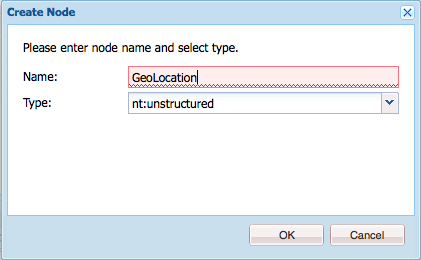
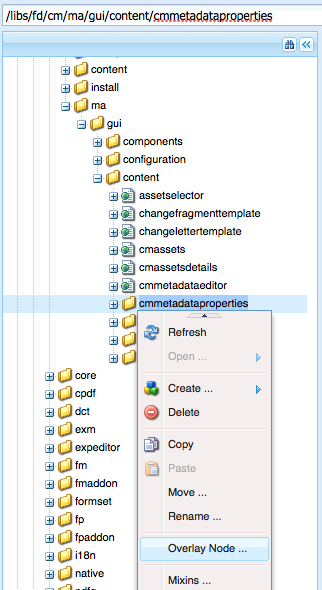

# Aggiungere proprietà personalizzate alle risorse di Gestione della corrispondenza{#add-custom-properties-to-correspondence-management-assets}

## Panoramica {#overview}

Puoi personalizzare l’interfaccia utente di Gestione della corrispondenza e presentare agli utenti un set personalizzato di proprietà e schede. Questa personalizzazione include l’aggiunta di campi, proprietà e schede personalizzati a tipi di risorse o lettere specifici o a tutti i tipi di risorse e le lettere.

## Aggiunta di proprietà personalizzate alle risorse di Gestione della corrispondenza {#adding-custom-properties-to-correspondence-management-assets}

Gli scenari seguenti mostrano come aggiungere proprietà/schede alle risorse e alle lettere di Gestione della corrispondenza:

* Aggiunta di una proprietà comune a tutti i tipi di risorse
* Aggiunta di una scheda comune a tutti i tipi di risorse
* Aggiunta di proprietà personalizzate a tipi di risorse specifici

Modificando proprietà, percorsi e valori in questi scenari, puoi aggiungere proprietà e schede personalizzate a un diverso set di risorse in base alle tue esigenze.

### Scenario: aggiunta di un campo comune (proprietà) a tutti i tipi di risorsa {#scenario-adding-a-common-field-property-to-all-the-asset-types}

Questo scenario mostra come aggiungere una proprietà personalizzata a tutti i tipi di risorse (frammenti di testo, elenco, condizione e layout) e alle lettere. Utilizzando questo scenario, puoi aggiungere una proprietà, Posizione dei destinatari, a tutte le risorse e lettere. La proprietà Posizione dei destinatari consente di identificare l’area geografica di consegna a cui una risorsa o una lettera è pertinente.

>[!NOTE]
>
>Se hai già aggiunto una proprietà personalizzata, questa inizia a essere visualizzata nella pagina di creazione della risorsa. Per nascondere tale proprietà, consulta Mostra/Nascondi proprietà personalizzate nella creazione delle risorse e nelle pagine Proprietà.


Per aggiungere una proprietà personalizzata a tutti i tipi di risorse e alle lettere, completa i passaggi seguenti:

1. Vai a `https://'[server]:[port]'/[ContextPath]/crx/de` e accedere come amministratore.
1. Nella cartella delle app, crea una cartella denominata css con un percorso/struttura simile a quello della cartella css (in una cartella ccrui), seguendo la procedura descritta di seguito:

   1. Fai clic con il pulsante destro del mouse sulla cartella degli elementi nel percorso seguente e seleziona **Sovrapponi nodo**:

      `/libs/fd/cm/ma/gui/content/cmmetadataproperties/commonproperties/col1/items`

      

   1. Assicurati che la finestra di dialogo Sovrapponi nodo abbia i seguenti valori:

      **Percorso:** /libs/fd/cm/ma/gui/content/cmmetadataproperties/commonproperties/col1/items

      **Posizione:** /apps/

      **Corrispondenza tipi di nodo:** Selezionato

      

   1. Clic **OK**. La struttura di cartelle viene creata nella cartella delle app.

   1. Clic **Salva tutto**.

1. Nella cartella degli elementi appena creata, aggiungi un nodo per la proprietà personalizzata in tutte le risorse (Esempio: GeoLocation) come segue:

   1. Fai clic con il pulsante destro del mouse sulla cartella degli elementi e seleziona **Crea** > **Crea nodo**.

      

   1. Assicurati che la finestra di dialogo Crea nodo abbia i seguenti valori e fai clic su **OK**:

      **Nome:** GeoLocation (o il nome da assegnare a questa proprietà)

      **Tipo:** nt:unstructured

      

   1. Fai clic sul nuovo nodo creato (qui GeoLocation). CRX visualizza le proprietà del nodo.
   1. Aggiungi le seguenti proprietà al nodo (qui GeoLocation):

      | **Nome** | **Tipo** | **Valore** |
      |---|---|---|
      | fieldLabel | Stringa | Nome da assegnare al campo o alla proprietà. (Qui: Posizione dei destinatari) |
      | nome | Stringa | `./extendedproperties/GeoLocation` (Mantieni lo stesso valore del nome del campo creato sotto il nodo elementi) |
      | renderReadOnly | Booleano | vero |
      | sling:resourceType | Stringa | `granite/ui/components/coral/foundation/form/textfield` |

   1. Clic **Salva tutto**.

1. Per visualizzare la personalizzazione, passa il cursore del mouse su una risorsa (testo, elenco, condizione o frammento di layout) o una lettera, fai clic su **Visualizza proprietà** e fai clic su **Modifica**. Il nuovo campo (Posizione dei destinatari) viene visualizzato nella scheda Base nelle proprietà della risorsa o della lettera.

   >[!NOTE]
   >
   >Potrebbe essere necessario cancellare la cache del browser prima che la personalizzazione venga visualizzata nell’interfaccia utente.

   

   >[!NOTE]
   >
   >Le proprietà comuni a tutte le risorse aggiunte vengono visualizzate nella scheda base delle proprietà della risorsa. Per impostazione predefinita, le proprietà comuni aggiunte per tutte le risorse vengono visualizzate nella pagina delle proprietà e nella pagina di creazione delle risorse. Per nascondere le proprietà comuni, è necessario <!--link to show / hide properties]-->.

### Scenario: aggiungere menu a discesa e valori personalizzati a una proprietà o a un campo personalizzato {#scenario-add-custom-drop-down-and-values-to-a-custom-property-field}

Questo scenario mostra come aggiungere una proprietà personalizzata a tutti i tipi di risorse e aggiungervi valori a discesa.

1. Fai clic con il pulsante destro del mouse sulla cartella degli elementi nel percorso seguente e seleziona **Sovrapponi nodo**:

   `/libs/fd/cm/ma/gui/content/cmmetadataproperties/commonproperties/col1/items`

1. Sotto il nodo di sovrapposizione appena creato (/apps/fd/cm/ma/gui/content/cmmetadataproperties/commonproperties/col1/items) Crea un nodo per ciascuna delle proprietà (campi) per cui devi creare un elenco a discesa (qui `geographicallocation`) di tipo nt:unstructured.
1. Aggiungi le seguenti proprietà al nodo (qui allocazione geografica) e fai clic su **Salva tutto**:

   <table>
   <tbody>
   <tr>
      <td><strong>Nome</strong></td>
      <td><strong>Tipo</strong></td>
      <td><strong>Valore</strong></td>
   </tr>
   <tr>
      <td>fieldLabel</td>
      <td>Stringa</td>
      <td>Nome da assegnare al campo o alla proprietà. (Qui: allocazione geografica)</td>
   </tr>
   <tr>
      <td>nome</td>
      <td>Stringa</td>
      <td>./extendedproperties/geographhicallocation (Mantieni lo stesso valore del nome del campo creato sotto il nodo items)</td>
   </tr>
   <tr>
      <td>renderReadOnly</td>
      <td>Booleano</td>
      <td>vero</td>
   </tr>
   <tr>
      <td>sling:resourceType</td>
      <td>Stringa</td>
      <td>granite/ui/components/coral/foundation/form/select<br /> </td>
   </tr>
   </tbody>
   </table>

1. In nodo proprietà (qui allocazione geografica), aggiungi un nuovo nodo con il nome `items`. Sotto il nodo elementi, aggiungi un nodo per ciascuno dei valori nel menu a discesa. Come best practice, aggiungi il primo nodo come vuoto per fungere da valore predefinito del menu a discesa e un’opzione per consentire all’utente di non specificare alcun valore per il campo. Per aggiungere più opzioni/valori a discesa, ripeti i seguenti passaggi:

   1. Fai clic con il pulsante destro del mouse sul nodo della proprietà (qui allocazione geografica) e seleziona **Crea** > **Crea nodo**.
   1. Immetti il nome del campo come `item1,` mantieni tipo come nt:unstructured, quindi fate clic su **OK**.
   1. Aggiungi le seguenti proprietà al nuovo nodo creato (qui elemento1) e fai clic su **Salva tutto**:

      <table>
         <tbody>
         <tr>
          <td><strong>Nome</strong></td>
          <td><strong>Tipo</strong></td>
          <td><strong>Valore</strong></td>
         </tr>
         <tr>
          <td>text</td>
          <td>Stringa</td>
          <td>Questo è il valore dell’opzione a discesa visibile all’utente. Tienilo vuoto per il valore vuoto (predefinito) o inserisci il valore, ad esempio <strong>Internazionale</strong> o <strong>Negli Stati Uniti</strong>.<br /> </td>
         </tr>
         <tr>
          <td>valore</td>
          <td>Stringa</td>
          <td>Valore memorizzato in CRXDE per il testo. Immetti una parola chiave univoca. <br /> </td>
         </tr>
         </tbody>
   </table>

   

Nelle proprietà della risorsa, l’elenco a discesa personalizzato viene visualizzato come segue:


### Scenario: scheda Comune per tutti i tipi di risorse {#scenario-common-tab-for-all-asset-types}

Questo scenario mostra come aggiungere una scheda personalizzata, Destinatari, a tutti i tipi di risorse (frammenti di testo, elenco, condizione e layout) e alle lettere. Nella scheda Destinatari è possibile pianificare l’inserimento di tutte le proprietà personalizzate rilevanti per i destinatari.


La procedura seguente consente di aggiungere una scheda con un campo a tutte le risorse:

1. Vai a `https://'[server]:[port]'/[ContextPath]/crx/de` e accedere come amministratore.
1. Nella cartella delle app, crea una cartella denominata cmmetadataproperties con percorso/struttura simile alla cartella cmmetadataproperties (nella cartella dei contenuti), seguendo la procedura riportata di seguito:

   1. Fai clic con il pulsante destro del mouse sulla cartella commetadataproperties nel percorso seguente e seleziona **Sovrapponi nodo**:

      `/libs/fd/cm/ma/gui/content/cmmetadataproperties`

      

   1. Assicurati che la finestra di dialogo Sovrapponi nodo abbia i seguenti valori:

      **Percorso:** /libs/fd/cm/ma/gui/content/cmmetadataproperties

      **Posizione:** /apps/

      **Corrispondenza tipi di nodo:** Selezionato

   1. Clic **OK**. La struttura di cartelle viene creata nella cartella delle app.

      

      Clic **Salva tutto**.

1. Nella cartella cmmetadataproperties, aggiungi un nodo per creare una scheda personalizzata per tutte le risorse (Esempio: commontab) seguendo la procedura riportata di seguito:

   1. Fai clic con il pulsante destro del mouse sulla cartella commetadataproperties e seleziona **Crea** > **Crea nodo**.

      

   1. Assicurati che la finestra di dialogo Crea nodo abbia i seguenti valori e fai clic su **OK**:

      **Nome:** commontab (o il nome da assegnare a questa proprietà)

      **Tipo:** nt:unstructured

   1. Fare clic sul nuovo nodo creato (qui commontab). CRX visualizza le proprietà del nodo.
   1. Aggiungi le seguenti proprietà al nodo (qui commontab):

      <table>
         <tbody>
         <tr>
          <td><strong>Nome</strong></td>
          <td><strong>Tipo</strong></td>
          <td><strong>Valore</strong></td>
         </tr>
         <tr>
          <td>jcr:title</td>
          <td>Stringa</td>
          <td>Nome che si desidera assegnare alla colonna. (Qui: Destinatari)</td>
         </tr>
         <tr>
          <td>sling:resourceType</td>
          <td>Stringa</td>
          <td>granite/ui/components/coral/foundation/container<br /> </td>
   </tr>
         </tbody>
       </table>

   1. Clic **Salva tutto**.

1. Per il nodo scheda creato nell’ultimo passaggio (qui commontab), crea un nodo denominato elemento utilizzando il passaggio seguente:

   1. Fai clic con il pulsante destro del mouse sul nodo pertinente (qui scheda comune) e seleziona **Crea** > **Crea nodo**.
   1. Assicurati che la finestra di dialogo Crea nodo abbia i seguenti valori e fai clic su **OK**:

      **Nome:** elementi

      **Tipo:** nt:unstructured

   1. Clic **Salva tutto:**

1. Nel nodo elementi creato nel passaggio precedente (sotto commontab), aggiungi un nodo per la creazione di una colonna (in questo caso Colonna1) nella scheda personalizzata (commontab) seguendo la procedura riportata di seguito (per aggiungere altre colonne, ripetere questo passaggio):

   1. Fai clic con il pulsante destro del mouse sul nodo elementi e seleziona **Crea** > **Crea nodo**.
   1. Assicurati che la finestra di dialogo Crea nodo abbia i seguenti valori e fai clic su **OK**:

      **Nome:** Colonna1 (o il nome che si desidera assegnare al nodo; questo nome non viene visualizzato nell&#39;interfaccia utente).

      **Tipo:** nt:unstructured

   1. Aggiungi la seguente proprietà al nodo (qui Colonna1), quindi fai clic su **Salva tutto**:

      <table>
         <tbody>
         <tr>
           <td><strong>Nome</strong></td>
           <td><strong>Tipo</strong></td>
           <td><strong>Valore</strong></td>
         </tr>
         <tr>
           <td>sling:resourceType</td>
           <td>Stringa</td>
           <td>granite/ui/components/coral/foundation/container<br /> </td>
         </tr>
         </tbody>
       </table>

1. Nel nodo creato nel passaggio precedente (in questo caso Column1), aggiungi un nodo denominato elementi seguendo la procedura riportata di seguito.

   1. Fai clic con il pulsante destro del mouse sul nodo (qui Colonna1) e seleziona **Crea** > **Crea nodo**.
   1. Assicurati che la finestra di dialogo Crea nodo abbia i seguenti valori e fai clic su **OK**:

      **Nome:** elementi

      **Tipo:** nt:unstructured

   1. Clic **Salva tutto**.

1. Per creare un campo nella scheda personalizzata (qui Destinatari), aggiungi un nodo (qui GeographicalLocation). Questa proprietà corrisponde alla colonna creata. Per creare il campo, utilizza i passaggi seguenti (per creare altri campi o nodi, ripeti questi passaggi).:

   1. Fai clic con il pulsante destro del mouse sul nodo elementi e seleziona **Crea** > **Crea nodo**.
   1. Assicurati che la finestra di dialogo Crea nodo abbia i seguenti valori e fai clic su **OK**:

      **Nome:** GeographicalLocation (o un altro nome per la proprietà del campo)

      **Tipo:** nt:unstructured

   1. Aggiungi le seguenti proprietà al nodo del campo (qui GeographicalLocation) e fai clic su **Salva tutto**.

      | **Nome** | **Tipo** | **Valore** |
      |---|---|---|
      | fieldLabel | Stringa | Posizione dei destinatari o nome da assegnare al campo. |
      | nome | Stringa | ./extendedproperties/GeographicalLocation |
      | renderReadOnly | Booleano | vero |
      | sling:resourceType | Stringa | `/libs/granite/ui/components/coral/foundation/form/textfield` |

1. Per aggiungere questa scheda a Lettere, crea una cartella di sovrapposizione con un percorso/struttura simile alla cartella degli elementi seguente nel percorso seguente:

   `/libs/fd/cm/ma/gui/content/cmmetadataproperties/properties/letter/items/tabs/items`

   Per creare una sovrapposizione per una lettera o una risorsa diversa, utilizza il percorso seguente sostituendo [assettype] con testo, condizione, elenco, dizionario dati o frammento:

   `/libs/fd/cm/ma/gui/content/cmmetadataproperties/properties/[assettype]/items/tabs/items`

   1. Fai clic con il pulsante destro del mouse sulla cartella degli elementi nel percorso seguente e seleziona **Sovrapponi nodo**:

      `/libs/fd/cm/ma/gui/content/cmmetadataproperties/properties/letter/items/tabs/items`

   1. Assicurati che la finestra di dialogo Sovrapponi nodo abbia i seguenti valori:

      **Percorso:** `/libs/fd/cm/ma/gui/content/cmmetadataproperties/properties/letter/items/tabs/items`

      **Posizione:** /apps/

      **Corrispondenza tipi di nodo:** Selezionato

   1. Clic **OK**. La cartella viene creata. Clic **Salva tutto**.

1. Nella cartella degli elementi appena creata, aggiungi un nodo per la scheda personalizzata nella risorsa (in questo caso mytab - questo nome non viene visualizzato nell’interfaccia utente) seguendo la procedura riportata di seguito:

   1. Fai clic con il pulsante destro del mouse sulla cartella degli elementi e seleziona **Crea** > **Crea nodo**.
   1. Assicurati che la finestra di dialogo Crea nodo abbia i seguenti valori e fai clic su **OK**:

      **Nome:** mytab (o il nome da assegnare a questa proprietà)

      **Tipo:** nt:unstructured

   1. Fai clic sul nuovo nodo creato (qui mytab). CRX visualizza le proprietà del nodo.
   1. Aggiungi le due proprietà seguenti al nodo (qui customtab):

      <table>
         <tbody>
         <tr>
           <td><strong>Nome</strong></td>
           <td><strong>Tipo</strong></td>
           <td><strong>Valore</strong></td>
         </tr>
         <tr>
           <td>percorso<br /> </td>
           <td>Stringa</td>
           <td>fd/cm/ma/gui/content/commetadataproperties/commontab<br /> </td>
         </tr>
         <tr>
           <td>sling:resourceType</td>
           <td>Stringa</td>
           <td>granite/ui/components/coral/foundation/include<br /> </td>
         </tr>
         </tbody>
       </table>

   1. Clic **Salva tutto**.

1. Per visualizzare la personalizzazione, passa il puntatore del mouse sulla risorsa pertinente (qui una lettera), fai clic su Visualizza proprietà, quindi fai clic su **Modifica**. Nell’interfaccia utente vengono visualizzati la nuova scheda (Destinatari) e il nuovo campo (Posizione dei Destinatari).

   >[!NOTE]
   >
   >Potrebbe essere necessario cancellare la cache del browser prima che la personalizzazione venga visualizzata nell’interfaccia utente.

   

### Scenario: aggiunta di proprietà personalizzate per tipi di risorse specifici {#scenario-adding-custom-properties-for-specific-asset-types}

Questo scenario mostra come aggiungere una proprietà a un particolare tipo di risorsa, ad esempio un campo a tutte le risorse di testo. Utilizzando questo processo, puoi aggiungere proprietà a una delle seguenti:

* Testo
* Condizione
* Elenco
* Frammento layout
* Dizionario dati
* Lettera

Ad esempio, solo alle risorse di testo, desideri aggiungere una proprietà, Posizione dei destinatari, per identificare a quale area geografica una risorsa è rilevante.  

La procedura seguente illustra come aggiungere una proprietà a un tipo di risorsa:

1. Vai a `https://'[server]:[port]'/[ContextPath]/crx/de` e accedere come amministratore.
1. Per creare una scheda in un tipo di risorsa (ad esempio Testo), crea la seguente struttura di cartelle nella cartella delle app:

   `/libs/fd/cm/ma/gui/content/cmmetadataproperties/properties/[AssetType]/items/tabs/items`

   [Tipo risorsa] = testo, condizione, elenco, lettera, dizionario dati o frammento

   Di seguito sono riportati i passaggi per creare questa struttura di cartelle:

   1. Fai clic con il pulsante destro del mouse sulla cartella degli elementi nel percorso seguente e seleziona **Sovrapponi nodo**:

      `/libs/fd/cm/ma/gui/content/cmmetadataproperties/properties/[AssetType]/items/tabs/items`

      Ad esempio, se desideri creare una proprietà per le risorse di testo, seleziona la cartella seguente:

      `/libs/fd/cm/ma/gui/content/cmmetadataproperties/properties/text/items/tabs/items`

      

   1. Assicurati che la finestra di dialogo Sovrapponi nodo abbia i seguenti valori:

      **Percorso:** /libs/fd/cm/ma/gui/content/cmmetadataproperties/properties/[Tipo risorsa]/items/tabs/items

      **Posizione:** /apps/

      **Corrispondenza tipi di nodo:** Selezionato

   1. Clic **OK**. La struttura di cartelle viene creata nella cartella delle app.

      Clic **Salva tutto**.

1. Nella cartella degli elementi appena creata, aggiungi un nodo per la scheda personalizzata nella risorsa (Esempio: customtab) seguendo la procedura riportata di seguito:

   1. Fai clic con il pulsante destro del mouse sulla cartella degli elementi e seleziona **Crea** > **Crea nodo**.
   1. Assicurati che la finestra di dialogo Crea nodo abbia i seguenti valori e fai clic su **OK**:

      **Nome:** customtab (o il nome da assegnare a questa proprietà)

      **Tipo:** nt:unstructured

   1. Fai clic sul nuovo nodo creato (qui customtab). CRX visualizza le proprietà del nodo.
   1. Aggiungi le due proprietà seguenti al nodo (qui customtab):

      | **Nome** | **Tipo** | **Valore** |
      |---|---|---|
      | sling:resourceType | Stringa | granite/ui/components/coral/foundation/container |
      | jcr:title | Stringa | Il nome del campo nell’interfaccia utente (qui la scheda My) |

   1. Clic **Salva tutto**.

1. Nel nodo creato nel passaggio precedente (in questo caso, customtab), aggiungi un nodo denominato elementi seguendo la procedura riportata di seguito.

   1. Fai clic con il pulsante destro del mouse sul nodo (qui customtab) e seleziona **Crea** > **Crea nodo**.
   1. Assicurati che la finestra di dialogo Crea nodo abbia i seguenti valori e fai clic su **OK**:

      **Nome:** elementi

      **Tipo:** nt:unstructured

   1. Clic **Salva tutto**.

1. Nel nodo elementi creato nel passaggio precedente (sotto customtab), aggiungi un nodo per la creazione di una colonna (in questo caso Column1) nella scheda personalizzata seguendo i passaggi seguenti (per aggiungere altre colonne, ripeti questo passaggio):

   1. Fai clic con il pulsante destro del mouse sul nodo elementi e seleziona **Crea** > **Crea nodo**.
   1. Assicurati che la finestra di dialogo Crea nodo abbia i seguenti valori e fai clic su **OK**:

      **Nome:** Colonna1 (o il nome che si desidera assegnare al nodo)

      **Tipo:** nt:unstructured

   1. Aggiungi la seguente proprietà al nodo (qui Colonna1), quindi fai clic su **Salva tutto**.

      <table>
         <tbody>
         <tr>
           <td><strong>Nome</strong></td>
           <td><strong>Tipo</strong></td>
           <td><strong>Valore</strong></td>
         </tr>
         <tr>
           <td>sling:resourceType</td>
           <td>Stringa</td>
           <td>granite/ui/components/coral/foundation/container<br /> </td>
         </tr>
         </tbody>
       </table>

1. Per ogni colonna creata (come specificato nel passaggio precedente, in questo caso Colonna1), crea un nodo denominato elemento seguendo la procedura riportata di seguito.

   1. Fare clic con il pulsante destro del mouse sul nodo della colonna pertinente (in questo caso, Colonna1) e selezionare **Crea** > **Crea nodo**.
   1. Assicurati che la finestra di dialogo Crea nodo abbia i seguenti valori e fai clic su **OK**:

      **Nome:** elementi

      **Tipo:** nt:unstructured

   1. Clic **Salva tutto:**

1. Per ciascuna delle colonne create, crea un nodo sotto il nodo elementi per la creazione di un campo nella nuova scheda nell’interfaccia utente. Ripeti questo passaggio per creare altri campi nella colonna:

   1. Fai clic con il pulsante destro del mouse sul nodo pertinente (qui gli elementi nella Colonna1) e seleziona **Crea** > **Crea nodo**.
   1. Assicurati che la finestra di dialogo Crea nodo abbia i seguenti valori e fai clic su **OK**:

      **Nome:** Un nome a tua scelta (qui GeoLocation)

      **Tipo:** nt:unstructured

   1. Aggiungi le seguenti proprietà al nodo, quindi fai clic su **Salva tutto**.

      | **Nome** | **Tipo** | **Valore** |
      |---|---|---|
      | fieldLabel | Stringa | Posizione dei destinatari o nome da assegnare al campo. |
      | nome | Stringa | `./extendedproperties/GeoLocation` |
      | renderReadOnly | Booleano | vero |
      | sling:resourceType | Stringa | granite/ui/components/coral/foundation/form/textfield |

1. Per visualizzare la personalizzazione, passa il puntatore del mouse sulla risorsa pertinente (qui un testo), fai clic su Visualizza proprietà, quindi fai clic su **Modifica**. Nell’interfaccia utente vengono visualizzati la nuova scheda e il nuovo campo (Posizione dei destinatari).

   >[!NOTE]
   >
   >Potrebbe essere necessario cancellare la cache del browser prima che la personalizzazione venga visualizzata nell’interfaccia utente.

   

### Visualizzare le proprietà personalizzate nella pagina di creazione delle risorse {#display-custom-properties-on-the-asset-creation-page}

Per impostazione predefinita, le proprietà personalizzate aggiunte alle nuove schede sono visibili solo nella pagina delle proprietà e non nella pagina di creazione della risorsa, in quanto la pagina di creazione della risorsa non presenta un layout a schede. Per visualizzare le proprietà personalizzate nella pagina di creazione delle risorse insieme ad altre proprietà, è necessario effettuare le seguenti operazioni:

1. Fai clic con il pulsante destro del mouse sulla cartella degli elementi nel percorso seguente e seleziona **Sovrapponi nodo**:

   `/libs/fd/cm/ma/gui/content/createasset/createletter/jcr:content/body/items/form/items/letterWizard/items/properties/items/properties/items/letterproperties/items`

1. Assicurati che la finestra di dialogo Sovrapponi nodo abbia i seguenti valori, per lettera. Per gli altri tipi di risorse, il percorso è indicato nella tabella seguente:

   **Percorso:** /libs/fd/cm/ma/gui/content/createasset/createletter/jcr:content/body/items/form/items/letterWizard/items/properties/items/properties/items/items/letterproperties/items

   **Posizione:** /apps/

   **Corrispondenza tipi di nodo:** Selezionato

   A seconda del tipo di risorsa, il percorso deve essere:

   | **Tipo di risorsa/documento** | **Percorso da aggiungere** |
   |---|---|
   | Testo | /libs/fd/cm/ma/gui/content/createasset/createtext/jcr:content/body/items/form/items/textwizard/items/editproperties/items/items/tab/items/tab |
   | Elenco | /libs/fd/cm/ma/gui/content/createasset/createlist/jcr:content/body/items/form/listwizard/items/editproperties/items/items/items/tab/items |
   | Condizione | /libs/fd/cm/ma/gui/content/createasset/createcondition/jcr:content/body/items/form/items/conditionwizard/items/editproperties/items/items/items/tab/items |
   | Frammento | /libs/fd/cm/ma/gui/content/createasset/createfragment/jcr:content/body/items/form/items/fragmentwizard/items/properties/items/items/items/tabs2/items/tab1/items |
   | Lettera | /libs/fd/cm/ma/gui/content/createasset/createletter/jcr:content/body/items/form/items/letterWizard/items/properties/items/properties/items/items/letterproperties/items |

1. Clic **OK**. La struttura di cartelle viene creata nella cartella delle app.

1. Nel nodo degli elementi di sovrapposizione creato, crea un nodo denominato col4 (o qualsiasi altro nome) e fai clic su **Salva tutto**.

   Ad esempio, di seguito è riportato il nodo di sovrapposizione creato per le lettere.

   `/apps/fd/cm/ma/gui/content/createasset/createletter/jcr:content/body/items/form/items/letterWizard/items/properties/items/properties/items/letterproperties/items`

1. Aggiungi le seguenti proprietà al nuovo nodo creato (qui col4) e fai clic su **Salva tutto**:

<table>
 <tbody>
  <tr>
   <td><strong>Nome</strong></td>
   <td><strong>Tipo</strong></td>
   <td><strong>Valore</strong></td>
  </tr>
  <tr>
   <td>percorso</td>
   <td>Stringa</td>
   <td><p>Questo percorso è il puntatore alla colonna creata in:</p>
    <ul>
     <li>Per la scheda comune per tutti i tipi di risorse: /apps/fd/cm/ma/gui/content/cmmetadataproperties/commontab/items/col1</li>
     <li>Per diverse proprietà per diversi tipi di risorse: /apps/fd/cm/ma/gui/content/cmmetadataproperties/properties//items/tabs/items/customtab/items/col1</li>
    </ul> </td>
  </tr>
  <tr>
   <td>sling:resourceType</td>
   <td>Stringa</td>
   <td> granite/ui/components/coral/foundation/include<br /> </td>
  </tr>
 </tbody>
</table>


Proprietà personalizzata Language visualizzata nell’interfaccia utente per la creazione di una lettera

## Personalizzare la vista a elenco per mostrare le proprietà personalizzate {#customize-the-list-view-to-show-custom-properties}

Dopo aver aggiunto una proprietà personalizzata alle risorse di Gestione della corrispondenza, devi apportare ulteriori modifiche in CRX/DE per garantire che la proprietà personalizzata venga visualizzata nell’interfaccia utente di Gestione della corrispondenza.

Per visualizzare la proprietà personalizzata nell’interfaccia utente dell’elenco delle risorse di Gestione corrispondenza, completa i passaggi seguenti:

1. Vai a `https://'[server]:[port]'/[ContextPath]/crx/de` e accedere come amministratore.
1. Crea la seguente struttura di cartelle nella cartella delle app:

   `/libs/fd/cm/ma/gui/content/cmassets/jcr:content/views/lists/columns`

   Di seguito sono riportati i passaggi per creare questa struttura di cartelle:

   1. Fai clic con il pulsante destro del mouse sulla cartella delle colonne nel percorso seguente e seleziona **Sovrapponi nodo**:

      `/libs/fd/cm/ma/gui/content/cmassets/jcr:content/views/lists/columns`

   1. Assicurati che la finestra di dialogo Sovrapponi nodo abbia i seguenti valori:

      **Percorso:** /libs/fd/cm/ma/gui/content/cmassets/jcr:content/views/LISTS/columns

      **Posizione:** /apps/

      **Corrispondenza tipi di nodo:** Selezionato

   1. Clic **OK**. La struttura di cartelle viene creata nella cartella delle app.

      Clic **Salva tutto**.

1. Per ciascuna delle proprietà create, crea un nodo sotto il nodo delle colonne per la creazione di una colonna nell’interfaccia utente. Ripeti questo passaggio per creare altre colonne nell’interfaccia utente:

   1. Fai clic con il pulsante destro del mouse sul nodo (colonne) pertinente e seleziona (Aggiungi colonne) **Crea** > **Crea nodo**.
   1. Assicurati che la finestra di dialogo Crea nodo abbia i seguenti valori e fai clic su **OK**:

      **Nome:** Un nome a tua scelta (qui GeographicalLocation)

      **Tipo:** nt:unstructured

   1. Aggiungi le seguenti proprietà al nodo, quindi fai clic su **Salva tutto**.

      <table>
         <tbody>
         <tr>
           <td><strong>Nome</strong></td>
           <td><strong>Tipo</strong></td>
           <td><strong>Valore</strong></td>
         </tr>
         <tr>
           <td>jcr:primaryType</td>
           <td>Nome</td>
           <td><p>nt:unstructured</p> </td>
         </tr>
         <tr>
           <td>jcr:title</td>
           <td>Stringa</td>
           <td><p>GeographicalLocation</p> <p>Questo valore viene visualizzato come intestazione di colonna nell’interfaccia utente. </p> </td>
         </tr>
         <tr>
           <td>ordinabile</td>
           <td>Booleano</td>
           <td><p>vero</p> <p>Il valore true indica che l'utente può ordinare i valori in questa colonna. </p> </td>
         </tr>
         </tbody>
       </table>

1. Crea la seguente struttura di cartelle nella cartella delle app:

   `/libs/fd/cm/ma/gui/components/admin/childpagerenderer/childlistpage`

   Di seguito sono riportati i passaggi per creare questa struttura di cartelle:

   1. Fai clic con il pulsante destro del mouse sulla cartella delle colonne nel percorso seguente e seleziona **Sovrapponi nodo**:

      `/libs/fd/cm/ma/gui/components/admin/childpagerenderer/childlistpage`

   1. Assicurati che la finestra di dialogo Sovrapponi nodo abbia i seguenti valori:

      **Percorso:** /libs/fd/cm/ma/gui/components/admin/child pagerenderer/child listpage

      **Posizione:** /apps/

      **Corrispondenza tipi di nodo:** Selezionato

   1. Clic **OK**. La struttura di cartelle viene creata nella cartella delle app.

      Clic **Salva tutto**.

1. Copia il file childlistpage.jsp dalla seguente posizione:

   /libs/fd/cm/ma/gui/components/admin/childpagerenderer/childlistpage/childlistpage.jsp

   Incolla il file nella posizione seguente:

   /apps//fd/cm/ma/gui/components/admin/child pagerenderer/child listpage/.

1. Apri il file childlistpage.jsp (/apps/fd/cm/ma/gui/components/admin/childpagerenderer/childlistpage/childlistpage.jsp) e apporta le seguenti modifiche:

   1. Aggiungi quanto segue alla riga 19 del file (seguendo l’istruzione di copyright).

      ```jsp
      <%@page import="java.util.Map"%>
      ```

   1. Aggiungi il seguente codice di una funzione che ottiene il valore di ogni proprietà personalizzata alla fine del file:

      ```jsp
      <%!
          private String getCustomPropertyValue(Map<String, Object> extendedProperties, String propertyName) {
      
              String propertyValue = "";
              if (extendedProperties.containsKey(propertyName)) {
                  propertyValue = (String) extendedProperties.get(propertyName);
              }
      
              return propertyValue;
          }
      %>
      ```

   1. Aggiungi quanto segue prima dell’inizio del &lt;tr> tag (&lt;tr attrs.build=&quot;&quot;>>):

      ```jsp
      <%
          String GeoLocation = "";
          if (asset != null) {
                  Map<String, Object> extendedProperties = asset.getExtendedProperties();
                  if (extendedProperties != null) {
                      GeoLocation = getCustomPropertyValue(extendedProperties,"GeoLocation");
                  }
          }
      %>
      ```

      Nel codice, GeoLocation è il valore impostato nella proprietà name durante la creazione del nodo o campo personalizzato. Durante la creazione di un nodo/campo personalizzato, hai specificato il nome della proprietà con ./extendedproperties/ prefisso: ./extendedproperties/GeoLocation. Nel codice, il prefisso non è obbligatorio.

   1. Per visualizzare la nuova proprietà nell’interfaccia utente, aggiungi un tag TD come segue prima del tag di chiusura (&lt;/tr>) tag:

      ```jsp
      <td is="coral-td" value="<%= xssAPI.encodeForHTMLAttr(geographicalLocation) %>"><%= xssAPI.encodeForHTML(geographicalLocation) %></td>
      ```

      Per aggiungere altre colonne, ripetere i passaggi 6.3 e 6.4.

   1. Clic **Salva tutto**.

1. Per visualizzare la personalizzazione, aprire la visualizzazione elenco dei frammenti di documento o delle lettere in cui è stata aggiunta la proprietà personalizzata.

   La colonna dell’interfaccia utente e la proprietà aggiunte in questa procedura vengono visualizzate per tutti i tipi di risorse. Tuttavia, i valori in queste proprietà possono essere immessi e visualizzati solo per i tipi di risorsa per i quali è stata originariamente aggiunta la proprietà personalizzata.

   Ad esempio, utilizzando Scenario: aggiunta di proprietà personalizzate per tipi di risorse specifici si aggiunge una proprietà personalizzata alle risorse di testo, è possibile immettere proprietà personalizzate solo per le risorse di testo. Tuttavia, se visualizzi la proprietà personalizzata nell’interfaccia utente, la colonna viene visualizzata per tutti i tipi di risorse.

   

1. (Facoltativo) Per impostazione predefinita, la nuova colonna viene visualizzata come ultima colonna nell’interfaccia utente. Per visualizzare la colonna in una posizione specifica, aggiungi la seguente proprietà al nodo della colonna:

<table>
 <tbody>
  <tr>
   <td><strong>Nome</strong></td>
   <td><strong>Tipo</strong></td>
   <td><strong>Valore</strong></td>
  </tr>
  <tr>
   <td>sling:orderBefore</td>
   <td>Stringa</td>
   <td><p>Il nome del nodo di colonna nel percorso "/libs/fd/cm/ma/gui/content/cmassets/jcr:content/views/list/columns" prima del quale la colonna personalizzata deve essere visualizzata nell’interfaccia utente.</p> <p>In questo caso, se desideri che la colonna Posizione geografica venga visualizzata prima (a sinistra della) colonna Versione, aggiungi la proprietà sling:orderBefore al nodo GeoLocation nel percorso ""/apps/fd/cm/ma/gui/content/cmassets/jcr:content/views/list/columns/GeoLocation" e imposta il valore della proprietà su version.</p> </td>
  </tr>
 </tbody>
</table>

Quando aggiungi la proprietà sling:orderBefore per specificare la posizione della colonna, devi aggiornare anche l’ordine della proprietà corrispondente &lt;td> specificata al punto 6.4 della presente procedura. Ad esempio, in questo caso, devi assicurarti che il &lt;td> il tag di posizione geografica viene inserito prima di &lt;td> tag della colonna Versione:

```xml
<td is="coral-td" value="<%= xssAPI.encodeForHTMLAttr(geographicalLocation) %>"><%= xssAPI.encodeForHTML(geographicalLocation) %></td>
<td is="coral-td" value="<%= xssAPI.encodeForHTMLAttr(version) %>"><%= xssAPI.encodeForHTML(version) %></td>
```

## Abilita ricerca proprietà personalizzate {#enable-search-for-custom-properties}

Per impostazione predefinita, la ricerca full-text non include le proprietà personalizzate aggiunte all’interfaccia utente di utilizzando CRX/DE.

Per includere le proprietà personalizzate nella ricerca, devi consentire l’indicizzazione delle proprietà personalizzate.

La procedura seguente illustra come consentire l’indicizzazione di proprietà personalizzate:

1. Vai a `https://'[server]:[port]'/[ContextPath]/crx/de` e accedere come amministratore.
1. Vai a `/oak:index/cmLucene`e aggiungi un nodo denominato **aggregati** sotto di esso.

   1. Fare clic con il pulsante destro del mouse sulla cartella cmLucene e selezionare **Crea** > **Crea nodo**.
   1. Assicurati che la finestra di dialogo Crea nodo abbia i seguenti valori e fai clic su **OK**:

      **Nome:** aggregati

      **Tipo:** nt:unstructured

   1. Clic **Salva tutto**.

1. Nella cartella degli aggregati appena creata, aggiungi un nodo cm:resource. Nella sezione cm:resource, aggiungi un nodo denominato include0.

   1. Fai clic con il pulsante destro del mouse sulla cartella aggregati e seleziona (Confronta periodi di tempo) **Crea** > **Crea nodo**. Assicurati che la finestra di dialogo Crea nodo abbia i seguenti valori e fai clic su **OK**:

      **Nome:** cm:risorsa

      **Tipo:** nt:unstructured

   1. Fare clic con il pulsante destro del mouse sulla cartella cm:resource e selezionare **Crea** > **Crea nodo**. Assicurati che la finestra di dialogo Crea nodo abbia i seguenti valori e fai clic su **OK**:

      **Nome:** include0

      **Tipo:** nt:unstructured

   1. Fai clic sul nuovo nodo creato (in questo caso include0). CRX visualizza le proprietà del nodo.
   1. Aggiungi la seguente proprietà al nodo (in questo caso include0):

      <table>
         <tbody>
         <tr>
           <td><strong>Nome</strong></td>
           <td><strong>Tipo</strong></td>
           <td><strong>Valore</strong></td>
         </tr>
         <tr>
           <td>percorso</td>
           <td>Stringa</td>
           <td>extendedProperties<br /> </td>
         </tr>
         </tbody>
       </table>

   1. Clic **Salva tutto**.

1. Vai a proprietà nella seguente posizione e aggiungi una posizione di nodo sotto di essa: `/oak:index/cmLucene/indexRules/cm:resource/properties`

   Ripeti questo passaggio per ciascuna delle proprietà personalizzate che desideri aggiungere alla ricerca.

   1. Fai clic con il pulsante destro del mouse sulla cartella delle proprietà e seleziona **Crea** > **Crea nodo**.
   1. Assicurati che la finestra di dialogo Crea nodo abbia i seguenti valori e fai clic su **OK**:

      **Nome:** posizione (o il nome della proprietà personalizzata da aggiungere alla ricerca)

      **Tipo:** nt:unstructured

   1. Fai clic sul nuovo nodo creato (qui posizione). CRX visualizza le proprietà del nodo.
   1. Aggiungi le seguenti proprietà al nodo (qui posizione):

      | **Nome** | **Tipo** | **Valore** |
      |---|---|---|
      | analizzato | Stringa | vero |
      | nome | Stringa | extendedProperties/location (o il nome della proprietà che si desidera aggiungere alla ricerca) |
      | propertyIndex | Booleano | vero |
      | useInSuggest | Booleano | vero |

   1. Clic **Salva tutto**.

1. Ora puoi utilizzare i valori delle proprietà personalizzate nella ricerca full-text per individuare le risorse rilevanti.

>[!NOTE]
>
>Se non riesci ancora a eseguire la ricerca, è possibile che si sia verificato un problema di indicizzazione. Per la reindicizzazione, passa al seguente nodo e modifica il valore della proprietà &quot;re-index&quot; su true:
>
>/oak:index/cmLucene&quot; e modifica il valore della proprietà

## Modificare la visualizzazione predefinita della pagina di ricerca {#change-default-view-of-the-search-page}

1. Vai a `https://'[server]:[port]'/[ContextPath]/crx/de` e accedere come amministratore.
1. Nella cartella delle app, crea una cartella denominata elenco con un percorso/struttura simile a quello della cartella dell’elenco in /libs/granite/ui/content/shell/omnisearch/searchresults/singlresults/views:

   1. Fai clic con il pulsante destro del mouse sulla cartella degli elementi nel percorso seguente e seleziona **Sovrapponi nodo**:

      `/libs/granite/ui/content/shell/omnisearch/searchresults/singleresults/views/list`

   1. Assicurati che la finestra di dialogo Sovrapponi nodo abbia i seguenti valori:

      **Percorso:** /libs/granite/ui/content/shell/omnisearch/searchresults/singlresults/views/list

      **Posizione:** /apps/

      **Corrispondenza tipi di nodo:** Selezionato

   1. Clic **OK**. La struttura di cartelle viene creata nella cartella delle app.

   1. Clic **Salva tutto**.

1. Nell’elenco del nodo appena creato, aggiungi la seguente proprietà e fai clic su **Salva tutto**:

   <table>
   <tbody>
   <tr>
      <td><strong>Nome</strong></td>
      <td><strong>Tipo</strong></td>
      <td><strong>Valore</strong></td>
   </tr>
   <tr>
      <td>sling:orderBefore<br /> </td>
      <td>Stringa</td>
      <td>scheda</td>
   </tr>
   </tbody>
   </table>

1. La personalizzazione mostra i risultati della ricerca in Vista a elenco per tutte le console, inclusi Forms e Documenti, Risorse e Siti.

## Modificare la visualizzazione predefinita della pagina delle risorse {#change-default-view-of-the-assets-page}

>[!NOTE]
>
>Questi passaggi modificano la visualizzazione predefinita di tutte le console, ad esempio Forms e Documents, Assets e Sites.

1. Vai a `https://'[server]:[port]'/[ContextPath]/crx/de` e accedere come amministratore.
1. Nella cartella delle app, crea una cartella denominata elenco con un percorso/struttura simile a quello della cartella dell’elenco in:

   /libs/fd/cm/ma/gui/content/cmassets/jcr:content/views/

   1. Fai clic con il pulsante destro del mouse sulla cartella degli elementi nel percorso seguente e seleziona **Sovrapponi nodo**:

      `/libs/fd/cm/ma/gui/content/cmassets/jcr:content/views/list`

   1. Assicurati che la finestra di dialogo Sovrapponi nodo abbia i seguenti valori:

      **Percorso:** /libs/fd/cm/ma/gui/content/cmassets/jcr:content/views/list

      **Posizione:** /apps/

      **Corrispondenza tipi di nodo:** Selezionato

   1. Clic **OK**. La struttura di cartelle viene creata nella cartella delle app.

   1. Clic **Salva tutto**.

1. Nell’elenco del nodo appena creato, aggiungi la seguente proprietà e fai clic su **Salva tutto**:

   <table>
   <tbody>
   <tr>
      <td><strong>Nome</strong></td>
      <td><strong>Tipo</strong></td>
      <td><strong>Valore</strong></td>
   </tr>
   <tr>
      <td>sling:orderBefore<br /> </td>
      <td>Stringa</td>
      <td>scheda</td>
   </tr>
   </tbody>
   </table>

1. Cancella i cookie del browser o utilizza la modalità di navigazione in incognito del browser per visualizzare le risorse. Per impostazione predefinita, la pagina delle risorse viene visualizzata nel layout della scheda.

## Mostrare/nascondere le proprietà personalizzate nelle pagine Creazione risorsa e Proprietà {#show-hide-custom-properties-on-asset-creation-and-properties-pages}

La procedura seguente illustra come visualizzare o nascondere le proprietà personalizzate:

1. Nel nodo della proprietà personalizzata, ad esempio Geraphicallocation, crea un nodo denominato &quot;granite:rendercondition&quot; di tipo &quot;nt:unstructured&quot;.
1. Aggiungi la seguente proprietà al nodo e fai clic su **Salva tutto**:

   <table>
   <tbody>
   <tr>
      <td><strong>Nome</strong></td>
      <td><strong>Tipo</strong></td>
      <td><strong>Valore</strong></td>
   </tr>
   <tr>
      <td>sling:resourceType<br /> </td>
      <td>Stringa</td>
      <td>fd/cm/ma/gui/components/admin/assetsproperties/custompropertyconfig<br /> </td>
   </tr>
   </tbody>
   </table>

1. Per nascondere questa proprietà nella pagina di creazione della risorsa, aggiungi la seguente proprietà e fai clic su **Salva tutto**:

   <table>
   <tbody>
   <tr>
      <td><strong>Nome</strong></td>
      <td><strong>Tipo</strong></td>
      <td><strong>Valore</strong></td>
   </tr>
   <tr>
      <td>hideOnCreate<br /> </td>
      <td>Booleano</td>
      <td>true<br /> </td>
   </tr>
   </tbody>
   </table>

1. Per nascondere la proprietà personalizzata nella pagina delle proprietà delle risorse, aggiungi la seguente proprietà e fai clic su **Salva tutto**:

   <table>
   <tbody>
   <tr>
      <td><strong>Nome</strong></td>
      <td><strong>Tipo</strong></td>
      <td><strong>Valore</strong></td>
   </tr>
   <tr>
      <td>hideOnEdit<br /> </td>
      <td>Booleano</td>
      <td>true<br /> </td>
   </tr>
   </tbody>
   </table>

   Per visualizzare nuovamente i valori, reimpostare i valori delle proprietà su `false` o eliminare le voci di proprietà.
