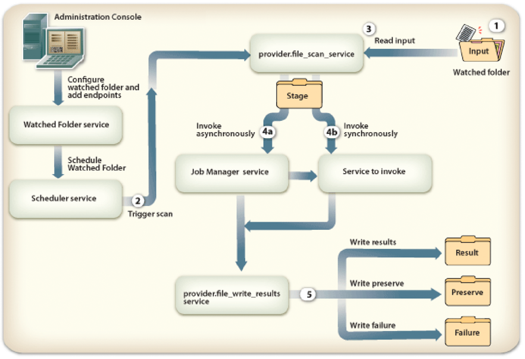

# Configurazione degli endpoint della cartella controllata {#configuring-watched-folder-endpoints}

Un amministratore può configurare una cartella di rete, nota come *cartella controllata*, in modo che quando un utente inserisce un file (ad esempio un file PDF) nella cartella controllata, venga richiamata un&#39;operazione di servizio configurata e il file venga manipolato. Dopo aver eseguito l&#39;operazione specificata, il servizio salva il file modificato in una cartella di output specificata.

## Configurazione del servizio Cartelle controllate {#configuring-the-watched-folder-service}

Prima di configurare un endpoint di cartella controllata, configura il servizio Cartella controllata. I parametri di configurazione del servizio Cartelle controllate hanno due scopi:

* Per configurare gli attributi comuni a tutti gli endpoint della cartella controllata
* Per fornire valori predefiniti per tutti gli endpoint della cartella controllata

Dopo aver configurato il servizio Cartelle controllate, aggiungi un endpoint per il servizio di destinazione. Quando si aggiunge l&#39;endpoint, è possibile impostare valori quali il nome del servizio e il nome dell&#39;operazione da richiamare quando i file o le cartelle vengono inseriti nella cartella di input del servizio Cartella controllata configurato. Per informazioni dettagliate sulla configurazione del servizio Cartelle controllate, vedere [Impostazioni del servizio Cartelle controllate](/help/forms/using/admin-help/configure-service-settings.md#watched-folder-service-settings).

## Creazione di una cartella controllata {#creating-a-watched-folder}

Puoi creare una cartella controllata nei due modi seguenti:

* Quando si configurano le impostazioni per un endpoint di cartella controllata, digitare il percorso completo della directory padre nella casella Percorso e aggiungere il nome della cartella controllata da creare, come illustrato nell&#39;esempio seguente:
  `  C:\MyPDFs\MyWatchedFolder`Poiché la cartella MyWatchedFolder non esiste già, i moduli AEM tentano di crearla nel percorso specificato.

* Creare una cartella nel file system prima di configurare un endpoint di cartella controllata, quindi digitare il percorso completo nella casella Percorso.

In un ambiente cluster, la cartella utilizzata come cartella controllata deve essere accessibile, scrivibile e condivisa nel file system o in rete. In questo scenario, ogni istanza del server applicazioni del cluster deve avere accesso alla stessa cartella condivisa.

In Windows, se il server applicazioni è in esecuzione come servizio, deve essere avviato con l&#39;accesso appropriato alla cartella condivisa in uno dei modi seguenti:

* Configurare il servizio Application Server Accedi come **parametro** per avviarlo come utente specifico con l&#39;accesso appropriato alla cartella controllata condivisa.
* Configurare l&#39;opzione Avvia servizio server applicazioni come sistema locale per consentire al servizio di interagire con il desktop. Questa opzione richiede che la cartella controllata condivisa sia accessibile e scrivibile a tutti.

## Concatenamento di cartelle controllate {#chaining-together-watched-folders}

Le cartelle controllate possono essere concatenate in modo che il documento risultante di una cartella controllata sia il documento di input della cartella controllata successiva. Ogni cartella controllata può richiamare un servizio diverso. Configurando in questo modo le cartelle controllate, è possibile richiamare più servizi. Ad esempio, una cartella controllata poteva convertire i file PDF in Adobe PostScript® e una seconda cartella controllata poteva convertire i file PostScript in formato PDF/A. A questo scopo, imposta semplicemente la cartella *result* della cartella controllata definita dal primo endpoint in modo che punti alla cartella *input* della cartella controllata definita dal secondo endpoint.

L&#39;output della prima conversione passerebbe a \path\result. L&#39;input per la seconda conversione sarà \path\result e l&#39;output della seconda conversione andrà a \path\result\result (oppure alla directory definita nella casella Cartella risultati per la seconda conversione).

## Interazione degli utenti con le cartelle visualizzate {#how-users-interact-with-watched-folders}

Per un endpoint di cartella controllata, gli utenti possono richiamare copiando o trascinando file o cartelle di input dai propri desktop a una cartella controllata. I file verranno elaborati nell’ordine in cui arrivano.

Per gli endpoint della cartella controllata, se il processo richiede un solo file di input, l’utente può copiare tale file nella directory principale della cartella controllata.

Se il processo contiene più di un file di input, l&#39;utente deve creare una cartella al di fuori della gerarchia delle cartelle controllate che contenga tutti i file richiesti. Questa nuova cartella deve includere i file di input (e facoltativamente un file DDX se necessario dal processo). Una volta creata la cartella dei processi, l&#39;utente la copia nella cartella di input della cartella controllata.

>[!NOTE]
>
>Verificare che il server applicazioni abbia eliminato l&#39;accesso ai file nella cartella controllata. Se i moduli AEM non sono in grado di eliminare i file dalla cartella di input dopo la scansione, il processo associato verrà richiamato a tempo indeterminato.

## Output cartella controllata {#watched-folder-output}

Quando l&#39;input è una cartella e l&#39;output è costituito da più file, i moduli AEM creano una cartella di output con lo stesso nome della cartella di input e copiano i file di output in tale cartella. Quando l&#39;output è costituito da una mappa documento contenente una coppia chiave-valore, ad esempio l&#39;output di un processo di output, la chiave viene utilizzata come nome del file di output.

I nomi dei file di output risultanti da un processo di endpoint non possono contenere caratteri diversi da lettere, numeri e un punto (.) prima dell’estensione del file. I moduli AEM convertono altri caratteri nei rispettivi valori esadecimali.

Le applicazioni client prelevano i documenti dei risultati dalla cartella dei risultati della cartella controllata. Gli errori di processo vengono registrati nella cartella degli errori della cartella controllata.

## Funzionamento della cartella controllata {#how-watched-folder-works}

Il modulo Cartella controllata contiene i seguenti servizi:

* Servizio cartelle controllate
* provider.file_scan_service
* provider.file_write_results_service

Oltre ai servizi elencati sopra, la cartella controllata dipende anche da altri servizi, tra cui il servizio di pianificazione per la pianificazione dei processi e il servizio Gestione processi per supportare la chiamata asincrona dei servizi di destinazione.

### Elaborazione di una richiesta di chiamata da parte della cartella controllata {#how-watched-folder-processes-an-invocation-request}

Il servizio Cartelle controllate gestisce la creazione, l’aggiornamento e l’eliminazione degli endpoint. Dopo che l’amministratore ha creato gli endpoint, questi vengono pianificati per essere attivati dal servizio di pianificazione in base all’intervallo di ripetizione o all’espressione cron specificati.

Questo diagramma illustra come la cartella controllata elabora una richiesta di chiamata.

Il processo di chiamata di un servizio utilizzando le cartelle controllate è il seguente:

1. Un&#39;applicazione client inserisce file o cartelle nella cartella di input della cartella controllata.
1. Quando si verifica l&#39;intervallo di scansione del processo, il servizio Scheduler richiama il provider.file_scan_service per elaborare i file o le cartelle nella cartella di input.
1. Il provider.file_scan_service esegue le seguenti operazioni:

   * Esegue la scansione della cartella di input per individuare i file o le cartelle che corrispondono al modello di file di inclusione ed esclude i file o le cartelle per il modello di file di esclusione specificato. I file o le cartelle meno recenti vengono prelevati per primi. Vengono selezionati anche i file e le cartelle più vecchi del tempo di attesa. In una scansione, il numero di file o cartelle elaborati dipende dalle dimensioni del batch. Per informazioni sui modelli di file, vedere [Informazioni sui modelli di file](configuring-watched-folder-endpoints.md#about-file-patterns). Per informazioni sull&#39;impostazione della dimensione del batch, vedere [Impostazioni del servizio Cartelle controllate](/help/forms/using/admin-help/configure-service-settings.md#watched-folder-service-settings).
   * Raccoglie i file o le cartelle da elaborare. Se i file o le cartelle non vengono scaricati completamente, vengono rilevati nella scansione successiva. Per assicurarsi che le cartelle siano completamente scaricate, gli amministratori devono creare una cartella con un nome utilizzando il modello di file di esclusione. Una volta che la cartella contiene tutti i file, è necessario rinominarla in base al pattern specificato nel modello di file di inclusione. Questo passaggio assicura che la cartella disponga di tutti i file necessari per richiamare il servizio. Per ulteriori informazioni sulla verifica del completamento del download delle cartelle, vedere [Suggerimenti per le cartelle controllate](configuring-watched-folder-endpoints.md#tips-and-tricks-for-watched-folders).
   * Sposta i file o le cartelle nella cartella di stage dopo averli selezionati per l&#39;elaborazione.
   * Converte i file o le cartelle nella cartella stage nell&#39;input appropriato in base alle mappature dei parametri di input dell&#39;endpoint. Per esempi di mapping dei parametri di input, vedere [Suggerimenti per le cartelle controllate](configuring-watched-folder-endpoints.md#tips-and-tricks-for-watched-folders).

1. Il servizio di destinazione configurato per l&#39;endpoint viene richiamato in modo sincrono o asincrono. Il servizio di destinazione viene richiamato utilizzando il nome utente e la password configurati per l&#39;endpoint.

   * La chiamata sincrona chiama direttamente il servizio di destinazione e gestisce immediatamente la risposta.
   * Per la chiamata asincrona, il servizio di destinazione viene chiamato tramite il servizio Gestione processi, che inserisce la richiesta in una coda. Il servizio Gestione processi, a sua volta, chiama il provider.file_write_results_service per gestire i risultati.

1. Il provider.file_write_results_service gestisce la risposta o l&#39;errore della chiamata al servizio di destinazione. In caso di esito positivo, l’output viene salvato nella cartella dei risultati in base alla configurazione dell’endpoint. Il provider.file_write_results_service conserva inoltre l&#39;origine se l&#39;endpoint è configurato per conservare i risultati al completamento corretto.

   Quando la chiamata del servizio di destinazione genera un errore, il provider.file_write_results_service registra il motivo dell&#39;errore in un file failure.log e inserisce tale file nella cartella degli errori. La cartella degli errori viene creata in base ai parametri di configurazione specificati per l&#39;endpoint. Quando l&#39;amministratore imposta l&#39;opzione Mantieni in caso di errore per la configurazione dell&#39;endpoint, il provider.file_write_results_service copia anche i file di origine nella cartella degli errori. Per informazioni sul ripristino dei file dalla cartella degli errori, vedere [Punti di errore e ripristino](configuring-watched-folder-endpoints.md#failure-points-and-recovery).

## Impostazioni endpoint cartella controllata {#watched-folder-endpoint-settings}

Utilizza le seguenti impostazioni per configurare un endpoint per cartelle controllate.

**Nome:** (obbligatorio) identifica l&#39;endpoint. Non includere un carattere &lt; perché il nome visualizzato in Workspace verrà troncato. Se immetti un URL come nome dell’endpoint, accertati che sia conforme alle regole di sintassi specificate in RFC1738.

**Descrizione:** una descrizione dell&#39;endpoint. Non includere un carattere &lt; perché la descrizione visualizzata in Workspace verrà troncata.

**Percorso:** (obbligatorio) Specifica il percorso della cartella controllata. In un ambiente cluster, questa impostazione deve puntare a una cartella di rete condivisa accessibile da tutti i computer del cluster.

**Asincrono:** identifica il tipo di chiamata come asincrono o sincrono. Il valore predefinito è asincrono. L&#39;asincronia è consigliata per i processi di lunga durata, mentre la sincronia è consigliata per i processi transitori o di breve durata.

**Espressione Cron:** Immettere un&#39;espressione cron se la cartella controllata deve essere pianificata utilizzando un&#39;espressione cron. Quando questa impostazione è configurata, Intervallo di ripetizione viene ignorato.

**Intervallo ripetizione:** l&#39;intervallo in secondi per la scansione della cartella controllata per l&#39;input. Se l&#39;impostazione Limitazione non è abilitata, l&#39;intervallo di ripetizione deve essere più lungo del tempo necessario per elaborare un processo medio. In caso contrario, il sistema potrebbe sovraccaricare. Il valore predefinito è 5. Per ulteriori informazioni, consulta la descrizione di Dimensione batch.

**Conteggio ripetizioni:** numero di volte che la cartella controllata analizza la cartella o la directory. Il valore -1 indica una scansione indefinita. Il valore predefinito è -1.

**Limitazione:** Quando questa opzione è selezionata, limita il numero di processi delle cartelle controllate che l&#39;AEM elabora in un dato momento. Il numero massimo di processi è determinato dal valore Dimensione batch. Consulta Informazioni sulla limitazione.

**Nome utente:** (obbligatorio) il nome utente utilizzato quando si richiama un servizio di destinazione dalla cartella controllata. Il valore predefinito è SuperAdmin.

**Nome dominio:** (obbligatorio) Il dominio dell&#39;utente. Il valore predefinito è DefaultDom.

**Dimensione batch:** numero di file o cartelle da raccogliere per analisi. Utilizzare per evitare un sovraccarico del sistema; la scansione di troppi file contemporaneamente può causare un arresto anomalo. Il valore predefinito è 2.

Le impostazioni Intervallo di ripetizione e Dimensione batch determinano il numero di file che la cartella controllata può raccogliere in ogni scansione. La cartella controllata utilizza un pool di thread al quarzo per analizzare la cartella di input. Il pool di thread è condiviso con altri servizi. Se l&#39;intervallo di scansione è ridotto, i thread eseguiranno spesso la scansione della cartella di input. Se i file vengono rilasciati frequentemente nella cartella controllata, è necessario mantenere l&#39;intervallo di scansione ridotto. Se i file vengono eliminati raramente, utilizzare un intervallo di scansione più ampio in modo che gli altri servizi possano utilizzare i thread.

Se si elimina un grande volume di file, ingrandire la dimensione del batch. Ad esempio, se il servizio richiamato dall’endpoint della cartella controllata è in grado di elaborare 700 file al minuto e gli utenti rilasciano i file nella cartella di input alla stessa velocità, l’impostazione di Dimensione batch su 350 e Intervallo di ripetizione su 30 secondi migliorerà le prestazioni della cartella controllata senza incorrere troppo nel costo della scansione della cartella controllata.

Quando i file vengono rilasciati nella cartella controllata, vengono elencati i file nell’input, il che può ridurre le prestazioni se la scansione viene eseguita ogni secondo. L&#39;aumento dell&#39;intervallo di scansione può migliorare le prestazioni. Se il volume dei file da eliminare è piccolo, regolare di conseguenza le dimensioni del batch e l&#39;intervallo di ripetizione. Ad esempio, se vengono rilasciati 10 file al secondo, prova a impostare l’intervallo di ripetizione su 1 secondo e la dimensione batch su 10.

**Tempo di attesa:** Tempo di attesa, in millisecondi, prima della scansione di una cartella o di un file dopo la creazione. Ad esempio, se il tempo di attesa è di 3.600.000 millisecondi (un’ora) e il file è stato creato un minuto fa, questo file verrà acquisito dopo 59 o più minuti. Il valore predefinito è 0.

Questa impostazione è utile per garantire che un file o una cartella sia completamente copiato nella cartella di input. Ad esempio, se si dispone di un file di grandi dimensioni da elaborare e il download richiede dieci minuti, impostare il tempo di attesa su 10&ast;60 &ast;1000 millisecondi. Questo impedisce alla cartella controllata di esaminare il file se non ha dieci minuti.

**Escludi pattern file:** Un punto e virgola **;** ha delimitato un elenco di pattern utilizzati da una cartella controllata per determinare quali file e cartelle analizzare e raccogliere. Qualsiasi file o cartella con questo modello non verrà analizzato per l&#39;elaborazione.

Questa impostazione è utile quando l&#39;input è una cartella con più file. Il contenuto della cartella può essere copiato in una cartella con un nome che verrà scelto dalla cartella controllata. Questo impedisce alla cartella controllata di selezionare una cartella da elaborare prima che la cartella venga completamente copiata nella cartella di input.

È possibile utilizzare i pattern di file per escludere:

* File con estensioni di nome file specifiche, ad esempio &ast;.dat, &ast;.xml, &ast;.pdf.
* File con nomi specifici, ad esempio dati.&ast; escluderebbe i file e le cartelle denominati *dati1*, *dati2* e così via.
* File con espressioni composite nel nome e nell’estensione, come negli esempi seguenti:

   * Dati[0-9][0-9][0-9].[dD][aA]&#39;porta&#39;
   * &ast;.[dD][Aa]&#39;porta&#39;
   * &ast;.[Xx][Mm][Ll]

Per ulteriori informazioni sui modelli di file, vedere [Informazioni sui modelli di file](configuring-watched-folder-endpoints.md#about-file-patterns).

**Includi pattern file:** (obbligatorio) Un punto e virgola **;** ha delimitato un elenco di pattern utilizzati dalla cartella controllata per determinare quali cartelle e file analizzare e raccogliere. Ad esempio, se il modello di file di inclusione è input&ast;, vengono selezionati tutti i file e le cartelle che corrispondono a input&ast;. Ciò include file e cartelle denominati input1, input2 e così via.

Il valore predefinito è &ast; e indica tutti i file e le cartelle.

È possibile utilizzare i modelli di file per includere:

* File con estensioni di nome file specifiche, ad esempio &ast;.dat, &ast;.xml, &ast;.pdf.
* File con nomi specifici, ad esempio dati.&ast; includerebbe file e cartelle denominati *dati1*, *dati2* e così via.
* File con espressioni composite nel nome e nell’estensione, come negli esempi seguenti:

   * Dati[0-9][0-9][0-9].[dD][aA]&#39;porta&#39;
   * &ast;.[dD][Aa]&#39;porta&#39;
   * &ast;.[Xx][Mm][Ll]

Per ulteriori informazioni sui modelli di file, vedere [Informazioni sui modelli di file](configuring-watched-folder-endpoints.md#about-file-patterns).

**Cartella risultati:** Cartella in cui sono archiviati i risultati salvati. Se i risultati non vengono visualizzati in questa cartella, selezionare la cartella con errori. I file di sola lettura non vengono elaborati e verranno salvati nella cartella degli errori. Questo valore può essere un percorso assoluto o relativo con i seguenti pattern di file:

* %F = prefisso nome file
* %E = estensione del nome file
* %Y = anno (completo)
* %y = anno (ultime due cifre)
* %M = mese
* %D = giorno del mese
* %d = giorno dell&#39;anno
* %H = ora (24 ore)
* %h = ora (12 ore)
* %m = minuto
* %s = secondo
* %l = millisecondi
* %R = numero casuale (tra 0 e 9)
* %P = ID processo o processo

Ad esempio, se sono le 20:00 del 17 luglio 2009 e si specifica `C:/Test/WF0/failure/%Y/%M/%D/%H/`, la cartella dei risultati sarà `C:/Test/WF0/failure/2009/07/17/20`.

Se il percorso non è assoluto ma relativo, la cartella verrà creata all’interno della cartella controllata. Il valore predefinito è result/%Y/%M/%D/, ovvero la cartella Result all&#39;interno della cartella controllata. Per ulteriori informazioni sui modelli di file, vedere [Informazioni sui modelli di file](configuring-watched-folder-endpoints.md#about-file-patterns).

>[!NOTE]
>
>Minore è la dimensione delle cartelle dei risultati, migliori saranno le prestazioni della cartella controllata. Ad esempio, se il carico stimato per la cartella controllata è di 1000 file all&#39;ora, provare uno schema come `result/%Y%M%D%H` in modo che venga creata una nuova sottocartella ogni ora. Se il caricamento è più piccolo (ad esempio, 1000 file al giorno), puoi utilizzare un pattern come `result/%Y%M%D`.

**Mantieni cartella:** Il percorso in cui vengono archiviati i file dopo l&#39;analisi e il prelievo completati. Il percorso può essere assoluto, relativo o nullo. È possibile utilizzare i modelli di file, come descritto per Cartella risultati. Il valore predefinito è preserve/%Y/%M/%D/.

**Cartella errori:** Cartella in cui vengono salvati i file degli errori. Questo percorso è sempre relativo alla cartella controllata. È possibile utilizzare i modelli di file, come descritto per Cartella risultati.

I file di sola lettura non vengono elaborati e verranno salvati nella cartella degli errori.

Il valore predefinito è errore/%Y/%M/%D/.

**Mantieni in caso di errore:** Mantieni i file di input in caso di errore durante l&#39;esecuzione dell&#39;operazione su un servizio. Il valore predefinito è true.

**Sovrascrivi nomi file duplicati:** Se è impostato su True, i file nella cartella dei risultati e nella cartella di conservazione vengono sovrascritti. Se è impostato su False, vengono utilizzati file e cartelle con un suffisso di indice numerico per il nome. Il valore predefinito è False.

**Durata eliminazione:** (obbligatorio) I file e le cartelle nella cartella dei risultati vengono eliminati quando sono più vecchi di questo valore. Questo valore è misurato in giorni. Questa impostazione è utile per garantire che la cartella dei risultati non sia piena.

Un valore pari a -1 giorni indica di non eliminare mai la cartella dei risultati. Il valore predefinito è -1.

**Nome operazione:** (obbligatorio) Elenco di operazioni che possono essere assegnate all&#39;endpoint della cartella controllata.

**Mapping parametri di input:** utilizzato per configurare l&#39;input necessario per elaborare il servizio e l&#39;operazione. Le impostazioni disponibili dipendono dal servizio che utilizza l’endpoint della cartella controllata. Di seguito sono riportati i due tipi di input:

**Letterale:** La cartella controllata utilizza il valore immesso nel campo così come viene visualizzato. Sono supportati tutti i tipi Java di base. Ad esempio, se un’API utilizza input come String, long, int e Boolean, la stringa viene convertita nel tipo corretto e il servizio viene richiamato.

**Variabile:** Il valore immesso è un modello di file utilizzato dalla cartella controllata per scegliere l&#39;input. Se, ad esempio, è disponibile il servizio di crittografia password, in cui il documento di input deve essere un file PDF, l&#39;utente può utilizzare &ast;.pdf come modello di file. La cartella controllata raccoglierà tutti i file della cartella controllata che corrispondono a questo modello e richiamerà il servizio per ogni file. Quando si utilizza una variabile, tutti i file di input vengono convertiti in documenti. Sono supportate solo le API che utilizzano Document come tipo di input.

**Mapping parametri di output:** utilizzati per configurare gli output del servizio e dell&#39;operazione. Le impostazioni disponibili dipendono dal servizio che utilizza l’endpoint della cartella controllata.

L&#39;output della cartella controllata può essere un singolo documento, un elenco di documenti o una mappa di documenti. Questi documenti di output vengono quindi salvati nella cartella dei risultati, utilizzando il pattern specificato in Mappatura parametri di output.

>[!NOTE]
>
>La specifica di nomi che determinano nomi di file di output univoci migliora le prestazioni. Consideriamo ad esempio il caso in cui il servizio restituisce un documento di output e la mappatura dei parametri di output lo associa a `%F.%E` (il nome file e l&#39;estensione del file di input). In questo caso, se gli utenti eliminano file con lo stesso nome ogni minuto e la cartella dei risultati è configurata su `result/%Y/%M/%D` e l&#39;impostazione Sovrascrivi nome file duplicato è disattivata, la cartella controllata tenterà di risolvere i nomi dei file duplicati. Il processo di risoluzione dei nomi di file duplicati può influire sulle prestazioni. In questa situazione, modificare la mappatura dei parametri di output in `%F_%h_%m_%s_%l` per aggiungere ore, minuti, secondi e millisecondi al nome o verificare che i file rilasciati abbiano nomi univoci può migliorare le prestazioni.

## Informazioni sui pattern dei file {#about-file-patterns}

Gli amministratori possono specificare il tipo di file che può richiamare un servizio. È possibile stabilire più pattern di file per ogni cartella controllata. Un modello di file può essere rappresentato da una delle seguenti proprietà:

* File con estensioni specifiche. Ad esempio, &ast;.dat, &ast;.xml, &ast;.pdf
* File con nomi specifici. Ad esempio, i dati.&ast;
* File con espressioni composite nel nome e nell’estensione, come negli esempi seguenti:

   * Dati[0-9][0-9][0-9].[dD][aA]&#39;porta&#39;
   * &ast;.[dD][Aa]&#39;porta&#39;
   * &ast;.[Xx][Mm][Ll]

L&#39;amministratore può definire il modello di file della cartella di output in cui memorizzare i risultati. Per le cartelle di output (risultato, conservazione ed errore), l&#39;amministratore può specificare uno dei seguenti modelli di file:

* %Y = anno (completo)
* %y = anno (ultime due cifre)
* %M = mese,
* %D = giorno del mese,
* %d = giorno dell&#39;anno,
* %h = ora,
* %m = minuto
* %s = secondo,
* %R = numero casuale compreso tra 0 e 9
* %J = Nome processo

Ad esempio, il percorso della cartella dei risultati potrebbe essere `C:\Adobe\Adobe_Experience_Manager_forms\BarcodedForms\%y\%m\%d`.

Le mappature dei parametri di output possono inoltre specificare pattern aggiuntivi, ad esempio:

* %F = Nome File Source
* %E = Estensione Nome File Source

Se il pattern di mappatura dei parametri di output termina con &quot;File.separator&quot; (che è il separatore di percorso), viene creata una cartella e il contenuto viene copiato in tale cartella. Se il modello non termina con &quot;File.separator&quot;, il contenuto (file di risultati o cartella) viene creato con tale nome. Per ulteriori informazioni sulle mappature dei parametri di output, vedere [Suggerimenti per le cartelle controllate](configuring-watched-folder-endpoints.md#tips-and-tricks-for-watched-folders).

## Informazioni sulla limitazione {#about-throttling}

Quando la limitazione è abilitata per un endpoint della cartella di controllo, limita il numero di processi della cartella di controllo che possono essere elaborati in un dato momento. Il numero massimo di processi è determinato dal valore Dimensione batch, anch’esso configurabile nell’endpoint Cartella controllata. I documenti in arrivo nella directory di input della cartella controllata non vengono sottoposti a polling quando viene raggiunto il limite di limitazione. I documenti rimarranno inoltre nella directory di input fino al completamento di altri processi della cartella controllata e fino al completamento di un altro tentativo di polling. In caso di elaborazione sincrona, tutti i processi elaborati in un singolo poll verranno conteggiati ai fini del limite di limitazione, anche se i processi vengono elaborati consecutivamente in un singolo thread.

>[!NOTE]
>
>La limitazione non viene ridimensionata con un cluster. Quando la limitazione è abilitata, il cluster nel suo insieme non elaborerà più del numero di processi specificato in Dimensione batch in un determinato momento. Questo limite è a livello di cluster e non è specifico per ogni nodo del cluster. Ad esempio, con una dimensione batch pari a 2, è possibile raggiungere il limite di limitazione con un singolo nodo che elabora due processi e nessun altro nodo esegue il polling della directory di input fino al completamento di uno dei processi.

### Come funziona la limitazione {#how-throttling-works}

La cartella controllata esegue la scansione della cartella di input a ogni intervallo di ripetizione, rileva il numero di file specificato in Dimensione batch e richiama il servizio di destinazione per ciascuno di questi file. Ad esempio, se la dimensione del batch è quattro, a ogni scansione, Watched Folder prenderà quattro file, creerà quattro richieste di chiamata e richiamerà il servizio di destinazione. Prima del completamento di queste richieste, se viene richiamata la cartella controllata, verranno avviati di nuovo quattro processi indipendentemente dal fatto che i quattro processi precedenti siano stati completati o meno.

La limitazione impedisce a Cartella controllata di richiamare nuovi processi quando i processi precedenti non sono completati. La cartella controllata rileverà i processi in corso ed elaborerà nuovi processi in base alle dimensioni del batch meno quelli in corso. Ad esempio, nella seconda chiamata, se il numero di processi completati è solo tre e un processo è ancora in corso, la cartella controllata richiama solo altri tre processi.

* La cartella controllata si basa sul numero di file presenti nella cartella dell’area di visualizzazione per individuare quanti processi sono in corso. Se i file rimangono non elaborati nella cartella di staging, la cartella controllata non richiamerà altri processi. Ad esempio, se la dimensione del batch è quattro e tre processi sono in stallo, la cartella controllata richiamerà solo un processo nelle chiamate successive. Esistono più scenari che possono impedire l’elaborazione dei file nella cartella dell’area di visualizzazione. Quando i processi vengono arrestati, l’amministratore può terminare il processo nella pagina di amministrazione del flusso di lavoro dei moduli in modo che Cartella controllata sposti i file fuori dalla cartella dell’area di visualizzazione.
* Se il server di Forms si blocca prima che la cartella controllata possa richiamare i processi, l’amministratore può spostare i file fuori dalla cartella di visualizzazione. Per informazioni, vedere [Punti di errore e ripristino](configuring-watched-folder-endpoints.md#failure-points-and-recovery).
* Se il server Forms è in esecuzione ma la cartella controllata non è in esecuzione quando il servizio Gestione processi richiama, il che si verifica quando i servizi non si avviano nella sequenza ordinata, l&#39;amministratore può spostare i file fuori dalla cartella di stage. Per informazioni, vedere [Punti di errore e ripristino](configuring-watched-folder-endpoints.md#failure-points-and-recovery).

## Prestazioni e scalabilità {#performance-and-scalability}

La cartella controllata può servire in totale 100 cartelle su un singolo nodo. Le prestazioni della cartella controllata dipendono dalle prestazioni del server Forms. Per la chiamata asincrona, le prestazioni dipendono maggiormente dal carico del sistema e dai processi presenti nella coda di Gestione processi.

È possibile migliorare le prestazioni della cartella controllata aggiungendo nodi al cluster. I processi delle cartelle controllate vengono distribuiti tra i nodi del cluster in virtù dell&#39;utilità di pianificazione Quartz e, in caso di richieste asincrone, dal servizio Gestione processi. Tutti i processi vengono mantenuti nel database.

La cartella controllata dipende dal servizio di pianificazione per la pianificazione, l&#39;annullamento della pianificazione e la ripianificazione dei processi. Sono disponibili altri servizi, quali il servizio Gestione eventi, il servizio User Manager e il servizio Provider di posta elettronica, che condividono il pool di thread del servizio di pianificazione. Questo può influire sulle prestazioni della cartella controllata. L&#39;ottimizzazione del pool di thread del servizio di pianificazione sarà necessaria quando tutti i servizi inizieranno a utilizzarlo.

## Cartelle controllate in un cluster {#watched-folders-in-a-cluster}

In un cluster, la cartella controllata dipende dall&#39;utilità di pianificazione Quartz e dal servizio Gestione processi per il bilanciamento del carico e il failover. Per ulteriori informazioni sul comportamento del cluster Quartz, vedere [Documentazione Quartz](https://www.quartz-scheduler.org/documentation).

La cartella controllata esegue queste tre attività principali a ogni sondaggio:

* Scansiona la cartella
* Richiama il servizio di destinazione
* Gestire i risultati

Il comportamento di bilanciamento del carico e failover cambia a seconda che la cartella controllata sia configurata per la chiamata sincrona o asincrona.

### Cartella controllata sincrona in un cluster {#synchronous-watched-folder-in-a-cluster}

Per le chiamate sincrone, il load balancer al quarzo decide quale nodo riceverà l’evento di polling. Il nodo che riceve l’evento di polling eseguirà tutte le attività seguenti: eseguirà la scansione della cartella, richiamerà il servizio di destinazione e gestirà i risultati.

Per le chiamate sincrone, quando un nodo non riesce, il modulo di pianificazione Quartz invia nuovi eventi di polling ad altri nodi. Le chiamate avviate sul nodo non riuscito andranno perse. Per ulteriori informazioni su come ripristinare i file associati al processo non riuscito, vedere [Punti di errore e ripristino](configuring-watched-folder-endpoints.md#failure-points-and-recovery).

### Cartella controllata asincrona in un cluster {#asynchronous-watched-folder-in-a-cluster}

Per le chiamate asincrone, il load balancer al quarzo decide quale nodo riceverà l’evento di polling. Il nodo che riceve l’evento di polling analizza la cartella di input e richiama il servizio di destinazione inserendo la richiesta nella coda del servizio Gestione processi. Il servizio di bilanciamento del carico di Job Manager, a sua volta, è responsabile della decisione sul nodo che elaborerà la richiesta di chiamata. È possibile che, anche se il nodo A ha creato la richiesta di chiamata, il nodo B finisca per elaborarla. In alternativa, anche il nodo che ha avviato la richiesta di chiamata potrebbe finire per elaborare la richiesta.

Per le chiamate asincrone, quando un nodo non riesce, il modulo di pianificazione Quartz invia nuovi eventi di polling ad altri nodi. Le richieste di chiamata create nel nodo non riuscito verranno inserite nella coda del servizio Gestione processi e verranno inviate ad altri nodi per l&#39;elaborazione. I file per i quali non vengono create richieste di chiamata rimarranno nella cartella di stage. Per ulteriori informazioni su come ripristinare i file associati al processo non riuscito, vedere [Punti di errore e ripristino](configuring-watched-folder-endpoints.md#failure-points-and-recovery).

## Punti di errore e ripristino {#failure-points-and-recovery}

A ogni evento di polling, Cartella controllata blocca la cartella di input, sposta i file che corrispondono al modello di file di inclusione nella cartella di stage e quindi sblocca la cartella di input. Il blocco è necessario in modo che due thread non raccolgano lo stesso set di file ed elaborino due volte. Le probabilità che ciò accada aumentano con un piccolo intervallo di ripetizione e una grande dimensione del batch. Una volta spostati i file nella cartella dell&#39;area di visualizzazione, la cartella di input viene sbloccata in modo che altri thread possano digitalizzarla. Questo passaggio fornisce un throughput elevato perché altri thread possono eseguire la scansione mentre un thread sta elaborando i file.

Una volta spostati i file nella cartella di staging, vengono create richieste di chiamata per ciascun file e viene richiamato il servizio di destinazione. In alcuni casi, la cartella controllata non è in grado di recuperare i file nella cartella di visualizzazione:

* Se il server si blocca prima che la cartella controllata possa creare la richiesta di chiamata, i file nella cartella di stage rimangono nella cartella di stage e non vengono recuperati.
* Se la cartella controllata ha creato correttamente la richiesta di chiamata per ciascuno dei file presenti nella cartella dell&#39;area di visualizzazione e il server si blocca, esistono due comportamenti in base al tipo di chiamata:

**Sincrona:** se la cartella controllata è configurata per richiamare il servizio in modo sincrono, tutti i file nella cartella dell&#39;area di visualizzazione rimangono non elaborati nella cartella dell&#39;area di visualizzazione.

**Asincrono:** In questo caso, la cartella controllata si basa sul servizio Gestione processi. Se il servizio Gestione processi richiama la cartella controllata, i file nella cartella di staging vengono spostati nella cartella di conservazione o errore in base ai risultati della chiamata. Se il servizio Gestione processi non richiama la cartella controllata, i file rimarranno non elaborati nella cartella di staging. Questa situazione si verifica quando la cartella controllata non è in esecuzione quando Gestione processi richiama.

### Recupero dei file di origine non elaborati nella cartella dell&#39;area di visualizzazione {#recovering-unprocessed-source-files-in-the-stage-folder}

Quando la cartella controllata non è in grado di elaborare i file di origine nella cartella di staging, è possibile recuperare i file non elaborati.

1. Riavviare il server applicazioni o il nodo.
1. (Facoltativo) Impedisci a Watched Folder di elaborare nuovi file di input. Se salti questo passaggio, sarà molto più difficile determinare quali file non vengono elaborati nella cartella dell’area di visualizzazione. Per impedire che cartella controllata elabori nuovi file di input, eseguire una delle operazioni seguenti:

   * In Applicazioni e servizi, modificare il parametro Include File Pattern per l&#39;endpoint della cartella controllata in modo che non corrisponda a nessuno dei nuovi file di input (ad esempio, immettere `NOMATCH`).
   * Sospendere il processo di creazione dei nuovi file di input.

   Attendere il ripristino e l&#39;elaborazione di tutti i file da parte dei moduli AEM. La maggior parte dei file deve essere recuperata ed eventuali nuovi file di input elaborati correttamente. Il tempo di attesa per il recupero e l&#39;elaborazione dei file da parte della cartella controllata dipende dalla durata dell&#39;operazione da richiamare e dal numero di file da recuperare.

1. Determinare quali file non possono essere elaborati. Se hai atteso un periodo di tempo adeguato e hai completato il passaggio precedente e nella cartella dell’area di visualizzazione sono ancora presenti file non elaborati, passa al passaggio successivo.

   >[!NOTE]
   >
   >È possibile controllare la data e l&#39;ora dei file nella directory stage. A seconda del numero di file e del tempo di elaborazione normale, è possibile determinare quali file sono abbastanza vecchi da essere considerati bloccati.

1. Copiare i file non elaborati dalla directory stage nella directory di input.
1. Se nel passaggio 2 non è stato possibile elaborare nuovi file di input in Cartella controllata, modificare il valore del campo Includi modello file o riattivare il processo disattivato.

## Considerazioni sulla sicurezza per le cartelle controllate {#security-considerations-for-watched-folders}

Ogni cartella controllata è configurata con un nome utente e una password. Queste credenziali vengono utilizzate quando si richiamano i servizi. La cartella controllata si basa sul fatto che la cartella condivisa è protetta con il file system di protezione sottostante, in modo che solo il proprietario della cartella controllata possa accedere alla cartella condivisa.

## Suggerimenti per le cartelle controllate {#tips-and-tricks-for-watched-folders}

Di seguito sono riportati alcuni suggerimenti utili per la configurazione dell’endpoint &quot;cartella controllata&quot;:

* Se in Windows è presente una cartella controllata che elabora i file immagine, specificare i valori per l&#39;opzione Includi motivo file o Escludi motivo file per impedire che il file Thumbs.db generato automaticamente da Windows venga sottoposto a polling dalla cartella controllata.
* Se viene specificata un&#39;espressione cron, l&#39;intervallo di ripetizione viene ignorato. L’utilizzo delle espressioni cron si basa sul sistema di pianificazione dei processi open source Quartz, versione 1.4.0.
* La dimensione batch è il numero di file o cartelle che verranno raccolti in ogni scansione della cartella controllata. Se la dimensione batch è impostata su due e dieci file o cartelle vengono rilasciati nella cartella di input della cartella controllata, solo due verranno raccolti in ogni scansione. Nella scansione successiva, che si verifica dopo il tempo specificato nell&#39;intervallo di ripetizione, verranno raccolti i due file successivi.
* Per i pattern di file, gli amministratori possono specificare espressioni regolari con il supporto aggiunto di pattern con caratteri jolly per specificare i pattern di file. Cartella controllata modifica l&#39;espressione regolare per supportare pattern con caratteri jolly come &ast;.&ast; o &ast;.pdf. Questi pattern con caratteri jolly non sono supportati dalle espressioni regolari.
* Watched Folder analizza la cartella di input per verificare se il file o la cartella di origine è stato completamente copiato nella cartella di input prima di iniziare l&#39;elaborazione del file o della cartella. Per assicurarsi che il file o la cartella di origine sia completamente copiato nella cartella di input della cartella controllata prima che il file o la cartella venga prelevato, eseguire le operazioni seguenti:

   * Usa Tempo di attesa: il tempo in millisecondi che la cartella controllata attende dall’ora dell’ultima modifica. Utilizzare questa funzione se si dispone di file di grandi dimensioni da elaborare. Ad esempio, se il download di un file richiede 10 minuti, specificare il tempo di attesa come 10&ast;60 &ast;1000 millisecondi. Questo impedirà alla cartella controllata di raccogliere il file se non è vecchio di 10 minuti.
   * Utilizzate il pattern di file di esclusione (exclude file pattern) e il pattern di file di inclusione (include file pattern). Ad esempio, se il modello di file da escludere è `ex*` e il modello di file da includere è `in*`, la cartella controllata raccoglierà i file che iniziano con &quot;in&quot; e non raccoglierà i file che iniziano con &quot;ex&quot;. Per copiare file o cartelle di grandi dimensioni, rinominare il file o la cartella in modo che il nome inizi con &quot;ex&quot;. Dopo aver copiato completamente il file o la cartella denominata &quot;ex&quot; nella cartella controllata, rinominala in &quot;in&ast;&quot;.

* Utilizza la durata di eliminazione per mantenere pulita la cartella dei risultati. La cartella controllata pulisce tutti i file più vecchi della durata indicata nella durata di eliminazione. La durata è in giorni.
* Quando si aggiunge un endpoint di cartella controllata, dopo aver selezionato il nome dell’operazione, viene popolato il mapping dei parametri di input. Per ogni input dell&#39;operazione, viene generato un campo di mappatura dei parametri di input. Di seguito sono riportati alcuni esempi di mappature dei parametri di input:

   * Per l&#39;input `com.adobe.idp.Document`: se l&#39;operazione di servizio ha un input di tipo `Document`, l&#39;amministratore può specificare il tipo di mapping come `Variable`. La cartella controllata raccoglierà l&#39;input dalla cartella di input della cartella controllata in base al modello di file specificato per il parametro di input. Se l&#39;amministratore specifica `*.pdf` come parametro, ogni file con estensione .pdf verrà prelevato, convertito in `com.adobe.idp.Document` e il servizio verrà richiamato.
   * Per l&#39;input `java.util.Map`: se l&#39;operazione di servizio ha un input di tipo `Map`, l&#39;amministratore può specificare il tipo di mapping come `Variable` e immettere un valore di mapping con un pattern come `*.pdf`. Ad esempio, un servizio richiede una mappa di due oggetti `com.adobe.idp.Document` che rappresentano due file nella cartella di input, ad esempio 1.pdf e 2.pdf. Nella cartella controllata verrà creata una mappa con la chiave come nome del file e il valore come `com.adobe.idp.Document`.
   * Per l&#39;input `java.util.List`: se l&#39;operazione di servizio ha un input di tipo List, l&#39;amministratore può specificare il tipo di mapping come `Variable` e immettere un valore di mapping con un pattern come `*.pdf`. Quando i file PDF vengono eliminati nella cartella di input, la cartella controllata creerà un elenco degli oggetti `com.adobe.idp.Document` che rappresentano questi file e richiamerà il servizio di destinazione.
   * Per `java.lang.String`: l&#39;amministratore ha due opzioni. Innanzitutto, l&#39;amministratore può specificare il tipo di mapping come `Literal` e immettere un valore di mapping come stringa, ad esempio `hello.` Watched Folder richiamerà il servizio con la stringa `hello`. In secondo luogo, l&#39;amministratore può specificare il tipo di mappatura come `Variable` e immettere un valore di mappatura con un modello come `*.txt`. In quest’ultimo caso, i file con estensione .txt verranno letti come un documento forzato come una stringa per richiamare il servizio.
   * Tipo primitivo Java: l&#39;amministratore può specificare il tipo di mappatura come `Literal` e fornire il valore. La cartella controllata richiamerà il servizio con il valore specificato.

* La cartella controllata è concepita per funzionare con i documenti. Gli output supportati sono `com.adobe.idp.Document`, `org.w3c.Document`, `org.w3c.Node` e un elenco e una mappa di questi tipi. Qualsiasi altro tipo genererà un output di errore nella cartella degli errori.
* Se i risultati non sono presenti nella cartella dei risultati, verificare la cartella dei risultati errati per verificare se si è verificato un errore.
* La cartella controllata funziona meglio se utilizzata in modalità asincrona. In questa modalità, la cartella controllata inserisce la richiesta di chiamata nella coda e la richiama. La coda viene quindi elaborata in modo asincrono. Quando l&#39;opzione Asynchronous non è impostata, la cartella controllata richiama il servizio di destinazione in modo sincrono e il motore di elaborazione attende che il servizio venga eseguito insieme alla richiesta e che i risultati vengano prodotti. Se l’elaborazione della richiesta da parte del servizio di destinazione richiede molto tempo, nella cartella controllata potrebbero verificarsi errori di timeout.
* La creazione di cartelle controllate per le operazioni di importazione ed esportazione non consente l’astrazione dell’estensione del nome file. Quando si richiama il servizio di integrazione dei dati del modulo utilizzando le cartelle controllate, il tipo di estensione del nome file per il file di output potrebbe non corrispondere al formato di output previsto per il tipo di oggetto documento. Ad esempio, se il file di input di una cartella controllata che richiama l’operazione di esportazione è un modulo XFA contenente dati, l’output deve essere un file di dati XDP. Per ottenere un file di output con l&#39;estensione corretta, potete specificarlo nella mappatura dei parametri di output. In questo esempio è possibile utilizzare %F.xdp per la mappatura dei parametri di output.
* La cartella controllata può elaborare i file di input prima che vengano completamente copiati nella cartella. Il blocco dei file non è obbligatorio in UNIX, in quanto avviene in Windows. Per questo motivo, quando un file viene copiato in una cartella controllata, la cartella controllata può spostare il file nell’area di visualizzazione senza attendere il completamento della copia del file. Questo comportamento fa sì che venga elaborata solo una parte del file di input. Attualmente esistono due soluzioni alternative:

   * Soluzione alternativa 1

      1. Specificate un pattern per Escludi pattern file, ad esempio temp&ast;.ps.
      1. Copia i file che iniziano con temp (ad esempio, temp1.ps) nella cartella controllata.
      1. Dopo aver copiato completamente il file nella cartella controllata, rinominare il file in modo che corrisponda al pattern specificato per Includi pattern file. La cartella controllata sposta quindi il file completato nell’area di visualizzazione.

   * Soluzione alternativa 2

     Se si conosce il tempo massimo necessario per copiare i file in una cartella controllata, specificare il tempo di attesa in secondi. Watched Folder attende quindi il periodo di tempo specificato prima di spostare il file nell’area di visualizzazione.

     Questo non è un problema per i file su Windows perché Windows blocca un file quando un thread sta scrivendo. Tuttavia, si tratta di un problema per le cartelle su Windows. Per le cartelle, è necessario seguire i passaggi descritti in Soluzione 1.

* Se l&#39;attributo dell&#39;endpoint Mantieni nome cartella per la cartella controllata è impostato su un percorso di directory null, la directory di gestione temporanea non viene eliminata come dovrebbe. La directory contiene ancora il file elaborato e la cartella temporanea.

## Raccomandazioni specifiche per i servizi per le cartelle controllate {#service-specific-recommendations-for-watched-folders}

Per tutti i servizi, è necessario regolare la dimensione batch e l&#39;intervallo di ripetizione della cartella controllata in modo che la frequenza con cui la cartella controllata seleziona nuovi file e cartelle da elaborare non superi la frequenza dei processi che possono essere elaborati dal server AEM Forms. I parametri effettivi da utilizzare possono variare a seconda del numero di cartelle controllate configurate, dei servizi che utilizzano le cartelle controllate e dell&#39;intensità dei processi nel processore.

### Genera consigli per il servizio PDF {#generate-pdf-service-recommendations}

* Il servizio Generate PDF può convertire un solo file alla volta per questi tipi di file: Microsoft Word, Microsoft Excel, Microsoft PowerPoint, Microsoft Project, AutoCAD, Adobe Photoshop®, Adobe FrameMaker® e Adobe PageMaker ®. Si tratta di processi con tempi di esecuzione lunghi; pertanto, assicurarsi di mantenere le dimensioni del batch su un&#39;impostazione bassa. Aumentare anche l&#39;intervallo di ripetizione se il cluster contiene più nodi.
* Per PostScript (PS), Encapsulated PostScript (EPS) e i tipi di file immagine, il servizio Generate PDF può elaborare diversi file in parallelo. È necessario regolare con attenzione la dimensione del pool bean di sessione (che determina il numero di conversioni che verranno eseguite in parallelo) in base alla capacità del server e al numero di nodi nel cluster. Quindi aumentare la dimensione del batch a un numero uguale alla dimensione del pool dei bean di sessione per i tipi di file che si sta tentando di convertire. La frequenza di polling deve essere determinata dal numero di nodi nel cluster. Tuttavia, poiché il servizio Generate PDF elabora questi tipi di processi abbastanza rapidamente, è possibile configurare l&#39;intervallo di ripetizione su un valore basso, ad esempio 5 o 10.
* Anche se il servizio Generate PDF può convertire un solo file OpenOffice alla volta, la conversione è abbastanza veloce. La logica di cui sopra per le conversioni di PS, EPS e immagini si applica anche alle conversioni OpenOffice.
* Per abilitare la distribuzione uniforme del carico nel cluster, mantenere bassa la dimensione del batch e aumentare l&#39;intervallo di ripetizione.

### consigli per il servizio forms con codice a barre {#barcoded-forms-service-recommendations}

* Per ottenere prestazioni ottimali durante l&#39;elaborazione di moduli con codice a barre (file di piccole dimensioni), immettere `10` per Dimensione batch e `2` per Intervallo di ripetizione.
* Quando nella cartella di input vengono inseriti molti file, potrebbero verificarsi errori con i file nascosti denominati *thumbs.db*. È pertanto consigliabile impostare il modello di file da includere per i file da includere sullo stesso valore specificato per la variabile di input (ad esempio, `*.tiff`). Questo impedisce a Cartella controllata di elaborare i file DB.
* Un valore Dimensione batch di `5` e Intervallo di ripetizione di `2` è in genere sufficiente perché il servizio Forms con codice a barre impiega in genere circa 0,5 secondi per elaborare un codice a barre.
* La cartella controllata non attende il completamento del processo da parte del motore di elaborazione prima di raccogliere nuovi file o cartelle. Continua a esaminare la cartella controllata e a richiamare il servizio di destinazione. Questo comportamento può sovraccaricare il motore, causando problemi di risorse e timeout. Assicurati di utilizzare l’intervallo di ripetizione e la dimensione del batch per limitare l’input della cartella controllata. Se sono presenti più cartelle controllate, puoi aumentare l’intervallo di ripetizione e ridurre la dimensione del batch, oppure abilitare la limitazione sull’endpoint. Per informazioni sulla limitazione, vedere [Informazioni sulla limitazione](configuring-watched-folder-endpoints.md#about-throttling).
* La cartella controllata rappresenta l’utente specificato nel nome utente e nel nome di dominio. Watched Folder richiama il servizio come questo utente se richiamato direttamente o se il processo ha una durata breve. Per un processo di lunga durata, il processo viene richiamato con il contesto di sistema. Gli amministratori possono impostare i criteri del sistema operativo per la cartella controllata per determinare a quale utente concedere o negare l’accesso.
* Utilizzare i modelli di file per organizzare i risultati, gli errori e mantenere le cartelle. (Vedi [Informazioni sui modelli di file](configuring-watched-folder-endpoints.md#about-file-patterns).)

* La cartella controllata si basa sull&#39;utilità di pianificazione Quartz per la scansione delle cartelle controllate. Il modulo di pianificazione Quartz dispone di un pool di thread per la scansione. Se l&#39;intervallo di ripetizione per la cartella controllata è molto basso (&lt; 5 secondi) e la dimensione del batch è elevata (> 2), può verificarsi una situazione di tipo &quot;race condition&quot;. Quando si verifica questa condizione, un file viene raccolto da due thread Quartz:

   * Uno dei thread trova correttamente il file e richiama il servizio di destinazione con il file.
   * Il secondo thread visualizza il file ma non riesce quando tenta di verificare se il file è valido (file di lettura o scrittura), causando falsi errori che indicano che il file non può essere elaborato perché è di sola lettura. Ciò si verifica solo con un intervallo di ripetizione basso e una dimensione batch elevata.
