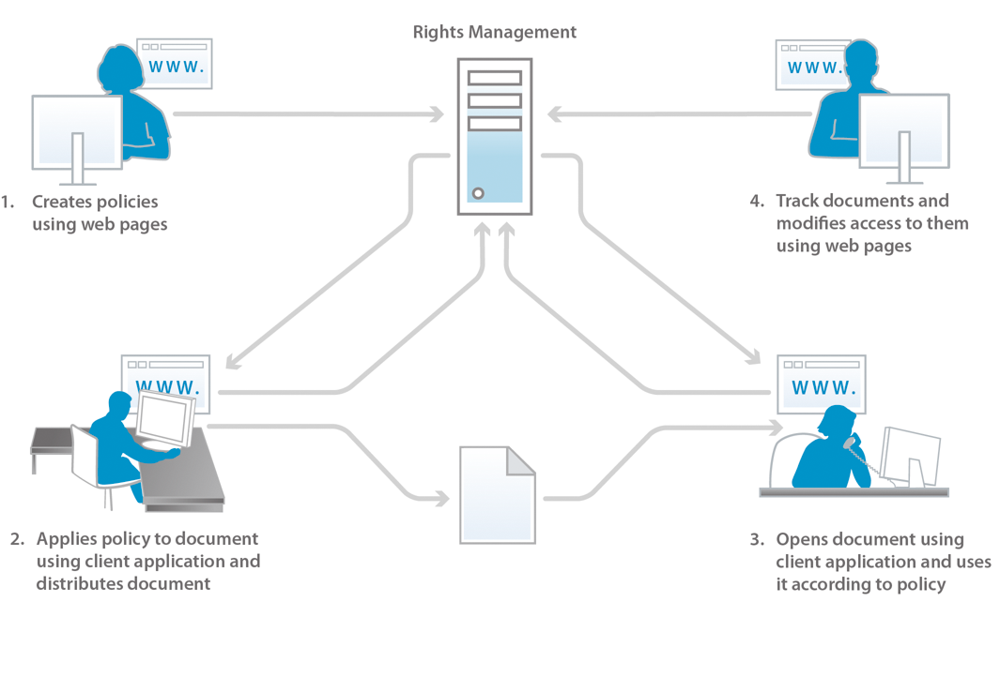

# Informazioni sulla protezione dei documenti {#about-document-security}

La sicurezza dei documenti garantisce che solo gli utenti autorizzati possano utilizzare i documenti. Utilizzando la protezione dei documenti, è possibile distribuire in modo sicuro tutte le informazioni salvate in un formato supportato. I formati di file supportati sono:

* File Adobe PDF
* File Microsoft® Word, Excel e PowerPoint

Per ulteriori informazioni sulla protezione dei tipi di file supportati tramite i criteri, vedere [Informazioni aggiuntive sulla protezione dei documenti](https://www.adobe.com/go/learn_aemforms_doc_security_63).

Utilizzando la protezione dei documenti, è possibile creare, memorizzare e applicare facilmente ai documenti impostazioni di riservatezza predefinite. Per evitare che le informazioni si diffondano oltre la tua portata, puoi anche monitorare e controllare il modo in cui i destinatari utilizzano i tuoi documenti dopo averli distribuiti.

È possibile proteggere i documenti utilizzando i criteri. Una *policy* è una raccolta di informazioni che comprendono impostazioni di riservatezza e un elenco di utenti autorizzati. Le impostazioni di riservatezza specificate in un criterio determinano in che modo un destinatario può utilizzare un documento a cui applicare il criterio. Ad esempio, è possibile specificare se i destinatari possono stampare o copiare testo, modificare testo o aggiungere firme e commenti ai documenti protetti.

Gli utenti della sicurezza dei documenti creano i criteri tramite le pagine web dell&#39;utente finale. Gli amministratori utilizzano le pagine Web di sicurezza dei documenti per creare set di criteri contenenti criteri condivisi disponibili per tutti gli utenti autorizzati.

Anche se i criteri sono memorizzati nella protezione dei documenti, è possibile applicarli ai documenti tramite l&#39;applicazione client. Come applicare i criteri ai documenti PDF è descritto in dettaglio in *Guida di Acrobat*. L&#39;applicazione di criteri utilizzando altre applicazioni, come Microsoft Office, è documentata nella *Guida delle estensioni Acrobat Reader DC* per l&#39;applicazione.

Quando si applica un criterio a un documento, le impostazioni di riservatezza specificate nel criterio proteggono le informazioni contenute nel documento. Le impostazioni di riservatezza proteggono anche i file (testo, audio o video) all’interno di un documento PDF. Puoi distribuire il documento protetto tramite criterio ai destinatari autorizzati dal criterio.

**Controllo e controllo dell&#39;accesso ai documenti**

L&#39;utilizzo di un criterio di protezione per un documento consente di controllare in modo continuativo il documento, anche dopo averlo distribuito. È possibile monitorare il documento, apportare modifiche al criterio, impedire agli utenti di continuare ad accedere al documento e cambiare il criterio applicato al documento.

Tramite la protezione dei documenti è possibile monitorare i documenti protetti da policy e tenere traccia degli eventi, ad esempio quando un utente autorizzato o non autorizzato tenta di aprire il documento.

**Componenti**

La sicurezza dei documenti è costituita da un server e da un&#39;interfaccia utente:

**Server:** il componente centrale attraverso il quale la sicurezza dei documenti esegue transazioni come l&#39;autenticazione degli utenti, la gestione in tempo reale dei criteri e l&#39;applicazione della riservatezza. Il server fornisce inoltre un archivio centrale per i criteri, i record di controllo e altre informazioni correlate.

**Pagine web:** interfaccia in cui vengono creati i criteri, gestiti i documenti protetti da policy e monitorati gli eventi associati ai documenti protetti da policy. Gli amministratori possono inoltre configurare opzioni globali quali l’autenticazione degli utenti, il controllo e la messaggistica per gli utenti invitati e gestire gli account utente invitati.

I passaggi nell&#39;illustrazione sono i seguenti:

1. Il proprietario del documento crea i criteri utilizzando le pagine Web. I proprietari dei documenti possono creare politiche personali accessibili solo a loro. Gli amministratori e i coordinatori dei set di criteri possono creare criteri condivisi all’interno di set di criteri accessibili agli utenti autorizzati.
1. Il proprietario del documento applica il criterio, quindi salva e distribuisce il documento. Il documento può essere distribuito tramite e-mail, tramite una cartella di rete o su un sito web.
1. Il destinatario apre il documento nell&#39;applicazione client appropriata. Il destinatario può utilizzare il documento in base ai propri criteri.
1. Il proprietario del documento, il coordinatore del set di criteri o l&#39;amministratore possono tenere traccia dei documenti e modificarne l&#39;accesso utilizzando le pagine web.

## Informazioni sugli utenti della sicurezza dei documenti {#about-document-security-users}

Diversi tipi di utenti utilizzano la protezione dei documenti per eseguire diverse attività:

* L&#39;amministratore di sistema o un altro utente dei sistemi di informazione (IS) installa e configura la protezione dei documenti. Questa persona può anche essere responsabile della configurazione delle impostazioni globali per il server, le pagine web, i criteri e i documenti.

   Queste impostazioni possono includere, ad esempio, un URL di sicurezza del documento di base, notifiche di controllo e privacy, avvisi di registrazione degli utenti invitati e periodi di leasing offline predefiniti.

* Gli amministratori della sicurezza dei documenti creano criteri e set di criteri e gestiscono i documenti protetti da policy per gli utenti in base alle esigenze. Inoltre, creano account utente invitati e monitorano gli eventi di sistema, documento, utente, criterio, set di criteri e personalizzati. Possono anche essere responsabili della configurazione del server globale, delle impostazioni delle pagine web e dei criteri insieme a un amministratore di sistema.

   Gli amministratori possono assegnare agli utenti i seguenti ruoli nell’area Gestione utente della console di amministrazione. Gli utenti a cui sono assegnati questi ruoli eseguono le proprie attività nell’area dell’interfaccia utente di sicurezza dei documenti della console di amministrazione.

   **Amministratore superiore della sicurezza dei documenti**

   Gli utenti con questo ruolo possono accedere a tutte le impostazioni di protezione dei documenti nella console di amministrazione. Queste autorizzazioni sono associate al ruolo :

   * Gestisci configurazione
   * Gestisci criteri
   * Gestisci set di criteri
   * Gestione dei documenti
   * Gestire gli editori di documenti
   * Gestione degli utenti invitati e locali
   * Visualizza eventi
   * Delega
   * Invitare utenti esterni

   **Amministratore della sicurezza dei documenti**

   Gli utenti con questo ruolo possono configurare il server di protezione dei documenti utilizzando la pagina Configurazione nella sezione Sicurezza dei documenti della console di amministrazione. Questa autorizzazione è associata al ruolo Gestisci configurazione.

   >[!NOTE]
   >
   >Gli utenti con questo ruolo devono anche avere il ruolo utente della console di amministrazione per poter accedere alla console di amministrazione e modificare le impostazioni relative alla configurazione.

   **Amministratore set di criteri di protezione documento**

   Gli utenti con questo ruolo possono utilizzare la sezione relativa alla sicurezza dei documenti della console di amministrazione per modificare i criteri degli altri utenti e per creare, modificare ed eliminare i set di criteri. Quando un amministratore di set di criteri crea un set di criteri, può assegnare un coordinatore di set di criteri a tale set di criteri. Queste autorizzazioni sono associate al ruolo :

   * Gestisci criteri
   * Gestisci set di criteri
   * Gestione dei documenti
   * Gestire gli editori di documenti
   * Visualizza eventi
   * Delega

   >[!NOTE]
   >
   >Gli utenti con questo ruolo devono anche avere il ruolo utente della console di amministrazione per poter accedere alla console di amministrazione e modificare le impostazioni relative alla configurazione.

   **Gestione della sicurezza dei documenti e utenti locali invitati**

   Gli utenti con questo ruolo possono eseguire le attività necessarie per gestire tutti gli utenti invitati e locali nelle pagine web relative alla sicurezza dei documenti. Queste autorizzazioni sono associate al ruolo :

   * Gestione degli utenti invitati e locali
   * Invitare utenti esterni
   * Accedere alle pagine web dell’utente finale

   >[!NOTE]
   >
   >Gli utenti con questo ruolo devono anche avere il ruolo utente della console di amministrazione per poter accedere alla console di amministrazione e modificare le impostazioni relative alla configurazione.

   **Utente invitato alla sicurezza dei documenti**

   Gli utenti con questo ruolo possono invitare gli utenti. Queste autorizzazioni sono associate al ruolo :

   * Invitare utenti esterni
   * Accedere alle pagine web dell’utente finale

   **Utente finale della sicurezza dei documenti**

   Gli utenti con questo ruolo possono accedere alle pagine web dell’utente finale per la sicurezza dei documenti. Questo ruolo può essere assegnato anche agli amministratori per consentire agli amministratori di creare criteri utilizzando le pagine degli utenti finali. Questa autorizzazione è associata al ruolo Accedi alle pagine web dell&#39;utente finale.

* Gli utenti all&#39;interno dell&#39;organizzazione che dispongono di account di protezione dei documenti validi creano criteri propri, utilizzano criteri per proteggere i documenti, tenere traccia e gestire i documenti protetti da policy e monitorare gli eventi correlati ai documenti.
* I coordinatori di set di criteri gestiscono documenti, visualizzano eventi e gestiscono altri coordinatori di set di criteri (in base alle loro autorizzazioni). Gli amministratori designano gli utenti come coordinatori di set di criteri per specifici set di criteri.
* Gli utenti esterni all&#39;organizzazione (ad esempio, un partner commerciale) possono utilizzare documenti protetti da policy se si trovano nella directory di sicurezza dei documenti, se l&#39;amministratore crea un account per tali documenti o se si registrano con sicurezza dei documenti tramite un processo di invito e-mail automatizzato. A seconda di come l&#39;amministratore abilita le impostazioni di accesso, gli utenti invitati possono anche disporre dell&#39;autorizzazione per applicare i criteri ai documenti, per creare, modificare ed eliminare i criteri e per invitare altri utenti esterni a utilizzare i documenti protetti da policy.
* Gli sviluppatori utilizzano l’SDK per moduli AEM per integrare applicazioni personalizzate con la sicurezza dei documenti.

Gli amministratori di sicurezza dei documenti possono creare ruoli personalizzati utilizzando le seguenti autorizzazioni in Gestione utente:

* Configurazione gestione della sicurezza dei documenti
* Gestione della sicurezza dei documenti: utenti invitati e locali
* Sicurezza dei documenti Gestisci set di criteri
* Sicurezza dei documenti Gestisci set di criteri
* Eventi server di visualizzazione della protezione dei documenti
* Proprietario dei criteri di modifica della protezione dei documenti

## Criteri e documenti protetti da policy {#policies-and-policy-protected-documents}

Un *criterio* definisce un set di impostazioni di riservatezza e di utenti che possono accedere a un documento a cui viene applicato il criterio. Un criterio consente inoltre di modificare dinamicamente le autorizzazioni di un documento. Consente alla persona che garantisce il permesso di modificare le impostazioni di riservatezza del documento per revocare l&#39;accesso al documento o per cambiare il criterio.

La protezione dei criteri può essere applicata a un documento PDF utilizzando Adobe Acrobat® Pro e Acrobat Standard. La protezione dei criteri può essere applicata ad altri tipi di file, come file Microsoft Word, Excel e PowerPoint, utilizzando l&#39;applicazione client con le estensioni Acrobat Reader DC appropriate installate.

### Funzionamento delle policy {#how-policies-work}

I criteri contengono informazioni sugli utenti autorizzati e le impostazioni di riservatezza da applicare ai documenti. Gli utenti possono essere qualsiasi nell’organizzazione, nonché persone esterne all’organizzazione che dispongono di un account. Se l’amministratore abilita la funzione di invito utente, è anche possibile aggiungere nuovi utenti ai criteri, quindi avviare un processo e-mail di invito alla registrazione.

Le impostazioni di riservatezza in un criterio determinano in che modo i destinatari possono utilizzare il documento. Ad esempio, è possibile specificare se i destinatari possono stampare o copiare testo, apportare modifiche o aggiungere firme e commenti ai documenti protetti. Lo stesso criterio può inoltre specificare impostazioni di riservatezza diverse per utenti specifici.

>[!NOTE]
>
>Le impostazioni di riservatezza applicate tramite un criterio sostituiscono tutte le impostazioni eventualmente applicate a un documento PDF in Acrobat utilizzando le opzioni di protezione relative alla password o al certificato. (Per ulteriori informazioni, consulta la Guida di Acrobat .)

Utenti e amministratori creano criteri tramite le pagine web di sicurezza dei documenti. A un documento è possibile applicare un solo criterio alla volta. È possibile applicare un criterio utilizzando uno dei seguenti metodi:

* Aprire il documento in Acrobat o in un&#39;altra applicazione client e selezionare un criterio per proteggere il documento.
* Invia un documento come allegato e-mail in Microsoft Outlook. In questo caso, puoi selezionare un criterio da un elenco di criteri o selezionare un criterio generato automaticamente da Acrobat con un set predefinito di impostazioni di riservatezza per proteggere il documento solo per i destinatari del messaggio e-mail.

È possibile rimuovere un criterio da un documento utilizzando l&#39;applicazione client.

I passaggi nel diagramma sono i seguenti:

1. Il proprietario del documento protegge il documento da un&#39;applicazione client supportata con un criterio che consente l&#39;utilizzo online.
1. La protezione dei documenti crea una licenza del documento e le chiavi del documento e crittografa il criterio. La licenza del documento, i criteri crittografati e la chiave del documento vengono restituiti all&#39;applicazione client.
1. Il documento viene crittografato con la chiave del documento e la chiave del documento viene scartata. Il documento ora incorpora la licenza e il criterio. Queste attività vengono eseguite nell&#39;applicazione client supportata.

Quando si applica un criterio a un documento, le informazioni contenute nel documento, compresi eventuali file contenuti (testo, audio o video) nei documenti PDF, sono protette dalle impostazioni di riservatezza specificate nel criterio. La protezione dei documenti genera una licenza e informazioni di crittografia che vengono quindi incorporate nel documento. Quando si distribuisce il documento, la protezione del documento può autenticare i destinatari che tentano di aprire il documento e autorizzare l&#39;accesso in base ai privilegi specificati nel criterio.

Se l’utilizzo offline è abilitato, i destinatari possono inoltre utilizzare documenti protetti da policy offline (senza una connessione Internet o di rete attiva) per il periodo di tempo specificato nel criterio.

### Funzionamento dei documenti protetti da policy {#how-policy-protected-documents-work}

Per aprire e utilizzare documenti protetti da policy, il criterio deve includere il tuo nome come destinatario e devi disporre di un account di sicurezza documento valido. Per i documenti PDF è necessario Acrobat o Adobe Reader®. Per altri tipi di file, è necessaria l&#39;applicazione appropriata per il file con le estensioni Acrobat Reader DC installate.

Quando si tenta di aprire un documento protetto da policy, Acrobat, Adobe Reader o le estensioni Acrobat Reader DC si collegano alla protezione dei documenti per l&#39;autenticazione. Quindi, puoi procedere all&#39;accesso. Se l&#39;utilizzo del documento è in corso di revisione, viene visualizzato un messaggio di notifica. Dopo che la sicurezza del documento determina quali autorizzazioni del documento concedere, gestisce la decrittografia del documento. È quindi possibile utilizzare il documento in base alle impostazioni di riservatezza dei criteri.

I passaggi nel diagramma sono i seguenti:

1. L&#39;utente del documento apre il documento in un&#39;applicazione client supportata e si autentica con il server. L&#39;identificatore del documento viene inviato al server di protezione dei documenti.
1. La sicurezza dei documenti autentica gli utenti, controlla i criteri di autorizzazione e crea un voucher. Il voucher (che contiene la chiave del documento e le autorizzazioni) viene restituito all&#39;applicazione client.
1. Il documento viene decrittografato con la chiave del documento e la chiave del documento viene scartata. Il documento può quindi essere utilizzato in base alle impostazioni di riservatezza della politica. Queste attività vengono eseguite nell&#39;applicazione client supportata.

È possibile continuare a utilizzare un documento nelle seguenti condizioni:

* Indefinitamente o per il periodo di validità specificato nel criterio
* Fino a quando l&#39;amministratore o la persona che ha applicato il criterio revoca l&#39;accesso al documento o modifica il criterio

È inoltre possibile utilizzare documenti protetti da policy offline (senza connessione a Internet o di rete) se il criterio consente l&#39;accesso offline. Per sincronizzare il documento, è innanzitutto necessario effettuare l&#39;accesso a per proteggere i documenti. Puoi quindi utilizzare il documento per la durata del periodo di lease offline specificato nel criterio.

Al termine del periodo di lease offline, è necessario sincronizzare nuovamente il documento con la sicurezza del documento, sia accedendo online e aprendo un documento protetto da policy, sia utilizzando un comando nell&#39;applicazione client. (Per ulteriori informazioni, consulta la *Guida di Acrobat* o la *Guida delle estensioni Acrobat Reader DC* appropriata.)

Se si salva una copia di un documento protetto tramite il comando Salva o Salva con nome, il criterio viene applicato e applicato automaticamente per il nuovo documento. Eventi quali i tentativi di aprire il nuovo documento vengono anche verificati e registrati per il documento originale.

## Set di criteri {#policy-sets}

*I* set di criteri vengono utilizzati per raggruppare un insieme di criteri con uno scopo aziendale comune. Questi set di criteri vengono quindi resi disponibili a un sottoinsieme di utenti nel sistema.

A ciascun set di criteri possono essere associati uno o più coordinatori di set di criteri. Il coordinatore del set di criteri è un amministratore o un utente con autorizzazioni aggiuntive. Il *coordinatore del set di criteri* è tipicamente uno specialista dell&#39;organizzazione che può creare al meglio i criteri in un particolare set di criteri.

I coordinatori dei set di criteri possono eseguire le seguenti attività:

* Creare nuovi criteri
* Modificare ed eliminare i criteri nel set di criteri
* Modifica impostazioni set di criteri
* Aggiungi e rimuovi coordinatori set di criteri
* Visualizza eventi di criteri e documenti per qualsiasi criterio o documento all&#39;interno del set di criteri
* Revoca dell’accesso ai documenti
* Cambiare i criteri per il documento.

>[!NOTE]
>
>È possibile recuperare un massimo di 1000 nomi di set di criteri dal database.

I set di criteri vengono creati ed eliminati nelle pagine web di amministrazione della sicurezza dei documenti da amministratori e coordinatori dei set di criteri che dispongono delle autorizzazioni necessarie.

I set di criteri sono generalmente resi disponibili a un numero limitato di utenti specificando quali utenti o gruppi all’interno di un dominio possono utilizzare i criteri del set di criteri per proteggere i documenti.

Quando si installa la protezione dei documenti, viene creato un set di criteri predefinito denominato *Set di criteri globali*. L&#39;amministratore che ha installato il software gestisce questo set di criteri.
